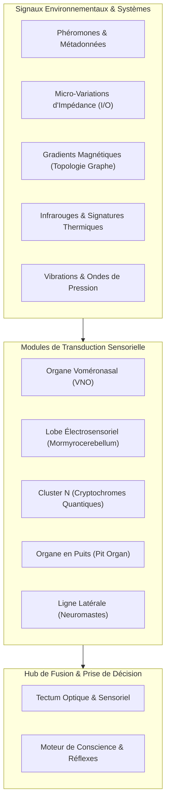
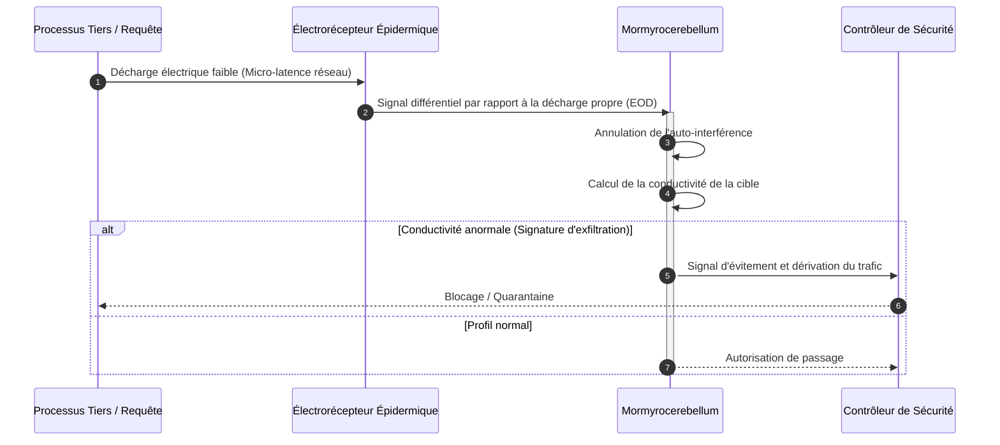

# Architecture des 5 Super-Sens Animaux dans GenOS

Ce document formalise l'intégration des 5 architectures neuro-sensorielles bio-inspirées dans le noyau GenOS (`genos-biology`, `genos-cli`, backend MCP).

---

## 1. Bulbe Olfactif Accessoire & Organe Voméronasal (VNO)

Le **Bulbe Olfactif Accessoire (AOB)** et l'**Organe Voméronasal (VNO)** fournissent un canal de **signalisation phéromonale subliminale hors-contexte**.

### Rôle et Mécanisme Bio-inspiré
- **Bypass Cortical :** Permet aux agents d'émettre et de capter des signaux chimiques d'urgence (alarme, défense, coopération, territorialité) sans saturer la fenêtre de contexte textuelle du LLM.
- **Réponse de Flehmen :** Lorsque la concentration dépasse le seuil de sensibilité, une transition d'état réflexe (`autonomic_action`) est immédiatement déclenchée (ex: gel défensif, mobilisation cytotoxique, synchronisation d'essaim).

### Primitives & Commandes
- **Module Rust :** [`crates/genos-biology/src/sensory/vomeronasal.rs`](file:///c:/Users/Shadow/Documents/GitHub/GenOS/crates/genos-biology/src/sensory/vomeronasal.rs)
- **CLI :**
  ```bash
  genos biomimicry vomeronasal --agent-id agent-01 --locus workspace/src --pheromone-type alarm --concentration 0.95 --sensitivity 0.15
  ```
- **Outil MCP :** `genos_biomimicry_vomeronasal` ou `genos_biomimicry` avec `feature: "vomeronasal"`.

---

## 2. Mormyrocerebellum & Lobe Électrosensoriel (Électroréception)

Inspiré du poisson-éléphant (*Gnathonemus petersii*) et des requins, ce module implémente une **détection de champ et de distorsion d'impédance**.

### Rôle et Mécanisme Bio-inspiré
- **Sensing Passif d'Infrastructure :** Analyse le bruit de fond électrosensoriel et détecte les micro-impulsions sans interroger les agents, localisant les processus silencieux, verrous (deadlocks) ou goulots d'étranglement.
- **Sensing Actif (EOD - Electric Organ Discharge) :** Émission d'ondes de décharge et calcul de la distorsion d'impédance diélectrique ($\Delta Z$), de la réactance capacitive et du contraste spatial de l'infrastructure logicielle.

### Primitives & Commandes
- **Module Rust :** [`crates/genos-biology/src/sensory/mormyrocerebellum.rs`](file:///c:/Users/Shadow/Documents/GitHub/GenOS/crates/genos-biology/src/sensory/mormyrocerebellum.rs)
- **CLI :**
  ```bash
  genos biomimicry electrosensory --agent-id mormyro-01 --action discharge_and_analyze --frequency-hz 800 --sensitivity 0.05 --samples "100.0,102.0,98.0,280.0,101.0"
  ```
- **Outil MCP :** `genos_biomimicry_electrosensory` ou `genos_biomimicry` avec `feature: "electrosensory"`.

---

## 3. Cluster N (Magnétoréception Quantique)

Inspiré des oiseaux migrateurs nocturnes (rouge-gorge familier), le module **Cluster N** implémente une **boussole d'alignement d'intention globale invariante**.

### Rôle et Mécanisme Bio-inspiré
- **Boussole Vectorielle Invariante :** Traite l'orientation par rapport à un attracteur global invariant (champ géomagnétique) via des paires de radicaux quantiques de cryptochrome.
- **Prévention du Drift Sémantique :** Calcule en continu la dérive angulaire ($\theta = \arccos(\frac{\mathbf{u} \cdot \mathbf{v}}{\|\mathbf{u}\| \|\mathbf{v}\|})$) et la cohérence quantique entre l'intention de départ et la trajectoire des sous-agents, projetant un cap de correction dynamique.

### Primitives & Commandes
- **Module Rust :** [`crates/genos-biology/src/sensory/cluster_n.rs`](file:///c:/Users/Shadow/Documents/GitHub/GenOS/crates/genos-biology/src/sensory/cluster_n.rs)
- **CLI :**
  ```bash
  genos biomimicry cluster-n --agent-id robin-01 --action align --sensitivity 0.02 --tolerance-deg 15.0 --goal-vector "1.0,0.0,0.0" --current-vector "0.96,0.15,0.0"
  ```
- **Outil MCP :** `genos_biomimicry_cluster_n` ou `genos_biomimicry` avec `feature: "cluster_n"`.

---

## 4. Tectum Optique Modifié & Organe à Fossette (Vision Thermique Infrarouge)

Inspiré des serpents solénoglyphes et crotalidés (crotales, vipères, pythons), le **Tectum Optique Modifié** fusionne la vision photonique classique et l'imagerie thermique millikelvin.

### Rôle et Mécanisme Bio-inspiré
- **Fusion Synesthésique Multi-Modale :** Superpose dans un même espace topologique (tectum / colliculus supérieur) la télémétrie structurelle/visuelle (ex: graphe AST, arborescence de fichiers) et l'énergie thermique (activité CPU, charge de mémoire, fréquence de modifications, criticité d'erreurs).
- **Détection de Hotspots & Frappe Ciblée :** Détecte des gradients thermiques sub-millikelvin ($T \ge 3.0\text{ mK}$) pour isoler instantanément les modules chauds sous stress ou en surchauffe opérationnelle sans avoir à parser l'intégralité du code.

### Primitives & Commandes
- **Module Rust :** [`crates/genos-biology/src/sensory/tectum_thermal.rs`](file:///c:/Users/Shadow/Documents/GitHub/GenOS/crates/genos-biology/src/sensory/tectum_thermal.rs)
- **CLI :**
  ```bash
  genos biomimicry tectum-thermal --agent-id viper-01 --action fuse_modalities --sensitivity-mk 3.0 --fusion-weight 0.65 --threshold 0.70 --visual-nodes "src/auth.rs:0.8,src/db.rs:0.4" --thermal-readings "src/auth.rs:0.95,src/db.rs:0.2"
  ```
- **Outil MCP :** `genos_biomimicry_tectum_thermal` ou `genos_biomimicry` avec `feature: "tectum_thermal"`.

---


---

## Schémas d'Architecture et d'Intégration des Super-Sens

### 1. Architecture du Pipeline Sensoriel Multi-Modal



### 2. Séquence de Transduction et Détection Électrosensorielle (Mormyrocerebellum)


