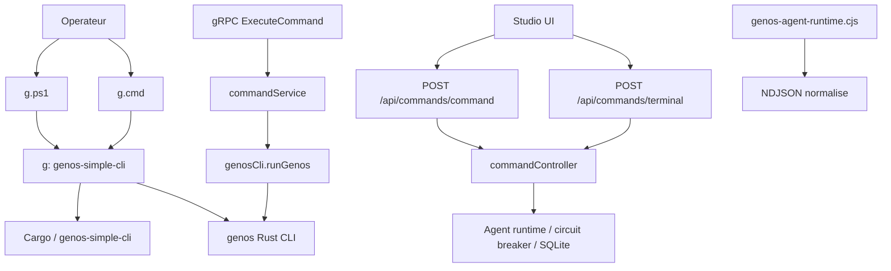
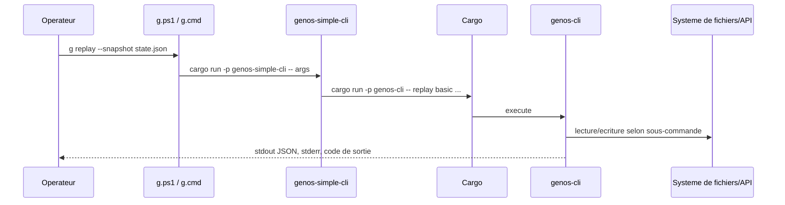
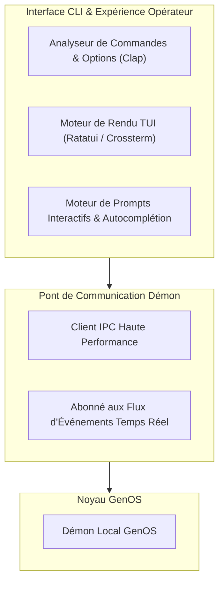
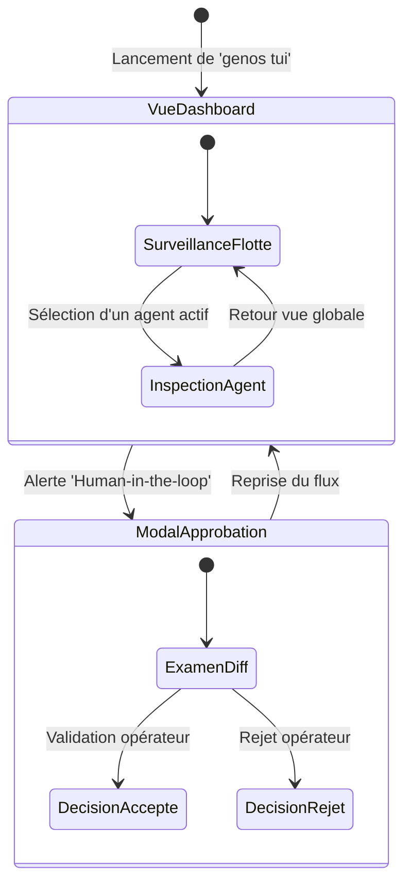

# CLI et expérience opérateur

## 1. Objet

Cette documentation décrit les interfaces opérateur réellement présentes dans GenOS : le binaire Rust `genos`, la façade ergonomique `g`, les wrappers Windows, la Command Palette, le Terminal Studio et le bridge gRPC de commandes.

Elle distingue volontairement trois choses souvent confondues :

- une commande acceptée par une interface ;
- une commande qui déclenche une exécution réelle ;
- une commande qui valide, dérive ou simule un résultat sans modifier le monde externe.

Les sources principales sont :

- [crates/genos-cli/src/main.rs](../crates/genos-cli/src/main.rs)
- [crates/genos-cli/src/args/mod.rs](../crates/genos-cli/src/args/mod.rs)
- [crates/genos-simple-cli/src/main.rs](../crates/genos-simple-cli/src/main.rs)
- [g.ps1](../g.ps1) et [g.cmd](../g.cmd)
- [backend/src/services/genosCli.js](../backend/src/services/genosCli.js)
- [backend/src/controllers/commandController.js](../backend/src/controllers/commandController.js)
- [backend/src/routes/commandRoutes.js](../backend/src/routes/commandRoutes.js)
- [backend/src/grpc_services/commandService.js](../backend/src/grpc_services/commandService.js)
- [backend/bin/genos-agent-runtime.cjs](../backend/bin/genos-agent-runtime.cjs)

---

## 2. Définition

L'expérience opérateur GenOS est un ensemble de façades autour de deux plans d'exécution :

1. le plan natif Rust, via le binaire `genos` ;
2. le plan de contrôle Node.js, via les APIs Studio, les outils MCP et les runtimes d'agents.

`g` n'est pas un alias passif : c'est une CLI de simplification des verbes GenOS. Elle fournit des noms de commande opérateur, des valeurs par défaut, une confirmation explicite pour quatre opérations à effets de bord, et la gestion du serveur local. Elle délègue ensuite en grande partie à `genos-cli` par `cargo run -p genos-cli -- ...`.

La Command Palette et le Terminal Studio ne sont pas des shells arbitraires. Ce sont des endpoints HTTP authentifiés qui acceptent une liste fermée d'actions ou de commandes. Le bridge gRPC est également limité à une sous-commande native unique, sans espaces ni chemin dans le champ `command`.

On peut résumer la chaîne d'opération par :

$$
\text{intention opérateur} \rightarrow \text{façade} \rightarrow \text{contrat d'entrée} \rightarrow \text{exécuteur} \rightarrow \text{sortie + code + trace}
$$

L'interface ne doit pas être assimilée au résultat : une sortie JSON avec `success: true` signifie qu'un handler a accepté et terminé l'opération déclarée. Elle ne prouve ni la correction d'un diagnostic ni la réussite d'une tâche externe sans preuve indépendante.

---

## 3. Architecture



### 3.1 `genos` : noyau CLI Rust

Le binaire `genos` est défini dans `crates/genos-cli`. Il expose des sous-commandes structurées avec `clap` : `agent`, `snapshot`, `diff`, `hallucination`, `replay`, `capsule`, `audit`, `merge`, `experiment`, `world`, `platform`, `resilience`, `ais`, `synaptic`, `fossil`, `serve` et `desktop`.

Le point d'entrée appelle le handler Rust correspondant puis :

- imprime les sorties métier principalement au format JSON sur stdout ;
- écrit une erreur préfixée par `ERREUR GenOS CLI:` sur stderr ;
- termine par le code `1` quand un handler retourne une erreur.

Il n'existe pas de flag global uniforme `--json` car le contrat natif est déjà, pour beaucoup de handlers, JSON par défaut. La forme exacte reste cependant propre à chaque sous-commande : certains handlers emploient du JSON compact, d'autres du JSON pretty-printé, et l'aide `clap` est du texte humain.

### 3.2 `g` : façade opérateur

Le binaire `g` est le crate `genos-simple-cli`. Il transforme des verbes concis comme `g init`, `g replay`, `g diff`, `g debug`, `g merge` ou `g start` en commandes natives plus détaillées.

Exemples réels de délégation :

| Commande `g` | Délégation ou effet |
|---|---|
| `g init` | `genos init` |
| `g run` | crée l'agent `task-worker` via `genos agent create` |
| `g replay` | `genos replay basic` ; défaut `latest-snapshot` |
| `g blame` | `genos hallucination analyze` |
| `g copy` | `genos snapshot create` |
| `g start` | lance `genos serve` via Cargo en arrière-plan |
| `g stop` | termine le PID enregistré avec `taskkill` sous Windows |

Les verbes sont plus nombreux que cette table. Ils restent des raccourcis et doivent être lus à travers la délégation affichée par `g <commande> --help`.

### 3.3 Windows et PowerShell

Le dépôt fournit deux points d'entrée Windows :

- [g.ps1](../g.ps1) résout `cargo`, puis tente `$HOME\.cargo\bin\cargo.exe`, exécute `cargo run -q -p genos-simple-cli -- $args` et retransmet `$LASTEXITCODE` ;
- [g.cmd](../g.cmd) fait la même résolution avec `where cargo`, puis `%USERPROFILE%\.cargo\bin\cargo.exe`, et renvoie `%ERRORLEVEL%`.

La CLI Rust renforce ce support : sous Windows, elle ajoute le dossier parent de `cargo.exe` au `PATH` si nécessaire ; `g stop` utilise `taskkill /F /T /PID` au lieu de `kill`.

Ces wrappers rendent `g` praticable dans PowerShell et `cmd.exe`, mais nécessitent toujours Cargo ou un environnement Rust correctement installé. Ils ne distribuent pas à eux seuls un binaire `g.exe` autonome.

---

## 4. Processus d'exécution

### 4.1 Chemin CLI local



### 4.2 Chemin Studio

Les routes [backend/src/routes/commandRoutes.js](../backend/src/routes/commandRoutes.js) exigent un tenant explicite et le rôle `admin` ou `operator`.

La palette reçoit un objet `{ action, agentId, workspaceId, params }`. Avant l'exécution, le contrôleur émet un événement `COMMAND_DISPATCHED`. Les actions admises sont :

- `fork_agent` ;
- `kill_agent` ;
- `inspect_state` ;
- `reboot_studio` ;
- `snapshot_workspace`.

Le Terminal Studio reçoit `{ command }` et ne reconnaît que :

- `help` ;
- `status` ;
- `halt` ou `abort` ;
- `resume` ;
- `agents` ;
- `ping` ;
- `clear`.

Ce n'est donc pas une exécution shell. Une commande comme `rm -rf` ou `cargo test` est refusée par `UNSUPPORTED_COMMAND` au lieu d'être interprétée par un shell.

### 4.3 Bridge Node vers `genos`

Le service [backend/src/services/genosCli.js](../backend/src/services/genosCli.js) permet au Studio d'invoquer le binaire Rust réel. Il :

- recherche d'abord `GENOS_BIN`, puis `target/debug/genos`, puis `target/release/genos` ;
- crée et utilise un root séparé, par défaut `.genos-matrix` ;
- filtre l'environnement transmis au processus enfant ;
- cache la fenêtre enfant sous Windows ;
- borne stdout/stderr et applique un timeout ;
- retourne un objet structuré avec `ok`, `exitCode`, `stdout`, `stderr` et, si possible, `json`.

L'environnement enfant n'hérite pas aveuglément de `process.env`. Seules des variables système sûres et les variables `GENOS_` non sensibles sont transférées. Les noms contenant `TOKEN`, `SECRET`, `KEY`, `PASSWORD`, `CREDENTIAL` ou `API` sont écartés.

En cas d'absence du binaire Rust compilé (ex: environnement d'évaluation ou machine sans toolchain Cargo/Rust), le système bascule de façon transparente sur le fallback natif Node.js (`[GENOS_FALLBACK]`). Les commandes MCP (`genos_snapshot`, `genos_replay`, `genos_capsule_create`, etc.) et la création des capsules agent (`provisionSynthetic`) sont exécutées directement par le bridge Node sans crasher.

### 4.4 Suite CLI Node (`backend/bin/`) et découverte via `--help`

Le répertoire `backend/bin/` contient les points d'entrée opérationnels et bridges d'exécution de GenOS. Tous ces binaires intègrent le module de découverte [`cliHelp.cjs`](../backend/bin/cliHelp.cjs) et répondent immédiatement aux flags `--help` et `-h` avec le code de sortie `0` :

- **`genos-orchestrate.cjs`** : Orchestrateur autonome (`orchestrate`, `dispatch_worker`, `dispatch_team`, `dispatch_trinity`, `dispatch_biological`).
- **`orchestratorActions.cjs`** : Gestionnaire granulaire d'actions d'orchestration (`report_progress`, `change_strategy`, `change_organization`, `execute_primitive`).
- **`genos-apoptosis.cjs`** : Déclenchement d'urgence et réconciliation de l'apoptose cellulaire.
- **`genos-daemon.cjs`** : Démon de surveillance en arrière-plan et gestionnaire de l'auto-démarrage OS.
- **`genos-ateam-audit.js`** : Audit de couverture de compétences des missions A-Team (`--mission`, `--subsystems`).
- **`genos-recent-tasks.cjs`** : Consultation des dernières missions et trajectoires enregistrées.
- **`genos-agent-runtime.cjs`** : Bridge d'exécution bas-niveau communiquant via protobuf / JSON cadré.
- **`genos-computer-use.cjs`** : Automatisation d'actions d'environnement et de bureau (avec fallback synthétique et simulation sécurisée en environnement headless/CI).

La commande `node backend/bin/cliHelp.cjs` affiche l'index complet de découverte de tous les outils disponibles.

---

## 5. Confirmation des actions destructives

La confirmation ne repose pas sur une question interactive ambiguë ; elle est déclarative et testable.

### 5.1 `g --yes`

`g` impose `--yes` pour quatre commandes :

- `g destroy` ;
- `g wipe` ;
- `g close` ;
- `g keep`.

Sans ce flag, le programme imprime :

```text
Cette commande modifie l'état GenOS. Relancez-la avec --yes pour confirmer.
```

et termine avec le code `2`.

Cette politique est volontairement placée avant le `match` des handlers : l'action sous-jacente n'est pas lancée.

### 5.2 Palette Studio

La palette exige `confirmed: true` pour :

- `kill_agent` ;
- `reboot_studio`.

L'absence de confirmation produit HTTP `409` avec le code métier `CONFIRMATION_REQUIRED`.

### 5.3 Terminal Studio

`halt` / `abort` active réellement le kill switch du circuit breaker et bloque les nouvelles invocations MCP. Il ne termine pas les runtimes externes déjà en cours, ce qui est communiqué dans la sortie. `resume` réinitialise le halt du backend.

---

## 6. Erreurs et codes de sortie

### 6.1 Convention locale

| Situation | Canal | Code |
|---|---|---|
| Handler Rust réussi | stdout JSON ou texte | `0` |
| Erreur métier d'un handler `genos` | stderr `ERREUR GenOS CLI: ...` | `1` |
| Sous-processus appelé par `g` échoue | code sous-jacent retransmis | code du processus enfant, fallback `1` |
| `g` sans `--yes` pour une action protégée | stderr | `2` |
| `g status` serveur absent/injoignable | stdout diagnostic | `1` |
| `g stop` sans fichier PID | stdout diagnostic | `1` |
| impossible de trouver Cargo via wrapper | exception PowerShell ou message CMD | non-zéro, `1` pour `g.cmd` |

La fonction `exit_on_command_failure` dans `g` conserve le code du programme délégué si disponible. Cela rend les scripts PowerShell, CI et automate capables de distinguer succès et échec sans parser l'affichage humain.

### 6.2 Convention HTTP Studio

| Cas | HTTP | Code JSON |
|---|---:|---|
| paramètre agent absent | `400` | `AGENT_REQUIRED` |
| agent/workspace absent ou hors tenant | `404` | `AGENT_NOT_FOUND` ou `WORKSPACE_NOT_FOUND` |
| confirmation manquante | `409` | `CONFIRMATION_REQUIRED` |
| action/commande inconnue | `400` | `UNSUPPORTED_COMMAND` |
| snapshot créé | `201` | `success: true` |
| reboot demandé | `202` | `success: true`, `restartRequired: true` |

### 6.3 Convention gRPC

`ExecuteCommand` refuse les valeurs qui ne sont pas une sous-commande native unique : vide, `genos`, une valeur contenant espace, `/` ou `\\`.

Dans ce cas il renvoie :

```json
{
  "exit_code": 2,
  "success": false,
  "status": "invalid_command",
  "stderr": "command must be one native GenOS subcommand."
}
```

Pour une commande exécutée, le bridge propage `exit_code`, `stdout`, `stderr` et un état `completed`, `failed`, `BIN_NOT_FOUND`, `TIMEOUT` ou `SPAWN_FAILED`.

---

## 7. Sorties JSON et NDJSON

### 7.1 JSON CLI

Les handlers Rust publient souvent un objet JSON. Par exemple, `replay basic` produit les identifiants du snapshot, les étapes vérifiées, les hash et un booléen `execution_replayed`.

```json
{
  "success": true,
  "operation": "replay_basic",
  "replay_status": "VERIFIED",
  "execution_replayed": true
}
```

Le consommateur doit néanmoins considérer la structure de chaque sous-commande comme son contrat propre. Il n'y a pas de schéma transversal garantissant des clés identiques pour chaque commande.

### 7.2 NDJSON runtime

Le fichier [backend/bin/genos-agent-runtime.cjs](../backend/bin/genos-agent-runtime.cjs) n'est pas une commande `genos` utilisateur. C'est un bridge de mission : il lit une mission protobuf encadrée, ou une entrée JSON héritée, puis produit un événement NDJSON normalisé par étape significative du cycle de vie Codex.

NDJSON est pertinent ici car le runtime doit transmettre une suite d'événements streaming :

$$
E = e_1 \newline e_2 \newline \dots \newline e_n
$$

où chaque ligne est un événement indépendant, sérialisable et consommable au fil de l'eau. Ce n'est pas le format de sortie universel du binaire `genos`.

### 7.3 Parsing du bridge Studio

`genosCli.runGenos()` tente `JSON.parse(stdout)` une fois le processus fermé. Si stdout est un unique document JSON valide, il est exposé dans `json` et `data`; sinon la sortie demeure dans `stdout`, sans transformation silencieuse.

---

## 8. Actions réellement exécutées, validation et simulation

| Surface | Actions appliquées | Validation, dérivation ou limite |
|---|---|---|
| `genos init` | crée `snapshots/` et `capsules/` | aucune transaction globale de workspace |
| agent/snapshot/capsule selon handler | lit ou écrit des fichiers et états locaux | la sémantique dépend de la sous-commande |
| `genos replay basic` | relit le snapshot, recalcule la chaîne de hash des étapes, échoue si elle est rompue | ne relance pas arbitrairement les modèles, outils, réseau ou processus originaux ; `execution_replayed` signifie ici vérification/reconstitution de la trace enregistrée |
| `genos desktop action(s)` | appelle réellement le module sensorimoteur pour capturer ou agir sur le desktop | échec retourné en JSON puis code non nul |
| `g start` / `g stop` | lance le serveur ou termine le PID enregistré | `stop` vérifie l'état HTTP et le port après tentative |
| Command Palette `fork_agent` / `kill_agent` / `snapshot_workspace` | clone via le contrôleur de lignée, arrête une mission et met à jour l'état, ou capture un snapshot | soumis au rôle, tenant, existence des ressources et confirmation pour `kill_agent` |
| Terminal `halt` / `resume` | persiste/réinitialise le blocage des nouvelles invocations MCP | `halt` ne tue pas les runtimes externes existants |
| runtime agent | délègue réellement à Codex quand celui-ci est configuré et autorisé | sa sortie NDJSON renseigne le déroulé mais ne constitue pas seule une preuve de correction |

La règle de lecture correcte est :

$$
\text{effet attesté} = \text{réponse du handler} \land \text{artefact persistant ou résultat système} \land \text{preuve adaptée}
$$

Un statut de processus à zéro garantit seulement l'achèvement du programme, pas la validité métier de son résultat.

---

## 9. Mathématiques de l'expérience opérateur

### 9.1 Autorisation et confirmation

Pour une action Studio destructive :

$$
\text{permettre} = \text{rôle}(u) \in \{admin, operator\} \land \text{tenant}(r) \land confirmed = true
$$

Pour `g`, la confirmation est un prédicat de la forme :

$$
\text{run}(c) = \neg destructive(c) \lor yes
$$

Pour les quatre commandes protégées, $yes = false$ implique une sortie immédiate avec code $2$.

### 9.2 Fiabilité de l'interface

Une commande opérateur doit séparer deux probabilités :

$$
P(\text{commande termine}) \neq P(\text{objectif métier atteint})
$$

Les codes de sortie rendent observable la première. Tests, artefacts persistés, hash de trace et validation indépendante contribuent à la seconde.

### 9.3 Flux streaming

Pour le runtime NDJSON, l'observabilité est une séquence ordonnée d'événements :

$$
\mathcal{T} = \langle e_1, e_2, \ldots, e_n \rangle
$$

Cette forme réduit la latence de perception pour l'opérateur : il voit le progrès avant la fin de la mission, sans attendre un document JSON monolithique.

---

## 10. Lecture biologique

La métaphore biologique de GenOS est utile si elle reste attachée aux mécanismes réels.

- `genos` est le noyau métabolique : il exécute les transformations locales sur snapshots, capsules et états.
- `g` est l'organe de préhension : il rend les opérations usuelles accessibles par une nomenclature courte et des défauts opérateurs.
- la Command Palette est le cortex exécutif : elle traduit une intention UI limitée en ordre contrôlé.
- le Terminal Studio est un tronc cérébral : petit jeu de commandes opératoires, arrêt et reprise du système plutôt qu'accès libre à toutes les fonctions.
- le circuit breaker et `halt` sont une réponse protectrice : ils suspendent de nouvelles invocations lorsque l'état doit être stabilisé.
- le NDJSON runtime représente des signaux nerveux successifs, pas une conscience ni une preuve biologique.

Cette analogie décrit l'organisation du logiciel. Elle ne prétend pas que GenOS est un système biologique ou conscient.

---

## 11. Cas d'utilisation

### 11.1 Opération locale sous PowerShell

```powershell
.\g.ps1 init
.\g.ps1 snapshot create --agent worker-a --out snapshots\worker-a.json
```

Le wrapper transmet la commande à `genos-simple-cli`, qui délègue le second appel à `genos`. Le script appelant peut utiliser `$LASTEXITCODE` pour décider de poursuivre.

### 11.2 Confirmation d'un effacement

```powershell
.\g.ps1 wipe
# code 2 : confirmation absente

.\g.ps1 --yes wipe
# délègue l'élagage demandé
```

`--yes` confirme l'intention. Il ne rend pas automatiquement l'opération correcte ou réversible.

### 11.3 Snapshot par la palette

```json
POST /api/commands/command
{
  "action": "snapshot_workspace",
  "workspaceId": "workspace-42",
  "params": { "label": "Avant migration" }
}
```

Le backend vérifie le tenant, cherche le workspace dans ce scope puis appelle `workspaceSnapshotStore.capture`. Une réussite retourne HTTP `201` avec l'objet snapshot.

### 11.4 Arrêt d'urgence Studio

```json
POST /api/commands/terminal
{ "command": "halt" }
```

La réponse confirme le kill switch et précise qu'il bloque les nouveaux appels MCP. L'opérateur doit ensuite stopper les runtimes externes en cours par leur superviseur si nécessaire.

### 11.5 Appel automatisé gRPC

```text
ExecuteCommand(command="snapshot", args=["create", "--out", "state.json"])
```

Le service accepte `snapshot`, transmet les arguments sans shell, puis renvoie les flux et `exit_code`. En revanche `command="node -e evil"` est refusé avec `invalid_command` et `exit_code: 2`.

---

## 12. Comparaison avec le marché

| Dimension | GenOS | Outils CLI modernes |
|---|---|---|
| CLI native | binaire Rust `clap`, nombreuses sous-commandes biomimétiques et de runtime | Rust/Cobra/Click avec contrats homogènes plus fréquents |
| CLI ergonomique | `g` ajoute vocabulaire, défauts et `--yes` | wrappers comme `gh`, `kubectl` plugins, Terraform UX |
| Confirmation destructive | explicite sur quatre verbes `g`; JSON `confirmed: true` pour deux actions palette | confirmations interactives, `--yes`, ou politiques RBAC selon outil |
| Formats machine | JSON fréquent mais non uniformisé ; NDJSON dédié au runtime d'agents | `--json` ou `-o json` généralement stable, parfois NDJSON de streaming |
| Terminal intégré | liste fermée d'ordres de contrôle, pas un shell | shell intégré ou terminal complet dans VS Code, Kubernetes dashboards, consoles cloud |
| Automatisation | wrappers Windows, sorties/codes, gRPC contraint, bridge Rust | CI-first avec schémas de sortie et codes normalisés |
| Sécurité d'exécution | tenant, rôle, confirmation, root isolé, environnement filtré, circuit breaker | RBAC/IAM, sandbox, politiques admission, audit centralisé |

Le point distinctif de GenOS est la coexistence d'une interface locale biomimétique, d'une façade Studio contrôlée et d'un runtime agent streaming. Sa limite actuelle est l'absence d'un contrat global de sortie machine : les intégrateurs doivent cibler les schémas de chaque sous-commande et ne pas supposer que toute sortie est NDJSON ou qu'un `success` atteste une correction métier.

---

## 13. Recommandations d'exploitation

1. Utiliser `g <commande> --help` avant d'automatiser un raccourci, afin de vérifier sa délégation et ses valeurs par défaut.
2. Traiter stdout JSON, stderr et code de sortie ensemble dans les scripts.
3. Préférer le bridge gRPC ou les commandes `genos` structurées à toute construction de shell.
4. Envoyer `confirmed: true` seulement après une étape UI ou runbook qui expose les effets attendus.
5. Considérer `halt` comme un blocage des futurs appels MCP, non comme l'arrêt universel de chaque processus externe.
6. Vérifier un artefact, un snapshot, une trace hashée ou un test avant de conclure qu'une action a atteint l'objectif métier.
7. Sous Windows, installer Rust/Cargo ou fournir le binaire natif requis avant d'utiliser les wrappers `g`.

## Conclusion

GenOS offre une expérience opérateur stratifiée : `genos` est le cœur CLI natif ; `g` améliore l'usage quotidien et protège certains gestes ; Studio expose des commandes de contrôle strictement limitées ; gRPC et les runtimes d'agents servent l'automatisation structurée.

Le contrat central est celui de l'honnêteté d'exécution : les interfaces refusent les entrées hors modèle, propagent les échecs, demandent une confirmation pour les opérations désignées et distinguent, dans la mesure visible du code, une modification appliquée d'un calcul ou d'une vérification de trace. Pour les opérations à enjeu, l'opérateur doit toujours relier la réponse à sa preuve persistante et indépendante.


---

## Schémas Complémentaires de Flux Interactif CLI & TUI

### 1. Architecture Modulaire de l'Interface en Ligne de Commande



### 2. Machine à états de la Session Interactive TUI


