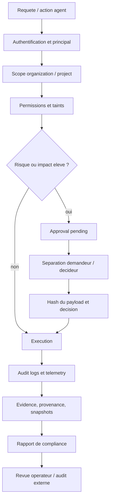
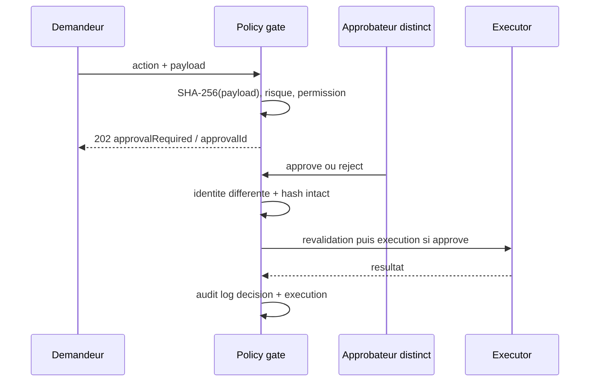
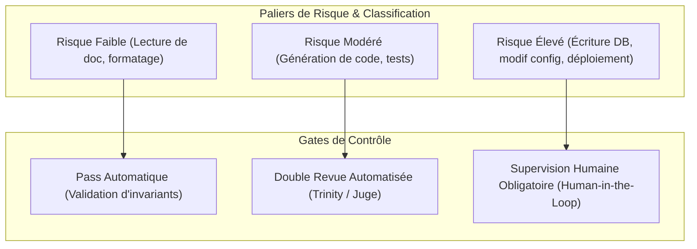
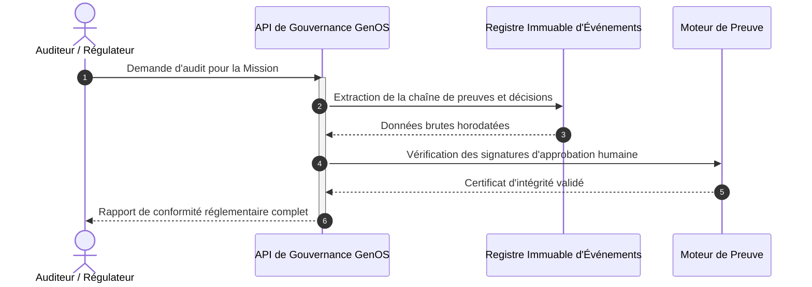

# Compliance et gouvernance

## Definition

La gouvernance GenOS regroupe les controles qui encadrent une action autonome : identite, permissions, scope tenant, taints, approbation humaine, evidence, journalisation et conservation des traces. La compliance est la capacite a produire un etat de controles et ses artefacts pour un cadre cible, notamment l'EU AI Act, SOC 2 ou HIPAA.

Ce guide decrit l'outillage present dans le depot. Il ne constitue pas un avis juridique, une analyse de classification du systeme au sens de l'EU AI Act, ni une certification. Un rapport `COMPLIANT`, un score de 100% ou un fichier de controle present signifie uniquement que les controles verifies par l'implementation ont passe ; cela ne prouve pas la conformite de l'organisation, du deploiement ou de tous les usages reels.

Les points centraux sont [backend/src/services/complianceService.js](../backend/src/services/complianceService.js), [backend/src/controllers/platformController.js](../backend/src/controllers/platformController.js), [backend/src/middleware/tenant.js](../backend/src/middleware/tenant.js), [backend/src/services/strategyPromotionPolicyService.js](../backend/src/services/strategyPromotionPolicyService.js) et [crates/genos-cli/src/commands/compliance.rs](../crates/genos-cli/src/commands/compliance.rs).

## Architecture de gouvernance



L'architecture est de defense en profondeur : une permission seule ne suffit pas pour les operations a risque, et une approbation seule ne contourne pas le circuit breaker, le verrouillage d'outil ou la politique de securite revalidee au moment de l'execution.

## EU AI Act : couverture outillée, non certification

`FRAMEWORKS.EU_AI_ACT` reference six themes : `risk_management`, `data_governance`, `technical_documentation`, `human_oversight`, `logging` et `accuracy_security`. Le rapport backend collecte actuellement trois pieces d'evidence :

- nombre d'evenements de telemetrie retenus ;
- nombre de workspaces actifs enregistres ;
- nombre de snapshots disponibles.

Le score du rapport backend est une couverture de ces elements :

$$
Score = 100 \times \frac{N_{pass}}{N_{evidence}}
$$

avec `pass` pour la telemetrie et, sous condition, les workspaces/snapshots. Il ne mesure ni l'impact fondamental, ni la gestion complete du cycle de vie, ni les obligations applicables a un fournisseur ou deployeur.

La CLI native `genos compliance generate --standard EU_AI_ACT` produit une matrice differente : elle controle l'existence de chemins cibles pour la gouvernance de donnees/taints, la transparence des trajectoires, l'arret d'urgence et le safe debugging. Son score est :

$$
Score_{CLI} = 100 \times \frac{N_{fichiers\;existants}}{N_{controles}}
$$

Le label `certified` de cette commande est donc un resultat de presence de fichiers dans le checkout courant. Il ne doit pas etre utilise comme attestation d'un organisme notifie, audit legal ou preuve de mise en oeuvre efficace.

## Human oversight et gestion des approbations

Une action MCP a risque peut recevoir `approval_required` et etre stockee dans `platform_approvals` avec action, agent, niveau de risque, incertitude, demandeur, scope, payload, statut et date de decision. Le workflow est :

1. Le demandeur soumet une action ; le payload est serialise et son SHA-256 est calcule.
2. L'action reste `pending` ; une reponse HTTP `202` peut indiquer `success:false` et `approvalRequired:true`.
3. Un autre principal decide `approve` ou `reject`.
4. La decision refuse le demandeur identique (`APPROVAL_SEPARATION_REQUIRED`), un payload altere (`APPROVAL_PAYLOAD_TAMPERED`) ou une decision deja prise.
5. Lors d'une approbation d'outil, GenOS revalide outil, lock, taints, circuit breaker et execution, puis journalise le resultat final.



Les contrats de promotion peuvent exiger `require_human_approval`, en plus de `require_replay` et `require_independent_verification`. Le controleur d'approbation de run exige egalement un evidence report avant de promouvoir une execution. Une receipt valable contient au minimum `approved:true`, `approvalId`, `approverId`, `approvedAt` et un `payloadHash` SHA-256. Une approbation est une autorisation attribuable, pas une validation automatique de verite metier.

## Separation des responsabilites

Les roles et permissions distinguent lecture, ecriture de workspace, execution MCP sure, gestion securite et droits administrateur. Le scope metier est :

```text
Organization -> Project -> Workspace -> Agent / run / snapshot / rapport
```

`requireTenantScope()` exige les headers `X-Organization-Id` et `X-Project-Id` ensemble, verifie l'appartenance et bloque les ecritures d'un membre en lecture seule ou d'un projet archive. Un administrateur global avec permission `all` peut traverser les scopes ; ce bypass doit etre reserve et audite.

La separation la plus forte actuellement appliquee est celle de l'approbation : `requested_by != decision_by`. Elle ne constitue pas a elle seule une separation organisationnelle complete. En production, affecter des identites distinctes, des permissions minimales, une revue periodique des memberships et un processus externe de conflits d'interets.

## Risk management

Le risque est traite par des garde-fous d'execution : validation de permission, politique zero-trust, taint tracking, categorie/impact d'outil, circuit breaker, sandbox, budget et approbation humaine. Les rapports de compliance indiquent que des controles sont presents ; ils ne calculent pas une analyse de risque complete par cas d'usage.

Pour une decision autonome, conserver un registre de risque comprenant : finalite, population affectee, domaine de deploiement, donnees et taints, modele/fournisseur, outils autorises, niveau d'autonomie, modes de defaillance, mesures de mitigation, owner, seuil d'escalade et resultat de supervision humaine. Lier ce registre a l'ID de mission, au contrat de strategie et aux hashes de provenance.

Un indicateur de priorisation peut etre ecrit comme :

$$
R = I \times P \times (1 - M)
$$

ou $I$ est l'impact, $P$ la probabilite estimee et $M$ l'efficacite de mitigation. Cette formule est une methode de gouvernance proposee : elle n'est pas calculee comme telle par le code. Les valeurs doivent etre definies et calibrees par le responsable du risque.

## Journalisation, preuves et auditabilite

Les surfaces persistantes principales sont :

| Artefact | Utilite d'audit |
| --- | --- |
| `audit_logs` | acteur, agent, action, ressource, decision, raison, payload, hash, tenant, date |
| `telemetry_events` | evenements de runtime, outils, budgets et decisions |
| `platform_approvals` | demande, identite du decideur, statut, raison et moment de decision |
| `compliance_reports` | framework, score, findings et evidence de rapport |
| `workspace_snapshots`, `trace_spans` | etat et trace utiles a l'investigation |
| `provenance_records`, `genome_decisions` | chainage et memoire des conclusions |

Les endpoints de governance permettent notamment l'audit tenant-scope et l'export de rapports de compliance en JSON, CSV ou Markdown. Les actions autonomes de strategie peuvent ecrire des receipts d'execution et les promotion gates conservent les raisons de blocage. Pour reconstruire une decision, associer le request/trace ID, l'agent, le run, la version de contrat, la configuration modele, les tools, les artefacts de test, le rapport d'evidence, l'approbation et le resultat effectif.

L'auditabilite est une relation de provenance, pas seulement un log :

$$
Decision\;auditable = Identite + Entree + Politique + Evidence + Action + Resultat + Horodatage
$$

Chaque terme doit etre rattache au meme scope organisation/projet et conserve dans un format consultable.

## Conservation des preuves et data governance

Les rapports, audit logs, telemetries, snapshots, traces et enregistrements de provenance sont persistants, mais le depot ne definit pas un TTL global universel. Sans politique d'operateur, ils croissent dans SQLite et sur disque. Les workspaces temporaires et certaines capsules ont leur propre nettoyage differe ; cela n'est pas une politique de retention de compliance.

Definir hors code : duree de retention par categorie, fondement legal, chiffrement au repos, localisation, controle d'acces, export legal hold, procedure de purge, sauvegardes et test de restauration. Ne pas placer secrets, donnees personnelles inutiles ou prompts sensibles dans les `detail`, `payload_json` ou artefacts de test : les journaux peuvent etre exportes et conserves longtemps.

La gouvernance des donnees dans le runtime repose en partie sur l'isolation tenant, les permissions et taints. Elle ne remplace pas une classification de donnees, un registre de traitement, un DPA, une DPIA ou les controles de sous-traitants necessaires selon le contexte.

## Documentation technique attendue

Pour chaque systeme autonome deploye, la documentation technique devrait completer les rapports GenOS avec :

- intention, cas d'usage interdit, niveau d'autonomie et conditions d'arret ;
- architecture, fournisseurs/modeles, version de prompt/contrat et outils ;
- donnees d'entree/sortie, sources, retention, taints et restrictions d'acces ;
- methodes d'evaluation, limites, taux d'echec, biais identifies et procedures de recours ;
- mesures de supervision humaine, matrice d'approbation et incident response ;
- inventaire des preuves : hashes, snapshots, rapports, tests, logs et decisions ;
- changelog, proprietaire, date de revue et criteres de retrait.

Les guides [docs/API_CONTRATS.md](API_CONTRATS.md), [docs/EPISTEMOLOGIE_EVIDENCE.md](EPISTEMOLOGIE_EVIDENCE.md) et [docs/RUNTIME_AGENTIQUE.md](RUNTIME_AGENTIQUE.md) decrivent les couches techniques qui alimentent ces elements.

## Exemple : promotion d'un correctif a risque

1. Un agent propose un correctif dans un workspace isole, joint tests, claims et provenance.
2. La politique detecte un outil ou une mutation a impact eleve et cree une approval `pending` dans le bon tenant.
3. Un operateur distinct verifie diff, evidence, risque residuel et hash de payload, puis approuve ou rejette.
4. GenOS revalide permissions, taints, outil et circuit breaker. Un lock ou un changement de politique bloque encore l'execution.
5. L'execution et la decision sont ecrites dans `audit_logs`; le rapport de compliance peut compter les traces et snapshots associes.
6. L'organisation conserve la preuve selon sa politique de retention et realise une revue post-deploiement.

La presence des six etapes ne suffit pas a garantir que le correctif est juridiquement conforme ou sans impact. Elle fournit les elements minimaux pour investiguer et rendre compte de la decision.

## Cas d'utilisation

| Cas | Mecanismes GenOS | Complement necessaire |
| --- | --- | --- |
| Approbation d'outil destructif | policy, approval, separation, audit log | approbateur habilite et procedure de changement |
| Audit d'une mission multi-agent | telemetry, evidence, provenance, strategy receipt | oracle metier et revue des resultats |
| Rapport EU AI Act interne | framework, evidence de controle, export | qualification juridique et audit de mise en oeuvre |
| Investigation incident | snapshots, traces, replay/evidence, logs | conservation, analyse humaine et correction racine |
| Isolation client | tenant scope, memberships, permission checks | tests d'autorisation, chiffrement et operations securisees |
| Retention et eDiscovery | export de rapports/logs | politique legale, purges et legal hold |

## Comparaison avec le marche

| Approche | Point fort habituel | Positionnement GenOS |
| --- | --- | --- |
| Plateformes de gouvernance IA (Azure AI Foundry, AWS Bedrock, Google Vertex AI) | politiques fournisseur, guardrails, monitoring et integrations cloud | privilegie un controle plane local/hybride et des preuves de runtime ; l'operateur reste responsable de la certification, des cloud controls et des obligations legales |
| GRC classique (ServiceNow GRC, OneTrust) | registre risques, workflows d'approbation, evidence et reporting | apporte les artefacts proches des agents ; ne remplace pas le registre organisationnel, les campagnes d'audit ou la gestion de controles enterprise |
| MLOps/LLMOps | versioning, evaluation, monitoring, model cards | ajoute evidence gate, capsules et decision lineage ; requiert toujours monitoring de production, metriques de biais et ownership metier |
| IAM et API gateways | RBAC, auth, journaux et separation | utilise permissions/scopes dans l'application ; doit etre complete par IAM centralise, SSO, rotation de secrets et observabilite infra |
| Outils de conformity scanning | checks automatises et rapports | la CLI GenOS controle des artefacts cibles ; elle ne teste pas l'efficacite de chaque controle ni la legalite du deploiement |

La force de GenOS est de relier decision autonome, evidence, approval et trace technique. Sa limite est claire : la gouvernance effective exige des roles humains, des politiques de retention, une analyse de risque et une validation legale qui vivent au-dela du code.

## Verification

```powershell
node backend/tests/test_compliance_integrations.js
node backend/tests/test_compliance_tenant_scope.js
node backend/tests/test_human_approval_promotion_gate.js
node backend/tests/test_approval_separation.js
node backend/tests/test_approval_payload_integrity.js
```

Ces tests etablissent les contrats implementes de rapport, scope, signature/approbation, separation et integrite. Ils ne certifient pas la conformite EU AI Act, SOC 2 ou HIPAA d'un deploiement reel.

Au 8 septembre 2026, `test_compliance_tenant_scope.js`, `test_approval_separation.js` et `test_approval_payload_integrity.js` passent. `test_compliance_integrations.js` echoue avant son scenario, car il importe `./src/app` depuis `backend/tests` au lieu de remonter vers `../src/app`. `test_human_approval_promotion_gate.js` echoue pour son succes attendu, car il ne fournit pas l'evidence report desormais obligatoire au controleur. Ces deux regressions de test doivent etre corrigees avant de les employer comme validation complete du workflow.


---

## Schémas Complémentaires de Conformité et de Supervision Humaine

### 1. Architecture des Paliers de Risque et Gates de Gouvernance (EU AI Act)



### 2. Séquence d'Audit Post-Exécution et Rapport de Conformité


