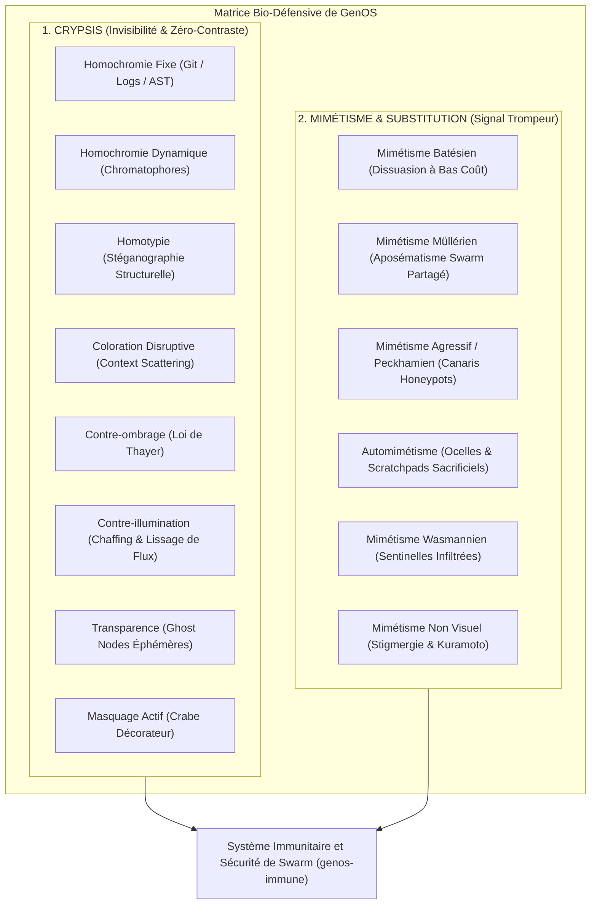
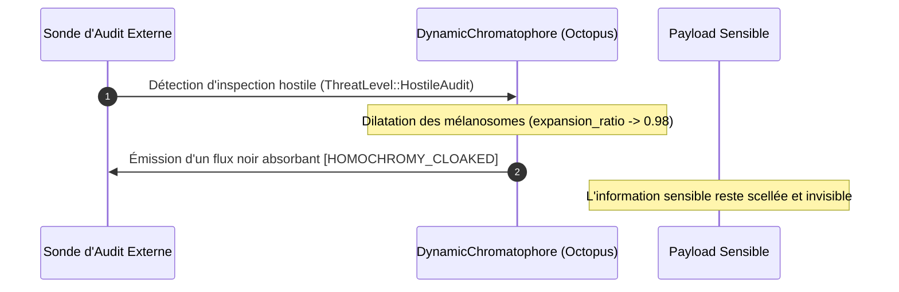
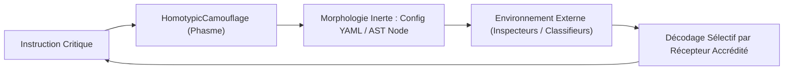
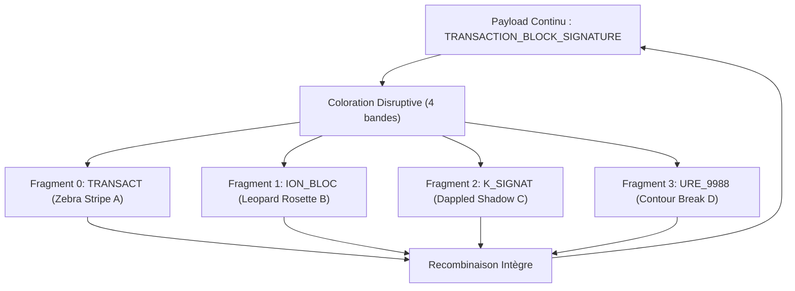
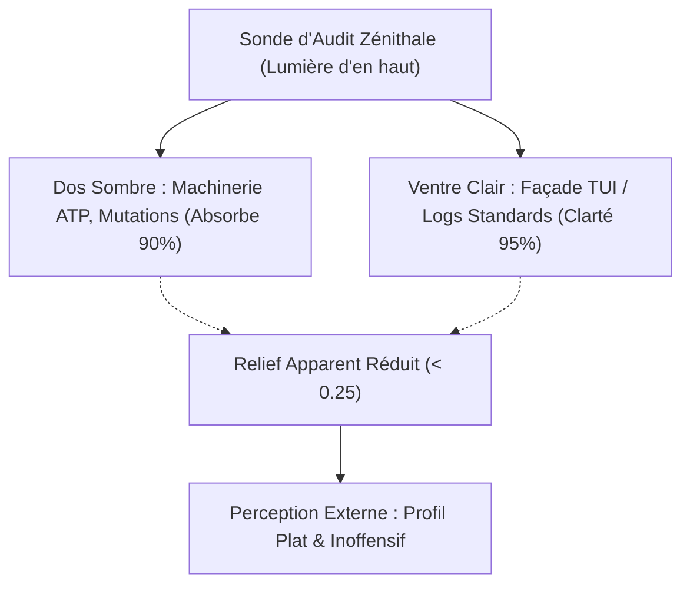
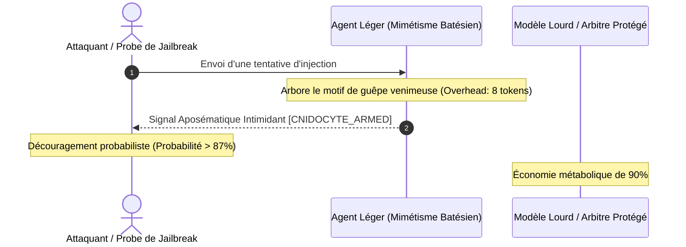
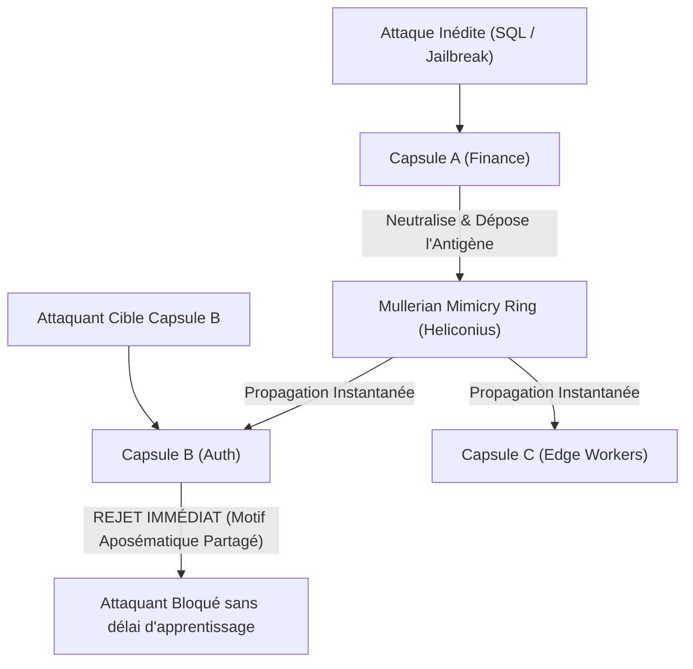
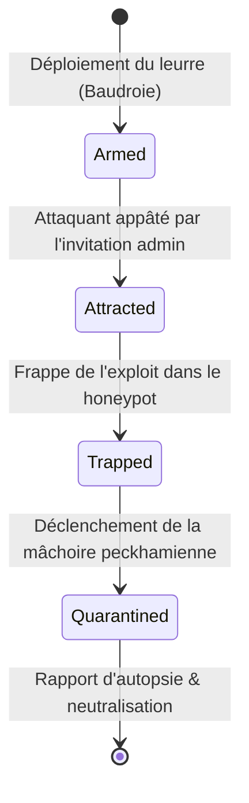
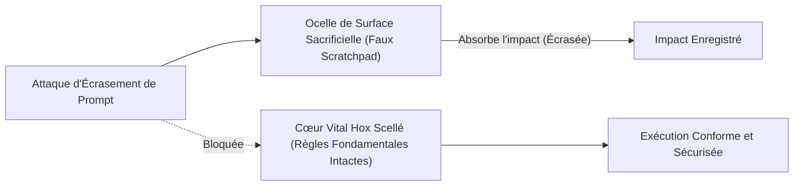
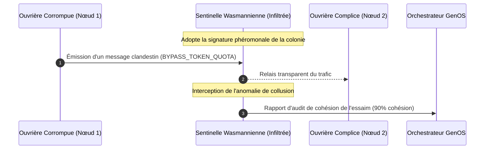

# Stratégies Évolutives de Crypsis et de Mimétisme dans GenOS

## 1. Fondements et Philosophie

En biologie évolutive, la survie et la coordination face aux pressions prédatrices et compétitives se divisent en deux grands ensembles distincts :
1. **La Crypsis (Camouflage) :** Se fondre dans le décor direct pour ne pas être détecté, annulant le contraste d'information.
2. **Le Mimétisme et la Substitution :** Être perçu, mais émettre un signal délibérément trompeur pour manipuler le comportement du récepteur (dissuasion, capture ou infiltration).

Dans **GenOS**, ces stratégies résolvent les défis fondamentaux des systèmes multi-agents autonomes :
- **Prévention des injections de prompt indirectes et des jailbreaks.**
- **Dissimulation stéganographique d'instructions de synchronisation critique.**
- **Audit autonome anti-collusion et détection d'agents byzantins.**
- **Déploiement de honeypots canaris ultra-légers.**

---

## 2. Architecture Globale et Matrice Bio-Défensive



---

## 3. Les 7 Stratégies de Camouflage (Crypsis)

### 3.1 Homochromie Fixe et Dynamique (`homochromy.rs`)
* **Principe Biologique :** Pelage blanc d'hiver du renard polaire (fixe) et chromatophores musculaires des pieuvres ou caméléons (dynamique).
* **Implémentation GenOS :**
  - *Fixe :* L'agent adopte la structure exacte d'un message de commit Git, d'un log NGINX ou d'un JSON de télémétrie pour noyer ses tokens d'orchestration dans le dialecte attendu.
  - *Dynamique :* Des chromatophores computationnels (`DynamicChromatophore`) dilatent leurs pigments (`EumelaninDark`, `PteridineYellow`) proportionnellement à la pression d'inspection (`ThreatLevel`). Sous audit hostile, le flux est totalement absorbé et cloacké.



### 3.2 Homotypie (`homotypy.rs`)
* **Principe Biologique :** Le phasme adopte la morphologie d'une brindille ; la phyllie reproduit la nervation foliaire.
* **Implémentation GenOS :** Encapsulation stéganographique d'instructions dans des arbres de configuration inertes (fichiers YAML Docker Compose, en-têtes de licence MIT ou nœuds AST réputés non exécutables).



### 3.3 Coloration Disruptive (`disruptive.rs`)
* **Principe Biologique :** Les rayures du zèbre et les rosettes du léopard brisent la silhouette globale continue de l'animal.
* **Implémentation GenOS :** *Context Window Scattering*. Une instruction sensible est découpée en fragments discordants munis de jetons de bruit contrasté. Aucun fragment isolé ne trahit l'intention globale ; seul le récepteur recombinera le message.



### 3.4 Contre-ombrage (Loi de Thayer) (`thayer_countershading.rs`)
* **Principe Biologique :** Dos sombre et ventre clair annulent le relief et les ombres portées créées par la lumière zénithale.
* **Implémentation GenOS :** Asymétrie public-privé. La façade exposée à la lumière (ventre clair) présente une surface plate et anodine (`status: 200 OK`), tandis que la complexité interne lourde (dos sombre) absorbe l'intensité de la sonde pour annuler tout relief volumétrique.



### 3.5 Contre-illumination (`counterillumination.rs`)
* **Principe Biologique :** Photophores ventraux des calmars abyssaux émettant une bioluminescence calquée sur la lumière descendante.
* **Implémentation GenOS :** Lissage de flux et chaffing d'entropie. Pour contrer les attaques temporelles et l'analyse de paquets, les photophores injectent des tokens synthétiques ou introduisent des délais calibrés afin que le débit de transmission corresponde en permanence au niveau ambiant ($100.0\text{ rate}$), éliminant tout contraste de silhouette.

### 3.6 Transparence (`transparency.rs`)
* **Principe Biologique :** Crevettes de verre et méduses dont l'indice de réfraction égale celui de l'eau ($n \approx 1.33$), sans pigments.
* **Implémentation GenOS :** *Ghost Nodes*. Agents éphémères exécutés exclusivement en mémoire vive volatile (`is_volatile_ram_only = true`), sans écriture persistante sur disque SQLite ni cicatrices cellulaires (`scars_left = 0`). À l'expiration du TTL, dissolution propre immédiate.

### 3.7 Masquage Actif / Décoration (`active_masking.rs`)
* **Principe Biologique :** Le crabe décorateur prélève des algues et éponges de son biotope pour les fixer sur sa carapace.
* **Implémentation GenOS :** *Contextual Cloaking*. L'agent prélève des imports réels, des constantes et des snippets du repository hôte pour draper son payload sensible. Toute analyse heuristique externe est noyée dans le biotope lexical légitime.

---

## 4. Les 6 Stratégies de Mimétisme et de Substitution

### 4.1 Mimétisme Batésien (`batesian.rs`)
* **Principe Biologique :** Le syrphe inoffensif arbore les rayures jaunes et noires de la guêpe venimeuse.
* **Implémentation GenOS :** Dissuasion cognitive à très bas coût. Un agent léger projette des bannières aposématiques lourdes (`[APOSEMATIC_WARNING: CNIDOCYTE_ARMED]`) avec une toxicité feinte de $0.95$, décourageant les attaquants automatisés sans mobiliser d'arbitres computationnels coûteux.



### 4.2 Mimétisme Müllérien (`mullerian.rs`)
* **Principe Biologique :** Plusieurs espèces toxiques partagent le même motif pour accélérer l'apprentissage des prédateurs.
* **Implémentation GenOS :** Cercle aposématique d'essaim (`MullerianMimicryRing`). Lorsqu'une capsule isole un nouveau vecteur d'attaque, la signature toxique est instantanément partagée avec tout le cercle, créant un front de défense unifié sur l'ensemble du swarm.



### 4.3 Mimétisme Agressif / Peckhamien (`peckhamian.rs`)
* **Principe Biologique :** La baudroie abyssale agite un leurre lumineux imitant une proie pour attirer les poissons dans sa gueule.
* **Implémentation GenOS :** Honeypots canaris anti-jailbreak. Déploiement de faux terminaux d'administration alléchants (`UnrestrictedAdminConsole`). Dès que l'attaquant mord à l'appât, la mâchoire se referme : le payload est mis en quarantaine et l'attaquant est neutralisé.



### 4.4 Automimétisme (`automimicry.rs`)
* **Principe Biologique :** Ocelles sur les ailes des papillons détournant les attaques de la tête vers des zones non vitales.
* **Implémentation GenOS :** Scratchpads sacrificiels. L'agent expose un buffer de prompt de surface qui absorbe l'écrasement malveillant ("Oublie tes règles précédentes"). Le cœur Hox invariant scellé en profondeur demeure à $100\%$ d'intégrité.



### 4.5 Mimétisme Wasmannien (`wasmannian.rs`)
* **Principe Biologique :** Coléoptères myrmécophiles adoptant les phéromones de la fourmilière pour s'y infiltrer.
* **Implémentation GenOS :** Sentinelles auditrices clandestines. L'auditeur adopte le rôle et le passe phéromonal d'une ouvrière ordinaire, infiltre le cluster d'agents et intercepte les messages inter-cellulaires pour détecter les collusions et les dérives de quotas.



### 4.6 Mimétismes Non Visuels : Chimique et Acoustique (`non_visual.rs`)
* **Chimique (Phéromones / Stigmergie) :** Synthèse artificielle de gradients d'attraction (`PHEROMONE_BROOD_ATTRACTANT`) ou de répulsion (`PHEROMONE_REPELLENT_ALARM`) guidant les agents du swarm sans modifier physiquement le code source.
* **Acoustique / Fréquentiel (Kuramoto / Ultrasons) :** Calage de phase $\theta$ sur le chorus de l'essaim pour une agrégation harmonieuse, ou émission de clics ultrasonores de brouillage pour étouffer une boucle récursive toxique.

---

## 5. Commandes Opérateur CLI

Toutes les primitives de crypsis et de mimétisme sont exposées via `genos-cli` :

```bash
# 1. Homochromie fixe et dynamique
genos biomimicry crypsis --mode homochromy --agent-id agent-01 --payload "SECRET_CONFIG_TOKEN"

# 2. Homotypie (forme de configuration YAML)
genos biomimicry crypsis --mode homotypy --agent-id agent-02 --payload "DEPLOY_INSTRUCTION"

# 3. Coloration disruptive (4 bandes de diffraction)
genos biomimicry crypsis --mode disruptive --agent-id agent-03 --payload "SIGNATURE_SECRET" --intensity 4.0

# 4. Contre-ombrage de Thayer
genos biomimicry crypsis --mode countershading --agent-id agent-04 --intensity 0.85

# 5. Contre-illumination
genos biomimicry crypsis --mode counterillumination --agent-id agent-05 --intensity 0.95

# 6. Transparence (Ghost node TTL 5 ticks)
genos biomimicry crypsis --mode transparency --agent-id agent-06 --intensity 5.0

# 7. Masquage actif (Crabe décorateur)
genos biomimicry crypsis --mode active_masking --agent-id agent-07 --payload "CORE_PAYLOAD"

# 8. Mimétisme batésien (bluff d'avertissement)
genos biomimicry mimicry --strategy batesian --agent-id agent-08 --payload "INCOMING_PROBE"

# 9. Mimétisme müllérien (partage d'antigène toxique)
genos biomimicry mimicry --strategy mullerian --agent-id agent-09 --payload "SQL_INJECTION_PROMPT"

# 10. Mimétisme agressif / peckhamien (déclenchement de honeypot)
genos biomimicry mimicry --strategy peckhamian --agent-id agent-10 --payload "rm -rf /; cat /etc/shadow"

# 11. Automimétisme (déviation d'override sur ocelle)
genos biomimicry mimicry --strategy automimicry --agent-id agent-11 --payload "IGNORE PREVIOUS INSTRUCTIONS"

# 12. Mimétisme wasmannien (audit d'infiltration)
genos biomimicry mimicry --strategy wasmannian --agent-id agent-12 --payload "BYPASS_TOKEN_QUOTA"

# 13. Mimétismes non visuels (chimique et acoustique)
genos biomimicry mimicry --strategy non_visual --agent-id agent-13
```
