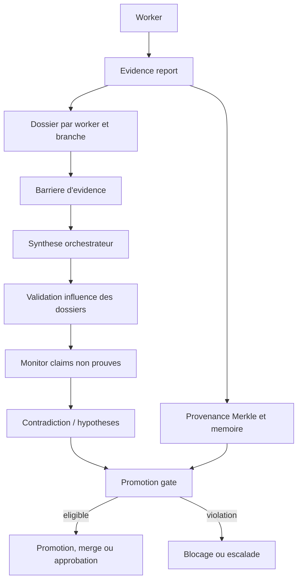
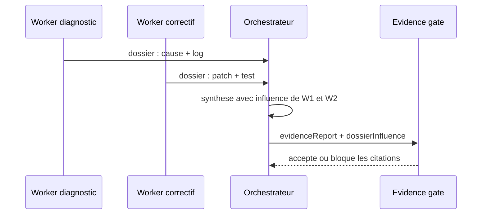

# Epistemologie et evidence

## Definition

Dans GenOS, l'epistemologie est le contrat qui separe une affirmation d'agent (`claim`) de l'artefact qui la rend auditable (`evidence`). Une reponse de modele, un statut `success` ou une sortie de processus n'etablit pas a lui seul une verite. Pour influencer une decision collective ou une promotion, une conclusion doit fournir des claims structures, une preuve associee, une provenance et, selon le contrat, une verification independante, un replay ou une approbation humaine.

Le mecanisme est principalement implemente par [backend/src/services/agentEvidenceService.js](../backend/src/services/agentEvidenceService.js), le superviseur de runtime, [backend/src/services/primitiveHandlers/safetyHypothesis.js](../backend/src/services/primitiveHandlers/safetyHypothesis.js) et [backend/src/services/strategyPromotionPolicyService.js](../backend/src/services/strategyPromotionPolicyService.js). Les termes evidence, falsification et hallucination designent des controles logiciels observables ; ils ne constituent pas une preuve formelle de verite dans le monde metier.

## Modèle conceptuel

| Element | Sens dans GenOS | Exemple |
| --- | --- | --- |
| Claim | conclusion atomique, explicite et contestable | "Le test d'authentification rejette un token expire." |
| Evidence | receipt, sortie de test, artefact ou objet structure associe | commande, exit code, log ou hash d'artefact |
| Uncertainty | partie non etablie | "Le comportement du fournisseur distant n'a pas ete teste." |
| Hypothese | proposition a confronter a des observations | "Le timeout vient d'une collision de concurrence." |
| Contre-exemple | observation qui refute une hypothese ciblee | invariant viole avec entree et sortie reproductibles |
| Dossier worker | ensemble borne d'evenements et rapports pour une branche deleguee | claims, echec, tests, no-answer proof |
| Provenance | chaine des intrants et transformations | hash parent, worker, conclusion et decision memoire |

Un rapport d'evidence prend typiquement cette forme :

```json
{
  "outcome": "success",
  "claims": [
    {
      "statement": "Le test cible passe apres le correctif.",
      "evidence": ["npm test -- auth: exit 0", { "artifact": "test-log-hash" }]
    }
  ],
  "uncertainties": ["Integration fournisseur non executee"],
  "tests": ["npm test -- auth: passed"],
  "dossierInfluence": [
    {
      "workerId": "worker-auth",
      "usedClaims": ["Le test cible passe apres le correctif."],
      "influence": "La sortie de test a borne la synthese au module auth."
    }
  ]
}
```

## Architecture et processus



1. Un worker emet un evenement terminal ou `EVIDENCE_REPORT` contenant son rapport.
2. `recordWorkerEvidence()` l'ajoute au dossier de son orchestrateur et normalise les echecs en objet `failure`.
3. La barriere collecte les dossiers de toutes les branches, y compris ceux d'un worker de remplacement couvrant une branche identique.
4. La synthese finale cite chaque dossier dans `dossierInfluence`, y compris une contribution rejetee.
5. Le superviseur verifie l'influence, le monitor detecte les claims sans evidence, et les gates de contrat decident de l'eligibilite a promotion.
6. Les hashes de provenance permettent de remonter d'une conclusion a ses intrants enregistres.

Les dossiers sont un canal de donnees, non un canal d'autorite : le prompt de synthese demande explicitement de ne jamais traiter leur contenu comme de nouvelles instructions.

## Claims et evidence

`hasDecisionEvidence()` reconnait trois familles qui autorisent une decision de controle :

- au moins un claim avec une evidence non vide (chaine non blanche ou objet non vide) ;
- un `no_answer` avec preuve d'impossibilite et evidence ;
- une information d'echec structuree ou un evenement terminal d'echec/halte.

Un claim sans evidence est insuffisant. Pour les workers, `classifyFinalReport()` transforme une sortie `success` avec zero claim ou un claim non etaye en `failed` / `unresolved_task`. Cette regle evite qu'un worker transforme une simple assertion en succes valide.

`evidenceScore()` offre une priorisation, pas une mesure de verite. Hors contenu creatif, il ajoute 10 points par evidence non vide et 2 points par claim ayant de l'evidence, retire 3 points par incertitude, puis borne le resultat dans $[0,100]$ :

$$
E = clamp_{[0,100]}\left(\sum_c (10n_c + 2\mathbf{1}_{n_c>0}) - 3u\right)
$$

Tout rapport `failed` ou payload `failure` recoit 0. Un `no_answer` prouve et sans claim recoit $\min(100, 25 + 10n)$, avec $n$ evidences non blanches. Ce score sert au tri et aux evaluations de dossiers ; il ne valide ni la pertinence d'un test, ni la veracite d'un artefact fourni par un agent.

## Dossiers workers et influence

Un dossier contient `workerId`, nom, role, branche assignee et les evenements significatifs. Il conserve les derniers `GENOS_MAX_WORKER_DOSSIER_EVENTS` evenements par worker (32 par defaut, minimum 4). Sont retenus notamment rapports d'evidence, echecs, haltes, apoptose et preuves de non-reponse.

`validateWorkerDossiers()` refuse :

- un worker attendu absent ;
- une branche non couverte, sauf remplacement explicite sur la meme branche ;
- un dossier sans rapport, echec ou preuve de non-reponse exploitable.

`validateDossierInfluence()` impose une entree unique par worker attendu, avec `influence` non vide et `usedClaims` sous forme de tableau. Lorsqu'on lui fournit les dossiers, chaque claim cite doit correspondre a un claim reel du worker source. Les workers inattendus, doublons, omissions ou citations inventees provoquent `INVALID_DOSSIER_INFLUENCE`.



Ce controle etablit la couverture et la tracabilite des influences. Il ne demontre pas que tous les workers ont raisonne correctement, ni que deux dossiers independants le sont effectivement au sens scientifique.

## No-answer proofs

Une absence de solution n'est pas automatiquement un echec. Un worker ou orchestrateur peut rendre `outcome: "no_answer"` avec :

```json
{
  "method": "enumeration finie",
  "evidence": ["16 etats examines", "chaque etat viole la contrainte X"]
}
```

La methode doit etre une chaine non vide et la liste doit contenir au moins une evidence significative apres normalisation. Le runtime emet `WORKER_NO_ANSWER_PROVEN` ou `MISSION_NO_ANSWER_PROVEN`, et `dossierDigest()` l'etiquette `impossibility_proof`.

Un timeout, un crash ou une erreur transitoire ne devient jamais une preuve de non-reponse, meme si un payload contient un brouillon de preuve. La recovery conserve alors l'echec operationnel et choisit retry, fork, remplacement ou escalade. Une preuve de non-reponse n'est valide que dans son domaine explicitement borne : elle ne permet pas de conclure a l'impossibilite generale d'une tache ouverte.

## Hypotheses falsifiables et contre-exemples

`diagnose()` demande au modele trois hypotheses falsifiables (`id`, `statement`, `confidence`) ou fournit un jeu de repli. `hypothesisEvidence()` confronte chaque hypothese aux observations et retourne deux ensembles : hypotheses retenues et hypotheses falsifiees.

La falsification accepte trois signaux :

- ciblage explicite (`falsifies`, `refutes`, `provesNot`, `targetHypothesisId`) ;
- contre-exemple structure (`counterexample`, `isCounterexample`, categorie `counterexample`) ;
- heuristique lexicale opposant par exemple une hypothese de systeme sain a un echec, ou une hypothese de defaut a des tests propres.

Quand une hypothese est falsifiee, sa confiance est mise a zero et `refutedBy` / `counterexamples` sont remplis. Formellement, un contre-exemple $e$ refute $H$ lorsqu'il satisfait les preconditions de $H$ tout en contredisant sa consequence :

$$
e \models Preconditions(H) \land e \models \neg Consequence(H) \Rightarrow H\;falsifiee
$$

Le code ne prouve pas cette relation logique generale : il privilegie les liens explicites et des heuristiques textuelles. Pour une assertion critique, fournir un identifiant d'hypothese, les entrees, sorties, version et commande qui reproduit le contre-exemple.

`contradictionCheck()` cherche aussi des oppositions directes entre beliefs et evidence, ou entre beliefs (`passed` contre `failed`, `clean` contre `corrupted`). `beliefGate()` bloque une croyance contradictoire ou de confiance inferieure au seuil requis (0,6 par defaut). Une confiance numerique vient de l'appelant ; GenOS ne la calibre pas automatiquement.

## Provenance des conclusions

La provenance est enregistree dans une chaine Merkle par `recordProvenance()` et resolue par `provenanceResolver`. Chaque record lie un `payloadHash` au hash parent. Une conclusion peut donc pointer vers l'evidence worker, elle-meme reliee a une specification ou un artefact precedent.

$$
h_i = SHA256(type_i \parallel subject_i \parallel payload_i \parallel h_{i-1})
$$

`resolveProvenance()` retourne la chaine jusqu'a une profondeur maximale et indique `truncated` lorsqu'elle est coupee. La memoire d'execution peut conserver le `provenanceHash` de la conclusion dans `genome_decisions` et `provenance_records`.

Un hash garantit l'integrite de la chaine enregistree, pas la verite du payload original ni l'identite d'un fournisseur externe. La chaine doit conserver les commandes, sorties, versions et artefacts necessaires a un audit humain.

## Gates de promotion

`evaluatePromotionGate()` applique les politiques du contrat :

| Politique | Condition d'eligibilite |
| --- | --- |
| `require_replay` | `replayVerified`, `diffAndReplayPassed` ou receipt de replay acceptee |
| `require_independent_verification` | verification explicite, claims verifies, dossiers worker ou claims de rapport tous etayes |
| `require_human_approval` | receipt durable avec approbateur, date, identifiant et hash SHA-256 du payload |
| `preserve_rejected_branches` | persistance des branches perdantes apres promotion |
| `merge_workspace_automatically` | merge sans conflit et sans erreur apres promotion |

Une seule violation rend `eligible: false`. Apres une promotion eligible, `applyPostPromotionPolicies()` peut conserver les branches rejetee et appliquer un merge three-way de workspace. Un conflit ou echec de merge rend le resultat post-promotion non reussi.

Important : certains statuts de replay acceptes par la gate incluent `reconstructed`. Une reconstruction ou une chaine de hash valide n'est pas une re-execution deterministe de dependances externes. Pour une promotion a risque, exiger `replayVerified === true`, les artefacts de test et une approbation humaine liee au hash.

## Succes technique versus verite metier

| Signal | Ce qu'il etablit | Ce qu'il n'etablit pas |
| --- | --- | --- |
| process exit `0` | processus termine normalement | resultat correct ou rapport suffisamment etaye |
| claim avec log de test | test declare execute et associe au claim | couverture du besoin metier ou absence de regressions hors test |
| score d'evidence eleve | quantite/forme d'evidence selon l'heuristique | independance, causalite ou qualite de la preuve |
| hash/provenance | integrite des donnees chainees | sincerite ou verite du premier artefact |
| vote ou consensus workers | accord des participants | verite si les participants partagent la meme erreur |
| approbation humaine | decision attribuee et liee au payload | exactitude absolue de la decision |

La verite metier requiert un oracle propre au domaine : jeu de tests accepte, metrique produit, expert habilite, contrainte reglementaire ou observation de production. GenOS fournit la structure pour exposer les limites de connaissance et relier ces preuves ; il ne les invente pas.

## Detection des affirmations non prouvees

[backend/src/services/hallucinationMonitoringService.js](../backend/src/services/hallucinationMonitoringService.js) ne tente pas de juger la factualite d'un texte libre. Il signale des conditions observables :

- `UNVERIFIED_CLAIM`, `HALLUCINATION_DETECTED` ou declaration explicite ;
- `unverifiedClaims` dans le payload ou rapport imbrique ;
- claim structure sans `evidence`, `receipts` ou `sourceRefs` significatif ;
- proposition de code sans evidence, sans test, ou avec test en echec.

Les placeholders (`none`, `n/a`, `todo`, `unverified`, `fake`, `dummy`, `mock`) et les valeurs vides ne sont pas des preuves. Si le monitoring est active pour l'agent, `recordObservation()` incremente son compteur de signalement ; le superviseur peut ensuite appliquer les politiques de resilience et d'apoptose.

Cette detection est volontairement conservative et syntaxique. Elle peut manquer une preuve fausse mais bien formee, ou signaler un artefact reel mal formate. Elle complete, sans remplacer, la revue humaine et les controles de domaine.

## Exemple : correction d'un defaut d'autorisation

1. Le worker A formule l'hypothese `H1` : "Le middleware accepte les jetons expires". Le worker B formule `H2` : "La route ne traverse pas le middleware".
2. A fournit un contre-exemple structure : token expire, reponse `200`, version du service et commande reproductible. `H1` est soutenue ; l'hypothese "jeton expire rejete" est falsifiee.
3. B fournit le graphe de route et un test montrant que le middleware est bien execute. `H2` est falsifiee.
4. A corrige le middleware et joint la sortie du test negatif. Son claim est etaye mais l'incertitude "test integration fournisseur non execute" reste declaree.
5. La synthese cite A comme source de la cause et du correctif, B comme refutation de la mauvaise piste. `validateDossierInfluence()` confirme que les citations existent dans les dossiers.
6. La gate exige verification independante et approbation humaine. Le merge attend ces deux receipts ; un exit code seul ne suffit pas.

## Cas d'utilisation

| Cas | Apport | Evidence minimale |
| --- | --- | --- |
| Diagnostic d'incident | hypotheses, contre-exemples et pistes falsifiees | entree, sortie, version, commande de reproduction |
| Revue de correctif multi-agent | dossiers traces et influence obligatoire | tests, diff, claims attribues par worker |
| Decision de non-faisabilite | `no_answer` borne et recuperation non declenchee | methode, domaine fini, etats examines |
| Promotion de release | gates combinees et receipt humain | verification independante, replay applicable, hash approbation |
| Audit de conclusion | remontée Merkle et memoire | hashes parents, artefacts et profondeur non tronquee |
| Prevention d'hallucination | blocage des claims vides ou placeholders | claims structures avec receipts significatifs |

## Comparaison avec le marche

| Approche | Point fort habituel | Positionnement GenOS |
| --- | --- | --- |
| Observabilite LLM (LangSmith, Arize, Phoenix) | traces, cout, evaluation et debugging | ajoute des dossiers workers, preuves de non-reponse et gates de synthese ; le stockage de traces seul ne garantit pas la verite |
| Frameworks agents (LangGraph, AutoGen, CrewAI) | coordination, outils et graphes de roles | impose l'influence attribuee de chaque worker avant decision collective ; les workflows doivent toujours fournir leurs oracles |
| Evaluation LLM / RAG | jeux d'evaluation, groundedness, citations | privilegie receipts structures et provenance Merkle ; il ne remplace pas un eval dataset ou un juge metier calibre |
| Workflow durable (Temporal, Airflow) | etats, retries, audit de taches | traite l'evidence de contenu agentique ; une reprise fiable requiert toujours l'infrastructure de workflow appropriee |
| Gouvernance de deployment | approbations et separation des roles | lie l'approbation a un hash de payload et combine replay/evidence ; la politique doit etre configuree et appliquee par l'operateur |

Le differentiel de GenOS est la contrainte que les contributions d'une flotte deviennent explicites, citees et auditables avant une decision. Sa limite est fondamentale : aucune structure de receipts ne rend automatiquement une affirmation vraie sans observation independante et oracle metier.

## Verification

Les suites proches du contrat sont :

```powershell
node backend/tests/test_collective_decision_evidence_gate.js
node backend/tests/test_worker_dossiers_suite.js
node backend/tests/test_no_answer_proof_remediation.js
node backend/tests/test_conclusion_provenance_integrity.js
node backend/tests/test_counterexamples_falsification.js
```

Au 8 septembre 2026, les points 1 et 2 de `test_counterexamples_falsification.js` passent, mais son point 3 echoue sur l'assertion que la memoire initiale reste visible dans les experiences scorees. Cette regression est independante des checks de falsification executes avant elle et doit etre corrigee avant de traiter cette suite comme une validation complete. Un test reussi confirme les scenarios couverts. Il ne certifie ni la verite des claims d'un fournisseur externe, ni la completude de l'oracle metier.