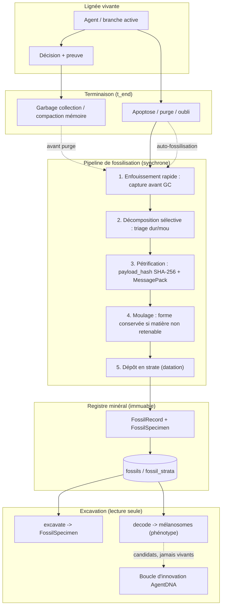
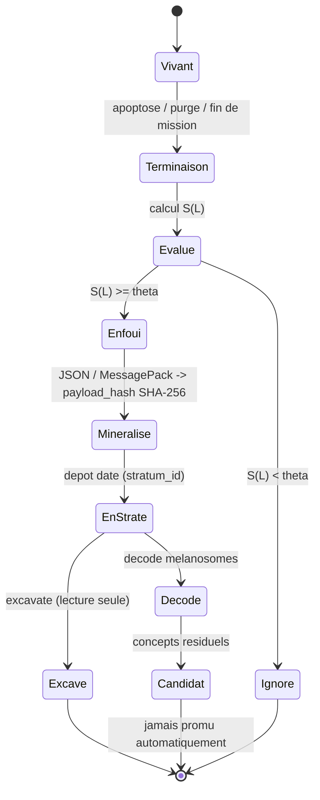
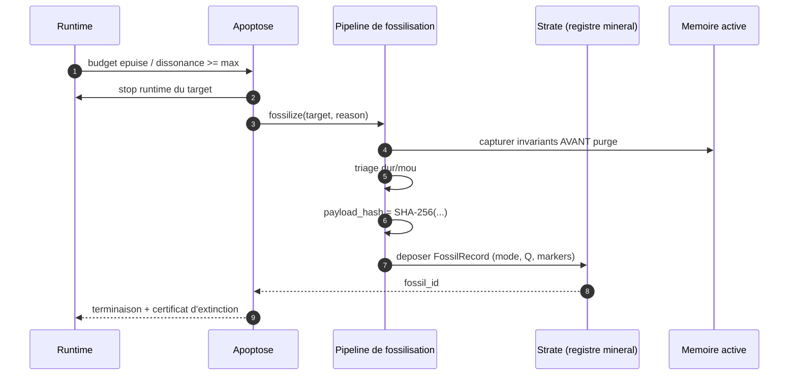
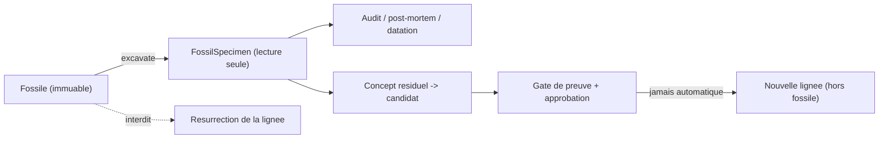

# Fossilisation — Archive stratigraphique terminale des lignées d'agents

## 1. Définition du domaine

La **fossilisation** est, dans GenOS, le processus **passif, terminal et irréversible** par lequel l'état signifiant d'une **lignée d'agent** (génome, provenance, décisions, preuves, phénotype observé) est préservé sous forme d'un **registre minéralisé** après la mort ou la suppression de cette lignée.

Elle ne doit pas être confondue avec les mécanismes de préservation **réversibles** du runtime :

| Mécanisme | Réversible | Objet préservé | Décision |
| --- | --- | --- | --- |
| Snapshots de workspace (`SnapshotStore`) | Oui | État de workspace | Restaurer une version |
| Capsules (`Capsule`) | Oui (intégrité) | Payload scellé (SHA-256) | Prouver la non-altération |
| Cryptobiose / spore (`CryptobiosisStore`) | **Oui (germination)** | Agent vivant vitrifié | Reprendre le travail |
| **Fossile (`FossilRegistry`)** | **Non** | Lignée éteinte | **Conserver la preuve** |

Un fossile GenOS est donc une **pièce de preuve terminale**, pas une sauvegarde. On ne le restaure pas : on l'**excave** pour l'audit.

## 2. Modèle mathématique ou logique

**Déclencheur d'enfouissement.** Une lignée `L` est fossilisée à sa terminaison `t_end` si et seulement si le score de signification dépasse un seuil :

$$
B(L) = \mathbb{1}\!\left[\, S(L) \ge \theta \,\right], \qquad
S(L) = w_f \cdot \mathrm{fitness}(L) + w_e \cdot \mathrm{evidence}(L) + w_r \cdot \mathrm{rarity}(L) + w_c \cdot \mathrm{cost}(L)
$$

où `evidence ∈ {0,1}` est le certificat de preuve falsifiable, `cost` le compute/tokens réellement dépensés (handicap de Zahavi), `rarity` la rareté du phénotype, et `fitness` le score de la lignée. Le biais de conservation `< 1 %` est ainsi **explicite et paramétré** : tout n'est pas fossilisé, seulement le significatif.

**Minéralisation.** Le fossile porte un hash canonique de son matériel :

$$
\mathrm{payload\_hash} = \mathrm{SHA\text{-}256}\big(\bigoplus \text{tag} \,\|\, \mathrm{len}_{u32} \,\|\, \mathrm{payload}\big)
$$

sur les sections triées par octets ASCII, **hors signature** (même primitive que `AgentDNA` et `Capsule`). Ce hash est le « minéral » : il rend toute réécriture post-hoc détectable.

**Qualité de conservation.** Avec `H` les parties dures retenues et `M` les tissus mous (contexte volatil) perdus :

$$
Q = \frac{|H|}{|H| + |M|} \in [0,1]
$$

`Q` doit être enregistré pour interdire toute généralisation abusive depuis un échantillon biaisé.

**Stratification.** Les fossiles sont déposés dans des strates `stratum_id` ordonnées par date ; la position relative donne la **datation** (fossile stratigraphique) utilisée pour reconstituer l'histoire évolutive d'une lignée.

## 3. Analogies biologiques et limites réelles

| Concept GenOS | Analogie biologique | Réalité en GenOS |
| --- | --- | --- |
| Enfouissement rapide | sédimentation immédiate | capture synchrone à la terminaison, avant GC |
| Décomposition sélective | tissus mous vs parties dures | triage : invariants gardés, état volatil purgé |
| Pétrification | minéralisation molécule à molécule | content-addressing SHA-256 + MessagePack |
| Moule externe / interne | empreinte creuse / remplissage | conservation de la forme (interfaces, trace de décision) sans la matière |
| Fossile-trace (ichnofossile) | empreintes, fèces | chaînes de provenance, dead ends, pistes de phéromones |
| Mélanosome | organite pigmentaire résistant | marqueur phénotypique (rôle, classe, risque, outcome) qui survit à la compaction |
| Défossilisation | extraction, dégagement | excavation en lecture seule ; **jamais** de résurrection |
| Phosphatisation en jours | ancrage chimique rapide | burial O(secondes) ; maturation en strates par job de fond |

**Limites réelles.** La matière biologique initiale est « détruite ou transformée en pierre » : GenOS ne peut donc pas reconstruire le **contexte d'exécution volatile** d'un agent mort. Le fossile est un **squelette d'événements**, pas une machine à remonter le temps. Comme en paléontologie, la conservation est biaisée et déformée : le hash protège l'intégrité, mais `Q` et le mode de taphonomie doivent rester lisibles pour ne pas surinterpréter.

**Non-résurrection.** « Défossiliser » signifie seulement dégager le fossile de sa gangue et l'étudier. Aucune API ne rend un fossile à la vie ni ne le promeut en branche active.

## 4. Cas d'usage et objectifs métier

1. **Post-mortem et archéologie de panne** : reconstituer pourquoi une lignée s'est éteinte (apoptose, dissonance, purge mémoire, budget épuisé).
2. **Registre d'extinction probant** : conserver une trace infalsifiable des lignées abandonnées, sans encombrer la mémoire active.
3. **Reconstitution évolutive** : dater et ordonner les extinctions (strates) pour analyser la dérive d'une lignée et ses crises.
4. **Réutilisation prudente** : extraire d'un fossile des **concepts résiduels** (golden paths, contrats d'outils, provenance) comme *candidats* — jamais comme branches vivantes (voir la boucle d'innovation AgentDNA).
5. **Défense épistémique** : le hash minéral rend impossible la réécriture d'un passé abandonné pour « nettoyer » une décision.

## 5. Exemples concrets

CLI existante (registre mince) :

```bash
genos fossil record --lineage-id lineage_42 --reason "budget exhausted"
genos fossil list
```

Primitives backend existantes (auto-invoquées par l'apoptose) :

```jsonc
// runtime_arbiter / primitiveHandlers
{ "primitive": "fossilize", "lineageId": "lineage_42", "reason": "apoptosis" }
{ "primitive": "fossil_list" }
```

Surface CLI **implémentée** (couche Rust) :

```bash
genos fossil record --lineage-id lineage_42 --reason "budget exhausted" --mode petrification
genos fossil strata
genos fossil excavate --fossil-id <uuid>          # lecture seule
genos fossil decode --fossil-id <uuid>            # restitution des mélanosomes (phénotype)
```

Service backend **implémenté** : `fossilizationService.recordFossil | listFossils | listStrata | excavateFossil`, indexé dans les tables `fossils` / `fossil_strata`.

Surface cible restante (ADR 0003) :

```text
GET  /api/fossils
GET  /api/fossils/:id
POST /api/fossils/:id/excavate
GET  /api/fossils/strata
```

Outils MCP cibles : `genos_fossil_record | list | excavate | strata`.

## 6. Schéma ou diagramme



## 7. Architecture technique

**Existant (registre mince).**

- Cœur Rust : `crates/genos-store/src/fossil.rs` — `FossilRecord { fossil_id, extinct_lineage_id, reason, recorded_at }` et `FossilRegistry { fossilize, all_fossils }`. Exporté par `crates/genos-store/src/lib.rs`.
- Orchestrateur : `crates/genos-orchestrator/src/ecosystem.rs` — champ `fossils`, `fossilize(lineage_id, reason)`, `fossil_history()`.
- CLI : `crates/genos-cli/src/args/store_extra.rs` (`FossilCmd`) et `crates/genos-cli/src/commands/store_ops.rs` — `handle_fossil_record` / `handle_fossil_list`, persistance JSON dans `<matrix_root>/fossils/` avec `stratum: "STRATIGRAPHIC_FOSSIL"`.
- Pont backend : `backend/src/services/genosCli.js` (`runFossilize`, `runListFossils`) ; primitives `fossilize`, `fossil_record`, `fossil_list` dans `backend/src/services/primitiveHandlers/safety.js` et registre `primitiveHandlers/handlersRegistry.js`.
- Auto-invocation : `apoptosis()` appelle `fossilizeTerminatedTarget(...)` (`safety.js`).

**Primitives de préservation réutilisables (ne pas réimplémenter).**

- `Capsule` / `CapsuleStore` : hash SHA-256 + `verify()` (tamper-evident).
- `SnapshotStore` / `SnapshotManifest` : checkpoints content-addressed.
- `SporeVitrifiedPayload` : hash + blob sérialisé (cryptobiose).
- `bioPolymerPersistenceService.js` : encodage MessagePack dans colonnes BLOB.
- Tables existantes à imiter : `cryptobiosis_snapshots`, `agent_state_snapshots`, `agent_git_archives`.

**Implémenté (ADR 0003).**

- Rust : `fossil.rs` enrichi — `FossilizationMode { Petrification, ExternalMold, InternalMold, Trace }`, `SedimentStratum`, `Melanosome`, `MelanosomeShape`, `PhenotypeReading`/`PhenotypeClass`, `FossilSpecimen`, `BurialContext` et pipeline `FossilRegistry::bury` / `fossilize` / `excavate` / `strata` (≤ 3 paramètres par fonction, fichier ≤ 400 lignes). Intégré à `GenosEcosystem` (`bury_fossil`, `excavate_fossil`, `fossil_strata`).
- CLI : `genos fossil record --mode ...`, `fossil strata`, `fossil excavate`, `fossil decode` ; l'artefact JSON conserve `stratum: "STRATIGRAPHIC_FOSSIL"`.
- Backend : `fossilizationService.js` (record, list, strata, excavate, decode, intégrité) + migration `migrateFossilization.js` créant `fossils` et `fossil_strata` ; l'auto-fossilisation de l'apoptose indexe désormais le fossile (`primitiveHandlers/safety.js`).
- Test : `backend/tests/test_fossilization_service.js` (`npm run test:fossilization`) et tests unitaires `genos-store`.

**Cibles restantes (ADR 0003).**

- Endpoints REST `/api/fossils*` et outils MCP `genos_fossil_*`.
- Hook des concepts résiduels vers la boucle d'innovation AgentDNA (statut `candidate` uniquement).

## 8. Processus d'exécution ou de validation

**Burial (synchrone, borne O(secondes)).**

1. Une terminaison survient : apoptose (`ConscienceState` / `resilienceService.evaluateApoptosis`), purge mémoire (`sleepCycle`), ou fin de mission.
2. `S(L)` est évalué ; si `B(L) = 1`, la capture démarre **avant** le garbage collection.
3. Triage dur/mou : invariants retenus, contexte volatil marqué perdu.
4. Minéralisation : `payload_hash`, encodage canonique, mode de taphonomie.
5. Dépôt dans une strate datée ; écriture du `FossilRecord`.

**Maturation (asynchrone).**

6. Un job de compaction (analogue au cycle de sommeil) consolide les strates, purge les minéraux orphelins et met à jour l'index.

**Excavation (lecture seule).**

7. `excavate(fossil_id)` réhydrate un `FossilSpecimen` en lecture seule.
8. `decode(fossil_id)` restitue les **mélanosomes** : classification de ce qu'était l'agent (rôle, classe de stratégie, risque, outcome) sans reconstituer son contexte.
9. Les concepts résiduels éventuels sont émis comme **candidats** vers la boucle d'innovation ; jamais promus automatiquement.

**Garde-fou de validation.** Toute tentative de promotion d'un fossile vers une branche active est rejetée. Le hash minéral est vérifié à l'excavation : divergence ⇒ fossile déclaré corrompu.

## 9. Comparaison avec le marché

| Aspect | GenOS (fossilisation) | Sauvegardes / snapshots classiques | Archives & logs froids | Outils GitOps |
| --- | --- | --- | --- | --- |
| Finalité | Preuve terminale d'une lignée éteinte | Restauration | Conformité / historique | Livraison d'état |
| Réversibilité | **Non** (excavation seule) | Oui | Oui (rejeu) | Oui |
| Intégrité | Hash SHA-256 « minéral » + `Q` | variable | souvent absente | hash de commit |
| Phénotype résiduel | Mélanosomes décodables | non | non | non |
| Déclencheur | Terminaison (apoptose/purge) | Manuel/périodique | Politique de rétention | Pipeline |
| Datation | Strates ordonnées | horodatage plat | horodatage plat | DAG de commits |

Le positionnement est proche de l'idée de **post-mortem / forensic archive**, mais GenOS l'applique aux **lignées agentiques** et y ajoute la conservation explicite du biais (`Q`) et du phénotype.

## 10. Limites, garde-fous, non-objectifs

- **Irrécversible par conception** : aucune API de résurrection ; « défossiliser » = excaver.
- **Ne pas confondre avec la cryptobiose** : la cryptobiose est réversible (germination) ; le fossile non.
- **Preuve ≠ vérité** : un fossile conserve une trace, il ne certifie pas la justesse métier de la décision fossilisée.
- **Biais explicite** : le seuil `θ` et `Q` doivent être journalisés ; un corpus de fossiles n'est pas un échantillon représentatif.
- **Hashes et canonicalisation** : l'ordre ASCII des sections doit être identique côté Rust et Node, comme pour `AgentDNA`.
- **Fichiers de grande taille** : le mode moule existe précisément pour ne pas stocker toute la matière ; ne pas transformer le registre en entrepôt de blobs.
- **Non-objectif** : remplacer les snapshots, capsules ou la cryptobiose ; la fossilisation est la **couche terminale**, pas la couche de reprise.

## Schémas Complémentaires

### Diagramme de machine à états de la fossilisation



### Séquence d'auto-fossilisation sur apoptose



### Défossilisation : excavation vs résurrection



## Voir aussi

- [adr/0003-fossilization-stratigraphic-archive.md](adr/0003-fossilization-stratigraphic-archive.md) — décision d'architecture de la fossilisation stratigraphique.
- [MEMOIRE_APPRENTISSAGE.md](MEMOIRE_APPRENTISSAGE.md) — consolidation, oubli, pruning et distinction mémoire active / archive.
- [RESILIENCE_REPRISE.md](RESILIENCE_REPRISE.md) — apoptose, cryptobiose, reprise et récupération (mécanismes réversibles).
- [EPISTEMOLOGIE_EVIDENCE.md](EPISTEMOLOGIE_EVIDENCE.md) — preuve, falsifiabilité, « préserver les perdants ».
- [AGENT_DNA_RUNTIME.md](AGENT_DNA_RUNTIME.md) — hash canonique, provenance et boucle d'innovation.
- [PERSISTANCE_DONNEES.md](PERSISTANCE_DONNEES.md) — SQLite, bio-polymères et schémas de stockage.
