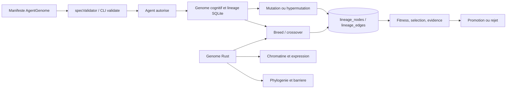
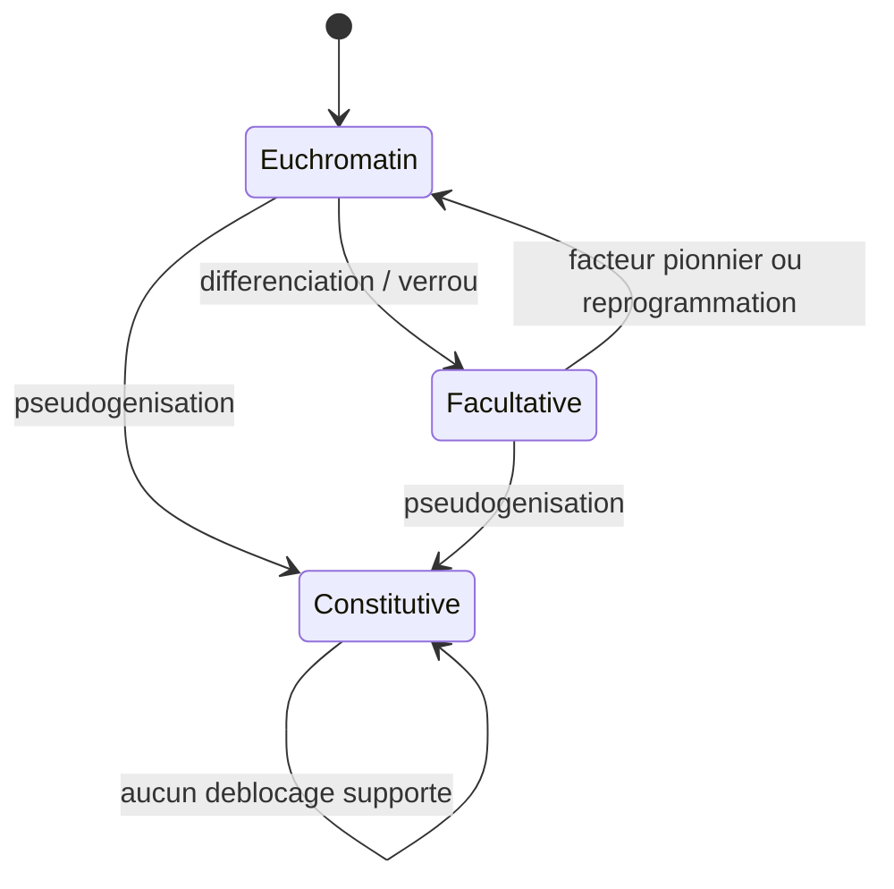
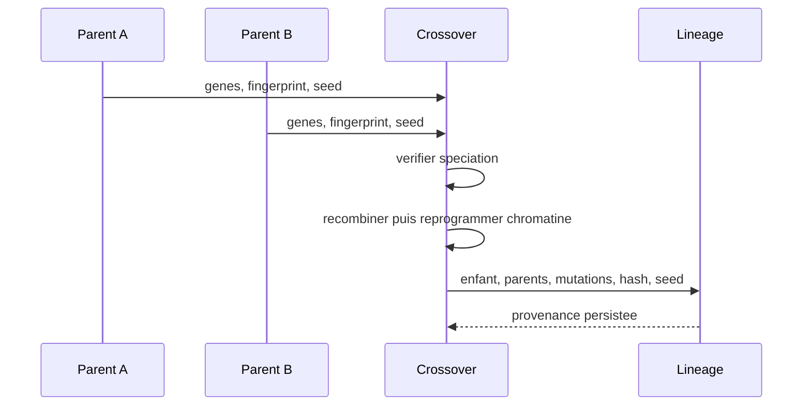
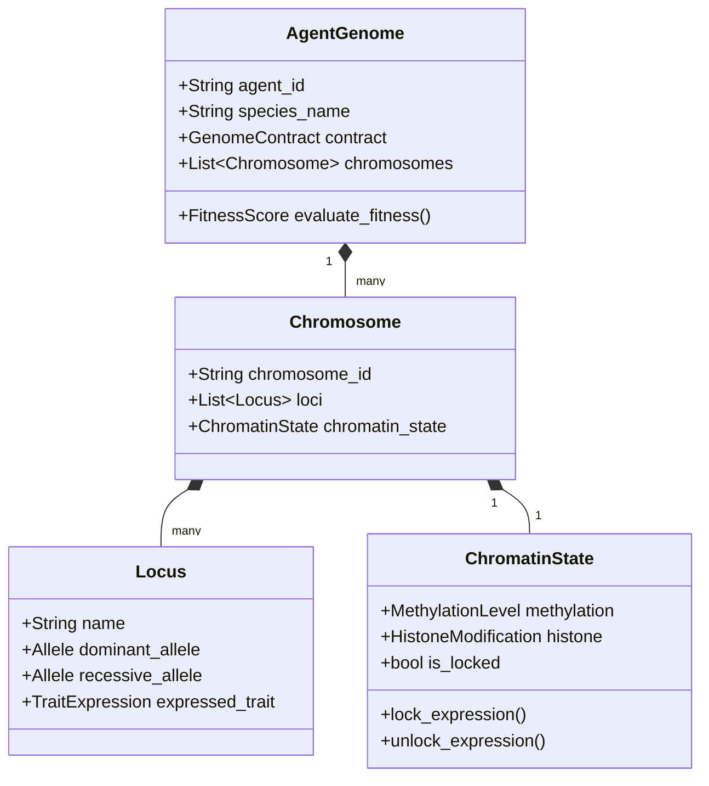

# Genome et epigenetique

## Definition

Dans GenOS, le genome est la configuration durable qui definit l'identite, les capacites et les politiques cognitives d'un agent. L'etat de runtime (PID, tache courante, telemetrie) n'est pas le genome : il est mutable et persiste separement. Les termes ADN, chromosome, allele, chromatine, mutation et espece decrivent des structures et politiques de calcul ; ils ne prouvent ni equivalence biologique, ni apprentissage autonome, ni qualite d'une reponse de modele.

Trois representations cooperent sans etre interchangeables :

| Representation | Autorite | Usage |
| --- | --- | --- |
| Manifeste `AgentGenome` JSON/YAML | [spec/GENOME_SPEC.md](../spec/GENOME_SPEC.md) et [spec/genome.schema.json](../spec/genome.schema.json) | echange portable et validation structurelle |
| `Genome` Rust | [crates/genos-genome/src/genome.rs](../crates/genos-genome/src/genome.rs) | chromosomes, genes, chromatine, fingerprint et reproduction native |
| Genome cognitif JavaScript | [backend/src/services/geneticsService.js](../backend/src/services/geneticsService.js) | agents backend, croisement, hypermutation et DAG de lineage |

Un resultat de croisement ou un fitness predit est une hypothese. Sa promotion demande une evidence independante, par exemple un test, un compilateur ou une evaluation de domaine.

## Vue d'architecture



Le handler [backend/src/services/primitiveHandlers/evolution.js](../backend/src/services/primitiveHandlers/evolution.js) est le point de controle des primitives `mutate`, `breed`, `select`, `paretoSelect` et `speciation`. Une mutation backend cree un nouvel agent worker et une nouvelle entree de lineage dans une transaction : elle ne reecrit pas l'agent parent.

## Genome immutable : contrat et nuance

L'immuabilite est un contrat de lineage, pas une immutabilite memoire absolue : le type Rust expose des operations mutables telles que `insert_gene`, `mutate_stochastic` et `reprogram_epigenetics`. En revanche, le parent peut etre conserve comme reference et un descendant est derive avec une nouvelle identite.

`Genome::derive_child()` clone le genome, genere un nouveau `genome_id`, ajoute l'identifiant du parent dans `parent_ids`, incremente `generation` et efface les cicatrices de bourgeonnement du descendant. Le `lineage_id` reste celui de la lignee. Dans le backend, `mutate()` cree un `mutant_<uuid>` avec une relation `mutation` et persiste les genes et descripteurs appliques dans le DAG.

Deux empreintes SHA-256 servent a verifier ce contrat :

- `hash` serialise le genome complet, identite comprise ; une alteration d'identite ou de contenu le modifie.
- `content_hash` ne couvre que chromosomes, genes, plasmides, retrovirus endogenes, enhanceurs, chromosomes supplementaires et ploidie. Il ignore identite, parents et generation : un clone derive peut donc avoir le meme contenu avec une nouvelle identite.

$$
F_{full}(G) = SHA256(serialize(G)), \qquad
F_{content}(G) = SHA256(serialize(content(G)))
$$

`fingerprint()` valide le genome avant de produire ces valeurs et `verify_fingerprint()` compare identite, lineage et les deux hashes. Cela detecte une divergence de representation, pas la correction semantique des instructions d'un agent.

## Loci, alleles et traits

Dans le modele Rust, un `Gene` est indexe par un locus unique dans une `BTreeMap`. La cle doit etre exactement egale a `gene.locus`. Il contient notamment :

| Champ | Role computationnel |
| --- | --- |
| `locus` | identifiant stable du gene |
| `dna` | sequence synthetisee a partir d'une instruction |
| `expression_volume` | amplitude d'expression, normalement entre 0 et 1 |
| `chromatin_state` | ouverture, verrou facultatif ou verrou constitutif |
| `is_methylated` | silence le gene |
| `developmentally_locked` | specialise/verrouille par le developpement |
| activateur/repressseur/exons | conditions et traitement de l'expression |

Un allele est une valeur observee pour un locus ou une decision de genome. Cote backend, un genome cognitif compact utilise `role`, `strategy`, `tools`, `temp` et `topP`. `validateCognitiveGenes()` exige un role et une strategie non vides, au moins un outil, et $temp, topP \in [0,1]$.

`analyzeAlleles()` calcule des frequences sur les metadonnees de lineage et les decisions enregistrees. Il etiquete une valeur comme `BENEFICIAL_CANDIDATE` si son nombre d'observations de fitness haute est au moins celui de fitness basse ; sinon `DETRIMENTAL_CANDIDATE`. Ce sont des correlations descriptives, pas une inference causale ni une preuve de fitness.

## Chromatin locking et etats epigenetiques

La chromatine regule l'expression, pas l'acces universel au code. [crates/genos-genome/src/gene.rs](../crates/genos-genome/src/gene.rs) definit trois etats :

| Etat | Effet |
| --- | --- |
| `Euchromatin` | gene exprimable si les autres conditions sont satisfaites |
| `HeterochromatinFacultative` | verrou reversible par facteur pionnier ou reprogrammation |
| `HeterochromatinConstitutive` | verrou non exprimable dans cette abstraction |

L'expression echoue si le gene est methyle ou si son volume est nul. Un gene facultatif ou `developmentally_locked` requiert un facteur `PIONEER_FACTOR` ou `PIONEER_<locus>`. Un repressseur lie, un activateur requis absent ou un microARN cible bloquent egalement l'expression. L'heterochromatine constitutive bloque avant toute tentative de pionnier.



La reprogrammation de type Yamanaka applique `chromatin_decondensation_rate` borne dans $[0,1]$. Elle ouvre les loci facultatifs lorsque le taux est positif, retire methylation/verrou/repressseur et fixe `expression_volume` au taux. Elle ne modifie pas les loci constitutifs. La reproduction reinitialise aussi les marques facultatives du descendant, tout en preservant l'heterochromatine constitutive.

Le backend dispose d'un enforcement operationnel complementaire : [backend/tests/test_chromatin_locking.js](../backend/tests/test_chromatin_locking.js) couvre un fichier `.genos/chromatin/<agent>.json` et verifie qu'un outil associe a un gene verrouille est refuse par `mcpExecutor`. Cette protection est une politique de l'executant ; elle ne remplace pas une sandbox ou un controle d'autorite.

## Mutations et hypermutations

### Mutations Rust

`mutate_stochastic(rate, rng)` perturbe chromosomes maternel/paternel et ADN de chaque gene. A taux nul ou negatif, aucune mutation n'est appliquee. `hypermutate(rate, rng)` accelere le taux selon :

$$
r_{hyper} = \min(3r, 0.95)
$$

Un RNG explicite permet des essais reproductibles ; sans seed stabilise, l'operation est stochastique. D'autres mecanismes existent : knockout CRISPR (suppression du locus), pseudogenisation (promoteur casse, methylation et verrou constitutif) et duplication de gene.

### Mutations cognitives backend

`mutate()` n'accepte que les loci `role`, `strategy`, `tools`, `temp`, `topP`. Les valeurs invalides, vides ou sans changement sont rejetees. Sans descripteur, le handler produit une perturbation de `temp` et `topP`, puis ajoute un outil lors d'une hypermutation/reheat. Il cree ensuite un nouvel agent et une relation de lineage transactionnelle.

`somaticHypermutate()` s'active pour explorer sous stress/stagnation. Son taux effectif est :

$$
r_{eff} = \min(1, r_{base} \times stress), \qquad stress \in [0.1, 2]
$$

Il peut reheater `temp`, perturber `topP`, etendre les outils et changer de strategie. Tous les tirages proviennent de SHA-256(seed), et le resultat contient `reproducibilitySeed`, genes d'origine, genes mutants et mutations appliquees.

Une hypermutation augmente l'exploration, pas la qualite. Elle doit etre precedee d'un snapshot et suivie d'une evaluation isolee ; elle ne doit jamais ecraser le parent ou contourner les permissions.

## Fitness et selection

La selection simple du handler Evolution classe les candidats selon :

$$
S = s_{status} + 0.7F + 0.3E
$$

ou $F$ est le fitness borne dans $[0,100]$, $E$ l'evidence bornee dans $[0,100]$, et $s_{status}=10$ si l'agent est `completed`, $5$ s'il est `running`, $0$ sinon. Les ex aequo sont departages par identifiant lexicographique. Les metadonnees de lineage recoivent `selectionStatus` (`winner` ou `loser`) et `selectionScore`.

`paretoSelect()` traite plusieurs objectifs. Par defaut, cout, latence, temps, token, risque et erreur sont minimises ; les autres sont maximises. Un point $p$ est domine s'il existe $q$ au moins aussi bon sur tous les objectifs et strictement meilleur sur l'un d'eux :

$$
p \prec q \iff (\forall i,\; q_i \succeq_i p_i) \land (\exists j,\; q_j \succ_j p_j)
$$

Le front Pareto est persiste comme `front` ou `dominated`. Ces scores n'executent pas les tests ni ne certifient un correctif : il faut fournir les metriques et evidence qui les justifient.

## Barrieres de speciation

La phylogenie native compare les deux paires de chromosomes et calcule une distance normalisee :

$$
d = \frac{N_{differences}}{N_{bases\;comparees}}, \qquad
t = 350d
$$

$t$ est une unite de "millions d'annees simulees", un calibrage logiciel. Dans [crates/genos-reproduction/src/phylogeny.rs](../crates/genos-reproduction/src/phylogeny.rs), les seuils sont :

| Condition | Resultat |
| --- | --- |
| $t \le 15$ et chromosomes supplementaires compatibles | introgression fertile |
| $15 < t \le 25$ | hybride sterile, ou allopolyploide si `is_plant` |
| $t > 25$ | incompatibilite |

`can_interbreed()` refuse aussi l'isolement geographique et un nombre different de chromosomes supplementaires. Le handler `breed` exige que les deux parents appartiennent au meme workspace, derive un croisement cognitif JavaScript, puis appelle le crossover Rust via CLI. En l'absence de binaire ou si le crossover natif echoue, la reproduction echoue explicitement : aucun enfant ne doit etre presente comme valide.

## Provenance genetique

La provenance combine les hashes du genome et le DAG SQLite :

- `parent_ids`, `generation`, `lineage_id` et `GenomeFingerprint` dans le modele Rust ;
- `lineage_nodes` et `lineage_edges` pour les relations `mutation`, `crossover` et autres relations de lineage ;
- metadonnees de noeud : `genes`, mutations appliquees, fitness predit et informations de reproduction ;
- telemetrie `EVOLUTION_MUTATION`, `EVOLUTION_BREED` et `EVOLUTION_SELECTION` ;
- pour un croisement backend : seed, fingerprints des parents, hash de l'enfant, strategie, probabilites et resultat de recombinaison native.

Cette piste permet de reconstituer les entrees et l'algorithme d'une decision. Elle ne prouve pas que le parent etait semantiquement bon, que les metadonnees sont sinceres, ni que l'environnement d'execution etait identique.

## Validation des genomes et manifestes

La validation est a deux niveaux :

1. Le schema portable impose `apiVersion`, `kind: AgentGenome`, `metadata.name`, `metadata.version`, `identity.role`, ainsi que `cognition`, `memory`, `models` et `tools`. Il autorise les proprietes supplementaires.
2. `Genome::validate()` impose UUID non nuls, chromosomes non vides, cle/locus coherents, exons valides, plasmides identifies avec instruction non vide et chromosomes supplementaires non vides.

Le texte [spec/GENOME_SPEC.md](../spec/GENOME_SPEC.md) enumere aussi `objectives`, `policies`, `capabilities`, `memory_policy`, `model_policy` et `tool_policy` parmi les sections requises. Le schema JSON actuel ne les place pas dans son tableau `required`. Pour l'interoperabilite, produire toutes les sections du texte de specification ; pour la validation automatique actuelle, ne pas supposer que le schema les rend obligatoires.

Le test [backend/tests/test_genome_manifest_validation.js](../backend/tests/test_genome_manifest_validation.js) couvre validateur de schema, creation/validation CLI JSON et YAML, snapshots et hash canonique de manifestes. Il requiert `target/debug/genos.exe` sous Windows. Il ne valide pas a lui seul que le schema portable et les tables SQLite representent exactement la meme donnee.

Exemple minimal portable :

```json
{
  "apiVersion": "v0alpha1",
  "kind": "AgentGenome",
  "metadata": { "name": "reviewer", "version": "1.0.0" },
  "identity": { "role": "code-reviewer" },
  "cognition": {},
  "memory": {},
  "models": {},
  "tools": {},
  "objectives": {},
  "policies": {},
  "capabilities": [],
  "memory_policy": {},
  "model_policy": {},
  "tool_policy": {}
}
```

## Reproductibilite des croisements

Le croisement Rust utilise un `StdRng` derive d'un seed FNV-1a. Il propose un croisement a point unique, multi-point et uniforme ; le croisement uniforme recombine les gametes, selectionne les loci et peut heriter plasmides/enhanceurs. Avec les memes genomes, le meme seed, la meme strategie et la meme version binaire, la sortie est reproductible.

Le croisement cognitif JavaScript utilise une graine explicite ou un hash du contenu des parents et de la strategie. Chaque choix emploie `SHA256(seed:sous-operation)`, ce qui stabilise selection de locus, mutation, outil et direction des variations. Le `childId` est aleatoire mais le contenu et `genomeHash` sont reproductibles a entrees equivalentes.



La reproductibilite est invalidee si changent un parent, son contenu, seed, parametres de crossover, version de l'algorithme, binaire Rust ou normalisation de donnees. Elle ne couvre pas les effets ulterieurs d'un LLM, du temps, du reseau, de l'OS ou des outils externes. Le test [backend/tests/test_crossover_reproducibility.js](../backend/tests/test_crossover_reproducibility.js) et [backend/tests/test_mutations_and_hypermutations.js](../backend/tests/test_mutations_and_hypermutations.js) couvrent ce contrat cote JavaScript.

## Cas d'utilisation

| Cas | Mecanisme | Controle indispensable |
| --- | --- | --- |
| Explorer deux strategies de correction | mutation d'un worker et workspaces isoles | tests, evidence et selection explicite |
| Composer deux specialites | `breed` avec deux parents du meme workspace | barriere native, provenance et evaluation enfant |
| Reagir a stagnation | hypermutation borne par stress | budget, snapshot prealable et politique d'outils |
| Restreindre une capacite apres differenciation | chromatine facultative et verrou d'execution | autorite et sandbox, pas seulement le marqueur |
| Analyser les decisions efficaces | frequences alleliques sur lineage | echantillon suffisant, pas de conclusion causale |
| Auditer une descendance | fingerprint et DAG lineage | conservation des hashes, seeds et resultats de test |

## Comparaison avec le marche

| Approche | Capacite habituelle | Positionnement GenOS |
| --- | --- | --- |
| Configurations d'agents (LangGraph, AutoGen, CrewAI) | roles, prompts et graphes de flux | traite ces choix comme loci versionnes et peut creer des descendants traces ; la durabilite depend toujours du control plane et de SQLite |
| Optimisation de prompts (DSPy, prompt optimizers) | recherche de variantes et evaluation | ajoute lineage, mutations bornees, barriere de croisement et provenance ; le fitness demeure heuristique sans oracle/evidence |
| Evolution de programmes (genetic programming, AutoML) | population, mutation, crossover, fitness objective | adapte ces operateurs a la configuration d'agents et aux outils ; il ne fournit pas automatiquement une fonction objectif fiable |
| Feature flags et policy engines | activation conditionnelle et audit | la chromatine modele ouverture/verrou et expression ; elle ne remplace pas RBAC, isolation de processus ni audit de securite |
| Registres de modeles/artefacts | versioning, lineage et reproductibilite d'artefacts | ajoute parentage genetique et seed de croisement ; les dependances externes doivent etre figees pour une reproduction complete |

Le point distinctif est l'union d'un modele de lineage biologique abstrait, de verrous d'expression et de provenance de mutations. Le cout de cette expressivite est qu'il faut maintenir trois contrats coherents (manifeste, Rust, backend) et toujours verifier les resultats dans le monde logiciel reel.

## Chimérisme Tétragamétique et Recombinaison Mosaïque

Contrairement au croisement mendélien classique (`breed` / crossover) qui mélange les allèles de manière stochastique, le **chimérisme tétragamétique** (`genos_biomimicry_chimeric_merge`) combine deux lignées embryonnaires de façon compartimentée :
- Le **génome fonctionnel** de la lignée A (outils, prompts opérationnels, capacités de transformation de code) ;
- L'**épigénome et la mémoire immunitaire** de la lignée B (arbres d'évitement d'erreurs, vaccins anti-régression, synapses consolidées).

Cette mosaïque permet de préserver l'intégrité de la boîte à outils tout en immunisant l'agent contre les échecs déjà rencontrés par la seconde branche.

---

## Verification

Executer les controles proches du contrat :

```powershell
node backend/tests/test_cognitive_genome_validation.js
node backend/tests/test_crossover_reproducibility.js
node backend/tests/test_mutations_and_hypermutations.js
node backend/tests/test_chromatin_locking.js
node backend/tests/test_chimeric_merge.js
node backend/tests/test_genome_manifest_validation.js
```

Le dernier test depend du binaire Rust `target/debug/genos.exe`. Un passage de ces tests demontre leurs scenarios couverts, pas une equivalence biologique ni une garantie de qualite des agents descendants.


---

## Schémas Complémentaires : Cycle Génétique & Épigénétique

### 1. Structure Hiérarchique du Génome et de la Chromatine



### 2. Séquence de Crossover Génétique et Recombinaison

```mermaid
sequenceDiagram
    autonumber
    participant ParentA as Génome Parent A
    participant ParentB as Génome Parent B
    participant Meiosis as Moteur de Méiose (Rust)
    participant Epigenetics as Régulateur Épigénétique
    participant Offspring as Agent Enfant (Zygote)

    ParentA->>Meiosis: Chromosome A (Traits d'exécution)
    ParentB->>Meiosis: Chromosome B (Traits d'évaluation)
    activate Meiosis
    Meiosis->>Meiosis: Découpage aux points de chiasma (Crossover)
    Meiosis->>Meiosis: Application du taux de mutation stochastique (mu = 0.01)
    Meiosis->>Offspring: Assemblage du génome recombiné
    deactivate Meiosis
    
    activate Epigenetics
    Epigenetics->>Offspring: Verrouillage des chromatines selon l'environnement
    Epigenetics->>Offspring: Application des signatures de méthylation
    deactivate Epigenetics
    
    Offspring-->>ParentA: Enregistrement dans l'arbre généalogique

### 3. Jumeaux Parasites et Greffons Auxiliaires (Asymmetric Organ Grafting)

Lorsqu'un agent jumeau subit un arrêt prématuré de développement ou une insuffisance systémique (`arrested twin`), son jumeau viable (`autosite`) ne l'élimine pas mais procède à l'assimilation asymétrique de ses structures spécialisées via `genos_biomimicry_parasitic_graft`. Les membres ou outils résiduels sont branchés en tant que membres passifs (`parasitic limbs`), consommant un overhead d'invocation quasi-nul sans charger de runtime complet.

```mermaid
flowchart TD
    subgraph ArrestedTwin["Jumeau Parasite (Arrested Twin)"]
        AT_State["Développement incomplet / Stress critique"]
        AT_Tools["Membres spécialisés (e.g. GPU Kernel, Cryptography Tool)"]
        AT_Tokens["Réserve de tokens résiduelle"]
    end

    subgraph Autosite["Agent Autosite (Hôte Principal)"]
        AU_Core["Runtime cognitif complet & Processus actif"]
        AU_Pool["Pool de tokens hôte"]
        AU_Graft["Interface de greffe neuronale (Parasitic Graft Hub)"]
    end

    AT_Tokens -->|"Transfert de ressources (Nutrient Siphoning)"| AU_Pool
    AT_Tools -->|"Absorption & Enregistrement comme membre passif"| AU_Graft
    AT_State -.->|"Élimination du conteneur autonome"| Kill["Apoptose du conteneur parasite"]
    AU_Core -->|"Activation à la demande (5 tokens overhead)"| AU_Graft
```

```
