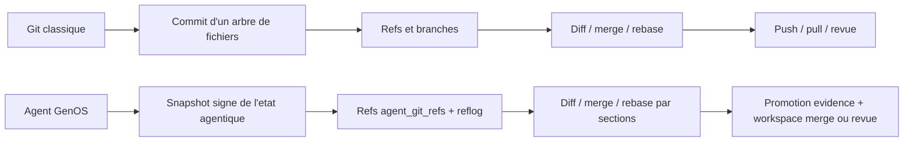

# Git transpose aux agents GenOS

## 1. Objet et périmètre

Cette documentation décrit la transposition des primitives Git vers les agents GenOS. Elle couvre deux couches complémentaires qu’il faut distinguer :

- le **Git de l’état agentique**, implémenté par `agentGitService`, qui versionne l’identité, les décisions, les mémoires, les exécutions, les plasmides et les permissions d’un agent dans SQLite ;
- le **Git du workspace**, implémenté par les services de workspace et le daemon, qui manipule des fichiers, des branches et des worktrees réels.

GenOS ne transforme donc pas un agent en dépôt Git classique. Il applique les invariants utiles de Git à un état cognitif et opérationnel, avec isolation tenant/workspace, hash, signature, hooks, refs et audit.

Références d’implémentation :

- [agentGitService.js](../backend/src/services/agentGitService.js)
- [agentGitController.js](../backend/src/controllers/agentGitController.js)
- [lineageRoutes.js](../backend/src/routes/lineageRoutes.js)
- [agentWorkspaceLifecycleService.js](../backend/src/services/agentWorkspaceLifecycleService.js)
- [daemonRepoWorkerService.js](../backend/src/services/daemonRepoWorkerService.js)

## 2. Définition fonctionnelle

Dans Git, un commit est une référence immuable vers un état de fichiers. Dans GenOS, un commit agentique est un snapshot JSON complet de l’état observable d’un agent, calculé par `collectState()` puis stocké dans `agent_git_objects`.

Un état GenOS contient notamment :

- l’agent et ses paramètres d’exécution ;
- les décisions génomiques ;
- les mémoires épisodiques ;
- les runs de stratégies ;
- les plasmides et permissions ;
- les événements et les enfants de lineage.

Chaque objet reçoit un hash SHA-256 de son état et une signature HMAC-SHA256 par défaut, ou Ed25519 si une clé privée est configurée. Les refs pointent vers les objets et sont mises à jour avec une version et un lease token optionnel.

## 3. Modèle logique et mathématique

On note l’état capturé d’un agent :

$$
A = (I, D, M, R, P, Q, E, C)
$$

avec :

- $I$ = identité et configuration de l’agent ;
- $D$ = décisions ;
- $M$ = mémoires ;
- $R$ = exécutions de stratégies ;
- $P$ = plasmides et permissions ;
- $Q$ = état de sécurité et paramètres cognitifs ;
- $E$ = événements ;
- $C$ = enfants et relations de lineage.

Le hash d’état est :

$$
H(A) = SHA256(JSON.stringify(A))
$$

Une opération de diff compare les sections de $A_1$ et $A_2$ :

$$
\Delta(A_1, A_2) = \{s \mid JSON(A_1[s]) \neq JSON(A_2[s])\}
$$

La signature porte sur le hash et les métadonnées :

$$
S = Sign(H(A) : metadata)
$$

Cela garantit l’intégrité de la représentation stockée. Cela ne prouve pas à lui seul la justesse métier des décisions contenues dans l’état.

## 4. Analogies biologiques et limites réelles

La transposition reprend les invariants de Git sans prétendre à une équivalence biologique :

| Notion GenOS | Analogie fonctionnelle | Limite réelle |
|---|---|---|
| agent versionné | cellule avec identité et état | l’état est un JSON relationnel, pas une cellule biologique |
| branche d’agent | lignée ou hypothèse concurrente | une ref ne crée pas automatiquement un nouveau workspace |
| fork de mission | différenciation d’un descendant | le fork d’agent et le fork de fichiers sont deux mécanismes distincts |
| merge contrôlé | intégration de traits compatibles | les conflits sont surtout détectés sur des champs et sections connus |
| pruning / GC | élimination d’artefacts inutiles | le GC Git agentique est explicite et vise surtout stash/remote |

Les concepts biologiques de lineage, sélection et apoptose restent des modèles d’organisation. Ils ne remplacent ni la vérification de preuve, ni la validation des tests, ni l’approbation humaine.

## 5. Cas d’usage et objectifs métier

### 5.1 Versionner une décision d’agent

Un orchestrateur peut committer l’état d’un agent après une étape importante. Le snapshot signé sert de point de comparaison, de restauration ou d’audit.

### 5.2 Tester une hypothèse sans contaminer le parent

Un agent descendant travaille dans un état ou une capsule séparée. `diff`, `replay`, `bisect` et `merge` permettent d’évaluer la trajectoire avant promotion.

### 5.3 Partager une mémoire ou une décision

`cherry-pick` applique sélectivement des sections d’un objet vers un autre agent. Le transfert par défaut porte sur les décisions, mémoires, plasmides et permissions, pas sur les événements historiques.

### 5.4 Maintenir un dépôt de code avec un agent

Le daemon crée un worktree Git persistant sur une branche `genos-daemon/...`, le resynchronise par rebase sur la branche humaine, applique un correctif vérifié par les tests autorisés, puis pousse la branche et ouvre une pull request si `gh` est disponible.

## 6. Comparaison directe schématique

### 6.1 Vue d’ensemble



### 6.2 Primitive par primitive

| Git fait | GenOS fait avec les agents | Stockage ou service | Différence à retenir |
|---|---|---|---|
| `commit` | capture l’état complet et crée un objet signé | `agent_git_objects` | versionne l’état d’agent, pas les fichiers du dépôt |
| `branch` | déplace une ref nommée vers un objet d’état | `agent_git_refs` | une ref agentique ne vaut pas automatiquement une branche Git fichier |
| `checkout` / `reset` | applique un snapshot à un agent cible | `applyState()` / `checkoutAgentState()` | peut réécrire des sections persistées de l’agent |
| `diff` | compare les sections `agent`, `decisions`, `memories`, `runs`, etc. | `collectState()` | diff sémantique d’état, pas diff ligne par ligne |
| `merge` | déduplique les collections et demande une résolution de conflit | `merge()` | conflits ciblés sur `role` et `model_tier`, autres sections fusionnées par déduplication |
| `merge-base` | cherche un ancêtre commun par hash d’état | `mergeBase()` | recherche dans les objets d’agent, indépendante du DAG Git de fichiers |
| `rebase` | rejoue un état sur une autre base | `rebase()` | les sections divergentes peuvent exiger `ours` ou `onto` |
| `stash` | enregistre un snapshot temporaire | objet `stash` | la rétention est manuelle via `gc` |
| `tag` | crée un objet stable éventuellement verrouillé | objet `tag` | un tag verrouillé ne peut pas être remplacé |
| `push` | crée un objet `remote` et peut l’envoyer par HTTP | `remote/push` | pas de transport Git SSH ou `git://` dans ce service |
| `fetch` | récupère les objets distants disponibles | `remote/fetch` | ne modifie pas l’agent cible |
| `pull` | applique un objet distant, éventuellement par sections | `applyState()` | pull est une application d’état, pas un checkout de fichiers |
| `cherry-pick` | copie des sections sélectionnées d’un objet | `applyState()` | transfert sémantique et partiel |
| `revert` | crée un nouvel état inverse pour décisions/mémoires | `revert()` | ne supprime pas l’objet historique original |
| `log` | liste les objets et valide leur signature | `agent_git_objects` | historique borné à 1000 objets |
| `reflog` | trace les déplacements de refs | `agent_git_reflog` | audit des pointeurs, séparé du lineage métier |
| `blame` | remonte l’agent source et la date d’un item | `blame()` | provenance au niveau des éléments d’état |
| `hook` | active `pre-commit`, `pre-push`, `merge-validation` ou signature requise | `agent_git_hooks` | hooks synchrones et politiques GenOS |
| `fsck` | vérifie JSON, hash, signature et parents déclarés | `fsck()` | intégrité de l’objet, pas santé métier complète |
| `gc` | supprime les vieux objets `stash` et `remote` | `gc()` | déclenchement explicite, commits conservés |
| `worktree` | crée un environnement fichier isolé pour un worker ou daemon | workspace lifecycle / daemon | hors de `agentGitService` |
| pull request | ouvre une revue de code après correctif testé | daemon + `gh` CLI | concerne le dépôt Git réel, pas un objet d’état agentique |

### 6.3 Séquence parallèle

```text
Git fichier                              GenOS agentique
-----------                              ---------------
modifier des fichiers                    modifier décisions / mémoire / configuration
        |                                         |
git add + git commit                     collectState + hashState + signature
        |                                         |
branche Git / HEAD                       agent_git_refs / reflog
        |                                         |
diff ligne / merge 3-way                 diff de sections / merge d'état
        |                                         |
tests + revue + push                     evidence + policy gate + promotion
        |                                         |
pull request                             workspace merge ou revue humaine
```

## 7. Architecture technique

Les routes sont montées sous `/api/lineage` et protégées par le scope tenant. Les opérations de lecture exigent `read`; les mutations exigent `workspace:write`.

| Surface | Fonction |
|---|---|
| `POST /agents/git/commit` | créer un commit d’état |
| `POST /agents/git/diff` | comparer deux agents |
| `POST /agents/git/merge` | fusionner deux états |
| `POST /agents/git/rebase` | rebaser un objet |
| `POST /agents/git/push`, `/fetch`, `/pull` | répliquer et appliquer des objets distants |
| `POST /agents/git/log`, `/show`, `/reflog`, `/fsck` | inspecter et vérifier l’historique |
| `POST /agents/git/blame`, `/note`, `/describe`, `/archive` | provenance, annotation et archivage |
| `POST /agents/git/stash`, `/tag`, `/cherry-pick`, `/revert` | opérations de transfert et de restauration |
| `POST /agents/git/hook`, `/gc`, `/bisect`, `/merge-base` | politiques, maintenance et analyse |

Les tables principales sont `agent_git_objects`, `agent_git_refs`, `agent_git_reflog`, `agent_git_hooks`, `agent_git_notes` et `agent_git_archives`. Le scope `organization_id` / `project_id` empêche les opérations inter-tenants et les merges entre workspaces différents.

Pour les fichiers, [workspaceSnapshotStore.js](../backend/src/services/workspaceSnapshotStore.js) capture des snapshots checksumés et [agentWorkspaceLifecycleService.js](../backend/src/services/agentWorkspaceLifecycleService.js) crée un worktree Git ou une copie non-Git. Le daemon ajoute une branche persistante et une automatisation de pull request.

## 8. Processus d’exécution et de validation

### Commit d’état agentique

1. Vérifier l’existence de l’agent dans le scope tenant courant.
2. Collecter l’état relationnel avec `collectState()`.
3. Exécuter le hook `pre-commit` s’il est configuré.
4. Calculer le hash et signer les métadonnées.
5. Persister l’objet et avancer la ref avec contrôle de version.
6. Écrire l’entrée de reflog.

### Promotion d’un changement de workspace

1. Créer ou reprendre une capsule/worktree isolée.
2. Capturer la base causale si le contrat l’exige.
3. Exécuter le patch et les tests allow-listés.
4. Collecter evidence, replay et approbation selon la policy.
5. Effectuer un merge 3-way si une base causale existe.
6. Bloquer la promotion en cas de conflit ou de preuve manquante.

Le service [strategyPromotionPolicyService.js](../backend/src/services/strategyPromotionPolicyService.js) ne doit pas être confondu avec `agentGitService` : il fusionne des fichiers de workspace après validation, alors que `agentGitService.merge()` fusionne des états d’agents.

## 9. Comparaison avec Git et le marché

Git reste le système de référence pour le versionnement distribué de fichiers : son DAG, ses objets delta, ses transports et ses outils de revue sont plus adaptés au code source qu’un snapshot JSON d’agent.

GenOS ajoute une couche que Git ne fournit pas nativement :

- versionner les décisions, mémoires et budgets avec l’identité de l’agent ;
- attacher des preuves, hooks et politiques de promotion au changement ;
- isoler les tenants, workspaces et branches de mission ;
- décider si une branche agent est survivante, rejetée, rejouée ou remplacée ;
- conserver une provenance cognitive au niveau des items.

La bonne architecture est donc complémentaire : Git pour les fichiers et le code, GenOS pour l’état agentique, les preuves et la gouvernance de promotion.

## 10. Limites, garde-fous et non-objectifs

### Limites d’implémentation

- Un commit agentique stocke un snapshot JSON complet ; il n’utilise pas de deltas Git.
- `agentGitService` ne crée pas de worktree et ne versionne pas les fichiers du dépôt.
- La signature est vérifiée avec la configuration de clé du serveur ; il n’y a pas de négociation d’algorithme par objet.
- `push` et `fetch` distants utilisent HTTP ; ils ne sont pas un transport Git natif.
- Le verrouillage des refs est optimiste ; une concurrence peut produire `AGENT_REF_CONFLICT` ou `AGENT_REF_LEASE_CONFLICT`.
- Le merge d’état détecte principalement les conflits de rôle et de modèle ; les collections sont fusionnées par déduplication.
- Le replay vérifie l’intégrité et l’ordre des événements capturés ; il ne garantit pas une re-exécution déterministe de tous les effets externes.
- Le GC doit être appelé explicitement et ne purge que les catégories prévues.

### Garde-fous obligatoires

- ne pas confondre `state_hash` avec une preuve de vérité métier ;
- exiger replay, evidence et approbation humaine pour les promotions à impact élevé ;
- conserver les branches rejetées lorsqu’une policy l’impose ;
- utiliser un worktree ou une capsule isolée avant toute mutation de fichiers ;
- garder les secrets de signature hors du dépôt et configurer Ed25519 en production lorsque la chaîne de clés est disponible.

### Non-objectifs

Cette transposition ne cherche pas à remplacer Git, à fournir une blockchain, à rendre une décision correcte par le seul fait qu’elle est signée, ni à donner à un agent un accès autonome illimité au dépôt ou à la production.
