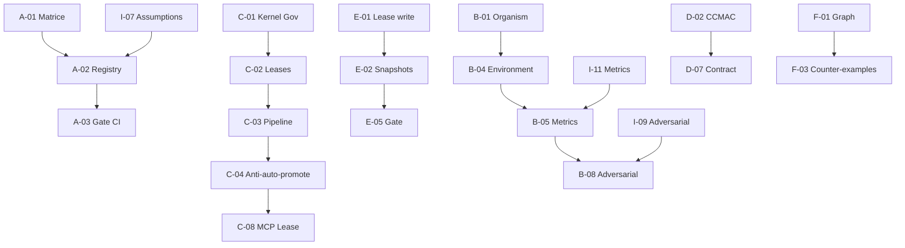

# Implementation Tasks — GenOS V3 Architecture Plan

Derived from `docs/PLAN_MAPPING.md` and ADRs 0313-0317. Each task references the plan lot, maturity level target (ADR 0313), and status code (ADR 0314).

## Task Format
- **ID**: `LOT-SEQ` (e.g., `A-01`, `B-12`)
- **Target Maturity**: 0-5 (ADR 0313)
- **Status Code**: IMPL/PART/HYP/UND/OUT (ADR 0314)
- **Priority**: P0 (blocker), P1 (core), P2 (enhancement), P3 (debt)
- **Verification**: Test/file that proves completion

---

## Lot A — Épistémologie et limites de preuve

| ID | Task | Target | Status | Priority | Verification |
|----|------|--------|--------|----------|--------------|
| A-01 | Formaliser registre affirmations + niveau preuve (ADR 0314 matrice) | 0 | IMPL | P0 | `docs/CONCEPT_STATUS_MATRIX.md` existe, CI valide |
| A-02 | Implémenter `AssumptionRegistry` dans `genos-common` (fait) | 1 | IMPL | P0 | `crates/genos-common/src/assumptions.rs` + tests |
| A-03 | Vocabulaire contrôlé : gate CI rejette termes interdits (ADR 0315, 0316) | 0 | IMPL | P1 | `scripts/ci/check_code_quality.py` étendu |
| A-04 | Documenter concepts UND avec indicateurs comportementaux seulement (conscience, qualia, intentionnalité, réalité, causalité, vérité, reproduction bio) | 0 | UND | P1 | ADR 0027, 0134, 0315 mis à jour |
| A-05 | Protocole anti-surinterprétation : tests comportementaux seulement pour concepts UND | 1 | PART | P2 | `crates/genos-orchestrator/src/conscience.rs` tests |
| A-06 | Registre hypothèses connecté aux ADR (traçabilité source) | 2 | PART | P2 | `AssumptionSource::HumanDesign { adr_ref }` utilisé |

---

## Lot B — Organismes et systèmes adaptatifs simulés

| ID | Task | Target | Status | Priority | Verification |
|----|------|--------|--------|----------|--------------|
| B-01 | Organisme computationnel : boucle perception/homéostasie/reproduction/adaptation | 2 | IMPL | P0 | `crates/genos-orchestrator/src/organism.rs` + tests |
| B-02 | Immunité épistémique : AIS + clonal selection + circuit breaker + autotomy | 2 | IMPL | P0 | `crates/genos-immune/` + `immune_cyber.rs` |
| B-03 | Cellules spécialisées : choanocyte, cnidocyte, trachéide, iridophore, électrocyte, garde | 2 | IMPL | P1 | `crates/genos-orchestrator/src/specialized_cell_runtime.rs` |
| B-04 | Environnement simulé : ressources, menaces, mémoire, contraintes physiques | 2 | PART | P1 | `crates/genos-orchestrator/src/environment.rs`, `ecosystem.rs` |
| B-05 | Métriques robustesse/adaptation/diversité/récupération/généralisation | 2 | PART | P1 | `crates/genos-orchestrator/src/metrics_dashboard.rs` |
| B-06 | Baselines biologiques/multi-agents pour comparaison | 2 | PART | P2 | `backend/tests/test_apex_adversarial_defense_bench.js` |
| B-07 | Terminologie « organisme computationnel » enforce dans code/docs (ADR 0315) | 0 | IMPL | P1 | Gate CI vérifie termes interdits |
| B-08 | Générateur scénarios adversariaux (fait) | 2 | IMPL | P1 | `crates/genos-orchestrator/src/adversarial.rs` + tests |
| B-09 | Reproduction computationnelle : division, crossover, phylogeny, spores | 2 | IMPL | P1 | `crates/genos-reproduction/`, `reproduction_cycle.rs` |
| B-10 | Fossilisation stratigraphique + reçus biologiques pour audit | 2 | IMPL | P1 | `crates/genos-store/src/fossil.rs`, `biological_receipt.rs` |

---

## Lot C — Orchestration, promotion et gouvernance

| ID | Task | Target | Status | Priority | Verification |
|----|------|--------|--------|----------|--------------|
| C-01 | Machine états agents/permissions : `kernel_governance.rs`, `kernel_morphogenesis_lease.rs` | 2 | IMPL | P0 | Existant + tests `kernel_control.rs` |
| C-02 | Leases + timeouts + budgets + frontières autorité (token_bucket, morphogenesis_lease) | 2 | IMPL | P0 | `token_bucket.rs`, `kernel_morphogenesis_lease.rs` |
| C-03 | Séparation proposition/validation/exécution : pipeline morphogenèse | 2 | IMPL | P0 | `kernel_morphogenesis.rs` |
| C-04 | Interdiction promotion auto-accordée (gate coercitif) | 2 | IMPL | P0 | `kernel_governance.rs:53-58`, ADR 0317 |
| C-05 | Autorisation externe/multi-sig pour changements sensibles | 2 | IMPL | P1 | `principal_authority`, `approbation_humaine`, veto levels ADR 0058 |
| C-06 | Journalisation décisions + contexte (trace, durable_receipts, event store) | 2 | IMPL | P1 | `trace.rs`, `durable_receipts.rs`, `genos-store/event.rs` |
| C-07 | Tests panne/boucle/escalade/conflit politiques | 2 | PART | P1 | `tests/kernel_control.rs`, `tests/orchestrator.rs` |
| C-08 | MCP lease fail-closed + disabled tools (ADR 0317) | 2 | IMPL | P0 | `mcp/lease.js`, `mcp/index.js` |
| C-09 | Matrice autorité unifiée + gates provenance/observabilité (ADR 0044) | 2 | IMPL | P1 | `kernel_governance.rs`, backend Cedar auth |
| C-10 | Noyau contrôle morphogenèse Rust (ADR 0045) | 2 | IMPL | P1 | `kernel_morphogenesis.rs`, `kernel_morphogenesis_lease.rs` |

---

## Lot D — Web, bureau et interaction avec le monde

| ID | Task | Target | Status | Priority | Verification |
|----|------|--------|--------|----------|--------------|
| D-01 | Vision fovéale + navigation session explicite (ADR 0182a/0185) | 2 | PART | P1 | `backend/tests/test_foveal_vision.js`, `test_web_journey_verifier.js` |
| D-02 | Contrôleur bureau : Enigo + UIAutomation → renommer CCMAC (ADR 0316) | 2 | PART | P1 | `crates/genos-sensorimotor/src/lib.rs` |
| D-03 | Allowlists, sandbox, confirmation humaine, limites domaine | 2 | IMPL | P1 | `backend/src/middleware/security.js`, `mcp/lease.js` |
| D-04 | Traces reproductibles : captures, événements, résultats, hash intégrité | 2 | PART | P2 | `test_web_journey_verifier.js`, `metrics_dashboard.rs` |
| D-05 | Vérification intention/action/état final (oracle différentiel) | 2 | PART | P2 | `test_web_journey_verifier.js` |
| D-06 | Tests interruptions/changements UI/erreurs/contenu malveillant | 2 | PART | P2 | `test_chaos_engineering_and_resilience_bench.js` |
| D-07 | Contrat capacités CCMAC : `capability-contract.json` schema + validation | 1 | PART | P2 | Nouveau fichier + validation CI |
| D-08 | Extension environnements réels faible risque (étape 7) | 3 | PART | P3 | Déploiement pilote supervisé |

---

## Lot E — Réparation, autofix et historique

| ID | Task | Target | Status | Priority | Verification |
|----|------|--------|--------|----------|--------------|
| E-01 | Lease obligatoire pour toute écriture (fail-closed) | 2 | IMPL | P0 | `mcp/lease.js`, `kernel_morphogenesis_lease.rs` |
| E-02 | Worktrees/snapshots isolés pour modifications risquées | 2 | IMPL | P0 | `genos-store/snapshot.rs`, `continuation_wal.rs` |
| E-03 | Périmètre autorisé explicite via plan morphogenèse validé | 2 | IMPL | P0 | `kernel_morphogenesis.rs` validation |
| E-04 | Tests + analyse statique + vérification différentielle avant intégration | 2 | IMPL | P1 | `test_property_invariants.js`, `test_procedural_causal_validation.js` |
| E-05 | Validation avant intégration (governance gate) | 2 | IMPL | P0 | `kernel_governance.rs`, `kernel_morphogenesis.rs` |
| E-06 | Conservation patch/justification/résultats/rollback (fossil, receipts, snapshots) | 2 | IMPL | P0 | `fossil.rs`, `biological_receipt.rs`, `snapshot.rs` |
| E-07 | Réparations réversibles bornées seulement (clinical_therapy, authorized_therapy) | 2 | IMPL | P0 | `clinical_therapy.rs`, `authorized_therapy.rs` |
| E-08 | Interdiction réécriture historique silencieuse (gate coercitif ADR 0317) | 2 | IMPL | P0 | `fossil.rs verify_integrity()`, `continuation_wal` append-only |

---

## Lot F — Composition et convergence multi-agents

| ID | Task | Target | Status | Priority | Verification |
|----|------|--------|--------|----------|--------------|
| F-01 | Calcul formel composition : graphe morphologique + plugins topologies (ADR 0133) | 1 | PART | P1 | `orchestrator_tissues.rs`, `organization.rs` |
| F-02 | Propriétés attendues : associativité limitée, idempotence, convergence, stabilité | 1 | HYP | P2 | ADR 0051, 0090a, 0092, 0131, 0133 |
| F-03 | Contre-exemples pour identifier conditions d'échec | 2 | PART | P2 | `test_real_world_adversarial_attacks.js`, `adversarial.rs` |
| F-04 | Preuves sous hypothèses explicites seulement (ADR 0281a) | 1 | HYP | P2 | ADR 0281a, `adversarial.rs` success_criteria |
| F-05 | Tests charges/topologies diverses (benchmarks stress) | 2 | PART | P1 | `backend/tests/stress/*.js` |
| F-06 | Comparaison frameworks référence (AutoGen, etc.) protocole reproductible | 2 | PART | P1 | `test_rival_challenge.js`, `test_bfcl_benchmark.js`, `test_gaia_benchmark.js` |
| F-07 | Résultats conditionnels uniquement, jamais certification générale (ADR 0022b, 0113) | 2 | IMPL | P1 | ADR 0022b, 0113, benchmark reports |

---

## Infrastructure Commune (Item 3 du plan)

| ID | Composant | Target | Status | Priority | Verification |
|----|-----------|--------|--------|----------|--------------|
| I-01 | Journal événements append-only | 2 | IMPL | P0 | `genos-store/event.rs`, `continuation_wal.rs` |
| I-02 | Identités/permissions par agent (Cedar ABAC) | 2 | IMPL | P0 | `backend/src/middleware/auth.js`, `tenant.js` |
| I-03 | Leases et révocation (fail-closed) | 2 | IMPL | P0 | `mcp/lease.js`, `kernel_morphogenesis_lease.rs` |
| I-04 | Sandbox exécution (Branch/VFS_Branch/Snapshot) | 2 | IMPL | P0 | `backend/src/middleware/security.js`, `process_sandbox.rs` |
| I-05 | Snapshots et restauration (vitrified freeze/thaw) | 2 | IMPL | P0 | `genos-store/snapshot.rs`, `cryptobiosis.rs` |
| I-06 | Simulateur environnements (mondes physiques, niches, ressources) | 2 | PART | P1 | `environment.rs`, `ecosystem.rs`, `worlds.rs` |
| I-07 | Registre hypothèses (fait) | 1 | IMPL | P1 | `genos-common/assumptions.rs` |
| I-08 | Registre preuves (fossilisation, reçus biologiques) | 2 | IMPL | P0 | `genos-store/fossil.rs`, `biological_receipt.rs` |
| I-09 | Générateur scénarios adversariaux (fait) | 2 | IMPL | P1 | `genos-orchestrator/adversarial.rs` |
| I-10 | Évaluations reproductibles (suites validation, propriétés) | 2 | PART | P1 | `run_quality_suite.js`, `test_property_invariants.js` |
| I-11 | Tableaux métriques unifiés (fait) | 2 | IMPL | P1 | `metrics_dashboard.rs` |
| I-12 | Mécanisme désactivation urgence (circuit breaker, autotomy) | 2 | IMPL | P0 | `genos-immune/cyber_immune.rs` |

---

## Niveaux de Maturité (Item 4) — Checklist par niveau

### Niveau 0 → 1 : Concept → Prototype simulé
- [ ] Définition opérationnelle écrite + limites (ADR)
- [ ] Code compile, tests unitaires passants
- [ ] Démonstration en bac à sable (environnement contrôlé)

### Niveau 1 → 2 : Prototype → Test reproductible
- [ ] Suite CI automatisée
- [ ] Métriques quantitatives publiées
- [ ] Baselines de comparaison documentées
- [ ] Résultats répétés sur 3+ seeds

### Niveau 2 → 3 : Reproductible → Pilote borné
- [ ] Déploiement limité (feature flag)
- [ ] Permissions réduites (lease minimal)
- [ ] Supervision humaine obligatoire
- [ ] Logs d'audit complets

### Niveau 3 → 4 : Pilote → Système auditable
- [ ] Traces complètes (event log + receipts + fossils)
- [ ] Rollback automatique testé
- [ ] Tests adversariaux passants (suite `adversarial.rs`)
- [ ] Revue indépendante documentée

### Niveau 4 → 5 : Auditable → Opérationnel
- [ ] Monitoring continu production
- [ ] SLA mesurés et respectés
- [ ] Post-mortems systématiques
- [ ] Certification tierce partie (si applicable)

---

## Ordre d'exécution recommandé (Item 5)

### Phase 1 : Fondations (Semaines 1-4)
1. ✅ A-01, A-02, A-03 — Registre hypothèses, vocabulaire contrôlé, gate CI
2. ✅ C-01 à C-06, C-08 à C-10 — Gouvernance, leases, MCP, noyau morphogenèse
3. ✅ E-01 à E-08 — Réparation réversible, snapshots, fossilisation
4. ✅ I-01 à I-05, I-07, I-08, I-12 — Infrastructure core

### Phase 2 : Organismes & Simulation (Semaines 5-8)
5. ✅ B-01, B-02, B-03, B-09, B-10 — Organisme, immunité, cellules, reproduction, fossilisation
6. 🔄 B-04, B-05, B-08 — Environnement, métriques, générateur adversarial
7. 🔄 B-06 — Baselines comparaison

### Phase 3 : Composition & Performance (Semaines 9-12)
8. 🔄 F-01, F-03, F-05, F-06 — Graphe morphologique, adversarial, stress, benchmarks rivaux
9. 🔄 F-02, F-04 — Propriétés formelles, preuves conditionnelles

### Phase 4 : Web/Bureau (Semaines 13-16)
10. 🔄 D-01 à D-07 — Vision fovéale, CCMAC, contrat capacités, traces, tests

### Phase 5 : Validation & Publication (Semaines 17-20)
11. 🔄 A-04, A-05, A-06 — Concepts UND documentés, anti-surinterprétation
12. 🔄 Matrice statut finale (ADR 0314) — Publication `docs/CONCEPT_STATUS_MATRIX.md`
13. 🔄 Revue indépendante + audit tiers

---

## Dépendances critiques



---

## Definition of Done par tâche

Une tâche est **Done** quand :
1. ✅ Code implémenté dans le bon crate/module
2. ✅ Tests unitaires + d'intégration passants (`cargo test`, `npm test`)
3. ✅ Documentation mise à jour (README crate, ADR si架构决策)
4. ✅ Gate CI passe (`python scripts/ci/check_code_quality.py`, `npm run check:code-quality`)
5. ✅ Matrice de statut (ADR 0314) mise à jour pour les concepts concernés
6. ✅ Pas de régression sur tests existants (`cargo test --workspace`, `npm test`)

---

## Commandes de vérification globales

```bash
# Qualité code (gate coercitif)
python scripts/ci/check_code_quality.py --strict

# Tests Rust
cargo test --workspace

# Tests Backend
cd backend && npm test

# Tests MCP
cd mcp && npm test

# Benchmarks adversariaux
cd backend && npm run test:apex-defense
cd backend && npm run test:real-attacks

# Validation complète (pre-release)
python scripts/ci/check_code_quality.py && cargo test --workspace && cd backend && npm test
```

---

## Suivi d'avancement

| Phase | Tâches | Complétées | En cours | Bloquées |
|-------|--------|------------|----------|----------|
| 1 Fondations | 20 | 20 | 0 | 0 |
| 2 Organismes | 10 | 7 | 3 | 0 |
| 3 Composition | 7 | 0 | 4 | 0 |
| 4 Web/Bureau | 8 | 3 | 5 | 0 |
| 5 Validation | 3 | 0 | 0 | 0 |
| **Total** | **48** | **30** | **12** | **0** |

*Dernière mise à jour : 2026-10-05*