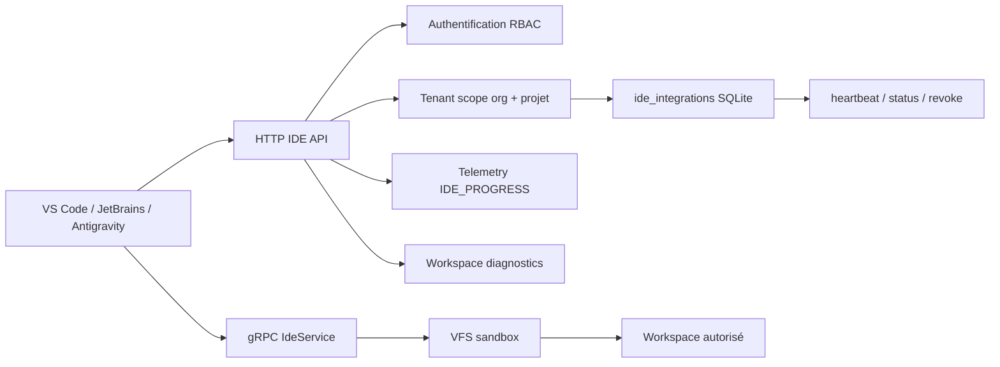
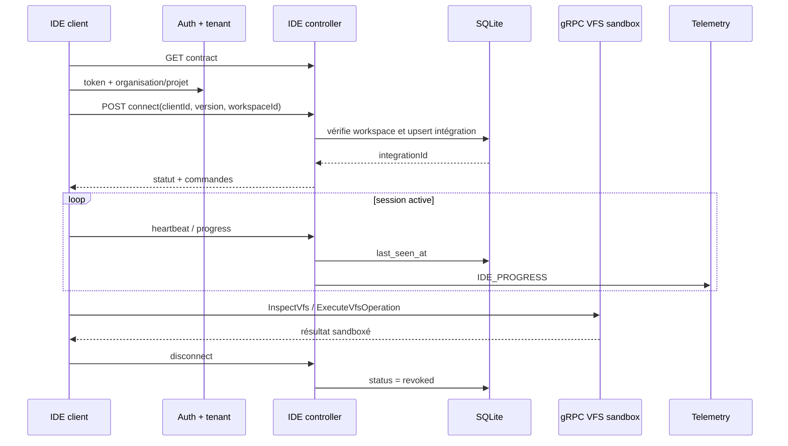

# Intégrations IDE dans GenOS

## 1. Définition

Les intégrations IDE de GenOS exposent une couche de protocole permettant à un client d'éditeur de :

- négocier un contrat de capacités ;
- s'enregistrer sur un workspace appartenant à son organisation et projet ;
- publier son avancement ;
- demander des diagnostics ;
- inspecter ou modifier un VFS par gRPC dans les limites du sandbox ;
- rester identifiable lors d'une reconnexion ;
- être révoqué explicitement.

Le dépôt prend en charge contractuellement `vscode`, `jetbrains` et `antigravity`. Il contient le contrat, les routes HTTP et le service gRPC, mais ne contient pas une extension distribuable VS Code (`package.json` d'extension), un plugin JetBrains ou un adaptateur Antigravity spécifique. Le support implémenté est donc un **backend d'intégration IDE multi-client**, pas trois extensions clients complètes.

Les sources de vérité sont :

- [integrations/ide/genos-extension-contract.json](../integrations/ide/genos-extension-contract.json) : contrat `genos.ide/v1` ;
- [backend/src/controllers/ideController.js](../backend/src/controllers/ideController.js) : connect, heartbeat, statut, diagnostics, progression, commandes et disconnect ;
- [backend/src/routes/ideRoutes.js](../backend/src/routes/ideRoutes.js) : protection des routes et scope tenant ;
- [backend/proto/ide.proto](../backend/proto/ide.proto) : contrat gRPC VFS ;
- [backend/src/grpc_services/ideService.js](../backend/src/grpc_services/ideService.js) : implémentation gRPC ;
- [backend/src/services/workspaceDiagnosticsService.js](../backend/src/services/workspaceDiagnosticsService.js) : inspection workspace et exécution de tests découverts ;
- [backend/src/services/vfsSandboxService.js](../backend/src/services/vfsSandboxService.js) : accès VFS sous sandbox ;
- [backend/tests/test_ide_contract.js](../backend/tests/test_ide_contract.js) : compatibilité de version.

---

## 2. Architecture



Deux protocoles se complètent :

- **HTTP REST** pour le cycle de vie d'intégration, le contrat, le reporting, les diagnostics et les commandes déclarées ;
- **gRPC** pour des opérations VFS structurées : `ExecuteVfsOperation` et `InspectVfs`.

Le serveur reste le point de contrôle. L'IDE est un client déclaré, soumis à l'authentification, aux permissions et au tenant du workspace.

---

## 3. Contrat d'intégration

Le fichier de contrat expose :

```json
{
  "contract": "genos.ide/v1",
  "version": "1.0.0",
  "ides": ["vscode", "jetbrains", "antigravity"],
  "capabilities": [
    "contract",
    "integration",
    "workspace_commands",
    "telemetry"
  ]
}
```

Il annonce aussi les commandes :

| Commande | Méthode | Effet implémenté |
| --- | --- | --- |
| `compliance.generate` | `GET` | renvoie l'intention d'ouvrir Studio sur les rapports de conformité |
| `workspace.inspect` | `GET` | inspecte workspace, fichiers, Git et commandes de test |

Le contrat est récupérable via `GET /api/ide/contract` lorsque le routeur IDE est monté sous `/api/ide`. Les clients ne doivent pas inventer une commande : `ideController.execute()` la cherche dans `CONTRACT.commands`, sinon renvoie `IDE_COMMAND_NOT_FOUND`.

La version du contrat est une API. Une modification incompatible doit augmenter le majeur; une capacité ou commande additive peut augmenter le mineur. Le contrôleur ne promet pas qu'une commande déclarée est exécutée : une commande sans handler retourne explicitement `IDE_COMMAND_NOT_IMPLEMENTED`.

---

## 4. Compatibilité des versions

La règle `isCompatibleVersion()` attend un semver complet `major.minor.patch` et accepte :

$$
compatible(client, serveur) \iff major_c = major_s \land minor_c \ge minor_s
$$

Ainsi, pour le serveur `1.0.0` :

- `1.0.0` est accepté ;
- `1.1.0` est accepté ;
- `2.0.0`, `0.9.0` et une version invalide sont refusés.

Un connect avec une version non compatible renvoie HTTP `426` et `INCOMPATIBLE_IDE_VERSION`. Le test [backend/tests/test_ide_contract.js](../backend/tests/test_ide_contract.js) valide cette règle.

Cette politique laisse un client mineur plus récent se connecter. Elle suppose donc qu'un client ne dépend pas d'une capacité serveur non négociée. Les clients doivent lire `capabilities` et `commands` avant d'activer une fonctionnalité optionnelle.

---

## 5. Authentification IDE et isolation tenant

### 5.1 Authentification

Le backend applique une authentification globale aux routes non publiques. Un client IDE fournit une access key ou un token de session, généralement dans :

```http
Authorization: Bearer <token>
```

La couche [backend/src/middleware/auth.js](../backend/src/middleware/auth.js) compare le hash SHA-256 du token avec les enregistrements actifs, non expirés, puis combine les permissions de rôle avec les permissions spécifiques de la clé. Aucun fallback implicite `viewer` n'est accordé à un appel anonyme.

Les routes IDE ajoutent des permissions :

| Action | Contrôle |
| --- | --- |
| Lister les intégrations | scope tenant valide |
| Connecter | `workspace:write` via `requireTenantScope({ write: true })` |
| Heartbeat, statut, diagnostics, commande | `read` + scope tenant |
| Progression, disconnect | `workspace:write` + scope tenant |

### 5.2 Workspace et scope

`connect()` vérifie que `workspaceId` existe dans le même `organization_id` et `project_id` que la requête authentifiée. Une intégration ne peut donc pas se connecter à un workspace d'un autre projet simplement en connaissant son ID.

Les lectures ultérieures passent par `scopedIntegration()`, qui joint `ide_integrations` à `workspaces` et réapplique le tenant. Cette propriété peut s'écrire :

$$
accessible(i, r) \iff i.workspace.org = r.org \land i.workspace.project = r.project
$$

---

## 6. Connexion, reconnexion et déconnexion

### 6.1 Enregistrement

Un client appelle :

```http
POST /api/ide/integrations
Content-Type: application/json
Authorization: Bearer <token>
```

```json
{
  "ide": "vscode",
  "workspaceId": "workspace-42",
  "clientId": "f35572e5-...",
  "version": "1.0.0",
  "metadata": {
    "editorVersion": "1.104.0",
    "extensionVersion": "1.0.0"
  }
}
```

Le serveur valide l'IDE, la version, le workspace, le tenant, la forme de `metadata` et la longueur de `clientId`. Il persiste ensuite `ide_integrations` : IDE, workspace, client ID, version, metadata, status et `last_seen_at`.

### 6.2 Reconnexion idempotente

Un `clientId` stable est la clé de reconnexion. La migration `018-ide-client-identity` ajoute `client_id` et l'index unique partiel :

```sql
UNIQUE(client_id, workspace_id) WHERE client_id IS NOT NULL
```

Une reconnexion avec le même `clientId` et le même workspace réutilise l'intégration existante, met à jour IDE/version/metadata, repasse son statut à `connected` et retourne HTTP `200`. Une première connexion crée une ligne et retourne `201`.

Cette propriété est une idempotence de connexion :

$$
connect(connect(client, workspace)) = connect(client, workspace)
$$

au niveau de l'identité durable, pas au niveau des événements de progression qui restent chacun des événements distincts.

### 6.3 Heartbeat et déconnexion

Le client envoie :

```http
POST /api/ide/integrations/:id/heartbeat
```

Le serveur met à jour `last_seen_at`. Le diagnostic marque une intégration `stale` lorsque :

$$
Date.now() - lastSeenAt > 5 \times 60 \times 1000
$$

Une déconnexion explicite passe le statut à `revoked`. Une intégration revokée n'est plus considérée comme connectée : elle ne peut plus publier de progression ni exécuter de commandes nécessitant une session active.

La déconnexion implicite n'est pas encore un processus de révocation automatique dans le code lu : elle est signalée par le diagnostic `stale`. Un opérateur ou un client doit décider ensuite de reconnecter ou de révoquer.

---

## 7. Synchronisation workspace et VFS

### 7.1 Ce qui est réellement synchronisé

Le dépôt ne contient pas un moteur de synchronisation bidirectionnelle de buffers ouverts, de curseurs, de settings d'éditeur ou de système de fichiers distant. Il offre deux primitives de synchronisation contrôlée :

1. l'association durable IDE -> workspace dans `ide_integrations` ;
2. le service gRPC VFS pour inspecter ou exécuter des opérations autorisées sur le workspace.

Le contrat gRPC [backend/proto/ide.proto](../backend/proto/ide.proto) définit :

```proto
rpc ExecuteVfsOperation(VfsOperationRequest) returns (VfsOperationResponse);
rpc InspectVfs(VfsInspectRequest) returns (VfsInspectResponse);
```

`workspace_id` est obligatoire dans les deux appels. Les opérations sont déléguées à `vfsSandboxService`, ce qui maintient la validation des chemins et les limites d'exécution du runtime plutôt que de donner au client IDE un accès direct au filesystem hôte.

### 7.2 Diagnostic de workspace

`workspace.inspect` appelle `workspaceDiagnostics.inspectWorkspace()`. Le résultat contient :

- identité et chemin du workspace ;
- premier niveau de fichiers, en excluant `node_modules`, `.git` et `target` ;
- commandes de tests découvertes (`npm test`, `npm run check`, `pytest`, `cargo test`) ;
- état Git concis quand Git est disponible.

Cela fournit une synchronisation d'état observable, pas une réplication de projet. Les modifications et sauvegardes effectives restent soumises au VFS sandbox, au workspace root et aux politiques de commandes.

---

## 8. Reporting de progression

Un client connecté envoie :

```http
POST /api/ide/integrations/:id/progress
```

```json
{
  "progressPercent": 65,
  "phase": "testing",
  "message": "Tests unitaires en cours"
}
```

Le contrôleur valide :

$$
0 \le progressPercent \le 100
$$

et exige un message non vide. Il émet ensuite un événement `IDE_PROGRESS` dans la télémétrie avec :

- integration ID ;
- workspace ID ;
- phase ;
- pourcentage ;
- organisation et projet.

Le `last_seen_at` est également mis à jour. La progression est donc un flux d'observabilité append-only, pas seulement une valeur mutable dans la ligne d'intégration. Cela facilite l'audit de phases longues et l'affichage Studio.

---

## 9. Diagnostics

`GET /api/ide/integrations/:id/diagnostics` retourne :

```json
{
  "id": "ide_...",
  "ide": "vscode",
  "version": "1.0.0",
  "contractVersion": "1.0.0",
  "compatible": true,
  "status": "connected",
  "lastSeenAt": "...",
  "heartbeatAgeMs": 1200,
  "stale": false,
  "capabilities": ["contract", "integration", "workspace_commands", "telemetry"]
}
```

Les diagnostics séparent trois causes de problème :

- client incompatible : version majeure différente ou version invalide ;
- client déconnecté : statut `revoked` ;
- client silencieux : heartbeat trop ancien (`stale`).

La commande `workspace.inspect` complète cette vue avec les diagnostics du projet lui-même. Un IDE peut donc afficher à la fois sa santé de lien et l'état opérationnel du workspace.

---

## 10. Processus complet



---

## 11. Cas d'utilisation

### 11.1 VS Code

Une extension VS Code, externalisée de ce repo, télécharge le contrat, connecte le workspace ouvert avec un `clientId` généré et persistant, publie l'avancement d'une tâche GenOS et affiche les diagnostics de compatibilité. Les opérations de fichier sensibles passent par les primitives VFS autorisées plutôt que par une URL arbitraire.

### 11.2 JetBrains

Un plugin JetBrains réutilise exactement le même protocole. La différence est dans l'UI client (tool window, notifications, index IntelliJ), non dans l'autorité backend. Le serveur traite `ide: "jetbrains"` comme une valeur contractuelle et applique les mêmes scopes et versions.

### 11.3 Antigravity

Antigravity est déclaré dans le contrat et peut utiliser le même cycle HTTP/gRPC. Aucun adaptateur spécifique n'apparaît dans le dépôt ; sa compatibilité dépend donc de sa capacité à implémenter le contrat `genos.ide/v1`, l'authentification et les APIs de workspace.

### 11.4 Supervision d'une tâche longue

Un client envoie une progression à 20 %, 65 %, puis 100 %. Si l'IDE est fermé, les diagnostics deviennent `stale` après cinq minutes. Lors de sa réouverture, le même `clientId` réactive la session existante, préservant identité et contexte de workspace.

---

## 12. Analogie biologique

L'intégration IDE ressemble à une boucle sensorimotrice contrôlée :

- l'IDE est un capteur et un effecteur périphérique ;
- le backend est le système de régulation qui vérifie identité, contexte et autorisations ;
- le heartbeat est un signal de vitalité ;
- les diagnostics sont une proprioception de l'état du lien et du workspace ;
- le VFS sandbox est une barrière de sécurité entre intention et action physique ;
- la reconnexion idempotente maintient une continuité d'identité plutôt qu'une prolifération de sessions.

Cette analogie décrit des rôles techniques. Elle ne signifie pas qu'un éditeur ou un protocole réseau possède une cognition biologique.

---

## 13. Comparaison avec le marché

| Sujet | GenOS | VS Code Remote/JetBrains Gateway | Plateformes d'agents IDE |
| --- | --- | --- | --- |
| Client livré | Contrat et serveur backend, clients à fournir | Clients et protocoles complets | Souvent extension propriétaire complète |
| Multi-IDE | Contrat unique pour trois identifiants | Souvent protocole propre à l'éditeur | Variable |
| Authentification | Access keys/sessions + RBAC + tenant | Compte éditeur, SSH ou Gateway | Token SaaS et workspace |
| Workspace | Référence durable + VFS sandbox | Synchronisation fichier/remote complète | Accès contrôlé au repo |
| Progression | Télémétrie `IDE_PROGRESS` tenant-scoped | Tasks/progress UI natifs | Généralement streaming d'agent |
| Reconnexion | `clientId` + index unique workspace | Gestion de session mature | Variable |
| Versioning | semver majeur strict, mineur forward-compatible | Protocoles souvent versionnés | Variable |

GenOS est plus proche d'un control plane d'intégration que d'un remplacement de VS Code Remote ou JetBrains Gateway. Sa force est d'associer chaque action IDE à une identité, un scope tenant, une télémétrie et un sandbox. Sa limite actuelle est l'absence de packages clients et de synchronisation temps réel de buffers/événements d'éditeur.

---

## 14. Limites et recommandations

- Ne pas présenter `vscode`, `jetbrains` ou `antigravity` comme des extensions prêtes à installer depuis ce dépôt : ils sont des cibles contractuelles.
- Conserver un `clientId` stable et opaque par installation client/workspace.
- Lire contrat, capacités et commandes avant d'activer une feature optionnelle.
- Envoyer des heartbeats réguliers, puis traiter `stale` comme une suspicion de déconnexion et non comme une révocation automatique.
- Toujours joindre token et headers de tenant valides aux routes protégées.
- Ne pas contourner le VFS sandbox par des chemins ou commandes directement construits côté client.
- Ajouter des tests d'intégration HTTP pour connect/heartbeat/revoke et un client de référence avant de revendiquer une intégration IDE complète.

En résumé, GenOS possède un socle d'intégration IDE sûr et versionné : contrat partagé, identité durable, isolation tenant, progression observable, diagnostics et VFS contrôlé. La dernière étape, hors du code actuellement présent, est la livraison d'adaptateurs clients réels pour chaque IDE ciblé.
