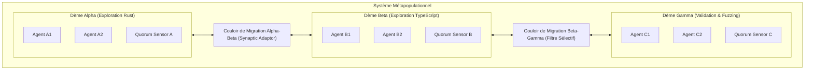
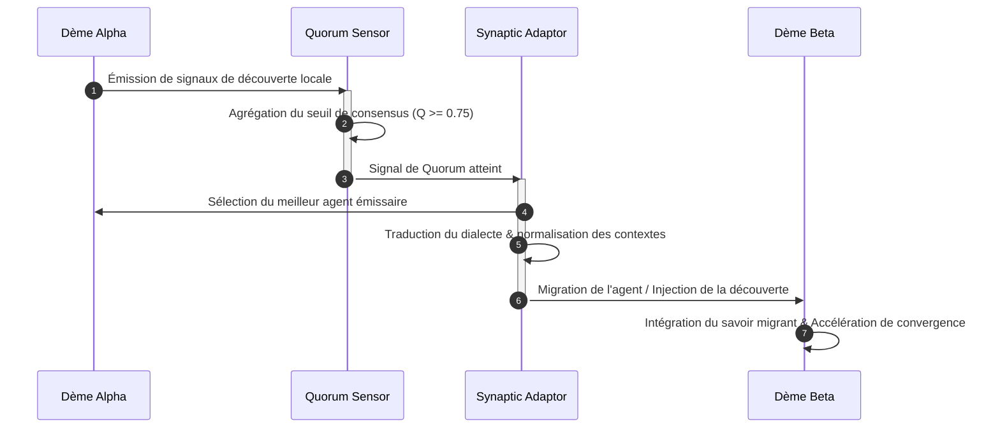
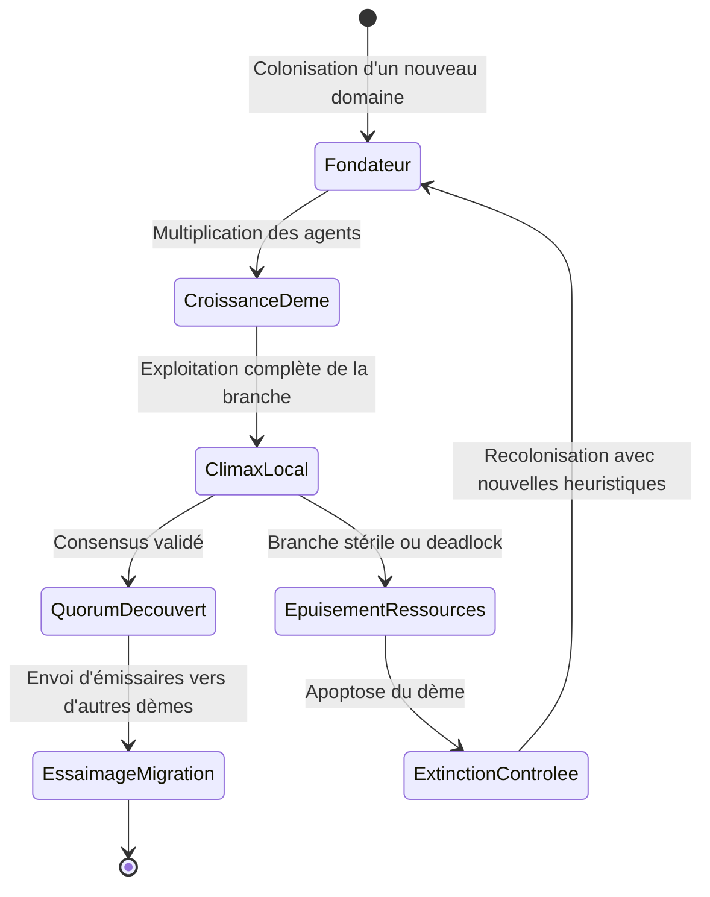

# Metapopulation : Orchestration par Populations Semi-Indépendantes

## 1. Définition

Metapopulation dans GenOS est un mode d'orchestration qui répartit une mission entre plusieurs **populations d'agents semi-indépendantes**, reliées par des points d'échange explicites. Chaque population peut travailler localement, tandis que le collectif échange des signaux lorsque le niveau de preuve ou de risque justifie une coordination.

Le concept biologique décrit un ensemble de populations séparées dans l'espace, capables d'échanger des individus, des signaux ou des ressources, puis de recoloniser une population locale après une extinction. GenOS reprend trois propriétés :

- **quorum sensing** : coordonner seulement lorsque suffisamment de signal collectif est disponible ;
- **plasticité synaptique** : renforcer les connexions utiles et affaiblir celles qui produisent régulièrement de mauvais résultats ;
- **régénération** : reconstruire une capacité perdue depuis l'état survivant, la mémoire et la lignée.

Les quatre rôles de Metapopulation sont :

1. **Population Isolator** : partitionne la mission en populations semi-indépendantes avec des frontières explicites ;
2. **Quorum Sensor** : active la coordination lorsque les preuves ou les risques dépassent un seuil collectif ;
3. **Synaptic Adaptor** : ajuste les connexions en renforçant les routes utiles et en affaiblissant les routes défaillantes ;
4. **Regeneration Steward** : reconstruit les rôles et la capacité de travail après une perte locale.

La définition est portée par [backend/src/services/biologicalModeService.js](../backend/src/services/biologicalModeService.js). Le dépôt ne fournit pas actuellement de `metapopulationService.js` dédié : la composition, l'exécution, les budgets et la reprise passent par les services génériques d'orchestration.

---

## 2. Plusieurs populations, une mission commune

Metapopulation se distingue d'un simple fan-out de workers indépendants :

1. chaque population possède une frontière et un objectif local ;
2. les populations ne synchronisent pas toutes leurs micro-étapes ;
3. les signaux importants traversent des points d'échange contrôlés ;
4. le quorum déclenche une coordination proportionnée au besoin ;
5. une population défaillante peut être isolée, puis régénérée sans perdre l'ensemble de la mission.

Le modèle cherche un compromis entre isolation et coopération. Une isolation trop forte empêche le collectif de détecter un risque transversal ; une coordination permanente détruit l'indépendance et augmente le coût. Le Quorum Sensor fournit donc un mécanisme de déclenchement, tandis que le Synaptic Adaptor améliore progressivement le réseau d'échanges.

Les invariants principaux sont :

- aucune population ne peut modifier le périmètre d'une autre sans contrat ;
- chaque signal inter-population possède une source et un niveau de confiance ;
- un quorum doit être mesurable, explicable et borné dans le temps ;
- la régénération doit partir d'un état survivant vérifié ;
- une route affaiblie ne doit pas être supprimée avant qu'une alternative soit évaluée.

---

## 3. Définition mathématique

Soit :

- $M$ : mission globale ;
- $P = \{p_1, \ldots, p_n\}$ : populations semi-indépendantes ;
- $B_i$ : frontière de la population $p_i$ ;
- $X_i$ : état local de $p_i$ ;
- $S_i$ : signal émis par $p_i$ ;
- $Q$ : seuil de quorum ;
- $G_t = (P, E_t)$ : graphe des échanges à l'instant $t$ ;
- $L_i$ : état de lignée et mémoire survivant de $p_i$.

L'isolation exige que chaque sortie soit dans sa frontière :

$$
\text{valid}(p_i) = 1 \iff \text{writes}(p_i) \subseteq B_i
$$

Le signal collectif peut être calculé par une somme pondérée :

$$
\text{signal}(t) = \sum_{i=1}^{n} w_i \cdot \text{evidence}(S_i) - \sum_{i=1}^{n} v_i \cdot \text{risk}(S_i)
$$

La coordination est activée lorsque le signal franchit le quorum :

$$
\text{coordinate}(t) = 1 \iff \text{signal}(t) \geq Q
$$

Pour une connexion $e_{ij}$ entre deux populations, la plasticité peut être représentée par :

$$
\Delta w_{ij} = \alpha \cdot \text{usefulOutcome}_{ij} - \beta \cdot \text{failedRoute}_{ij}
$$

avec un poids borné :

$$
0 \leq w_{ij} \leq 1
$$

La régénération d'une population $p_i$ est admissible si une capacité minimale peut être reconstruite :

$$
\text{regenerate}(p_i) = 1 \iff \text{integrity}(L_i) \geq L_{min} \land R_i \geq R_{min}
$$

La fusion globale exige que les populations critiques soient soit vivantes, soit régénérées, et que les signaux essentiels aient été réévalués après la reprise.

---

## 4. Les quatre rôles et hypothèses

La composition actuelle produit exactement quatre membres. Les membres 1 et 3 utilisent le tier `frontier`; les membres 2 et 4 utilisent le tier `standard`. Le tableau de composition transmet aussi les mécanismes `quorum_sensing`, `synaptic_plasticity` et `regeneration` à chaque membre.

### 4.1 Population Isolator

```text
Role: population_isolator
ModelTier: frontier
Member Number: 1
Responsibility: Boundaries and local independence
```

**Hypothèse :**
> « Partition the mission into semi-independent populations with explicit boundaries and exchange points. »

L'Isolator :

- définit les populations nécessaires ;
- attribue un périmètre local à chacune ;
- sépare les états et responsabilités ;
- identifie les points d'échange autorisés ;
- empêche les écritures implicites hors frontière.

Son objectif n'est pas d'isoler pour isoler, mais de rendre les défaillances locales contenables et les interfaces observables.

### 4.2 Quorum Sensor

```text
Role: quorum_sensor
ModelTier: standard
Member Number: 2
Responsibility: Collective signal and coordination threshold
```

**Hypothèse :**
> « Activate coordination only when collective evidence or risk crosses a quorum threshold. »

Le Sensor :

- collecte les signaux des populations ;
- mesure la force et la diversité des preuves ;
- détecte un risque transversal ;
- déclenche une coordination lorsque le quorum est atteint ;
- évite de confondre silence local et consensus global.

### 4.3 Synaptic Adaptor

```text
Role: synaptic_adaptor
ModelTier: frontier
Member Number: 3
Responsibility: Adaptive connectivity
```

**Hypothèse :**
> « Strengthen useful agent connections and weaken routes that repeatedly produce poor evidence. »

L'Adaptor :

- mesure la qualité des routes entre populations ;
- renforce les connexions qui produisent des résultats utiles ;
- affaiblit les routes lentes, bruyantes ou non fiables ;
- préserve une alternative avant de supprimer une route ;
- publie les changements de topologie et leur justification.

### 4.4 Regeneration Steward

```text
Role: regeneration_steward
ModelTier: standard
Member Number: 4
Responsibility: Recovery of lost capacity
```

**Hypothèse :**
> « Reconstruct lost roles and working capacity from surviving state, memory, and lineage. »

Le Steward :

- détecte une perte de rôle ou de population ;
- vérifie l'état, la mémoire et la lignée survivants ;
- reconstruit une capacité minimale ;
- réintroduit la population par étapes ;
- demande une nouvelle validation avant réintégration complète.

---

## 5. Architecture du système

```text
Client / Mission
        |
        v
[biologicalModeService.compose('metapopulation', mission)]
        |
        +--> Population Isolator : frontières et échanges
        +--> Quorum Sensor      : signaux et seuils
        +--> Synaptic Adaptor   : topologie adaptative
        +--> Regeneration Steward : reprise et reconstruction
        |
        v
[Plan d'autonomie générique]
        |
        +--> crée les populations initiales
        +--> attribue budgets et états locaux
        +--> enregistre les points d'échange
        |
        v
[Exécution semi-indépendante]
        |
        +--> travail local isolé
        +--> publication de signaux
        +--> mesure de routes
        +--> détection de pertes
        |
        +--> QUORUM ATTEINT ?
        |       oui -> coordination ciblée
        |       non -> poursuite locale bornée
        |
        v
[Validation et récupération]
        |
        +--> routes adaptées
        +--> capacités perdues régénérées
        +--> preuves réévaluées
        +--> fusion ou escalade
```

L'architecture ne promet pas une synchronisation permanente. Elle promet plutôt des échanges contrôlés, des seuils explicites et une capacité de reprise après perte locale.

---

## 6. Activation

Metapopulation est approprié lorsque :

1. la mission peut être partitionnée en sous-populations relativement autonomes ;
2. la coordination est coûteuse et ne doit être déclenchée que par un signal suffisant ;
3. certaines routes entre capacités peuvent évoluer au fil des résultats ;
4. la perte d'une branche est possible et doit être récupérable ;
5. l'historique, la mémoire et la lignée peuvent servir à reconstruire une capacité.

Exemple de composition :

```javascript
const members = biologicalModeService.compose(
  'metapopulation',
  'Operate a resilient investigation across independent service populations.'
);

// members.length === 4
// members[0].role === 'population_isolator'
// members[1].role === 'quorum_sensor'
// members[2].role === 'synaptic_adaptor'
// members[3].role === 'regeneration_steward'
// members[0].mechanisms includes 'quorum_sensing'
```

La composition générique lève `BIOLOGICAL_MISSION_REQUIRED` lorsque la mission est vide et `BIOLOGICAL_MODE_UNKNOWN` lorsque le mode n'existe pas. L'activation réelle des seuils, de la topologie et de la régénération reste à réaliser dans les services d'exécution.

Metapopulation est moins approprié lorsque :

- tous les agents doivent partager le même état en continu ;
- les alternatives doivent rester complètement indépendantes jusqu'au scoring ;
- une autorité hôte unique doit arbitrer chaque résultat ;
- la tâche est trop petite pour justifier des populations et des mécanismes de reprise.

---

## 7. Composition et contrat des populations

L'appel générique est :

```javascript
biologicalModeService.compose('metapopulation', mission)
```

Chaque membre contient :

```javascript
{
  role: 'quorum_sensor',
  mechanisms: ['quorum_sensing', 'synaptic_plasticity', 'regeneration'],
  modelTier: 'standard',
  memberNumber: 2,
  mission: 'Metapopulation shared mission: ...'
}
```

Une population opérationnelle devrait également déclarer :

```javascript
{
  populationId: 'population-incident-analysis',
  boundary: ['logs', 'deployments', 'dependencies'],
  exchangePoints: ['risk-signal', 'evidence-bundle'],
  localStateVersion: 4,
  quorumWeight: 0.8,
  recoverySource: 'lineage-snapshot-17',
  status: 'active'
}
```

Cette structure est un modèle de protocole. Le contrat actuellement garanti par `biologicalModeService.compose` porte sur les rôles, les mécanismes, les tiers, les numéros de membres et les missions contextualisées.

---

## 8. Isolation et frontières

L'Isolator doit transformer la mission en populations qui peuvent progresser sans écrire directement dans les états voisins.

Une frontière utile précise :

- les entrées autorisées ;
- les sorties publiables ;
- les ressources contrôlées ;
- les invariants locaux ;
- les points d'échange ;
- les conditions de suspension ou de perte.

Le degré d'isolation peut être adapté :

- **isolation forte** pour les données sensibles ou les calculs concurrents ;
- **isolation contractuelle** lorsque les populations partagent des artefacts immuables ;
- **isolation souple** lorsque les dépendances sont nombreuses mais lisibles.

L'isolation est valide si :

$$
\text{writes}(p_i) \subseteq B_i
$$

et si toute sortie hors frontière passe par un point d'échange enregistré. Une population qui modifie implicitement l'état voisin contourne le mécanisme de quorum et doit être arrêtée ou réévaluée.

---

## 9. Quorum sensing et coordination

Le Quorum Sensor évite deux erreurs symétriques : coordonner trop tôt et coordonner trop tard.

### Signaux pouvant contribuer au quorum

- preuve indépendante convergente ;
- risque signalé par plusieurs populations ;
- dépendance bloquante ;
- perte d'une population critique ;
- divergence entre routes ;
- changement d'invariant global ;
- saturation d'une ressource commune.

### Déclenchement

Une coordination peut être déclenchée si :

$$
\sum_i w_i \cdot \text{signal}_i \geq Q
$$

Le seuil doit être associé à une action : réunion de coordination, réallocation, reconfiguration de route, gel d'une population ou régénération.

### Quorum négatif

L'absence de signal n'est pas nécessairement une preuve de santé. Le Sensor doit distinguer :

- absence de problème observé ;
- absence de publication ;
- population silencieuse ou défaillante ;
- population isolée du réseau.

Un quorum fiable exige donc des liveness signals, pas seulement des résultats positifs.

---

## 10. Plasticité synaptique et routage

Le Synaptic Adaptor ajuste le graphe d'échanges à partir de résultats observés. Il ne doit pas modifier une route uniquement sur une impression locale.

Pour chaque route, suivre :

```text
Route record
- source population
- target population
- contract version
- successful exchanges
- failed exchanges
- evidence quality
- latency and cost
- last adaptation decision
```

Une route est renforcée si elle est utilisée avec succès, produit des preuves compatibles et réduit le temps de coordination. Elle est affaiblie lorsque les échecs sont répétés, la provenance est incomplète ou les contrats divergent.

La règle opérationnelle est :

1. observer plusieurs échanges ;
2. classifier la cause des échecs ;
3. tester une adaptation limitée ;
4. comparer les résultats ;
5. renforcer, maintenir ou affaiblir la route ;
6. garder une alternative pour les dépendances critiques.

La plasticité ne doit pas transformer une dégradation temporaire en suppression définitive d'une capacité utile.

---

## 11. Barrière d'évidence et fusion

Chaque population publie un dossier d'évidence local :

```text
Population evidence
- Local scope
- State version
- Claims and supporting checks
- Signals emitted
- Dependencies
- Routes used
- Unresolved risks
- Recovery relevance
```

La barrière de fusion vérifie :

1. **frontières** : aucune sortie ne dépasse son périmètre sans contrat ;
2. **signaux** : les décisions de quorum reposent sur des signaux traçables ;
3. **routes** : les échanges critiques sont compatibles et suffisamment fiables ;
4. **survie** : les populations critiques sont actives ou régénérées ;
5. **cohérence** : les états locaux peuvent être intégrés dans la mission globale.

La fusion est refusée si la majorité des populations est saine mais qu'une population critique est silencieuse, non récupérable ou séparée d'une route indispensable.

---

## 12. Régénération et reprise

La régénération ne consiste pas à relancer un worker vide. Elle reconstruit une capacité depuis :

- le dernier état vérifié ;
- les artefacts persistants ;
- la mémoire de mission ;
- les événements de lignée ;
- les contrats des points d'échange ;
- les résultats des populations voisines.

Le cycle recommandé est :

1. détecter la perte ou la dégradation ;
2. isoler l'ancienne population pour empêcher la corruption ;
3. vérifier la mémoire et la lignée disponibles ;
4. restaurer une capacité minimale ;
5. exécuter un test local ;
6. reconnecter progressivement les échanges ;
7. demander une nouvelle validation de quorum.

Une population régénérée ne doit pas être considérée comme équivalente à l'originale avant la vérification de son état et de ses contrats.

Exemple de continuation :

```text
Regeneration request
- Lost population: dependency-analysis
- Last verified state: version 12
- Surviving lineage: snapshot-17
- Required capability: dependency graph extraction
- Reconnect only after: local evidence and bridge validation
```

---

## 13. Télémétrie

Les métriques utiles à Metapopulation comprennent :

- `populationCount` : populations actives, isolées et régénérées ;
- `boundaryViolations` : écritures ou sorties hors périmètre ;
- `quorumSignals` : signaux émis par population ;
- `quorumActivations` : coordinations déclenchées ;
- `falseQuorumRate` : coordinations sans gain démontré ;
- `missedQuorumRate` : risques détectés trop tard ;
- `routeQuality` : qualité des connexions inter-populations ;
- `routeAdaptations` : renforcements et affaiblissements ;
- `populationLosses` : pertes ou suspensions locales ;
- `regenerationRounds` : reconstructions lancées ;
- `regenerationSuccessRate` : capacités restaurées avec succès ;
- `lineageIntegrity` : qualité de l'état survivant ;
- `recoveryTime` : temps jusqu'à reconnexion ;
- `globalCoverage` : couverture de la mission après adaptation.

L'objectif est de mesurer la résilience réelle, pas seulement le nombre de reprises. Une metapopulation qui régénère souvent mais perd toujours les mêmes preuves révèle un défaut structurel de partition ou de route.

---

## 14. Cas d'usage

### Cas 1 : Enquête distribuée résiliente

**Mission :** analyser un incident qui touche plusieurs services.

L'Isolator sépare les populations logs, déploiement et dépendances. Le Sensor déclenche une coordination si plusieurs populations signalent la même anomalie. L'Adaptor renforce les routes qui relient les preuves causales. Si la population déploiement tombe, le Steward la reconstruit depuis sa dernière lignée vérifiée.

### Cas 2 : Migration progressive

**Mission :** déplacer une plateforme tout en conservant l'ancien et le nouveau chemin.

Les populations par composant travaillent séparément. Les échanges de compatibilité déclenchent un quorum lorsqu'un contrat change. Les routes vers l'ancien système sont affaiblies progressivement, et la régénération permet de restaurer une capacité de migration interrompue.

### Cas 3 : Analyse multi-sources

**Mission :** produire une conclusion depuis plusieurs familles de données.

Chaque population conserve son périmètre et sa provenance. Le Sensor détecte une convergence ou une contradiction collective. L'Adaptor donne davantage de poids aux routes dont les preuves sont reproductibles. Une source indisponible peut être isolée sans invalider automatiquement les autres populations.

### Cas 4 : Réseau de workers spécialisé

**Mission :** traiter une grande tâche avec des populations spécialisées en code, tests, sécurité et opérations.

Le réseau reste localement indépendant, mais la coordination est déclenchée lorsque les signaux de risque convergent. Une capacité de test perdue peut être régénérée depuis ses artefacts et sa mémoire au lieu de relancer toute la mission.

---

## 15. Erreurs et escalade

### Frontière violée

```text
METAPOPULATION_BOUNDARY_VIOLATION
Une population a modifié un état hors de son périmètre autorisé.
Action : isoler la population, invalider la sortie et réévaluer les dépendances.
```

### Quorum manqué

```text
METAPOPULATION_QUORUM_MISSED
Un risque transversal a été détecté après que plusieurs populations ont déjà divergé.
Action : geler les routes concernées et déclencher une coordination urgente.
```

### Faux quorum

```text
METAPOPULATION_FALSE_QUORUM
Le seuil de coordination a été atteint par des signaux redondants ou insuffisamment indépendants.
Action : recalculer les poids et demander des preuves indépendantes.
```

### Route défaillante

```text
METAPOPULATION_SYNAPTIC_ROUTE_DEGRADED
Une connexion produit de façon répétée des preuves incomplètes ou incompatibles.
Action : affaiblir la route, tester une alternative et conserver la provenance.
```

### Régénération impossible

```text
METAPOPULATION_REGENERATION_FAILED
L'état, la mémoire ou la lignée survivants ne suffisent pas à reconstruire la capacité.
Action : maintenir l'isolement, réduire le périmètre ou escalader.
```

### Fragmentation critique

```text
METAPOPULATION_FRAGMENTATION_CRITICAL
Les populations ne peuvent plus échanger les signaux indispensables à la mission.
Action : restaurer un pont, revenir à une orchestration plus centralisée ou escalader.
```

---

## 16. Configuration et garde-fous

Les contrôles recommandés sont :

```text
METAPOPULATION_MAX_POPULATIONS
METAPOPULATION_QUORUM_THRESHOLD
METAPOPULATION_MIN_SIGNAL_CONFIDENCE
METAPOPULATION_MAX_ROUTE_ADAPTATIONS
METAPOPULATION_RECOVERY_RESERVE_RATIO
METAPOPULATION_REGENERATION_TIMEOUT
METAPOPULATION_MAX_LINEAGE_DEPTH
METAPOPULATION_BOUNDARY_ENFORCEMENT
METAPOPULATION_CONVERGENCE_TIMEOUT
GENOS_MAX_AUTONOMOUS_WORKERS
GENOS_WORKER_ALLOCATION_RATIO
```

Ces noms décrivent les paramètres nécessaires au protocole ; ils ne sont pas tous exposés comme variables d'environnement dans le dépôt actuel. Les valeurs réellement disponibles doivent être vérifiées dans les services génériques de planification, de flotte et d'état.

Garde-fous minimaux :

- bornes explicites pour chaque population ;
- seuil de quorum avec timeout ;
- diversité minimale des signaux ;
- limite de plasticité par période ;
- réserve pour la régénération ;
- vérification de lignée avant restauration ;
- arrêt si la fragmentation ou les violations de frontière persistent.

---

## 17. Limites et choix de conception

### Metapopulation n'est pas un état partagé continu

Si tous les agents doivent voir et modifier le même état à chaque étape, [SYNCYTIUM.md](SYNCYTIUM.md) est plus adapté. Metapopulation assume des états locaux et des échanges déclenchés par signal.

### Metapopulation n'est pas une simple communauté de débat

Si le mécanisme principal est la falsification de propositions indépendantes et la mesure du consensus, [BIOCENOSE.md](BIOCENOSE.md) est plus direct.

### Metapopulation n'est pas une croissance sans contrôle

Le quorum, les frontières et le budget de régénération sont indispensables. Sans eux, les populations se multiplient, les routes deviennent illisibles et les reprises masquent les défauts.

### Risque de quorum mal calibré

Un seuil trop bas provoque des coordinations fréquentes et coûteuses. Un seuil trop haut laisse les populations diverger avant l'intervention. Le seuil doit être calibré selon le coût de la coordination et le coût de l'erreur.

### Risque de régénération avec état corrompu

La mémoire survivante n'est pas automatiquement fiable. Elle doit conserver provenance, version et intégrité avant d'être utilisée pour reconstruire un rôle.

### Limite du contrat actuel

Le dépôt définit les trois mécanismes et les quatre rôles dans `biologicalModeService.js`, mais ne fournit pas encore un service spécialisé pour gérer automatiquement le quorum, la plasticité du graphe ou la régénération. Cette documentation sépare donc le contrat de composition existant du protocole opérationnel attendu.

---

## 18. Chaos Engineering et Test de Survie (`genos inject-chaos`)

GenOS intègre un module de **Chaos Engineering** au cœur du runtime Métapopulation pour tester formellement les capacités de régénération sans corrompre les missions en cours.

### Protocole d'injection de panne

La commande `genos inject-chaos` sélectionne un PID de worker actif (aléatoirement ou par `--target`) et force sa terminaison (`SIGTERM` / `SIGKILL` / `taskkill`) :

```bash
# Injection de chaos sur un worker aléatoire
genos inject-chaos

# Simulation sans interruption de processus (dry-run)
genos inject-chaos --dry-run

# Ciblage d'un agent ou d'une mission spécifique
genos inject-chaos --target worker_12345 --fleet-id fleet_alpha
```

### Rôle du Regeneration Steward

Lorsqu'un worker est brutalement arrêté :

1. Le superviseur (`agentProcessSupervisor.js`) et le service de reprise (`agentRecoveryService.js`) interceptent la perte du processus.
2. Le **Regeneration Steward** lit la lignée génétique et causale $L_i$ (enregistrée dans `agents`, `lineage_nodes` et `lineage_edges`).
3. L'arbre de causalité et le contexte sont vérifiés pour garantir qu'aucune corruption d'état n'a eu lieu.
4. Un nouvel agent de remplacement est instancié dans une capsule VFS isolée, avec sa lignée mise à jour (`lineage_relation = 'recovery'`).
5. La mission parent et la barrière d'évidence de l'orchestrateur se poursuivent sans interruption.

---

## 19. Comparaison avec les autres modes biologiques

| Aspect | Trinity | A-Team | Biocénose | Holobionte | Syncytium | Biome | Rhizome | Metapopulation |
|--------|---------|--------|-----------|------------|-----------|-------|---------|----------------|
| **Unité de décomposition** | Hypothèses | Domaines | Communauté | Hôte et symbiotes | État partagé | Populations | Capacités et branches | Populations semi-indépendantes |
| **Coordination** | Comparaison | Spécialisation | Consensus adversarial | Hiérarchie intégrée | Synchronisation continue | Interactions écologiques | Routage distribué | Quorum déclenché |
| **État** | Branches séparées | Local par domaine | Propositions isolées | Contrat hôte | Unique et partagé | Environnement + états locaux | Graphe + routes | États locaux + signaux |
| **Adaptation** | Choix d'hypothèse | Répartition par domaine | Révision adversariale | Arbitrage hôte | Mise à jour continue | Réallocation écologique | Croissance et contraction | Plasticité synaptique |
| **Récupération** | Reprise de branche | Continuation ciblée | Nouvelle proposition | Symbiote contrôlé | Resynchronisation | Reprise de population | Reconstruction de branche | Régénération depuis la lignée |
| **Risque principal** | Mauvaise hypothèse | Lacune de domaine | Collusion ou faux consensus | Symbiote non sûr | Conflit d'état | Effet émergent | Fragmentation | Faux quorum ou perte locale |
| **Meilleur usage** | Comparer des alternatives | Mission multidisciplinaire | Robustesse par adversité | Production gouvernée | Collaboration temps réel | Systèmes interdépendants | Exploration modulaire | Résilience distribuée |

Le choix peut se résumer ainsi :

- choisir **Metapopulation** lorsque des populations autonomes doivent échanger des signaux, adapter leurs routes et survivre à des pertes locales ;
- choisir **Rhizome** lorsque la mission doit faire croître de nouvelles capacités et de nouveaux ponts ;
- choisir **Biome** lorsque l'environnement et les interactions entre populations dominent ;
- choisir **Syncytium** lorsque la cohérence instantanée d'un état unique domine ;
- choisir **Biocénose** lorsque l'indépendance et la falsification sont prioritaires ;
- choisir **Holobionte** lorsqu'une autorité hôte doit intégrer des capacités spécialisées ;
- choisir **A-Team** lorsque la décomposition par domaines suffit ;
- choisir **Trinity** lorsque plusieurs hypothèses doivent être comparées.

---

## Références internes

- [ORCHESTRATION.md](ORCHESTRATION.md) : orchestration générale, budgets, gates et preuves
- [A_TEAM.md](A_TEAM.md) : orchestration multidisciplinaire par domaines
- [TRINITY.md](TRINITY.md) : orchestration comparative par hypothèses
- [BIOCENOSE.md](BIOCENOSE.md) : orchestration communautaire et validation adversariale
- [HOLOBIONTE.md](HOLOBIONTE.md) : orchestration hôte-symbiotes
- [SYNCYTIUM.md](SYNCYTIUM.md) : orchestration par état partagé synchronisé
- [BIOME.md](BIOME.md) : orchestration par environnement et populations
- [RHIZOME.md](RHIZOME.md) : orchestration décentralisée par capacités et ponts
- [BIOLOGIE_COMPUTATIONNELLE.md](BIOLOGIE_COMPUTATIONNELLE.md) : cadre biologique général
- [biologicalModeService.js](../backend/src/services/biologicalModeService.js) : définition et composition des rôles Metapopulation
- [agentAutonomyPlanService.js](../backend/src/services/agentAutonomyPlanService.js) : plan d'autonomie
- [agentFleetService.js](../backend/src/services/agentFleetService.js) : fleet de workers et barrière d'évidence
- [agentOrchestrationState.js](../backend/src/services/agentOrchestrationState.js) : état et télémétrie de mission
- [agentRuntimeAdapter.js](../backend/src/services/agentRuntimeAdapter.js) : adaptation du runtime


---

## Schémas d'Architecture et de Dynamique Métapopulationnelle

### 1. Topologie des Dèmes et Couloirs de Migration



### 2. Séquence de Détection de Quorum et Migration Inter-Dèmes



### 3. Machine à états du Cycle Vie / Extinction / Recolonisation


