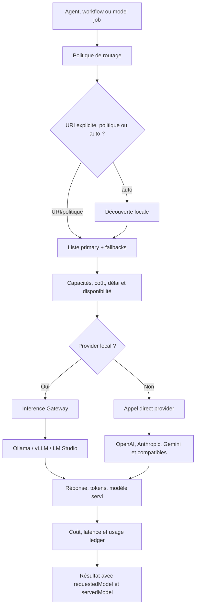
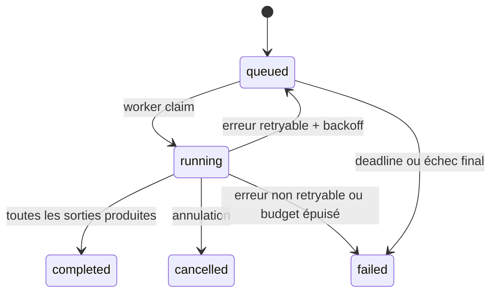

# Modèles et providers dans GenOS

## 1. Définition

Dans GenOS, un *provider* est l'adaptateur qui transforme une demande d'inférence en appel HTTP vers un service de modèle. Un *modèle* est référencé par une URI stable :

```text
provider://model-name
```

Exemples :

```text
ollama://qwen3:8b
vllm://meta-llama/Llama-3.1-8B-Instruct
openai://gpt-4o-mini
openai-compatible://my-deployed-model
```

La couche ne se limite pas à faire un `fetch`. Elle sépare explicitement :

1. la politique de route et les fallbacks ;
2. la découverte des modèles locaux ;
3. la validation de capacités, de budget et de délai ;
4. l'exécution compatible avec les APIs provider ;
5. le contrôle de concurrence pour l'inférence locale ;
6. les jobs asynchrones et leur reprise ;
7. la télémétrie, les coûts et l'identité réelle servie.

Les composants de référence sont :

- [backend/src/services/modelRouter.js](../backend/src/services/modelRouter.js) : sélection, fallback, budget, délais et identité de route ;
- [backend/src/services/modelProvider.js](../backend/src/services/modelProvider.js) : normalisation de modèle, endpoints, auth, streaming et réponses structurées ;
- [backend/src/services/inferenceGatewayService.js](../backend/src/services/inferenceGatewayService.js) : file d'attente et équité des providers locaux ;
- [backend/src/services/localModelDiscovery.js](../backend/src/services/localModelDiscovery.js) : découverte et vérification des modèles locaux ;
- [backend/src/services/modelCapabilities.js](../backend/src/services/modelCapabilities.js) : contrat des capacités déclarées ;
- [backend/src/services/providerEndpointPolicy.js](../backend/src/services/providerEndpointPolicy.js) : politique de sécurité des endpoints ;
- [backend/src/services/jobWorker.js](../backend/src/services/jobWorker.js) : exécution, streaming et reprise des `model_jobs` ;
- [backend/src/controllers/platformController.js](../backend/src/controllers/platformController.js) : registre des providers et politiques par agent ;
- [backend/tests/test_model_identity.js](../backend/tests/test_model_identity.js) : test de cohérence entre modèle demandé et réellement servi.

---

## 2. Architecture



La décision appartient à `modelRouter.generate()`. L'appel HTTP et le décodage des réponses appartiennent à `modelProvider.generate()`. Cette séparation est importante : une politique peut décider *quel modèle essayer*, tandis que seul le provider peut rapporter *quel modèle a effectivement servi la réponse*.

---

## 3. Providers supportés

Le runtime reconnaît les providers suivants :

- `openai`
- `anthropic`
- `gemini`
- `mistral`
- `groq`
- `deepseek`
- `together`
- `openrouter`
- `ollama`
- `lmstudio`
- `vllm`
- `openai-compatible`

### 3.1 Routing local/frontier

GenOS sépare fonctionnellement :

- **local** : `ollama`, `lmstudio`, `vllm` et un endpoint `openai-compatible` sur loopback ;
- **frontier/cloud** : les APIs distantes, telles que OpenAI, Anthropic ou Gemini ;
- **compatible** : un serveur qui expose le protocole OpenAI Chat Completions, qu'il soit local ou distant.

`GENOS_PREFER_LOCAL_MODELS=1` fait remonter les candidats locaux dans la liste de secours. Lorsqu'un modèle est `auto`, la découverte locale sélectionne un modèle chat-capable selon la complexité : le plus petit pour `low`, le plus grand pour `high`, le médian pour `medium`; `variantIndex` permet une rotation déterministe dans l'ensemble découvert.

Cette règle n'est pas un jugement qualitatif universel. Elle est une politique opérationnelle de proximité : réduire le coût réseau et protéger les providers cloud lorsque l'exécution locale est compatible avec la tâche.

### 3.2 Ollama, vLLM et OpenAI-compatible

Ollama, vLLM et LM Studio peuvent être joints par leur endpoint Chat Completions compatible OpenAI. Ollama supporte aussi son endpoint natif `/api/chat`, dont les réponses streamées sont en NDJSON plutôt qu'en SSE.

Les valeurs par défaut du runtime sont :

| Provider | Endpoint Chat Completions par défaut |
| --- | --- |
| Ollama | `http://localhost:11434/v1/chat/completions` |
| LM Studio | `http://localhost:1234/v1/chat/completions` |
| vLLM | `http://localhost:8000/v1/chat/completions` |
| OpenAI | `https://api.openai.com/v1/chat/completions` |

La configuration de catalogue [config/providers.json](../config/providers.json) fournit aussi un point de départ de découverte pour les profils Ollama, leurs tiers et leurs capacités.

---

## 4. Configuration

### 4.1 URI et résolution

La source de modèle suit cet ordre :

1. modèle explicitement passé à `modelRouter.generate` ;
2. politique enregistrée pour l'agent et le scope organisation/projet ;
3. politique globale `GENOS_DEFAULT_MODEL` et fallbacks environnementaux ;
4. candidats activés dans `provider_configs` ;
5. découverte locale si la route est `auto` ou ne contient aucun candidat.

Les URI sont validées par `configuredModel()`. L'alias historique `local://model` est normalisé en `ollama://model`.

### 4.2 Variables d'environnement

| Usage | Variables |
| --- | --- |
| Modèle principal | `GENOS_DEFAULT_MODEL` |
| Fallbacks CSV | `GENOS_MODEL_FALLBACKS` |
| Review parallèle CSV | `GENOS_MODEL_PARALLEL_REVIEW` |
| Mode | `GENOS_MODEL_ROUTING_MODE` (`fallback` ou `parallel`) |
| Préférence locale | `GENOS_PREFER_LOCAL_MODELS=1` |
| Endpoint Ollama | `GENOS_OLLAMA_ENDPOINT` |
| Endpoint vLLM | `GENOS_VLLM_ENDPOINT` |
| Endpoint LM Studio | `GENOS_LMSTUDIO_ENDPOINT` |
| Endpoint compatible | `GENOS_OPENAI_COMPATIBLE_ENDPOINT` ou `GENOS_MODEL_ENDPOINT` |
| Compatibilité historique | `LLM_PROVIDER`, `OLLAMA_MODEL`, `OLLAMA_API_URL` |

`openai-compatible://...` exige explicitement `GENOS_OPENAI_COMPATIBLE_ENDPOINT` ou `GENOS_MODEL_ENDPOINT` lorsque l'endpoint n'est pas fourni par le registre. Cela évite qu'une URI compatible sans cible réseau déterminée soit exécutée implicitement.

### 4.3 Clés API

Les clés ne sont jamais intégrées à l'URI ni à l'endpoint. Les endpoints qui embarquent `username:password@` sont refusés. Le provider résout notamment :

| Provider | Clé lue |
| --- | --- |
| Anthropic | `ANTHROPIC_API_KEY` |
| Gemini | `GEMINI_API_KEY` |
| Mistral | `MISTRAL_API_KEY` |
| Groq | `GROQ_API_KEY` ou `GENOS_MODEL_API_KEY` |
| DeepSeek | `DEEPSEEK_API_KEY` ou `GENOS_MODEL_API_KEY` |
| Together | `TOGETHER_API_KEY` ou `GENOS_MODEL_API_KEY` |
| OpenRouter | `OPENROUTER_API_KEY` ou `GENOS_MODEL_API_KEY` |
| OpenAI et défaut compatible | `GENOS_MODEL_API_KEY` ou `OPENAI_API_KEY` |

Les providers locaux n'exigent pas de clé par défaut. Un provider `openai-compatible` peut toutefois en utiliser une via le mécanisme OpenAI par défaut.

### 4.4 Endpoints et sécurité réseau

`providerEndpointPolicy` impose :

- URL absolue HTTP ou HTTPS seulement ;
- aucune information d'identification dans l'URL ;
- Ollama, vLLM et LM Studio uniquement sur loopback ;
- blocage des adresses privées et de metadata pour les endpoints distants ;
- vérification DNS asynchrone afin d'empêcher une résolution vers une adresse interne bloquée.

Le contrôle protège l'enregistreur de providers contre SSRF. Il ne remplace pas la segmentation réseau : un service déployé doit aussi utiliser les règles egress de son environnement.

---

## 5. Capacités déclarées

Le registre `provider_configs` stocke les capacités dans `capabilities_json`. Elles sont un contrat de routage, pas une inférence automatique de ce que le modèle pourrait savoir faire.

Le module `modelCapabilities` :

- normalise les alias, par exemple `tool_calling` vers `tools`, `json_formatting` vers `json` et `code` vers `coding` ;
- supprime les doublons ;
- accepte les capacités négatives telles que `not:tools` ;
- rejette un candidat si une capacité requise est absente ou explicitement négative.

Exemple de provider déclaré :

```json
{
  "provider": "vllm",
  "model": "meta-llama/Llama-3.1-8B-Instruct",
  "endpoint": "http://127.0.0.1:8000/v1/chat/completions",
  "capabilities": ["coding", "json", "tools"],
  "costInput": 0,
  "costOutput": 0,
  "latencyMs": 180,
  "enabled": true
}
```

Une demande avec `requiredCapabilities: ["json", "tools"]` ne doit pas atteindre un modèle enregistré sans ces capacités. L'erreur attendue est `MODEL_CAPABILITY_MISMATCH`.

---

## 6. Coût, latence et files locales

### 6.1 Coût estimé et coût constaté

Les coûts unitaires sont stockés en dollars par million de tokens :

- `cost_input` ;
- `cost_output`.

La formule est :

$$
C = \frac{c_{in} \cdot T_{in} + c_{out} \cdot T_{out}}{10^6}
$$

avec $T_{in}$ et $T_{out}$ les tokens d'entrée et de sortie. Avant l'appel, GenOS réserve une estimation avec le maximum de tokens demandé. Après l'appel, le coût est recalculé avec l'usage retourné ou une approximation de $\lceil bytes/4 \rceil$.

Si le budget `maxCostUsd` est dépassé avant ou après une tentative, le router renvoie `MODEL_COST_BUDGET_EXCEEDED`. Les utilisations valides sont enregistrées dans `usage_ledger` avec modèle, provider, tokens, coût et latence.

### 6.2 Latence et deadline

Le routeur donne à toutes les tentatives une deadline globale. Chaque fallback reçoit le temps restant :

$$
t_{attempt} = \min(t_{configured}, deadline - now)
$$

Une route expirée avant appel lève `MODEL_ROUTE_DEADLINE_EXCEEDED`; l'appel provider annulé par timeout échoue avec `Model timeout after ...`.

`latencyMs` est mesurée à chaque tentative et retournée dans le résultat. La valeur déclarée `latency_ms` du registre est un attribut de catalogue utilisable pour sélectionner ou inspecter un provider ; le router mesure néanmoins la latence réelle de chaque exécution.

### 6.3 Inference Gateway local

Les providers locaux passent par [backend/src/services/inferenceGatewayService.js](../backend/src/services/inferenceGatewayService.js). Le gateway apporte :

- une limite globale d'inférences simultanées (`GENOS_INFERENCE_MAX_CONCURRENT`, défaut 4) ;
- une capacité totale de queue (`GENOS_INFERENCE_QUEUE_CAPACITY`, défaut 256) ;
- une limite par tenant (`GENOS_INFERENCE_TENANT_QUEUE_CAPACITY`, défaut 64) ;
- un timeout d'attente (`GENOS_INFERENCE_QUEUE_TIMEOUT_MS`, défaut 120000 ms) ;
- deux classes : `interactive` et `bulk` ;
- une équité par organisation/projet et une limite de rafale interactive.

Ainsi, le local/frontier routing inclut une différence de contrôle d'exécution : le cloud s'appuie sur ses limites de provider, tandis que la GPU locale est protégée contre une surcharge de VRAM et une monopolisation par tenant.

---

## 7. Fallback, review parallèle et indisponibilité

### 7.1 Fallback séquentiel

Une politique comporte :

```json
{
  "primary": "ollama://qwen3:8b",
  "fallbacks": ["openai://gpt-4o-mini"],
  "mode": "fallback",
  "preferLocal": true
}
```

Le router essaie chaque URI dans l'ordre. Pour chaque tentative, il vérifie :

1. la validité de l'URI et de la configuration ;
2. les capacités requises ;
3. la présence d'un modèle local dans la découverte active ;
4. la disponibilité du délai restant ;
5. le coût estimé puis réel ;
6. la réponse provider.

En cas d'échec, `MODEL_ROUTE_FAILED` est envoyé en télémétrie et l'échec est conservé dans `route.attempts`. Quand toutes les routes échouent, l'erreur consolide chaque URI et sa cause. Cette structure empêche une indisponibilité locale de masquer le fait qu'un fallback cloud a aussi échoué.

Les modèles locaux sont redécouverts une fois de force après un premier échec local. Les erreurs de modèle absent, endpoint indisponible, timeout, rate limit ou réseau sont donc traitées par la chaîne de fallback et non par une substitution silencieuse.

### 7.2 Review parallèle

Le mode `parallel` lance plusieurs candidats et conserve une réponse :

- le candidat avec `score`, `qualityScore` ou `confidence` le plus élevé ;
- sinon, le premier candidat dans l'ordre de politique.

Ce mode exige un `maxCostUsd` explicite, car plusieurs modèles sont réellement exécutés. Son coût total est :

$$
C_{parallel} = \sum_{i=1}^{n} C_i
$$

Le résultat contient les revues réussies et les échecs dans `route.reviews` et `route.attempts`.

---

## 8. Réponses structurées et streaming

Pour les APIs compatibles OpenAI, `responseFormat: "json_object"` produit :

```json
{
  "response_format": { "type": "json_object" }
}
```

Après réponse, GenOS parse le texte sous forme JSON. Une réponse non parseable échoue avec `Provider returned invalid structured JSON.` Cette validation est volontairement stricte : demander du JSON n'est pas traité comme une garantie que le provider l'a produit.

Le runtime traite également :

- SSE pour les APIs Chat Completions streamées ;
- NDJSON pour l'endpoint natif Ollama ;
- réponses non streamées OpenAI-compatible, Anthropic et Gemini ;
- tokens progressifs via `onToken`.

Les compteurs `prompt_tokens`, `completion_tokens`, `input_tokens` et `output_tokens` sont normalisés lorsque le provider les renvoie, puis estimés lorsque ce n'est pas le cas.

---

## 9. Model jobs

Les `model_jobs` permettent d'exécuter un prompt durablement, hors de la requête HTTP initiale. La table SQLite contient notamment :

- `prompt`, `models_json`, `config_json` ;
- `status` (`queued`, `running`, `completed`, `failed`, `cancelled`) ;
- `attempts`, `max_attempts`, `timeout_ms` et `next_attempt_at` ;
- `result_json`, `error_json` et `claimed_at` ;
- `organization_id` et `project_id`.

Les tokens sont conservés en ordre dans `model_job_tokens(job_id, model, token_index, token)`.



Le worker :

1. relit l'état durable du job ;
2. restaure les outputs déjà terminés afin de ne pas les rejouer ;
3. exécute les modèles restant avec une deadline globale ;
4. persiste les tokens streamés et les checkpoints ;
5. effectue un retry exponentiel avec jitter pour les erreurs temporaires ;
6. écrit un dead letter logique (`deadLetter: true`) lorsque le budget de retry est épuisé.

Les erreurs retryables comprennent notamment timeout, 429, problème DNS, connexion refusée, reset et erreurs 5xx. Une annulation utilise `MODEL_JOB_CANCELLED`, ce qui évite de la présenter comme une erreur provider.

---

## 10. Cohérence du modèle demandé et réellement utilisé

C'est une garantie d'observabilité essentielle. Une URI demandée et le nom retourné par le provider peuvent différer : alias local, modèle servi par un proxy, version résolue par un endpoint, ou fallback exécuté.

Le routeur retourne donc au minimum :

```js
{
  model: 'ollama://requested-model',
  requestedModel: 'ollama://requested-model',
  servedModel: 'provider-reported-model',
  provider: 'ollama',
  latencyMs: 42,
  costUsd: 0,
  route: { mode: 'fallback', selectedModel: 'ollama://requested-model', attempts: [] }
}
```

La propriété `requestedModel` rend la décision de route audit-able. La propriété `servedModel` est obtenue depuis `payload.model` ou les événements de stream; si le provider ne la rapporte pas, le runtime conserve le `modelName` configuré comme meilleure identité disponible.

Le test [backend/tests/test_model_identity.js](../backend/tests/test_model_identity.js) vérifie précisément que :

- le modèle demandé reste `ollama://requested-model` ;
- le modèle rapporté par le provider reste `provider-reported-model` ;
- l'endpoint exécuté est conservé.

Cette séparation évite la fausse traçabilité consistant à enregistrer seulement le souhait du routeur. Elle ne constitue pas une preuve cryptographique de l'identité d'un provider distant : pour ce niveau de garantie, l'opérateur doit ajouter authentification du provider, journalisation distante et éventuellement attestations d'infrastructure.

---

## 11. Exemple complet

Un agent de revue souhaite d'abord utiliser une GPU locale, impose une sortie JSON et accepte un fallback frontier si le modèle local est indisponible :

```js
const result = await modelRouter.generate({
  db,
  agentId: 'reviewer-1',
  organizationId: 'org-acme',
  projectId: 'project-api',
  prompt: 'Retourne un objet JSON avec score et risques.',
  maxTokens: 600,
  maxCostUsd: 0.01,
  timeoutMs: 30_000,
  priority: 'interactive',
  requiredCapabilities: ['json', 'coding'],
  policy: {
    primary: 'vllm://meta-llama/Llama-3.1-8B-Instruct',
    fallbacks: ['openai://gpt-4o-mini'],
    mode: 'fallback',
    preferLocal: true
  }
});
```

Processus :

1. le router vérifie que le modèle vLLM est déclaré, local et compatible ;
2. le gateway place la demande interactive dans sa file GPU ;
3. vLLM répond, ou échoue avec une erreur exploitable ;
4. en échec, le router tente OpenAI dans la limite de délai et de budget restants ;
5. le résultat inclut le modèle de route, le modèle réellement servi, les tokens, le coût et la latence ;
6. la consommation est inscrite dans `usage_ledger` pour le scope `org-acme/project-api`.

Si la requête doit impérativement être structurée, l'appel direct au provider reçoit aussi `responseFormat: 'json_object'`; le résultat est rejeté si le texte n'est pas du JSON valide.

---

## 12. Analogie biologique

L'analogie utile n'est pas qu'un modèle serait un neurone. GenOS se rapproche davantage d'un système métabolique distribué :

- le **routeur** joue le rôle d'un mécanisme de sélection de voie selon l'énergie, le délai et les capacités ;
- le **gateway local** agit comme une régulation homéostatique qui empêche une ressource GPU de saturer ;
- les **fallbacks** rappellent la redondance de voies physiologiques lorsque la voie principale est indisponible ;
- les **capacités** sont des fonctions déclarées, comparables à la spécialisation d'un tissu, mais vérifiées comme contrat logiciel ;
- le **usage ledger** est un métabolisme comptable : chaque inférence consomme un budget observable ;
- les **jobs persistés** gardent un état de travail qui survit aux interruptions, comme une mémoire opérationnelle.

Cette analogie est intentionnellement limitée. Les modèles ne s'auto-organisent pas biologiquement : GenOS applique des contraintes logicielles explicites de coût, disponibilité, sécurité réseau et auditabilité.

---

## 13. Comparaison avec le marché

| Sujet | GenOS | Routeurs LLM courants / gateways | Frameworks d'agents |
| --- | --- | --- | --- |
| Multi-provider | URI provider explicite, adaptateurs intégrés | Souvent proxy unifié et catalogue très large | Souvent dépendant du SDK fournisseur |
| Local/frontier | Découverte locale, préférence locale, queue GPU | Généralement proxy local ou cloud séparé | Souvent laissé à l'application |
| Fallback | Chaîne auditée avec délai et budget restants | Fallback par erreurs et politiques de proxy | Souvent retry applicatif simple |
| Capacités | Contrat déclaré et filtrage `requiredCapabilities` | Variables selon catalogue et règles du routeur | Souvent convention dans le prompt |
| Coût | Estimation avant appel, mesure après appel, ledger scope | Observabilité et budgets souvent disponibles | Souvent absent ou externe |
| Identité servie | `requestedModel` distinct de `servedModel` | Variable selon le proxy | Rarement uniforme |
| Jobs | Checkpoints, tokens persistés, retry et dead letter | Souvent service adjacent | Souvent à construire |
| Sécurité endpoint | Validation SSRF, loopback local obligatoire | Dépend de la plateforme | Habituellement hors périmètre |

Par rapport à LiteLLM, OpenRouter ou un gateway d'entreprise, GenOS couvre moins de fournisseurs et moins de fonctions de proxy global, mais relie plus directement la route au scope organisation/projet, à la supervision d'agents et à un worker durable. Par rapport à LangChain, AutoGen ou CrewAI, le système met davantage l'accent sur la gouvernance d'exécution : budget, capacité, saturation GPU, disponibilité et identité de modèle.

---

## 14. Limites et recommandations

- Les capacités sont déclaratives : une capacité `tools` enregistrée doit être validée par des tests d'intégration du modèle concerné.
- L'estimation de tokens est une approximation lorsque le provider ne renvoie pas son usage.
- `servedModel` dépend de ce que le provider expose; un proxy peut masquer le déploiement réel.
- Une route `parallel` augmente volontairement le coût et exige donc un budget explicite.
- La découverte locale ne garantit pas qu'un modèle restera disponible entre sa détection et son appel; le fallback traite cette course.
- Les endpoints locaux sont volontairement contraints au loopback. L'accès à une GPU distante doit être exposé via un provider distant contrôlé et non en contournant cette politique.

Pour une exploitation fiable, déclarer les coûts et capacités par modèle, définir un budget par job, conserver au moins un fallback de fournisseur indépendant, surveiller les événements `MODEL_ROUTE_FAILED` et `INFERENCE_*`, et auditer conjointement `requestedModel`, `servedModel`, endpoint et version de déploiement.

---

## 15. Fichiers clés

- [backend/src/services/modelRouter.js](../backend/src/services/modelRouter.js)
- [backend/src/services/modelProvider.js](../backend/src/services/modelProvider.js)
- [backend/src/services/inferenceGatewayService.js](../backend/src/services/inferenceGatewayService.js)
- [backend/src/services/localModelDiscovery.js](../backend/src/services/localModelDiscovery.js)
- [backend/src/services/modelCapabilities.js](../backend/src/services/modelCapabilities.js)
- [backend/src/services/providerEndpointPolicy.js](../backend/src/services/providerEndpointPolicy.js)
- [backend/src/services/jobWorker.js](../backend/src/services/jobWorker.js)
- [backend/src/controllers/platformController.js](../backend/src/controllers/platformController.js)
- [backend/src/db/schema-tables-extensions.js](../backend/src/db/schema-tables-extensions.js)
- [config/providers.json](../config/providers.json)
- [backend/tests/test_model_identity.js](../backend/tests/test_model_identity.js)
