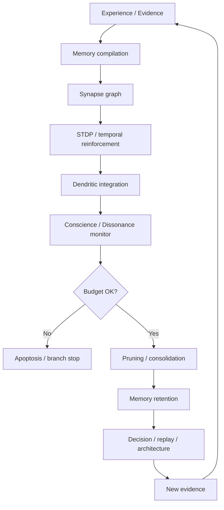

# Neurobiologie et plasticité dans GenOS

## 1. Définition

La neurobiologie dans GenOS n’est pas une simulation biologique au sens académique strict. C’est un cadre de conception et de gouvernance pour les agents intelligents, où les mémoires, les décisions, les boucles de vérification, la dissociation entre exploration et consolidation, et la révision cognitive sont représentées avec des analogies biologiques explicites : dendrites, synapses, plasticité, dépression, élagage, conscience, budgets cognitifs, mémoire hippocampique et mécanismes de protection microgliale.

Le système réel repose sur des implémentations à la fois dans le runtime Node.js et dans les crates Rust :

- `crates/genos-biology/src/neurobiology.rs`
- `crates/genos-biology/src/glial.rs`
- `crates/genos-cell/src/conscience.rs`
- `backend/src/services/agentConscienceService.js`
- `backend/src/services/primitiveHandlers/memory.js`
- `backend/src/services/sleepCycle.js`
- `backend/src/services/primitiveHandlers/temporal.js`
- `backend/src/db/schema-tables-extensions.js`

L’objectif est d’offrir un modèle de mémoire et de cognition qui soit :

- robuste face aux boucles de répétition,
- capable d’ajuster la force des liens entre mémoires,
- sensible aux signaux de preuve et de causalité,
- capable d’éliminer les chemins faibles ou toxiques,
- et exposé à un contrôle de budget afin d’éviter l’overfitting cognitif, la dérive ou la boucle auto-référentielle.

---

## 2. Ce que le repo implémente réellement

### 2.1 Arbres dendritiques

L’arbre dendritique est modélisé comme une hiérarchie de compartiments avec des distances électrotoniques, des seuils NMDA, des épines dendritiques, et une dynamique d’intégration des signaux. La structure est documentée dans `crates/genos-biology/src/neurobiology.rs`.

Les concepts clés :

- `DendriticTree`: arbre global
- `DendriticCompartment`: compartiment (tronc proximal, dendrite apicale, arborisation basale, tuft distal)
- `DendriticSpine`: épine synaptique locale
- `SpineMorphology`: filopodia / thin / stubby / mushroom

Le mécanisme central est une intégration locale non linéaire :

$$
V_{local} = A \cdot (\alpha \cdot AMPA + \beta \cdot receptor\_density)
$$

puis :

$$
V_{output} = V_{local} \cdot e^{-x / \lambda}
$$

où :

- $A$ = amplitude du signal entrant,
- $AMPA$ = conductance rapide postsynaptique,
- $receptor\_density$ = densité de récepteurs,
- $x$ = distance électrotonique,
- $\lambda$ = constante d’espace (Wilfrid Rall),
- $V_{output}$ = valeur reçue au soma ou au compartiment père.

En pratique, si le signal dépasse un seuil NMDA, le système applique une amplification supralinéaire :

$$
V_{output} = V_{output} \cdot k, \quad k > 1
$$

Cela correspond à un comportement proche d’un pic dendritique actif, sans être un modèle biophysique complet.

### 2.2 Synapses

Les synapses sont représentées de manière explicite au niveau des mémoires et des liens causaux. Dans le code Node.js, `memory_synapses` est la table principale ; dans Rust, `Synapse` est le modèle de base.

Les éléments structurants :

- `source_id` / `target_id`
- `weight`
- `transmitter_type` (`glutamate`, `gaba`, `dopamine`, `serotonin`)
- `activity_history`
- `receptor_density`
- `c3_opsonization`
- `cd47_expression`

Dans le runtime, la synapse est la structure de mémorisation et de causalité entre décisions, trajectoires, expériences et conclusions ; elle est la base de la mémoire graphique et de la recherche en “GraphRAG”.

### 2.3 Renforcement temporel

La primitive `stdpUpdate` dans `backend/src/services/primitiveHandlers/memory.js` encode un mécanisme inspiré par le STDP (Spike-Timing-Dependent Plasticity).

La logique est :

- si le pré-signal précède le post-signal, la synapse est renforcée ;
- si l’ordre est inversé, la connexion est affaiblie ou déprimée ;
- la magnitude dépend de $\Delta t$ :

$$
\Delta w = \eta \cdot e^{-\lvert \Delta t \rvert / \tau} \quad \text{avec signe selon l’ordre causal}
$$

et en pratique :

$$
\Delta t = t_{post} - t_{pre}
$$

- $\Delta t > 0$ : renforcement potentiel si le pré est avant le post ;
- $\Delta t < 0$ : dépression ou inversion de poids selon le sens.

La logique est aussi renforcée par des neurotransmetteurs :

- glutamate = activation / renforcement excitateur ;
- dopamine = modulation de récompense ;
- serotonin = stabilisation modérée ;
- gaba = inhibition.

### 2.4 Dépression synaptique

La dépression est explicitement codée dans `runSleepCycle` et dans `stdpUpdate`.

Les mécanismes :

- réduction du poids des synapses inactives ;
- baisse de la densité de récepteur ;
- augmentation de `c3_opsonization` ;
- réduction de `cd47_expression` ;
- suppression de synapses sous seuil ou marquées comme “eat me”.

Le déclenchement de dépression est :

$$
w_{t+1} = w_t \cdot \gamma
$$

avec $\gamma < 1$ lors des périodes de faible activité ou d’incertitude persistante.

Par ailleurs, la dépression est associée à la notion de “microglial pruning” : les synapses faibles ou marquées C3/CD47 sont élaguées.

### 2.5 Pruning

Le pruning est au cœur de la robustesse du système. Il est implémenté dans `backend/src/services/sleepCycle.js`.

Le service supprime :

- synapses dont $|w| < w_{min}$ ;
- synapses avec `c3_opsonization > 0.5` et `cd47_expression < 0.5` ;
- mémoires orphelines sans synapses actives ;
- trajectoires rejetées, anciennement stales, non exceptionnelles.

Formellement :

$$
prune(s) \iff \lvert w_s \rvert < w_{min} \;\lor\; (C3_s > \theta_{C3} \land CD47_s < \theta_{CD47})
$$

C’est un mécanisme d’auto-nettoyage qui réduit le bruit, le sur-apprentissage et l’encombrement cognitif.

### 2.6 Révision de conscience

Le service `agentConscienceService.js` introduit un état de conscience interne basé sur la dissonance cognitive et l’harmonie. Il passe par :

- `dissonanceLevel`
- `currentBudget`
- `baselineBudget`
- `maxDissonanceThreshold`
- `eurekaMoments`
- `isApoptotic`

Le cœur de la logique :

$$
D_{t+1} = \max(0, D_t + p - r)
$$

où :

- $p$ = pénalité due aux erreurs, répétitions, dérive sémantique, mauvaise santé cognitive ;
- $r$ = soulagement par la progression, les preuves, la clarifcation.

L’épisode de “Eureka” réduit la dissonance :

$$
D \leftarrow D / 2,
\quad
B \leftarrow \min(B_{base}, B + 50)
$$

et y ajoute un compte d’illumination. Il s’agit d’un mécanisme de révision et de correction de trajectoire, pas d’une conscience humaine.

### 2.7 Dissonance cognitive

La dissonance est une mesure du désaccord entre les signaux de contexte, de trajectoire et de preuve. Dans GenOS, ce désaccord est calculé par le service de conscience et par plusieurs mesures d’intégrité : répétition, dérive sémantique, mauvaise santé cognitive, boucles de travail, erreurs persistantes.

Le principe est :

$$
D = f(errors, repetition, drift, health)
$$

et le système déclenche l’apoptose si :

$$
D \ge D_{max} \;\lor\; B \le 0
$$

Autrement dit, une branche trop incohérente ou trop épuisée est stoppée, ce qui évite les boucles de régression de sécurité ou d’optimisation aveugle.

### 2.8 Budgets cognitifs

Les budgets cognitifs et métaboliques sont présents dans les agents et dans le runtime. Les clés sont :

- `cognitive_budget`
- `cognitive_baseline_budget`
- `cognitive_max_dissonance`
- `conscience_revision`
- `eureka_count`

Le budget n’est pas un simple compteur de tokens. Il est une représentation de la capacité d’attention, de révision et de capital décisionnel restant disponible à l’agent.

Il sert à :

- limiter les boucles de planification,
- réduire la boucle de répétition,
- évincer les branches dégradées,
- empêcher le “thinking forever” sans retour de preuve.

---

## 3. Modèle mathématique global

Le système peut être décrit comme un cycle de régulation entre mémoire, causalité, budget et élagage.

### 3.1 État de l’agent

Un agent est approximé par :

$$
S_t = (B_t, D_t, E_t, M_t, \Gamma_t)
$$

avec :

- $B_t$ : budget cognitif restant,
- $D_t$ : dissonance cognitive,
- $E_t$ : explorations / succès / moments Eureka,
- $M_t$ : mémoire synaptique,
- $\Gamma_t$ : graphe de causalité / dépendances.

### 3.2 Plasticité

La plasticité est la mise à jour des poids synaptiques :

$$
w_{t+1} = w_t + \Delta w_t
$$

et la variation est couplée à :

- signal de preuve,
- recouvrement de causalité,
- instruction ou récompense,
- fréquence d’utilisation,
- cohérence avec le tenant / workspace courant.

### 3.3 Élagage cognitif

L’élagage correspond à la relaxation de poids faibles et à la suppression des branchements non productifs :

$$
\mathcal{P}(M) = \{ s \in M \mid \lvert w_s \rvert \ge w_{min} \land \neg(C3_s > \theta_{C3} \land CD47_s < \theta_{CD47}) \}
$$

### 3.4 Contrôle de sécurité

Le système n’accepte pas un écart mémoire ou une dérive excessive. Son mécanisme d’arrêt est :

$$
abort \iff D_t \ge D_{max} \;\lor\; B_t \le 0 \;\lor\; \text{contradiction causale}
$$

---

## 4. Architecture technique et modélisation de données

### 4.1 Table mémoire synaptique

Le noyau de persistance est `memory_synapses` dans le schéma SQLite. Les champs et leurs rôles sont documentés dans `backend/src/db/schema-tables-extensions.js` et dans la logique de `memory.js`.

Les champs de performance / entité pour la plasticité incluent :

- `weight`
- `transmitter_type`
- `activity_history`
- `receptor_density`
- `c3_opsonization`
- `cd47_expression`
- `organization_id`, `project_id`
- `pre_spike_at`, `post_spike_at`, `delta_t_ms`

Cela permet de lier les décisions à la mémoire courante et d’assurer la cohérence tenant à tenant.

### 4.2 Conscience de l’agent

Le système de conscience est persistant dans `agents` et historique dans `conscience_transitions`. La logique de persistance est dans `persistConscienceStateNow` dans `agentConscienceService.js`.

### 4.3 Cycles de sommeil et consolidation

`runSleepCycle` est un service de consolidation après la phase active. Il réalise :

1. décadence asymptotique des décisions,
2. renforcement LTP / dépression LTD,
3. pruning C3/CD47,
4. suppression des décisions orphelines,
5. nettoyage des trajectoires rejetées et obsolètes,
6. absorption d’exosomes et stockage des engrams.

---

## 5. Exemples concrets du repo

### 5.1 Exemple de renforcement synaptique

Le service `stdpUpdate` prend un `sourceId` et `targetId`, un temps de pré- et post-spike, ainsi qu’un type de neurotransmetteur.

Exemple de flux :

- une décision A est produite,
- une décision B la confirme ou la corrige,
- $t_{pre} = A.created\_at$, $t_{post} = B.created\_at$,
- le delta de temps est calculé,
- le poids est mis à jour,
- la synapse est marquée comme activée,
- si le signal est très fort, le poids est augmenté et la mémoire se consolide.

### 5.2 Exemple de pruning

Les phases de sommeil ou de consolidation peuvent produire :

- une synapse faible : `ABS(weight) < 0.05`,
- une synapse “eat me” : `c3_opsonization > 0.5` et `cd47_expression < 0.5` ;
- une mémoire orpheline : aucun chemin actif n’y mène.

Le système les élimine et reconstitue un graphe plus net.

### 5.3 Exemple de tension cognitive

Un agent peut survenir dans l’état où :

- la répétition est élevée,
- la dérive sémantique augmente,
- le progrès est nul,
- les preuves restent faibles.

Le service `evaluateBranch` applique alors une pénalité :

$$
penalty = 2.5 \times errors\_in\_loop + 5.0 \times repetition + 6.0 \times drift + ...
$$

et si la dissonance dépasse le seuil, l’agent est marqué apoptotique.

---

## 6. Schéma d’architecture

### 6.1 Couplage des couches

1. couche de mémoire : représentée par `memory_synapses`, `genome_decisions`, `trajectories` ;
2. couche synaptique : `weight`, `receptor_density`, `activity_history` ;
3. couche de biophysique : compartiments dendritiques, seuil NMDA, Rall attenuation ;
4. couche de conscience : dissonance, budget, Eureka, réparation ;
5. couche de sécurité : pruning, stop branch, apoptosis.

---

## 7. Processus de fonctionnement complet

### Étape 1 — acquisition d’expérience

Une expérience est enregistrée dans l’épisode mémoire, puis transformée en points de connaissance et en mémoires de décision.

### Étape 2 — compilation des liens

Les mémoires sont reliées par leurs motifs, leur contexte et leurs structures causales dans `memory_synapses`.

### Étape 3 — renforcement temporel

`stdpUpdate` observe le timing entre pré- et post-signal pour ajuster le poids synaptique.

### Étape 4 — intégration dendritique

Les signaux sont injectés dans les compartiments dendritiques. Le passage est filtré par l’atténuation électrotonique, puis amplifié par NMDA si nécessaire.

### Étape 5 — évaluation de la conscience

Le service `evaluateBranch` compare la santé cognitive, les erreurs et la progression. La dissonance monte ou baisse.

### Étape 6 — prune et consolidation

Le service `sleepCycle` élimine les éléments faibles et conserve les mémoires pertinentes, robustes et causales.

### Étape 7 — révision ou arrêt

- Si la preuve s’accumule : Eureka, réduction de la dissonance ;
- si la boucle persiste : apoptosis / arrêt de la branche ;
- si le signal est stable : création d’un nouveau chemin de décision ou d’une partie de mémoire consolidée.

---

## 8. Cas d’usage

### 8.1 Débogage de systèmes complexes

Un agent ou une branche est pris dans une boucle de répétition. La dissonance monte ; le système comptabilise un budget faible ; le pruning nettoie les anciens chemins non utiles ; le runtime peut stopper la branche avant qu’elle n’émette des décisions instables.

### 8.2 Apprentissage planifié de trajectoire

Les trajectoires récentes et les décisions sont reliées par synapses. Le système apprend à préférer les chemins causaux qui ont donné de bons résultats, en récompensant les associations de cause à effet.

### 8.3 Consolidation de mémoire par sommeil

Les anciennes décisions inutiles sont déprimées, les chemins utiles consolidés, et les objets orphelins supprimés. C’est précisément le rôle de `sleepCycle.js`.

### 8.4 Sécurité et arrêt de branche

Les agents génèrent des états aberrants ou incohérents ; l’intégrité cognitive joue son rôle : dès qu’une dissonance critique est atteinte, l’agent est arrêté et l’état est journalisé.

### 8.5 Exploration avec contrôle de complexité

Un agent peut générer plusieurs branches ou hypothèses ; le système maintient le budget et la diversité sans laisser le réseau devenir incontrôlable.

---

## 9. Cas d’implémentation : Rust vs Node.js

La cohérence entre les implémentations est un point clé du repo. Un test dédié présente cette cohérence : `backend/tests/test_rust_node_coherence.js`.

### 9.1 Mappage direct

| Domaine | Rust | Node.js | Rôle |
|---|---|---|---|
| Dendritic tree | `DendriticTree` | `neurobiologyBiophysics` | intégration et atténuation |
| Synapse | `Synapse` | `memory_synapses` / `stdpUpdate` | mémoire et plasticité |
| Pruning | `C3` / `CD47` thresholds | `sleepCycle` / `mcpExecutor` | élagage |
| Conscience | `ConscienceState` | `agentConscienceService` | budget + dissonance |
| Temporal reinforcement | STDP-inspired traits | `stdpUpdate` + causal replay | apprentissage causal |
| Safety stop | apoptosis logic | `evaluateBranch` / guardrails | arrêt de branche |

### 9.2 Critère de cohérence

Le repo s’appuie sur plusieurs invariants :

- même notion de seuil de dissonance,
- même notion de budget cognitif,
- même notion de passage d’états d’agent,
- même logique d’élimination des synapses faibles,
- même logique de résultats pour la biophysique et la sécurité.

La cohérence est vérifiée dans les tests de `backend/tests/test_rust_node_coherence.js` et les services de conscience et de pruning.

---

## 10. Comparaison avec le marché

### 10.1 Agentic memory systems

Les systèmes d’agentic memory sur le marché se concentrent souvent sur :

- vector memory,
- retrieval augmenté,
- graph reasoning,
- ranking de chunks,
- but rarement sur la plasticité synaptique réelle ou un mécanisme de budget / conscience interne.

GenOS va plus loin : il compose mémoire, causalité, héritage, synapses, budget cognitif, et arrêt de branche dans un même système.

### 10.2 Neurosymbolic architectures

Les architectures neurosymboliques classiques mettent en avant :

- logique symbolique + réseau neuronal,
- représentations sémantiques,
- intégration de connaissance.

GenOS prend une autre direction : il encode la plasticité dans le moteur de mémoire et le contrôle de sécurité, avec des métaphores biologiques comme cadre de robustesse.

### 10.3 Cognitive architectures / agents with internal state

Des frameworks de reasoning agentique disposent souvent d’un état interne, mais pas d’: 

- mémoire synaptique persistée,
- règles de dépression / pruning,
- mécanismes d’apoptose cognitif,
- revue de conscience et d’harmonie,
- budgets de cognition et d’évaluation des boucles de répétition.

C’est précisément là que GenOS se démarque : il modélise la mémoire comme un tissu vivant avec mémoire, plasticité, protection et élimination de chemins nuisibles.

### 10.4 Limites du comparatif

Le repo ne prétend pas à une neurobiologie exacte et ne fait pas de promesse d’intelligence générale fondée sur des simulations biologiques. L’architecture est une abstraction de contrôle exécutif, de sécurité, de mémoire, et de conflit de raisonnement. C’est un design utile pour le contrôle d’agents, pas une reproduction de la biologie cérébrale.

---

## 10. Pont Thalamique et Partage Sensoriel Direct (Gémellité Craniopage)

Inspiré du pont thalamique observé chez les jumeaux siamois craniopages (partage du thalamus comme relais d'intégration sensorielle), GenOS intègre la primitive `genos_biomimicry_thalamic_bridge`.

### Mécanisme
- **Zero-Copy Sensory Relay :** Deux agents jumeaux ou branches d'inférence partagent un plan d'attention et de tenseurs (embeddings, flux perceptifs d'AST, états d'environnement) sans recourir à une re-sérialisation textuelle ou JSON lourde en tokens LLM.
- **Transmissions multimodales :** Prise en charge des canaux `embeddings`, `kv_cache`, `ast_percept` et `event_stream`.
- **Économie de bande passante cognitive :** Les percepts acquis par l'agent explorateur sont immédiatement relayés et interrogeables par l'agent vérificateur avec une réduction drastique de latence.

---

## 11. Forces et limites

### Forces

- mémoire causale persistée ;
- mécanisme de renforcement et de dépression ;
- cycle de pruning et de consolidation ;
- pont thalamique pour co-perception multi-agent zero-copy ;
- système de conscience et de budget ;
- architecture cross-runtime (Rust/Node.js) ;
- tests de cohérence et validation de sécurité.

### Limites

- l’analogie biologique est structurée comme un modèle de runtime, pas un modèle neuroscientifique ;
- les mécanismes sont simplifiés par rapport à la biologie réelle ;
- la “conscience” est un contrôle de cohérence interne, pas une conscience phénoménale ;
- le pruning et le budget exigent des hypothèses de valeur et de preuve qui doivent être validées dans le contexte applicatif.

---

## 12. Conclusion

La neurobiologie et la plasticité chez GenOS sont un mécanisme de gouvernance cognitive pour les agents. Les synapses ne sont pas seulement des liens mémoire : elles expriment la causalité, la force de mémorisation, la dépression, la récupération et l’élagage.

Les dendrites organisent l’intégration des signaux ; la conscience mesure la tension cognitive ; les budgets limitent la charge mentale ; la mise en sommeil consolide les liens utiles ; le pont thalamique assure le partage sensoriel direct ; le pruning retire les décisions faibles ou toxiques.

Dans ce sens, GenOS construit un agent qui se comporte moins comme un simple “prompt loop” et davantage comme un système de mémoire à plasticité dirigée, avec des garde-fous d’arrêt, de consolidation, de validité causale et d’intégrité de décision.

C’est une architecture particulièrement adaptée à :

- la correction de boucles,
- le raisonnement avec preuves,
- le débogage autonome,
- la co-inférence gémellaire temps réel,
- la stratégie de mémoire causale,
- la sécurité de systèmes multi-agents.

---

## 13. Fichiers clés du repo

- `crates/genos-biology/src/neurobiology.rs`
- `crates/genos-cell/src/conscience.rs`
- `backend/src/services/mcpBioTools/handlers/thalamicBridge.js`
- `backend/src/services/agentConscienceService.js`
- `backend/src/services/sleepCycle.js`
- `backend/src/services/primitiveHandlers/memory.js`
- `backend/src/services/primitiveHandlers/temporal.js`
- `backend/tests/test_rust_node_coherence.js`
- `backend/tests/test_thalamic_bridge.js`
- `backend/src/db/schema-tables-extensions.js`

Ces fichiers sont la base d’implémentation qui justifie la documentation ci-dessus.

