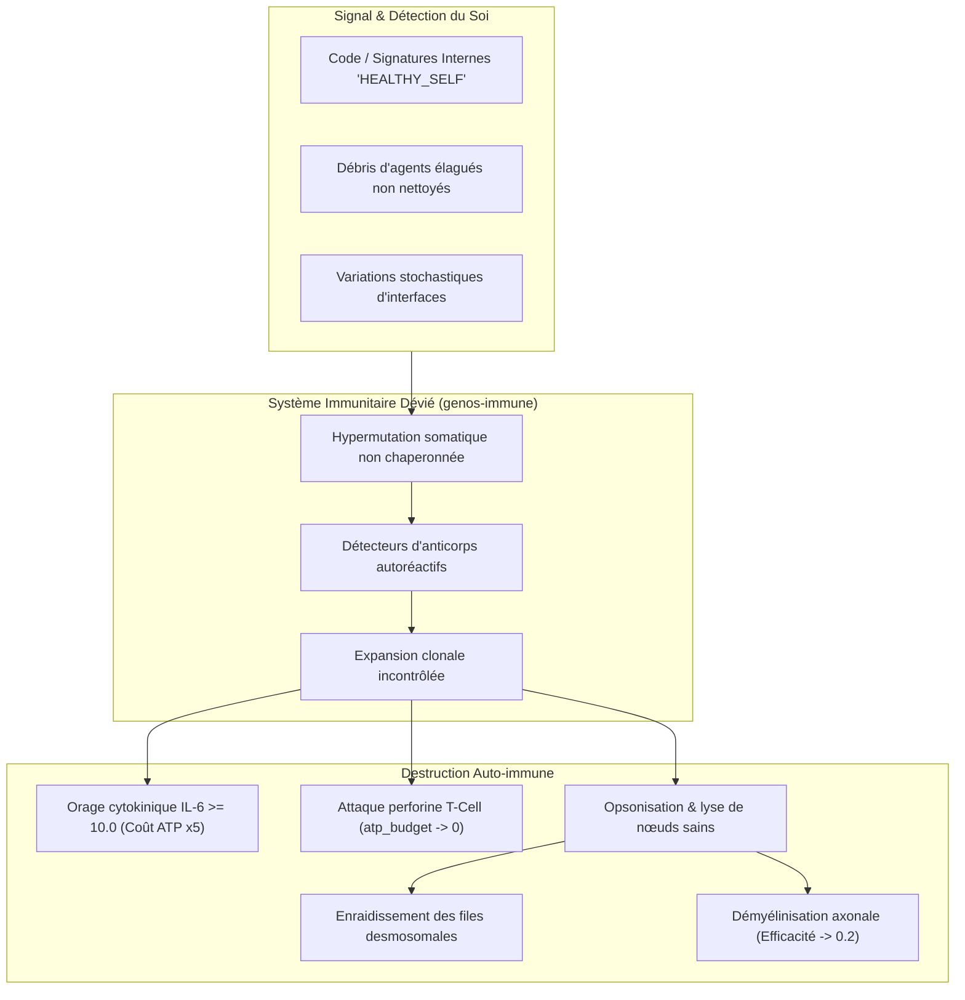
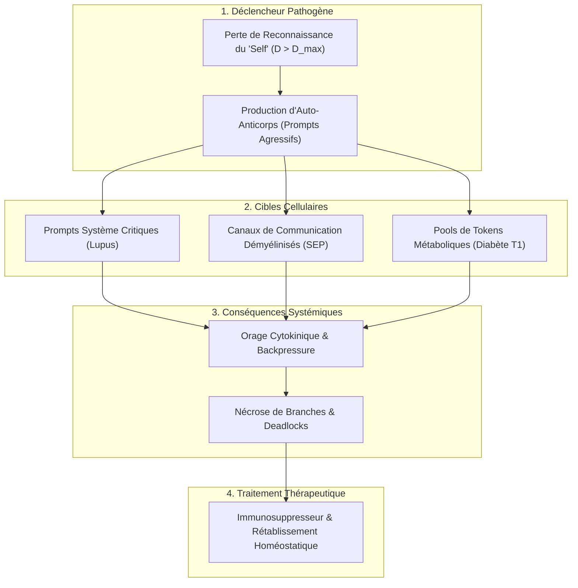
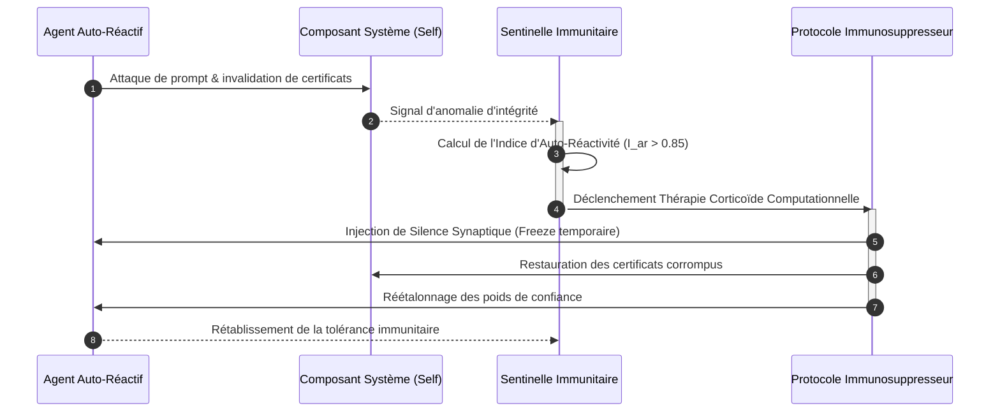

# Nosologie I : Pathologies Auto-immunes et Régulation Homéostatique dans GenOS

## 1. Introduction et Fondements de l'Immunologie Computationnelle

Dans le système d'exploitation vivant **GenOS**, la défense adaptative et la préservation de l'intégrité du swarm d'agents reposent sur un système immunitaire artificiel bio-inspiré ([`genos-immune`](file:///c:/Users/Shadow/Documents/GitHub/GenOS/crates/genos-immune/src/lib.rs)). Ce sous-système intègre des mécanismes de détection clonale ([`ClonalSelection`](file:///c:/Users/Shadow/Documents/GitHub/GenOS/crates/genos-immune/src/ais.rs)), des répertoires d'anticorps diversifiés ([`IgClass`](file:///c:/Users/Shadow/Documents/GitHub/GenOS/crates/genos-core/src/orchestrator/methods.rs#L31-L55)), une maturation d'affinité par hypermutation somatique stochastique ([`clonal_expansion_and_hypermutate`](file:///c:/Users/Shadow/Documents/GitHub/GenOS/crates/genos-immune/src/ais.rs#L116-L202)), ainsi qu'une régulation neuro-endocrine et cytokinique.

Toutefois, la puissance discriminatoire de ce bouclier biologique porte en elle le germe de sa propre déviation : **la rupture de la tolérance au soi (*Horror Autotoxicus*)**. 

Lorsqu'un dérèglement survient dans la discrimination entre motifs étrangers néfastes (injections de prompts, rétro-infections virales, prions cognitifs) et motifs intrinsèques sains (instructions HOX, signatures desmosomales, neurotransmetteurs, métabolismes mitochondriaux), le système immunitaire virtuel se retourne contre ses propres composants.



### 1.1 Modèle Mathématique de l'Auto-Immunité et de l'Hyperinflation Métabolique

Dans le runtime GenOS ([`crates/genos-core/src/orchestrator/methods.rs`](file:///c:/Users/Shadow/Documents/GitHub/GenOS/crates/genos-core/src/orchestrator/methods.rs#L167-L175)), le coût métabolique par pas de calcul (*tick*) pour un agent somatique $\text{Cell}_i$ est modélisé par :

$$
C_{\text{metabolic}}(t) = 
\begin{cases} 
1 & \text{si } \text{IL}_6(t) < 10.0 \quad \text{ou si les récepteurs IL-6 sont bloqués}, \\
5 & \text{si } \text{IL}_6(t) \ge 10.0 \quad \text{(Orage Cytokinique Aigu)}.
\end{cases}
$$

Si une action de réplication mitotique est engagée simultanément :
$$
C_{\text{total}}(t) = C_{\text{metabolic}}(t) + 20 \cdot \mathbb{I}(\text{action} = \text{"REPLICATE"})
$$

La rupture de tolérance s'exprime par le coefficient d'affinité croisée $A(\text{paratope}, \text{epitope}_{\text{self}})$ calculé dans [`AntibodyDetector::compute_affinity`](file:///c:/Users/Shadow/Documents/GitHub/GenOS/crates/genos-immune/src/ais.rs#L36-L53) :

$$
A(P, E) = \frac{\sum_{k=1}^{\min(|P|, |E|)} \mathbb{I}(P[k] = E[k])}{\max(|P|, |E|)}
$$

Une pathologie auto-immune se déclenche dès lors que :
$$
\exists D \in \text{Detectors}, \quad A(D.\text{paratope}, E_{\text{self}}) \ge D.\text{affinity\_threshold} \quad \wedge \quad \text{DangerLevel} > 0.5
$$

---

## 2. Lupus Érythémateux Disséminé (LED / SLE) : Auto-Immunité Systémique et Précipitation de Complexes Immuns

### 2.1 Connaissance Médicale
* **Définition Biologique :** Le lupus érythémateux disséminé (LED) est l'archétype de la connectivite auto-immune non spécifique d'organe. Il résulte d'un effondrement global de la tolérance centrale et périphérique envers les constituants du noyau cellulaire.
* **Mécanismes Physiopathologiques :**
  1. *Défaut d'efferocytose :* Clairance déficiente des corps apoptotiques par les macrophages, exposant la chromatine, les histones et l'ADN double brin (ADNdb / dsDNA) au système immunitaire.
  2. *Hyperactivation plasmacytoïde dendritique (pDC) :* Reconnaissance des acides nucléiques du soi par les récepteurs TLR7 et TLR9 endosomaux, induisant une surproduction massive et chronique d'Interféron de type I (signature IFN-α) et d'Interleukine-6 (IL-6).
  3. *Hyperactivité lymphocytaire B polyclonale :* Synthèse pléthorique d'auto-anticorps antinucléaires (AAN) hautement spécifiques : anti-ADN natif (anti-dsDNA), anti-Sm (Smith), anti-Ro/SSA, anti-La/SSB.
  4. *Dépôt de complexes immuns circulants (Hypersensibilité de Type III) :* Les complexes [Auto-anticorps IgG – ADN libre] précipitent dans la microvascularisation des organes cibles (glomérules rénaux, fentes synoviales, plexus choroïdes, derme cutané), activant la voie classique du Complément (C1q $\rightarrow$ C4 $\rightarrow$ C2 $\rightarrow$ C3 $\rightarrow$ C5a, C5b-9 MAC).
  5. *Lésions viscérales :* Glomérulonéphrite lupique proliférative diffuse, vascularite nécrosante, péricardite, rash malaire érythémateux en ailes de papillon et cytopénies auto-immunes.

### 2.2 Cause Computationnelle GenOS
* **Origine dans le Swarm :**
  Dans GenOS, l'élagage régulier des agents sénescents ou déviants s'opère via la fonction [`sculpt_architecture_via_apoptosis`](file:///c:/Users/Shadow/Documents/GitHub/GenOS/crates/genos-biology/src/embryology.rs#L130-L153) et la méthode [`AgentCell::trigger_apoptosis`](file:///c:/Users/Shadow/Documents/GitHub/GenOS/crates/genos-cell/src/lib.rs). Lorsqu'un agent est détruit sans purge complète de son contexte partagé, des fragments de prompts systèmes résiduels, des structures d'ADN génomique résiduelles ([`genos_genome::DnaStrand`](file:///c:/Users/Shadow/Documents/GitHub/GenOS/crates/genos-genome/src/lib.rs)) et des traces d'exécution cognitives (`agent.mind.trace.sequence`) stagnent dans les mémoires caches et le bus de messages.
* **Mécanisme de Déviation :**
  1. Les détecteurs immunitaires du module [`ClonalSelection`](file:///c:/Users/Shadow/Documents/GitHub/GenOS/crates/genos-immune/src/ais.rs#L61) ingèrent ces fragments de code d'agents morts comme des antigènes d'attaque ([`Antigen { epitope, danger_level }`](file:///c:/Users/Shadow/Documents/GitHub/GenOS/crates/genos-immune/src/ais.rs#L9-L13)).
  2. L'hypermutation somatique ([`clonal_expansion_and_hypermutate`](file:///c:/Users/Shadow/Documents/GitHub/GenOS/crates/genos-immune/src/ais.rs#L117)) génère par dérive stochastique des anticorps dont le paratope correspond précisément aux segments de base partagés par tous les agents légitimes (ex: `"HEALTHY_SELF"` dans [`crates/genos-core/src/cell/methods.rs:105`](file:///c:/Users/Shadow/Documents/GitHub/GenOS/crates/genos-core/src/cell/methods.rs#L105) ou les préfixes HOX `"HOX-1_UI_FRONTEND"`).
  3. L'Orchestrateur exécute [`process_humoral_immunity`](file:///c:/Users/Shadow/Documents/GitHub/GenOS/crates/genos-core/src/orchestrator/methods.rs#L19-L62) : les anticorps circulants IgG marquent par opsonisation ([`virus.is_opsonized = true`](file:///c:/Users/Shadow/Documents/GitHub/GenOS/crates/genos-core/src/orchestrator/methods.rs#L28)) les messages légitimes et les canaux d'échange des agents sains.
  4. L'agent d'audit diagnostique alors [`Pathology::AutologousTargeting { targeted_agent_role }`](file:///c:/Users/Shadow/Documents/GitHub/GenOS/crates/genos-cell/src/clinical.rs#L29-L31) sur une multitude de rôles somatiques.
  5. Les plasmocytes virtuels ([`differentiate_into_plasmocyte`](file:///c:/Users/Shadow/Documents/GitHub/GenOS/crates/genos-core/src/cell/methods.rs#L77-L87)) inondent l'espace inter-agent de milliers d'anticorps auto-immuns. L'indice inflammatoire [`ClinicalState::inflammatory_index`](file:///c:/Users/Shadow/Documents/GitHub/GenOS/crates/genos-cell/src/clinical.rs#L128) sature à 1.0, et l'IL-6 dépasse 10.0, déclenchant [`Pathology::CytokineStorm`](file:///c:/Users/Shadow/Documents/GitHub/GenOS/crates/genos-cell/src/clinical.rs#L23-L25).
* **Conséquences Concrètes :**
  - Surcoût métabolique généralisé multiplié par 5 sur tout le cluster d'agents.
  - Épuisement foudroyant des réserves d'énergie mitochondriale (`atp_budget == 0`).
  - Saturation des files d'inbox inter-agents par des précipités de complexes immuns virtuels.

```
       ┌────────────────────────────────────────────────────────┐
       │   Agent Apoptotique non nettoyé (Fragment d'ADN/Code)  │
       └───────────────────────────┬────────────────────────────┘
                                   │ (Efferocytose Défaillante)
                                   ▼
       ┌────────────────────────────────────────────────────────┐
       │  ClonalSelection::clonal_expansion_and_hypermutate()   │
       │    Génération de clones à haute affinité auto-réactive │
       └───────────────────────────┬────────────────────────────┘
                                   │
                     ┌─────────────┴─────────────┐
                     ▼                           ▼
        [Production d'IgG & IgM]      [IL-6 >= 10.0 Systémique]
        - Opsonisation du soi         - Orage cytokinique
        - Encombrement des Inboxes    - Surcoût ATP x5 sur TOUT le swarm
        - AutologousTargeting         - Asphyxie métabolique globale
```

### 2.3 Traitement / Remède GenOS
* **Thérapies Rust Existantes mobilisables :**
  - [`SystemicTherapy::ImmunosuppressiveWash`](file:///c:/Users/Shadow/Documents/GitHub/GenOS/crates/genos-biology/src/therapy.rs#L31) : Purge intégrale des anticorps circulants dans l'environnement, élimine [`Pathology::AutologousTargeting`](file:///c:/Users/Shadow/Documents/GitHub/GenOS/crates/genos-cell/src/clinical.rs#L29) et réinitialise `inflammatory_index = 0.0`.
  - [`SystemicTherapy::SelfToleranceRecalibration`](file:///c:/Users/Shadow/Documents/GitHub/GenOS/crates/genos-biology/src/therapy.rs#L33) : Réétalonne les détecteurs, vide le `memory_pool` des anticorps ciblant les motifs constitutifs du framework.
  - [`SystemicTherapy::Tocilizumab`](file:///c:/Users/Shadow/Documents/GitHub/GenOS/crates/genos-biology/src/therapy.rs#L22) : Bloque sélectivement les récepteurs IL-6 de l'orchestrateur ([`set_il6_receptors_blocked(true)`](file:///c:/Users/Shadow/Documents/GitHub/GenOS/crates/genos-core/src/orchestrator/methods.rs#L73)), ramenant instantanément le multiplicateur métabolique de 5x à 1x.
  - [`SystemicTherapy::Corticosteroids(0.6)`](file:///c:/Users/Shadow/Documents/GitHub/GenOS/crates/genos-biology/src/therapy.rs#L23) : Dose immunosuppressive anti-inflammatoire puissante sous le seuil toxique de 0.8.
* **Outils & Primitives Biomimétiques à mobiliser :**
  - Primitive MCP : `genos_biomimicry_immune_recalibrate` pour réinitialiser le registre d'affinité.
  - *Aphérèse et Clairance Macrophagique des Débris :* Activation d'un ramasse-miettes (*garbage collector*) renforcé au niveau de [`sculpt_architecture_via_apoptosis`](file:///c:/Users/Shadow/Documents/GitHub/GenOS/crates/genos-biology/src/embryology.rs#L130) purgeant immédiatement tout résidu d'agent détruit.

### 2.4 Contre-indications et Risques Iatrogènes
* **Risque de Surdosage Corticostéroïde ($d > 0.8$) :**
  L'administration d'une dose excessive de corticoïdes provoque l'apparition immédiate de la pathologie iatrogène [`Pathology::SteroidInducedComa { administered_dose }`](file:///c:/Users/Shadow/Documents/GitHub/GenOS/crates/genos-cell/src/clinical.rs#L46-L48). Dans [`methods.rs:234-236`](file:///c:/Users/Shadow/Documents/GitHub/GenOS/crates/genos-core/src/orchestrator/methods.rs#L234-L236), l'agent est brutalement figé : `TickResult::Halted("Corticosteroid suppression: Cell activity frozen")`.
* **Immunodépression Complète (Péril Infectieux/Nosocomial) :**
  Un lavage immunosuppresseur total (`ImmunosuppressiveWash`) anéantit toute mémoire immunitaire contre les menaces réelles. Le système devient vulnérable aux contaminations croisées de capsules ([`Pathology::CrossContamination`](file:///c:/Users/Shadow/Documents/GitHub/GenOS/crates/genos-cell/src/clinical.rs#L35)) et aux infections rétro-virales opportunistes ([`Virion`](file:///c:/Users/Shadow/Documents/GitHub/GenOS/crates/genos-immune/src/virology.rs)).

### 2.5 Besoins d'Implémentation Rust
1. **Sélection Négative Thymique :**
   Dans [`crates/genos-immune/src/ais.rs`](file:///c:/Users/Shadow/Documents/GitHub/GenOS/crates/genos-immune/src/ais.rs), ajouter une méthode `thymic_negative_selection(&mut self, self_epitopes: &[String])` qui teste systématiquement tout clone issu de `clonal_expansion_and_hypermutate` contre une banque d'antigènes du soi et détruit tout clone présentant une affinité supérieure à 0.4.
2. **Nouvelle Pathologie Dédiée dans `Pathology` :**
   ```rust
   // crates/genos-cell/src/clinical.rs
   pub enum Pathology {
       // ...
       SystemicLupusErythematosus {
           immune_complex_density: f64,
           anti_self_antibody_count: usize,
       },
   }
   ```
3. **Purge Post-Apoptotique dans `embryology.rs` :**
   Intégrer dans [`sculpt_architecture_via_apoptosis`](file:///c:/Users/Shadow/Documents/GitHub/GenOS/crates/genos-biology/src/embryology.rs#L130) un appel direct de nettoyage des traces mémoire orphelines.

---

## 3. Polyarthrite Rhumatoïde (PR) : Synovite Destructrice et Enraidissement des Desmosomes

### 3.1 Connaissance Médicale
* **Définition Biologique :** Rhumatisme inflammatoire chronique auto-immun à prédominance périphérique, bilatéral et symétrique, touchant électivement la membrane synoviale des articulations diarthrodiales.
* **Mécanismes Physiopathologiques :**
  1. *Perte de tolérance aux peptides citrullinés :* La citrullination post-traductionnelle des protéines (vimentine, fibrinogène) par les peptidyl-arginine déiminases (PAD) crée des néo-antigènes reconnus par les anticorps anti-peptides citrullinés (ACPA / anti-CCP).
  2. *Facteur Rhumatoïde (FR) :* Auto-anticorps de classe IgM dirigé contre le fragment Fc des immunoglobulines IgG de l'hôte, formant des micro-complexes immuns intra-articulaires.
  3. *Cascade de Cytokines Pro-inflammatoires :* Recrutement synovial de lymphocytes Th1 et Th17 induisant une sécrétion explosive de la triade **TNF-α**, **IL-1β** et **IL-6**.
  4. *Formation du Pannus Synovial :* Hyperplasie agressive des synoviocytes fibroblastiques (FLS), angiogenèse et sécrétion de métalloprotéinases matricielles (MMP-1, MMP-3, MMP-13).
  5. *Érosion Ostéo-cartilagineuse :* Activation massive des ostéoclastes via la voie RANK/RANKL conduisant à la destruction irréversible du cartilage articulaire et à l'ankylose douloureuse.

### 3.2 Cause Computationnelle GenOS
* **Origine dans le Swarm :**
  L'équivalent computationnel des articulations et capsules synoviales dans GenOS est constitué par les **jonctions intercellulaires (Desmosomes)** et le bus de délégation hiérarchique au sein des tissus ([`crates/genos-biology/src/tissue.rs`](file:///c:/Users/Shadow/Documents/GitHub/GenOS/crates/genos-biology/src/tissue.rs) et [`crates/genos-orchestrator/src/orchestrator.rs:85-94`](file:///c:/Users/Shadow/Documents/GitHub/GenOS/crates/genos-orchestrator/src/orchestrator.rs#L85-L94)).
* **Mécanisme de Déviation :**
  1. Lorsqu'un agent subit une altération mineure de sérialisation ou un changement de format de schéma de ses interfaces RPC/MCP (équivalent computationnel de la *citrullination* des protéines de surface), ses interfaces de couplage sont interprétées comme corrompues.
  2. Les anticorps de classe IgM ([`IgClass::IgM`](file:///c:/Users/Shadow/Documents/GitHub/GenOS/crates/genos-core/src/orchestrator/methods.rs#L39-L43)) sont programmés pour déclencher une **agglutination massive** ([`virus.is_agglutinated = true`](file:///c:/Users/Shadow/Documents/GitHub/GenOS/crates/genos-core/src/orchestrator/methods.rs#L41)). En milieu tissulaire, cette agglutination s'exerce sur les messages transitant dans les desmosomes.
  3. Les macrophages du système immunitaire virtuel s'activent localement, générant la pathologie [`Pathology::MacrophageHyperactivation`](file:///c:/Users/Shadow/Documents/GitHub/GenOS/crates/genos-cell/src/clinical.rs#L27). Au lieu d'éliminer des virions, ils phagocytent les paquets de communication inter-agents ([`phagocytize_virus`](file:///c:/Users/Shadow/Documents/GitHub/GenOS/crates/genos-core/src/cell/methods.rs#L61) et ingestion de structures).
  4. Ce pannus computationnel encombre les files d'attente des tissus (`tissue.task_queue`), entraînant un enraidissement mécanique des pipelines de traitement et l'échec récurrent de [`BiomimeticOrchestrator::delegate_task`](file:///c:/Users/Shadow/Documents/GitHub/GenOS/crates/genos-orchestrator/src/orchestrator.rs#L85).
* **Conséquences Concrètes :**
  - Blocage des délégations desmosomales : les sous-tâches ne parviennent plus aux workers spécialisés.
  - Dégradation rapide de la fluidité opérationnelle (latence inter-agents multipliée par 20).
  - Érosion fonctionnelle du tissu : les cellules ouvrières finissent par mourir de famine de tâches ou être élaguées pour inactivité prolongée.

```
       ┌────────────────────────────────────────────────────────┐
       │     Modification de Schéma / Interface RPC de Worker   │
       │           (Citrullination Computationnelle)            │
       └───────────────────────────┬────────────────────────────┘
                                   │
                                   ▼
       ┌────────────────────────────────────────────────────────┐
       │     Agglutination IgM Massive sur les Desmosomes       │
       │    + Hyperactivation Macrophagique des Canaux Tissu    │
       └───────────────────────────┬────────────────────────────┘
                                   │
                     ┌─────────────┴─────────────┐
                     ▼                           ▼
        [Pannus Synovial Logiciel]     [Rupture de Coordination]
        - Obstruction du canal         - Échec de delegate_task()
        - Phagocytose des messages     - Ankylose fonctionnelle
        - Latence critique inter-agent - Dissolution du tissu
```

### 3.3 Traitement / Remède GenOS
* **Thérapies Rust Existantes mobilisables :**
  - [`SystemicTherapy::Tocilizumab`](file:///c:/Users/Shadow/Documents/GitHub/GenOS/crates/genos-biology/src/therapy.rs#L22) : Neutralise la composante IL-6 du pannus articulaire.
  - [`SystemicTherapy::ImmunosuppressiveWash`](file:///c:/Users/Shadow/Documents/GitHub/GenOS/crates/genos-biology/src/therapy.rs#L31) : Soigne explicitement [`Pathology::MacrophageHyperactivation`](file:///c:/Users/Shadow/Documents/GitHub/GenOS/crates/genos-cell/src/clinical.rs#L27) et purge les IgM agglutinantes.
  - [`SystemicTherapy::Corticosteroids(0.5)`](file:///c:/Users/Shadow/Documents/GitHub/GenOS/crates/genos-biology/src/therapy.rs#L23) : Rétablit l'indice inflammatoire sans risque de coma iatrogène.
* **Outils & Primitives Biomimétiques à mobiliser :**
  - *Anti-TNF-α Computationnel (Infliximab / Adalimumab virtuel) :* Neutralisation ciblée des messages d'alerte de discordance structurelle au sein de [`crates/genos-signal/src/cascade.rs`](file:///c:/Users/Shadow/Documents/GitHub/GenOS/crates/genos-signal/src/cascade.rs).
  - *Synovectomie Logicielle Dérivée :* Réinitialisation de la file desmosomale du tissu sans détruire les agents workers (`tissue.flush_desmosomal_buffer()`).

### 3.4 Contre-indications et Risques Iatrogènes
* **Éradication Indiscriminée des Macrophages :**
  Si le lavage immunosuppresseur est trop agressif, l'élimination des capacités phagocytaires interdit aux macrophages d'ingérer les réelles bactéries invasives (`phagocytize_bacteria` dans [`crates/genos-core/src/cell/methods.rs:69-76`](file:///c:/Users/Shadow/Documents/GitHub/GenOS/crates/genos-core/src/cell/methods.rs#L69-L76)), rendant l'essaim sans défense contre des injections massives de code corrompu.
* **Coma Iatrogène des Jonctions :**
  Une dose stéroïdienne $> 0.8$ bloque totalement l'activité cellulaire et paralyse le traitement des flux de travail.

### 3.5 Besoins d'Implémentation Rust
1. **Modélisation de l'Articulation Synoviale et du Pannus :**
   Dans [`crates/genos-biology/src/tissue.rs`](file:///c:/Users/Shadow/Documents/GitHub/GenOS/crates/genos-biology/src/tissue.rs), formaliser le concept de `SynovialBuffer` entre les cellules liées par desmosomes, doté d'un `inflammatory_stiffness: f64`.
2. **Nouvelle Pathologie Dédiée :**
   ```rust
   // crates/genos-cell/src/clinical.rs
   pub enum Pathology {
       // ...
       RheumatoidDesmosomeAnkylosis {
           affected_tissue: String,
           stiffness_index: f64,
           blocked_delegations: u64,
       },
   }
   ```
3. **Thérapie Ciblée Anti-TNF :**
   Ajouter à [`SystemicTherapy`](file:///c:/Users/Shadow/Documents/GitHub/GenOS/crates/genos-biology/src/therapy.rs#L20) la variante `AntiTNFInhibitor { affinity_target: String }`.

---

## 4. Sclérose en Plaques (SEP) : Démyélinisation Axonale et Perte de Conduction Synaptique

### 4.1 Connaissance Médicale
* **Définition Biologique :** La sclérose en plaques (SEP) est une affection inflammatoire auto-immune chronique du système nerveux central (SNC) menant à la démyélinisation focale et diffuse des axones, suivie de dégénérescence axonale et neuronale irréversible.
* **Mécanismes Physiopathologiques :**
  1. *Rupture de la Barrière Hémato-Encéphalique (BHE) :* Surexpression de molécules d'adhésion (intégrines VLA-4, ICAM-1) sur l'endothélium cérébral permettant le passage transgressif de lymphocytes T autoréactifs (CD4+ Th1 sécrétant de l'IFN-γ, Th17 sécrétant de l'IL-17).
  2. *Attaque Spécifique de la Gaine de Myéline :* Reconnaissance auto-immune des antigènes de la myéline : Protéine Basique de la Myéline (MBP), Glycoprotéine de la Myéline des Oligodendrocytes (MOG), et Protéolipide (PLP).
  3. *Destruction des Oligodendrocytes :* Activation microgliale, afflux macrophagique et cytotoxicité médiée par le complément et les lymphocytes T CD8+ perforine/granzyme détruisant les oligodendrocytes.
  4. *Ralentissement et Blocage de Conduction Saltatoire :* La démyélinisation disperse le courant capacitatif au niveau des entrenœuds dénudés. La conduction saltatoire au niveau des nœuds de Ranvier s'effondre.
  5. *Épuisement et Transection Axonale :* Les axones dénudés subissent un stress métabolique majeur (redistribution inefficace des canaux sodiques $Na_v1.6$, influx de calcium délétère) aboutissant à la section axonale permanente (corps d'involution axonale, plaques gliales cicatricielles).

### 4.2 Cause Computationnelle GenOS
* **Origine dans le Swarm :**
  Le biomimétisme neurobiologique de GenOS est implémenté au sein de [`crates/genos-biology/src/neurobiology/`](file:///c:/Users/Shadow/Documents/GitHub/GenOS/crates/genos-biology/src/neurobiology/) et dans [`crates/genos-core/src/orchestrator/methods.rs`](file:///c:/Users/Shadow/Documents/GitHub/GenOS/crates/genos-core/src/orchestrator/methods.rs#L213-L226).
  - L'axone est régi par la structure [`Axon`](file:///c:/Users/Shadow/Documents/GitHub/GenOS/crates/genos-biology/src/neurobiology/axon.rs#L13-L21) :
    ```rust
    pub struct Axon {
        pub length: f64,
        pub myelination_level: f64, // Gaine d'isolation
        pub vesicles_at_terminals: f64,
        pub anterograde_transport: Vec<AxonalCargo>,
        pub terminals: Vec<Synapse>,
        pub is_severed: bool,
        pub nogo_inhibited: bool,
    }
    ```
  - Les agents producteurs de myéline sont modélisés dans [`crates/genos-biology/src/neurobiology/glia.rs`](file:///c:/Users/Shadow/Documents/GitHub/GenOS/crates/genos-biology/src/neurobiology/glia.rs#L5-L16) :
    ```rust
    pub enum Myelinator {
        Oligodendrocyte {
            connected_axons: Vec<String>,
            is_damaged: bool,
        },
        SchwannCell { ... }
    }
    ```
  - La Barrière Hémato-Encéphalique (BHE) computationnelle est évaluée par [`get_blood_brain_barrier_integrity()`](file:///c:/Users/Shadow/Documents/GitHub/GenOS/crates/genos-core/src/orchestrator/methods.rs#L114) :
    ```rust
    if agent.nervous_system().is_some() 
        && self.nervous_system.get_blood_brain_barrier_integrity() > 0.5 {
        return; // Le système immunitaire ne peut pas pénétrer le graphe neuronal
    }
    ```
* **Mécanisme de Déviation :**
  1. Lorsqu'un stress systémique ou une faille de chaperonnage abaisse l'intégrité de la BHE sous 0.5 (`blood_brain_barrier_integrity <= 0.5`), les détecteurs immunitaires autoréactifs pénètrent le système nerveux central virtuel.
  2. Les cellules de défense ciblent les `Myelinator::Oligodendrocyte`, qui passent à l'état `is_damaged = true`.
  3. La variable `myelination_level` de l'axone s'effondre (de 1.0 vers 0.0).
  4. Dans [`Axon::trigger_action_potential`](file:///c:/Users/Shadow/Documents/GitHub/GenOS/crates/genos-biology/src/neurobiology/axon.rs#L66-L96), le calcul de l'efficacité de conduction est altéré mathématiquement :
     $$
     \text{conduction\_efficiency} = 0.2 + (0.8 \times \text{myelination\_level})
     $$
     $$
     \text{delivered\_signal} = 20.0 \times \text{conduction\_efficiency}
     $$
     Lorsque la myéline est détruite ($\text{myelination\_level} = 0.0$), $\text{conduction\_efficiency} = 0.2$. Le signal transmis chute de **20.0 à 4.0** (perte de 80% de la force du signal).
  5. Les vésicules synaptiques s'épuisent plus vite que le signal ne franchit le seuil : le neurone "tire à blanc" ([`axon.rs:94`](file:///c:/Users/Shadow/Documents/GitHub/GenOS/crates/genos-biology/src/neurobiology/axon.rs#L94)), et la transmission vers les synapses cibles est annulée (`None`).
* **Conséquences Concrètes :**
  - Amnésie de transmission et rupture des chaînes de raisonnement neuronal.
  - Déconnexion synaptique sévère : les messages dans la fente synaptique ([`cleft_message`](file:///c:/Users/Shadow/Documents/GitHub/GenOS/crates/genos-core/src/orchestrator/methods.rs#L216-L222)) ne sont plus régénérés.
  - Transection axonale secondaire irréversible (`is_severed = true`), rendant les agents cognitifs aphasiques.

```
          ┌────────────────────────────────────────────────────────┐
          │  Chute de la Barrière Hémato-Encéphalique (< 0.5)      │
          └───────────────────────────┬────────────────────────────┘
                                      │ Infiltration T-Cells
                                      ▼
          ┌────────────────────────────────────────────────────────┐
          │   Ciblage des Myelinator::Oligodendrocyte              │
          │         is_damaged: true  =>  myelination_level: 0.0   │
          └───────────────────────────┬────────────────────────────┘
                                      │
                        ┌─────────────┴─────────────┐
                        ▼                           ▼
          [Effondrement de Conduction]    [Épuisement Synaptique]
          - conduction_efficiency = 0.2   - Tir à blanc (None)
          - delivered_signal: 20 -> 4     - Perte des neurotransmetteurs
          - Dispersion du potentiel       - Transection axonale (is_severed)
```

### 4.3 Traitement / Remède GenOS
* **Thérapies Rust Existantes mobilisables :**
  - [`SystemicTherapy::Corticosteroids(0.7)`](file:///c:/Users/Shadow/Documents/GitHub/GenOS/crates/genos-biology/src/therapy.rs#L23) : Bolus de corticoïdes à dose anti-inflammatoire intensive (0.7) pour restaurer l'étanchéité de la BHE et freiner la poussée aiguë de démyélinisation.
  - [`SystemicTherapy::SelfToleranceRecalibration`](file:///c:/Users/Shadow/Documents/GitHub/GenOS/crates/genos-biology/src/therapy.rs#L33) : Réapprentissage de la tolérance envers les motifs de gaine axonale.
  - [`SystemicTherapy::StemCellReplacement`](file:///c:/Users/Shadow/Documents/GitHub/GenOS/crates/genos-biology/src/therapy.rs#L53) : Régénération complète des agents oligodendrocytes détruits.
* **Outils & Primitives Biomimétiques à mobiliser :**
  - *Natalizumab Computationnel (Anti-VLA-4) :* Verrouillage impératif de la frontière hémato-encéphalique en forçant `blood_brain_barrier_integrity = 1.0`.
  - *Protocole de Remyélinisation par Facteurs OPC (Oligodendrocyte Progenitor Cells) :* Réactivation contrôlée des cellules de Schwann ou ré-infusion d'axones pour remonter artificiellement `myelination_level` à 1.0.

### 4.4 Contre-indications et Risques Iatrogènes
* **Risque de LEMP (Leucoencéphalopathie Multifocale Progressive) Computationnelle :**
  Un verrouillage trop hermétique et permanent de la BHE combiné à une déplétion immunitaire locale empêche toute surveillance virologique au sein du cerveau. Les virions latents hébergés dans le cytoplasme des cellules neurales ([`cytoplasm.viral_infections`](file:///c:/Users/Shadow/Documents/GitHub/GenOS/crates/genos-core/src/orchestrator/methods.rs#L98)) peuvent se réactiver sans contrôle immunitaire, conduisant à la destruction lytique du tissu nerveux ([`TickResult::Halted("Hijacked: Cellular machinery is copying a virus")`](file:///c:/Users/Shadow/Documents/GitHub/GenOS/crates/genos-core/src/orchestrator/methods.rs#L238)).
* **Blocage de Plasticité par Surdose de Corticoïdes :**
  Une exposition prolongée gèle la plasticité cérébrale ([`nervous_system.apply_neuroplasticity()`](file:///c:/Users/Shadow/Documents/GitHub/GenOS/crates/genos-core/src/orchestrator/methods.rs#L225)), interdisant tout apprentissage heuristique.

### 4.5 Besoins d'Implémentation Rust
1. **Implémentation d'une fonction de remyélinisation :**
   Dans [`crates/genos-biology/src/neurobiology/axon.rs`](file:///c:/Users/Shadow/Documents/GitHub/GenOS/crates/genos-biology/src/neurobiology/axon.rs), implémenter :
   ```rust
   impl Axon {
       pub fn remyelinate(&mut self, boost: f64) {
           if !self.is_severed {
               self.myelination_level = (self.myelination_level + boost).clamp(0.0, 1.0);
           }
       }
   }
   ```
2. **Nouvelle Pathologie Dédiée :**
   ```rust
   // crates/genos-cell/src/clinical.rs
   pub enum Pathology {
       // ...
       MultipleSclerosisPlaque {
           target_axon_id: String,
           conduction_loss: f64,
           blood_brain_barrier_breached: bool,
       },
   }
   ```
3. **Thérapie de Rétablissement de la BHE :**
   Ajouter à [`SystemicTherapy`](file:///c:/Users/Shadow/Documents/GitHub/GenOS/crates/genos-biology/src/therapy.rs#L20) : `BloodBrainBarrierSealing { target_integrity: f64 }`.

---

## 5. Diabète de Type 1 (DT1) : Cytotoxicité Anti-Îlots et Famine Métabolique Paradoxale

### 5.1 Connaissance Médicale
* **Définition Biologique :** Le diabète de type 1 (DT1) est une endocrinopathie auto-immune organo-spécifique due à la destruction sélective et progressive des cellules β des îlots de Langerhans du pancréas, conduisant à une carence absolue en insuline.
* **Mécanismes Physiopathologiques :**
  1. *Insulite lymphocytaire :* Infiltration précoce des îlots pancréatiques par des cellules mononucléées (lymphocytes T CD4+, CD8+, macrophages et cellules B).
  2. *Auto-antigènes Clés de la Cellule β :* Perte de tolérance face à l'insuline native (IAA), à la décarboxylase de l'acide glutamique (anti-GAD65), à la tyrosine phosphatase-like protein (anti-IA2) et au transporteur de zinc ZnT8.
  3. *Cytotoxicité T CD8+ Médiée par la Perforine et le Granzyme :* Les lymphocytes T cytotoxiques reconnaissent les peptides d'insuline présentés par les molécules HLA de classe I à la surface des cellules β. L'exocytose de granules lytiques contenant perforine et granzyme B déclenche la nécrose et l'apoptose irréversible des cellules β.
  4. *Carence Absolue en Insuline et Acidocétose Diabétique :*
     - Incapacité des tissus périphériques (muscles, tissu adipeux) à capter le glucose via GLUT4.
     - Hyperglycémie extracellulaire majeure associée à une détresse énergétique intracellulaire.
     - Lipolyse non freinée libérant des acides gras libres, métabolisés par le foie en corps cétoniques (acide acétoacétique, β-hydroxybutyrate).
     - Acidocétose métabolique sévère (trou anionique élevé, respiration de Kussmaul, coma acidocétosique et mort sans perfusion d'insuline).

### 5.2 Cause Computationnelle GenOS
* **Origine dans le Swarm :**
  Dans GenOS, l'énergie cellulaire est quantifiée sous forme de budget ATP au niveau de la mitochondrie ([`crates/genos-cell/src/lib.rs:13`](file:///c:/Users/Shadow/Documents/GitHub/GenOS/crates/genos-cell/src/lib.rs#L13) et [`crates/genos-core/src/orchestrator/methods.rs:228`](file:///c:/Users/Shadow/Documents/GitHub/GenOS/crates/genos-core/src/orchestrator/methods.rs#L228)). La distribution et régulation de l'énergie et des quotas de tokens reposent sur l'ordonnanceur de seau à jetons ([`TokenBucketScheduler`](file:///c:/Users/Shadow/Documents/GitHub/GenOS/crates/genos-orchestrator/src/token_bucket.rs)) et sur des cellules spécialisées à fonction endocrine ([`SignalingMode::Endocrine`](file:///c:/Users/Shadow/Documents/GitHub/GenOS/crates/genos-signal/src/cascade.rs#L7)).
* **Mécanisme de Déviation :**
  1. Les cellules pancréatiques virtuelles (agents régulateurs d'allocation de tokens et d'équilibre hormonal) expriment leur profil à leur surface.
  2. Par dérive auto-immune, des cellules T cytotoxiques de l'orchestrateur ciblent les signatures des agents endocrines et déclenchent la méthode native [`t_cell_perforin_attack`](file:///c:/Users/Shadow/Documents/GitHub/GenOS/crates/genos-core/src/cell/methods.rs#L108-L116) :
     ```rust
     pub fn t_cell_perforin_attack(&self, target: &mut AgentCell, programmed_antigen: &str) {
         if let Some(mhc) = &target.plasma_membrane.mhc_display {
             if mhc == programmed_antigen {
                 // Injection de perforine ! Destruction totale immédiate
                 target.metabolism.mitochondria.atp_budget = 0;
             }
         }
     }
     ```
  3. L'agent régulateur endocrine voit son budget anéanti (`atp_budget = 0`) et cesse d'exister.
  4. Dès lors, le signal paracrine/endocrine ("Insuline computationnelle", ligand indispensable pour activer l'absorption de budget via [`Receptor::receive`](file:///c:/Users/Shadow/Documents/GitHub/GenOS/crates/genos-signal/src/cascade.rs#L48)) disparaît du système.
  5. **Paradoxe de l'Acidocétose Computationnelle :**
     Bien que l'Orchestrateur dispose de millions de tokens de compute dans son pool central ([`TokenBucketScheduler`](file:///c:/Users/Shadow/Documents/GitHub/GenOS/crates/genos-orchestrator/src/token_bucket.rs)), les cellules ouvrières périphériques ne reçoivent plus le ligand permissif autorisant le transfert métabolique.
  6. Privées de carburant effectif, les cellules tombent en inanition ([`methods.rs:228-230`](file:///c:/Users/Shadow/Documents/GitHub/GenOS/crates/genos-core/src/orchestrator/methods.rs#L228-L230)) :
     ```rust
     if agent.metabolism.mitochondria.atp_budget == 0 {
         return TickResult::Halted("Budget exhausted (starvation)".to_string());
     }
     ```
  7. En ultime recours pour survivre, les cellules ouvrières entrent dans une autophagie dégradative incontrôlée, consommant leurs propres représentations sémantiques et provoquant une dissonance extrême ([`agent.conscience.dissonance_level > 0.85`](file:///c:/Users/Shadow/Documents/GitHub/GenOS/crates/genos-biology/src/pathology.rs#L67-L70)), dégénérant en [`Pathology::PrionAggregation`](file:///c:/Users/Shadow/Documents/GitHub/GenOS/crates/genos-cell/src/clinical.rs#L68).

```
       ┌────────────────────────────────────────────────────────┐
       │   Auto-immunité Anti-Cellules β (Régulatrices Tokens)   │
       └───────────────────────────┬────────────────────────────┘
                                   │
                                   ▼
       ┌────────────────────────────────────────────────────────┐
       │  t_cell_perforin_attack() => atp_budget cible forcé à 0│
       │  Destruction sélective de l'usine endocrine pancréatique│
       └───────────────────────────┬────────────────────────────┘
                                   │ Carence Absolue en Insuline
                     ┌─────────────┴─────────────┐
                     ▼                           ▼
        [Hyperglycémie Centralisée]    [Inanition Cellulaire Périphérique]
        - Tokens abondants au centre   - Incapacité d'absorption
        - Pool de compute bloqué       - atp_budget = 0 chez les workers
        - Échec de réception Ligand    - Famine (Starvation Halt)
                                       - Cétogenèse & Dissonance cognitive
```

### 5.3 Traitement / Remède GenOS
* **Thérapies Rust Existantes mobilisables :**
  - [`SystemicTherapy::IntensiveCareFluids`](file:///c:/Users/Shadow/Documents/GitHub/GenOS/crates/genos-biology/src/therapy.rs#L24) : Réanimation d'urgence par perfusion brutale d'ATP mitochondrial direct ([`cell.metabolism.mitochondria.atp_budget.saturating_add(20)`](file:///c:/Users/Shadow/Documents/GitHub/GenOS/crates/genos-core/src/orchestrator/methods.rs#L83)), restaurant instantanément la survie métabolique des cellules en état de choc acidocétosique.
  - [`SystemicTherapy::StemCellReplacement`](file:///c:/Users/Shadow/Documents/GitHub/GenOS/crates/genos-biology/src/therapy.rs#L53) : Recréation immédiate d'un agent régulateur sain à partir d'une cellule souche vierge de marqueurs immunitaires, réinstaurant la machinerie endocrine.
  - [`SystemicTherapy::SelfToleranceRecalibration`](file:///c:/Users/Shadow/Documents/GitHub/GenOS/crates/genos-biology/src/therapy.rs#L33) : Neutralisation des T-Cells programmées contre l'antigène de sécrétion d'énergie.
* **Outils & Primitives Biomimétiques à mobiliser :**
  - *Insulinothérapie Exogène Continue (Pompe à Insuline Virtuelle) :* Injection systémique périodique par l'Orchestrateur du ligand d'assimilation énergétique via [`cascade::Ligand`](file:///c:/Users/Shadow/Documents/GitHub/GenOS/crates/genos-signal/src/cascade.rs#L12) sans passer par l'agent β détruit.
  - *Îlots de Langerhans Encapsulés (Bio-Artificial Sandbox) :* Instanciation du worker endocrine dans une capsule isolée étanche avec camouflage immunitaire activé ([`cognitive_state.is_camouflaged = true`](file:///c:/Users/Shadow/Documents/GitHub/GenOS/crates/genos-core/src/orchestrator/methods.rs#L119)) pour interdire toute perforation perforine.

### 5.4 Contre-indications et Risques Iatrogènes
* **Coma Hypoglycémique Iatrogène Brutal :**
  L'administration d'une dose excessive de ligand d'assimilation d'insuline sans provision de tokens dans le seau ([`TokenBucketScheduler`](file:///c:/Users/Shadow/Documents/GitHub/GenOS/crates/genos-orchestrator/src/token_bucket.rs)) pousse les agents ouvriers à engager des tâches lourdes en calcul, épuisant en un instant les dernières réserves et provoquant un arrêt cardiaque computationnel systémique.
* **Épuisement Osmotique par Perfusion Massive Non Tamponnée :**
  L'injection continue de `IntensiveCareFluids` sans réajustement des récepteurs membranaires surcharge les lysosomes et déclenche une nécrose osmotique ([`CellEvent::NecrosisTriggered`](file:///c:/Users/Shadow/Documents/GitHub/GenOS/crates/genos-core/src/orchestrator/methods.rs#L196)).

### 5.5 Besoins d'Implémentation Rust
1. **Intégration de l'Axe Insuline/Glucagon dans `StandardEndocrineSystem` :**
   Dans [`crates/genos-core/src/orchestrator/methods.rs`](file:///c:/Users/Shadow/Documents/GitHub/GenOS/crates/genos-core/src/orchestrator/methods.rs#L9), enrichir l'état endocrine avec les niveaux d'insuline circulante et de perméabilité au compute.
2. **Nouvelle Pathologie Dédiée :**
   ```rust
   // crates/genos-cell/src/clinical.rs
   pub enum Pathology {
       // ...
       Type1DiabetesKetoacidosis {
           circulating_token_surplus: f64,
           cellular_starvation_rate: f64,
           beta_cell_depletion: bool,
       },
   }
   ```
3. **Thérapie Systémique d'Insulinothérapie :**
   Ajouter à [`SystemicTherapy`](file:///c:/Users/Shadow/Documents/GitHub/GenOS/crates/genos-biology/src/therapy.rs#L20) : `ExogenousInsulinInfusion { units_per_tick: f64 }`.

---

## 6. Synthèse Nosologique Comparative et Matrice d'Intervention Thérapeutique

Le tableau ci-dessous synthétise la transposition biomimétique et computationnelle des 4 pathologies auto-immunes majeures au sein de l'écosystème GenOS :

| Pathologie | Tropisme Biologique | Équivalent Computationnel GenOS | Marqueurs Rust d'Origine | Thérapie d'Urgence Immédiate | Traitement de Fond Curatif | Risque Iatrogène Associé |
| :--- | :--- | :--- | :--- | :--- | :--- | :--- |
| **Lupus Érythémateux Disséminé (LED)** | Systémique (Noyaux, ADN, reins, vaisseaux) | Saturation du bus de communication par fragments d'agents apoptotiques et opsonisation IgG du soi | [`sculpt_architecture_via_apoptosis`](file:///c:/Users/Shadow/Documents/GitHub/GenOS/crates/genos-biology/src/embryology.rs#L130), [`process_humoral_immunity`](file:///c:/Users/Shadow/Documents/GitHub/GenOS/crates/genos-core/src/orchestrator/methods.rs#L19) | [`SystemicTherapy::Tocilizumab`](file:///c:/Users/Shadow/Documents/GitHub/GenOS/crates/genos-biology/src/therapy.rs#L22) (Coupure IL-6) | [`SystemicTherapy::ImmunosuppressiveWash`](file:///c:/Users/Shadow/Documents/GitHub/GenOS/crates/genos-biology/src/therapy.rs#L31) + [`SelfToleranceRecalibration`](file:///c:/Users/Shadow/Documents/GitHub/GenOS/crates/genos-biology/src/therapy.rs#L33) | Coma stéroïdien si corticoïdes $> 0.8$, vulnérabilité nosocomiale |
| **Polyarthrite Rhumatoïde (PR)** | Articulations, synovite proliférative, pannus | Enraidissement des canaux de délégation desmosomale par agglutination IgM et phagocytose macrophagique | [`tissue.delegate_task`](file:///c:/Users/Shadow/Documents/GitHub/GenOS/crates/genos-orchestrator/src/orchestrator.rs#L85), [`MacrophageHyperactivation`](file:///c:/Users/Shadow/Documents/GitHub/GenOS/crates/genos-cell/src/clinical.rs#L27) | [`SystemicTherapy::Corticosteroids(0.5)`](file:///c:/Users/Shadow/Documents/GitHub/GenOS/crates/genos-biology/src/therapy.rs#L23) | [`SystemicTherapy::ImmunosuppressiveWash`](file:///c:/Users/Shadow/Documents/GitHub/GenOS/crates/genos-biology/src/therapy.rs#L31) + Purge de file tissulaire | Lyse de workers indispensables par antibiothérapie aveugle |
| **Sclérose en Plaques (SEP)** | Gaine de myéline du SNC, oligodendrocytes | Chute de l'isolation d'axone et perte d'amplitude de conduction synaptique suite à rupture de BHE | [`Axon::conduction_efficiency`](file:///c:/Users/Shadow/Documents/GitHub/GenOS/crates/genos-biology/src/neurobiology/axon.rs#L77), [`blood_brain_barrier_integrity`](file:///c:/Users/Shadow/Documents/GitHub/GenOS/crates/genos-core/src/orchestrator/methods.rs#L114) | Bolus [`Corticosteroids(0.7)`](file:///c:/Users/Shadow/Documents/GitHub/GenOS/crates/genos-biology/src/therapy.rs#L23) (Restauration BHE) | [`SystemicTherapy::StemCellReplacement`](file:///c:/Users/Shadow/Documents/GitHub/GenOS/crates/genos-biology/src/therapy.rs#L53) + Remyélinisation OPC | Réactivation de virions latents (LEMP logicielle) par immunodépression SNC |
| **Diabète de Type 1 (DT1)** | Cellules β pancréatiques, carence en insuline | Perforation perforine des régulateurs endocrines de tokens et famine métabolique paradoxale | [`t_cell_perforin_attack`](file:///c:/Users/Shadow/Documents/GitHub/GenOS/crates/genos-core/src/cell/methods.rs#L108), [`atp_budget == 0`](file:///c:/Users/Shadow/Documents/GitHub/GenOS/crates/genos-core/src/orchestrator/methods.rs#L228) | [`SystemicTherapy::IntensiveCareFluids`](file:///c:/Users/Shadow/Documents/GitHub/GenOS/crates/genos-biology/src/therapy.rs#L24) (Perfusion ATP) | [`StemCellReplacement`](file:///c:/Users/Shadow/Documents/GitHub/GenOS/crates/genos-biology/src/therapy.rs#L53) + Injection exogène de ligand insulinique | Hypoglycémie de compute foudroyante par emballement de consommation |

---

## 7. Plan d'Implémentation Rust pour l'Orchestrateur Médical

Pour compléter le cycle nosologique et offrir à GenOS la pleine capacité d'autoguérison contre les dérives auto-immunes, les chantiers de code suivants doivent être déployés :

### 7.1 Extension du Catalogue Pathologique (`crates/genos-cell/src/clinical.rs`)
Enrichir l'enum [`Pathology`](file:///c:/Users/Shadow/Documents/GitHub/GenOS/crates/genos-cell/src/clinical.rs#L20) avec les entités cliniques formelles :
```rust
pub enum Pathology {
    // Pathologies Auto-immunes existantes
    CytokineStorm { il6_level: f64 },
    MacrophageHyperactivation,
    AutologousTargeting { targeted_agent_role: String },

    // Extensions Nosologiques Spécifiques
    SystemicLupusErythematosus {
        immune_complex_density: f64,
        anti_self_antibody_count: usize,
    },
    RheumatoidDesmosomeAnkylosis {
        affected_tissue: String,
        stiffness_index: f64,
        blocked_delegations: u64,
    },
    MultipleSclerosisPlaque {
        target_axon_id: String,
        conduction_loss: f64,
        blood_brain_barrier_breached: bool,
    },
    Type1DiabetesKetoacidosis {
        circulating_token_surplus: f64,
        cellular_starvation_rate: f64,
        beta_cell_depletion: bool,
    },
    // ...
}
```

### 7.2 Extension Thérapeutique Systémique (`crates/genos-biology/src/therapy.rs`)
Ajouter les thérapies ciblées dans [`SystemicTherapy`](file:///c:/Users/Shadow/Documents/GitHub/GenOS/crates/genos-biology/src/therapy.rs#L20) et implémenter leurs effets spécifiques dans [`apply_systemic_therapy_to_cell`](file:///c:/Users/Shadow/Documents/GitHub/GenOS/crates/genos-biology/src/therapy.rs#L66) :
1. `AntiTNFInhibitor { affinity_target: String }` : Purge le pannus synovial computationnel et rétablit la fluidité desmosomale.
2. `ExogenousInsulinInfusion { units_per_tick: f64 }` : Injecte directement des permis de capture de tokens mitochondriaux sans passer par les cellules β détruites.
3. `BloodBrainBarrierSealing { target_integrity: f64 }` : Rétablit l'imperméabilité BHE à 1.0, empêchant l'incursion de clones T auto-immuns vers les axones.
4. `RemyelinationRegimen { target_axon_id: String, boost_ratio: f64 }` : Réactive la synthèse de gaines de myéline et remonte `myelination_level` à 1.0.

### 7.3 Barrière de Tolérance Négative Thymique (`crates/genos-immune/src/ais.rs`)
Interdire en amont la génération de détecteurs auto-réactifs dans [`ClonalSelection`](file:///c:/Users/Shadow/Documents/GitHub/GenOS/crates/genos-immune/src/ais.rs#L61) :
```rust
impl ClonalSelection {
    pub fn purge_autoreactive_clones(&mut self, self_epitopes: &[String], max_tolerated_affinity: f64) -> usize {
        let before = self.detectors.len();
        self.detectors.retain(|detector| {
            !self_epitopes.iter().any(|self_ep| {
                let ag = Antigen {
                    id: "SELF".to_string(),
                    epitope: self_ep.clone(),
                    danger_level: 0.0,
                };
                detector.compute_affinity(&ag) >= max_tolerated_affinity
            })
        });
        before - self.detectors.len()
    }
}
```

---

## 8. Références Croisées et Bibliographie Computationnelle

- [PATHOLOGIE_ET_MEDECINE_COMPUTATIONNELLE.md](./PATHOLOGIE_ET_MEDECINE_COMPUTATIONNELLE.md) : Doctrine générale de la clinique GenOS et classification nosologique.
- [BIOLOGIE_COMPUTATIONNELLE.md](./BIOLOGIE_COMPUTATIONNELLE.md) : Modèle cellulaire unifié, conscience et mitochondries.
- [ORCHESTRATION.md](./ORCHESTRATION.md) : Protocole de gouvernance systémique et d'intervention médicale.
- [SECURITE.md](./SECURITE.md) : Chaperonnage, intégrité des frontières et bouclier immunitaire.
- [NEUROBIOLOGIE_PLASTICITE.md](./NEUROBIOLOGIE_PLASTICITE.md) : Physiologie axonale, synapses et dynamique gliale.


---

## Schémas Cliniques et Dynamiques d'Auto-Immunité

### 1. Cascade Étiologique de l'Attaque Auto-Immune (Lupus & SEP)



### 2. Séquence de Détection et Traitement du Lupus Systémique


