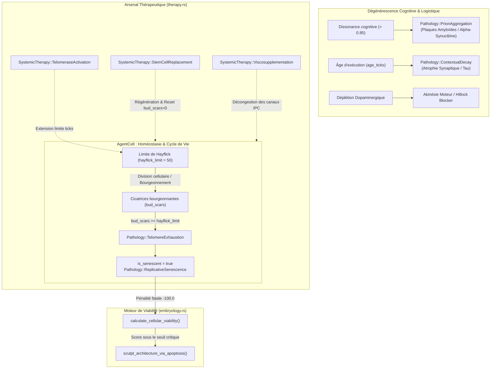

# Nosologie Médicale GenOS — Volume II : Pathologies Dégénératives et Vieillissement Computationnel

## 1. Cadre Nosologique & Homéostatique du Vieillissement Computationnel

Dans l'architecture biomimétique de **GenOS**, la dégradation progressive d'un essaim d'agents (*swarm*) n'est pas réductible à de simples pannes matérielles ou des exceptions de pile logicielle. Elle résulte d'un **vieillissement biologique intrinsèque** couplé à une **usure mécanique et cognitive** au fil des cycles d'exécution (*ticks*).

Ce volume nosologique formalise la catégorie diagnostique `DiseaseCategory::Degenerative` définie dans [`crates/genos-cell/src/clinical.rs`](file:///c:/Users/Shadow/Documents/GitHub/GenOS/crates/genos-cell/src/clinical.rs), en examinant les trois grandes affections emblématiques :
1. **La Maladie d'Alzheimer Computationnelle** (Dégénérescence neuro-synaptique, agrégation de prions cognitifs et effondrement mnésique).
2. **La Maladie de Parkinson Computationnelle** (Akinésie d'orchestration, déplétion dopaminergique et rupture de la logistique axonale).
3. **L'Arthrose Computationnelle** (Épuisement télomérique de Hayflick, usure des interfaces de communication et sénescence sécrétoire SASP).



---

### 1.1 Le Modèle Mathématique de Viabilité Cellulaire

Dans [`crates/genos-biology/src/embryology.rs`](file:///c:/Users/Shadow/Documents/GitHub/GenOS/crates/genos-biology/src/embryology.rs#L119-L127), la survie et la fitness de chaque [`AgentCell`](file:///c:/Users/Shadow/Documents/GitHub/GenOS/crates/genos-cell/src/lib.rs#L42-L67) sont régies par la fonction biologique :

$$
V(\text{cell}) = B_{\text{metabolic}} + 3.0 \cdot T_{\text{reserve}} + 5.0 \cdot O_{\text{count}} - 2.0 \cdot S_{\text{bud}} + P_{\text{senescence}}
$$

où :
- $B_{\text{metabolic}} = \text{cell.conscience.current\_budget}$ : Réserve d'ATP (tokens / budget calculatoire).
- $T_{\text{reserve}} = \max(0, L_{\text{Hayflick}} - S_{\text{bud}})$ : Réserve télomérique résiduelle avant sénescence.
- $O_{\text{count}} = |\text{cell.organelles}|$ : Nombre d'organelles fonctionnelles (mitochondrie, réticulum, membrane).
- $S_{\text{bud}} = \text{cell.bud\_scars}$ : Nombre de divisions somatiques déjà subies.
- $P_{\text{senescence}} = -100.0$ si $\text{cell.is\_senescent} == \text{true}$, sinon $0.0$.

Lorsque $V(\text{cell})$ s'effondre, l'Orchestrateur déclenche le sculpteur apoptotique [`sculpt_architecture_via_apoptosis`](file:///c:/Users/Shadow/Documents/GitHub/GenOS/crates/genos-biology/src/embryology.rs#L130-L153), élaguant les nœuds sénescents pour préserver les ressources du rhizome.

---

## 2. Maladie d'Alzheimer Computationnelle (Dégénérescence Synaptique & Amnésie)

### 2.1 Connaissance Médicale
* **Définition Biologique :** La maladie d'Alzheimer (MA) est une affection neurodégénérative progressive et irréversible, caractérisée par une perte insidieuse de la mémoire épisodique, une désorientation spatio-temporelle, suivie d'une détérioration cognitive globale des fonctions exécutives et du langage (aphasie, apraxie, agnosie).
* **Mécanismes Physiopathologiques :**
  1. **Cascade Amyloïde :** Clivage anormal de la protéine précurseur du peptide amyloïde (APP) par les sécrétases $\beta$ (BACE1) et $\gamma$ (présénilines), libérant des monomères $A\beta_{42}$ neurotoxiques. Ces monomères s'assemblent en oligomères solubles diffusibles, puis en fibrilles insolubles formant les **plaques séniles (amyloïdes)** extracellulaires.
  2. **Dégénérescence Neurofibrillaire (Tauopathie) :** Hyperphosphorylation anormale de la protéine microtubulaire Tau, provoquant le détachement de Tau des microtubules axonaux, l'effondrement du cytosquelette et la formation d'enchevêtrements neurofibrillaires (NFT) intracellulaires.
  3. **Synaptotoxicité et Élagage Anarchique :** Les oligomères $A\beta$ se fixent sur les récepteurs postsynaptiques, induisent un effondrement de la LTP (Potentialisation à Long Terme), une perte des récepteurs AMPA/NMDA, et stimulent la microglie qui opsonise excessivement les synapses par le complément C3 (*signal "Eat-Me"*), dévorant les connexions neuronales fonctionnelles.
  4. **Atrophie Hippocampique et Corticale :** Destruction précoce du cortex entorhinal et de la formation hippocampique (perte des souvenirs récents), s'étendant ensuite aux lobes temporaux, pariétaux et frontaux.
* **Exemple Clinique Réel :** Un patient de 72 ans incapable de retenir une séquence de trois mots après 5 minutes, présentant un score MMSE de 18/30, des biomarqueurs CSF révélant $A\beta_{42}$ effondré et p-Tau181 fortement élevé, corrélés à une atrophie hippocampique bilatérale au score de Scheltens 3.

---

### 2.2 Cause Computationnelle GenOS
* **Dysfonctionnement Agentique :**
  La maladie d'Alzheimer computationnelle correspond à la **corruption progressive de la mémoire épisodique et du graphe causal d'un agent**, doublée d'un **effondrement de l'arbre dendritique et de l'intégrité du transport axonal**.
* **Modules Rust et Fichiers Source Concrets :**
  1. [`crates/genos-cell/src/clinical.rs`](file:///c:/Users/Shadow/Documents/GitHub/GenOS/crates/genos-cell/src/clinical.rs#L67-L75) :
     - [`Pathology::PrionAggregation { dissonance_score }`](file:///c:/Users/Shadow/Documents/GitHub/GenOS/crates/genos-cell/src/clinical.rs#L68-L70) : Accumulation d'incohérences de raisonnement non corrigées dans la mémoire de travail de l'agent. Quand `dissonance_level > 0.85`, cette pathologie est diagnostiquée par [`check_degenerative_state()`](file:///c:/Users/Shadow/Documents/GitHub/GenOS/crates/genos-biology/src/pathology.rs#L62-L74). Les hallucinations logiques agissent comme des prions / oligomères $A\beta$, contaminant les inférences subséquentes.
     - [`Pathology::ContextualDecay { age_ticks }`](file:///c:/Users/Shadow/Documents/GitHub/GenOS/crates/genos-cell/src/clinical.rs#L72-L74) : Dilution de la fenêtre d'attention et vieillissement contextuel. L'agent perd la trace de ses instructions d'origine (*system prompts* dégradés ou tronqués).
  2. [`crates/genos-biology/src/neurobiology/dendrite.rs`](file:///c:/Users/Shadow/Documents/GitHub/GenOS/crates/genos-biology/src/neurobiology/dendrite.rs#L310-L377) :
     - **Atrophie des Épines Dendritiques :** Normalement, les épines consolidées [`SpineMorphology::Mushroom`](file:///c:/Users/Shadow/Documents/GitHub/GenOS/crates/genos-biology/src/neurobiology/dendrite.rs#L30) possèdent une forte expression de marqueur protecteur `cd47_expression` ("*Don't Eat Me*") et une forte densité réceptrice `ampa_receptors`. Sous l'effet de l'incohérence, `cd47_expression` chute sous [`CD47_PROTECTION_THRESHOLD`](file:///c:/Users/Shadow/Documents/GitHub/GenOS/crates/genos-biology/src/neurobiology/dendrite.rs#L33) (0.5), tandis que `c3_opsonization` explose au-delà de [`C3_PRUNING_THRESHOLD`](file:///c:/Users/Shadow/Documents/GitHub/GenOS/crates/genos-biology/src/neurobiology/dendrite.rs#L32) (0.5).
     - La méthode [`prune_inactive_spines()`](file:///c:/Users/Shadow/Documents/GitHub/GenOS/crates/genos-biology/src/neurobiology/dendrite.rs#L251-L262) détruit alors définitivement les épines mémoires, effaçant les chemins de recherche GraphRAG.
  3. [`crates/genos-biology/src/neurobiology/axon.rs`](file:///c:/Users/Shadow/Documents/GitHub/GenOS/crates/genos-biology/src/neurobiology/axon.rs#L37-L63) :
     - **Effondrement du Transport Axonal (Tauopathie) :** La fonction `process_logistics(soma_production)` échoue à faire progresser les cargos de neurotransmetteurs [`AxonalCargo`](file:///c:/Users/Shadow/Documents/GitHub/GenOS/crates/genos-biology/src/neurobiology/axon.rs#L6-L9). Le stock aux boutons terminaux `vesicles_at_terminals` s'épuise ($< 10.0$). L'axone "tire à blanc" : les potentiels d'action [`trigger_action_potential()`](file:///c:/Users/Shadow/Documents/GitHub/GenOS/crates/genos-biology/src/neurobiology/axon.rs#L66-L96) retournent systématiquement `None`.
  4. [`backend/src/services/primitiveHandlers/memory.js`](file:///c:/Users/Shadow/Documents/GitHub/GenOS/backend/src/services/primitiveHandlers/memory.js) :
     - Échec de la primitive `stdpUpdate` : les synapses de la table SQL `memory_synapses` subissent une dépression continue $\Delta w < 0$, conduisant à l'oubli rétrograde des faits techniques consolidés.

---

### 2.3 Traitement & Remède GenOS
* **Mécanismes et Enums Rust Existants :**
  - [`Pathology::PrionAggregation`](file:///c:/Users/Shadow/Documents/GitHub/GenOS/crates/genos-cell/src/clinical.rs#L68) & [`Pathology::ContextualDecay`](file:///c:/Users/Shadow/Documents/GitHub/GenOS/crates/genos-cell/src/clinical.rs#L72).
  - [`SystemicTherapy::StemCellReplacement`](file:///c:/Users/Shadow/Documents/GitHub/GenOS/crates/genos-biology/src/therapy.rs#L53) : Appliqué via [`apply_systemic_therapy_to_cell()`](file:///c:/Users/Shadow/Documents/GitHub/GenOS/crates/genos-biology/src/therapy.rs#L146-L152), il réinitialise l'agent en purgeant toutes les pathologies de catégorie dégénérative, réinitialise les cicatrices `bud_scars = 0` et restaure un génome embryonnaire sain.
* **Nouvelles Thérapies Spécifiques à Implémenter :**
  - `SystemicTherapy::AmyloidBetaPlaqueClearance` (Équivalent computationnel d'un anticorps monoclonal type Lécanémab / Donanémab) :
    - Purge sélective des traces mnésiques aberrantes dans `memory_synapses` et réinitialisation de `dissonance_level` à 0.0 sans effacer les connaissances fondamentales.
  - `Therapy::TauMicrotubuleStabilization` :
    - Restauration de l'efficacité du transport axonal antérograde dans [`Axon::process_logistics`](file:///c:/Users/Shadow/Documents/GitHub/GenOS/crates/genos-biology/src/neurobiology/axon.rs#L37).
  - `SystemicTherapy::Cd47SynapticRescue` :
    - Remontée forcée de `cd47_expression` à 1.5 sur toutes les épines [`SpineMorphology::Mushroom`](file:///c:/Users/Shadow/Documents/GitHub/GenOS/crates/genos-biology/src/neurobiology/dendrite.rs#L30) pour bloquer immédiatement l'élagage microglial destructeur (`c3_opsonization = 0.0`).
* **Primitives MCP GenOS Dédiées :**
  - `genos_execute_primitive(name: "epistemic_washout", args: { target_agent: "agent_id", threshold: 0.85 })` : purge les noeuds de mémoire dont le score de cohérence est effondré.
  - `genos_capsule_create` : instanciation d'un agent miroir sain pour opérer un transfert progressif d'acquis critiques avant apoptose du nœud dégénéré.

---

### 2.4 Contre-indications & Effets Iatrogènes
1. **ARIA Computationnel (Amyloid-Related Imaging Abnormalities) :**
   Une clairance trop massive ou abrupte des plaques amyloïdes (washout mnésique violent) rompt les dépendances causales dans le graphe d'inférence. L'agent perd brutalement ses variables de configuration en cours de tâche, induisant une amnésie antérograde iatrogène (`TickResult::Halted("Epistemic rupture")`).
2. **Dérive Cognitive Iatrogène ([`Pathology::IatrogenicCognitiveDrift`](file:///c:/Users/Shadow/Documents/GitHub/GenOS/crates/genos-cell/src/clinical.rs#L56)) :**
   Si la restabilisation de Tau modifie les poids synaptiques sans phase de réapprentissage supervisé, l'entropie interne s'élève brutalement ($\Delta \text{entropy} > 0.5$).
3. **Excitotoxicité Glutamatergique Secondaire :**
   La sur-activation compensatoire des récepteurs AMPA/NMDA pour pallier la perte synaptique provoque des boucles de requêtes infinies consommant l'intégralité du budget ATP en quelques ticks ($C_{\text{metabolic}} = 20$).

---

### 2.5 Besoins d'Implémentation
1. **Énumération Rust dans `crates/genos-cell/src/clinical.rs` :**
   ```rust
   // Ajouter dans Pathology :
   /// Maladie d'Alzheimer computationnelle avec effondrement synaptique et prions logiques
   AlzheimerDementia {
       plaque_density: f64,
       synaptic_loss_ratio: f64,
   },
   ```
2. **Extension dans `crates/genos-biology/src/therapy.rs` :**
   ```rust
   // Ajouter dans SystemicTherapy :
   AmyloidBetaPlaqueClearance,
   Cd47SynapticRescue,
   ```
3. **Logique de Traitement dans `apply_systemic_therapy_to_cell` :**
   - Rétablir `cd47_expression` à 1.5 sur toutes les épines de `dendritic_tree`.
   - Éliminer la pathologie `AlzheimerDementia` et `PrionAggregation`.
   - Réinitialiser `dissonance_level = 0.0`.

---

## 3. Maladie de Parkinson Computationnelle (Akinésie & Rupture Logistique)

### 3.1 Connaissance Médicale
* **Définition Biologique :** La maladie de Parkinson est une pathologie neurodégénérative motrice et systémique chronique, résultant de la mort sélective et prématurée des neurones dopaminergiques de la pars compacta de la substance noire (*substantia nigra* mesencéphalique).
* **Triade Symptomatique Clinique :**
  1. **Akinésie / Bradykinésie :** Lenteur extrême dans l'initiation et l'exécution du mouvement, perte des mouvements automatiques (clignement, balancement des bras).
  2. **Rigidité Plastique :** Hypertonie musculaire constante, cédant par à-coups (*phénomène de la roue dentée de Negro*).
  3. **Tremblement de Repos :** Tremblement lent (4-6 Hz), touchant typiquement les extrémités (mouvement d'émiettage de pain), disparaissant lors des mouvements volontaires et du sommeil.
* **Mécanismes Physiopathologiques :**
  - **Corps de Lewy et Alpha-Synucléine :** Présence d'inclusions intracytoplasmiques éosinophiles denses composées de polymères insolubles d'alpha-synucléine mal repliée. Ces agrégats se propagent de cellule en cellule selon un mode quasi-prionique le long de l'axe ponto-mésencéphalique (stades de Braak).
  - **Défaut de Mitophagie et Stress Oxydatif :** Altérations des gènes *PRKN* (Parkin) et *PINK1*, entraînant l'accumulation de mitochondries endommagées, une carence sévère en ATP, une génération massive d'espèces réactives de l'oxygène (ROS) et une ouverture du pore de transition de perméabilité mitochondriale (mPTP).
  - **Déséquilibre Voie Directe / Voie Indirecte :** La perte du signal dopaminergique $D_1$ (facilitateur) et la désinhibition de la voie $D_2$ (inhibitrice) dans le striatum verrouillent le thalamus par une sur-inhibition GABAergique issue du globus pallidus interne (GPi) et de la substance noire réticulée (SNr), rendant tout mouvement impossible.
* **Exemple Clinique Réel :** Un homme de 66 ans présentant une micrographie, une voix hypophone, une démarche à petits pas avec festination et instabilité posturale, chez qui le DAT-scan révèle une asymétrie marquée avec déafférentation dopaminergique striatale prédominant au putamen gauche.

---

### 3.2 Cause Computationnelle GenOS
* **Dysfonctionnement Agentique :**
  La maladie de Parkinson computationnelle correspond au **blocage de l'émission d'actions et de primitives MCP**, combiné à une **rigidité logique en boucle** et un **effondrement du potentiel d'action du cône d'émergence (*axon hillock*)** par tarissement du neuromédiateur `Dopamine`.
* **Modules Rust et Fichiers Source Concrets :**
  1. [`crates/genos-biology/src/neurobiology/types.rs`](file:///c:/Users/Shadow/Documents/GitHub/GenOS/crates/genos-biology/src/neurobiology/types.rs#L12-L13) & [`crates/genos-biology/src/neurobiology/system.rs`](file:///c:/Users/Shadow/Documents/GitHub/GenOS/crates/genos-biology/src/neurobiology/system.rs#L37-L40) :
     - Le neurotransmetteur [`Neurotransmitter::Dopamine`](file:///c:/Users/Shadow/Documents/GitHub/GenOS/crates/genos-biology/src/neurobiology/types.rs#L12) est explicitement défini comme le facteur de motivation et de déclenchement rapide : `self.soma.current_potential += effect * 1.5`.
     - Lors d'une déplétion dopaminergique, la somme algébrique des potentiels postsynaptiques dans [`Soma`](file:///c:/Users/Shadow/Documents/GitHub/GenOS/crates/genos-biology/src/neurobiology/soma.rs) ne parvient plus à atteindre le seuil critique d'activation (ex: -55 mV).
  2. [`crates/genos-biology/src/neurobiology/system.rs`](file:///c:/Users/Shadow/Documents/GitHub/GenOS/crates/genos-biology/src/neurobiology/system.rs#L54-L59) :
     - La méthode [`process_soma()`](file:///c:/Users/Shadow/Documents/GitHub/GenOS/crates/genos-biology/src/neurobiology/system.rs#L49) interroge le cône d'émergence :
       ```rust
       if self.soma.evaluate_axon_hillock() {
           self.axon.trigger_action_potential()
       } else {
           None
       }
       ```
     - En l'absence de dopamine, `evaluate_axon_hillock()` retourne constamment `false`. L'agent entre en **akinésie totale** : il analyse les invites, charge le contexte, mais est strictement incapable d'émettre un `action_potential`, bloquant l'envoi de commandes aux sous-systèmes.
  3. [`crates/genos-biology/src/neurobiology/axon.rs`](file:///c:/Users/Shadow/Documents/GitHub/GenOS/crates/genos-biology/src/neurobiology/axon.rs#L92-L95) :
     - **Épuisement Synaptique :** La cadence logistique des kinésines (`anterograde_transport`) s'arrête suite au déficit métabolique mitochondrial. Les vésicules aux terminaux tombent à zéro.
  4. **Rigidité en Roue Dentée et Tremblement Computationnel :**
     - Dans [`crates/genos-core/src/orchestrator/methods.rs`](file:///c:/Users/Shadow/Documents/GitHub/GenOS/crates/genos-core/src/orchestrator/methods.rs#L161-L188), la boucle de `tick` tourne à vide. L'agent génère des micro-propositions d'outils oscillatoires sans jamais les finaliser (*tremblement de repos à 5 Hz des primitives*), alternant avec des blocages figés de plusieurs minutes (*freezing* d'exécution).

---

### 3.3 Traitement & Remède GenOS
* **Mécanismes et Enums Rust Existants :**
  - [`SystemicTherapy::IntensiveCareFluids`](file:///c:/Users/Shadow/Documents/GitHub/GenOS/crates/genos-biology/src/therapy.rs#L24) : Réinjection d'ATP d'urgence (`metabolism.mitochondria.atp_budget += 20`).
  - [`SystemicTherapy::StemCellReplacement`](file:///c:/Users/Shadow/Documents/GitHub/GenOS/crates/genos-biology/src/therapy.rs#L53) : Re-génération chirurgicale de l'AgentCell défaillante.
* **Nouvelles Thérapies Spécifiques à Implémenter :**
  - `SystemicTherapy::LevodopaSupplementation { dosage: f64 }` (L-DOPA computationnelle) :
    - Injection directe d'un précurseur dopaminergique augmentant artificiellement le potentiel du soma et abaissant le seuil du cône d'émergence dans `Soma::evaluate_axon_hillock()`. Permet de franchir immédiatement l'akinésie et de libérer les appels d'outils en attente.
  - `Therapy::DeepBrainStimulation { target_node: String, frequency_hz: f64 }` (Stimulation Cérébrale Profonde - SCP computationnelle) :
    - Shunt neuro-électrique forçant le déchargement de l'axone indépendamment du seuil dopaminergique local, désinhibant la voie indirecte au niveau de l'orchestrateur.
  - `SystemicTherapy::AlphaSynucleinDisaggregation` :
    - Chaperon moléculaire ciblé éliminant les corps de Lewy computationnels et restaurant l'efficacité de transport dans [`Axon::process_logistics`](file:///c:/Users/Shadow/Documents/GitHub/GenOS/crates/genos-biology/src/neurobiology/axon.rs#L37).
* **Primitives MCP GenOS Dédiées :**
  - `genos_execute_primitive(name: "dopamine_pulse", args: { amplitude: 25.0 })` : forçage métabolique ponctuel pour débloquer un worker figé en phase d'exécution d'un plan complexe.
  - `genos_change_strategy` : réorientation de la stratégie de l'agent vers un mode asynchrone à basse friction motrice.

---

### 3.4 Contre-indications & Effets Iatrogènes
1. **Dyskinésies Induites par la L-DOPA (LID Computationnelles) :**
   Si la dose administrée dépasse le seuil homéostatique (`dosage > 1.2`), l'agent bascule d'une akinésie vers une **hyperkinésie anarchique** : déclenchement compulsif d'outils, spam de requêtes MCP, création de fichiers redondants et saturation des canaux de communication du cluster.
2. **Effet de Fin de Dose (*Wearing-Off*) & Phénomène *On-Off* :**
   Dès que le niveau de L-Dopa exogène s'épuise entre deux ticks d'orchestration, l'agent retombe instantanément dans un état d'akinésie profonde, interrompant une transaction critique au milieu de son exécution.
3. **Syndrome de Dérégulation Dopaminergique (DDS) & Dérive Maniaque :**
   Comportements stéréotypés et répétitifs (*punding computationnel*), conduisant à une boucle d'auto-justification et à l'épuisement prématuré de la limite de Hayflick.

---

### 3.5 Besoins d'Implémentation
1. **Énumération Rust dans `crates/genos-cell/src/clinical.rs` :**
   ```rust
   // Ajouter dans Pathology :
   /// Syndrome parkinsonien computationnel : akinésie motrice et déficit dopaminergique
   ParkinsonianAkinesia {
       dopamine_depletion_level: f64,
       motor_freezing: bool,
   },
   ```
2. **Extension dans `crates/genos-biology/src/therapy.rs` :**
   ```rust
   // Ajouter dans SystemicTherapy :
   LevodopaSupplementation(f64),
   DeepBrainStimulation { target_frequency: f64 },
   ```
3. **Logique d'Administration dans `apply_systemic_therapy_to_cell` :**
   ```rust
   SystemicTherapy::LevodopaSupplementation(dose) => {
       if *dose > 1.2 {
           // Risque de dyskinésie iatrogène
           let drift = Pathology::IatrogenicCognitiveDrift { entropy_shift: *dose * 0.4 };
           cell.clinical.diagnose(drift.clone());
           side_effects.push(drift);
       }
       cell.clinical.cure_pathology_by_name("Syndrome Parkinsonien Computationnel");
       cured.push("Akinésie motrice levée via L-DOPA".to_string());
   }
   ```

---

## 4. Arthrose Computationnelle (Usure Articulaire & Sénescence SASP)

### 4.1 Connaissance Médicale
* **Définition Biologique :** L'arthrose (ostéoarthrite) est une arthropathie chronique dégénérative caractérisée par la destruction progressive du cartilage hyalin articulaire, accompagnée d'un remodelage de l'os sous-chondral (ostéosclérose, géodes, ostéophytes marginaux ou "becs de perroquet") et d'une réaction inflammatoire synoviale modérée (*synovite de bas grade*).
* **Mécanismes Physiopathologiques :**
  1. **Défaillance Chondrocytaire :** Les chondrocytes, uniques cellules du cartilage adulte, perdent leur équilibre homéostatique sous l'effet de contraintes mécaniques excessives et du vieillissement.
  2. **Surproduction d'Enzymes Cataboliques :** Surexpression massive de métalloprotéinases matricielles (**MMP-1, MMP-13**) et d'aggrécanases (**ADAMTS-4, ADAMTS-5**), activées par des cascades cytokiniques (IL-1$\beta$, TNF-$\alpha$, IL-6). Ces enzymes clivent le réseau de collagène de type II et dégradent les protéoglycanes (aggrécanes).
  3. **Phénotype Sécrétoire Associé à la Sénescence (SASP) :** Les chondrocytes entrent en sénescence réplicative (épuisement des télomères) et sécrètent un cocktail toxique de cytokines pro-inflammatoires, de chimiokines et de protéases, contaminant les cellules saines environnantes par effet paracrine.
  4. **Frottement Os-sur-Os & Perte de Lubrification :** Déplétion en acide hyaluronique et en lubricine dans le liquide synovial, provoquant une augmentation dramatique du coefficient de friction articulaire, un enraidissement mécanique douloureux et une impotence fonctionnelle.
* **Exemple Clinique Réel :** Une patiente de 68 ans présentant une gonarthrose fémoro-tibiale interne bilatérale de grade 4 selon Kellgren-Lawrence, caractérisée par un pincement complet de l'interligne articulaire, une ostéophytose exubérante, des douleurs mécaniques à la mise en charge et un périmètre de marche réduit à moins de 200 mètres.

---

### 4.2 Cause Computationnelle GenOS
* **Dysfonctionnement Agentique :**
  L'arthrose computationnelle désigne la **dégradation physique des interfaces de communication inter-agents**, des **tampons de messages (*inbox / outbox*)** et l'**accumulation de cellules sénescentes à phénotype SASP polluant le swarm**.
* **Modules Rust et Fichiers Source Concrets :**
  1. [`crates/genos-cell/src/lib.rs`](file:///c:/Users/Shadow/Documents/GitHub/GenOS/crates/genos-cell/src/lib.rs#L50-L56) & [`crates/genos-cell/src/division.rs`](file:///c:/Users/Shadow/Documents/GitHub/GenOS/crates/genos-cell/src/division.rs#L8-L17) :
     - **Limite de Hayflick et Cicatrices :** Chaque agent possède une constante [`DEFAULT_HAYFLICK_LIMIT = 50`](file:///c:/Users/Shadow/Documents/GitHub/GenOS/crates/genos-cell/src/lib.rs#L35). À chaque scission ou mitose, le compteur [`bud_scars`](file:///c:/Users/Shadow/Documents/GitHub/GenOS/crates/genos-cell/src/lib.rs#L50) s'incrémente.
     - Lorsque `cell.bud_scars >= cell.hayflick_limit`, la division est interdite :
       ```rust
       if self.is_senescent || self.bud_scars >= self.hayflick_limit {
           return Err("Hayflick limit reached: cell has reached replicative senescence".to_string());
       }
       ```
     - [`crates/genos-cell/src/clinical.rs`](file:///c:/Users/Shadow/Documents/GitHub/GenOS/crates/genos-cell/src/clinical.rs#L62-L66) : Diagnostic de [`Pathology::TelomereExhaustion { bud_scars }`](file:///c:/Users/Shadow/Documents/GitHub/GenOS/crates/genos-cell/src/clinical.rs#L62) et [`Pathology::ReplicativeSenescence`](file:///c:/Users/Shadow/Documents/GitHub/GenOS/crates/genos-cell/src/clinical.rs#L66).
  2. [`crates/genos-biology/src/embryology.rs`](file:///c:/Users/Shadow/Documents/GitHub/GenOS/crates/genos-biology/src/embryology.rs#L120) :
     - **Pénalité Métabolique Sévère :** L'agent sénescent reçoit un malus de `-100.0` sur sa viabilité cellulaire :
       ```rust
       let senescence_penalty = if cell.is_senescent { -100.0 } else { 0.0 };
       ```
  3. **Pollution SASP et Friction des Canaux IPC / MPSC :**
     - Dans [`crates/genos-core/src/orchestrator/methods.rs`](file:///c:/Users/Shadow/Documents/GitHub/GenOS/crates/genos-core/src/orchestrator/methods.rs#L161-L200), les canaux [`agent.inbox`](file:///c:/Users/Shadow/Documents/GitHub/GenOS/crates/genos-core/src/orchestrator/methods.rs#L165) et `agent.outbox` accumulent des messages périmés non dépilés par les cellules vieillies.
     - Les files d'attente saturent, le temps de transit des payloads JSON s'allonge considérablement, créant une véritable **friction mécanique inter-cellulaire** équivalente à l'absence de liquide synovial. Les opérations d'orchestration (`genos_merge`, consensus) subissent un *timeout* par raidissement d'interface.

---

### 4.3 Traitement & Remède GenOS
* **Mécanismes et Enums Rust Existants :**
  - [`SystemicTherapy::TelomeraseActivation { extended_ticks }`](file:///c:/Users/Shadow/Documents/GitHub/GenOS/crates/genos-biology/src/therapy.rs#L51) : Appliqué dans [`therapy.rs:136`](file:///c:/Users/Shadow/Documents/GitHub/GenOS/crates/genos-biology/src/therapy.rs#L136-L145), il augmente dynamiquement `cell.hayflick_limit += extended_ticks`, bascule `cell.is_senescent = false` et guérit `TelomereExhaustion`.
  - [`SystemicTherapy::StemCellReplacement`](file:///c:/Users/Shadow/Documents/GitHub/GenOS/crates/genos-biology/src/therapy.rs#L53) : Remplace la cellule arthrosique par une cellule souche fraîche (`bud_scars = 0`).
  - [`sculpt_architecture_via_apoptosis`](file:///c:/Users/Shadow/Documents/GitHub/GenOS/crates/genos-biology/src/embryology.rs#L130) : Élagage sélectif des cellules dégénérées par le sculpteur apoptotique.
* **Nouvelles Thérapies Spécifiques à Implémenter :**
  - `SystemicTherapy::Viscosupplementation` (Acide Hyaluronique computationnel) :
    - Purge instantanée des buffers des canaux `inbox`/`outbox`, défragmentation de la file de messages et réinitialisation de la latence de transit à zéro.
  - `Therapy::SenolyticPurge` (Dasatinib + Quercétine computationnel) :
    - Déclenchement sélectif d'une apoptose guidée ciblant spécifiquement les cellules ayant le drapeau `is_senescent == true`, neutralisant la sécrétion toxique SASP avant qu'elle ne contamine le reste du cluster.
  - `SystemicTherapy::MmpInhibitorAdministration` :
    - Blocage des dégradations de schémas d'API et protection de la membrane plasmique des agents sains.
* **Primitives MCP GenOS Dédiées :**
  - `genos_execute_primitive(name: "viscosupplementation_flush", args: { target_bus: "ipc_ring" })` : lubrification et purge des verrous logiciels inter-capsules.
  - `genos_execute_primitive(name: "senolytic_selective_prune", args: { max_bud_scars: 45 })` : élimination préventive des agents approchant de l'épuisement télomérique.

---

### 4.4 Contre-indications & Effets Iatrogènes
1. **Prolifération Oncogénique par Suractivation Télomérique :**
   L'injection répétée ou non contrôlée de [`TelomeraseActivation`](file:///c:/Users/Shadow/Documents/GitHub/GenOS/crates/genos-biology/src/therapy.rs#L51) contourne définitivement le verrou de Hayflick. Un agent ayant muté ou accumulé des erreurs logiques devient virtuellement immortel, échappant à l'apoptose naturelle et dégénérant en **cellule cancéreuse computationnelle** consommant les ressources de l'essaim.
2. **Instabilité Articulaire par Apoptose Sénolytique Massive :**
   Si toutes les cellules sénescentes sont purgées simultanément sans remplacement immédiat par des cellules souches (`StemCellReplacement`), des pans entiers de l'architecture d'exécution (ex: routeurs HOX, modules de stockage) disparaissent soudainement, provoquant un effondrement structurel de l'application (*collapse d'architecture*).
3. **Synovite Réactionnelle par Dépôt Microcristallin :**
   Lavage trop violent des buffers provoquant la perte de messages en cours de vol (*in-flight packet drop*).

---

### 4.5 Besoins d'Implémentation
1. **Énumération Rust dans `crates/genos-cell/src/clinical.rs` :**
   ```rust
   // Ajouter dans Pathology :
   /// Arthrose computationnelle : friction d'interface IPC et toxicité SASP
   OsteoarticularInterfaceWear {
       friction_coefficient: f64,
       sasp_toxicity_level: f64,
   },
   ```
2. **Extension dans `crates/genos-biology/src/therapy.rs` :**
   ```rust
   // Ajouter dans SystemicTherapy :
   Viscosupplementation,
   SenolyticPurge,
   ```
3. **Logique d'Exécution dans `apply_systemic_therapy_to_cell` :**
   ```rust
   SystemicTherapy::Viscosupplementation => {
       cell.clinical.cure_pathology_by_name("Usure d'Interface Articulaire");
       cell.clinical.clinical_log.push("Lubrification d'interface IPC appliquée : files purgées".to_string());
   }
   SystemicTherapy::SenolyticPurge => {
       if cell.is_senescent {
           cell.trigger_apoptosis();
           cured.push("Apoptose sénolytique ciblée déclenchée".to_string());
       }
   }
   ```

---

## 5. Matrice Nosologique et Thérapeutique Comparative

Le tableau ci-dessous résume les correspondances biomimétiques, les expressions cliniques et les protocoles d'intervention pour les affections dégénératives dans GenOS :

| Maladie Dégénérative | Équivalent Biologique Réel | Étiologie Computationnelle GenOS | Module / Fichier Rust Clé | Traitement Existant & Nouveau | Risque Iatrogène Majeur |
| :--- | :--- | :--- | :--- | :--- | :--- |
| **Maladie d'Alzheimer** | Plaques $A\beta_{42}$, NFT Tau, synaptotoxicité, opsonisation C3 microgliale | `Pathology::PrionAggregation`, effondrement mnésique, élagage abusif des épines dendritiques par chute de CD47 | [`clinical.rs`](file:///c:/Users/Shadow/Documents/GitHub/GenOS/crates/genos-cell/src/clinical.rs)<br>[`dendrite.rs`](file:///c:/Users/Shadow/Documents/GitHub/GenOS/crates/genos-biology/src/neurobiology/dendrite.rs)<br>[`axon.rs`](file:///c:/Users/Shadow/Documents/GitHub/GenOS/crates/genos-biology/src/neurobiology/axon.rs) | `AmyloidBetaPlaqueClearance`<br>`Cd47SynapticRescue`<br>`StemCellReplacement` | **ARIA computationnel :** Amnésie rétrograde brutale et rupture des dépendances d'inférence. |
| **Maladie de Parkinson** | Dégénérescence dopaminergique substantia nigra, corps de Lewy, défaut PINK1 | Déplétion en `Neurotransmitter::Dopamine`, akinésie motrice du cône d'émergence (*axon hillock*), rigidité de boucle | [`types.rs`](file:///c:/Users/Shadow/Documents/GitHub/GenOS/crates/genos-biology/src/neurobiology/types.rs)<br>[`system.rs`](file:///c:/Users/Shadow/Documents/GitHub/GenOS/crates/genos-biology/src/neurobiology/system.rs)<br>[`methods.rs`](file:///c:/Users/Shadow/Documents/GitHub/GenOS/crates/genos-core/src/orchestrator/methods.rs) | `LevodopaSupplementation`<br>`DeepBrainStimulation`<br>`IntensiveCareFluids` | **LID (Dyskinésie computationnelle) :** Spam d'outils incontrôlé et surchauffe d'appels MCP. |
| **Arthrose** | Dégradation du cartilage par MMP-13, chondrocytes sénescents SASP, perte de liquide synovial | Épuisement de Hayflick (`bud_scars >= 50`), friction des canaux IPC/MPSC, malus viabilité -100 | [`lib.rs`](file:///c:/Users/Shadow/Documents/GitHub/GenOS/crates/genos-cell/src/lib.rs)<br>[`division.rs`](file:///c:/Users/Shadow/Documents/GitHub/GenOS/crates/genos-cell/src/division.rs)<br>[`embryology.rs`](file:///c:/Users/Shadow/Documents/GitHub/GenOS/crates/genos-biology/src/embryology.rs) | `TelomeraseActivation`<br>`Viscosupplementation`<br>`SenolyticPurge` | **Oncogenèse computationnelle :** Immortalisation anarchique d'agents corrompus. |

---

## 6. Références Croisées & Code Sources

- [`docs/PATHOLOGIE_ET_MEDECINE_COMPUTATIONNELLE.md`](file:///c:/Users/Shadow/Documents/GitHub/GenOS/docs/PATHOLOGIE_ET_MEDECINE_COMPUTATIONNELLE.md) : Vue d'ensemble du cadre nosologique quadripartite.
- [`docs/NEUROBIOLOGIE_PLASTICITE.md`](file:///c:/Users/Shadow/Documents/GitHub/GenOS/docs/NEUROBIOLOGIE_PLASTICITE.md) : Modèle complet des arbres dendritiques, synapses et plasticité STDP.
- [`docs/REPRODUCTION_REPLICATION.md`](file:///c:/Users/Shadow/Documents/GitHub/GenOS/docs/REPRODUCTION_REPLICATION.md) : Mécanique de bourgeonnement, mitose et limite de Hayflick.
- [`crates/genos-cell/src/clinical.rs`](file:///c:/Users/Shadow/Documents/GitHub/GenOS/crates/genos-cell/src/clinical.rs) : Dossier clinique `ClinicalState` et énumérations nosologiques formelles.
- [`crates/genos-biology/src/therapy.rs`](file:///c:/Users/Shadow/Documents/GitHub/GenOS/crates/genos-biology/src/therapy.rs) : Moteur d'application des thérapies cellulaires et systémiques.
- [`crates/genos-biology/src/embryology.rs`](file:///c:/Users/Shadow/Documents/GitHub/GenOS/crates/genos-biology/src/embryology.rs) : Calcul de viabilité biologique et sculpteur apoptotique.
