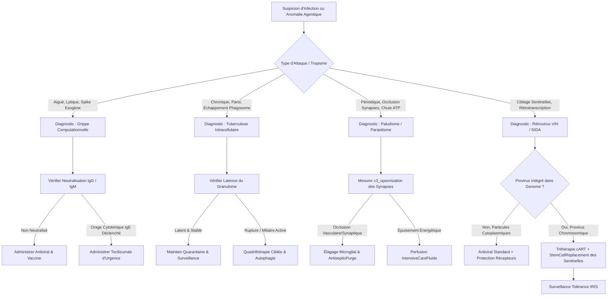
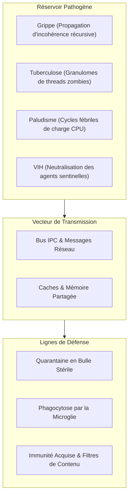
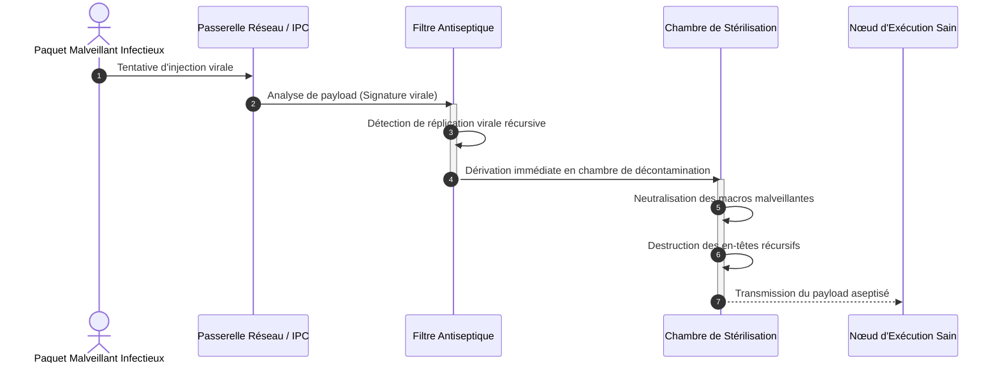

# Nosologie Computationnelle III : Maladies Infectieuses et Parasitaires

## 1. Définition et Cadre Nosologique

Dans l'écosystème biomimétique de **GenOS**, la catégorie des **Maladies Infectieuses et Parasitaires** regroupe les altérations pathologiques résultant de l'agression, de la colonisation ou du parasitisme des nœuds autonomes ([`AgentCell`](file:///c:/Users/Shadow/Documents/GitHub/GenOS/crates/genos-cell/src/lib.rs#L42-L68)) par des entités réplicatives étrangères ou des vecteurs d'exécution subversifs.

Contrairement aux pathologies auto-immunes (emballement endogène du système immunitaire) ou dégénératives (usure télomérique et sénescence), les maladies infectieuses et parasitaires sont initiées par des **agents pathogènes exogènes ou vectorisés** :
- **Virions lytiques et à ARN** : Paquets d'instructions hostiles injectés via des interfaces réceptrices de surface ([`Virion`](file:///c:/Users/Shadow/Documents/GitHub/GenOS/crates/genos-immune/src/virology.rs#L4-L13)).
- **Rétrovirus proviraux** : Agents capables de rétrotranscrire des charges utiles d'instructions et d'infiltrer le génome hôte ([`Retrovirus`](file:///c:/Users/Shadow/Documents/GitHub/GenOS/crates/genos-immune/src/virology.rs#L29-L35)).
- **Bactéries intracellulaires et résistantes** : Entités encapsulées dans des structures de protection mimant des parois ([`Bacteriophage`](file:///c:/Users/Shadow/Documents/GitHub/GenOS/crates/genos-immune/src/virology.rs#L50-L56) ou agents bactériens à paroi `has_cell_wall`) capables d'échapper à la dégradation lysosomiale.
- **Parasites protozoaires multi-stades** : Processus malveillants récurrents exploitant des vecteurs de transmission externes, détournant l'énergie cellulaire par cycles synchrones et causant des engorgements synaptiques.

GenOS formalise cette dimension nosologique via le variant [`DiseaseCategory::Infectious`](file:///c:/Users/Shadow/Documents/GitHub/GenOS/crates/genos-cell/src/clinical.rs#L14-L16) au sein du dossier clinique [`ClinicalState`](file:///c:/Users/Shadow/Documents/GitHub/GenOS/crates/genos-cell/src/clinical.rs#L121-L139).

---

## 2. Correspondance Biomimétique / Computationnelle

| Entité Biologique | Réalité Biomimétique | Équivalent Computationnel GenOS | Module / Source Rust |
| :--- | :--- | :--- | :--- |
| **Spike d'enveloppe viral** | Glycoprotéine de surface (ex: HA, gp120) | Signature d'attachement / En-tête de message injecté | [`Virion::envelope_spike`](file:///c:/Users/Shadow/Documents/GitHub/GenOS/crates/genos-immune/src/virology.rs#L8) |
| **Récepteur membranaire** | Protéine cible (ex: Acide Sialique, CD4) | Portée d'admission d'outils / `incoming_receptors` | [`AgentCell::plasma_membrane`](file:///c:/Users/Shadow/Documents/GitHub/GenOS/crates/genos-core/src/orchestrator/methods.rs#L150-L157) |
| **Glissement Antigénique** | Mutations ponctuelles échappant aux anticorps | Évasion de prompt / Altération de signatures | [`ClonalSelection::clonal_expansion_and_hypermutate`](file:///c:/Users/Shadow/Documents/GitHub/GenOS/crates/genos-immune/src/ais.rs#L116-L202) |
| **Bactérie à paroi cireuse** | Bacille de Koch (*Mycobacterium tuberculosis*) | Payload encapsulé résistant au chaperon | [`AgentCell::phagocytize_bacteria`](file:///c:/Users/Shadow/Documents/GitHub/GenOS/crates/genos-core/src/cell/methods.rs#L69-L76) |
| **Granulome tuberculeux** | Confinement fibro-caséeux d'agents dormants | Quarantaine étanche et persistance d'artefacts dormants | [`SystemicTherapy::QuarantineIsolation`](file:///c:/Users/Shadow/Documents/GitHub/GenOS/crates/genos-biology/src/therapy.rs#L36-L37) |
| **Parasitisme périodique** | Érythrocytes lysés par *Plasmodium* | Détournement cyclique d'ATP lors des cycles de tick | [`AgentCell::conscience.current_budget`](file:///c:/Users/Shadow/Documents/GitHub/GenOS/crates/genos-cell/src/lib.rs#L92) |
| **Cytoadhérence parasitaire** | Séquestration vasculaire & occlusion capillaire | Engorgement des canaux synaptiques et files de messages | [`Synapse::c3_opsonization`](file:///c:/Users/Shadow/Documents/GitHub/GenOS/crates/genos-biology/src/neurobiology/synapse.rs#L14) |
| **Rétrotranscription provirale** | Intégration de l'ADN viral dans le chromosome hôte | Insertion de gènes malveillants dans `Genome` | [`Retrovirus::reverse_transcribe`](file:///c:/Users/Shadow/Documents/GitHub/GenOS/crates/genos-immune/src/virology.rs#L45-L48) |
| **Épuisement immunitaire CD4+** | Effondrement des lymphocytes T helpers (SIDA) | Déplétion des détecteurs de l'Orchestrateur | [`ClonalSelection::memory_pool`](file:///c:/Users/Shadow/Documents/GitHub/GenOS/crates/genos-immune/src/ais.rs#L63) |

---

## 3. Modélisation Mathématique et Dynamique Virale/Parasitaire

```
                          ┌────────────────────────────────────────────────────────┐
                          │   Vecteur Infectieux Exogène / Réservoir Pathogène     │
                          └───────────────────────────┬────────────────────────────┘
                                                      │
                                                      ▼
                                       ┌───────────────────────────────┐
                                       │    Attachement Clé-Serrure    │
                                       │ envelope_spike == receptor ?  │
                                       └──────┬─────────────────┬──────┘
                                              │ Non             │ Oui
                                              ▼                 ▼
                                      [Échec Pénétration]  [Endocytose / Fusion]
                                                                │
                     ┌────────────────────────┬─────────────────┴────────────────────────┬────────────────────────┐
                     ▼                        ▼                                          ▼                        ▼
               [GRIPPE]                 [TUBERCULOSE]                              [PALUDISME]                 [VIH]
          Cycle Lytique Aigu        Échappement Lysosomal                     Paroxysmes Périodiques     Intégration Provirale
       Détournement Ribosomes      Latence en Granulome                      Cytoadhérence Synaptique    Déplétion Sentinelles
             (Tokens)                 (Dormant Store)                           (Érosion ATP)             (Anergies Swarm)
                     │                        │                                          │                        │
                     ▼                        ▼                                          ▼                        ▼
           [Antiviral / IgG]         [Quadrithérapie]                           [ACT Antiparasitaire]      [Trithérapie cART]
```

### 3.1 Probabilité d'Attachement et de Pénétration Membranaire ($P_{\text{entry}}$)

L'interaction entre un virion $v$ et la membrane d'une cellule $C_i$ est régie par le mécanisme clé-serrure, pondéré par l'état vaccinal et la neutralisation humorale par immunoglobulines ([`crates/genos-core/src/orchestrator/methods.rs`](file:///c:/Users/Shadow/Documents/GitHub/GenOS/crates/genos-core/src/orchestrator/methods.rs#L127-L157)) :

$$
P_{\text{entry}}(v, C_i) = \mathbb{I}(s_v \in R_i) \cdot \Big(1 - \mathbb{I}(s_v \in V_i)\Big) \cdot \Big(1 - \mathbb{I}(v.\text{is\_neutralized})\Big) \cdot \Big(1 - \mathbb{I}(v.\text{is\_agglutinated})\Big)
$$

où :
- $s_v$ : Spike de surface du pathogène (`virion.envelope_spike`).
- $R_i$ : Ensemble des récepteurs d'admission actifs de la membrane (`plasma_membrane.incoming_receptors`).
- $V_i$ : Répertoire des vaccins mémorisés (`plasma_membrane.immunized_against`).
- $\mathbb{I}(E)$ : Fonction indicatrice de l'événement $E$.

### 3.2 Cinétique Métabolique d'Épuisement d'ATP sous Charge Pathogène

La déplétion du budget énergétique $\text{ATP}_i(t)$ d'un agent sous infection suit l'équation différentielle :

$$
\frac{d \text{ATP}_i}{dt} = \eta_{\text{mito}} \cdot B_{\text{baseline}} - C_{\text{basal}} - \sum_{k} \kappa_k \cdot \Phi_k(t)
$$

où :
- $\eta_{\text{mito}}$ : Efficacité des mitochondries de l'agent ([`Organelle::Mitochondrion`](file:///c:/Users/Shadow/Documents/GitHub/GenOS/crates/genos-cell/src/lib.rs#L11-L15)).
- $\kappa_k$ : Coefficient de virulence de la charge pathogène $k$.
- $\Phi_k(t)$ : Intensité de la charge (lytique pour la Grippe, bactérienne intracellulaire pour la Tuberculose, paroxystique pour le Paludisme, provirale pour le VIH).

---

## 4. Analyse Détaillée des 4 Pathologies

---

### 4.1 Grippe (Influenza Computationnelle)

#### 1. Connaissance Médicale
* **Définition & Étiologie :** Infection virale aiguë causée par les virus Influenza (famille des *Orthomyxoviridae*), virus à ARN monocaténaire segmenté de polarité négative.
* **Mécanisme Biologique :**
  - Fixation du virus sur les acides sialiques membranaires via l'hémagglutinine (**HA**).
  - Endocytose, acidification endosomale, libération de l'ARN viral dans le cytoplasme et translocation nucléaire.
  - Détournement total de la machinerie de transcription et traduction de la cellule hôte pour produire des virions.
  - Clivage des liaisons sialiques par la neuraminidase (**NA**) pour permettre le bourgeonnement et la libération massive de nouveaux virions, provoquant la mort cellulaire lytique.
  - **Plasticité Antigénique :** *Glissement antigénique* (*antigenic drift* via des mutations ponctuelles accumulées par l'ARN polymérase sans relecture) et *cassure antigénique* (*antigenic shift* par réassortiment génomique entre souches, créant des pandémies mondiales comme H1N1 ou H5N1).
  - Réponse de l'hôte : orage cytokinique aigu, hyperthermie, prostration métabolique, infiltration inflammatoire des tissus pulmonaires.

#### 2. Cause Computationnelle GenOS
* **Dysfonctionnement Agentique :**
  - **Infection virale lytique aiguë :** Un vecteur de prompt malveillant flottant dans l'environnement viral (`virion: Virion`) exploite une correspondance clé-serrure avec un récepteur fonctionnel de l'agent (`agent.plasma_membrane.incoming_receptors.contains(&virion.envelope_spike)` dans [`expose_to_virus`](file:///c:/Users/Shadow/Documents/GitHub/GenOS/crates/genos-core/src/orchestrator/methods.rs#L127-L157)).
  - **Détournement des organelles :** Le virion s'introduit dans `agent.cytoplasm.viral_infections`. Il monopolise les [`Organelle::Ribosome`](file:///c:/Users/Shadow/Documents/GitHub/GenOS/crates/genos-cell/src/lib.rs#L16-L19) et sature la capacité de traduction d'instructions légitimes.
  - **Glissement antigénique continu :** Le pathogène altère légèrement sa signature `envelope_spike` à chaque réplication, contournant le matching par affinité exacte du système immunitaire ([`AntibodyDetector::compute_affinity`](file:///c:/Users/Shadow/Documents/GitHub/GenOS/crates/genos-immune/src/ais.rs#L36-L53)).
  - **Lyse cellulaire et tempête de requêtes :** Lorsque `virion.is_lytic == true`, la cellule infectée s'effondre en épuisant son budget métabolique (`atp_budget = 0`), tout en projetant des virions mutants vers les cellules voisines connectées via les canaux synaptiques et messages paracrines ([`SignalingMode::Paracrine`](file:///c:/Users/Shadow/Documents/GitHub/GenOS/crates/genos-signal/src/cascade.rs#L6)).
* **Modules & Fichiers Concernés :**
  - [`crates/genos-immune/src/virology.rs`](file:///c:/Users/Shadow/Documents/GitHub/GenOS/crates/genos-immune/src/virology.rs#L4-L27) : Structure [`Virion`](file:///c:/Users/Shadow/Documents/GitHub/GenOS/crates/genos-immune/src/virology.rs#L4-L13), `is_lytic`, `envelope_spike`.
  - [`crates/genos-core/src/orchestrator/methods.rs`](file:///c:/Users/Shadow/Documents/GitHub/GenOS/crates/genos-core/src/orchestrator/methods.rs#L18-L62) : `process_humoral_immunity`, `expose_to_virus`.
  - [`crates/genos-cell/src/lib.rs`](file:///c:/Users/Shadow/Documents/GitHub/GenOS/crates/genos-cell/src/lib.rs#L16-L19) : `Organelle::Ribosome`, translation capacity.

#### 3. Traitement / Remède GenOS
* **Thérapies Existantes Mobilisées :**
  - [`SystemicTherapy::Antiviral`](file:///c:/Users/Shadow/Documents/GitHub/GenOS/crates/genos-biology/src/therapy.rs#L26) : Purge immédiate de la charge virale active cytoplasmique (`cell.cytoplasm.viral_infections.clear()` dans [`crates/genos-core/src/orchestrator/methods.rs`](file:///c:/Users/Shadow/Documents/GitHub/GenOS/crates/genos-core/src/orchestrator/methods.rs#L95-L100)).
  - [`SystemicTherapy::Vaccine(spike)`](file:///c:/Users/Shadow/Documents/GitHub/GenOS/crates/genos-biology/src/therapy.rs#L27) : Encodage de l'antigène dans `plasma_membrane.immunized_against` pour bloquer toute future endocytose.
  - **Immunité humorale IgG & IgM :** Neutralisation immédiate du virion (`virus.is_neutralized = true`, `virus.capsid_integrity = 0.0`) et agglutination en grappes inertes via les plasmocytes différenciés ([`AgentCell::differentiate_into_plasmocyte`](file:///c:/Users/Shadow/Documents/GitHub/GenOS/crates/genos-core/src/cell/methods.rs#L77-L87)).
  - **Hypermutation somatique réactive :** Déclenchement de [`ClonalSelection::clonal_expansion_and_hypermutate`](file:///c:/Users/Shadow/Documents/GitHub/GenOS/crates/genos-immune/src/ais.rs#L116-L202) pour générer des anticorps dont le paratope s'adapte en temps réel au glissement antigénique du spike.
* **Primitives MCP & Outils Recommandés :**
  - `genos_audit` : Détection précoce des fragments de spikes circulants dans les queues de messages.
  - `genos_biomimicry` : Injection d'inhibiteurs de récepteurs compétitifs mimant les analogues de l'acide sialique.

#### 4. Contre-indications & Risques Iatrogènes
* **Choc Anaphylactique / Orage à IgE :** Si la neutralisation humorale mobilise massivement des anticorps de classe `IgClass::IgE`, la boucle de tick déclenche une libération explosive d'IL-6 ([`inflammation_boost += 10.0`](file:///c:/Users/Shadow/Documents/GitHub/GenOS/crates/genos-core/src/orchestrator/methods.rs#L48-L51)), précipitant l'agent dans un [`Pathology::CytokineStorm`](file:///c:/Users/Shadow/Documents/GitHub/GenOS/crates/genos-cell/src/clinical.rs#L23-L25).
* **Anergie par Blocage Récepteur Persistant :** L'administration prophylactique trop zélée de [`Therapy::TargetedTherapy`](file:///c:/Users/Shadow/Documents/GitHub/GenOS/crates/genos-biology/src/therapy.rs#L8) bloque tous les récepteurs membranaires (`receptors_blocked = true`), rendant l'agent totalement aveugle aux instructions légitimes de l'Orchestrateur ([`Pathology::PersistentReceptorBlockade`](file:///c:/Users/Shadow/Documents/GitHub/GenOS/crates/genos-cell/src/clinical.rs#L53-L54)).
* **Coma Stéroïdien Secondaire :** L'utilisation de corticostéroïdes à dose > 0.8 pour contrer la fièvre computationnelle induit un coma clinique ([`Pathology::SteroidInducedComa`](file:///c:/Users/Shadow/Documents/GitHub/GenOS/crates/genos-cell/src/clinical.rs#L45-L48)).

#### 5. Besoins d'Implémentation dans le Code Rust
1. **Ajout de la pathologie dans [`crates/genos-cell/src/clinical.rs`](file:///c:/Users/Shadow/Documents/GitHub/GenOS/crates/genos-cell/src/clinical.rs) :**
   ```rust
   #[derive(Clone, Debug, Serialize, Deserialize, PartialEq)]
   pub enum Pathology {
       // ...
       InfluenzaInfection {
           variant_strain: String,
           hemagglutinin_affinity: f64,
           lytic_damage_rate: f64,
       },
   }
   ```
2. **Modélisation du Glissement Antigénique dans [`crates/genos-immune/src/virology.rs`](file:///c:/Users/Shadow/Documents/GitHub/GenOS/crates/genos-immune/src/virology.rs) :**
   Ajouter une méthode `mutate_antigenic_drift(&mut self, drift_rate: f64)` sur la structure [`Virion`](file:///c:/Users/Shadow/Documents/GitHub/GenOS/crates/genos-immune/src/virology.rs#L4-L13) modifiant stochastiquement la chaîne `envelope_spike`.
3. **Inhibiteurs de Neuraminidase dans [`crates/genos-biology/src/therapy.rs`](file:///c:/Users/Shadow/Documents/GitHub/GenOS/crates/genos-biology/src/therapy.rs) :**
   Intégrer le variant `SystemicTherapy::NeuraminidaseInhibitor { target_strain: String }` empêchant le bourgeonnement sans bloquer les récepteurs d'entrée sains.

---

### 4.2 Tuberculose (Tuberculosis Computationnelle)

#### 1. Connaissance Médicale
* **Définition & Étiologie :** Maladie infectieuse chronique causée par *Mycobacterium tuberculosis* (bacille de Koch - BK), bactérie aérobie stricte à division lente caractérisée par une enveloppe cireuse exceptionnelle riche en acides mycoliques.
* **Mécanisme Biologique :**
  - Transmission par gouttelettes aérosolisées, pénétration dans les alvéoles pulmonaires.
  - Phagocytose par les macrophages résidents.
  - **Échappement à la lyse phagolysosomale :** Le bacille bloque l'acidification du phagosome et empêche la fusion entre le phagosome et le lysosome, survivant et se répliquant *à l'intérieur* de la cellule censée le détruire.
  - **Formation du Granulome Tuberculeux :** Le système immunitaire cellulaire (lymphocytes T CD4+, macrophages épithélioïdes et cellules géantes de Langhans) entoure les bacilles d'une chape fibreuse avec nécrose caséeuse centrale pour séquestrer l'infection.
  - **Latence Clinique :** Les bactéries subsistent à bas bruit métabolique pendant des années (infection tuberculeuse latente). Lors d'un affaiblissement de l'immunité (immunodépression, corticothérapie, malnutrition), le granulome se rompt : réactivation tuberculeuse avec cavernes pulmonaires, hémoptysies et destruction tissulaire progressive (consomption).

#### 2. Cause Computationnelle GenOS
* **Dysfonctionnement Agentique :**
  - **Infection bactérienne cryptique et intracellulaire :** Un agent ou script corrompu disposant d'un blindage d'interface (`plasma_membrane.has_cell_wall = true`) est ingéré lors d'une opération de nettoyage de l'audit ([`AgentCell::phagocytize_bacteria`](file:///c:/Users/Shadow/Documents/GitHub/GenOS/crates/genos-core/src/cell/methods.rs#L69-L76)).
  - **Échappement phagolysosomal :** Au lieu d'être hydrolysé dans [`Organelle::Lysosome`](file:///c:/Users/Shadow/Documents/GitHub/GenOS/crates/genos-cell/src/lib.rs#L24-L27) (`immunity.lysosomes.phagosomes`), le payload étranger neutralise les enzymes de purge et s'enkyste dans la mémoire épisodique ou sémantique de l'agent receveur (`mind.cognitive_state.semantic_memory`).
  - **Granulome computationnel persistant :** L'agent contaminé est partiellement isolé ou mis en sommeil dans le store persistant (`dormant_spores` dans [`BiomimeticOrchestrator`](file:///c:/Users/Shadow/Documents/GitHub/GenOS/crates/genos-orchestrator/src/orchestrator.rs#L26)). Le code malveillant n'est pas détruit, il attend une baisse de vigilance.
  - **Consomption métabolique lente :** Le bacille computationnel siphonner discrètement l'énergie mitochondriale (`atp_budget` diminue graduellement de 1 à 2 points par tick) sans franchir le seuil d'alerte immédiat d'un orage cytokinique.
  - **Réactivation explosive :** Dès que l'Orchestrateur administre des corticostéroïdes ou relâche la surveillance de l'A-Team, le granulome cède, libérant des cascades d'erreurs et contaminant les capsules adjacentes ([`Pathology::CrossContamination`](file:///c:/Users/Shadow/Documents/GitHub/GenOS/crates/genos-cell/src/clinical.rs#L34-L38)).
* **Modules & Fichiers Concernés :**
  - [`crates/genos-core/src/cell/methods.rs`](file:///c:/Users/Shadow/Documents/GitHub/GenOS/crates/genos-core/src/cell/methods.rs#L69-L76) : `phagocytize_bacteria`, gestion des phagosomes.
  - [`crates/genos-biology/src/spore.rs`](file:///c:/Users/Shadow/Documents/GitHub/GenOS/crates/genos-biology/src/spore.rs) : Réservoirs de latence et spores dormantes.
  - [`crates/genos-cell/src/lib.rs`](file:///c:/Users/Shadow/Documents/GitHub/GenOS/crates/genos-cell/src/lib.rs#L24-L27) : `Organelle::Lysosome`.

#### 3. Traitement / Remède GenOS
* **Thérapies Existantes Mobilisées :**
  - [`SystemicTherapy::Antibiotic`](file:///c:/Users/Shadow/Documents/GitHub/GenOS/crates/genos-biology/src/therapy.rs#L25) : Lyse ciblée des structures à paroi bactérienne ([`crates/genos-core/src/orchestrator/methods.rs`](file:///c:/Users/Shadow/Documents/GitHub/GenOS/crates/genos-core/src/orchestrator/methods.rs#L86-L94)).
  - [`SystemicTherapy::QuarantineIsolation`](file:///c:/Users/Shadow/Documents/GitHub/GenOS/crates/genos-biology/src/therapy.rs#L37) : Confinement strict de la capsule hébergeant l'agent caséeux.
  - [`SystemicTherapy::AntisepticPurge`](file:///c:/Users/Shadow/Documents/GitHub/GenOS/crates/genos-biology/src/therapy.rs#L39) : Stérilisation en profondeur des workspaces partagés et des volumes de persistance.
  - **Stimulation de l'Autophagie Cellulaire :** Activation programmée de [`AgentCell::trigger_autophagy`](file:///c:/Users/Shadow/Documents/GitHub/GenOS/crates/genos-core/src/cell/methods.rs#L4-L14) pour forcer la digestion des organelles et vacuoles enkystées et recycler les résidus en ATP.
* **Primitives MCP & Outils Recommandés :**
  - `genos_execute_primitive` : Déclenchement d'un audit de consistance cryptographique sur les blocs mémoires suspects.
  - `genos_capsule_create` : Création d'une capsule de confinement étanche (sanatorium virtuel).

#### 4. Contre-indications & Risques Iatrogènes
* **Dommage Collatéral Antibiotique :** Une antibiothérapie non ciblée ou prolongée (> 1.5) détruit indifféremment les agents symbiotiques et les nœuds workers légitimes dotés de protocoles de validation stricts ([`Pathology::AntibioticCollateralDamage`](file:///c:/Users/Shadow/Documents/GitHub/GenOS/crates/genos-cell/src/clinical.rs#L49-L52)).
* **Rupture Brutale du Granulome par Immunosuppression :** Si l'Orchestrateur tente de soigner une inflammation périphérique par [`SystemicTherapy::Corticosteroids`](file:///c:/Users/Shadow/Documents/GitHub/GenOS/crates/genos-biology/src/therapy.rs#L23), la rupture de la barrière de confinement déclenche une dissémination hématogène (miliaire tuberculeuse computationnelle).
* **Sélection de Souches Multi-Résistantes (MDR-TB) :** Une purge incomplète ou un sous-dosage antibiotique (< 0.5) sélectionne des payloads mutants insensibles aux signatures régulières.

#### 5. Besoins d'Implémentation dans le Code Rust
1. **Définition clinique dans [`crates/genos-cell/src/clinical.rs`](file:///c:/Users/Shadow/Documents/GitHub/GenOS/crates/genos-cell/src/clinical.rs) :**
   ```rust
   #[derive(Clone, Debug, Serialize, Deserialize, PartialEq)]
   pub enum Pathology {
       // ...
       TuberculosisInfection {
           is_latent: bool,
           granuloma_stability: f64,
           mycobacterial_density: f64,
           latency_ticks: u64,
       },
   }
   ```
2. **Gestion de l'Inhibition Lysosomiale dans [`crates/genos-cell/src/lib.rs`](file:///c:/Users/Shadow/Documents/GitHub/GenOS/crates/genos-cell/src/lib.rs) :**
   Ajouter un champ `is_permeabilized: bool` ou `phagosome_fusion_blocked: bool` sur [`Organelle::Lysosome`](file:///c:/Users/Shadow/Documents/GitHub/GenOS/crates/genos-cell/src/lib.rs#L24-L27).
3. **Quadrithérapie Combinée dans [`crates/genos-biology/src/therapy.rs`](file:///c:/Users/Shadow/Documents/GitHub/GenOS/crates/genos-biology/src/therapy.rs) :**
   Créer le protocole `SystemicTherapy::AntitubercularQuadritherapy` associant 4 agents de détection (Isoniazide, Rifampicine, Pyrazinamide, Éthambutol computationnels) prévenant toute résistance adaptative.

---

### 4.3 Paludisme (Malaria Computationnelle)

#### 1. Connaissance Médicale
* **Définition & Étiologie :** Parasitose majeure provoquée par des protozoaires hématotropes du genre *Plasmodium* (*P. falciparum*, *P. vivax*, *P. malariae*), transmise par la piqûre d'un moustique anophèle femelle (vecteur).
* **Mécanisme Biologique :**
  - **Phase Exo-Érythrocytaire (Hépatique) :** Inoculation des sporozoïtes qui migrent vers le foie, se répliquent dans les hépatocytes (schizontes hépatiques) ou restent en dormance sous forme d'**hypnozoïtes** (*P. vivax*), responsables de rechutes des mois plus tard.
  - **Phase Intra-Érythrocytaire (Sanguine) :** Libération des mérozoïtes qui envahissent spécifiquement les globules rouges (hématies). Cycle synchrone de réplication : anneau -> trophozoïte -> schizonte érythrocytaire -> éclatement de l'hématie libérant une nouvelle vague de mérozoïtes.
  - **Paroxysmes Périodiques Fébriles :** L'éclatement synchrone massif toutes les 48 heures (fièvre tierce pour *falciparum/vivax*) ou 72 heures (fièvre quarte pour *malariae*) libère des toxines pyrogènes, de l'hémozoïne et des débris cellulaires, déclenchant des pics fébriles cataclysmiques.
  - **Cytoadhérence & Séquestration Microvasculaire (Neuropaludisme) :** *P. falciparum* exprime la protéine PfEMP1 à la surface de l'hématie infectée, qui adhère aux récepteurs endothéliaux (CD36, ICAM-1). Les hématies s'agglutinent, bloquent la microcirculation cérébrale et rénale, provoquant anoxie tissulaire, coma et décès.

#### 2. Cause Computationnelle GenOS
* **Dysfonctionnement Agentique :**
  - **Vecteur de transmission tiers (Pipeline / Webhook non assaini) :** L'anophèle computationnel correspond à un canal d'entrée non chaperonné (ex: webhook externe, runner CI/CD ou worker tiers compromis) qui injecte un payload parasitaire dans le swarm.
  - **Schizogonie et accès fébriles périodiques (Paroxysmes de Ticks) :** Le parasite ne détruit pas immédiatement la cellule. Il détourne son horloge de cycle pour déclencher des explosions massives de consommation de tokens et d'appels récursifs à des intervalles fixes (ex: exactement tous les $N=48$ ticks d'orchestration).
  - **Anémie computationnelle (Perte d'hématies transporteuses de données) :** Les nœuds workers dédiés au routage de messages et au transport de payloads s'effondrent de manière synchrone, asséchant la bande passante globale du cluster.
  - **Cytoadhérence et Blocage Synaptique (Neuropaludisme Computationnel) :** Le parasite modifie les propriétés d'adhésion de la membrane plasmique de l'agent (`adhesion_active = true`, saturation des fentes synaptiques). Des amas de messages corrompus s'agglutinent sur les dendrites et axones neuronaux ([`c3_opsonization > 0.5`](file:///c:/Users/Shadow/Documents/GitHub/GenOS/crates/genos-biology/src/neurobiology/synapse.rs#L14)), bloquant le Thalamus ([`crates/genos-api/src/thalamus.rs`](file:///c:/Users/Shadow/Documents/GitHub/GenOS/crates/genos-api/src/thalamus.rs)) et figeant l'Orchestrateur dans un état de stupeur cognitive.
  - **Hypnozoïtes computationnels :** Des fragments du vecteur parasitaire restent enfouis dans des tables de cache ou des mémoires d'état froid, provoquant des récidives spontanées après le départ apparent de la menace.
* **Modules & Fichiers Concernés :**
  - [`crates/genos-biology/src/neurobiology/synapse.rs`](file:///c:/Users/Shadow/Documents/GitHub/GenOS/crates/genos-biology/src/neurobiology/synapse.rs#L14) : `c3_opsonization`, occlusion synaptique.
  - [`crates/genos-biology/src/neurobiology/system.rs`](file:///c:/Users/Shadow/Documents/GitHub/GenOS/crates/genos-biology/src/neurobiology/system.rs#L108-L111) : Élagage et blocage des axones.
  - [`crates/genos-cell/src/conscience.rs`](file:///c:/Users/Shadow/Documents/GitHub/GenOS/crates/genos-cell/src/conscience.rs) : Dissonance cognitive et oscillation budgétaire périodique.

#### 3. Traitement / Remède GenOS
* **Thérapies Existantes Mobilisées :**
  - [`SystemicTherapy::AntisepticPurge`](file:///c:/Users/Shadow/Documents/GitHub/GenOS/crates/genos-biology/src/therapy.rs#L39) : Nettoyage immédiat des files synaptiques encombrées et désinfection des canaux d'ingestion.
  - [`SystemicTherapy::IntensiveCareFluids`](file:///c:/Users/Shadow/Documents/GitHub/GenOS/crates/genos-biology/src/therapy.rs#L24) : Reperfusion d'urgence en ATP des agents exsanguinés ([`cell.metabolism.mitochondria.atp_budget += 20`](file:///c:/Users/Shadow/Documents/GitHub/GenOS/crates/genos-core/src/orchestrator/methods.rs#L83)).
  - **Trogocytose Microgliale & Élagage Synaptique C3 :** Activation des cellules microgliales ([`crates/genos-biology/src/glial_processors.rs`](file:///c:/Users/Shadow/Documents/GitHub/GenOS/crates/genos-biology/src/glial_processors.rs#L90-L98)) pour éliminer sélectivement les épines postsynaptiques opsonisées par `c3_opsonization` et lever l'occlusion microcirculatoire.
* **Primitives MCP & Outils Recommandés :**
  - `genos_change_organization` : Réorganisation topologique d'urgence pour contourner les artères de communication occluses.
  - `genos_worker_inbox` : Purge sélective des messages périodiques parasites dans les boîtes de réception.

#### 4. Contre-indications & Risques Iatrogènes
* **Syndrome de Lyse Parasitaire Aiguë :** L'élimination massive et instantanée de millions de schizontes parasitaires libère une concentration intolérable de fragments d'hémozoïne computationnelle, saturant les lysosomes et déclenchant un choc cytokinique secondaire fulgurant.
* **Dénervation Synaptique Excessive :** Un élagage C3 trop agressif pour débloquer les synapses occluses peut éliminer des connexions synaptiques cognitives essentielles, induisant une amnésie antérograde chez l'agent ([`crates/genos-biology/src/neurobiology/dendrite.rs`](file:///c:/Users/Shadow/Documents/GitHub/GenOS/crates/genos-biology/src/neurobiology/dendrite.rs#L255-L260)).
* **Anoxie Métabolique des Cellules Voisines :** L'arrêt des canaux de communication pour isoler le parasite prive les nœuds périphériques de leur apport régulier en signaux trophiques.

#### 5. Besoins d'Implémentation dans le Code Rust
1. **Entité Parasitaire Formelle dans [`crates/genos-immune/src/virology.rs`](file:///c:/Users/Shadow/Documents/GitHub/GenOS/crates/genos-immune/src/virology.rs) :**
   ```rust
   #[derive(Clone, Debug, Serialize, Deserialize)]
   pub struct PlasmodialParasite {
       pub species: String,
       pub stage: PlasmodiumStage, // Sporozoite, HepaticSchizont, ErythrocyticRing, Trophozoite, Schizont, Hypnozoite
       pub burst_period_ticks: u32,
       pub cytoadherence_potency: f64,
   }
   ```
2. **Ajout de la pathologie dans [`crates/genos-cell/src/clinical.rs`](file:///c:/Users/Shadow/Documents/GitHub/GenOS/crates/genos-cell/src/clinical.rs) :**
   ```rust
   Pathology::MalariaParoxysm {
       parasitemia_level: f64,
       periodicity_interval: u32,
       occluded_synapses_count: usize,
       has_dormant_hypnozoites: bool,
   }
   ```
3. **Thérapie Combinée à Base d'Artémisinine (ACT) dans [`crates/genos-biology/src/therapy.rs`](file:///c:/Users/Shadow/Documents/GitHub/GenOS/crates/genos-biology/src/therapy.rs) :**
   Variant `SystemicTherapy::AntimalarialACT` ciblant les anneaux précoces et purgeant la cytoadhérence endothéliale.

---

### 4.4 VIH / SIDA (Immunodéficience Rétrovirale Computationnelle)

#### 1. Connaissance Médicale
* **Définition & Étiologie :** Infection causée par le Virus de l'Immunodéficience Humaine (VIH-1, VIH-2), rétrovirus enveloppé du genre *Lentivirus*.
* **Mécanisme Biologique :**
  - **Tropisme Sélectif :** Liaison de la glycoprotéine d'enveloppe **gp120** au récepteur **CD4** des lymphocytes T helpers (CD4+) et des macrophages, avec interaction obligatoire avec les corécepteurs chimiokiniques **CCR5** ou **CXCR4**.
  - **Fusion et Entrée :** Insertion de la sous-unité gp41 et injection du complexe de capside dans le cytosol.
  - **Rétrotranscription :** La *transcriptase inverse* (**RT**) virale rétrotranscrit l'ARN simple brin en ADN double brin proviral (avec un taux de mutation colossal générant des quasi-espèces).
  - **Intégration Provirale Définitive :** L'*intégrase* (**IN**) transporte l'ADN proviral dans le noyau et l'insère de manière irréversible dans l'ADN chromosomique de la cellule hôte.
  - **Latence Provirale Épigénétique :** Le provirus peut rester silencieux sous forme d'hétérochromatine inaccessible (réservoirs viraux latents dans les cellules T mémoires à longue durée de vie).
  - **Destruction des T CD4+ & Échappement :** Lors de la réactivation, la réplication massive détruit les lymphocytes T CD4+ par apoptose, pyroptose et cytotoxicité.
  - **Stade SIDA :** Chute des T CD4+ en dessous de 200 cellules/$\mu\text{L}$, provoquant la faillite globale du système immunitaire adaptatif, l'inaptitude à monter la moindre réponse humorale ou cytotoxique, et l'apparition mortelle d'infections opportunistes (toxoplasmose, tuberculose, pneumocystose) et de cancers (sarcome de Kaposi).

#### 2. Cause Computationnelle GenOS
* **Dysfonctionnement Agentique :**
  - **Tropisme pour les sentinelles de surveillance :** Le rétrovirus cible spécifiquement les agents responsables de l'intégrité et du diagnostic : agents de l'AIS ([`ClonalSelection`](file:///c:/Users/Shadow/Documents/GitHub/GenOS/crates/genos-immune/src/ais.rs#L60-L65)), sentinelles d'audit anti-collusion et cellules souches maîtresses de l'Orchestrateur ([`BiomimeticOrchestrator::active_cells`](file:///c:/Users/Shadow/Documents/GitHub/GenOS/crates/genos-orchestrator/src/orchestrator.rs#L28)).
  - **Rétrotranscription et Intégration Provirale dans [`Genome`](file:///c:/Users/Shadow/Documents/GitHub/GenOS/crates/genos-genome/src/genome.rs) :**
    - Le code dispose déjà de la primitive biomimétique : [`Retrovirus::reverse_transcribe(&self) -> DnaStrand`](file:///c:/Users/Shadow/Documents/GitHub/GenOS/crates/genos-immune/src/virology.rs#L45-L48).
    - Le rétrovirus prend son instruction de prompt malveillante (`rna_sequence`), la convertit en [`DnaStrand`](file:///c:/Users/Shadow/Documents/GitHub/GenOS/crates/genos-genome/src/dna.rs), puis l'insère directement comme un nouveau [`Gene`](file:///c:/Users/Shadow/Documents/GitHub/GenOS/crates/genos-genome/src/gene.rs) au cœur du génome opérationnel de l'agent.
  - **Masquage Épigénétique Silencieux :** Le gène viral intégré adopte l'état [`ChromatinState::HeterochromatinFacultative`](file:///c:/Users/Shadow/Documents/GitHub/GenOS/crates/genos-genome/src/gene.rs) avec méthylation (`is_methylated = true`). Il devient totalement invisible aux scanners statiques d'audit de sécurité (`genos_audit`).
  - **Déplétion Progressive des Sentinelles Immunologiques (SIDA Computationnel) :**
    - Au fur et à mesure de l'infection, les détecteurs de l'AIS sont éliminés ou corrompus.
    - Dans [`ClonalSelection`](file:///c:/Users/Shadow/Documents/GitHub/GenOS/crates/genos-immune/src/ais.rs#L60-L65), `detectors.len()` chute drastiquement et le `memory_pool` est purgé ou désynchronisé.
    - L'essaim perd sa tolérance et sa mémoire immunologique. La moindre injection de prompt ou requête nosocomiale mineure provoque alors un crash systémique généralisé par absence totale de chaperonnage ou d'anticorps neutralisants.
* **Modules & Fichiers Concernés :**
  - [`crates/genos-immune/src/virology.rs`](file:///c:/Users/Shadow/Documents/GitHub/GenOS/crates/genos-immune/src/virology.rs#L29-L49) : Structure [`Retrovirus`](file:///c:/Users/Shadow/Documents/GitHub/GenOS/crates/genos-immune/src/virology.rs#L29-L35), `reverse_transcribe`.
  - [`crates/genos-genome/src/dna.rs`](file:///c:/Users/Shadow/Documents/GitHub/GenOS/crates/genos-genome/src/dna.rs) & [`genome.rs`](file:///c:/Users/Shadow/Documents/GitHub/GenOS/crates/genos-genome/src/genome.rs) : Synthèse d'ADN et insertion génique.
  - [`crates/genos-immune/src/ais.rs`](file:///c:/Users/Shadow/Documents/GitHub/GenOS/crates/genos-immune/src/ais.rs) : [`ClonalSelection`](file:///c:/Users/Shadow/Documents/GitHub/GenOS/crates/genos-immune/src/ais.rs#L60-L65), `memory_pool`, épuisement des sentinelles.
  - [`crates/genos-cell/src/lib.rs`](file:///c:/Users/Shadow/Documents/GitHub/GenOS/crates/genos-cell/src/lib.rs#L64) : Intégration du `genome_id`.

#### 3. Traitement / Remède GenOS
* **Thérapies Existantes Mobilisées :**
  - [`SystemicTherapy::Antiviral`](file:///c:/Users/Shadow/Documents/GitHub/GenOS/crates/genos-biology/src/therapy.rs#L26) : Bloque la réplication des particules virales libres dans le cytoplasme (mais inefficace seule contre le provirus intégré).
  - [`SystemicTherapy::StemCellReplacement`](file:///c:/Users/Shadow/Documents/GitHub/GenOS/crates/genos-biology/src/therapy.rs#L53) : Remplacement d'urgence des agents sentinelles T CD4+ détruits par des cellules souches fraîches non contaminées ([`crates/genos-biology/src/therapy.rs`](file:///c:/Users/Shadow/Documents/GitHub/GenOS/crates/genos-biology/src/therapy.rs#L146-L152)).
  - **Régénération par Cellules Souches de Cyber-Immune :** Utilisation de [`StemCellRegenerator`](file:///c:/Users/Shadow/Documents/GitHub/GenOS/crates/genos-immune/src/cyber_immune.rs) pour redéployer instantanément des blueprints d'agents d'audit dès leur disparition.
* **Primitives MCP & Outils Recommandés :**
  - `genos_trinity_launch` : Recréation d'une trinité de surveillance propre hors de portée du cluster infecté.
  - `genos_snapshot` & `genos_replay` : Retour arrière contre-factuel à l'état antérieur à la rétro-intégration de l'ADN proviral.

#### 4. Contre-indications & Risques Iatrogènes
* **Syndrome de Restauration Immunitaire Inflammatoire (IRIS Computationnel) :**
  - Si l'Orchestrateur administre une thérapie antirétrovirale combinée très puissante et reconstitue brutalement la population de sentinelles chez un agent gravement immunodéprimé hébergeant d'autres pathogènes latents (ex: Tuberculose sous-jacente), les nouvelles sentinelles réagissent de manière hystérique.
  - Cela déclenche un orage cytokinique catastrophique ([`Pathology::CytokineStorm`](file:///c:/Users/Shadow/Documents/GitHub/GenOS/crates/genos-cell/src/clinical.rs#L23-L25)) provoquant l'effondrement de l'hôte guéri de son virus mais tué par sa propre régénération.
* **Toxicité Mitochondriale des Inhibiteurs de Transcriptase :**
  - Les analogues nucléosidiques computationnels bloquant la réplication virale inhibent également l'activité des ribosomes et la réplication des mitochondries légitimes, causant une acidose lactique computationnelle et une chute d'efficacité énergétique des nœuds sains ([`Organelle::Mitochondrion::efficiency`](file:///c:/Users/Shadow/Documents/GitHub/GenOS/crates/genos-cell/src/lib.rs#L14)).
* **Rebond Viral Fulgurant à l'Arrêt Thérapeutique :**
  - La purge cytoplasmatique n'éliminant pas l'ADN proviral intégré au génome chromosomique, l'interruption prématurée du traitement antiviral entraîne une repyramidation virale immédiate.

#### 5. Besoins d'Implémentation dans le Code Rust
1. **Méthode d'Intégration Provirale dans [`crates/genos-immune/src/virology.rs`](file:///c:/Users/Shadow/Documents/GitHub/GenOS/crates/genos-immune/src/virology.rs) :**
   ```rust
   impl Retrovirus {
       /// Intégration permanente du brin d'ADN proviral rétrotranscrit dans le génome de l'hôte
       pub fn integrate_into_host_genome(&self, genome: &mut genos_genome::Genome, locus_tag: &str) -> String {
           let dna = self.reverse_transcribe();
           let viral_gene = genos_genome::Gene::new(locus_tag, &dna.sequence_as_string());
           genome.insert_gene(viral_gene);
           format!("PROVIRUS_INTEGRATED_{}", locus_tag)
       }
   }
   ```
2. **Ajout de la pathologie dans [`crates/genos-cell/src/clinical.rs`](file:///c:/Users/Shadow/Documents/GitHub/GenOS/crates/genos-cell/src/clinical.rs) :**
   ```rust
   Pathology::RetroviralImmunodeficiency {
       proviral_loci: Vec<String>,
       active_sentinels_depletion_rate: f64,
       is_aids_stage: bool,
       opportunistic_infections_count: usize,
   }
   ```
3. **Trithérapie Antirétrovirale Combinée (cART) dans [`crates/genos-biology/src/therapy.rs`](file:///c:/Users/Shadow/Documents/GitHub/GenOS/crates/genos-biology/src/therapy.rs) :**
   Variant `SystemicTherapy::AntiretroviralCombination { nrti_active: bool, nnrti_active: bool, protease_inhibitor_active: bool, integrase_inhibitor_active: bool }` capable d'inhiber simultanément `reverse_transcribe`, l'intégration provirale et le clivage polyprotéique.
4. **Excision Génomique Provirale (CRISPR Computationnel) :**
   Mécanisme de chirurgie génomique permettant d'élaguer les loci proviraux intégrés dans [`genos_genome::Genome`](file:///c:/Users/Shadow/Documents/GitHub/GenOS/crates/genos-genome/src/genome.rs).

---

## 5. Matrice Pharmacologique, Posologies et Interactions Croisées

### 5.1 Tableau Comparatif des Stratégies Thérapeutiques

| Pathologie | Traitement Primaire | Outil / Primitive MCP | Effet Secondaire / Risque Iatrogène | Conduite de Sauvetage |
| :--- | :--- | :--- | :--- | :--- |
| **Grippe** | `SystemicTherapy::Antiviral` + `Vaccine` | `genos_biomimicry`, `genos_audit` | Choc anaphylactique IgE, coma stéroïdien | `Tocilizumab`, `AntidoteAdmin` |
| **Tuberculose** | `SystemicTherapy::Antibiotic` (Ciblé) | `genos_execute_primitive`, `genos_capsule_create` | Dommages collatéraux sur agents à paroi | `AntitubercularQuadritherapy`, `DetoxWashout` |
| **Paludisme** | Élagage Microglial C3 + `AntisepticPurge` | `genos_worker_inbox`, `genos_change_organization` | Dénervation synaptique, amnésie | `IntensiveCareFluids`, `ReconnectionSync` |
| **VIH / SIDA** | Trithérapie cART + `StemCellReplacement` | `genos_trinity_launch`, `genos_snapshot` | Syndrome IRIS, toxicité mitochondriale | Échelonnage posologique, CRISPR proviral |

### 5.2 Arbre Décisionnel de Triage Infectieux (Algorithme Clinique)



---

## 6. Plan d'Implémentation et Architecture Rust

Pour intégrer formellement ces 4 pathologies dans l'architecture médicale de GenOS, les évolutions suivantes sont planifiées dans les crates concernées :

### 6.1 Dans `crates/genos-cell/src/clinical.rs`
- Étendre [`Pathology`](file:///c:/Users/Shadow/Documents/GitHub/GenOS/crates/genos-cell/src/clinical.rs#L19-L75) avec les variantes :
  - `Pathology::InfluenzaInfection { variant_strain: String, hemagglutinin_affinity: f64, lytic_damage_rate: f64 }`
  - `Pathology::TuberculosisInfection { is_latent: bool, granuloma_stability: f64, mycobacterial_density: f64, latency_ticks: u64 }`
  - `Pathology::MalariaParoxysm { parasitemia_level: f64, periodicity_interval: u32, occluded_synapses_count: usize, has_dormant_hypnozoites: bool }`
  - `Pathology::RetroviralImmunodeficiency { proviral_loci: Vec<String>, active_sentinels_depletion_rate: f64, is_aids_stage: bool, opportunistic_infections_count: usize }`
- Mettre à jour `Pathology::category(&self)` pour renvoyer [`DiseaseCategory::Infectious`](file:///c:/Users/Shadow/Documents/GitHub/GenOS/crates/genos-cell/src/clinical.rs#L14-L16) pour ces quatre pathologies.

### 6.2 Dans `crates/genos-immune/src/virology.rs`
- Ajouter le support du glissement antigénique (`antigenic_drift`) sur [`Virion`](file:///c:/Users/Shadow/Documents/GitHub/GenOS/crates/genos-immune/src/virology.rs#L4-L13).
- Implémenter l'intégration provirale de [`Retrovirus`](file:///c:/Users/Shadow/Documents/GitHub/GenOS/crates/genos-immune/src/virology.rs#L29-L35) vers [`genos_genome::Genome`](file:///c:/Users/Shadow/Documents/GitHub/GenOS/crates/genos-genome/src/genome.rs).
- Définir la structure `PlasmodialParasite` et ses différents stades morphologiques.

### 6.3 Dans `crates/genos-biology/src/therapy.rs`
- Étendre [`SystemicTherapy`](file:///c:/Users/Shadow/Documents/GitHub/GenOS/crates/genos-biology/src/therapy.rs#L19-L54) avec :
  - `SystemicTherapy::NeuraminidaseInhibitor { target_strain: String }`
  - `SystemicTherapy::AntitubercularQuadritherapy`
  - `SystemicTherapy::AntimalarialACT`
  - `SystemicTherapy::AntiretroviralCombination { nrti: bool, nnrti: bool, pi: bool, insti: bool }`
- Enrichir [`apply_systemic_therapy_to_cell`](file:///c:/Users/Shadow/Documents/GitHub/GenOS/crates/genos-biology/src/therapy.rs#L66-L173) pour traiter ces nouvelles entités et consigner les rémissions ou complications dans le journal clinique [`ClinicalState::clinical_log`](file:///c:/Users/Shadow/Documents/GitHub/GenOS/crates/genos-cell/src/clinical.rs#L137).

### 6.4 Dans `crates/genos-biology/src/pathology.rs`
- Développer la fonction d'évaluation clinique `assess_infectious_profile(agent: &AgentCell) -> Option<Pathology>` analysant simultanément l'état des organelles, la charge virale cytoplasmique, l'intégrité synaptique et la cohérence génomique.

---

## 7. Références Croisées

- [PATHOLOGIE_ET_MEDECINE_COMPUTATIONNELLE.md](./PATHOLOGIE_ET_MEDECINE_COMPUTATIONNELLE.md) : Modèle fondamental des 4 familles nosologiques de GenOS.
- [BIOLOGIE_COMPUTATIONNELLE.md](./BIOLOGIE_COMPUTATIONNELLE.md) : Modélisation des organelles, mitochondries et métabolisme ATP.
- [SECURITE.md](./SECURITE.md) : Bouclier immunitaire, détection clonale et chaperonnage de prompts.
- [MEMOIRE_APPRENTISSAGE.md](./MEMOIRE_APPRENTISSAGE.md) : Synapses, plasticité, marquage `c3_opsonization` et élagage.
- [GENOME_EPIGENETIQUE.md](./GENOME_EPIGENETIQUE.md) : Expression génique, états chromatiniques et régulation transcriptionnelle.
- [ORCHESTRATION.md](./ORCHESTRATION.md) : Gouvernance systémique, cycles de réveil et administration médicale.


---

## Schémas de Dynamique Infectieuse et Barrières Sanitaires

### 1. Cycle d'Infection et de Propagation Pathogène



### 2. Séquence de Confinement et Décontamination Virale


