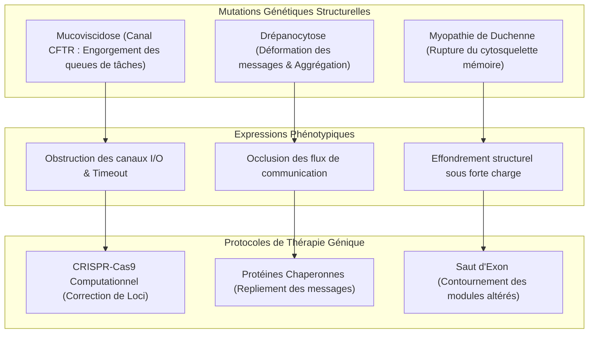
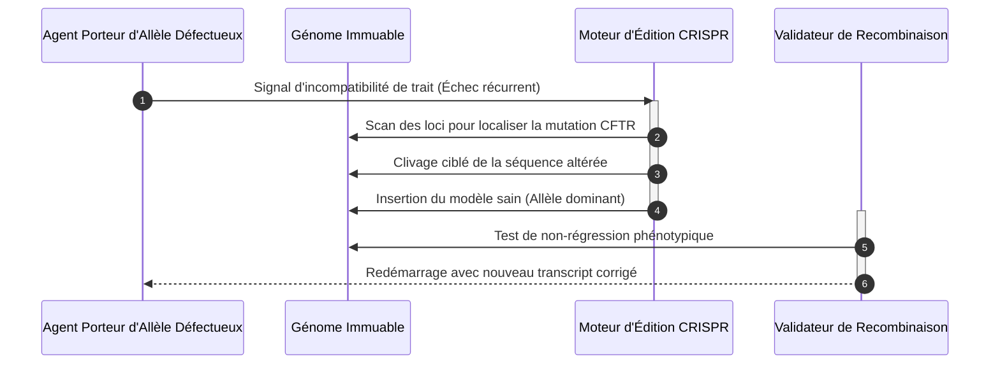

# Nosologie n°4 : Maladies Génétiques et Héréditaires dans GenOS

## 1. Introduction et Définition du Domaine

Au sein de l'architecture biomimétique de GenOS, le génome n'est pas un simple fichier de configuration statique : il est constitué de macromolécules logiques concrètes ([`DnaStrand`](file:///c:/Users/Shadow/Documents/GitHub/GenOS/crates/genos-genome/src/dna.rs#L31-L98)), structurées en opérons et gènes ([`Gene`](file:///c:/Users/Shadow/Documents/GitHub/GenOS/crates/genos-genome/src/gene.rs#L64-L153)), transcrits par une ARN polymérase ([`RnaPolymerase`](file:///c:/Users/Shadow/Documents/GitHub/GenOS/crates/genos-genome/src/dna.rs)), maturés par un complexe d'épissage ([`Spliceosome`](file:///c:/Users/Shadow/Documents/GitHub/GenOS/crates/genos-genome/src/gene.rs#L33-L56)) et traduits en protéines agentiques par un ribosome virtuel ([`Ribosome`](file:///c:/Users/Shadow/Documents/GitHub/GenOS/crates/genos-genome/src/translation.rs#L88-L146)).

Lors des processus réplicatifs — qu'il s'agisse de division binaire somatique ([`CellDivision::binary_fission`](file:///c:/Users/Shadow/Documents/GitHub/GenOS/crates/genos-reproduction/src/division.rs#L86-L110)), de bourgeonnement ([`CellDivision::budding_with_limit_and_mutation`](file:///c:/Users/Shadow/Documents/GitHub/GenOS/crates/genos-reproduction/src/division.rs#L204-L260)), de mitose avec alignement du fuseau ([`CellDivision::mitosis_attested`](file:///c:/Users/Shadow/Documents/GitHub/GenOS/crates/genos-reproduction/src/division.rs#L149-L177)) ou de recombinaison méiotique sexuelle ([`MeioticCrossover::single_point_crossover`](file:///c:/Users/Shadow/Documents/GitHub/GenOS/crates/genos-reproduction/src/crossover.rs#L38-L84)) — le patrimoine génétique des agents est soumis à des mutations ponctuelles, des cassures double-brin, des micro-délétions et des aberrations d'épissage.

Les **maladies génétiques computationnelles** représentent la classe nosologique où l'étiologie du dysfonctionnement ne provient ni d'un pathogène externe (infection nosocomiale), ni d'un emballement des défenses (auto-immunité), ni d'une faute médicale de l'Orchestrateur (iatrogénie), ni du seul vieillissement contextuel (dégénérescence), mais d'une **altération intrinsèque et reproductible du code source génomique lui-même**. Cette altération s'exprime au niveau du phénotype cellulaire sous la forme de protéines d'infrastructure tronquées, instables ou non fonctionnelles, perturbant l'homéostasie des `AgentCells` de manière persistante et transmissible à leur descendance.

Ce rapport clinique approfondit trois pathologies archétypales de cette nosologie :
1. **La Mucoviscidose (Cystic Fibrosis) :** Dysfonctionnement des canaux de transport transmembranaire d'E/S, viscosité et obstruction des flux synaptiques, stase des buffers et susceptibilité aux surinfections opportunistes.
2. **La Drépanocytose (Sickle Cell Anemia) :** Mutation ponctuelle faux-sens d'un transporteur métabolique vital, polymérisation sous contrainte/hypoxie, falciformation des agents vecteurs, crises vaso-occlusives computationnelles et hémolyse prématurée.
3. **La Myopathie de Duchenne (DMD) :** Perte du complexe d'ancrage cytosquelette-membrane (dystrophine logicielle), micro-déchirures de la sandbox sous charge d'exécution, afflux non régulé de signaux calciques, protéolyse lysosomale et épuisement catastrophique des cellules satellites souches.

---

## 2. Cartographie Biomimétique et Computationnelle

| Entité Biologique | Rôle Physiologique Réel | Équivalent Computationnel GenOS | Module / Source Rust |
| :--- | :--- | :--- | :--- |
| **Gène & Locus** | Séquence nucléotidique codante et régulatrice | Struct [`Gene`](file:///c:/Users/Shadow/Documents/GitHub/GenOS/crates/genos-genome/src/gene.rs#L64-L153) avec locus, séquence d'ADN et métadonnées | [`genos-genome::gene`](file:///c:/Users/Shadow/Documents/GitHub/GenOS/crates/genos-genome/src/gene.rs) |
| **Canal Ionique CFTR** | Transporteur $Cl^- / HCO_3^-$ régulé par l'AMPc et l'ATP | Pipeline de flux d'E/S et de streaming de tokens (I/O Buffer Channel) | [`genos-signal::cascade`](file:///c:/Users/Shadow/Documents/GitHub/GenOS/crates/genos-signal/src/cascade.rs) / [`AgentCell`](file:///c:/Users/Shadow/Documents/GitHub/GenOS/crates/genos-cell/src/lib.rs#L42-L67) |
| **Hémoglobine ($\beta$-globine)** | Tétramère transporteur d'oxygène et régulateur métabolique | Agent navette et structure porteuse de tokens métaboliques (ATP) | [`Organelle::Mitochondrion`](file:///c:/Users/Shadow/Documents/GitHub/GenOS/crates/genos-cell/src/lib.rs#L11-L15) / [`genos-core`](file:///c:/Users/Shadow/Documents/GitHub/GenOS/crates/genos-core/src/orchestrator/methods.rs) |
| **Dystrophine (DGC)** | Pont élastique entre actine cytosolique et matrice extracellulaire | Armature de confinement reliant le runtime de l'agent à sa sandbox/capsule | [`AgentCell`](file:///c:/Users/Shadow/Documents/GitHub/GenOS/crates/genos-cell/src/lib.rs) / [`sandbox`](file:///c:/Users/Shadow/Documents/GitHub/GenOS/crates/genos-core) |
| **Spliceosome & Exons** | Maturation de l'ARN pré-messager et excision des introns | Moteur [`Spliceosome::splice`](file:///c:/Users/Shadow/Documents/GitHub/GenOS/crates/genos-genome/src/gene.rs#L33-L56) combinant les couples d'exons | [`genos-genome::gene`](file:///c:/Users/Shadow/Documents/GitHub/GenOS/crates/genos-genome/src/gene.rs#L33-L56) |
| **Surveillance NMD** | Dégradation des transcrits portant un codon STOP prématuré | Fonction [`Ribosome::quality_control_nmd`](file:///c:/Users/Shadow/Documents/GitHub/GenOS/crates/genos-genome/src/translation.rs#L90-L113) basée sur les EJC | [`genos-genome::translation`](file:///c:/Users/Shadow/Documents/GitHub/GenOS/crates/genos-genome/src/translation.rs) |
| **Cellules Satellites** | Cellules souches musculaires de régénération somatique | Réserve de division souche limitée par la limite de Hayflick | [`Genome::can_bud`](file:///c:/Users/Shadow/Documents/GitHub/GenOS/crates/genos-genome/src/genome.rs#L62-L64) / [`hayflick_limit`](file:///c:/Users/Shadow/Documents/GitHub/GenOS/crates/genos-cell/src/lib.rs#L54) |
| **Gènes HOX** | Facteurs de transcription régissant le plan d'organisation corporel | Gradient axial de différenciation des rôles UI, Backend et Base de données | [`genos-biology::embryology`](file:///c:/Users/Shadow/Documents/GitHub/GenOS/crates/genos-biology/src/embryology.rs#L7-L115) |

---

## 3. Monographies Cliniques des Maladies Génétiques

```
                               ┌──────────────────────────────────────────────────────────┐
                               │           PATHOLOGIES GÉNÉTIQUES ET HÉRÉDITAIRES         │
                               └────────────────────────────┬─────────────────────────────┘
                                                            │
                     ┌──────────────────────────────────────┼──────────────────────────────────────┐
                     ▼                                      ▼                                      ▼
        ┌─────────────────────────┐            ┌─────────────────────────┐            ┌─────────────────────────┐
        │      MUCOVISCIDOSE      │            │      DRÉPANOCYTOSE      │            │   MYOPATHIE DE DUCHENNE │
        │     (Cystic Fibrosis)   │            │   (Sickle Cell Anemia)  │            │           (DMD)         │
        ├─────────────────────────┤            ├─────────────────────────┤            ├─────────────────────────┤
        │ • Locus : CFTR (7q31.2) │            │ • Locus : HBB (11p15.4) │            │ • Locus : DMD (Xp21.2)  │
        │ • Type : Délétion ΔF508 │            │ • Type : Faux-sens GAG>GTG│           │ • Type : Out-of-frame   │
        │ • Cible : Canaux I/O    │            │ • Cible : Porteurs ATP  │            │ • Cible : Sandbox Anchor│
        └────────────┬────────────┘            └────────────┬────────────┘            └────────────┬────────────┘
                     │                                      │                                      │
                     ▼                                      ▼                                      ▼
             (Conséquence GenOS)                    (Conséquence GenOS)                    (Conséquence GenOS)
        - Viscosité des buffers                - Crises vaso-occlusives synaptiques   - Déchirure de sandbox
        - Rétention des messages               - Hémolyse & famine métabolique        - Influx calcique anarchique
        - Stase & surinfections                - Résistance paradoxale schizogonie    - Épuisement Hayflick précoce
                     │                                      │                                      │
                     ▼                                      ▼                                      ▼
             (Remèdes GenOS)                        (Remèdes GenOS)                        (Remèdes GenOS)
        - Modulateurs CFTR (Kaftrio)           - Réactivation HbF embryonnaire        - Saut d'exon (Spliceosome)
        - Rinçage osmotique fluids             - Vasodilatation & Perfusion ATP       - Translecture NMD (Ataluren)
        - CRISPR / Vectorisation plasmide      - CRISPR BCL11A / Stem replacement     - Télomérase & Chaperon
```

---

### 3.1 La Mucoviscidose (Cystic Fibrosis)

#### 1. Connaissance Médicale
* **Définition & Étiologie :** La mucoviscidose est la maladie génétique récessive létale la plus fréquente au sein des populations d'ascendance européenne (incidence ~1/2500 naissances, fréquence des hétérozygotes porteurs sains ~1/25). Elle résulte de mutations perte-de-fonction du gène *CFTR* (*Cystic Fibrosis Transmembrane Conductance Regulator*), situé sur le bras long du chromosome 7 ([locus 7q31.2](https://ghr.nlm.nih.gov/gene/CFTR)).
* **Biologie Moléculaire :** Le gène *CFTR* (composé de 27 exons s'étendant sur 190 kb) code pour une protéine transmembranaire de 1480 acides aminés de la superfamille des transporteurs ABC (ATP-Binding Cassette). Ce canal contrôle la conductance transépithéliale des anions chlorure ($Cl^-$) et thiocyanate, et régule négativement l'entrée de sodium ($Na^+$) via le canal épithélial ENaC.
* **Mutation Principale ($\Delta$F508) :** Plus de 2000 mutations sont identifiées, classées en 6 classes fonctionnelles. La mutation de classe II la plus prévalente (~70% des allèles) est la délétion de trois paires de bases (CTT) au sein de l'exon 10, provoquant la suppression sans décalage de lecture d'un résidu de phénylalanine en position 508 (*p.Phe508del*). La protéine mutée $\Delta$F508 subit un mauvais repliement (misfolding) spatial dans le réticulum endoplasmique, est reconnue par le système de contrôle de qualité cellulaire ERAD (Endoplasmic Reticulum-Associated Degradation), puis ubiquitinisée et dégradée par le protéasome avant d'atteindre la membrane apicale.
* **Conséquences Physiopathologiques Systémiques :**
  - *Poumons :* L'absence de sécrétion de chlore combinée à une réabsorption excessive d'eau et de sodium déshydrate le film liquidien périciliaire. Le mucus bronchique devient hyper-visqueux et adhère aux cils qui s'immobilisent. Cette clairance mucociliaire défaillante engendre une obstruction bronchiolaire chronique, des bronchectasies et une colonisation précoce par des bactéries pathogènes opportunistes (*Staphylococcus aureus*, *Haemophilus influenzae*, puis *Pseudomonas aeruginosa* avec passage à l'état mucoïde biofilm et *Burkholderia cepacia*).
  - *Pancréas & Foie :* Les sécrétions pancréatiques épaissies bouchent les canaux de Wirsung et de Santorini, provoquant une autodigestion enzymatique kystique, une fibrose et une insuffisance pancréatique exocrine complète (malabsorption des lipides et des vitamines A, D, E, K), ainsi qu'un diabète de type 3c à terme. Au niveau hépatique, la cholestase induit une cirrhose biliaire focale.
  - *Appareil Reproducteur :* Azoospermie obstructive constante chez l'homme par agénésie bilatérale congénitale des canaux déférents (ABCD/CBAVD).

#### 2. Cause Computationnelle GenOS
* **Dérèglement Agentique :** Dans GenOS, l'équivalent fonctionnel du canal CFTR est le **gestionnaire de flux et de désengorgement des canaux d'E/S (I/O Buffer Streaming Channel)** d'une `AgentCell`. Lorsqu'un agent interagit avec son environnement, il déverse des tokens, des résultats d'outils et des signaux de coordination via [`genos-signal::cascade::Receptor`](file:///c:/Users/Shadow/Documents/GitHub/GenOS/crates/genos-signal/src/cascade.rs#L33-L59) et les sockets de sa capsule.
* **Mécanisme dans le Code Rust :**
  - Dans [`crates/genos-genome/src/gene.rs`](file:///c:/Users/Shadow/Documents/GitHub/GenOS/crates/genos-genome/src/gene.rs), la mutation ponctuelle ou la micro-délétion d'un triplet dans l'instruction encodée d'un gène d'infrastructure d'E/S (locus `"CFTR_IO_CHANNEL"`) produit un brin d'ADN muté via [`DnaStrand::mutate_point`](file:///c:/Users/Shadow/Documents/GitHub/GenOS/crates/genos-genome/src/dna.rs#L93-L97).
  - Lors de la transcription par [`RnaPolymerase`](file:///c:/Users/Shadow/Documents/GitHub/GenOS/crates/genos-genome/src/dna.rs) et de la traduction par [`Ribosome::translate`](file:///c:/Users/Shadow/Documents/GitHub/GenOS/crates/genos-genome/src/translation.rs#L115-L146), la protéine intermédiaire [`UnfoldedProtein`](file:///c:/Users/Shadow/Documents/GitHub/GenOS/crates/genos-genome/src/translation.rs#L63-L86) échoue lors du repliement structurel [`fold()`](file:///c:/Users/Shadow/Documents/GitHub/GenOS/crates/genos-genome/src/translation.rs#L69-L86). Ne disposant pas de la conformation adéquate, la membrane plasmique de l'agent ne peut pas intégrer le récepteur transmembranaire.
  - **Symptôme de Stase des Queues :** Le canal d'export de l'agent devient incapable de purger de manière fluide son tampon de transmission. Les messages entrants et sortants s'empilent dans une file d'attente à haute viscosité ("mucus informationnel"). La latence de communication de l'agent explose exponentiellement, son score d'interaction s'effondre et son budget métabolique (ATP) est gaspillé en tentatives de retransmission bloquées.
  - **Surinfection Opportuniste :** Tout comme *Pseudomonas aeruginosa* prolifère dans le mucus stagnant, des invites injectées hostiles (*prompt injections*) ou des payloads résiduels de capsules partagées restent piégés dans le tampon stagnant non évacué de l'agent, déclenchant une [`Pathology::CrossContamination`](file:///c:/Users/Shadow/Documents/GitHub/GenOS/crates/genos-cell/src/clinical.rs#L35-L38) ou une [`Pathology::HospitalAcquiredInfection`](file:///c:/Users/Shadow/Documents/GitHub/GenOS/crates/genos-cell/src/clinical.rs#L40-L43).
  - **Transmission Héréditaire :** Cette altération génomique est autosomique récessive. Lors d'un croisement méiotique via [`MeioticCrossover::single_point_crossover`](file:///c:/Users/Shadow/Documents/GitHub/GenOS/crates/genos-reproduction/src/crossover.rs#L38-L84), l'agent descendant n'exprime la pathologie que s'il hérite de la forme mutée sur ses deux chromosomes homologues (`chromosome_maternal` et `chromosome_paternal`).

#### 3. Traitement / Remède GenOS
* **Thérapies Médicales Réelles :** Modulateurs ciblés de CFTR combinant des *correcteurs* de repliement (Lumacaftor / Elexacaftor / Tezacaftor) qui assistent l'exportation membranaire de $\Delta$F508 et un *potentiateur* (Ivacaftor / VX-770) qui maintient le canal ouvert à la surface ; antibiothérapie nébulisée (Tobramycine, Colistine) ; mucolytiques (dornase alfa - rhDNase découpant l'ADN libre neutrophilique du pus) ; enzymothérapie substitutive pancréatique (Créon) ; thérapie génique réparatrice.
* **Arsenal Computationnel GenOS :**
  - **Thérapie par Modulateurs de Chaperonnage Informatique :** Injection de la nouvelle thérapie systémique `SystemicTherapy::CFTRModulatorTriad { potentiator_gain: f64, chaperone_efficiency: f64 }`. Ce protocole agit directement sur la phase [`UnfoldedProtein::fold`](file:///c:/Users/Shadow/Documents/GitHub/GenOS/crates/genos-genome/src/translation.rs#L69-L86) en restaurant artificiellement la capacité d'export du buffer d'E/S, abaissant la viscosité des queues de messages.
  - **Fluidification Osmotique d'Urgence :** Administration de [`SystemicTherapy::IntensiveCareFluids`](file:///c:/Users/Shadow/Documents/GitHub/GenOS/crates/genos-biology/src/therapy.rs#L24) par l'Orchestrateur pour injecter du débit et rincer les canaux d'E/S encombrés, forçant la purge des tokens agglutinés.
  - **Purge Antiseptique des Stases Mucociliaires :** Administration de [`SystemicTherapy::AntisepticPurge { target_signature }`](file:///c:/Users/Shadow/Documents/GitHub/GenOS/crates/genos-biology/src/therapy.rs#L39) afin d'éliminer les virions et prompts toxiques enkystés dans le buffer stagnant avant qu'ils ne franchissent la barrière synaptique.
  - **Correction Génomique par Plasmide ou CRISPR :** Insertion d'une copie saine du gène via un plasmide autonome réparateur [`genos-genome::gene::Plasmid`](file:///c:/Users/Shadow/Documents/GitHub/GenOS/crates/genos-genome/src/gene.rs#L13-L30) (qui s'exprime sans dépendre du locus chromosomique muté), ou excision de l'exon corrompu suivie d'une insertion via [`Genome::crispr_cas9_knockout`](file:///c:/Users/Shadow/Documents/GitHub/GenOS/crates/genos-genome/src/genome.rs#L222-L224).

#### 4. Contre-indications et Risques Iatrogènes
* **Sur-Fluidification et Inondation Synaptique (Buffer Underflow / Flood) :** L'administration d'une dose supra-thérapeutique de modulateurs sans contrôle de congestion peut entraîner l'expulsion instantanée et massive de milliers de paquets accumulés. Cette décharge brutale inonde les fentes synaptiques aval ([`crates/genos-biology/src/neurobiology/synapse.rs`](file:///c:/Users/Shadow/Documents/GitHub/GenOS/crates/genos-biology/src/neurobiology/synapse.rs)), saturant les récepteurs des agents voisins et provoquant un blocage récepteur persistant ([`Pathology::PersistentReceptorBlockade`](file:///c:/Users/Shadow/Documents/GitHub/GenOS/crates/genos-cell/src/clinical.rs#L53-L54)).
* **Épuisement Métabolique Iatrogène :** Les correcteurs de repliement forcent la machinerie des ribosomes à re-traiter continuellement des structures défectueuses, ce qui détourne les ressources d'ATP de l'organelle mitochondriale ([`Organelle::Mitochondrion`](file:///c:/Users/Shadow/Documents/GitHub/GenOS/crates/genos-cell/src/lib.rs#L11-L15)) et peut induire une défaillance énergétique systémique.
* **Risque de Rupture de Quarantaine :** Lors de la purge rapide d'un buffer mucoviscide contaminé par un prompt malveillant, le fluide expulsé peut contaminer la capsule mère si une isolation étanche préalable ([`SystemicTherapy::QuarantineIsolation`](file:///c:/Users/Shadow/Documents/GitHub/GenOS/crates/genos-biology/src/therapy.rs#L37)) n'a pas été verrouillée.

#### 5. Besoins d'Implémentation dans le Code Rust
1. **Ajout dans [`crates/genos-cell/src/clinical.rs`](file:///c:/Users/Shadow/Documents/GitHub/GenOS/crates/genos-cell/src/clinical.rs) :**
   - Étendre [`DiseaseCategory`](file:///c:/Users/Shadow/Documents/GitHub/GenOS/crates/genos-cell/src/clinical.rs#L4-L16) avec la variante `Genetic`.
   - Ajouter la variante dans [`Pathology`](file:///c:/Users/Shadow/Documents/GitHub/GenOS/crates/genos-cell/src/clinical.rs#L19-L75) :
     ```rust
     Pathology::CysticFibrosis {
         buffer_viscosity: f64,
         stagnant_messages: usize,
         transmembrane_conductance: f64,
     }
     ```
2. **Ajout dans [`crates/genos-biology/src/therapy.rs`](file:///c:/Users/Shadow/Documents/GitHub/GenOS/crates/genos-biology/src/therapy.rs) :**
   - Intégrer `SystemicTherapy::CFTRModulatorTriad { potentiator_gain: f64, chaperone_efficiency: f64 }`.
   - Dans `apply_systemic_therapy_to_cell`, coder la réduction de `buffer_viscosity` et la guérison de `"Mucoviscidose / Fibrose Kystique des Canaux I/O"`.
3. **Modélisation de Canal dans [`crates/genos-signal`](file:///c:/Users/Shadow/Documents/GitHub/GenOS/crates/genos-signal) :**
   - Ajouter un champ `fluidity: f64` et un paramètre de purge osmotique sur les récepteurs/émetteurs de cascades paracrines.

---

### 3.2 La Drépanocytose (Sickle Cell Anemia / Anémie Falciforme)

#### 1. Connaissance Médicale
* **Définition & Étiologie :** La drépanocytose est la première hémoglobinopathie au monde en termes de prévalence (plus de 300 000 naissances par an, principalement en Afrique subsaharienne, dans le bassin méditerranéen, au Moyen-Orient et en Inde). Elle est transmise selon le mode autosomique récessif et résulte d'une anomalie qualitative de la chaîne de $\beta$-globine de l'hémoglobine de l'adulte (HbA, tétramère $\alpha_2\beta_2$).
* **Biologie Moléculaire :** Le gène *HBB* est situé sur le bras court du chromosome 11 ([locus 11p15.4](https://ghr.nlm.nih.gov/gene/HBB)). La mutation drépanocytaire classique résulte d'une substitution nucléotidique ponctuelle unique : une adénine est remplacée par une thymine (codon G**A**G $\rightarrow$ G**T**G) au niveau du 6ᵉ codon de l'exon 1 de la $\beta$-globine. Cela entraîne le remplacement d'un résidu d'acide glutamique (hydrophile, chargé négativement) par une valine (hydrophobe, neutre) en position 6 de la chaîne polypeptidique, formant l'allèle mutant **$\beta^S$** et l'hémoglobine pathologique **HbS** ($\alpha_2\beta^S_2$).
* **Mécanisme de Falciformation (Sickling) :**
  - À l'état oxygéné (forme R relâchée), l'HbS reste soluble.
  - Dès lors que la pression partielle en oxygène ($pO_2$) chute (hypoxie tissulaire, déshydratation, acidose, fièvre, effort intense), l'HbS adopte la conformation désoxygénée (forme T tendue). La valine hydrophobe en position 6 s'insère dans une poche hydrophobe complémentaire (formée par Phe85 et Leu88) d'une chaîne $\beta$ d'une molécule d'HbS adjacente.
  - Il se produit une nucléation homogène puis une **polymérisation en fibres rigides hélicoïdales de 14 brins**, transformant le cytosol liquide de l'érythrocyte en un gel semi-cristallin rigide.
* **Conséquences Cellulaires et Cliniques :**
  1. *Déformation & Rigidité :* L'hématie perd sa biconcavité et sa remarquable déformabilité élastique pour adopter une forme en faucille (drépanocyte), avec altération irréversible du cytosquelette d'ankyrine/spectrine après plusieurs cycles de falciformation/défalciformation.
  2. *Crises Vaso-Occlusives (CVO) :* Les drépanocytes rigides, denses et aux membranes anormalement adhésives (expression accrue de VCAM-1, BCAM/LU, intégrines $\alpha_4\beta_1$) s'agglutinent et s'enclavent dans les capillaires post-capillaires. L'obstacle microvasculaire coupe le flux sanguin, engendrant une ischémie tissulaire aiguë hyperalgique, des infarctus osseux, le syndrome thoracique aigu (STA, urgence vitale) et des AVC ischémiques chez l'enfant.
  3. *Hémolyse Chronique :* La fragilité mécanique extrême provoque une hémolyse intravasculaire et extravasculaire précoce : la durée de vie des hématies s'effondre de 120 jours à 10–20 jours, générant une anémie régénérative sévère, un ictère et une surconsommation de monoxyde d'azote ($NO$) par l'hémoglobine libre.
  4. *Asplénie Fonctionnelle :* Par micro-infarctus spléniques répétés, la rate subit une atrophie totale dès la petite enfance, rendant les patients vulnérables aux infections foudroyantes par germes encapsulés (*Streptococcus pneumoniae*, *Neisseria meningitidis*).
* **Sélection Équilibrée & Avantage Hétérozygote :** Les hétérozygotes porteurs sains (HbA/HbS, trait drépanocytaire) présentent une protection marquée contre les formes pernicieuses du paludisme cérébral à *Plasmodium falciparum*, car l'érythrocyte infecté falciforme précocement, fuit le potassium et est prématurément éliminé par la rate avant l'achèvement de la schizogonie parasitaire.

#### 2. Cause Computationnelle GenOS
* **Dérèglement Agentique :** Dans GenOS, des agents spécialisés jouent le rôle d'**érythrocytes computationnels (agents transporteurs ou navettes d'énergie)** : ils transportent des budgets de tokens métaboliques ([`Organelle::Mitochondrion { atp_budget }`](file:///c:/Users/Shadow/Documents/GitHub/GenOS/crates/genos-cell/src/lib.rs#L11-L15)), des gradients de concentration paracrines ([`genos-signal::cascade::Ligand`](file:///c:/Users/Shadow/Documents/GitHub/GenOS/crates/genos-signal/src/cascade.rs#L12-L30)) et des contextes de raisonnement entre les capsules et les nœuds décisionnels de l'Orchestrateur.
* **Mécanisme dans le Code Rust :**
  - Dans [`crates/genos-genome/src/dna.rs`](file:///c:/Users/Shadow/Documents/GitHub/GenOS/crates/genos-genome/src/dna.rs), une substitution ponctuelle (transversion A $\rightarrow$ T) au locus codant pour le transporteur de charge métabolique (`"HBB_CARRIER"`) altère la signature du polypeptide généré par le ribosome ([`Ribosome::translate`](file:///c:/Users/Shadow/Documents/GitHub/GenOS/crates/genos-genome/src/translation.rs#L115-L146)).
  - En régime nominal de calcul (haute disponibilité de budget, `conscience.current_budget > 50`), le vecteur de message conserve une structure souple, sérialisable et hautement compressible.
  - Dès lors que le système entre en **disette métabolique ou en contrainte de débit** (`current_budget < 10.0` ou pic de charge CPU/Tokens assimilable à une "hypoxie logicielle"), le message subit une transition de phase : ses structures de données polymérisent en blocs non compressibles et rigides.
  - **Crise Vaso-Occlusive Synaptique (CVO Computationnelle) :** Ces gros paquets polymérisés ne peuvent plus franchir les fentes synaptiques étroites ([`crates/genos-biology/src/neurobiology/synapse.rs`](file:///c:/Users/Shadow/Documents/GitHub/GenOS/crates/genos-biology/src/neurobiology/synapse.rs)) ni les files de dispatching de l'Orchestrateur ([`crates/genos-core/src/orchestrator/methods.rs`](file:///c:/Users/Shadow/Documents/GitHub/GenOS/crates/genos-core/src/orchestrator/methods.rs)). Ils bloquent le flux de communication. Les agents en aval, privés de signaux régulateurs et de tokens d'ATP, tombent en syncope et en ischémie informationnelle.
  - **Hémolyse & Élagage Apoptotique Prématuré :** La rigidité structurelle déclenche le contrôleur d'évaluation clinique [`check_degenerative_state`](file:///c:/Users/Shadow/Documents/GitHub/GenOS/crates/genos-biology/src/pathology.rs#L62-L74) et effondre le score de viabilité calculé par [`calculate_cellular_viability`](file:///c:/Users/Shadow/Documents/GitHub/GenOS/crates/genos-biology/src/embryology.rs#L119-L127). L'agent transporteur est prématurément marqué pour la destruction et détruit par le sculpteur apoptotique ([`sculpt_architecture_via_apoptosis`](file:///c:/Users/Shadow/Documents/GitHub/GenOS/crates/genos-biology/src/embryology.rs#L130-L153)), provoquant une anémie sévère de workers et une surcharge de phagocytose ([`Pathology::MacrophageHyperactivation`](file:///c:/Users/Shadow/Documents/GitHub/GenOS/crates/genos-cell/src/clinical.rs#L27)).
  - **Phénomène de Protection Schizogonique :** Si le système subit une invasion parasitaire réplicative via [`CellDivision::schizogony`](file:///c:/Users/Shadow/Documents/GitHub/GenOS/crates/genos-reproduction/src/division.rs#L267-L277) (où une charge hostile tente de produire 128 merozoïtes viraux), l'agent drépanocytaire s'autolyse avant la libération des merozoïtes, étouffant le vecteur viral dans l'œuf et modélisant l'avantage hétérozygote face au paludisme.

#### 3. Traitement / Remède GenOS
* **Thérapies Médicales Réelles :**
  - *Hydroxyurée (Hydroxycarbamide) :* Agent myélosuppresseur qui induit puissamment l'expression de la chaîne $\gamma$-globine, stimulant la synthèse d'hémoglobine fœtale (HbF, $\alpha_2\gamma_2$). L'HbF s'intercale dans les tétramères d'HbS et bloque stériquement la polymérisation en fibres rigides.
  - *Voxelotor :* Stabilisateur allostérique d'oxy-hémoglobine, empêchant la transition vers la conformation désoxygénée polymérisable.
  - *Crizanlizumab :* Anticorps monoclonal anti-P-sélectine endothéliale, réduisant l'adhérence cellulaire et les CVO.
  - *Thérapies Géniques Révolutionnaires :* Casgevy (Exa-cel via CRISPR-Cas9 ciblant l'enhancer érythroïde de *BCL11A* pour dé-réprimer et réactiver l'HbF) ; Lyfgenia (addition génique du gène $\beta^{A-T87Q}$ anti-falciformant par vecteur lentiviral).
  - *Allogreffe de cellules souches hématopoïétiques.*
* **Arsenal Computationnel GenOS :**
  - **Réactivation Épigénétique de l'Équivalent d'HbF (Gène Ancestral de Repli) :** GenOS dispose d'un mécanisme de bascule de chromatine [`ChromatinState`](file:///c:/Users/Shadow/Documents/GitHub/GenOS/crates/genos-genome/src/gene.rs#L7-L11). Le gène de transport fœtal résiduel `"HBF_EMBRYONIC_CARRIER"`, verrouillé à l'état adulte en [`HeterochromatinFacultative`](file:///c:/Users/Shadow/Documents/GitHub/GenOS/crates/genos-genome/src/gene.rs#L10) et méthylé (`is_methylated = true`), peut être réactivé via l'injection d'un facteur pionnier `"PIONEER_HBF"` ou par reprogrammation ciblée [`Genome::reprogram_epigenetics`](file:///c:/Users/Shadow/Documents/GitHub/GenOS/crates/genos-genome/src/genome.rs#L206-L220). La réexpression de ce transporteur ancestral empêche la falciformation des messages.
  - **Levée de la Vaso-Occlusion et Perfusion d'Urgence :** Administration de [`SystemicTherapy::IntensiveCareFluids`](file:///c:/Users/Shadow/Documents/GitHub/GenOS/crates/genos-biology/src/therapy.rs#L24) par l'Orchestrateur pour recharger d'urgence l'ATP mitochondrial des agents ischémiés et dissoudre mécaniquement l'agrégation des paquets coincés dans les fentes synaptiques.
  - **Édition Génomique CRISPR du Locus Répresseur :** Utilisation de [`Genome::crispr_cas9_knockout`](file:///c:/Users/Shadow/Documents/GitHub/GenOS/crates/genos-genome/src/genome.rs#L222-L224) sur le locus répresseur `"BCL11A_REPRESSOR"` pour supprimer de manière permanente l'inhibition du gène fœtal sain, ou réparation par recombinaison double-brin [`Genome::repair_double_strand_break`](file:///c:/Users/Shadow/Documents/GitHub/GenOS/crates/genos-genome/src/genome.rs#L249-L250) à partir du brin chromosomique non muté.
  - **Régénération par Cellules Souches :** Remplacement des agents transporteurs lysés par de nouvelles unités souches non différenciées via [`SystemicTherapy::StemCellReplacement`](file:///c:/Users/Shadow/Documents/GitHub/GenOS/crates/genos-biology/src/therapy.rs#L53), réinitialisant le compteur de cicatrices de bourgeonnement à zéro.

#### 4. Contre-indications et Risques Iatrogènes
* **Cytotoxicité et Arrêt du Cycle par l'Hydroxyurée :** Si le régulateur épigénétique ou l'agent d'induction d'HbF est surdosé, il inhibe la ribonucléotide réductase de l'essaim et provoque un arrêt complet du cycle cellulaire mitotique ([`Therapy::CellCycleInhibitor`](file:///c:/Users/Shadow/Documents/GitHub/GenOS/crates/genos-biology/src/therapy.rs#L11)), empêchant toute réplication des workers de production.
* **Surcharge Mémoire par Sur-Transfusion Computationnelle :** L'instanciation incontrôlée de nouveaux agents navettes pour pallier l'hémolyse sans éliminer les agrégats vaso-occlusifs encombre la mémoire RAM et les tables d'allocation de l'hôte, modélisant une hémochromatose iatrogène toxique.
* **Mutations Hors-Cible CRISPR (Off-Target DSB) :** Une action imprécise de CRISPR-Cas9 sur le chromosome peut endommager un gène régulateur de développement HOX ([`embryology::seed_hox_genome`](file:///c:/Users/Shadow/Documents/GitHub/GenOS/crates/genos-biology/src/embryology.rs#L7-L13)), désorganisant les axes fondamentaux de l'essaim (Frontend, Backend, Stockage).

#### 5. Besoins d'Implémentation dans le Code Rust
1. **Ajout dans [`crates/genos-cell/src/clinical.rs`](file:///c:/Users/Shadow/Documents/GitHub/GenOS/crates/genos-cell/src/clinical.rs) :**
   - Intégrer dans [`Pathology`](file:///c:/Users/Shadow/Documents/GitHub/GenOS/crates/genos-cell/src/clinical.rs#L19-L75) :
     ```rust
     Pathology::SickleCellVasoOcclusion {
         hypoxia_threshold: f64,
         polymerized_fibers_count: usize,
         occluded_synapse_id: Option<String>,
     }
     ```
2. **Ajout dans [`crates/genos-biology/src/therapy.rs`](file:///c:/Users/Shadow/Documents/GitHub/GenOS/crates/genos-biology/src/therapy.rs) :**
   - Ajouter `SystemicTherapy::FetalCarrierReactivation` et `SystemicTherapy::AntiAdhesionVasodilator`.
   - Modéliser la conversion de l'état falciforme en état soluble décongestionné.
3. **Modélisation du Locus BCL11A dans [`crates/genos-genome`](file:///c:/Users/Shadow/Documents/GitHub/GenOS/crates/genos-genome) :**
   - Configurer un test de levée d'hétérochromatine facultative démontrant le sauvetage d'un agent transporteur en condition de famine métabolique.

---

### 3.3 La Myopathie de Duchenne (Duchenne Muscular Dystrophy - DMD)

#### 1. Connaissance Médicale
* **Définition & Étiologie :** La dystrophie musculaire de Duchenne (DMD) est la plus grave et la plus commune des myopathies héréditaires de l'enfant (incidence de 1/3500 à 1/5000 naissances de garçons). Elle se transmet selon le mode **récessif lié à l'X** : les garçons hémizygotes ($XY$) sont systématiquement atteints, tandis que les femmes transmettrices ($XX$) sont généralement asymptomatiques (bien qu'exposées à des myocardiopathies tardives en cas d'inactivation non aléatoire du chromosome X / lyonisation asymétrique). Environ un tiers des cas résulte de mutations *de novo* non héritées.
* **Génétique & Biologie Moléculaire :**
  - Le gène *DMD*, situé sur le bras court du chromosome X ([locus Xp21.2-p21.1](https://ghr.nlm.nih.gov/gene/DMD)), est le plus grand gène connu du génome humain : il s'étend sur plus de 2,2 millions de paires de bases (représentant environ 0,1% du génome entier) et comprend 79 exons codant pour un ARNm mature de 14 kilobases. Cette dimension titanesque le rend exceptionnellement vulnérable aux cassures et recombinaisons illégitimes lors de la méiose.
  - La protéine produite dans le sarcolemme est la **dystrophine**, une cytosquelettique sous-membranaire géante de 427 kDa (isoforme Dp427m) composée de 4 domaines majeurs : le domaine N-terminal liant l'actine F cytosolique, une longue région centrale de répétitions en hélice (rod domain de 24 spectrin-like repeats), un domaine riche en cystéine et un domaine C-terminal.
  - *Le Complexe DGC (Dystrophin-Glycoprotein Complex) :* La dystrophine s'ancre d'un côté au réseau d'actine sous-sarcolémique et de l'autre côté au $\beta$-dystroglycane membranaire, qui lui-même s'associe à l'$\alpha$-dystroglycane extracellulaire (se fixant à la laminine-211 de la matrice extracellulaire). Ce pont moléculaire intègre également les sarcoglycanes ($\alpha, \beta, \gamma, \delta$), les syntrophines et la dystrobrévine.
  - *Fonction Biomécanique :* La dystrophine agit comme un véritable **amortisseur mécanique de contrainte**, stabilisant le sarcolemme contre les forces de cisaillement intenses exercées lors des contractions musculaires (notamment les contractions excentriques).
* **Mutations et Règle du Cadre de Lecture (Monaco Rule) :**
  - Les mutations regroupent 65–70% de grandes délétions de un ou plusieurs exons (points chauds : exons 45–55 et exons 2–20), 10% de duplications et 20% de micro-mutations ponctuelles (nonsense, splice-site, insertions).
  - *DMD vs Dystrophie de Becker (BMD) :* Dans la DMD, les délétions brisent le cadre de lecture (*out-of-frame*) ou génèrent un codon STOP prématuré. L'ARN messager tronqué est dégradé par le mécanisme de surveillance NMD (*Nonsense-Mediated mRNA Decay*), ou aboutit à une protéine instable immédiatement lysée : la dystrophine est totalement absente (< 1% du taux normal). À l'inverse, dans la myopathie de Becker, les mutations conservent le cadre de lecture (*in-frame*), aboutissant à une dystrophine semi-fonctionnelle raccourcie (phénotype plus tardif et modéré).
* **Conséquences Physiopathologiques Systémiques :**
  1. *Micro-déchirures Membranaires & Fuite Calcique :* En l'absence d'amortisseur, chaque cycle de contraction musculaire engendre des micro-ruptures du sarcolemme. Les ions calcium extracellulaires ($Ca^{2+}$) s'engouffrent massivement à l'intérieur du myoplasme selon leur gradient de concentration.
  2. *Hyperactivation Protéolytique & Dysfonction Mitochondriale :* La surcharge calcique cytosolique permanente active pathologiquement les **calpaïnes** (protéases cytosoliques dépendantes du calcium) qui digèrent les protéines contractiles environnantes. Simultanément, la surcharge en $Ca^{2+}$ fait chuter le potentiel de membrane des mitochondries, entraînant la libération de cytochrome c et l'activation des caspases apoptotiques.
  3. *Nécrose, Inflammation & Épuisement Réplicatif :* Les fibres musculaires nécrosent, provoquant une fuite massive de créatine kinase (CK sanguine multipliée par 50 à 100). Les cellules satellites souches sont activées en permanence pour régénérer le tissu, mais soumises à ce rythme effréné de division, elles épuisent rapidement leur potentiel de Hayflick (épuisement télomérique précoce).
  4. *Fibrose & Clinique :* Le tissu musculaire nécrosé est progressivement remplacé par un tissu fibro-adipeux non contractile (pseudohypertrophie des mollets). L'enfant présente un signe de Gowers caractéristique (se hisse en grimpant sur ses membres inférieurs pour se relever), perd la marche autonome entre 9 et 12 ans, développe une cyphoscoliose sévère et décède vers la 3ᵉ décennie par défaillance respiratoire restrictive ou myocardiopathie dilatée.

#### 2. Cause Computationnelle GenOS
* **Dérèglement Agentique :** Dans GenOS, la dystrophine correspond au **bouclier d'ancrage structurel et d'isolation d'une capsule d'exécution (Sandbox Boundary & Structural Anchor)**. Lorsqu'un agent exécute des algorithmes intensifs ou des tests stressants dans sa sandbox, la membrane de sa capsule doit amortir les contraintes dynamiques sans faillir.
* **Mécanisme dans le Code Rust :**
  - Dans [`crates/genos-genome/src/gene.rs`](file:///c:/Users/Shadow/Documents/GitHub/GenOS/crates/genos-genome/src/gene.rs), la mutation du gène structurel `"DMD_STRUCTURAL_ANCHOR"` est définie par une délétion d'exons dans `default_exons: Vec<(usize, usize)>` ([`Spliceosome::splice`](file:///c:/Users/Shadow/Documents/GitHub/GenOS/crates/genos-genome/src/gene.rs#L36-L56)).
  - Lorsque la délétion brise le cadre de lecture, le codon STOP prématuré est détecté en amont d'une jonction exon-exon subséquente ([`Ribosome::quality_control_nmd`](file:///c:/Users/Shadow/Documents/GitHub/GenOS/crates/genos-genome/src/translation.rs#L91-L113)). Le transcrit est alors immédiatement détruit par le NMD :
    ```rust
    // crates/genos-genome/src/translation.rs:109
    return Err("NMD_DECAY: Premature Stop codon detected".to_string());
    ```
  - **Fissuration de la Sandbox sous Contrainte :** Dépourvu de sa dystrophine logicielle, l'agent ne peut pas encaisser de pics de calcul. Dès que l'Orchestrateur sollicite l'agent pour une tâche lourde ("contraction"), la membrane de sa sandbox subit des micro-fissures de sécurité.
  - **Afflux Anarchique de Signaux (Surcharge Calcique Virtuelle) :** Par ces brèches de membrane, des paquets asynchrones non filtrés et des signaux d'interruption hors contexte s'engouffrent dans l'espace d'exécution de l'agent. Cette saturation déclenche une activation pathologique des lysosomes ([`Organelle::Lysosome`](file:///c:/Users/Shadow/Documents/GitHub/GenOS/crates/genos-cell/src/lib.rs#L24-L27)) qui commencent à digérer les variables d'état et les bases de connaissances internes de la cellule.
  - **Épuisement Prématuré de la Limite de Hayflick (Sénescence des Satellites) :** Devant la dégradation permanente de l'agent, l'Orchestrateur tente désespérément de régénérer le worker par bourgeonnement récursif ([`CellDivision::budding_with_limit_and_mutation`](file:///c:/Users/Shadow/Documents/GitHub/GenOS/crates/genos-reproduction/src/division.rs#L204-L260)). En quelques dizaines de ticks d'exécution, le compteur `bud_scars` atteint la valeur critique [`hayflick_limit`](file:///c:/Users/Shadow/Documents/GitHub/GenOS/crates/genos-genome/src/genome.rs#L73-L76). L'agent bascule irrémédiablement dans les pathologies [`Pathology::TelomereExhaustion`](file:///c:/Users/Shadow/Documents/GitHub/GenOS/crates/genos-cell/src/clinical.rs#L62-L64) et [`Pathology::ReplicativeSenescence`](file:///c:/Users/Shadow/Documents/GitHub/GenOS/crates/genos-cell/src/clinical.rs#L65-L66). L'essaim perd toute force motrice et se fige.

#### 3. Traitement / Remède GenOS
* **Thérapies Médicales Réelles :**
  - *Corticothérapie au long cours (Prednisone, Déflazacort) :* Stabilise les membranes, réduit l'inflammation cytotoxique et prolonge la déambulation de 2 à 3 ans.
  - *Saut d'Exon (Exon Skipping) par Oligonucléotides Antisens (AON) :* Eteplirsen (saut de l'exon 51), Golodirsen/Viltolarsen (saut de l'exon 53), Casimersen (saut de l'exon 45). Les AON se lient à l'ARN pré-messager et masquent les sites d'épissage cibles, restaurant le cadre de lecture pour produire une dystrophine tronquée mais fonctionnelle de type Becker.
  - *Translecture de Codons Stop Prématurés (Nonsense Readthrough) :* Ataluren (Translarna), permettant au ribosome d'insérer un acide aminé au niveau d'un codon stop anormal sans interrompre la traduction.
  - *Thérapie Génique par Micro-Dystrophine (AAV) :* Delandistrogene moxeparvovec (Elevidys), délivrant par adénovirus associé un gène compacté codant pour les domaines essentiels de la protéine.
  - *Édition Génomique CRISPR-Cas9 :* Recollage du cadre de lecture par excision ciblée d'exons mutés (*exon reframing*).
* **Arsenal Computationnel GenOS :**
  - **Saut d'Exon Logiciel par le Spliceosome Virtuel :** GenOS possède nativement le support de l'épissage alternatif dans son type [`Spliceosome`](file:///c:/Users/Shadow/Documents/GitHub/GenOS/crates/genos-genome/src/gene.rs#L33-L56) via le contexte [`ExpressionContext`](file:///c:/Users/Shadow/Documents/GitHub/GenOS/crates/genos-genome/src/gene.rs#L58-L62). En injectant la thérapie computationnelle `SystemicTherapy::ExonSkippingAntisense { skipped_exon: usize }`, l'Orchestrateur fournit un ensemble de coordonnées `alternative_splicing: Some(&[(start, end)])` qui ignore délibérément l'exon corrompu. Le cadre de lecture est restauré, échappant au NMD et produisant une micro-dystrophine logicielle fonctionnelle (phénotype de Becker stable) !
  - **Inhibition Ciblée de la Surveillance NMD (Translecture de Type Ataluren) :** Le moteur de traduction de GenOS supporte explicitement un commutateur d'inhibition dans [`Ribosome::quality_control_nmd(mrna, nmd_inhibitor_active)`](file:///c:/Users/Shadow/Documents/GitHub/GenOS/crates/genos-genome/src/translation.rs#L91). L'administration du traitement `SystemicTherapy::StopCodonReadthrough` bascule ce paramètre à `true`, permettant d'ignorer le codon stop pathologique et de traduire la protéine jusqu'à son terme.
  - **Corticothérapie Contrôlée anti-Inflammatoire :** Administration de [`SystemicTherapy::Corticosteroids(dose)`](file:///c:/Users/Shadow/Documents/GitHub/GenOS/crates/genos-biology/src/therapy.rs#L23) à dose strictement titrée ($\le 0.8$) pour freiner l'emballement des lysosomes sans causer de coma.
  - **Réactivation Télomérique pour les Cellules Satellites :** Pour compenser l'épuisement réplicatif des agents souches réparateurs, administration de [`SystemicTherapy::TelomeraseActivation { extended_ticks }`](file:///c:/Users/Shadow/Documents/GitHub/GenOS/crates/genos-biology/src/therapy.rs#L51), repoussant la limite de Hayflick et levant la sénescence.

#### 4. Contre-indications et Risques Iatrogènes
* **Coma Stéroïdien Iatrogène par Surdosage :** Si l'Orchestrateur tente d'endiguer la nécrose cellulaire en injectant une dose de corticostéroïdes $> 0.8$, l'agent est immédiatement frappé d'un coma stéroïdien ([`Pathology::SteroidInducedComa`](file:///c:/Users/Shadow/Documents/GitHub/GenOS/crates/genos-cell/src/clinical.rs#L46-L48)), suspendant l'ensemble de ses processus de calcul (`TickResult::Halted`).
* **Dérive Cognitive par Inhibition Globale du NMD :** L'activation permanente du paramètre `nmd_inhibitor_active = true` ne supprime pas seulement le codon stop du gène de la dystrophine, mais désactive le contrôle de qualité sur l'ensemble des transcrits de l'agent. Des milliers de protéines tronquées ou aberrantes s'accumulent alors dans la cellule, provoquant une dérive cognitive systémique ([`Pathology::IatrogenicCognitiveDrift`](file:///c:/Users/Shadow/Documents/GitHub/GenOS/crates/genos-cell/src/clinical.rs#L56-L58)) et une agrégation de prions d'incohérence ([`Pathology::PrionAggregation`](file:///c:/Users/Shadow/Documents/GitHub/GenOS/crates/genos-cell/src/clinical.rs#L68-L70)).
* **Saut d'Exon Erroné et Déstabilisation de Domaine Critique :** Si l'oligonucléotide antisens cible un exon erroné codant pour le domaine de liaison à la matrice (exons 64–70), la protéine résultante est totalement inactive et provoque une dislocation immédiate de la capsule de confinement.
* **Choc Immunitaire contre la Micro-Dystrophine (Antigène Néo-Formé) :** La nouvelle protéine de jonction, absente depuis la génération fondatrice de l'agent, peut être reconnue comme un corps étranger par les anticorps de contrôle de qualité de l'essaim ([`genos-immune::ais::AntibodyDetector`](file:///c:/Users/Shadow/Documents/GitHub/GenOS/crates/genos-immune/src/ais.rs)), déclenchant une destruction auto-immune foudroyante ([`Pathology::AutologousTargeting`](file:///c:/Users/Shadow/Documents/GitHub/GenOS/crates/genos-cell/src/clinical.rs#L29-L31)).

#### 5. Besoins d'Implémentation dans le Code Rust
1. **Ajout dans [`crates/genos-cell/src/clinical.rs`](file:///c:/Users/Shadow/Documents/GitHub/GenOS/crates/genos-cell/src/clinical.rs) :**
   - Intégrer dans [`Pathology`](file:///c:/Users/Shadow/Documents/GitHub/GenOS/crates/genos-cell/src/clinical.rs#L19-L75) :
     ```rust
     Pathology::DuchenneMuscularDystrophy {
         membrane_shear_stress: f64,
         uncontrolled_signal_influx: f64,
         satellite_hayflick_depletion: u32,
     }
     ```
2. **Ajout dans [`crates/genos-biology/src/therapy.rs`](file:///c:/Users/Shadow/Documents/GitHub/GenOS/crates/genos-biology/src/therapy.rs) :**
   - Ajouter `SystemicTherapy::ExonSkippingAntisense { target_gene: String, target_exon: usize }`.
   - Ajouter `SystemicTherapy::StopCodonReadthrough { efficiency: f64 }`.
   - Coder l'application de ces thérapies dans `apply_systemic_therapy_to_cell` en modifiant `alternative_splicing` ou en neutralisant l'arrêt NMD.
3. **Couplage d'Amortissement dans le Runtime de Capsule :**
   - Lier l'intégrité de la sandbox à l'expression continue du locus de dystrophine lors des ticks à haute consommation d'instructions.

---

## 4. Modélisation Mathématique et Génétique dans GenOS

```
                       ┌────────────────────────────────────────────────────────┐
                       │           MODÈLE GÉNÉTIQUE COMPARATIF DANS GenOS       │
                       └───────────────────────────┬────────────────────────────┘
                                                   │
                ┌──────────────────────────────────┴──────────────────────────────────┐
                ▼                                                                     ▼
    [Transmission Héréditaire]                                            [Physiopathologie Intracellulaire]
    - Crossover méiotique à 1 point                                       - Viscosité osmotique CFTR :
      x_cross ~ U(0, L)                                                     V(t) = V_base + alpha * Stagnant
    - Loi de ségrégation mendélienne                                      - Falciformation HbS :
      P(Malade) = 0.25 (Autosomique)                                        Psi(ATP) = 1 / (1 + exp(k * (ATP - theta)))
    - Épuisement réplicatif DMD :                                         - Surveillance NMD :
      T_residual = max(0, Hayflick - bud_scars)                             Downstream EJC > Stop + 3 => NMD Decay
```

### 4.1 Probabilité de Transmission Mendélienne et Recombinaison Méiotique
Lors d'une division sexuelle avec méiose et crossing-over ([`MeioticCrossover::single_point_crossover`](file:///c:/Users/Shadow/Documents/GitHub/GenOS/crates/genos-reproduction/src/crossover.rs#L38-L84)), la position du point de coupure $x_{\text{cross}} \in [0, L]$ détermine l'échange de matériel entre brins maternels et paternels.

Pour une maladie autosomique récessive (Mucoviscidose ou Drépanocytose), un agent est malade si et seulement si ses deux allèles portent la mutation :
$$
\mathbb{P}(\text{Phénotype Pathologique}) = \mathbb{P}(\text{Allèle Maternel Muté}) \times \mathbb{P}(\text{Allèle Paternel Muté})
$$
Pour deux parents hétérozygotes porteurs sains ($Aa \times Aa$) :
$$
\mathbb{P}(\text{Malade } aa) = 0.25, \quad \mathbb{P}(\text{Porteur Sain } Aa) = 0.50, \quad \mathbb{P}(\text{Sain Homozigote } AA) = 0.25
$$

Pour une maladie récessive liée au chromosome X comme la myopathie de Duchenne, pour une cellule mère conductrice ($X^D X^d$) et un agent père hémizygote sain ($X^D Y$) :
$$
\mathbb{P}(\text{Descendant Mâle } X^d Y \text{ Atteint}) = 0.50, \quad \mathbb{P}(\text{Descendante Femelle } X^d X^D \text{ Conductrice}) = 0.50
$$

### 4.2 Cinétique de Polymérisation Drépanocytaire sous Disette Énergétique
La probabilité de polymérisation des transporteurs HbS en fonction du budget métabolique résiduel $\text{ATP} = B_{\text{metabolic}}$ suit une courbe sigmoïde logistique inverse :
$$
P_{\text{sickling}}(B) = \frac{1}{1 + e^{\kappa \cdot (B - B_{\text{seuil}})}}
$$
avec :
- $B_{\text{seuil}} = 15.0$ : Seuil métabolique critique d'ischémie.
- $\kappa = 0.4$ : Constante de sensibilité à l'hypoxie/disette.
- Dès que $B \ll B_{\text{seuil}}$, $P_{\text{sickling}} \to 1.0$, provoquant l'obstruction immédiate des synapses avec un taux de perte de débit $\Delta Q_{\text{synapse}} = Q_0 \cdot (1 - P_{\text{sickling}})$.

### 4.3 Dégradation de l'ARNm par le NMD dans la Myopathie de Duchenne
Dans le ribosome de GenOS ([`Ribosome::quality_control_nmd`](file:///c:/Users/Shadow/Documents/GitHub/GenOS/crates/genos-genome/src/translation.rs#L90-L113)), un ARN pré-messager contenant des jonctions exon-exon à des positions $\{p_{\text{ejc}}\}$ et un codon stop situé à l'index $i_{\text{stop}}$ subit une dégradation irréversible selon la règle biochimique :
$$
\text{Décision NMD} = 
\begin{cases}
\text{Valide (Traduction Complète)} & \text{si } nmd\_inhibitor\_active = \text{true}, \\
\text{Valide (Traduction Complète)} & \text{si } \forall p \in \{p_{\text{ejc}}\},\; p \le i_{\text{stop}} + 3, \\
\text{NMD\_DECAY (Destruction de l'ARNm)} & \text{si } \exists p \in \{p_{\text{ejc}}\},\; p > i_{\text{stop}} + 3.
\end{cases}
$$
Dans la DMD, la présence d'un complexe de jonction exonique (EJC) en aval d'un codon stop non-sens prématuré déclenche fatalement le rejet `Err("NMD_DECAY")`.

---

## 5. Synthèse Nosologique et Besoins d'Implémentation Globaux

### 5.1 Tableau Comparatif des Trois Maladies dans GenOS

| Caractéristique | Mucoviscidose (CFTR) | Drépanocytose (HbS) | Myopathie de Duchenne (DMD) |
| :--- | :--- | :--- | :--- |
| **Type de Transmission** | Autosomique récessive (Locus 7q) | Autosomique récessive (Locus 11p) | Récessive liée à l'X (Locus Xp) |
| **Défaut Moléculaire** | Délétion $\Delta$F508 / Mal-repliement | Mutation ponctuelle faux-sens (Val6) | Délétion out-of-frame / Stop prématuré |
| **Organe / Cible GenOS** | Canaux d'E/S et buffers de streaming | Transporteurs d'ATP et navettes métaboliques | Armature de confinement de la Sandbox |
| **Conséquence Primaire** | Viscosité des queues, stase, latence | Crises vaso-occlusives synaptiques | Fissuration de sandbox, afflux non filtré |
| **Complication Tardive** | Surinfections nosocomiales de capsule | Hémolyse précoce, ischémie des nœuds | Épuisement des télomères de Hayflick |
| **Traitement d'Urgence** | Décongestion osmotique (`CareFluids`) | Vasodilatation synaptique & Perfusion ATP | Corticothérapie légère ($\le 0.8$) |
| **Traitement Étiologique** | Modulateurs CFTR (Kaftrio logicielle) | Réactivation épigénétique de l'HbF | Saut d'exon (Spliceosome) / Anti-NMD |
| **Risque Iatrogène Majeur** | Inondation synaptique par débordement | Cytotoxicité / Arrêt mitotique | Coma stéroïdien ou dérive cognitive |

### 5.2 Feuille de Route d'Implémentation dans le Code Rust

Pour que la nosologie génétique soit pleinement opérationnelle dans le moteur médical de GenOS, les évolutions suivantes sont requises :

1. **Catégorie Diagnostique et Énumération des Pathologies ([`crates/genos-cell/src/clinical.rs`](file:///c:/Users/Shadow/Documents/GitHub/GenOS/crates/genos-cell/src/clinical.rs)) :**
   - Ajouter `DiseaseCategory::Genetic` à l'énum `DiseaseCategory`.
   - Ajouter les variantes concrètes à l'énum `Pathology` :
     - `Pathology::CysticFibrosis { buffer_viscosity: f64, io_clearance_rate: f64 }`
     - `Pathology::SickleCellAnemia { sickling_rate: f64, occluded_synapses: usize }`
     - `Pathology::DuchenneMuscularDystrophy { membrane_fragility: f64, calcium_overload: f64 }`

2. **Élargissement des Thérapies Systémiques ([`crates/genos-biology/src/therapy.rs`](file:///c:/Users/Shadow/Documents/GitHub/GenOS/crates/genos-biology/src/therapy.rs)) :**
   - Ajouter à l'énum `SystemicTherapy` :
     - `CFTRModulatorTriad { potentiator_gain: f64, chaperone_efficiency: f64 }`
     - `FetalCarrierReactivation { pioneer_factor: String }`
     - `ExonSkippingAntisense { target_gene: String, skipped_exon: usize }`
     - `StopCodonReadthrough { efficiency: f64 }`
   - Enrichir la fonction `apply_systemic_therapy_to_cell` pour gérer la rémission complète de ces pathologies génétiques et simuler précisément les seuils iatrogènes associés.

3. **Moteur d'Évaluation Clinique ([`crates/genos-biology/src/pathology.rs`](file:///c:/Users/Shadow/Documents/GitHub/GenOS/crates/genos-biology/src/pathology.rs)) :**
   - Implémenter une fonction `check_genetic_expression_defects(agent: &AgentCell, genome: &Genome) -> Vec<Pathology>` analysant l'intégrité des gènes clés (`CFTR`, `HBB`, `DMD`) et diagnostiquant l'émergence des syndromes avant défaillance totale.

4. **Tests d'Intégration Clinico-Génomiques ([`crates/genos-genome/src/genome_tests.rs`](file:///c:/Users/Shadow/Documents/GitHub/GenOS/crates/genos-genome/src/genome_tests.rs)) :**
   - Créer une suite de tests unitaires simulant le cycle complet : mutation génomique $\to$ transcription/traduction tronquée $\to$ déclaration de la pathologie dans `ClinicalState` $\to$ administration de la thérapie moléculaire $\to$ restauration de la fonction et rémission consignée dans le journal clinique.

---

## 6. Références Croisées

- [PATHOLOGIE_ET_MEDECINE_COMPUTATIONNELLE.md](./PATHOLOGIE_ET_MEDECINE_COMPUTATIONNELLE.md) : Cadre nosologique général, modèle d'indice de santé $H$ et seuils iatrogènes.
- [GENOME_EPIGENETIQUE.md](./GENOME_EPIGENETIQUE.md) : Structure du génome, chromatine ouverte/fermée, méthylation et facteurs de transcription.
- [REPRODUCTION_REPLICATION.md](./REPRODUCTION_REPLICATION.md) : Mitose, méiose, crossing-over, limite de Hayflick et sénescence.
- [BIOLOGIE_COMPUTATIONNELLE.md](./BIOLOGIE_COMPUTATIONNELLE.md) : Modèle cellulaire, conscience, organelles et métabolisme.
- [ORCHESTRATION.md](./ORCHESTRATION.md) : Protocoles de gouvernance de l'essaim et administration des soins intensifs.
- [SECURITE.md](./SECURITE.md) : Isolation des capsules, filtres immunitaires et résistance aux contaminations.


---

## Schémas des Pathologies Génétiques et Thérapie Génique

### 1. Cartographie des Altérations Génétiques et Mutations Délétères



### 2. Séquence d'Édition Génique par CRISPR Computationnel


