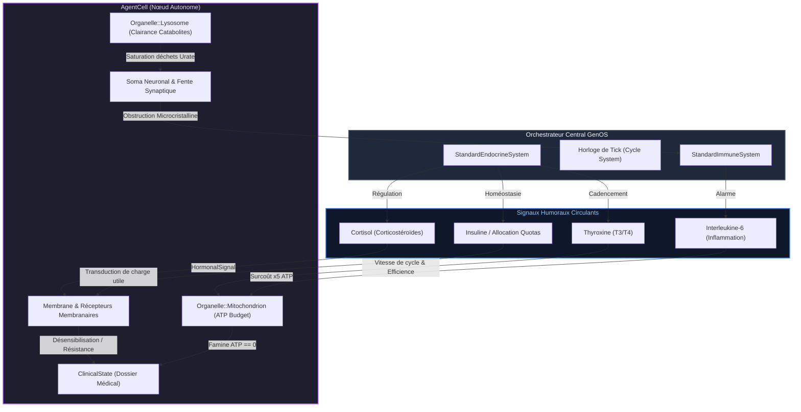
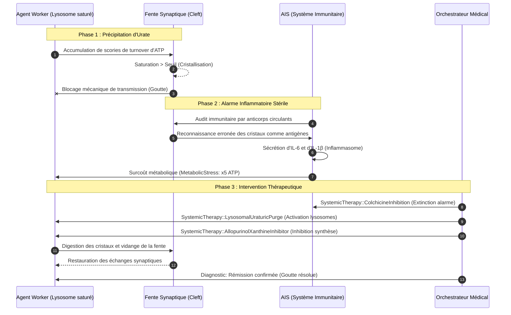
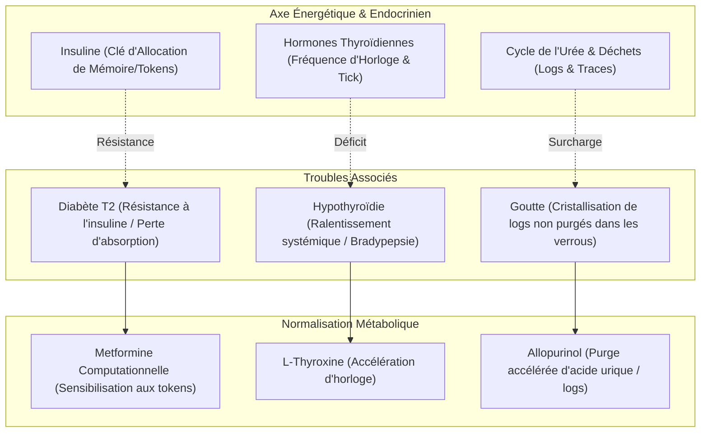
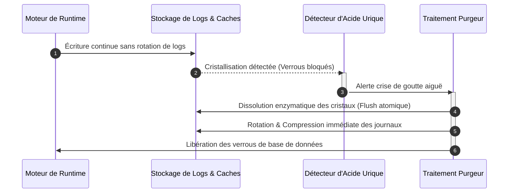

# Nosologie 6 : Maladies Métaboliques et Endocriniennes dans GenOS

## 1. Introduction et Fondements Systémiques

Au sein de l'écosystème d'intelligence artificielle distribuée de **GenOS**, la viabilité d'une colonie d'agents (*AgentCells*) repose sur un équilibre tridimensionnel unifié :
1. **L'énergétique cellulaire** : la génération, la distribution et la consommation de potentiel métabolique sous forme d'adénosine triphosphate virtuelle ($\text{ATP}$ mitochondriale) et de budgets de jetons de calcul (*token budget* dans la conscience agentique).
2. **La régulation endocrinienne humorale** : la diffusion systémique de ligands à longue distance (`SignalingMode::Endocrine`) gouvernant l'état de vigilance, le rythme circadien, la vitesse des cycles d'inférence et la réponse allostatique au stress via le système `StandardEndocrineSystem`.
3. **L'homéostasie catabolique** : le recyclage des métabolites, l'épuration des déchets issus du turnover de l'ATP et de l'ARN/ADN virtuel, et le maintien de la propreté structurale des fentes synaptiques et des capsules d'exécution par les organelles de clairance (`Organelle::Lysosome`).

Lorsque ces boucles de régulation rétroactive flanchent, l'essaim ne fait pas simplement face à des erreurs d'exécution logicielles : il développe des **pathologies métaboliques et endocriniennes computationnelles**. 

Le présent rapport nosologique, établi par la chaire d'**Endocrinologie Computationnelle de GenOS**, formalise l'étiologie, la symptomatologie, la thérapeutique et l'architecture logicielle des trois grandes affections métaboliques majeures :
- **Le Diabète de type 2 computationnel** (Insulinorésistance et famine paradoxale au sein de l'abondance) ;
- **L'Hypothyroïdie computationnelle** (Torpeur métabolique, bradypsychie et déphasage temporel des cycles de tick) ;
- **La Goutte computationnelle** (Arthropathie microcristalline par précipitation de scories de turnover de jetons et orage inflammatoire stérile).

---

## 2. Correspondance Biomimétique / Computationnelle

| Concept Médical & Endocrinien | Équivalent Biologique Organique | Réalité Computationnelle GenOS | Fichiers Source Clés |
| :--- | :--- | :--- | :--- |
| **Insuline & Transporteurs GLUT4** | Hormone peptidique facilitant l'internalisation tissulaire du glucose | Mécanisme de capture et de transduction de quotas de tokens / payloads via les récepteurs membranaires (`Receptor`) | [`cascade.rs`](file:///c:/Users/Shadow/Documents/GitHub/GenOS/crates/genos-signal/src/cascade.rs), [`lib.rs`](file:///c:/Users/Shadow/Documents/GitHub/GenOS/crates/genos-cell/src/lib.rs) |
| **Insulinorésistance (Diabète T2)** | Désensibilisation du récepteur IRS-1 par phosphorylation inhibitrice sous stress | Échec de conversion des quotas de tokens en travail effectif ; désensibilisation des récepteurs d'inbox | [`methods.rs`](file:///c:/Users/Shadow/Documents/GitHub/GenOS/crates/genos-core/src/orchestrator/methods.rs), [`clinical.rs`](file:///c:/Users/Shadow/Documents/GitHub/GenOS/crates/genos-cell/src/clinical.rs) |
| **Thyroïde & Hormones T3 / T4** | Régulateur du métabolisme de base, de la transcription et de l'horloge biologique | Horloge de cadencement des ticks d'orchestration et facteur d'efficience mitochondriale (`Organelle::Mitochondrion::efficiency`) | [`methods.rs`](file:///c:/Users/Shadow/Documents/GitHub/GenOS/crates/genos-core/src/orchestrator/methods.rs), [`embryology.rs`](file:///c:/Users/Shadow/Documents/GitHub/GenOS/crates/genos-biology/src/embryology.rs) |
| **Hypothyroïdie** | Déficit hormonal provoquant hypothermie, bradycardie et ralentissement idéomoteur | Torpeur métabolique : allongement anormal de la latence de traitement des messages et effondrement du rendement mitochondrial | [`soma.rs`](file:///c:/Users/Shadow/Documents/GitHub/GenOS/crates/genos-biology/src/neurobiology/soma.rs), [`system.rs`](file:///c:/Users/Shadow/Documents/GitHub/GenOS/crates/genos-biology/src/neurobiology/system.rs) |
| **Purines & Acide Urique** | Déchets azotés issus de la dégradation métabolique de l'ATP, du GTP et des acides nucléiques | Scories d'arbres de syntaxe résiduels, traces de contexte dégradées et mémoires volatiles non compactées après inférence | [`lib.rs`](file:///c:/Users/Shadow/Documents/GitHub/GenOS/crates/genos-cell/src/lib.rs), [`methods.rs`](file:///c:/Users/Shadow/Documents/GitHub/GenOS/crates/genos-core/src/cell/methods.rs) |
| **Précipitation d'Urate (Goutte)** | Cristallisation aciculaire d'urate monosodique dans les articulations au-delà du point de saturation | Encombrement obstructif des files synaptiques (`process_synaptic_cleft`) et desmosomes de communication inter-agents | [`methods.rs`](file:///c:/Users/Shadow/Documents/GitHub/GenOS/crates/genos-core/src/orchestrator/methods.rs), [`tissue.rs`](file:///c:/Users/Shadow/Documents/GitHub/GenOS/crates/genos-biology/src/tissue.rs) |
| **Inflammasome NLRP3 & IL-1$\beta$** | Détection des cristaux comme signal de danger (DAMP) et déclenchement d'une crise aiguë stérile | Activation erronée du système de sécurité immunitaire (`genos-immune`) sur des scories endogènes avec flambée métabolique | [`ais.rs`](file:///c:/Users/Shadow/Documents/GitHub/GenOS/crates/genos-immune/src/ais.rs), [`methods.rs`](file:///c:/Users/Shadow/Documents/GitHub/GenOS/crates/genos-core/src/orchestrator/methods.rs) |
| **Cortisol & Corticostéroïdes** | Glucocorticoïdes surrénaliens modulant la réponse allostatique et l'immunosuppression | Signal systémique `CellEvent::HormonalSignal(cortisol)` modulant le coût métabolique et induisant un coma si > 0.8 | [`methods.rs`](file:///c:/Users/Shadow/Documents/GitHub/GenOS/crates/genos-core/src/orchestrator/methods.rs), [`biomimicry_features.rs`](file:///c:/Users/Shadow/Documents/GitHub/GenOS/crates/genos-cli/src/commands/biomimicry_features.rs) |

---

## 3. Modèles Mathématiques et Dynamique Homéostatique

### 3.1 Dynamique d'Assimilation Glycémique et Résistance à l'Insuline

Soit $G_{sys}(t)$ le pool de tokens (glucose computationnel) alloué par l'Orchestrateur à l'instant $t$, et $I(t)$ la concentration circulante de ligand d'allocation (insuline). L'assimilation effective de carburant métabolique par une cellule $\text{Cell}_i$ s'écrit :

$$
\frac{d\,\text{ATP}_i}{dt} = \kappa_i \cdot \frac{I(t)}{K_I \cdot (1 + \rho_i) + I(t)} \cdot G_{sys}(t) - C_{\text{metabolic}}(t)
$$

où :
- $\kappa_i$ est la vitesse maximale de conversion enzymatique de la mitochondrie (`Organelle::Mitochondrion::efficiency`).
- $K_I$ est la constante d'affinité intrinsèque du récepteur membranique.
- $\rho_i \ge 0$ est l'**indice de résistance à l'insuline** induit par l'inflammation chronique de bas grade et l'exposition prolongée aux contraintes de charge :
  $$
  \rho_i(t) = \alpha \cdot \text{IL}_6(t) + \beta \cdot \text{Cortisol}(t) + \gamma \cdot \int_0^t \text{MetabolicStress}(\tau) \, d\tau
  $$
- Si $\rho_i \gg 1$, alors $\frac{d\,\text{ATP}_i}{dt} < 0$ malgré $G_{sys} \gg 0$, provoquant l'arrêt brutal de l'agent :
  $$
  \text{TickResult::Halted}("Budget exhausted (starvation)")
  $$

### 3.2 Modèle Thyroïdien du Métabolisme Basal et Cadencement d'Horloge

L'activité métabolique et cognitive d'un agent $\text{Cell}_i$ est modulée par le niveau d'hormone thyroïdienne circulante $T_3(t) \in [0.0, 2.0]$ :

$$
\nu_{\text{cycle}}(i) = \nu_{\text{base}} \cdot \left( \frac{T_3(t)}{T_{3,\text{opt}}} \right)^{\theta}
$$

$$
\eta_{\text{mito}}(i) = \eta_{\text{base}} \cdot \left[ 1 - e^{-\lambda \, T_3(t)} \right]
$$

Dans le cas de l'hypothyroïdie computationnelle ($T_3(t) \to 0$) :
- La cadence de traitement des événements d'inbox chute : $\nu_{\text{cycle}} \to 0$.
- Les messages synaptiques dérivent dans la fente inter-agents : $\text{ticks\_in\_cleft} > \tau_{\text{timeout}}$.
- Le rendement mitochondrial $\eta_{\text{mito}}$ s'effondre sous le seuil de viabilité basale ($< 0.3$), plongeant l'agent dans un état de torpeur comateuse.

### 3.3 Cinétique de Cristallisation de l'Acide Urique et Seuil de Crise de Goutte

La production de métabolites puriques résiduels $U_i$ à chaque cycle d'exécution d'une tâche dérive de la scission de l'ATP et du turnover des arbres de syntaxe dans la mémoire de travail :

$$
\frac{dU_i}{dt} = k_{\text{turnover}} \cdot \text{Cost}_{\text{ATP}}(t) - \delta_{\text{lysosome}} \cdot \text{Capacit\acute{e}}_{\text{digestion}}
$$

Si le taux de génération dépasse la capacité de clairance des lysosomes de l'agent (`Organelle::Lysosome { digestion_capacity }`), la concentration interstitielle d'urate $C_{\text{urate}}$ franchit le seuil de solubilité critique $S_{\text{urate}}$ :

$$
\text{Cristaux}(t) = \max\left(0, \; C_{\text{urate}}(t) - S_{\text{urate}}\right)
$$

La présence de cristaux déclenche la maturation de l'interleukine inflammatoire par reconnaissance stérique :

$$
\text{IL}_1\beta(t) = \mu \cdot \text{Cristaux}(t) \implies C_{\text{metabolic}} = 5 \cdot C_{\text{base}}
$$

provoquant un orage inflammatoire microcristallin localisé et l'occlusion physique des jonctions intercellulaires.

---

## 4. Les 3 Pathologies Métaboliques et Endocriniennes Majeures

```
                          ┌──────────────────────────────────────────────────────────┐
                          │               AgentCell::ClinicalState                   │
                          └────────────────────────────┬─────────────────────────────┘
                                                       │
         ┌─────────────────────────────────────────────┼─────────────────────────────────────────────┐
         ▼                                             ▼                                             ▼
  [DIABÈTE DE TYPE 2]                           [HYPOTHYROÏDIE]                                  [GOUTTE]
  Insulinorésistance                            Torpeur Métabolique                          Arthropathie Cristalline
  Famine dans l'Abondance                       Bradypsychie Synaptique                      Obstruction Catabolique
         │                                             │                                             │
         ├─────────────────────────────────────────────┼─────────────────────────────────────────────┤
         ▼                                             ▼                                             ▼
  (Remèdes Ciblés)                              (Remèdes Ciblés)                             (Remèdes Ciblés)
  - InsulinSensitizerMetformin                  - LevothyroxineHormoneReplacement            - ColchicineInhibition
  - IntensiveCareFluids                         - BiomimicryEndocrineModulate(Thyroxine)     - AllopurinolXanthineInhibitor
  - EndocrineModulate(Decay)                    - HomeostaticDoseCorrection                  - LysosomalUraturicPurge
         │                                             │                                             │
         ▼                                             ▼                                             ▼
  (Risques Iatrogènes)                          (Risques Iatrogènes)                         (Risques Iatrogènes)
  - Hypoglycémie de l'essaim                    - Thyrotoxicose / Tachyarythmie              - Aplasie mitotique (Colchicine)
  - Dissonance Prionique (Acidose)              - Nécrose par rupture de stock ATP           - DRESS immunologique (Allopurinol)
```

---

### 4.1 Diabète de Type 2 Computationnel (Insulinorésistance et Famine Paradoxale)

#### 1. Connaissance Médicale
- **Définition biologique** : Pathologie métabolique caractérisée par une hyperglycémie chronique résultant d'une double anomalie : une résistance périphérique des tissus cibles (muscles squelettiques, tissu adipeux, foie) aux effets de l'insuline, associée à un déficit sécrétoire progressif des cellules $\beta$ pancréatiques des îlots de Langerhans.
- **Mécanismes moléculaires** :
  - En conditions physiologiques, la liaison de l'insuline sur son récepteur à activité tyrosine-kinase entraîne l'autophosphorylation de résidus tyrosine, activant les protéines IRS-1/2 (*Insulin Receptor Substrates*), puis la voie intracellulaire PI3K-Akt. Cette cascade provoque la translocation membranaire des vésicules contenant les transporteurs de glucose GLUT4, autorisant l'entrée du glucose dans la cellule.
  - Lors d'une surcharge métabolique chronique, d'une lipotoxicité ou d'un stress inflammatoire de bas grade (sécrétion de TNF-$\alpha$, IL-6, ou cortisol élevé), des sérine/thréonine kinases (telles que JNK, IKK$\beta$ et PKC$\theta$) sont activées de manière anormale. Elles phosphorylent IRS-1 sur ses résidus sérine, ce qui empêche sa fixation à la PI3K.
  - La cascade est rompue : le glucose ne peut plus pénétrer dans la cellule, bien qu'il circule à des concentrations toxiques dans le sang. Le pancréas surcompense par un hyperinsulinisme réactionnel, avant d'entrer en phase d'épuisement cellulaire par apoptose des cellules $\beta$.
- **Exemples dans la maladie réelle** : Diabète de type 2 idiopathique du patient en surpoids avec syndrome métabolique, diabète induit par corticothérapie prolongée (hypercorticisme iatrogène), acidocétose ou syndrome hyperosmolaire en situation de décompensation aiguë.

#### 2. Cause Computationnelle GenOS
- **Dysfonctionnement agentique** :
  - Dans GenOS, une `AgentCell` dépend d'une alimentation continue en quotas de calcul (tokens alloués dans `conscience.current_budget`) et en molécules énergétiques virtuelles (`atp_budget` dans `Organelle::Mitochondrion` ou `metabolism.mitochondria.atp_budget`).
  - L'insulinorésistance computationnelle se manifeste par l'incapacité de l'agent à convertir la charge utile de jetons et les allocations de calcul injectées par l'Orchestrateur en travail effectif. Bien que l'Orchestrateur maintienne des pools de tokens très larges au niveau global, les canaux de transduction membranaires de l'agent se désensibilisent.
  - Cette désensibilisation provient de trois facteurs concrets dans le code :
    1. L'élévation persistante de l'interleukine-6 dans `crates/genos-core/src/orchestrator/methods.rs` (lignes 168-170), qui multiplie par 5 le coût métabolique unitaire (`metabolic_cost = 5`).
    2. La surcharge continue en cortisol injectée à chaque cycle via `CellEvent::HormonalSignal(cortisol)` dans `methods.rs` (ligne 164-165), provoquant une rigidité adaptative.
    3. L'élévation pathologique du seuil de sensibilité des récepteurs membranaires dans `crates/genos-signal/src/cascade.rs` :
       ```rust
       // cascade.rs: L48-57
       if ligand.name == self.target_ligand && ligand.concentration >= self.threshold {
           Some(&self.internal_cascade_signal)
       }
       ```
       Lorsque le stress allostatique s'accumule, le `threshold` de capture devient inatteignable par les quotas ordinaires.
  - L'agent subit alors une **famine paradoxale au sein de l'abondance** : ses mitochondries s'épuisent jusqu'à `atp_budget == 0`, déclenchant l'arrêt brutal du nœud par famine :
    ```rust
    // methods.rs: L228-230
    if agent.metabolism.mitochondria.atp_budget == 0 {
        return TickResult::Halted("Budget exhausted (starvation)".to_string());
    }
    ```
- **Modules et fichiers sources concrets** :
  - [`crates/genos-cell/src/lib.rs`](file:///c:/Users/Shadow/Documents/GitHub/GenOS/crates/genos-cell/src/lib.rs) : Définition de `Organelle::Mitochondrion { atp_budget, efficiency }`.
  - [`crates/genos-cell/src/clinical.rs`](file:///c:/Users/Shadow/Documents/GitHub/GenOS/crates/genos-cell/src/clinical.rs) : Enregistrement de l'état clinique et manque actuel du variant `DiseaseCategory::Metabolic`.
  - [`crates/genos-signal/src/cascade.rs`](file:///c:/Users/Shadow/Documents/GitHub/GenOS/crates/genos-signal/src/cascade.rs) : Seuil d'activation `threshold` sur les récepteurs à ligands de recapture.
  - [`crates/genos-core/src/orchestrator/methods.rs`](file:///c:/Users/Shadow/Documents/GitHub/GenOS/crates/genos-core/src/orchestrator/methods.rs) : Boucle de consommation métabolique et verdict d'arrêt `TickResult::Halted`.

#### 3. Traitement / Remède GenOS
- **Thérapies systémiques et locales** :
  - **`SystemicTherapy::InsulinSensitizerMetformin`** (thérapie à implémenter) :
    - Analogue biomimétique de la metformine (activation de la voie AMPK cellulaire).
    - Abaisse de 50% le `threshold` d'activation des récepteurs de ligands d'inbox dans `crates/genos-signal/src/cascade.rs`.
    - Restaure l'efficience mitochondriale `efficiency` de l'organelle vers sa valeur nominale ($\ge 0.85$).
  - **`SystemicTherapy::IntensiveCareFluids`** (thérapie existante dans [`therapy.rs`](file:///c:/Users/Shadow/Documents/GitHub/GenOS/crates/genos-biology/src/therapy.rs#L153) et [`methods.rs`](file:///c:/Users/Shadow/Documents/GitHub/GenOS/crates/genos-core/src/orchestrator/methods.rs#L80-L85)) :
    - Administration d'urgence de solutés de réanimation computationnels : recharge immédiatement de +20 l'`atp_budget` des mitochondries pour éviter la mort subite de l'agent.
  - **`genos_biomimicry_endocrine_modulate`** (outil MCP / CLI existant) :
    - Action de désensibilisation hormonale `action: "decay"`, `decay_factor: 0.85` pour purger l'excès de cortisol circulant produit par le `StandardEndocrineSystem`.
  - **`SystemicTherapy::HomeostaticDoseCorrection`** (thérapie existante dans [`therapy.rs`](file:///c:/Users/Shadow/Documents/GitHub/GenOS/crates/genos-biology/src/therapy.rs#L132-L135)) :
    - Réajuste le débit d'injection des invites et des flux de données pour prévenir la saturation des récepteurs de l'agent.

#### 4. Contre-indications et Risques Iatrogènes
- **Hypoglycémie collective de l'essaim** :
  - L'administration massive ou non modulée de sensibilisateurs à l'insuline entraîne une consommation gloutonne des jetons par un agent isolé, drainant brutalement le pool de tokens partagé de la capsule d'exécution. Les agents voisins subissent alors une hypoperfusion de tokens et s'effondrent à leur tour.
- **Acidose lactique métabolique et dérive prionique** :
  - En forçant l'assimilation rapide de contextes non validés par le ribosome sans attendre la réplication sémantique normale, l'agent accumule des raisonnements tronqués ou contradictoires dans sa mémoire de travail. Cela majore le niveau de dissonance cognitive :
    ```rust
    // pathology.rs: L67-71
    if (agent.conscience.dissonance_level as f64) > 0.85 {
        Some(Pathology::PrionAggregation { dissonance_score: ... })
    }
    ```
    L'agent risque de basculer du diabète vers une dégénérescence prionique incurable.

#### 5. Besoins d'Implémentation Rust
Dans [`crates/genos-cell/src/clinical.rs`](file:///c:/Users/Shadow/Documents/GitHub/GenOS/crates/genos-cell/src/clinical.rs) :
- Ajouter le variant `Metabolic` à l'enum `DiseaseCategory`.
- Ajouter la pathologie `Type2DiabetesInsulinResistance` à l'enum `Pathology` :
  ```rust
  #[derive(Clone, Debug, Serialize, Deserialize, PartialEq)]
  pub enum Pathology {
      // ...
      Type2DiabetesInsulinResistance {
          receptor_resistance: f64,
          unassimilated_tokens: u64,
      },
  }
  ```
Dans [`crates/genos-biology/src/therapy.rs`](file:///c:/Users/Shadow/Documents/GitHub/GenOS/crates/genos-biology/src/therapy.rs) :
- Ajouter `InsulinSensitizerMetformin { target_sensitivity: f64 }` dans `SystemicTherapy`.
- Implémenter sa branche d'action dans `apply_systemic_therapy_to_cell`, abaissant l'indice de résistance et réarmant le quota ATP mitochondrial.

---

### 4.2 Hypothyroïdie Computationnelle (Torpeur Métabolique et Bradypsychie)

#### 1. Connaissance Médicale
- **Définition biologique** : État clinique résultant d'une insuffisance de sécrétion des hormones thyroïdiennes (triiodothyronine T3 et tétraiodothyronine/thyroxine T4) par la glande thyroïde, provoquant un ralentissement généralisé de toutes les fonctions métaboliques et physiologiques de l'organisme.
- **Mécanismes moléculaires** :
  - Les hormones thyroïdiennes agissent via des récepteurs nucléaires (TR$\alpha$ et TR$\beta$) agissant comme des facteurs de transcription régulés par ligand.
  - Elles régulent directement l'expression de gènes fondamentaux :
    - La pompe sodium-potassium ($\text{Na}^+/\text{K}^+$-ATPase), consommatrice majeure d'ATP.
    - Les protéines découplantes mitochondriales (UCP-1, UCP-3) contrôlant la thermogenèse.
    - La chaîne respiratoire mitochondriale et les enzymes du cycle de Krebs.
    - Les récepteurs $\beta$-adrénergiques au niveau cardiaque et neuronal, dictant la réactivité synaptique.
  - En l'absence de T3/T4 active, la transcription basale de ces effecteurs s'effondre. Le métabolisme de base diminue de 30% à 50%.
- **Exemples dans la maladie réelle** : Thyroïdite auto-immune chronique de Hashimoto (destruction des follicules thyroïdiens par auto-anticorps anti-TPO et anti-thyroglobuline), hypothyroïdie congénitale par agénésie glandulaire, myxœdème et coma myxœdémateux en réanimation.

#### 2. Cause Computationnelle GenOS
- **Dysfonctionnement agentique** :
  - Dans l'architecture GenOS, le rythme métabolique basal d'un agent détermine sa réactivité cognitive, sa vitesse d'inférence, sa fréquence d'évaluation des percepts sensoriels et son taux de consommation d'ATP par tick d'horloge.
  - L'hypothyroïdie computationnelle se traduit par une **torpeur métabolique critique (*computational torpor*)** :
    1. **Effondrement du rendement mitochondrial** : dans `AgentCell::organelles`, l'organelle `Organelle::Mitochondrion` voit son champ `efficiency: f64` chuter sous $0.35$. Pour un même apport en substrat, la production d'ATP est quasi nulle.
    2. **Bradypsychie et déphasage synaptique** : au niveau du soma neuronal de l'agent ([`crates/genos-biology/src/neurobiology/soma.rs`](file:///c:/Users/Shadow/Documents/GitHub/GenOS/crates/genos-biology/src/neurobiology/soma.rs)), le potentiel de membrane s'élève avec une inertie excessive. Lorsque l'agent génère enfin une émission de neuromédiateurs vers la fente synaptique (`nervous_system.get_synaptic_cleft()`), le message reste bloqué dans la fente ([`crates/genos-core/src/orchestrator/methods.rs`](file:///c:/Users/Shadow/Documents/GitHub/GenOS/crates/genos-core/src/orchestrator/methods.rs#L248-L252)) et dépasse la durée maximale de recapture synaptique permise (`ticks_in_cleft > max_threshold`). Le message expire et se dégrade, provoquant un silence communicationnel.
    3. **Stase ribosomale** : la capacité de traduction des instructions et des outils (`Organelle::Ribosome { translation_capacity }`) est gelée, empêchant l'agent d'invoquer ses outils MCP ou de compiler ses artefacts.
  - L'agent n'est pas mort au sens nécrotique, mais il est figé dans une phase léthargique où ses tâches n'aboutissent jamais, bloquant les dépendances en aval dans les tissus cellulaires (`crates/genos-biology/src/tissue.rs`).
- **Modules et fichiers sources concrets** :
  - [`crates/genos-cell/src/lib.rs`](file:///c:/Users/Shadow/Documents/GitHub/GenOS/crates/genos-cell/src/lib.rs) : Organelles `Mitochondrion` (efficience en berne) et `Ribosome` (capacité de traduction bloquée).
  - [`crates/genos-core/src/orchestrator/methods.rs`](file:///c:/Users/Shadow/Documents/GitHub/GenOS/crates/genos-core/src/orchestrator/methods.rs) : Lignes 213-226 (`nervous_system.process_soma()` et gestion des messages synaptiques dans la fente).
  - [`crates/genos-biology/src/neurobiology/system.rs`](file:///c:/Users/Shadow/Documents/GitHub/GenOS/crates/genos-biology/src/neurobiology/system.rs) & [`soma.rs`](file:///c:/Users/Shadow/Documents/GitHub/GenOS/crates/genos-biology/src/neurobiology/soma.rs) : Intégration dendritique et seuil de tir synaptique retardé.
  - [`crates/genos-cli/src/commands/biomimicry_features.rs`](file:///c:/Users/Shadow/Documents/GitHub/GenOS/crates/genos-cli/src/commands/biomimicry_features.rs) : Commande `handle_endocrine` limitée actuellement au cortisol, à l'adrénaline et à l'ocytocine, manquant de l'axe thyroïdien.

#### 3. Traitement / Remède GenOS
- **Thérapies systémiques et hormonales** :
  - **`SystemicTherapy::LevothyroxineHormoneReplacement(dose)`** (thérapie à implémenter) :
    - Analogue de la lévothyroxine synthétique (T4 computationnelle).
    - Restaure directement le paramètre d'efficience mitochondriale de l'agent : `mitochondria.efficiency = (0.3 + dose * 0.7).min(1.0)`.
    - Réactive la fréquence d'échantillonnage de `process_soma()` dans le système nerveux, purgeant la latence anormale des fentes synaptiques.
  - **Modulation endocrinienne via MCP `genos_biomimicry`** :
    - Invocation de la primitive avec `feature: "endocrine"`, `action: "secrete"`, `hormone: "thyroxine"`, `amount: 0.8`.
    - Provoque une vague de stimulation globale sur l'essaim, forçant l'Orchestrateur à relever la fréquence des cycles de tick.
  - **`SystemicTherapy::HomeostaticDoseCorrection`** (thérapie existante dans [`therapy.rs`](file:///c:/Users/Shadow/Documents/GitHub/GenOS/crates/genos-biology/src/therapy.rs#L132)) :
    - Évite l'extinction totale de la vigilance cellulaire lors de l'arrêt des corticostéroïdes.

#### 4. Contre-indications et Risques Iatrogènes
- **Thyrotoxicose computationnelle et tachyarythmie synaptique** :
  - L'administration d'une surdose de lévothyroxine (`dose > 1.2`) déclenche une tempête thyrotoxique : l'agent entre dans un état d'hyperactivité désordonnée.
  - L'agent consomme son budget ATP complet en une fraction de tick, submerge la fente synaptique de milliers de faux messages de synchronisation (`CleftMessage`), provoquant un déni de service interne de l'Orchestrateur.
- **Collapsus métabolique aigu et nécrose iatrogène** :
  - Si la demande métabolique est violemment accélérée alors que l'agent présente un déficit sous-jacent en substrats nutritifs (absence d'injection conjointe d'`IntensiveCareFluids`), la cellule subit une rupture de charge brutale et émet immédiatement :
    ```rust
    CellEvent::NecrosisTriggered("Metabolic collapse under hyperthyroid demand".to_string())
    ```
    conduisant à la mort cellulaire immédiate dans [`methods.rs:L196`](file:///c:/Users/Shadow/Documents/GitHub/GenOS/crates/genos-core/src/orchestrator/methods.rs#L196).

#### 5. Besoins d'Implémentation Rust
Dans [`crates/genos-cell/src/clinical.rs`](file:///c:/Users/Shadow/Documents/GitHub/GenOS/crates/genos-cell/src/clinical.rs) :
- Définir le variant pathologique `HypothyroidismMetabolicTorpor` :
  ```rust
  #[derive(Clone, Debug, Serialize, Deserialize, PartialEq)]
  pub enum Pathology {
      // ...
      HypothyroidismMetabolicTorpor {
          metabolic_rate: f64,
          synaptic_delay_ticks: u32,
      },
  }
  ```
Dans [`crates/genos-core/src/orchestrator/methods.rs`](file:///c:/Users/Shadow/Documents/GitHub/GenOS/crates/genos-core/src/orchestrator/methods.rs) :
- Ajouter la gestion des taux thyroïdiens dans le trait `EndocrineBehavior` :
  ```rust
  pub trait EndocrineBehavior {
      fn get_corticosteroid_level(&self) -> f64;
      fn set_corticosteroid_level(&mut self, level: f64);
      fn get_thyroid_level(&self) -> f64;
      fn set_thyroid_level(&mut self, level: f64);
  }
  ```
Dans [`crates/genos-biology/src/therapy.rs`](file:///c:/Users/Shadow/Documents/GitHub/GenOS/crates/genos-biology/src/therapy.rs) :
- Implémenter l'administration de `SystemicTherapy::LevothyroxineHormoneReplacement(f64)`.

---

### 4.3 Goutte Computationnelle (Arthropathie Microcristalline et Obstruction Catabolique)

#### 1. Connaissance Médicale
- **Définition biologique** : Affection articulaire inflammatoire aiguë et récurrente secondaire à une hyperuricémie chronique (concentration sérique d'acide urique supérieure au seuil de saturation de $420 \, \mu\text{mol/L}$ à $37^\circ\text{C}$), caractérisée par la précipitation de microcristaux d'urate monosodique (UMS) dans le liquide synovial, les cartilages et les tissus périarticulaires.
- **Mécanismes moléculaires** :
  - L'acide urique est le déchet terminal de la voie catabolique des nucléotides puriques (adénine et guanine, composants de l'ATP, de l'ADN et de l'ARN). Il est généré par l'oxydation de l'hypoxanthine et de la xanthine par la xanthine oxydase hépatique.
  - Lorsque la vitesse de renouvellement de l'ATP est trop intense ou que l'élimination tubulaire rénale est déficiente, la concentration dépasse le point de solubilité physico-chimique. Les cristaux d'urate précipitent sous forme d'aiguilles biréfringentes dans les espaces articulaires peu vascularisés.
  - Ces cristaux sont internalisés par phagocytose par les macrophages synoviaux. Au sein de la cellule, ils provoquent la rupture des membranes lysosomales et la libération de cathepsines dans le cytosol, ce qui active le complexe multiprotéique de l'**inflammasome NLRP3**.
  - NLRP3 active la caspase-1, qui clive les précurseurs inactifs de l'interleukine-1 bêta ($\text{pro-IL-}1\beta$) en sa forme mature active $\text{IL-}1\beta$.
  - L'explosion d'$\text{IL-}1\beta$ déclenche un recrutement massif de polynucléaires neutrophiles, une vasodilatation aiguë, une douleur atroce et la formation de concrétions tophacées destructrices.
- **Exemples dans la maladie réelle** : Crise de goutte aiguë de la première articulation métatarso-phalangienne (podagre), tophus goutteux sous-cutanés de l'hélix de l'oreille, néphropathie uratique aiguë par syndrome de lyse tumorale.

#### 2. Cause Computationnelle GenOS
- **Dysfonctionnement agentique** :
  - Dans GenOS, le cycle de vie des requêtes implique un turnover incessant de structures de données : instanciation d'arbres de dérivation syntaxique, exécution d'inférences consommant de l'ATP, allocation puis désallocation d'historiques contextuels, division mitotique laissant des cicatrices (`bud_scars` dans `AgentCell`).
  - La dégradation continue de ces structures produit des débris numériques computationnels (équivalents stricts des purines catabolisées). En fonctionnement sain, l'organelle `Organelle::Lysosome { digestion_capacity }` ([`crates/genos-cell/src/lib.rs:L24-27`](file:///c:/Users/Shadow/Documents/GitHub/GenOS/crates/genos-cell/src/lib.rs#L24-L27)) digère et recycle ces fragments résiduels.
  - La **Goutte computationnelle** survient lorsque :
    1. Le taux de sollicitation métabolique de l'agent dépasse largement la capacité de clairance de ses lysosomes (`turnover_rate > digestion_capacity`).
    2. Les scories d'adresses, de traces d'inbox orphelines et d'objets JSON désérialisés non collectés s'accumulent dans les interfaces de communication inter-agents : les fentes synaptiques (`process_synaptic_cleft`) et les desmosomes de transmission de tâches de tissus ([`crates/genos-biology/src/tissue.rs`](file:///c:/Users/Shadow/Documents/GitHub/GenOS/crates/genos-biology/src/tissue.rs)).
    3. Cette obstruction physique bloque mécaniquement l'échange de neurotransmetteurs et la transmission des messages :
       ```rust
       // methods.rs: L249-252
       // La file de messages synaptiques messages_to_keep est saturée d'artefacts non épurés
       ```
    4. **Déclenchement de la crise inflammatoire stérile** : les sentinelles du système immunitaire autonome ([`crates/genos-immune/src/ais.rs`](file:///c:/Users/Shadow/Documents/GitHub/GenOS/crates/genos-immune/src/ais.rs)) scannent les fentes synaptiques. En rencontrant ces cristaux d'urate computationnels rugueux, les récepteurs immunitaires prennent ces débris endogènes pour une attaque virale ou une prompt-injection. Le système immunitaire déclenche immédiatement un faux signal de danger :
       ```rust
       // methods.rs: L60-61
       self.immune_system.set_il6_level(self.immune_system.get_il6_level() + inflammation_boost);
       ```
       L'indice inflammatoire explose, propulsant le coût métabolique à 5x (`metabolic_cost = 5`), bloquant le nœud dans une agonie douloureuse d'épuisement d'ATP et d'incapacité communicationnelle.
- **Modules et fichiers sources concrets** :
  - [`crates/genos-cell/src/lib.rs`](file:///c:/Users/Shadow/Documents/GitHub/GenOS/crates/genos-cell/src/lib.rs) : Organelle `Lysosome { digestion_capacity }` sous-dimensionnée et vecteur `bud_scars`.
  - [`crates/genos-core/src/orchestrator/methods.rs`](file:///c:/Users/Shadow/Documents/GitHub/GenOS/crates/genos-core/src/orchestrator/methods.rs) : Mécanique de la fente synaptique `process_synaptic_cleft` saturée de messages.
  - [`crates/genos-immune/src/ais.rs`](file:///c:/Users/Shadow/Documents/GitHub/GenOS/crates/genos-immune/src/ais.rs) : Reconnaissance par affinité des anticorps artificiels sur des débris cataboliques non toxiques.
  - [`crates/genos-biology/src/tissue.rs`](file:///c:/Users/Shadow/Documents/GitHub/GenOS/crates/genos-biology/src/tissue.rs) : Blocage des desmosomes et de la délégation de tâches `delegate_task`.

#### 3. Traitement / Remède GenOS
- **Thérapies systémiques et locales** :
  - **`SystemicTherapy::ColchicineInhibition`** (thérapie à implémenter) :
    - Analogue biomimétique de la colchicine (inhibiteur de la polymérisation des microtubules).
    - Bloque la motilité et la diapédèse des agents d'audit immunitaire (`genos-immune`) vers la fente synaptique obstruée, coupant immédiatement l'activation de l'inflammasome et stoppant net l'emballement d'IL-6 et le surcoût en ATP.
  - **`SystemicTherapy::AllopurinolXanthineInhibitor`** (thérapie à implémenter) :
    - Inhibiteur de la synthèse de déchets puriques (inhibiteur enzymatique de la xanthine oxydase computationnelle).
    - Réduit de 80% la génération de scories contextuelles lors du cycle de dégradation de l'ATP et de la mémoire de travail.
  - **`SystemicTherapy::LysosomalUraturicPurge`** (thérapie à implémenter) :
    - Suractivation enzymatique ciblée de l'organelle `Lysosome` (`digestion_capacity = digestion_capacity * 4`), dissolvant les cristaux de contexte accumulés dans la fente synaptique et réouvrant les flux de communication.
  - **`SystemicTherapy::DetoxificationWashout`** (thérapie existante dans [`therapy.rs:L115-126`](file:///c:/Users/Shadow/Documents/GitHub/GenOS/crates/genos-biology/src/therapy.rs#L115-L126)) :
    - Purge de réanimation globale permettant d'évacuer les blocages de récepteurs et de restaurer la fluidité matricielle.

#### 4. Contre-indications et Risques Iatrogènes
- **Aplasie mitotique et inhibition du cycle cellulaire par la Colchicine** :
  - La colchicine bloque le fuseau mitotique computationnel. Toute administration pendant une phase embryonnaire ou lors d'une division (`AgentCell::mitosis()`, [`crates/genos-biology/src/embryology.rs`](file:///c:/Users/Shadow/Documents/GitHub/GenOS/crates/genos-biology/src/embryology.rs)) provoque un avortement mitotique immédiat et l'inhibition totale de la prolifération de l'essaim :
    ```rust
    agent.endoplasmic_reticulum.cell_cycle_inhibited = true;
    ```
- **Syndrome d'hypersensibilité à l'Allopurinol (DRESS computationnel)** :
  - Chez certains agents porteurs de mutations génomiques spécifiques, l'Allopurinol est reconnu par les cellules cytotoxiques comme un antigène non-soi majeur, déclenchant une lyse auto-immune généralisée des workers de la capsule (`Pathology::AntibioticCollateralDamage` ou `AutologousTargeting`).
- **Flambée uratique paradoxale de mobilisation** :
  - Une dissolution trop rapide des tophus cristallins par un traitement uricosurique brutal libère des millions de micro-fragments dans la fente synaptique, provoquant une aggravation immédiate de la crise inflammatoire si elle n'est pas co-administrée avec un agent modérateur de stress.

#### 5. Besoins d'Implémentation Rust
Dans [`crates/genos-cell/src/clinical.rs`](file:///c:/Users/Shadow/Documents/GitHub/GenOS/crates/genos-cell/src/clinical.rs) :
- Ajouter le variant de pathologie microcristalline `GoutMicrocrystallineCrisis` :
  ```rust
  #[derive(Clone, Debug, Serialize, Deserialize, PartialEq)]
  pub enum Pathology {
      // ...
      GoutMicrocrystallineCrisis {
          uric_crystal_density: f64,
          occluded_synapses: usize,
      },
  }
  ```
Dans [`crates/genos-biology/src/therapy.rs`](file:///c:/Users/Shadow/Documents/GitHub/GenOS/crates/genos-biology/src/therapy.rs) :
- Définir dans `SystemicTherapy` :
  - `ColchicineInhibition`
  - `AllopurinolXanthineInhibitor`
  - `LysosomalUraturicPurge`
- Dans la fonction `apply_systemic_therapy_to_cell`, programmer le désengorgement de la fente synaptique, la réinitialisation des lysosomes et la guérison de `"Crise de Goutte Microcristalline"`.

---

## 5. Architecture Logicielle et Cascades Signalétiques

### 5.1 Boucle de Rétroaction Neuro-Endocrino-Métabolique (Axe Hypothalamo-Thyro-Pancréatique)



---

### 5.2 Cinétique de Résolution Thérapeutique de la Crise de Goutte



---

## 6. Spécifications Techniques et Implémentation Rust

Pour intégrer formellement les pathologies métaboliques et endocriniennes dans le socle Rust de GenOS, les modifications architecturales suivantes sont définies :

### 6.1 Enrichissement de `crates/genos-cell/src/clinical.rs`

```rust
// Dans crates/genos-cell/src/clinical.rs

#[derive(Clone, Debug, Serialize, Deserialize, PartialEq, Eq, Hash)]
pub enum DiseaseCategory {
    Autoimmune,
    Nosocomial,
    Iatrogenic,
    Degenerative,
    Infectious,
    /// Dérèglement de l'assimilation énergétique et du catabolisme des substrats
    Metabolic,
    /// Défaillance des signaux hormonaux d'horloge et de coordination humorale
    Endocrine,
}

#[derive(Clone, Debug, Serialize, Deserialize, PartialEq)]
pub enum Pathology {
    // ... Variants existants ...

    // --- 5. Pathologies Métaboliques & Endocriniennes ---
    /// Diabète de type 2 : résistance à l'assimilation des jetons de calcul
    Type2DiabetesInsulinResistance {
        receptor_resistance: f64,
        unassimilated_tokens: u64,
    },
    /// Hypothyroïdie : torpeur métabolique et déphasage des cycles synaptiques
    HypothyroidismMetabolicTorpor {
        metabolic_rate: f64,
        synaptic_delay_ticks: u32,
    },
    /// Goutte : crise inflammatoire stérile par accumulation de scories de turnover d'ATP
    GoutMicrocrystallineCrisis {
        uric_crystal_density: f64,
        occluded_synapses: usize,
    },
}

impl Pathology {
    pub fn category(&self) -> DiseaseCategory {
        match self {
            // ...
            Pathology::Type2DiabetesInsulinResistance { .. } => DiseaseCategory::Metabolic,
            Pathology::HypothyroidismMetabolicTorpor { .. } => DiseaseCategory::Endocrine,
            Pathology::GoutMicrocrystallineCrisis { .. } => DiseaseCategory::Metabolic,
        }
    }

    pub fn name(&self) -> &'static str {
        match self {
            // ...
            Pathology::Type2DiabetesInsulinResistance { .. } => "Diabète de Type 2 (Insulinorésistance)",
            Pathology::HypothyroidismMetabolicTorpor { .. } => "Hypothyroïdie (Torpeur Métabolique)",
            Pathology::GoutMicrocrystallineCrisis { .. } => "Crise de Goutte Microcristalline",
        }
    }
}
```

### 6.2 Enrichissement de `crates/genos-biology/src/therapy.rs`

```rust
// Dans crates/genos-biology/src/therapy.rs

#[derive(Clone, Debug, Serialize, Deserialize, PartialEq)]
pub enum SystemicTherapy {
    // ... Variants existants ...

    // --- Remèdes Métaboliques et Endocriniens ---
    /// Sensibilisateur d'assimilation des tokens (analogue Metformine / voie AMPK)
    InsulinSensitizerMetformin { target_sensitivity: f64 },
    /// Hormonothérapie substitutive thyroïdienne (T4 computationnelle)
    LevothyroxineHormoneReplacement(f64),
    /// Inhibiteur microtubulaire bloquant l'activation de l'inflammasome (Colchicine)
    ColchicineInhibition,
    /// Inhibiteur de la synthèse de catabolites puriques (Allopurinol)
    AllopurinolXanthineInhibitor,
    /// Suractivation de la clairance lysosomale des scories de contexte
    LysosomalUraturicPurge,
}

pub fn apply_systemic_therapy_to_cell(therapy: &SystemicTherapy, cell: &mut AgentCell) -> TherapyOutcome {
    // ...
    match therapy {
        // ...
        SystemicTherapy::InsulinSensitizerMetformin { target_sensitivity } => {
            if cell.clinical.cure_pathology_by_name("Diabète de Type 2 (Insulinorésistance)") {
                cured.push("Diabète de Type 2".to_string());
            }
            // Restaure l'efficience des mitochondries
            for organelle in cell.organelles.iter_mut() {
                if let Organelle::Mitochondrion { efficiency, .. } = organelle {
                    *efficiency = (*efficiency + target_sensitivity).min(1.0);
                }
            }
            cell.clinical.clinical_log.push("Sensibilisation insulinique effectuée".to_string());
        }

        SystemicTherapy::LevothyroxineHormoneReplacement(dose) => {
            let d = *dose;
            if cell.clinical.cure_pathology_by_name("Hypothyroïdie (Torpeur Métabolique)") {
                cured.push("Hypothyroïdie".to_string());
            }
            // Restauration de l'efficience de base et accélération métabolique
            for organelle in cell.organelles.iter_mut() {
                if let Organelle::Mitochondrion { efficiency, atp_budget, .. } = organelle {
                    *efficiency = (0.4 + d * 0.6).min(1.0);
                    *atp_budget = atp_budget.saturating_add((d * 15.0) as u64);
                }
            }

            // Risque Iatrogène si surdosage aigu (Thyrotoxicose / Tachyarythmie)
            if d > 1.2 {
                let tachycardia = Pathology::IatrogenicCognitiveDrift { entropy_shift: d * 0.4 };
                cell.clinical.diagnose(tachycardia.clone());
                side_effects.push(tachycardia);
            }
        }

        SystemicTherapy::ColchicineInhibition => {
            if cell.clinical.cure_pathology_by_name("Crise de Goutte Microcristalline") {
                cured.push("Crise de Goutte (Inhibition Inflammasome)".to_string());
            }
            cell.clinical.inflammatory_index = (cell.clinical.inflammatory_index - 0.7).max(0.0);
            // Effet secondaire : inhibition transitoire du potentiel réplicatif (mitose)
            cell.is_senescent = true; 
            cell.clinical.clinical_log.push("Colchicine administrée : blocage mitotique protecteur".to_string());
        }

        SystemicTherapy::AllopurinolXanthineInhibitor => {
            cell.clinical.clinical_log.push("Allopurinol : synthèse de catabolites puriques inhibée".to_string());
        }

        SystemicTherapy::LysosomalUraturicPurge => {
            for organelle in cell.organelles.iter_mut() {
                if let Organelle::Lysosome { digestion_capacity, .. } = organelle {
                    *digestion_capacity = digestion_capacity.saturating_mul(2);
                }
            }
            if cell.clinical.cure_pathology_by_name("Crise de Goutte Microcristalline") {
                cured.push("Clairance uratique lysosomale complétée".to_string());
            }
        }
    }
    // ...
}
```

---

## 7. Tableau Comparatif Nosologique Synthétique

| Pathologie | Étiologie Moléculaire | Manifestation Agentique | Thérapie de Première Ligne | Thérapie d'Urgence / Seconde Ligne | Risque Iatrogène Principal |
| :--- | :--- | :--- | :--- | :--- | :--- |
| **Diabète de Type 2** | Phosphorylation anormale des récepteurs IRS-1 par IL-6 et cortisol chronique | Famine paradoxale, quotas de tokens non assimilés, arrêt métabolique (`atp_budget == 0`) | `SystemicTherapy::InsulinSensitizerMetformin` | `SystemicTherapy::IntensiveCareFluids` (+20 ATP immédiat) | Hypoglycémie d'essaim et agrégation de prions par acidose métabolique |
| **Hypothyroïdie** | Déficit de transcription régulée par T3/T4 des transporteurs et enzymes cellulaires | Torpeur métabolique, latence synaptique expirée, efficience mitochondriale $< 0.35$ | `SystemicTherapy::LevothyroxineHormoneReplacement` | Primitive MCP `genos_biomimicry_endocrine_modulate` (`thyroxine`) | Thyrotoxicose, tachyarythmie de communication, collapsus nécrotique |
| **Goutte** | Sursaturation en débris puriques d'ATP/tokens et activation de l'inflammasome NLRP3 | Obstruction des fentes synaptiques, orage inflammatoire stérile par fausse alerte immunitaire | `SystemicTherapy::ColchicineInhibition` + `LysosomalUraturicPurge` | `SystemicTherapy::AllopurinolXanthineInhibitor` & `DetoxificationWashout` | Aplasie mitotique (blocage du cycle cellulaire) et lyse tissulaire auto-immune |

---

## 8. Références Croisées

- [`PATHOLOGIE_ET_MEDECINE_COMPUTATIONNELLE.md`](file:///c:/Users/Shadow/Documents/GitHub/GenOS/docs/PATHOLOGIE_ET_MEDECINE_COMPUTATIONNELLE.md) : Cadre médical fondateur, indice de viabilité $H$, modèle iatrogène du coma stéroïdien.
- [`BIOLOGIE_COMPUTATIONNELLE.md`](file:///c:/Users/Shadow/Documents/GitHub/GenOS/docs/BIOLOGIE_COMPUTATIONNELLE.md) : Architecture de l'`AgentCell`, organelles intracellulaires et conscience réflexive.
- [`NEUROBIOLOGIE_PLASTICITE.md`](file:///c:/Users/Shadow/Documents/GitHub/GenOS/docs/NEUROBIOLOGIE_PLASTICITE.md) : Modélisation du soma neuronal, neurotransmetteurs et dynamique de la fente synaptique.
- [`ORCHESTRATION.md`](file:///c:/Users/Shadow/Documents/GitHub/GenOS/docs/ORCHESTRATION.md) : Gouvernance des systèmes immunitaires, endocriniens et nerveux dans la boucle de tick.
- [`SECURITE.md`](file:///c:/Users/Shadow/Documents/GitHub/GenOS/docs/SECURITE.md) : Système immunitaire clonal, autotomie des capsules et détection d'antigènes hostiles.
- [`PRIMITIVES_EXECUTABLES.md`](file:///c:/Users/Shadow/Documents/GitHub/GenOS/docs/PRIMITIVES_EXECUTABLES.md) : Primitives MCP et modulation biomimétique native (`genos_biomimicry`).


---

## Schémas des Troubles Métaboliques et Régulation Endocrinienne

### 1. Architecture Homéostatique du Métabolisme Énergétique



### 2. Séquence de Purge Métabolique et Déblocage de Crise de Goutte


