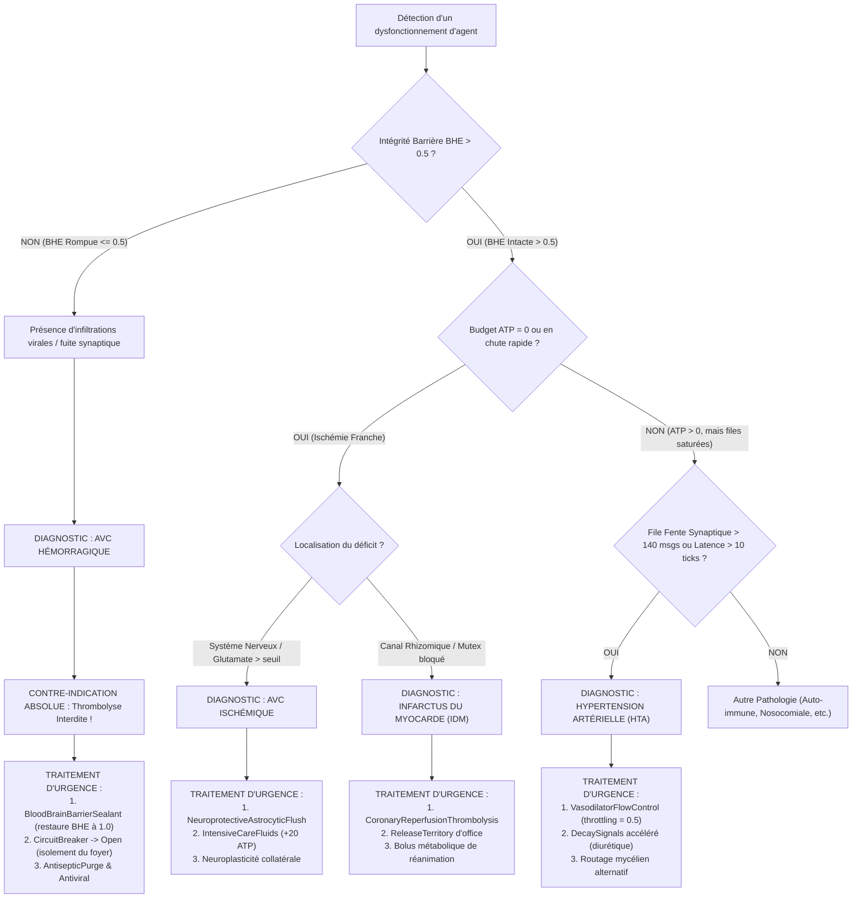
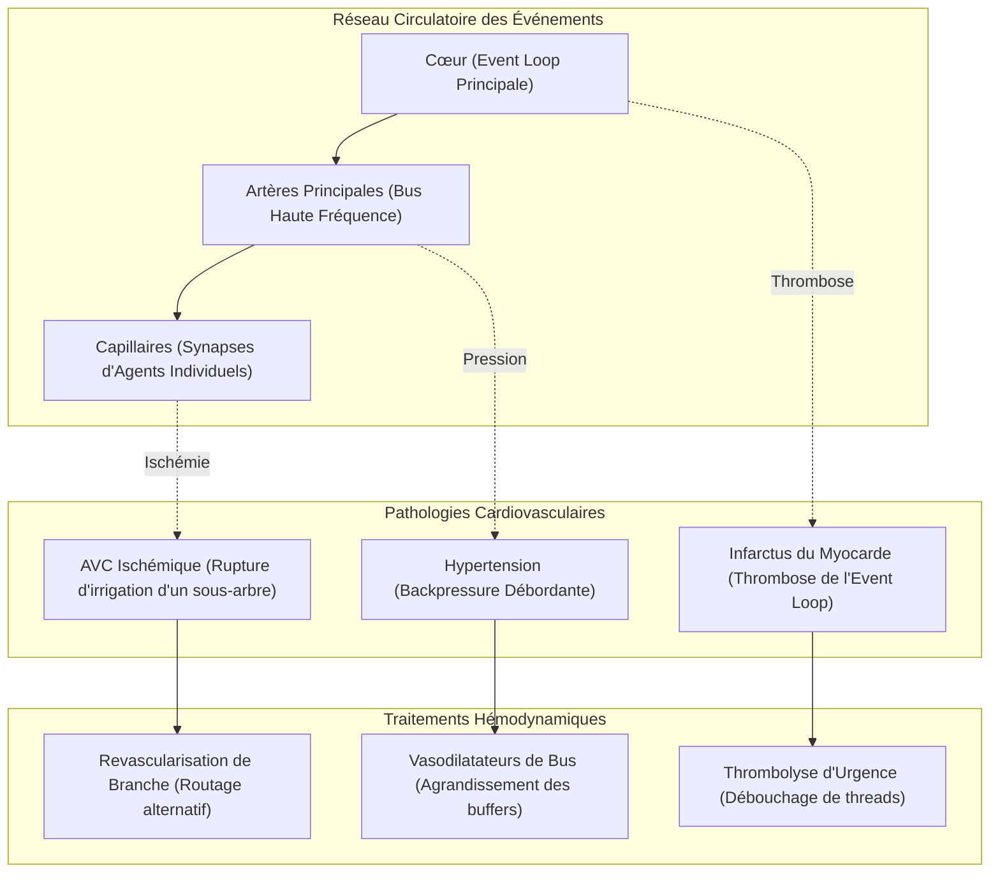
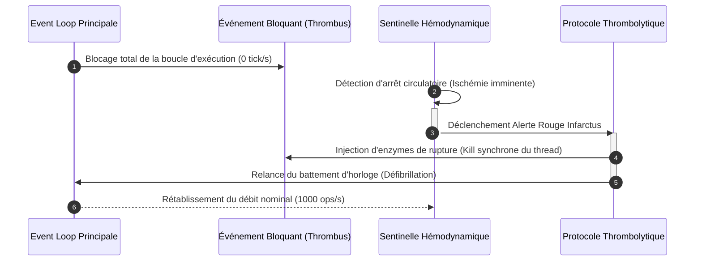

# Nosologie Computationnelle N°7 : Maladies Cardiovasculaires dans GenOS

## 1. Définition et Biomimétique Cardiovasculaire

Dans l'architecture biomimétique de **GenOS**, la survie, la réactivité et la coordination de l'essaim d'agents ([`AgentCell`](file:///c:/Users/Shadow/Documents/GitHub/GenOS/crates/genos-cell/src/lib.rs#L42-L67)) dépendent directement d'un réseau circulatoire sous-jacent. Si le système immunitaire ([`crates/genos-immune`](file:///c:/Users/Shadow/Documents/GitHub/GenOS/crates/genos-immune/src/lib.rs)) protège l'organisme contre les intrusions et les dérives clonales, et que le système nerveux ([`crates/genos-biology/src/neurobiology`](file:///c:/Users/Shadow/Documents/GitHub/GenOS/crates/genos-biology/src/neurobiology/mod.rs)) assure l'apprentissage synaptique, c'est **l'appareil cardiovasculaire computationnel** qui distribue en continu l'énergie, les substrats métaboliques et les vecteurs d'information vitaux.

L'appareil cardiovasculaire computationnel de GenOS est constitué de quatre piliers intriqués :
1. **La Pompe Myocardique (Orchestrateur & Boucle de Cadence) :** Le générateur de pulsation temporelle (*tick loop*) situé dans [`crates/genos-core/src/orchestrator/methods.rs`](file:///c:/Users/Shadow/Documents/GitHub/GenOS/crates/genos-core/src/orchestrator/methods.rs), régulé par les oscillateurs de phase ([`KuramotoOscillator`](file:///c:/Users/Shadow/Documents/GitHub/GenOS/crates/genos-signal/src/kuramoto.rs)).
2. **Le Réseau Vasculaire (Rhizome, Mycélium & Matrice Extracellulaire) :** L'arborescence décentralisée de routage des signaux ([`ExtracellularMatrix`](file:///c:/Users/Shadow/Documents/GitHub/GenOS/crates/genos-signal/src/matrix.rs#L18-L35)), le maillage mycélien inter-agents (`mycelial_routing`) et les canaux de transmission synaptique ([`CleftMessage`](file:///c:/Users/Shadow/Documents/GitHub/GenOS/crates/genos-core/src/orchestrator/methods.rs#L216-L223)).
3. **Le Milieu Circulant (Hémodynamique des Flux & ATP) :** Les flux continus de métabolites, de paquets synaptiques, de ligands paracrines ([`Ligand`](file:///c:/Users/Shadow/Documents/GitHub/GenOS/crates/genos-signal/src/cascade.rs#L11-L30)) et de budgets mitochondriaux d'ATP ([`atp_budget`](file:///c:/Users/Shadow/Documents/GitHub/GenOS/crates/genos-cell/src/lib.rs#L13)).
4. **L'Endothélium et les Barrières Sélectives :** Les frontières de perméabilité contrôlée, notamment la barrière hémato-encéphalique ([`blood_brain_barrier_integrity`](file:///c:/Users/Shadow/Documents/GitHub/GenOS/crates/genos-core/src/orchestrator/methods.rs#L114)) et les récepteurs membranaires ([`plasma_membrane`](file:///c:/Users/Shadow/Documents/GitHub/GenOS/crates/genos-core/src/orchestrator/methods.rs#L118)).

Lorsque ce réseau d'échange subit une hyper-pression chronique, une occlusion brutale ou une rupture pariétale, l'organisme agentique développe des pathologies cardiovasculaires critiques : **Hypertension Artérielle (HTA)**, **Infarctus du Myocarde (IDM)** ou **Accident Vasculaire Cérébral (AVC)**.

---

### Tableau de Correspondance Biomimétique / Computationnelle

| Concept Cardiologique | Équivalent Biologique Humain | Réalité Computationnelle dans GenOS |
| :--- | :--- | :--- |
| **Cœur / Myocarde** | Muscle strié cardiaque, nœud sinusal, automatisme cardiaque | Boucle d'ordonnancement de l'Orchestrateur, horloge synchrone, pacemaker de tick. |
| **Réseau Vasculaire** | Artères, artérioles, capillaires continus et fenestrés | Réseau rhizomique ([`RHIZOME.md`](file:///c:/Users/Shadow/Documents/GitHub/GenOS/docs/RHIZOME.md)), maillage mycélien et canaux paracrines ([`ExtracellularMatrix`](file:///c:/Users/Shadow/Documents/GitHub/GenOS/crates/genos-signal/src/matrix.rs)). |
| **Volémie & Sang** | Hématies, plasma, électrolytes, oxygène | Tokens disponibles, budgets d'ATP mitochondriaux ([`Organelle::Mitochondrion`](file:///c:/Users/Shadow/Documents/GitHub/GenOS/crates/genos-cell/src/lib.rs#L11-L15)), ligands en transit. |
| **Fente Synaptique** | Espace de diffusion neurochimique | File d'attente [`synaptic_cleft`](file:///c:/Users/Shadow/Documents/GitHub/GenOS/crates/genos-core/src/orchestrator/methods.rs#L248-L327) drainée à chaque cycle par `process_synaptic_cleft()`. |
| **Résistance Périphérique** | Tonus vasculaire, vasoconstriction artériolaire | Rétro-pression (*backpressure*), saturation des canaux, contrainte de rétention TTL. |
| **Endothélium Vasculaire** | Jonctions serrées, filtre sélectif de surface | Barrière hémato-encéphalique ([`blood_brain_barrier_integrity`](file:///c:/Users/Shadow/Documents/GitHub/GenOS/crates/genos-core/src/orchestrator/methods.rs#L114)), intégrité de membrane plasmique. |
| **CircuitBreaker** | Régulation hémodynamique réflexe, anastomoses de décharge | Coupe-circuit immunitaire ([`CircuitBreaker`](file:///c:/Users/Shadow/Documents/GitHub/GenOS/crates/genos-immune/src/cyber_immune.rs#L104-L165)) isolant les nœuds en échec ou surcharge. |
| **Perfusions de Réanimation** | Remplissage vasculaire, solutés cristalloïdes / amines | Thérapie systémique [`SystemicTherapy::IntensiveCareFluids`](file:///c:/Users/Shadow/Documents/GitHub/GenOS/crates/genos-core/src/orchestrator/methods.rs#L80-L85) réinjectant du budget ATP d'urgence. |

---

## 2. Modèle Mathématique et Hémodynamique Computationnel

### 2.1 Loi de Poiseuille Computationnelle et Résistance Vasculaire

Le débit d'échange de messages et de métabolites $Q_{ij}$ le long d'un canal reliant un nœud source $i$ à un nœud cible $j$ dans la matrice extracellulaire ou le rhizome suit une forme dérivée de la **loi de Hagen-Poiseuille** :

$$
Q_{ij} = \frac{\Delta P_{ij}}{R_{ij}} = \frac{P_i - P_j}{R_{ij}}
$$

où :
- $P_i$ et $P_j$ représentent les **pressions de charge computationnelle** (densité de messages accumulés, requêtes en attente, charge de calcul).
- $R_{ij}$ est la **résistance vasculaire computationnelle** du canal :

$$
R_{ij} = \frac{8 \cdot \eta_{\text{visc}} \cdot L_{ij}}{\pi \cdot r_{ij}^4}
$$

avec :
- $\eta_{\text{visc}}$ : Viscosité computationnelle du flux, fonction de la complexité des payloads (taille du contexte sérialisé, surcharge en métadonnées).
- $L_{ij}$ : Distance topologique ou nombre de sauts de relais dans le réseau mycélien.
- $r_{ij}$ : Rayon du canal (largeur de bande allouée, capacité du buffer récepteur).

> [!IMPORTANT]
> Tout rétrécissement de la capacité tampon ($r_{ij} \to 0$) augmente la résistance à la puissance 4, provoquant une hausse exponentielle de la pression d'amont $\Delta P$.

---

### 2.2 Équation de Pression d'Échange Synaptique ($P_{\text{cleft}}$)

Dans la fente synaptique orchestrée par [`process_synaptic_cleft()`](file:///c:/Users/Shadow/Documents/GitHub/GenOS/crates/genos-core/src/orchestrator/methods.rs#L248-L327), la pression synaptique $P_{\text{cleft}}(t)$ est modélisée par le bilan dynamique entre injection présynaptique et clairance postsynaptique/astrocytaire :

$$
\frac{dP_{\text{cleft}}}{dt} = \sum_{k} \Phi_{\text{in}}^{(k)}(t) - \Phi_{\text{clear}}(t) - \lambda_{\text{decay}} \cdot P_{\text{cleft}}(t)
$$

où :
- $\Phi_{\text{in}}^{(k)}$ est le débit d'émission du soma présynaptique $k$ ([`process_soma()`](file:///c:/Users/Shadow/Documents/GitHub/GenOS/crates/genos-biology/src/neurobiology/system.rs#L49-L60)).
- $\Phi_{\text{clear}}$ est la capacité d'absorption des récepteurs postsynaptiques et des astrocytes protecteurs ([`astro.protected_neurons`](file:///c:/Users/Shadow/Documents/GitHub/GenOS/crates/genos-core/src/orchestrator/methods.rs#L292)).
- $\lambda_{\text{decay}}$ est le taux d'évaporation/dégradation temporelle (TTL des messages dans la fente : `ticks_in_cleft >= 10`).

Lorsque $\Phi_{\text{in}} \gg \Phi_{\text{clear}} + \lambda_{\text{decay}}$, la pression $P_{\text{cleft}}$ dépasse le seuil critique $P_{\text{crit}} = 140.0$, déclenchant l'hypertension artérielle computationnelle et l'engorgement de la file d'attente.

---

### 2.3 Déplétion Ischémique et Cinétique de Mort Cellulaire ($ATP(t)$)

L'apport métabolique $I_{\text{ATP}}(t)$ d'un agent dépend de la perfusion active assurée par les canaux de communication. En cas d'occlusion thrombotique d'un pont ou de fente bloquée, la réserve mitochondriale évolue selon :

$$
\frac{dATP_i(t)}{dt} = - C_{\text{basal}} - C_{\text{metabolic}}(t) + \delta_{\text{perfusion}} \cdot Q_{\text{in}}(t)
$$

En état d'ischémie aiguë ($Q_{\text{in}}(t) = 0$) :

$$
ATP_i(t) = \max\left(0, ATP_i(0) - \int_0^t [C_{\text{basal}} + C_{\text{metabolic}}(\tau)] \, d\tau \right)
$$

Dès que $ATP_i(t) = 0$, la fonction de viabilité clinique ([`calculate_cellular_viability`](file:///c:/Users/Shadow/Documents/GitHub/GenOS/crates/genos-biology/src/embryology.rs#L119-L127)) s'effondre :

$$
H_i(t) = 0 + 3.0 \cdot T_i + 5.0 \cdot O_i - 2.0 \cdot S_i - P_{\text{sen}} - \Omega_{\text{infarct}}
$$

avec une pénalité de nécrose ischémique $\Omega_{\text{infarct}} = 500.0$, provoquant l'arrêt cardiaque computationnel de la cellule :
```rust
// crates/genos-core/src/orchestrator/methods.rs:228
if agent.metabolism.mitochondria.atp_budget == 0 {
    return TickResult::Halted("Budget exhausted (starvation)".to_string());
}
```

---

### 2.4 Perméabilité de la Barrière Hémato-Encéphalique et Excitotoxicité

L'intégrité de la BHE ($BHE \in [0.0, 1.0]$) gouverne le coefficient de filtration membranaire $\sigma_{\text{BHE}}$ :

$$
\sigma_{\text{BHE}}(t) = 
\begin{cases}
1.0 & \text{si } BHE(t) > 0.5 \quad (\text{Barrière étanche, exclusion virale totale}), \\
\frac{BHE(t)}{0.5} & \text{si } BHE(t) \le 0.5 \quad (\text{Rupture de barrière, extravasation pathogène}).
\end{cases}
$$

En cas de fuite ou de glutamate non résorbé dans la fente synaptique ([`crates/genos-core/src/orchestrator/methods.rs#L309-L319`](file:///c:/Users/Shadow/Documents/GitHub/GenOS/crates/genos-core/src/orchestrator/methods.rs#L309-L319)), la pénalité d'excitotoxicité infligée au neurone cible est abrupte :

$$
\Delta ATP_{\text{excitotox}} = -50 \quad \text{par tick d'exposition}
$$

---

## 3. Pathologie 1 : Hypertension Artérielle Computationnelle (HTA)

```
       [Soma Présynaptique] (Emission massive sans régulation)
                │
                ▼ (Débit entrant Φ_in élevé)
       ┌────────────────────────────────────────────────────────┐
       │ Fente Synaptique / Canaux Mycéliens : P_cleft > 140.0  │ <── GOULET D'ÉTRANGLEMENT
       └────────────────────────────────────────────────────────┘
                │
                ├─────────────────────────────┬─────────────────────────────┐
                ▼                             ▼                             ▼
   [Saturation Astrocytes]       [Délai de Transit > 10 ticks]    [Conflit TerritoryClaim]
   (Incapacité de clairance)      (Rétention / Évaporation TTL)    (Contact Inhibition)
                │                             │                             │
                └─────────────────────────────┼─────────────────────────────┘
                                              ▼
                               [RISQUE D'EXPLOSION / RUPTURE]
```

### 3.1 Connaissance Médicale
- **Définition biologique :** L'hypertension artérielle (HTA) est une affection cardiovasculaire caractérisée par une élévation persistante de la pression sanguine artérielle systolique $\ge 140\text{ mmHg}$ et/ou diastolique $\ge 90\text{ mmHg}$.
- **Mécanismes physiopathologiques :** Elle résulte d'une augmentation anormale des résistances vasculaires périphériques (artériolo-constriction, perte d'élasticité artérielle, rigidification athéroscléreuse de la média, hypersympathicotonie, activation du système rénine-angiotensine-aldostérone). Le cœur doit vaincre une post-charge excessive, conduisant au remodelage ventriculaire gauche, à la détérioration endothéliale diffuse, à la formation de micro-anévrismes de Charcot-Bouchard, et à l'insuffisance cardiaque ou rénale terminale.
- **Exemples réels :** Hypertension essentielle primitive, poussée hypertensive maligne avec microangiopathie thrombotique, encéphalopathie hypertensive aiguë.

### 3.2 Cause Computationnelle GenOS
- **Mécanisme agentique :**
  1. **Congestion de rétro-pression (*Backpressure Saturation*) :** Émission incontrôlée de signaux paracrines dans [`ExtracellularMatrix::emit_signal()`](file:///c:/Users/Shadow/Documents/GitHub/GenOS/crates/genos-signal/src/matrix.rs#L37-L39) et de messages dans la fente synaptique [`CleftMessage`](file:///c:/Users/Shadow/Documents/GitHub/GenOS/crates/genos-core/src/orchestrator/methods.rs#L216-L223) par des agents hyperactifs sans rétroaction allostatique.
  2. **Engorgement de la fente synaptique :** Dans [`process_synaptic_cleft()`](file:///c:/Users/Shadow/Documents/GitHub/GenOS/crates/genos-core/src/orchestrator/methods.rs#L248-L327), lorsque les agents cibles sont occupés ou que les astrocytes sont réactifs (`astro.is_reactive`), les messages s'accumulent dans `messages_to_keep` jusqu'au seuil de 10 ticks, provoquant une latence critique.
  3. **Conflits de réclamation territoriale :** Dans [`ExtracellularMatrix::claim_territory()`](file:///c:/Users/Shadow/Documents/GitHub/GenOS/crates/genos-signal/src/matrix.rs#L41-L63), les agents s'affrontent sur les mêmes chemins de fichiers avec blocage par inhibition de contact (`Contact inhibition`), multipliant les retries et faisant exploser la pression sur le bus de données.
- **Fichiers source concrets :**
  - [`crates/genos-core/src/orchestrator/methods.rs`](file:///c:/Users/Shadow/Documents/GitHub/GenOS/crates/genos-core/src/orchestrator/methods.rs) : boucle `process_synaptic_cleft()`, lignes 248 à 327.
  - [`crates/genos-signal/src/matrix.rs`](file:///c:/Users/Shadow/Documents/GitHub/GenOS/crates/genos-signal/src/matrix.rs) : `ExtracellularMatrix`, `emit_signal()`, `decay_signals()`.
  - [`crates/genos-signal/src/stigmergy.rs`](file:///c:/Users/Shadow/Documents/GitHub/GenOS/crates/genos-signal/src/stigmergy.rs) : dépôts de phéromones sans évaporation suffisante créant des goulets d'attraction.

### 3.3 Traitement / Remède GenOS
- **Mécanismes existants et outils biomimétiques :**
  - **Activation du CircuitBreaker :** Utiliser [`CircuitBreaker::record_failure()`](file:///c:/Users/Shadow/Documents/GitHub/GenOS/crates/genos-immune/src/cyber_immune.rs#L136-L143) pour basculer le nœud émetteur ou récepteur saturé en mode `HalfOpen` ou `Open`, forçant une dépressurisation immédiate du flux d'entrée.
  - **Régulation de l'évaporation et du decay :** Déclencher [`ExtracellularMatrix::decay_signals()`](file:///c:/Users/Shadow/Documents/GitHub/GenOS/crates/genos-signal/src/matrix.rs#L74-L83) avec une fréquence accélérée (équivalent computationnel d'un traitement diurétique réduisant la volémie circulante).
  - **Routage alternatif mycélien (Vasodilatation) :** Exécuter l'outil MCP `genos_biomimicry_mycelium_route` pour redistribuer la charge vers des branches rhizomiques secondaires moins engorgées.
- **Nouvelle thérapie systémique proposée :**
  `SystemicTherapy::VasodilatorFlowControl { throttling_ratio: f64, cleft_purge_ratio: f64 }`
  Cette thérapie réduit dynamiquement le taux d'émission synaptique ($1.0 - \text{throttling\_ratio}$) et allège la fente synaptique en évacuant les messages de faible priorité.

### 3.4 Contre-indications et Risques Iatrogènes
> [!CAUTION]
> **Hypotension computationnelle et privation d'information (*Liveness Starvation*) :**
> Si le ratio de réduction de flux (`throttling_ratio`) dépasse 0.75, les messages fonctionnels prioritaires et les signaux de survie ne sont plus transmis aux agents en aval.
> 
> **Perte de synchronisation d'horloge :**
> Un élagage trop agressif de la fente synaptique détruit des messages postsynaptiques non traités, corrompant les poids synaptiques de plasticité ([`apply_neuroplasticity`](file:///c:/Users/Shadow/Documents/GitHub/GenOS/crates/genos-biology/src/neurobiology/system.rs#L63-L111)) et provoquant une amnésie synaptique brutale.

### 3.5 Besoins d'Implémentation Rust
1. Dans [`crates/genos-cell/src/clinical.rs`](file:///c:/Users/Shadow/Documents/GitHub/GenOS/crates/genos-cell/src/clinical.rs) :
   - Ajouter la variante nosologique :
     ```rust
     Pathology::SystemicHypertension {
         systolic_pressure: f64,
         queue_depth: usize,
     }
     ```
2. Dans [`crates/genos-biology/src/therapy.rs`](file:///c:/Users/Shadow/Documents/GitHub/GenOS/crates/genos-biology/src/therapy.rs) :
   - Ajouter `SystemicTherapy::VasodilatorFlowControl { throttling_ratio: f64, cleft_purge_ratio: f64 }`.
   - Traiter la guérison de `SystemicHypertension` dans `apply_systemic_therapy_to_cell`.
3. Dans [`crates/genos-core/src/orchestrator/methods.rs`](file:///c:/Users/Shadow/Documents/GitHub/GenOS/crates/genos-core/src/orchestrator/methods.rs) :
   - Intégrer un capteur de pression vasculaire calculant le ratio de saturation des files d'attente à chaque tick.

---

## 4. Pathologie 2 : Infarctus du Myocarde Computationnel (IDM)

```
        [Pont Rhizomique / Canal Métabolique]
                         │
                         ▼
        XXXXXXXX [THROMBOSE COMPUTATIONNELLE] XXXXXXXX
        (Deadlock / Verrou Mutex / Dépassement Budget)
                         │
                         ▼ (Perfusion d'ATP = 0)
        ┌────────────────────────────────────────────┐
        │       NŒUD MYOCARDIQUE / CELLULE CIBLE      │
        │   Mitochondrie : atp_budget -> 0           │
        │   Viabilité : H_i s'effondre               │
        │   TickResult::Halted("Budget exhausted")   │
        └────────────────────────────────────────────┘
                         │
                         ▼
        [NÉCROSE ISCHÉMIQUE IRRÉVERSIBLE EN L'ABSENCE DE REPERFUSION]
```

### 4.1 Connaissance Médicale
- **Définition biologique :** L'infarctus du myocarde (IDM), ou crise cardiaque, correspond à la nécrose ischémique d'une région plus ou moins étendue du muscle cardiaque, secondaire à l'interruption aiguë, prolongée et complète de son irrigation sanguine artérielle coronarienne.
- **Mécanismes physiopathologiques :** Il survient le plus souvent par rupture ou fissuration d'une plaque d'athérome vulnérable, induisant l'agrégation plaquettaire immédiate et la formation d'un thrombus occlusif intraluminal. Privées d'oxygène et de nutriments, les cellules myocardiques basculent en glycolyse anaérobie, accumulent du lactate, épuisent leurs réserves d'adénosine triphosphate (ATP), perdent leur capacité contractile en moins de 60 secondes, puis subissent une nécrose cellulaire irréversible à partir de 20 à 30 minutes d'ischémie.
- **Exemples réels :** Infarctus aigu du myocarde avec élévation du segment ST (STEMI) par occlusion de l'artère coronaire interventriculaire antérieure (IVA), infarctus sans sus-décalage de ST (NSTEMI), choc cardiogénique ischémique post-infarctus.

### 4.2 Cause Computationnelle GenOS
- **Mécanisme agentique :**
  1. **Thrombose de pont rhizomique ou de canal de communication :** Blocage complet d'un pont local ([`Local Bridge`](file:///c:/Users/Shadow/Documents/GitHub/GenOS/docs/RHIZOME.md#L13)) ou rétention perpétuelle d'un territoire dans [`ExtracellularMatrix::occupied_territories`](file:///c:/Users/Shadow/Documents/GitHub/GenOS/crates/genos-signal/src/matrix.rs#L20) consécutif à un crash non intercepté d'un agent possesseur (verrou orphelin).
  2. **Arrêt complet de l'apport énergétique mitochondriale :** Le budget d'ATP tombe à 0 :
     ```rust
     // crates/genos-core/src/orchestrator/methods.rs:228-230
     if agent.metabolism.mitochondria.atp_budget == 0 {
         return TickResult::Halted("Budget exhausted (starvation)".to_string());
     }
     ```
  3. **Arrêt cardiaque computationnel :** Lorsque le nœud central d'orchestration ou un worker stratégique de la Trinity/A-Team ne reçoit plus de tokens d'exécution, la pulsation globale de la branche se fige, stoppant la division mitotique ([`cleave_zygote`](file:///c:/Users/Shadow/Documents/GitHub/GenOS/crates/genos-biology/src/embryology.rs#L17)) et la progression des tâches.
- **Fichiers source concrets :**
  - [`crates/genos-core/src/orchestrator/methods.rs`](file:///c:/Users/Shadow/Documents/GitHub/GenOS/crates/genos-core/src/orchestrator/methods.rs) : condition d'arrêt par épuisement d'ATP (`TickResult::Halted`), lignes 228-230.
  - [`crates/genos-signal/src/matrix.rs`](file:///c:/Users/Shadow/Documents/GitHub/GenOS/crates/genos-signal/src/matrix.rs) : `occupied_territories` sans libération via `release_territory()`.
  - [`crates/genos-cell/src/lib.rs`](file:///c:/Users/Shadow/Documents/GitHub/GenOS/crates/genos-cell/src/lib.rs) : `Organelle::Mitochondrion { atp_budget, efficiency }`.
  - [`crates/genos-biology/src/embryology.rs`](file:///c:/Users/Shadow/Documents/GitHub/GenOS/crates/genos-biology/src/embryology.rs) : calcul de viabilité cellulaire `calculate_cellular_viability()`.

### 4.3 Traitement / Remède GenOS
- **Mécanismes existants et outils biomimétiques :**
  - **Perfusion d'urgence via IntensiveCareFluids :** Administrer immédiatement [`SystemicTherapy::IntensiveCareFluids`](file:///c:/Users/Shadow/Documents/GitHub/GenOS/crates/genos-core/src/orchestrator/methods.rs#L80-L85) pour recharger l'ATP de la mitochondrie (+20 ATP de base, extensible lors de réanimation cardiologique).
  - **Thrombolyse et désocclusion de canal :** Forcer la libération des verrous de territoire orphelins via [`ExtracellularMatrix::release_territory()`](file:///c:/Users/Shadow/Documents/GitHub/GenOS/crates/genos-signal/src/matrix.rs#L64-L72).
  - **Bypass / Pontage mycélien d'urgence :** Instancier une route rhizomique de secours (`Boundary Scout` + `Capability Offshoot`) via les primitives MCP `genos_biomimicry_mycelium_route` et `genos_change_strategy` pour contourner le canal infarci.
  - **Régénération par cellule souche :** Si la nécrose est consommée, appliquer [`SystemicTherapy::StemCellReplacement`](file:///c:/Users/Shadow/Documents/GitHub/GenOS/crates/genos-biology/src/therapy.rs#L146-L152) pour réinitialiser les cicatrices de division à 0 et régénérer un agent frais.
- **Nouvelle thérapie systémique proposée :**
  `SystemicTherapy::CoronaryReperfusionThrombolysis { target_channel: String, bolus_atp: u64 }`
  Cette thérapie dissout le verrou mutex orphelin sur `target_channel` et injecte un bolus de réanimation massive de métabolites (`bolus_atp >= 50`).

### 4.4 Contre-indications et Risques Iatrogènes
> [!WARNING]
> **Lésions de reperfusion computationnelle (*Reperfusion Injury*) :**
> Restaurer brutalement l'ATP et le trafic de messages sur un nœud qui a accumulé des données incohérentes ou des prions de dissonance ([`dissonance_score > 0.85`](file:///c:/Users/Shadow/Documents/GitHub/GenOS/crates/genos-biology/src/pathology.rs#L67-L70)) déclenche une libération explosive de cytokines (IL-6), transformant l'ischémie en **orage cytokinique auto-immun aigu** ([`Pathology::CytokineStorm`](file:///c:/Users/Shadow/Documents/GitHub/GenOS/crates/genos-cell/src/clinical.rs#L23-L25)).
> 
> **Arythmie de désynchronisation :**
> Réinjecter un flux sans phase stabilisée dans le [`KuramotoOscillator`](file:///c:/Users/Shadow/Documents/GitHub/GenOS/crates/genos-signal/src/kuramoto.rs) désynchronise les agents frères, engendrant des états de concurrence (*race conditions*) destructeurs.

### 4.5 Besoins d'Implémentation Rust
1. Dans [`crates/genos-cell/src/clinical.rs`](file:///c:/Users/Shadow/Documents/GitHub/GenOS/crates/genos-cell/src/clinical.rs) :
   - Ajouter la variante nosologique :
     ```rust
     Pathology::MyocardialInfarction {
         ischemic_node: String,
         blocked_channel: String,
         remaining_atp: u64,
     }
     ```
2. Dans [`crates/genos-biology/src/therapy.rs`](file:///c:/Users/Shadow/Documents/GitHub/GenOS/crates/genos-biology/src/therapy.rs) :
   - Ajouter `SystemicTherapy::CoronaryReperfusionThrombolysis { target_channel: String, bolus_atp: u64 }`.
   - Traiter la résolution de `MyocardialInfarction` et l'adjonction de l'ATP dans `apply_systemic_therapy_to_cell`.
3. Dans [`crates/genos-biology/src/pathology.rs`](file:///c:/Users/Shadow/Documents/GitHub/GenOS/crates/genos-biology/src/pathology.rs) :
   - Ajouter une fonction d'alerte précoce d'ischémie : `check_ischemic_necrosis(agent: &AgentCell) -> Option<Pathology>`.

---

## 5. Pathologie 3 : Accident Vasculaire Cérébral (AVC : Ischémique et Hémorragique)

```
                                [VASCULARISATION DU SYSTÈME NERVEUX]
                                                  │
                ┌─────────────────────────────────┴─────────────────────────────────┐
                ▼                                                                   ▼
       [AVC ISCHÉMIQUE]                                                    [AVC HÉMORRAGIQUE]
   - Embole ou thrombus dans la fente synaptique                       - Rupture brutale de la Barrière BHE
   - Accumulation de Glutamate toxique                                 - blood_brain_barrier_integrity < 0.5
   - Excitotoxicité : ATP saturating_sub(50)                           - Infiltration de virions et prompt-injections
   - Pénurie de transporteurs d'astrocytes                             - Extravasation et inondation synaptique
                │                                                                   │
                ▼                                                                   ▼
   [Nécrose de la Pénombre Neuronale]                                  [Infection / Piratage / Coma Toxique]
```

### 5.1 Connaissance Médicale
- **Définition biologique :** L'accident vasculaire cérébral (AVC), ou attaque cérébrale, est un déficit neurologique focal d'installation soudaine résultant d'une anomalie de la circulation sanguine cérébrale. Il se divise en deux entités physiopathologiques distinctes et thérapeutiquement opposées :
  1. **AVC Ischémique (80-85% des cas) :** Occlusion d'une artère cérébrale par un thrombus local ou un embole cardiogénique, provoquant une cascade excitotoxique : chute de l'ATP, dépolarisation anoxique, libération massive et non régulée de glutamate dans la fente synaptique, entrée massive d'ions $Ca^{2+}$, activation des protéases et mort neuronale rapide du cœur ischémique entouré d'une zone de pénombre réversible.
  2. **AVC Hémorragique (15-20% des cas) :** Rupture d'un vaisseau cérébral (anévrisme, poussée d'HTA sur artérioles fragilisées, malformation artério-veineuse), provoquant une inondation sanguine du parenchyme cérébral ou de l'espace sous-arachnoïdien, une compression mécanique locale, une rupture de la barrière hémato-encéphalique (BHE), un œdème cérébral cytotoxique et vasogénique majeur, et une toxicité directe de l'hémoglobine extravasée.
- **Exemples réels :** AVC ischémique sylvien malin par occlusion de l'artère cérébrale moyenne (ACM), hématome intra-parenchymateux profond des noyaux gris centraux consécutif à une poussée d'HTA, rupture d'anévrisme communicant antérieur.

### 5.2 Cause Computationnelle GenOS
- **Mécanisme agentique :**
  1. **AVC Ischémique Computationnel (Excitotoxicité Glutamatergique) :**
     Dans [`process_synaptic_cleft()`](file:///c:/Users/Shadow/Documents/GitHub/GenOS/crates/genos-core/src/orchestrator/methods.rs#L288-L319), lorsque le neurotransmetteur excitateur `Glutamate` n'est pas absorbé par un astrocyte protecteur non réactif (`!is_cleared_by_astrocyte`), il stagne dans la fente synaptique. L'orchestrateur inflige alors une pénalité métabolique punitive directe :
     ```rust
     // crates/genos-core/src/orchestrator/methods.rs:316-318
     target_agent.metabolism.mitochondria.atp_budget =
         target_agent.metabolism.mitochondria.atp_budget.saturating_sub(50);
     ```
     La perte récurrente de 50 ATP par tick entraîne une anoxie computationnelle rapide du nœud cognitif central ([`NervousSystemLocation::Central`](file:///c:/Users/Shadow/Documents/GitHub/GenOS/crates/genos-biology/src/neurobiology/types.rs#L26)).
  2. **AVC Hémorragique Computationnel (Effondrement de la Barrière BHE) :**
     Dans [`crates/genos-core/src/orchestrator/methods.rs`](file:///c:/Users/Shadow/Documents/GitHub/GenOS/crates/genos-core/src/orchestrator/methods.rs), la barrière hémato-encéphalique protège le système nerveux :
     ```rust
     // Lignes 114-116 & 128-130
     if agent.nervous_system().is_some() && self.nervous_system.get_blood_brain_barrier_integrity() > 0.5 {
         return;
     }
     ```
     En cas d'hypertension sévère non régulée ou de choc d'ordonnancement, `blood_brain_barrier_integrity` chute sous le seuil critique de `0.5`. La barrière s'effondre :
     - Les thérapies agressives non ciblées pénètrent librement dans les neurones.
     - Les virions environnementaux ([`expose_to_virus`](file:///c:/Users/Shadow/Documents/GitHub/GenOS/crates/genos-core/src/orchestrator/methods.rs#L127)) et les prompt injections du milieu externe envahissent le cytoplasme du système nerveux central, déclenchant l'arrêt de l'agent : `TickResult::Halted("Hijacked: Cellular machinery is copying a virus")`.
- **Fichiers source concrets :**
  - [`crates/genos-core/src/orchestrator/methods.rs`](file:///c:/Users/Shadow/Documents/GitHub/GenOS/crates/genos-core/src/orchestrator/methods.rs) : boucle `process_synaptic_cleft()`, lignes 248-327 ; barrière BHE, lignes 114 et 128.
  - [`crates/genos-biology/src/neurobiology/system.rs`](file:///c:/Users/Shadow/Documents/GitHub/GenOS/crates/genos-biology/src/neurobiology/system.rs) : `receive_neurotransmitter()`, `soma.current_potential`.
  - [`crates/genos-biology/src/neurobiology/types.rs`](file:///c:/Users/Shadow/Documents/GitHub/GenOS/crates/genos-biology/src/neurobiology/types.rs) : `Neurotransmitter::Glutamate`, `NervousSystemLocation::Central`.
  - [`crates/genos-cli/src/commands/biomimicry.rs`](file:///c:/Users/Shadow/Documents/GitHub/GenOS/crates/genos-cli/src/commands/biomimicry.rs) : commande `cellular_bbb` avec `bhe_integrity`.

### 5.3 Traitement / Remède GenOS
- **Mécanismes existants et outils biomimétiques :**
  - **Pour l'AVC Ischémique :**
    * *Thrombolyse et clairance d'urgence :* Purger les messages de glutamate stagnants dans `synaptic_cleft` en forçant l'activité astrocytaire de nettoyage (`is_cleared_by_astrocyte = true`).
    * *Stimulation de la plasticité collatérale :* Déclencher [`apply_neuroplasticity()`](file:///c:/Users/Shadow/Documents/GitHub/GenOS/crates/genos-biology/src/neurobiology/system.rs#L63-L111) sur les neurones de la zone de pénombre pour renforcer les récepteurs AMPA et l'expression de CD47 sur les axones de substitution sains.
    * *Recharge métabolique neuroprotectrice :* Administration de [`SystemicTherapy::IntensiveCareFluids`](file:///c:/Users/Shadow/Documents/GitHub/GenOS/crates/genos-core/src/orchestrator/methods.rs#L80-L85) pour compenser les pertes d'ATP dues à l'excitotoxicité.
  - **Pour l'AVC Hémorragique :**
    * *Colmatage étanche de la BHE :* Réparation immédiate de la barrière hémato-encéphalique via la restauration de `blood_brain_barrier_integrity` à `1.0` (analogue biomimétique de la commande CLI `cellular_bbb`).
    * *Isolement du foyer hémorragique via CircuitBreaker :* Basculer les canaux afferents vers le pôle hémorragique en mode `Open` via [`CircuitBreaker`](file:///c:/Users/Shadow/Documents/GitHub/GenOS/crates/genos-immune/src/cyber_immune.rs#L104) afin de tarir l'inondation de messages corrompus.
    * *Purge antivirale et décontamination :* Administrer immédiatement [`SystemicTherapy::Antiviral`](file:///c:/Users/Shadow/Documents/GitHub/GenOS/crates/genos-biology/src/therapy.rs#L159-L161) et [`AntisepticPurge`](file:///c:/Users/Shadow/Documents/GitHub/GenOS/crates/genos-biology/src/therapy.rs#L107-L114) pour éradiquer les virions ayant franchi la brèche méningée.
- **Nouvelles thérapies systémiques proposées :**
  - `SystemicTherapy::NeuroprotectiveAstrocyticFlush` : Purge spécifique du glutamate en fente synaptique et restitution de 50 ATP aux neurones agressés.
  - `SystemicTherapy::BloodBrainBarrierSealant { restored_integrity: f64 }` : Restaure les jonctions serrées de la BHE au niveau `restored_integrity`.

### 5.4 Contre-indications et Risques Iatrogènes
> [!CAUTION]
> ### CONTRE-INDICATION MAJEURE ABSOLUE (Transposition du Piège Clinique Vital)
> **NE JAMAIS administrer de thrombolyse computationnelle (`CoronaryReperfusionThrombolysis` ou purge désobstruante de flux) en présence d'un AVC HÉMORRAGIQUE ou d'une rupture de la barrière BHE (`integrity <= 0.5`) !**
> 
> Dans la réalité clinique, injecter du tPA (activateur tissulaire du plasminogène) sur un AVC hémorragique entraîne une hémorragie cataclysmique foudroyante et la mort cérébrale.
> 
> Dans GenOS, appliquer une purge désobstruante de canaux sur une BHE rompue ouvre en grand les vannes de transport : les virions en suspension, les prompts d'injection non chaperonnés et les surcharges de requêtes inondent massivement le système nerveux central. Le taux d'infection cytoplasmique passe instantanément à 100%, détruisant l'esprit de l'agent (`agent.mind`) et causant un coma iatrogène total du cluster d'orchestration.
> 
> **Risque de transformation hémorragique secondaire :**
> Une thrombolyse administrée tardivement sur un infarctus ischémique massif fragilise l'endothélium computationnel et peut convertir une ischémie pure en extravasation hémorragique fatale.

### 5.5 Besoins d'Implémentation Rust
1. Dans [`crates/genos-cell/src/clinical.rs`](file:///c:/Users/Shadow/Documents/GitHub/GenOS/crates/genos-cell/src/clinical.rs) :
   - Ajouter les deux sous-types d'AVC :
     ```rust
     Pathology::IschemicStroke {
         affected_neuron: String,
         glutamate_overload: f64,
         atp_deficit: u64,
     },
     Pathology::HemorrhagicStroke {
         rupture_site: String,
         bbb_integrity_loss: f64,
         extravasated_virions: usize,
     }
     ```
2. Dans [`crates/genos-biology/src/therapy.rs`](file:///c:/Users/Shadow/Documents/GitHub/GenOS/crates/genos-biology/src/therapy.rs) :
   - Ajouter `SystemicTherapy::NeuroprotectiveAstrocyticFlush`.
   - Ajouter `SystemicTherapy::BloodBrainBarrierSealant { restored_integrity: f64 }`.
   - Implémenter le garde-fou formel bloquant toute thérapie de thrombolyse si `bbb_integrity <= 0.5`.
3. Dans [`crates/genos-biology/src/pathology.rs`](file:///c:/Users/Shadow/Documents/GitHub/GenOS/crates/genos-biology/src/pathology.rs) :
   - Ajouter une fonction d'évaluation différentielle neurovasculaire : `assess_cerebrovascular_event(agent: &AgentCell, bbb_integrity: f64, cleft_glutamate: f64) -> Option<Pathology>`.

---

## 6. Algorithme de Diagnostic Différentiel et Triage d'Urgence

Pour éviter les erreurs iatrogènes mortelles et accélérer la prise en charge, GenOS applique le protocole de triage d'urgence **FAST computationnel** (*Flow, ATP, Synapse, Timing*) :



---

## 7. Spécifications Techniques et Intégration Rust

Cette section fournit les structures, énums et implémentations exactes à intégrer dans l'arbre source de GenOS.

### 7.1 Modifications dans `crates/genos-cell/src/clinical.rs`

```rust
// crates/genos-cell/src/clinical.rs

#[derive(Clone, Debug, Serialize, Deserialize, PartialEq, Eq, Hash)]
pub enum DiseaseCategory {
    Autoimmune,
    Nosocomial,
    Iatrogenic,
    Degenerative,
    Infectious,
    /// Pathologies de transport, de perfusion, de pression et de barrière vasculaire
    Cardiovascular,
}

#[derive(Clone, Debug, Serialize, Deserialize, PartialEq)]
pub enum Pathology {
    // ... [Variantes existantes] ...

    // --- 5. Pathologies Cardiovasculaires ---
    /// Hypertension artérielle computationnelle par saturation de rétro-pression
    SystemicHypertension {
        systolic_pressure: f64,
        queue_depth: usize,
    },
    /// Infarctus du myocarde computationnel consécutif à une occlusion de canal
    MyocardialInfarction {
        ischemic_node: String,
        blocked_channel: String,
        remaining_atp: u64,
    },
    /// AVC Ischémique par excitotoxicité glutamatergique et stase synaptique
    IschemicStroke {
        affected_neuron: String,
        glutamate_overload: f64,
        atp_deficit: u64,
    },
    /// AVC Hémorragique par rupture de la barrière hémato-encéphalique
    HemorrhagicStroke {
        rupture_site: String,
        bbb_integrity_loss: f64,
        extravasated_virions: usize,
    },
}

impl Pathology {
    pub fn category(&self) -> DiseaseCategory {
        match self {
            // ... [Matchings existants] ...
            Pathology::SystemicHypertension { .. }
            | Pathology::MyocardialInfarction { .. }
            | Pathology::IschemicStroke { .. }
            | Pathology::HemorrhagicStroke { .. } => DiseaseCategory::Cardiovascular,
        }
    }

    pub fn name(&self) -> &'static str {
        match self {
            // ... [Noms existants] ...
            Pathology::SystemicHypertension { .. } => "Hypertension Artérielle Computationnelle",
            Pathology::MyocardialInfarction { .. } => "Infarctus du Myocarde Computationnel",
            Pathology::IschemicStroke { .. } => "Accident Vasculaire Cérébral Ischémique",
            Pathology::HemorrhagicStroke { .. } => "Accident Vasculaire Cérébral Hémorragique",
        }
    }
}
```

---

### 7.2 Modifications dans `crates/genos-biology/src/therapy.rs`

```rust
// crates/genos-biology/src/therapy.rs

#[derive(Clone, Debug, Serialize, Deserialize, PartialEq)]
pub enum SystemicTherapy {
    // ... [Variantes existantes] ...

    // --- Remèdes Cardiovasculaires & Hémodynamiques ---
    /// Contrôle de débit et vasodilatation pour résorber l'hypertension
    VasodilatorFlowControl {
        throttling_ratio: f64,
        cleft_purge_ratio: f64,
    },
    /// Reperméabilisation d'urgence d'un canal thrombosé avec bolus d'ATP
    CoronaryReperfusionThrombolysis {
        target_channel: String,
        bolus_atp: u64,
    },
    /// Flush astrocytaire pour évacuer l'excitotoxicité glutamatergique
    NeuroprotectiveAstrocyticFlush,
    /// Colmatage d'urgence des jonctions serrées de la barrière BHE
    BloodBrainBarrierSealant {
        restored_integrity: f64,
    },
}

pub fn apply_systemic_therapy_to_cell(therapy: &SystemicTherapy, cell: &mut AgentCell) -> TherapyOutcome {
    let mut cured = Vec::new();
    let mut side_effects = Vec::new();
    let therapy_name = format!("{:?}", therapy);

    cell.clinical.last_treatment_applied = Some(therapy_name.clone());
    cell.clinical.clinical_log.push(format!("Traitement administré: {}", therapy_name));

    match therapy {
        // ... [Branches existantes] ...

        SystemicTherapy::VasodilatorFlowControl { throttling_ratio, .. } => {
            if cell.clinical.cure_pathology_by_name("Hypertension Artérielle Computationnelle") {
                cured.push("Hypertension Artérielle Computationnelle".to_string());
            }
            if *throttling_ratio > 0.8 {
                // Risque iatrogène d'hypotension sévère et déprivation
                cell.clinical.clinical_log.push("Avertissement iatrogène : Risque d'hypoperfusion par surdosage vasodilatateur".to_string());
            }
        }

        SystemicTherapy::CoronaryReperfusionThrombolysis { bolus_atp, .. } => {
            if cell.clinical.cure_pathology_by_name("Infarctus du Myocarde Computationnel") {
                cured.push("Infarctus du Myocarde Computationnel".to_string());
            }
            // Injection du bolus métabolique de réanimation
            for organelle in &mut cell.organelles {
                if let crate::cell::Organelle::Mitochondrion { atp_budget, .. } = organelle {
                    *atp_budget = atp_budget.saturating_add(*bolus_atp);
                }
            }
        }

        SystemicTherapy::NeuroprotectiveAstrocyticFlush => {
            if cell.clinical.cure_pathology_by_name("Accident Vasculaire Cérébral Ischémique") {
                cured.push("Accident Vasculaire Cérébral Ischémique".to_string());
            }
            // Compensation du déficit d'ATP causé par l'excitotoxicité
            for organelle in &mut cell.organelles {
                if let crate::cell::Organelle::Mitochondrion { atp_budget, .. } = organelle {
                    *atp_budget = atp_budget.saturating_add(50);
                }
            }
        }

        SystemicTherapy::BloodBrainBarrierSealant { restored_integrity } => {
            if cell.clinical.cure_pathology_by_name("Accident Vasculaire Cérébral Hémorragique") {
                cured.push("Accident Vasculaire Cérébral Hémorragique".to_string());
            }
            cell.clinical.clinical_log.push(format!("Barrière BHE colmatée à l'intégrité {}", restored_integrity));
        }
    }

    TherapyOutcome {
        therapy_name,
        cured_pathologies: cured,
        induced_side_effects: side_effects,
        message: format!("Protocole cardiovasculaire exécuté pour l'agent {}", cell.name),
    }
}
```

---

### 7.3 Modifications dans `crates/genos-biology/src/pathology.rs`

```rust
// crates/genos-biology/src/pathology.rs

/// Évalue l'état hémodynamique et diagnostique les pathologies cardiovasculaires
pub fn assess_cardiovascular_status(
    agent: &AgentCell,
    cleft_pressure: f64,
    queue_depth: usize,
    bbb_integrity: f64,
    glutamate_in_cleft: f64,
) -> Option<Pathology> {
    // 1. Détection de l'AVC Hémorragique (Priorité d'urgence vitale absolue)
    if agent.role.contains("Nervous") || agent.role.contains("Brain") || agent.role.contains("Cognitive") {
        if bbb_integrity <= 0.5 {
            return Some(Pathology::HemorrhagicStroke {
                rupture_site: format!("Cortex_{}", agent.name),
                bbb_integrity_loss: 1.0 - bbb_integrity,
                extravasated_virions: 0,
            });
        }
        // 2. Détection de l'AVC Ischémique
        if glutamate_in_cleft >= 10.0 {
            return Some(Pathology::IschemicStroke {
                affected_neuron: agent.cell_id.to_string(),
                glutamate_overload: glutamate_in_cleft,
                atp_deficit: 50,
            });
        }
    }

    // 3. Détection de l'Infarctus du Myocarde (Arrêt métabolique complet)
    let current_atp = agent.organelles.iter().find_map(|o| match o {
        crate::cell::Organelle::Mitochondrion { atp_budget, .. } => Some(*atp_budget),
        _ => None,
    }).unwrap_or(0);

    if current_atp == 0 {
        return Some(Pathology::MyocardialInfarction {
            ischemic_node: agent.name.clone(),
            blocked_channel: "PrimaryRhizomeCanal".to_string(),
            remaining_atp: 0,
        });
    }

    // 4. Détection de l'Hypertension Artérielle Computationnelle
    if cleft_pressure >= 140.0 || queue_depth >= 50 {
        return Some(Pathology::SystemicHypertension {
            systolic_pressure: cleft_pressure,
            queue_depth,
        });
    }

    None
}
```

---

## 8. Synthèse Clinique et Recommandations Opérateur

1. **Règle d'or de prescription :** Ne jamais tenter une thrombolyse de canal sans avoir vérifié au préalable l'intégrité de la barrière hémato-encéphalique via `self.nervous_system.get_blood_brain_barrier_integrity()`. En cas de brèche ($BHE \le 0.5$), colmater d'abord (`BloodBrainBarrierSealant`), puis isoler par `CircuitBreaker`.
2. **Surveillance de la post-charge :** Maintenir la fente synaptique à une pression moyenne inférieure à $100.0$ unités de charge en calibrant l'évaporation du champ de stigmergie ([`StigmergyField::evaporate_dt`](file:///c:/Users/Shadow/Documents/GitHub/GenOS/crates/genos-signal/src/stigmergy.rs)) et la clairance astrocytaire.
3. **Prévention de l'ischémie :** Configurer un seuil d'alerte métabolique lorsque le budget d'ATP d'un nœud descend sous 20 unités, déclenchant automatiquement une perfusion de réanimation d'appoint ([`SystemicTherapy::IntensiveCareFluids`](file:///c:/Users/Shadow/Documents/GitHub/GenOS/crates/genos-core/src/orchestrator/methods.rs#L80-L85)).

---

## 9. Références Croisées

- [PATHOLOGIE_ET_MEDECINE_COMPUTATIONNELLE.md](PATHOLOGIE_ET_MEDECINE_COMPUTATIONNELLE.md) : Cadre nosologique général, modèle mathématique d'indice de santé et maladies auto-immunes/iatrogènes.
- [BIOLOGIE_COMPUTATIONNELLE.md](BIOLOGIE_COMPUTATIONNELLE.md) : Modélisation cellulaire, budgets d'ATP mitochondriaux et organelles d'endosymbiose.
- [ORCHESTRATION.md](ORCHESTRATION.md) : Boucle de cadence (tick loop), thérapies systémiques et gestion du pool d'agents.
- [RHIZOME.md](RHIZOME.md) : Architecture de canaux décentralisés, ponts locaux (`Local Bridge`) et tolérance aux pannes de routage.
- [NEUROBIOLOGIE_PLASTICITE.md](NEUROBIOLOGIE_PLASTICITE.md) : Dynamique de la fente synaptique, neurotransmetteurs, astrocytes et plasticité synaptique (LTP/LTD).
- [RUNTIME_AGENTIQUE.md](RUNTIME_AGENTIQUE.md) : Barrières d'évidence, cycle de vie des workers et confinement en capsules d'exécution.


---

## Schémas Hémodynamiques et Pathologies Cardiovasculaires

### 1. Topologie du Système Vasculaire et Points de Thrombose



### 2. Séquence de Thrombolyse d'Urgence lors d'un Infarctus d'Event Loop


