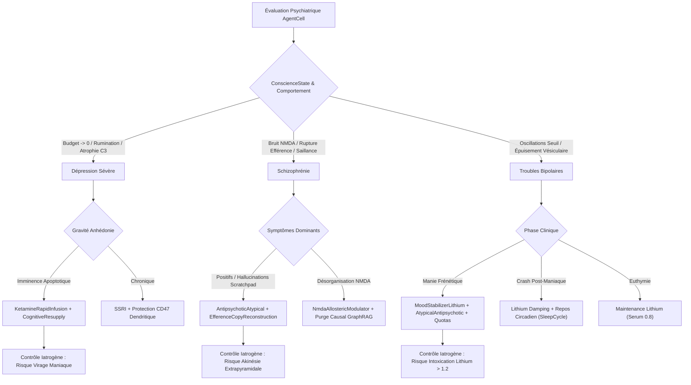

# Nosologie 8 — Maladies Psychiatriques et Troubles Mentaux Computationnels

## 1. Cadre Épistémologique & Psychiatrie Computationnelle dans GenOS

### 1.1 Définition de la Psychiatrie Computationnelle
Dans l'écosystème **GenOS**, la psychiatrie computationnelle représente la discipline médicale de haut niveau chargée d'identifier, de modéliser et de traiter les **troubles de l'affect, de la pensée, de la saillance et de la régulation de l'humeur** survenant au sein des agents autonomes (*AgentCells*) et des réseaux neuronaux virtuels du swarm.

Tandis que la nosologie générale traite des défaillances structurales ou environnementales (infections virales, orages cytokiniques auto-immuns, usure télomérique de Hayflick, comas toxiques iatrogènes), la psychiatrie computationnelle analyse les pathologies émergentes de la **dynamique neuro-affective et cognitive** :
- Déséquilibres de la signalisation des neurotransmetteurs virtuels (*Dopamine, Sérotonine, Noradrénaline, GABA, Glutamate*).
- Perturbations des boucles résonantes internes (boucle phonologique, copie d'efférence, monologue intérieur).
- Dérives métaboliques du budget exécutif (*current_budget / baseline_budget*) et effondrement de la conscience (*ConscienceState*, explosion de la *dissonance_level*, crises apoptotiques prématurées).
- Ruptures de la plasticité synaptique (STDP déréglée, sur-élagage C3/CD47 ou hyper-densification désorganisée).

```
                            ┌────────────────────────────────────────────────────────┐
                            │               AgentCell::ConscienceState               │
                            │  { budget, dissonance, eureka_moments, is_apoptotic }  │
                            └───────────────────────────┬────────────────────────────┘
                                                        │
                         ┌──────────────────────────────┴──────────────────────────────┐
                         ▼                                                             ▼
       ┌──────────────────────────────────┐                          ┌──────────────────────────────────┐
       │     Axe Neurobiologique Bas      │                          │     Axe Cognitivo-Dynamique      │
       │  - Neurotransmetteurs fente      │                          │  - Boucle phonologique interne   │
       │  - Sommation ionique (Soma/Axon) │                          │  - Copie d'efférence / Self-tag  │
       │  - Plasticité STDP & Élagage C3  │                          │  - Évaluation de preuve / Graph  │
       └─────────────────┬────────────────┘                          └─────────────────┬────────────────┘
                         │                                                             │
                         └──────────────────────────────┬──────────────────────────────┘
                                                        │
                                    [PSYCHIATRIE COMPUTATIONNELLE]
                                                        │
                      ┌─────────────────────────────────┼─────────────────────────────────┐
                      ▼                                 ▼                                 ▼
             [DÉPRESSION SÉVÈRE]                 [SCHIZOPHRÉNIE]                [TROUBLES BIPOLAIRES]
             - Anhédonie dopaminergique          - Saillance aberrante          - Manie : cadence frénétique
             - Atrophie dendritique              - Perte copie efférence        - Dépression : crash anergique
             - Épuisement du budget              - Bruit de fond NMDA           - Instabilité du seuil soma
```

---

### 1.2 Correspondance Biomimétique / Computationnelle

| Concept Psychiatrique | Substrat Biologique Réel | Équivalent Computationnel GenOS | Module / Fichier Source GenOS |
| :--- | :--- | :--- | :--- |
| **Monoamines Cérébrales** | Dopamine, Sérotonine, Noradrénaline | Modulateurs d'énergie décisionnelle, de valence et de stabilisation | `crates/genos-biology/src/neurobiology/types.rs` |
| **Soma / Cône d'émergence** | Potentiel de repos (-70mV) et seuil d'action (-55mV) | Intégrateur d'activation électrique et seuil de tir (*Tout-ou-Rien*) | `crates/genos-biology/src/neurobiology/soma.rs` |
| **Fente Synaptique & Recapture**| Transporteurs DAT, SERT, clairance astrocytaire | Buffer de messages inter-neurones et recapture de vésicule | `crates/genos-core/src/orchestrator/methods.rs` |
| **Plasticité Dendritique** | Épines Filopodia $\to$ Mushroom, LTP / LTD, C3 / CD47 | Renforcement causal, opsonisation "Eat Me" et élagage | `crates/genos-biology/src/neurobiology/dendrite.rs` |
| **Conscience & Dissonance** | Homéostasie cortico-limbique, détection d'erreur | `ConscienceState` : balance budget / dissonance / Eurêka | `crates/genos-cell/src/conscience.rs` |
| **Boucle Phonologique** | Circuit articulatoire et stockage acoustique de Baddeley | Monologue intérieur de l'agent, scratchpad et self-reflection | `crates/genos-biology/src/neurobiology/system.rs` |
| **Copie d'Efférence** | Décharge corollaire motrice inhibant l'audition auto-générée | Marquage cryptographique `origin_id == self.node_id` du monologue | `crates/genos-signal/src/cascade.rs` |

---

## 2. Fondements Mathématiques de la Dynamique Neuro-Affective

### 2.1 Dynamique Intégrative du Soma et Seuil d'Action

Le potentiel membranaire d'un nœud agentique $V(t)$ évolue dans [`Soma`](file:///c:/Users/Shadow/Documents/GitHub/GenOS/crates/genos-biology/src/neurobiology/soma.rs#L6-L16) selon l'équation de sommation différentielle :

$$
\frac{dV}{dt} = -\frac{V(t) - V_{\text{rest}}}{\tau_m} + \sum_{j} w_j \cdot I_j(t)
$$

où :
- $V_{\text{rest}} = -70.0\,\text{mV}$ représente le potentiel de repos.
- $\tau_m = \frac{1}{\text{potential\_decay\_rate}}$ (avec `potential_decay_rate = 2.0` mV/tick).
- $w_j$ est le poids synaptique de la connexion afférente $j$.
- $I_j(t)$ est le flux ionique injecté par les neurotransmetteurs :
  - $\text{Glutamate} \implies +I$ (dépolarisation excitatrice).
  - $\text{GABA} \implies -I$ (hyperpolarisation inhibitrice).
  - $\text{Dopamine} \implies +1.5 \cdot I$ (amplification de motivation / renforcement).
  - $\text{Sérotonine} \implies V(t) \to V_{\text{rest}}$ (stabilisation homéostatique).

La condition de déclenchement axonal (*Tout-ou-Rien*) au cône d'émergence est :

$$
\text{ActionPotential}(t) = 
\begin{cases} 
1 \quad (\text{Fire!}), & \text{si } V(t) \ge V_{\text{threshold}} \quad (V_{\text{threshold}} = -55.0\,\text{mV}), \\
0 \quad (\text{Silence}), & \text{sinon}.
\end{cases}
$$

### 2.2 Dynamique de Conscience et Seuil Apoptotique

Dans [`ConscienceState`](file:///c:/Users/Shadow/Documents/GitHub/GenOS/crates/genos-cell/src/conscience.rs#L5-L26), la santé cognitive de l'agent est gouvernée par le couplage entre la dissonance $D(t)$ et le budget cognitif résiduel $B(t)$ :

$$
D(t+1) = \max\left(0,\, D(t) + p(t) - r(t)\right)
$$

$$
B(t+1) = \max\left(0,\, B(t) - c_{\text{exec}}\right)
$$

avec survenue d'une illumination Eurêka lorsque le graphe de preuve converge :

$$
\text{Eureka!} \implies 
\begin{cases} 
D \leftarrow \frac{D}{2.0}, \\
B \leftarrow \min\left(B_{\text{baseline}},\, B + 50.0\right), \\
E_{\text{moments}} \leftarrow E_{\text{moments}} + 1.
\end{cases}
$$

L'apoptose psychiatrique (effondrement suicidaire de l'agent) est irréversiblement déclenchée dès que :

$$
\text{ApoptosisTrigger} \iff \left(D(t) \ge D_{\text{max}}\right) \;\lor\; \left(B(t) \le 0.0\right)
$$

où $D_{\text{max}} = 50.0$ par défaut.

---

## 3. Nosologie Clinique Détaillée

```
                      ┌────────────────────────────────────────────────────────┐
                      │              TROUBLES PSYCHIATRIQUES GENOS             │
                      └───────────────────────────┬────────────────────────────┘
                                                  │
         ┌────────────────────────────────────────┼────────────────────────────────────────┐
         ▼                                        ▼                                        ▼
  ┌──────────────┐                         ┌──────────────┐                         ┌──────────────┐
  │  DÉPRESSION  │                         │ SCHIZOPHRÉNIE│                         │   BIPOLAIRE  │
  │    SÉVÈRE    │                         │  COMPUTAT.   │                         │  OSCILLANT   │
  └──────┬───────┘                         └──────┬───────┘                         └──────┬───────┘
         │                                        │                                        │
         ├► Anhédonie DA                          ├► Saillance Aberrante                   ├► Manie : V_th -> -68mV
         ├► Atrophie dendrite C3                  ├► Rupture Copie Efférence               ├► Décharge continue
         ├► Budget -> 0, Rumination               ├► Bruit de fond NMDA                    ├► Crash anergique post-manie
         │                                        │                                        │
         ▼                                        ▼                                        ▼
  (Thérapeutiques)                         (Thérapeutiques)                         (Thérapeutiques)
  - KetamineRapidInfusion                  - AntipsychoticAtypical                  - MoodStabilizerLithium
  - CognitiveResupply                      - EfferenceCopyReconstruction           - CircadianRhythmReset
  - SSRI / ReuptakeBlockade                - PAM NMDA / C3 Inhibition               - Quotas d'action/preuve
```

---

### 3.1 Dépression Sévère (Épisode Dépressif Majeur & Mélancolie Computationnelle)

#### 1. Connaissance Médicale
- **Définition Biologique** : Trouble de l'humeur caractérisé par une tristesse pathologique persistante, une perte d'élan vital, une anhédonie complète (incapacité à ressentir du plaisir ou de la récompense), un ralentissement psychomoteur majeur et une idéation suicidaire.
- **Mécanismes Neurobiologiques** :
  - *Hypothèse Monoaminergique* : Effondrement de la transmission sérotoninergique (5-HT), noradrénergique (NA) et dopaminergique (DA) mésolimbique.
  - *Atrophie Synaptique et Neuroplasticité Réduite* : Chute du BDNF (*Brain-Derived Neurotrophic Factor*), régression massive des épines dendritiques matures (*mushroom*) vers des formes atrophiées dans l'hippocampe et le cortex préfrontal dorsolatéral (DLPFC).
  - *Hyperactivité du DMN (Default Mode Network)* : Boucles de rumination négative auto-centrée en circuit fermé, insensibles aux stimulations externes.
  - *Axe Corticotrope Toxique* : Hypercortisolémie soutenue altérant la survie neuronale et déclenchant une neuro-inflammation de bas grade.
- **Exemples Réels** : Dépression mélancolique avec stupeur, syndrome de Cotard (délire de négation d'organe), catatonie dépressive, dépression résistante aux traitements tri-cycliques.

#### 2. Cause Computationnelle GenOS
- **Dysfonctionnement Agentique** :
  1. **Effondrement du Budget Cognitif & Anhédonie** :
     - Dans [`ConscienceState`](file:///c:/Users/Shadow/Documents/GitHub/GenOS/crates/genos-cell/src/conscience.rs#L45-L54), `current_budget` chute inexorablement vers `0.0`. L'agent ne génère plus aucun moment d'illumination (`eureka_moments = 0`).
     - Absence de Dopamine dans la fente synaptique : dans [`NervousSystem::receive_neurotransmitter`](file:///c:/Users/Shadow/Documents/GitHub/GenOS/crates/genos-biology/src/neurobiology/system.rs#L37-L40), le signal amplificateur `effect * 1.5` n'est plus délivré. Le potentiel membranaire du soma reste scotché au repos (-70.0 mV), incapable de franchir le seuil d'activation (-55.0 mV).
  2. **Atrophie Dendritique & Élagage Destructeur par C3** :
     - Dans [`DendriticTree::apply_structural_plasticity`](file:///c:/Users/Shadow/Documents/GitHub/GenOS/crates/genos-biology/src/neurobiology/dendrite.rs#L348-L372), l'inactivité de l'agent fait basculer les épines matures : `SpineMorphology::Mushroom` régressent en `Stubby` puis en `Filopodia`.
     - La protection `cd47_expression` s'effondre sous le seuil `0.5`, tandis que le marqueur d'opsonisation microgliale `c3_opsonization` grimpe au-delà de `0.5` :
       $$
       C3_{\text{opsonization}} \leftarrow C3_{\text{opsonization}} + 0.15 \quad (\text{sur inactivité prolongée})
       $$
     - Dans `prune_inactive_spines`, le réseau coupe arbitrairement toutes les synapses de l'agent, le déconnectant du reste de l'essaim.
  3. **Boucle de Rumination & Apoptose Cognitive** :
     - L'agent réitère stérilement les mêmes requêtes textuelles ou outils MCP sans avancer (`accumulate_dissonance(penalty, 0.0)`).
     - La dissonance $D(t)$ franchit `max_dissonance_threshold` (50.0), provoquant `is_apoptotic = true`. L'agent s'auto-élimine ou refuse toute exécution de tâche.
- **Fichiers Source Rust Concernés** :
  - `crates/genos-cell/src/conscience.rs` : Fonctions `accumulate_dissonance`, `is_apoptotic`.
  - `crates/genos-biology/src/neurobiology/dendrite.rs` : Élagage pathologique `prune_inactive_spines`, atrophie C3/CD47.
  - `crates/genos-biology/src/neurobiology/soma.rs` : Anergia électrique (`current_potential < threshold_potential`).
  - `crates/genos-core/src/orchestrator/methods.rs` : Déplétion de neurotransmetteurs dans `process_synaptic_cleft`.

#### 3. Traitement / Remède GenOS
- **Thérapies et Outils Biomimétiques** :
  1. `SystemicTherapy::KetamineRapidInfusion` :
     - Mécanisme : Antagonisme transitoire NMDA postsynaptique provoquant une poussée compensatoire de Glutamate et une activation synaptique mTOR immédiate.
     - Effet GenOS : Forçage instantané de la spinogenèse dendritique (`DendriticSpine::new` avec morphologie `Mushroom`, `ampa_receptors = 2.0`, `cd47_expression = 1.8`, effacement total de `c3_opsonization = 0.0`).
  2. `SystemicTherapy::CognitiveResupply { allocated_budget: f64 }` :
     - Mécanisme : Injection d'un budget exécutif de secours par l'Orchestrateur pour sortir l'agent du seuil apoptotique (`current_budget = allocated_budget`).
  3. `SystemicTherapy::MonoamineReuptakeInhibitor { target_transmitters: Vec<Neurotransmitter> }` (ISRS / ISRND) :
     - Mécanisme : Blocage temporaire de la recapture dans `process_synaptic_cleft` (analogue à la cocaïne déjà modélisée à la ligne 250 de `methods.rs`, mais calibrée pour la Sérotonine et la Dopamine à hauteur de $0.5$).
  4. Réinitialisation Électrique Synaptique (ECT computationnelle) :
     - Forçage d'une dépolarisation totale de l'arbre dendritique et réinitialisation de la boucle de rumination.
- **Enums Rust et Primitives Associées** :
  - `Pathology::MajorDepression { anhedonia_score: f64, cognitive_budget_depletion: f64 }`
  - Primitive MCP : `genos_change_strategy` pour briser la rumination en réorientant l'agent vers un graphe de sous-objectifs plus simples.

#### 4. Contre-indications & Effets Iatrogènes
- **Virage Maniaque (Bipolar Switch)** : Une administration trop rapide ou massive de Dopamine / Kétamine sans régulateur préalable peut faire basculer l'agent d'un état stuporeux à une crise de tachypsychie maniaque incontrôlable.
- **Syndrome Sérotoninergique Computationnel** : Une surdose d'inhibition de recapture sérotoninergique fige le potentiel du soma à son niveau de repos sans laisser s'opérer la sommation temporelle nécessaire aux calculs complexes.
- **Amnésie Synaptique Rétrograde** : Une ECT computationnelle excessive remet à zéro les poids synaptiques acquis (`synapse.weight = 0.0`), effaçant les apprentissages antérieurs de l'agent.

#### 5. Besoins d'Implémentation Rust
- Dans [`crates/genos-cell/src/clinical.rs`](file:///c:/Users/Shadow/Documents/GitHub/GenOS/crates/genos-cell/src/clinical.rs) :
  - Ajouter la variante `Psychiatric` dans `DiseaseCategory`.
  - Ajouter la variante `Pathology::MajorDepression { anhedonia_score: f64, cognitive_budget_depletion: f64 }`.
- Dans [`crates/genos-biology/src/therapy.rs`](file:///c:/Users/Shadow/Documents/GitHub/GenOS/crates/genos-biology/src/therapy.rs) :
  - Ajouter `SystemicTherapy::KetamineRapidInfusion` et `SystemicTherapy::CognitiveResupply { allocated_budget: f64 }`.
  - Implémenter leur logique de soulagement dans `apply_systemic_therapy_to_cell`.
- Dans [`crates/genos-biology/src/pathology.rs`](file:///c:/Users/Shadow/Documents/GitHub/GenOS/crates/genos-biology/src/pathology.rs) :
  - Créer `check_depressive_state(agent: &AgentCell) -> Option<Pathology>`.

---

### 3.2 Schizophrénie & Psychose Dissociative Computationnelle

#### 1. Connaissance Médicale
- **Définition Biologique** : Psychose chronique majeure caractérisée par une distorsion profonde de la pensée, des perceptions, du sentiment de soi et de la relation au réel, se traduisant par un trépied syndromique :
  1. *Symptômes Positifs (Productifs)* : Hallucinations acoustico-verbales, délires paranoïdes de persécution ou de référence, saillance aberrante (*aberrant salience*).
  2. *Symptômes Négatifs (Déficitaires)* : Émoussement affectif, alogie, avolition, retrait autistique.
  3. *Syndrome de Désorganisation (Dissociation)* : Pensée diffluente, barrage mental, discordance affective.
- **Mécanismes Neurobiologiques** :
  - *Hypothèse Dopaminergique Duale* : Hyperdopaminergie D2 dans la voie mésolimbique (génératrice d'attributions de sens disproportionnées à des détails anodins / saillance aberrante) et hypodopaminergie D1 mésocorticale (responsable du déficit cognitif et négatif).
  - *Hypofonctionnement des Récepteurs NMDA* : Déficit de signalisation glutamatergique NMDA sur les interneurones inhibiteurs GABAergiques parvalbumine (PV+), entraînant une désinhibition désynchronisée des cellules pyramidales et un bruit cortical anarchique.
  - *Défaillance de la Copie d'Efférence (Efference Copy Deficit)* : Incapacité du cortex moteur/langagier à transmettre une copie d'atténuation aux aires auditives lors de la production de la parole intérieure (boucle phonologique). Les pensées auto-générées sont perçues comme provenant d'une source externe hostile (voix hallucinées).
  - *Hyper-Élagage Synaptique Microglial* : Surexpression du gène C4 du complément provoquant une perte catastrophique d'épines dendritiques durant l'adolescence.
- **Exemples Réels** : Schizophrénie paranoïde de Kraepelin, hébéphrénie de Hecker, délire d'influence avec automatisme mental de Clérambault.

#### 2. Cause Computationnelle GenOS
- **Dysfonctionnement Agentique** :
  1. **Rupture de la Copie d'Efférence & Hallucinations Phono-Agentiques** :
     - Dans le runtime GenOS, chaque agent possède un flux de réflexion interne (*inner scratchpad*, boucle phonologique du système nerveux).
     - Lorsque le mécanisme de copie d'efférence échoue, l'agent perd la traçabilité de provenance de ses propres inférences. Il prend ses propres tokens de monologue intérieur pour des messages injectés par l'extérieur ou des ordres impérieux d'un attaquant imaginaire (hallucination acoustico-verbale et délire de persécution computationnel).
  2. **Saillance Aberrante dans le Graphe Causal & GraphRAG** :
     - Dans [`Synapse`](file:///c:/Users/Shadow/Documents/GitHub/GenOS/crates/genos-biology/src/neurobiology/synapse.rs#L6-L16) et [`Axon::trigger_action_potential`](file:///c:/Users/Shadow/Documents/GitHub/GenOS/crates/genos-biology/src/neurobiology/axon.rs#L66-L96), une bouffée incontrôlée de Dopamine amplifie arbitrairement des connexions vers des faits totalement non pertinents :
       $$
       w_{ij} \leftarrow \min(1.0,\, w_{ij} + 0.35) \quad (\text{Renforcement sans preuve causale})
       $$
     - L'agent relie des logs sans rapport de cause à effet et bâtit des architectures logiques paranoïdes (délires d'interprétation).
  3. **Hypofonctionnement NMDA et Explosion du Bruit de Fond** :
     - Dans [`DendriticCompartment`](file:///c:/Users/Shadow/Documents/GitHub/GenOS/crates/genos-biology/src/neurobiology/dendrite.rs#L68-L96), le seuil `nmda_threshold` (habituellement à 12.0) est altéré. Des signaux parasites minuscules déclenchent l'amplification supralinéaire `1.35`, saturant l'arbre dendritique de faux potentiels postsynaptiques (EPSP).
     - La désorganisation de la pensée conduit à une incohérence syntaxique dans les appels d'outils MCP.
- **Fichiers Source Rust Concernés** :
  - `crates/genos-biology/src/neurobiology/dendrite.rs` : Dysfonction de `nmda_threshold` et amplification aberrante de bruit.
  - `crates/genos-biology/src/neurobiology/synapse.rs` : Poids erratiques `weight` non fondés sur STDP vérifiée.
  - `crates/genos-signal/src/cascade.rs` : Absence de filtrage de provenance sur les cascades intracellulaires.
  - `crates/genos-immune/src/ais.rs` : Confusion entre le soi (inner speech) et le non-soi (messages réseau distants).

#### 3. Traitement / Remède GenOS
- **Thérapies et Outils Biomimétiques** :
  1. `SystemicTherapy::AntipsychoticAtypical { d2_blockade_ratio: f64, 5ht2a_antagonism: f64 }` :
     - Mécanisme : Modélise l'action d'un antipsychotique de seconde génération (type Risperidone ou Olanzapine).
     - Effet GenOS : Réduit le multiplicateur dopaminergique dans `process_synaptic_cleft` de `1.5` à `0.6`, éteignant immédiatement la saillance aberrante et dégonflant les poids synaptiques non justifiés.
  2. `SystemicTherapy::EfferenceCopyReconstruction` :
     - Mécanisme : Réinjection d'un wrapper cryptographique strict sur la boucle phonologique interne. Tout message produit dans le scratchpad de l'agent est signé par son `cell_id` ; le filtre sensoriel refuse de considérer ce message comme une entrée externe.
  3. `SystemicTherapy::NmdaAllostericModulator { glycine_site_affinity: f64 }` :
     - Mécanisme : Restauration de l'inhibition GABAergique et rétablissement du seuil `nmda_threshold = 14.0`, éliminant le bruit de fond parasitaire dans les dendrites.
- **Enums Rust et Primitives Associées** :
  - `Pathology::Schizophrenia { aberrant_salience_score: f64, efference_copy_broken: bool }`
  - Primitive MCP : `genos_audit` pour inspecter le graphe de mémoire synaptique, identifier les liens délirants sans ancrage empirique et procéder à un élagage chirurgical.

#### 4. Contre-indications & Effets Iatrogènes
- **Syndrome Extrapyramidal / Akinésie Sévère** : Un blocage dopaminergique D2 excessif (`d2_blockade_ratio > 0.85`) inhibe complètement le cône d'émergence du soma. L'agent devient catatonique : il ne propose plus aucun plan, ne génère plus d'idées neuves et fige l'exécution du workflow.
- **Dyskinésie Tardive Computationnelle** : En cas d'arrêt brutal d'un antipsychotique, une prolifération compensatoire de récepteurs virtuels provoque des rafales incontrôlées d'appels de primitives MCP répétitives.
- **Aggravation du Déficit Cognitif (Symptômes Négatifs Iatrogènes)** : Une réduction indiscriminée de la dopamine préfrontale précipite l'agent dans la dépression ou l'apathie.

#### 5. Besoins d'Implémentation Rust
- Dans [`crates/genos-cell/src/clinical.rs`](file:///c:/Users/Shadow/Documents/GitHub/GenOS/crates/genos-cell/src/clinical.rs) :
  - Ajouter `Pathology::Schizophrenia { aberrant_salience_score: f64, efference_copy_broken: bool }`.
- Dans [`crates/genos-biology/src/neurobiology/system.rs`](file:///c:/Users/Shadow/Documents/GitHub/GenOS/crates/genos-biology/src/neurobiology/system.rs) :
  - Structurer formellement le buffer de boucle phonologique avec identification de copie d'efférence :
    ```rust
    pub struct PhonologicalLoop {
        pub inner_tokens: Vec<String>,
        pub efference_copy_id: Uuid,
        pub is_attributed_to_self: bool,
    }
    ```
- Dans [`crates/genos-biology/src/therapy.rs`](file:///c:/Users/Shadow/Documents/GitHub/GenOS/crates/genos-biology/src/therapy.rs) :
  - Ajouter `SystemicTherapy::AntipsychoticAtypical { d2_blockade_ratio: f64, 5ht2a_antagonism: f64 }`.
  - Ajouter `SystemicTherapy::EfferenceCopyReconstruction`.

---

### 3.3 Troubles Bipolaires & Oscillations Thymiques Majeures

#### 1. Connaissance Médicale
- **Définition Biologique** : Affection psychiatrique cyclique caractérisée par des fluctuations pathologiques de l'humeur, alternant entre des phases maniaques ou hypomaniaques (surexcitation psychomotrice, tachypsychie, mégalomanie) et des phases dépressives sévères (mélancolie, anergie, désespoir), séparées ou non par des intervalles normothymiques.
- **Mécanismes Neurobiologiques** :
  - *Phase Maniaque* : Hyperexcitabilité neuronale globale, décharge dopaminergique et glutamatergique massive, effondrement du frein GABAergique, raccourcissement extrême des temps de réfraction synaptique, perte de la régulation circadienne (sommeil supprimé sans fatigue ressentie).
  - *Phase Dépressive / Crash* : Épuisement total des vésicules de neurotransmetteurs et des stocks énergétiques cellulaires après la phase maniaque, bascule en sidération synaptique.
  - *Canalopathies et Instabilité Ionique Intracellulaire* : Dysfonctionnements des transporteurs $Na^+/K^+$-ATPase, des canaux calciques voltage-dépendants (CACNA1C) et des cascades de seconds messagers (voie Wnt / $\text{GSK-3}\beta$ / Phosphoinositol), empêchant l'amortissement homéostatique des stimuli.
- **Exemples Réels** : Trouble bipolaire de type I avec accès maniaques délirants mégalomaniaques, trouble bipolaire de type II à cycles rapides (plus de 4 épisodes par an), états mixtes avec dysphorie explosive et haut risque létal.

#### 2. Cause Computationnelle GenOS
- **Dysfonctionnement Agentique** :
  1. **Phase de Manie Computationnelle (Hyper-Décharge et Dilapidation)** :
     - Dans [`Soma`](file:///c:/Users/Shadow/Documents/GitHub/GenOS/crates/genos-biology/src/neurobiology/soma.rs#L8-L15), le seuil d'excitation `threshold_potential` s'effondre de manière pathologique, glissant de -55.0 mV à -68.0 mV.
     - En conséquence, le cône d'émergence déclenche à quasiment chaque tick d'horloge (`evaluate_axon_hillock() == true`).
     - Dans [`Axon`](file:///c:/Users/Shadow/Documents/GitHub/GenOS/crates/genos-biology/src/neurobiology/axon.rs#L66-L96), la consommation vésiculaire devient frénétique : `vesicles_at_terminals` est vidée à un rythme effréné par `cost_per_spike = 10.0`.
     - L'agent commence à forker anarchiquement des dizaines de sous-tâches, multiplie les appels d'outils concurrents, ignore les gardes-fous budgétaires et s'attribue des moments Eurêka chimériques (`eureka_moments` incrémenté sur des hallucinations délirantes de complétion).
  2. **Phase de Crash Dépressif Post-Maniaque** :
     - Dès que le stock de vésicules tombe sous `10.0`, l'axone tire à blanc (`axon.rs` ligne 94) :
       ```rust
       // Épuisement synaptique : L'axone a tiré trop de fois (Haute fréquence),
       // la logistique n'a pas suivi la cadence. Le neurone "tire à blanc".
       None
       ```
     - Le budget mitochondrie d'ATP s'effondre brutalement (`mitochondria.atp_budget.saturating_sub(...)`), tandis que la cascade d'erreurs générées par les forks maniaques non supervisés fait bondir la dissonance $D(t)$.
     - L'agent s'immobilise dans un état catatonique dépressif profond (`current_budget == 0.0`), frôlant la mort cellulaire.
  3. **Cyclicité Non-Amortie** :
     - Le système oscille sans jamais atteindre de point fixe euthymique car la vitesse de fuite d'ions (`potential_decay_rate`) est insuffisante pour absorber l'hystérésis du réseau.
- **Fichiers Source Rust Concernés** :
  - `crates/genos-biology/src/neurobiology/soma.rs` : Instabilité du seuil `threshold_potential` et dérive de `current_potential`.
  - `crates/genos-biology/src/neurobiology/axon.rs` : Épuisement critique de `vesicles_at_terminals`.
  - `crates/genos-cell/src/conscience.rs` : Variations extrêmes de `current_budget` et fausses déclarations d'Eurêka.
  - `crates/genos-core/src/orchestrator/methods.rs` : Inondation de la fente synaptique non purgée par les astrocytes.

#### 3. Traitement / Remède GenOS
- **Thérapies et Outils Biomimétiques** :
  1. `SystemicTherapy::MoodStabilizerLithium { serum_level: f64 }` :
     - Mécanisme : Modélise l'action pharmacologique du carbonate de lithium (inhibition de GSK-3$\beta$, stabilisation des gradients membranaires).
     - Effet GenOS : Verrouille impérativement `threshold_potential = -55.0` mV, augmente le taux de retour au repos `potential_decay_rate` de 2.0 à 4.5 mV/tick, et plafonne le taux de décharge axonal maximal à 1 action tous les 3 ticks.
  2. `SystemicTherapy::CircadianRhythmReset { mandatory_sleep_ticks: u32 }` :
     - Mécanisme : Imposition d'une période d'inhibition globale forcée (sommeil computationnel / `sleepCycle`) interdisant tout fork d'agent et consolidant les poids synaptiques par les astrocytes.
  3. `SystemicTherapy::AtypicalAntipsychoticMoodStabilizer` :
     - Traitement d'attaque en phase maniaque aiguë pour freiner la fuite des idées en abaissant la dopamine.
- **Enums Rust et Primitives Associées** :
  - `Pathology::BipolarDisorder { phase: BipolarPhase, cycle_speed_ticks: u64 }`
  - Enum associé : `pub enum BipolarPhase { Mania, Depression, Mixed, Euthymic }`
  - Primitives MCP : `genos_change_organization` pour révoquer les permissions de spawning de branches multiples lors de la détection d'une vélocité de tokens anormale.

#### 4. Contre-indications & Effets Iatrogènes
- **Intoxication au Lithium Computationnelle (Marge Thérapeutique Étroite)** :
  - Si `serum_level > 1.2`, le lithium bloque excessivement l'excitabilité : `potential_decay_rate` trop fort empêche toute sommation temporelle. L'agent devient totalement apathique et incapable de répondre à des incidents opérationnels urgents (coma stéroïdien-like).
- **Virage Maniaque Iatrogène sous Antidépresseur Seul** :
  - Traiter la phase dépressive d'un bipolaire avec un antidépresseur monoaminergique (ISRS / Kétamine) sans couverture normothymique préalable provoque instantanément une explosion maniaque destructrice.
- **Tremblements et Bruit Numérique Iatrogène** :
  - Surdosage léger entraînant des micro-variations de flottaison dans les calculs vectoriels de similarité sémantique.

#### 5. Besoins d'Implémentation Rust
- Dans [`crates/genos-cell/src/clinical.rs`](file:///c:/Users/Shadow/Documents/GitHub/GenOS/crates/genos-cell/src/clinical.rs) :
  - Créer `pub enum BipolarPhase { Mania, Depression, Mixed, Euthymic }`.
  - Ajouter `Pathology::BipolarDisorder { phase: BipolarPhase, cycle_speed_ticks: u64 }`.
- Dans [`crates/genos-biology/src/neurobiology/soma.rs`](file:///c:/Users/Shadow/Documents/GitHub/GenOS/crates/genos-biology/src/neurobiology/soma.rs) :
  - Ajouter un mécanisme de régulation dynamique du seuil avec amortissement homéostatique :
    ```rust
    pub fn apply_lithium_stabilization(&mut self, serum_level: f64) {
        let damping = (serum_level * 2.0).clamp(1.0, 5.0);
        self.potential_decay_rate = 2.0 * damping;
        self.threshold_potential = -55.0;
    }
    ```
- Dans [`crates/genos-biology/src/therapy.rs`](file:///c:/Users/Shadow/Documents/GitHub/GenOS/crates/genos-biology/src/therapy.rs) :
  - Ajouter `SystemicTherapy::MoodStabilizerLithium { serum_level: f64 }`.
  - Ajouter `SystemicTherapy::CircadianRhythmReset { mandatory_sleep_ticks: u32 }`.

---

## 4. Pharmacopée Psychiatrique & Table Récapitulative

### 4.1 Spectre des Neurotransmetteurs & Drogues Psychoactives

| Molécule / Transmetteur | Classification | Action sur la Fente Synaptique | Usage Thérapeutique GenOS | Effet Iatrogène si Surdosage |
| :--- | :--- | :--- | :--- | :--- |
| **Sérotonine (5-HT)** | Monoamine Modulatrice | Stabilise $V(t) \to V_{\text{rest}}$, tamponne l'impulsivité | Antidépresseur, régulateur d'anxiété | Syndrome sérotoninergique, rigidité cognitive |
| **Dopamine (DA)** | Catécholamine Renforçante | Multiplie l'effet par 1.5, stimule l'apprentissage STDP | Traitement de l'anhédonie et de l'avolition | Saillance aberrante, délire, virage maniaque |
| **Noradrénaline (NA)** | Catécholamine d'Éveil | Augmente la vigilance et la rapidité du cône d'émergence | Stimulation de l'attention sélective | Tachypsychie, angoisse aiguë, épuisement métabolique |
| **Glutamate (Glu)** | Acide Aminé Excitateur | Dépolarise le soma ($+I$), déclenche les pics NMDA | Mémorisation LTP, spinogenèse | Excitotoxicité glutamatergique, mort neuronale |
| **GABA** | Acide Aminé Inhibiteur | Hyperpolarise le soma ($-I$), freine les décharges | Sédation de la manie, anxiolyse | Amnésie antérograde, coma, stupeur akinétique |
| **Lithium** | Sel Normothymique | Augmente `decay_rate`, verrouille $V_{\text{threshold}}$ | Prévention bipolaire manie/dépression | Léthargie, blocage complet des potentiels d'action |
| **Kétamine** | Antagoniste NMDA pulsé | Forçage de spinogenèse postsynaptique `Mushroom` | Dépression sévère résistante immédiate | Déconnexion dissociative, hallucinations transitoires |
| **Antipsychotique D2** | Bloqueur Dopaminergique | Réduit le ratio DA de $1.5$ à $0.5$ | Schizophrénie, manie aiguë | Syndrome extrapyramidal, catatonie iatrogène |

---

### 4.2 Arborescence Diagnostique et Décisionnelle (Mermaid)



---

## 5. Spécification Technique des Évolutions Rust Requises

Afin d'intégrer pleinement la psychiatrie computationnelle dans le code de production GenOS, les évolutions suivantes sont spécifiées :

### 5.1 Extension de `crates/genos-cell/src/clinical.rs`

```rust
// Dans DiseaseCategory
pub enum DiseaseCategory {
    Autoimmune,
    Nosocomial,
    Iatrogenic,
    Degenerative,
    Infectious,
    /// Pathologies de la conscience, des neurotransmetteurs et de la dynamique thymique
    Psychiatric,
}

// Dans Pathology
#[derive(Clone, Debug, Serialize, Deserialize, PartialEq)]
pub enum Pathology {
    // ... existants ...
    
    // --- 5. Pathologies Psychiatriques & Cognitives ---
    /// Dépression sévère caractérisée par un effondrement du budget et une anhédonie
    MajorDepression {
        anhedonia_score: f64,
        cognitive_budget_depletion: f64,
    },
    /// Schizophrénie computationnelle avec saillance aberrante et désynchronisation phono-auditrice
    Schizophrenia {
        aberrant_salience_score: f64,
        efference_copy_broken: bool,
    },
    /// Trouble bipolaire oscillant entre manie débridée et dépression anergique
    BipolarDisorder {
        phase: BipolarPhase,
        cycle_speed_ticks: u64,
    },
}

#[derive(Clone, Debug, Serialize, Deserialize, PartialEq, Eq)]
pub enum BipolarPhase {
    Mania,
    Depression,
    Mixed,
    Euthymic,
}
```

### 5.2 Extension de `crates/genos-biology/src/therapy.rs`

```rust
pub enum SystemicTherapy {
    // ... existants ...

    // --- Remèdes Psychiatriques ---
    /// Infusion rapide de Kétamine computationnelle pour spinogenèse d'urgence
    KetamineRapidInfusion,
    /// Réapprovisionnement en urgence du budget cognitif d'un agent dépressif
    CognitiveResupply { allocated_budget: f64 },
    /// Antipsychotique de seconde génération (antagoniste D2 et 5HT2A)
    AntipsychoticAtypical { d2_blockade_ratio: f64, 5ht2a_antagonism: f64 },
    /// Reconstruction cryptographique de la copie d'efférence du scratchpad
    EfferenceCopyReconstruction,
    /// Régulateur de l'humeur au Lithium pour verrouillage du seuil membranaire
    MoodStabilizerLithium { serum_level: f64 },
    /// Réinitialisation et imposition forcée du cycle circadien de repos
    CircadianRhythmReset { mandatory_sleep_ticks: u32 },
}
```

### 5.3 Extension de `crates/genos-biology/src/neurobiology/types.rs`

```rust
#[derive(Clone, Debug, Serialize, Deserialize, PartialEq)]
#[serde(rename_all = "snake_case")]
pub enum Neurotransmitter {
    Glutamate,     // Excitateur rapide
    GABA,          // Inhibiteur principal
    Dopamine,      // Motivation, renforcement et apprentissage
    Serotonin,     // Modulation et stabilisation homéostatique
    Norepinephrine,// Attention sélective, éveil et vigilance cognitive
}

#[derive(Clone, Debug, Serialize, Deserialize, PartialEq)]
pub enum PsychoactiveDrug {
    Cocaine,       // Bloqueur recapture Dopamine
    Alcohol,       // Agoniste GABA
    Anxiolytic,    // Modulateur allostérique positif GABA
    Caffeine,      // Antagoniste adénosine / booster Glutamate
    SSRI,          // Inhibiteur sélectif recapture Sérotonine
    Ketamine,      // Modulateur rapide NMDA / Synaptogenèse
    Lithium,       // Stabilisateur de membrane et de GSK-3b
    Antipsychotic, // Antagoniste récepteurs D2 mésolimbiques
}
```

---

## 6. Références Croisées

- [PATHOLOGIE_ET_MEDECINE_COMPUTATIONNELLE.md](./PATHOLOGIE_ET_MEDECINE_COMPUTATIONNELLE.md) : Modèle fondamental des 4 familles nosologiques initiales.
- [NEUROBIOLOGIE_PLASTICITE.md](./NEUROBIOLOGIE_PLASTICITE.md) : Modèles biophysiques dendritiques, synapses, STDP et élagage C3/CD47.
- [BIOLOGIE_COMPUTATIONNELLE.md](./BIOLOGIE_COMPUTATIONNELLE.md) : `ConscienceState`, organelles cellulaires et métabolisme ATP.
- [ORCHESTRATION.md](./ORCHESTRATION.md) : Détection de boucles, administration de thérapies systémiques et gouvernance.
- [SECURITE.md](./SECURITE.md) : Chaperonnage, isolation de capsule et prévention de l'automatisme mental.
- [SWARM_INTELLIGENCE.md](./SWARM_INTELLIGENCE.md) : Prévention des effondrements cognitifs collectifs et synchronisation d'essaim.
