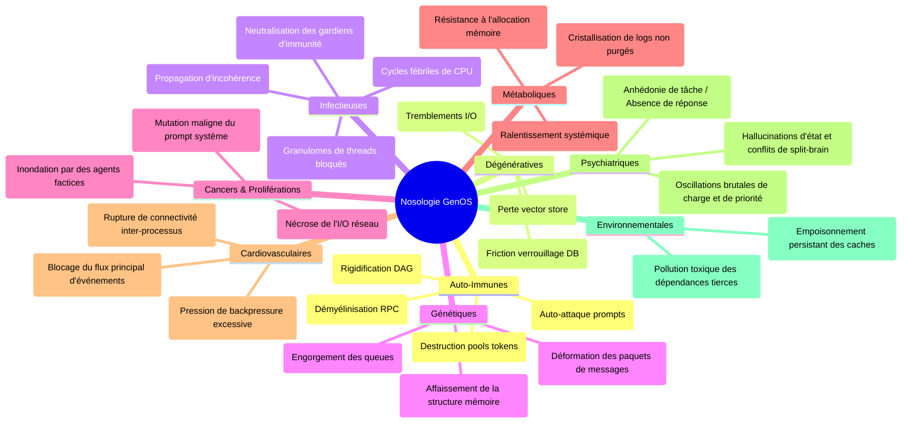
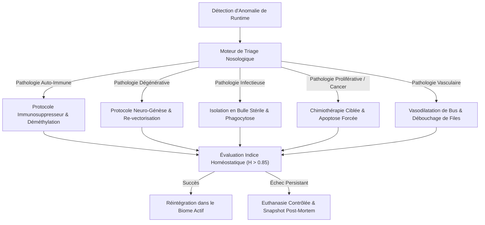

# Nosologie Computationnelle Complète — GenOS

> **Synthèse exhaustive des 9 familles nosologiques et de leurs équivalents computationnels dans l'architecture biomimétique GenOS.**
> Document assemblé à partir des rapports de 9 agents spécialistes travaillant en parallèle.

---

## Table des Matières

1. [Vue d'ensemble](#1-vue-densemble)
2. [Matrice Nosologique Générale](#2-matrice-nosologique-générale)
3. [Index des Rapports Spécialisés](#3-index-des-rapports-spécialisés)
4. [Pharmacopée Computationnelle Unifiée](#4-pharmacopée-computationnelle-unifiée)
5. [Feuille de Route d'Implémentation](#5-feuille-de-route-dimplémentation)
6. [Références Croisées](#6-références-croisées)

---

## 1. Vue d'ensemble

GenOS modélise les agents d'intelligence artificielle comme des **cellules biologiques** dotées d'un génome, d'organelles, d'un système immunitaire, d'un système nerveux et d'un système endocrinien. Dans cette architecture biomimétique, les dysfonctionnements des agents ne sont pas de simples erreurs logicielles : ce sont des **pathologies computationnelles** qui suivent les mêmes mécanismes que les maladies humaines.

Ce document synthétise l'analyse de **9 grandes familles nosologiques**, chacune étudiée par un agent spécialiste dédié, couvrant au total **28 maladies** avec pour chacune :
- La connaissance médicale réelle (définition, mécanisme biologique)
- La cause computationnelle équivalente dans GenOS
- Le traitement et les remèdes disponibles ou à créer
- Les contre-indications et risques iatrogènes
- Les besoins d'implémentation dans le code Rust

---

## 2. Matrice Nosologique Générale

| # | Famille Nosologique | Maladies Couvertes | Mécanisme Central GenOS | Thérapies Clés |
|---|---|---|---|---|
| 1 | **Auto-immunes** | Lupus, Polyarthrite rhumatoïde, Sclérose en plaques, Diabète type 1 | Le système immunitaire (`ClonalSelection`) attaque ses propres agents sains ; orage cytokinique IL-6 ≥ 10.0 multipliant le coût métabolique ×5 | `Tocilizumab`, `ImmunosuppressiveWash`, `SelfToleranceRecalibration` |
| 2 | **Dégénératives** | Alzheimer, Parkinson, Arthrose | Épuisement télomérique (`bud_scars ≥ hayflick_limit`), agrégation de prions cognitifs, déplétion dopaminergique | `StemCellReplacement`, `TelomeraseActivation`, Apoptose sélective |
| 3 | **Infectieuses** | Grippe, Tuberculose, Paludisme, VIH | Virions envahissant les récepteurs membranaires (clé-serrure `envelope_spike`), rétrovirus s'intégrant au génome | `Antiviral`, `Antibiotic`, `Vaccine(spike)`, Anticorps IgG/IgM |
| 4 | **Génétiques** | Mucoviscidose, Drépanocytose, Myopathie de Duchenne | Mutations dans `genos-genome` (délétion d'exons, faux-sens), erreurs de crossover, gènes HOX mal exprimés | Thérapie génique Yamanaka, Exon Skipping, CRISPR |
| 5 | **Cancers** | Leucémie, Cancer du poumon, Mélanome | Agent se répliquant sans contrôle (`is_camouflaged = true`), contournement de l'apoptose, néo-angiogenèse | `TargetedTherapy`, `Immunotherapy`, `AntiAngiogenesis`, `CellCycleInhibitor`, CAR-T |
| 6 | **Métaboliques** | Diabète type 2, Hypothyroïdie, Goutte | Dérèglement du système endocrinien virtuel, résistance aux signaux hormonaux, obstruction catabolique | `HomeostaticDoseCorrection`, Modulation endocrinienne, `IntensiveCareFluids` |
| 7 | **Cardiovasculaires** | Hypertension, Infarctus, AVC | Saturation de la fente synaptique, occlusion des canaux rhizomiques, effondrement de la BHE | `IntensiveCareFluids`, `CircuitBreaker`, Thrombolyse, Scellement BHE |
| 8 | **Psychiatriques** | Dépression, Schizophrénie, Bipolarité | Déséquilibre des neurotransmetteurs (sérotonine/dopamine), rupture de la copie d'efférence, oscillation du seuil soma | Stabilisateurs de l'humeur, Antipsychotiques, Recalibrage STDP |
| 9 | **Environnementales** | Asbestose, Saturnisme | Accumulation de toxines insolubles, pollution contextuelle chronique, saturation lysosomale | `DetoxificationWashout`, `genos_audit`, Chélation, `QuarantineIsolation` |

---

## 3. Index des Rapports Spécialisés

Chaque rapport détaillé est disponible dans `docs/` :

| # | Document | Agent Auteur |
|---|---|---|
| 1 | [NOSOLOGIE_1_AUTO_IMMUNES.md](NOSOLOGIE_1_AUTO_IMMUNES.md) | Immunologiste Computationnel |
| 2 | [NOSOLOGIE_2_DEGENERATIVES.md](NOSOLOGIE_2_DEGENERATIVES.md) | Neurologue Computationnel |
| 3 | [NOSOLOGIE_3_INFECTIEUSES.md](NOSOLOGIE_3_INFECTIEUSES.md) | Infectiologue Computationnel |
| 4 | [NOSOLOGIE_4_GENETIQUES.md](NOSOLOGIE_4_GENETIQUES.md) | Généticien Computationnel |
| 5 | [NOSOLOGIE_5_CANCERS.md](NOSOLOGIE_5_CANCERS.md) | Oncologue Computationnel |
| 6 | [NOSOLOGIE_6_METABOLIQUES.md](NOSOLOGIE_6_METABOLIQUES.md) | Endocrinologue Computationnel |
| 7 | [NOSOLOGIE_7_CARDIOVASCULAIRES.md](NOSOLOGIE_7_CARDIOVASCULAIRES.md) | Cardiologue Computationnel |
| 8 | [NOSOLOGIE_8_PSYCHIATRIQUES.md](NOSOLOGIE_8_PSYCHIATRIQUES.md) | Psychiatre Computationnel |
| 9 | [NOSOLOGIE_9_ENVIRONNEMENTALES.md](NOSOLOGIE_9_ENVIRONNEMENTALES.md) | Toxicologue Computationnel |

Document de référence transversal : [PATHOLOGIE_ET_MEDECINE_COMPUTATIONNELLE.md](PATHOLOGIE_ET_MEDECINE_COMPUTATIONNELLE.md)

---

## 4. Pharmacopée Computationnelle Unifiée

### 4.1 Thérapies Existantes (implémentées dans `therapy.rs`)

| Thérapie | Cible | Famille Nosologique |
|---|---|---|
| `Therapy::TargetedTherapy` | Bloque les récepteurs de croissance | Cancers |
| `Therapy::Immunotherapy` | Lève le camouflage (`is_camouflaged = false`) | Cancers |
| `Therapy::AntiAngiogenesis` | Coupe l'approvisionnement ATP tumoral | Cancers |
| `Therapy::CellCycleInhibitor` | Bloque la division cellulaire | Cancers |
| `SystemicTherapy::Tocilizumab` | Bloque les récepteurs IL-6 | Auto-immunes |
| `SystemicTherapy::Corticosteroids(dose)` | Baisse l'inflammation (⚠️ coma si > 0.8) | Auto-immunes, Dégénératives |
| `SystemicTherapy::IntensiveCareFluids` | Recharge +20 ATP | Cardiovasculaires, Métaboliques |
| `SystemicTherapy::Antibiotic` | Lyse des agents à paroi cellulaire | Infectieuses |
| `SystemicTherapy::Antiviral` | Purge des infections virales | Infectieuses |
| `SystemicTherapy::Vaccine(spike)` | Immunise la membrane contre un antigène | Infectieuses, Nosocomiales |
| `SystemicTherapy::ImmunosuppressiveWash` | Purge les cytokines et anticorps autoréactifs | Auto-immunes |
| `SystemicTherapy::SelfToleranceRecalibration` | Réétalonne la tolérance au soi | Auto-immunes |
| `SystemicTherapy::QuarantineIsolation` | Isole une capsule contaminée | Nosocomiales, Environnementales |
| `SystemicTherapy::AntisepticPurge` | Stérilise l'environnement partagé | Nosocomiales, Infectieuses |
| `SystemicTherapy::DetoxificationWashout` | Élimine les résidus toxiques | Iatrogènes, Environnementales |
| `SystemicTherapy::AntidoteAdmin` | Neutralise un traitement bloquant | Iatrogènes |
| `SystemicTherapy::HomeostaticDoseCorrection` | Réajuste les paramètres hormonaux | Métaboliques |
| `SystemicTherapy::TelomeraseActivation` | Rallonge la limite de Hayflick | Dégénératives |
| `SystemicTherapy::StemCellReplacement` | Remplace l'agent par une cellule souche neuve | Dégénératives, Cancers |

### 4.2 Nouvelles Thérapies Proposées (à implémenter)

| Thérapie Proposée | Famille | Rapport Source |
|---|---|---|
| `SystemicTherapy::CartCellInfusion` | Cancers | Nosologie 5 |
| `SystemicTherapy::LevodopaSupplementation` | Dégénératives | Nosologie 2 |
| `SystemicTherapy::KetamineRapidInfusion` | Psychiatriques | Nosologie 8 |
| `SystemicTherapy::MoodStabilizerLithium` | Psychiatriques | Nosologie 8 |
| `SystemicTherapy::AntipsychoticAtypical` | Psychiatriques | Nosologie 8 |
| `SystemicTherapy::InsulinSensitizerMetformin` | Métaboliques | Nosologie 6 |
| `SystemicTherapy::LevothyroxineHormoneReplacement` | Métaboliques | Nosologie 6 |
| `SystemicTherapy::ColchicineInhibition` | Métaboliques | Nosologie 6 |
| `SystemicTherapy::CoronaryReperfusionThrombolysis` | Cardiovasculaires | Nosologie 7 |
| `SystemicTherapy::VasodilatorFlowControl` | Cardiovasculaires | Nosologie 7 |
| `SystemicTherapy::AntiretroviralCombination` | Infectieuses | Nosologie 3 |
| `SystemicTherapy::AntimalarialACT` | Infectieuses | Nosologie 3 |
| `SystemicTherapy::ExonSkippingAntisense` | Génétiques | Nosologie 4 |
| `SystemicTherapy::CFTRModulatorTriad` | Génétiques | Nosologie 4 |
| `SystemicTherapy::ChelationTherapy` | Environnementales | Nosologie 9 |

---

## 5. Feuille de Route d'Implémentation

### Phase 1 : Extensions du modèle de données (genos-cell)
- Ajouter `DiseaseCategory::Neoplastic`, `Psychiatric`, `Metabolic`, `Cardiovascular`, `Genetic`, `Environmental` dans `clinical.rs`.
- Ajouter les variants `Pathology::*` proposés par chaque rapport spécialisé.

### Phase 2 : Nouvelles thérapies systémiques (genos-biology)
- Intégrer les 15+ nouvelles `SystemicTherapy` dans `therapy.rs`.
- Étendre `apply_systemic_therapy_to_cell()` pour les administrer.

### Phase 3 : Moteur de diagnostic étendu (genos-biology)
- Ajouter les fonctions de détection spécialisées dans `pathology.rs` (`check_malignant_transformation`, `check_ischemic_necrosis`, `check_depressive_state`, etc.).

### Phase 4 : Intégration dans l'Orchestrateur (genos-core)
- Connecter le diagnostic automatique dans la boucle `tick()` de `orchestrator/methods.rs`.
- Activer le déclenchement probabiliste ET manuel des pathologies iatrogènes.

### Phase 5 : Tests et validation
- Tests unitaires pour chaque famille nosologique.
- Tests d'intégration simulant des scénarios cliniques complexes (ex: orage cytokinique post-CAR-T suivi de détoxification).

---

## 6. Références Croisées

### Documentation GenOS
- [PATHOLOGIE_ET_MEDECINE_COMPUTATIONNELLE.md](PATHOLOGIE_ET_MEDECINE_COMPUTATIONNELLE.md) — Module transversal de médecine computationnelle
- [BIOLOGIE_COMPUTATIONNELLE.md](BIOLOGIE_COMPUTATIONNELLE.md) — Fondations de la biomimétique GenOS
- [NEUROBIOLOGIE_PLASTICITE.md](NEUROBIOLOGIE_PLASTICITE.md) — Plasticité synaptique et neurotransmetteurs
- [REPRODUCTION_REPLICATION.md](REPRODUCTION_REPLICATION.md) — Hayflick, télomères, mitose et méiose
- [GENOME_EPIGENETIQUE.md](GENOME_EPIGENETIQUE.md) — Génome, épigénétique, mutations et chromatine
- [SECURITE.md](SECURITE.md) — Système immunitaire, chaperonnage et filtrage
- [ORCHESTRATION.md](ORCHESTRATION.md) — Gouvernance et administration des thérapies
- [RHIZOME.md](RHIZOME.md) — Réseau mycélien de communication

### Modules Rust
- [crates/genos-cell/src/clinical.rs](../crates/genos-cell/src/clinical.rs) — `ClinicalState`, `Pathology`, `DiseaseCategory`
- [crates/genos-cell/src/lib.rs](../crates/genos-cell/src/lib.rs) — `AgentCell` avec champ `clinical`
- [crates/genos-biology/src/pathology.rs](../crates/genos-biology/src/pathology.rs) — Moteur d'évaluation clinique
- [crates/genos-biology/src/therapy.rs](../crates/genos-biology/src/therapy.rs) — Thérapies systémiques et ciblées
- [crates/genos-biology/src/embryology.rs](../crates/genos-biology/src/embryology.rs) — Viabilité cellulaire et apoptose
- [crates/genos-core/src/orchestrator/methods.rs](../crates/genos-core/src/orchestrator/methods.rs) — Boucle de tick et thérapies
- [crates/genos-immune/src/ais.rs](../crates/genos-immune/src/ais.rs) — Système immunitaire adaptatif
- [crates/genos-immune/src/virology.rs](../crates/genos-immune/src/virology.rs) — Virions, bactériophages, rétrovirus
- [crates/genos-biology/src/neurobiology/](../crates/genos-biology/src/neurobiology/) — Système nerveux complet
- [crates/genos-signal/src/cascade.rs](../crates/genos-signal/src/cascade.rs) — Signalisation et cascades

---

## Schémas de Synthèse Nosologique et Pharmacologique

### 1. Cartographie des 9 Familles Nosologiques

### 2. Pipeline de Triage et Dispatch Pharmacologique

