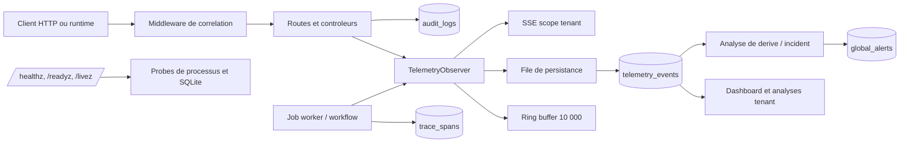

# Observabilite GenOS

## Definition

L'observabilite GenOS est l'ensemble des signaux qui permettent de reconstruire ce que le systeme a recu, decide, execute et persiste : evenements de telemetrie, journaux d'audit, spans de traces, identifiants de correlation, mesures par tenant, probes de sante et incidents. Son implementation est principalement un service Node.js, un bus d'evenements en memoire, SQLite et des endpoints HTTP/SSE.

Elle repond a la question operationnelle « que s'est-il passe, pour quel tenant et quel run ? ». Elle ne garantit pas que chaque evenement est durable, que chaque appel est trace de bout en bout, ni qu'un replay reconstruit reexecute le calcul. La persistance de la telemetrie est asynchrone et perd le plus ancien evenement lorsque sa file est pleine. Cette limite doit guider les alertes et les preuves critiques : celles-ci doivent disposer d'un enregistrement transactionnel ou d'un export externe lorsque leur perte est inacceptable.

## Vocabulaire et frontieres

| Signal | Support GenOS | Objet observable | Limite importante |
| --- | --- | --- | --- |
| evenement de telemetrie | `telemetry_events`, buffer et SSE | action, agent, severite, payload, tenant | ecriture best effort asynchrone |
| audit log | `audit_logs` | acteur, decision, ressource et raison | pas de chaine immuable globale dans le service observe |
| trace | groupe de `trace_spans` partageant `trace_id` | duree et resultat d'une operation composee | correlation non automatique pour tous les chemins |
| trace span | `trace_spans` | unite temporelle, parent, entrees/sorties/erreur | agent obligatoire, pas de `workflow_run_id` relationnel |
| request ID | header HTTP et `AsyncLocalStorage` | requete serveur | pas un identifiant de workflow persistant |
| trace ID | header HTTP/payload ou genere par workflow | parcours HTTP ou execution | format non uniforme entre HTTP et workflow |
| alert/incidence | `global_alerts` | backlog d'incident scope tenant | une alerte n'est pas une notification garantie |

## Architecture



Les composants decisifs sont [backend/src/services/telemetryObserver.js](../backend/src/services/telemetryObserver.js), [backend/src/controllers/telemetryController.js](../backend/src/controllers/telemetryController.js), [backend/src/controllers/traceController.js](../backend/src/controllers/traceController.js), [backend/src/services/jobWorker.js](../backend/src/services/jobWorker.js) et [backend/src/controllers/healthController.js](../backend/src/controllers/healthController.js).

## Telemetry events

`TelemetryObserver` recoit les appels `emitEvent()`. Il enrichit le payload avec le scope de tenant et, lorsqu'il existe dans le contexte HTTP, avec `traceId` et `requestId`. Il redacte recursivement les valeurs dont la cle contient `token`, `secret`, `password`, `passwd`, `api-key`, `authorization`, `cookie` ou `credential`, puis :

1. place l'evenement dans un ring buffer de 10 000 elements ;
2. le diffuse aux clients SSE dont `organizationId` et `projectId` sont identiques ;
3. l'ajoute a une file de persistance ;
4. emet l'evenement Node `telemetry` et le transmet au service webhook.

La ligne `telemetry_events` porte `event_id`, `session_id`, `agent_id`, `event_type`, `action`, `detail`, `payload_json`, `severity`, `organization_id`, `project_id` et `created_at`. Le `session_id` est pris de l'evenement, de `payload.sessionId`, de `executionRunId`/`runId`, ou construit comme `agent-session-<agentId>`. Cette convention aide l'analyse mais ne constitue pas une cle etrangere vers une mission ou un workflow.

Quelques types critiques declenchent en plus un `provenance_record` avec un hash SHA-256 du payload canonique local : `BELIEF_CREATED`, `BELIEF_UPDATED`, `AGENT_COMPLETED`, `AGENT_FAILED`, `TOOL_CALL_COMPLETED`, `MCTS_NODE_PRUNED` et `EVALUATION_COMPLETED`. Le hash protege l'integrite du contenu enregistre ; il ne prouve ni la verite metier, ni l'identite d'un systeme externe.

### Buffer, file et perte controlee

Le ring buffer evince le plus ancien element apres 10 000 evenements. La file de persistance est plafonnee par `GENOS_TELEMETRY_QUEUE_CAPACITY` (4 096 par defaut). Lorsqu'elle est pleine, le service evince aussi l'element le plus ancien et incremente `droppedEvents`. Les erreurs SQLite sont comptees dans `persistenceErrors`, loguees, puis le drain continue avec les evenements suivants.

La disponibilite de l'API de streaming ne doit donc pas etre confondue avec une garantie de livraison. SSE n'a pas de replay par curseur, d'acknowledgement ni de persistance transactionnelle avec l'action observee. Utiliser `getPersistenceStatus()` dans les dashboards et exporter les evenements de conformite vers un collecteur durable est recommande.

## Audit logs

`audit_logs` enregistre l'acteur, l'agent optionnel, l'action, la ressource, la decision, la raison, un payload, son hash eventuel et le scope `organization_id`/`project_id`. Des chemins de controle tels que l'execution MCP ou les actions de control plane ecrivent directement dans cette table. Le lecteur de plateforme impose un scope tenant et limite le resultat.

L'audit repond a « qui a autorise ou refuse quelle action, et pourquoi ? », alors que la telemetrie decrit le deroulement operationnel. Un evenement de telemetrie n'est pas automatiquement un audit log, et inversement. Pour une action reglementee, ecrire les deux signaux avec les memes identifiants de correlation et conserver l'artefact/evidence associe.

Le schema contient `payload_hash`, mais l'observateur ne construit pas une chaine de hash globale, une signature externe, un WORM store ou une retention legale. SQLite reste modifiable par une identite ayant acces au fichier. La non-repudiation exige donc stockage append-only externe, controle d'acces, horodatage et signature hors processus.

## Traces, spans et correlation

Une trace est un ensemble de spans partageant `trace_id`. Un span contient :

- `id`, `trace_id`, `parent_span_id` et `name` ;
- `agent_id` et `workspace_id` eventuel ;
- horodatages `start_time` et `end_time` en millisecondes ;
- `inputs_json`, `outputs_json` et `error` ;
- scope tenant et projet.

L'endpoint d'ingestion accepte des representations adaptees de frameworks, verifie les identifiants et noms (512 caracteres), le parent dans la meme trace et le meme tenant, les timestamps et les payloads (256 KiB par entree/sortie, erreur 16 KiB). Les routes de lecture appliquent toujours le scope tenant.

Le worker de workflow produit une trace `trace-<workflow_run.id>`. Chaque noeud cree un span `workflow.<node.id>`, puis emet `WORKFLOW_NODE_COMPLETED` ou `WORKFLOW_NODE_FAILED` avec `runId`, `traceId` et `nodeId`. Le checkpoint et la sortie de `workflow_runs` contiennent aussi le `traceId`. Cette est la correlation la plus forte entre workflow, noeud, trace et telemetrie disponible dans le code actuel.

Il n'existe pas de colonnes relationnelles universelles `mission_id`, `workflow_run_id` ou `request_id` dans `trace_spans` et `telemetry_events`. La correlation des missions/agents/workflows est donc hybride : `agent_id`, `session_id`, `runId` et `traceId` vivent selon les cas dans le payload JSON. Les requetes analytiques doivent tolerer les donnees anciennes ou les emetteurs qui ne fournissent pas toutes ces cles.

La route de « replay » de trace calcule un SHA-256 d'une liste de spans ordonnee et retourne `RECONSTRUCTED`, `replayVerified: false`, `qualityGuarantee: false` et `requiresReexecution: true`. Elle est un export/reconstruction auditable, pas la reexecution deterministe des appels originaux.

## Request IDs et Trace IDs HTTP

Le premier middleware Express attribue :

- `requestId` depuis `req.id`, `X-Request-Id`, ou `req-<UUID>` ;
- `traceId` depuis `X-Trace-Id`, ou `trace-<timestamp>-<alea>`.

Ils sont renvoyes en headers `X-Request-Id` et `X-Trace-Id`, places dans `AsyncLocalStorage`, puis recuperes par `TelemetryObserver`. Le gestionnaire d'erreur les restitue aussi dans l'enveloppe JSON d'erreur.

Le client peut fournir les deux headers. Ils sont des identifiants de correlation, pas une preuve d'identite ; une passerelle de confiance devrait generer ou valider leurs formats pour eviter collision, pollution d'index ou correlation mensongere. Le format HTTP de `traceId` n'est pas impose au format W3C Trace Context et differera du `trace-<runId>` genere par les workflows. Un adaptateur de tracing externe doit normaliser explicitement ces conventions.

## Metriques par tenant

Le tenant est porte par le couple `(organization_id, project_id)`. `telemetryScope()` le derive du payload, de `eventData.tenant` ou de champs top-level, et les flux SSE ne transmettent un evenement qu'a un client du meme couple. Les endpoints de telemetrie et traces ajoutent eux aussi des predicats tenant dans SQLite.

Le dashboard calcule par tenant :

- nombre total d'actions dans `telemetry_events` ;
- nombre d'agents distincts comme approximation de taches ;
- agents actifs rattaches aux workspaces du tenant ;
- heatmap de 364 jours issue des evenements ;
- workspaces recents et agents en cours.

L'evaluation de swarm exploite les actions de telemetrie pour calculer une entropie et une derive cognitive. Pour une distribution de frequences $p(a_i)$, l'entropie de Shannon est :

$$
H(A) = -\sum_i p(a_i)\log_2 p(a_i)
$$

L'entropie normalisee est $H(A) / \log_2(k)$ lorsque $k$ actions distinctes sont observees. Le service considere notamment une repetition dominante lorsque la frequence maximale atteint 85 % sur au moins quatre actions, et peut detecter des cycles periodiques. Ces mesures de comportement aident a prioriser une investigation ; elles ne mesurent ni l'intelligence, ni la qualite d'une sortie.

## Biologie : homeostasie informationnelle

La metaphore biologique de GenOS peut etre utile si elle reste precise :

| Analogie | Equivalence logicielle | Ce qu'elle n'implique pas |
| --- | --- | --- |
| systeme nerveux | telemetrie qui relaie un signal vers superviseur, stockage et UI | perception objective ni couverture exhaustive |
| homeostasie | probes, seuils de queue, alertes et limitation de ressources | auto-guerison garantie |
| nociception | evenement `warning`/`error` et incident a investiguer | diagnostic causal automatique |
| memoire | retention SQLite, provenance et snapshots | conservation infinie ni verite du souvenir |
| entropie cognitive | diversite des actions d'un swarm | mesure neuroscientifique d'un etat mental |

La bonne lecture est donc celle d'une boucle de regulation : observer, mesurer, comparer a des seuils, alerter, puis decider une action de reprise ou une escalade humaine. Les mots biologiques rendent la boucle lisible ; les invariants restent des compteurs, des requetes SQL et des politiques explicites.

## Health checks et readiness

Les probes publiques sont definies avant le middleware d'authentification :

| Endpoint | Semantique | Code attendu |
| --- | --- | --- |
| `/healthz` | liveness : la boucle d'evenements HTTP repond | `200`, sans verification SQLite |
| `/readyz` | readiness : SQLite repond et file telemetrie non saturee | `200` ou `503` |
| `/livez` | startup/dependance : meme verification que readiness | `200` ou `503` |

Readiness execute `SELECT 1` et refuse lorsque la queue est au plafond. Entre 75 % et 100 % de capacite, la reponse reste `200` mais porte `telemetry: "degraded"`. A capacite egale ou superieure au plafond, elle renvoie `503`. Liveness reste volontairement independante de SQLite afin d'eviter une boucle de redemarrage lorsque seule la dependance est indisponible.

Une probe ne surveille ni l'espace disque, ni Docker, ni un fournisseur de modele, ni la latence de webhook. Ces dependances necessitent des indicateurs et checks deployes au niveau de leur adaptateur ou de l'infrastructure.

## Alertes et process d'incident

`global_alerts` stocke un titre, statut (`blocked`, `question`, `running`, `resolved`), agent, workspace, severite, confiance, contexte et tenant. Les routes incidents l'exposent scopees ; une action de kill marque une alerte resolue et emet `TASK_CANCELLED`. Le replay d'incident charge au maximum 10 000 evenements du tenant et construit une vue causale par `platformSafety`.

Le processus recommande est :

1. Emettre des evenements structures avec severite, `agentId`, `runId` et `traceId`.
2. Appliquer une regle de detection dans le service proprietaire ou l'observabilite externe.
3. Creer une alerte avec le snapshot de contexte et les identifiants de correlation.
4. Investiguer dans les spans, telemetries, audit logs et evidence associee.
5. Resoudre, annuler ou escalader l'action en conservant une decision d'audit.

Les alertes persistees sont un backlog, non un systeme d'astreinte : aucun connecteur de paging, SLO, deduplication globale ou escalade de delai n'est garanti par ce schema seul. Un webhook est emis par la telemetrie, mais sa livraison doit etre observee et retryee par l'infrastructure qui l'heberge.

## Retention et volumetrie

Tous les 1 000 evenements effectivement ecrits, `TelemetryObserver.pruneHistory()` conserve les plus recentes lignes :

| Table | Defaut | Variable | Minimum impose |
| --- | ---: | --- | ---: |
| `telemetry_events` | 100 000 lignes | `GENOS_TELEMETRY_RETENTION_ROWS` | 1 000 |
| `trace_spans` | 100 000 lignes | `GENOS_TRACE_RETENTION_ROWS` | 1 000 |
| `model_job_tokens` | 500 000 lignes | `GENOS_TOKEN_RETENTION_ROWS` | 1 000 |
| `audit_logs` | meme seuil que telemetrie | `GENOS_TELEMETRY_RETENTION_ROWS` | 1 000 |

La retention est globale, ordonnee par identifiant ou date, pas par tenant, duree, severite ou obligation legale. Un tenant tres actif peut donc evincer l'historique d'un autre tenant. Les tailles de payload, la duree de retention et le volume disque ne sont pas predits par ces plafonds de lignes.

Un budget grossier de stockage est :

$$
V \approx N_e\bar{s_e} + N_s\bar{s_s} + N_a\bar{s_a} + I
$$

ou $N$ est le nombre de lignes conservees, $\bar{s}$ leur taille moyenne serialisee et $I$ la taille des indexes/WAL SQLite. Mesurer $\bar{s}$ sur les payloads reels est indispensable : les entree/sortie de spans peuvent atteindre 256 KiB chacune et dominer largement le cout. Prevoir rotation, sauvegarde, chiffrement au repos, export vers une plateforme de logs et politique de purge par tenant avant une charge de production soutenue.

## Exemple : diagnostiquer un workflow en echec

Un workflow `run-42` cree `trace-run-42`. Le noeud `summarize` echoue ; le worker ecrit un span avec `error`, puis emet :

```json
{
  "eventType": "WORKFLOW_NODE_FAILED",
  "agentId": "summarize",
  "action": "WORKFLOW_STEP",
  "severity": "error",
  "payload": {
    "runId": "run-42",
    "traceId": "trace-run-42",
    "nodeId": "summarize",
    "organizationId": "org-a",
    "projectId": "project-red"
  }
}
```

L'operateur filtre d'abord les traces par tenant puis charge `GET /api/traces/trace-run-42`. Il compare les entrées/sorties du span avec la ligne `workflow_runs.output_json`, cherche les telemetries du `runId`, puis consulte l'audit du tool appele. Une alerte peut ensuite enregistrer le resume, la severite et les IDs. La route de replay produit une reconstruction verifiable par hash mais l'operateur doit relancer le workflow dans un environnement controle pour valider un correctif.

## Comparaison avec le marche

| Approche | Force habituelle | Position GenOS |
| --- | --- | --- |
| OpenTelemetry + Jaeger/Tempo | standard de contexte, exporters, sampling et traces distribuees | GenOS persiste des spans proches d'OTel mais ne fournit pas nativement exporter, propagation W3C uniforme ni collector distribue |
| Datadog, New Relic, Dynatrace | correlation logs-metrics-traces, SLO, alerting et retention geree | GenOS lie les signaux aux agents et tenants, mais l'alerte, le stockage et les SLO restent a integrer |
| LangSmith, Langfuse, Arize Phoenix | traces LLM, prompts, couts, evaluations et jeux de donnees | GenOS ajoute workflow, MCP, evidence et controle de capsule ; ses payloads doivent etre minimises pour eviter les fuites de prompt/secrets |
| Temporal | workflow durable, historique et correlation de runs | `workflow_runs` et spans GenOS apportent de la visibilite, mais ne remplacent pas un historique event-sourced et une reprise durable complete |
| Prometheus + Grafana | metriques numeriques, alert rules et dashboards | GenOS a des compteurs applicatifs et dashboards SQL, mais pas d'endpoint Prometheus ni de moteur de regles dedie observe ici |

La valeur specifique de GenOS est la correlation de signaux avec l'agent, le tenant, l'evidence et les politiques de mission. Pour une exploitation robuste, il doit etre complete par une plateforme de telemetry externe lorsque la retention, les alertes et la securite de logs deviennent critiques.

## Verification

Les contrats centraux sont couverts, entre autres, par :

```powershell
node backend/tests/test_deployment_health.js
node backend/tests/test_error_correlation.js
node backend/tests/test_trace_tenant_scope.js
node backend/tests/test_session_telemetry_identity.js
node backend/tests/test_swarm_metrics_scope.js
node backend/tests/test_trace_replay_semantics.js
```

Ces tests verifient les invariants applicatifs. Ils ne prouvent pas la capacite SQLite sous charge, la livraison SSE/webhook, l'absence de fuite dans un payload libre, ni les garanties d'une plateforme de monitoring externe.