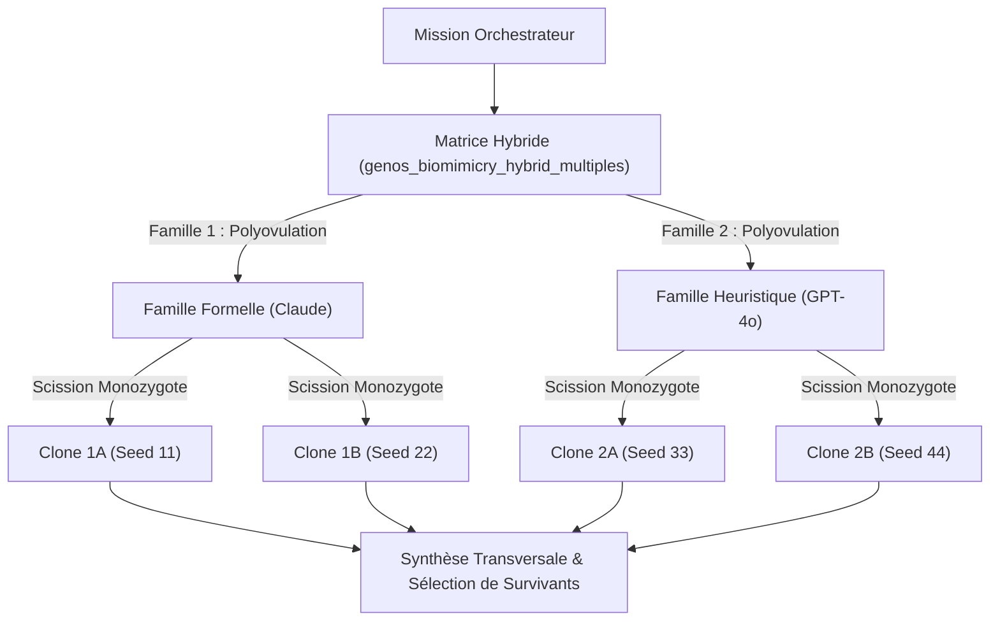

# Orchestration GenOS

## 1. Définition

L’orchestration dans GenOS est le mécanisme de planification, de partitionnement, d’exécution et de validation d’une mission complexe en plusieurs branches concurrentes, avec une barrière de preuve avant promotion ou fusion. Le système ne “décide” pas seulement quelles tâches lancer : il encadre la mission par des limites, des gates de décision, des preuves de validité, des budgets de tokens, des sélections de survivants, et des mécanismes de reprise en cas d’échec.

Le cœur fonctionnel est réparti entre :

- [backend/src/services/autonomousOrchestrationService.js](../backend/src/services/autonomousOrchestrationService.js) : construction du plan d’autonomie, phases, workers, budget, gates.
- [backend/src/services/agentRoundService.js](../backend/src/services/agentRoundService.js) : sélection de survivants et continuation après l’étape d’évaluation initiale.
- [backend/src/services/agentFleetService.js](../backend/src/services/agentFleetService.js) : création des workers autonomes, barrière d’évidence, quiescence, synthèse finale.
- [backend/src/services/agentOrchestrationState.js](../backend/src/services/agentOrchestrationState.js) : état partagé, maps de missions, continuations, barrages et télémétrie.
- [backend/src/services/tokenAllocationService.js](../backend/src/services/tokenAllocationService.js) : budget initial/continuation, mise en place de la successives halving.
- [backend/src/services/workerFailureRecoveryService.js](../backend/src/services/workerFailureRecoveryService.js) : classification des échecs, décisions de récupération et prompt de reprise.
- [backend/src/services/inferenceGatewayService.js](../backend/src/services/inferenceGatewayService.js) : régulation de la file d’inférence et équité entre tenants/projets.

Le principe est simple et strict : aucune conclusion d’un worker n’est promue comme “solution” sans preuve, provenance, tests, et validation de cohérence.

---

## 2. Peut-être pas un “orchestrateur générique”, mais un orchestrateur de preuve

GenOS ne se contente pas d’une orchestration par file de tâches. Il applique une logique de contrôle multi-niveaux :

1. décomposer la mission en sous-problèmes ;
2. affecter des workers spécialisés ;
3. exécuter en isolation ;
4. mesurer l’évidence ;
5. conserver seulement les branches solides ;
6. relancer ou récupérer uniquement selon des règles de sécurité ;
7. fusionner, rejeter ou escalader avec un journal explicite.

Les mécanismes de sécurité sont explicites :

- budget maximum par travailleur ;
- garde-fou sur l’autonomie du worker ;
- limite de fan-out et de profondeur ;
- arrêt quand l’évidence est insuffisante ;
- détection de boucles de reprise ;
- filtre d’équité des tâches par tenant/projet.

---

## 3. Définition mathématique de l’orchestration

La planification de mission est un budget d’allocation et d’évaluation.

Soit :

- $T$ : budget total de tokens disponible,
- $s$ : part allouée aux workers,
- $n$ : nombre de workers activés,
- $m$ : nombre de survivants retenus pour la deuxième phase,
- $E_i$ : score d’évidence du worker $i$,
- $P$ : ensemble de points de Pareto,
- $R$ : budget de reprise.

Le plan d’orchestration calcule :

$$
T_{worker} = T \cdot s
$$

avec :

$$
0 \le s \le 1
$$

et la validation de faisabilité :

$$
T_{worker} \ge n \cdot m_{min}
$$

où $m_{min}$ est le minimum de tokens par worker requis par la configuration.

La sélection de survivants suit un classement :

$$
\text{rank}(i) = \left[ i \in P,\ E_i \right]
$$

de sorte que les meilleurs candidats sont gardés en priorité, puis les branches dominées sont éliminées. La seconde phase reçoit un budget dédié :

$$
T_{cont} = T_{worker} - T_{init}
$$

et son allocation est répartie entre les survivants sélectionnés.

Le système de file d’inférence applique aussi une règle de justice d’accès :

$$
\text{tenantDepth}(k) \le C_{fairness}
$$

avec $C_{fairness}$ la capacité de queue par tenant/projet. Si un tenant dépasse la capacité, la requête est rejetée ou retardée afin d’éviter le starvation.

---

## 4. Analogies biologiques utiles (sans sur-interprétation)

GenOS emploie des termes biologiques pour décrire les mécanismes de gestion, mais la sémantique opérationnelle est technique et vérifiable :

- cellule = agent / worker ;
- genome = contrat de stratégie, prompt, paramètres, compétences ;
- fork = branche isolée d’exécution ;
- snapshot = point de restauration ;
- hypermutation = mutation contrôlée ;
- apoptosis = arrêt d’un agent ou d’une branche en raison de danger ou d’écart de sécurité ;
- chaperone = correction de sortie invalide ou maladformée ;
- immunité = rejet d’une sortie défaut de preuve.

L’intérêt est surtout que la métaphore aide à comprendre les invariants : l’orchestration est conçue comme un système vivant dans lequel les branches doivent être isolées, contrôlées et évaluées avant d’être promues.

---

## 5. Architecture du système

```text
Client / orchestrateur
        |
        v
[autonomousOrchestrationService]
        |
        +--> plan de mission
        |       - phases
        |       - workers
        |       - budget
        |       - decision gates
        |
        v
[agentFleetService]
        |
        +--> createAutonomousWorkers
        +--> evidence barrier
        +--> worker synthesis prompt
        |
        v
[agentRoundService]
        |
        +--> evaluate initial evidence
        +--> select survivors (successive halving)
        +--> dispatch continuation workers
        |
        v
[agentRecoveryService]
        |
        +--> detect failure / cycle / retry policy
        +--> mutate / fork / replace / bisect
        |
        v
[agentOrchestrationState]
        |
        +--> activeProcesses
        +--> pendingContinuations
        +--> autonomousRounds
        +--> pendingWorkerRecoveries
        +--> activeWorkerBarriers
        |
        v
[telemetry + database]
```

Les composants ne sont pas joués comme une chaîne linéaire. Ils interagissent via des états partagés dans [backend/src/services/agentOrchestrationState.js](../backend/src/services/agentOrchestrationState.js), ce qui permet un contrôle centralisé des branches, des reprises, des barrages et des continuations.

---

## 6. Décomposition des missions

Le plan de mission est construit dans [backend/src/services/autonomousOrchestrationService.js](../backend/src/services/autonomousOrchestrationService.js).

Le service détecte au moins cinq dimensions :

- niveau de risque ;
- complexité ;
- incertitude ;
- type de mission (sécurité, validation, recherche, mutation) ;
- portefeuille de stratégies disponibles.

À partir de ces variables, il détermine :

- les phases nécessaires ;
- le nombre de branches ;
- le nombre de workers à lancer ;
- la politique de budget ;
- les transitions autorisées selon le portfolio.

Exemple de phases typiques :

- `retrieve_and_diagnose`
- `snapshot_before_mutation`
- `counterfactual_forks`
- `evidence_and_evaluation`
- `controlled_mutation`
- `competition_and_selection`
- `replay_and_promote`

Les phases sont filtrées par le portefeuille de stratégies. Si certaines capacités ne sont pas disponibles, le plan est rendu “dégradé” ou “bloqué” plutôt que forcé.

### Invariant de décomposition

Le repo impose que les phases et les outils aient un contrat cohérent. La validation compare les `requiredTools` des phases avec les primitives présentes dans le portefeuille. Si un outil est absent, la phase est soit omise, soit le plan reste bloqué.

---

## 7. Dispatch des workers

Les workers sont créés par [backend/src/services/agentFleetService.js](../backend/src/services/agentFleetService.js) via `createAutonomousWorkers`. Les règles du repo sont claires :

- si aucun worker n’est requis, rien n’est créé ;
- si le budget est sous le seuil minimum, le dispatch est reporté ;
- si le fan-out dépasse la limite, l’exécution est rejetée ;
- si les branches ne correspondent pas au workspace racine, l’exécution est refusée.

Le code applique une limite explicite :

- `MAX_AUTONOMOUS_WORKERS = 3`
- fan-out supérieur à 3 = erreur `WORKER_FANOUT_LIMIT`

C’est une limite de sécurité. Elle évite qu’un orchestrateur transforme un problème en explosion de sous-tâches.

Le dispatch tient compte du budget :

- part allouée aux workers ;
- minimum tokens par worker ;
- budget de tokens pour l’orchestrateur ;
- potentiel redimensionnement avec `successive_halving_with_reallocation`.

---

## 8. Evidence barrier

La “evidence barrier” est le point de non-retour avant qu’un worker soit considéré valide. Elle est dans [backend/src/services/agentFleetService.js](../backend/src/services/agentFleetService.js) et dans la validation des dossiers d’évidence dans [backend/src/services/agentEvidenceService.js](../backend/src/services/agentEvidenceService.js).

Le barrier check fonctionne ainsi :

1. chaque worker publie un rapport d’évidence ;
2. le runtime enregistre l’événement ;
3. la suite est bloquée si le rapport manque de preuve ou d’éléments vérifiables ;
4. le système attend que tous les workers deviennent quiescents ;
5. ensuite, il synthétise les dossiers pour l’orchestrateur.

Le test [backend/tests/test_orchestration_evidence_barrier.js](../backend/tests/test_orchestration_evidence_barrier.js) montre le contract attendu :

- les dossiers doivent inclure des preuves ;
- des revendications non corroborées sont rejetées ;
- la barrière attend une stabilisation des états avant de conclure.

Le runtime ne se contente pas de “voir un `completed`” ; il exige qu’il existe une preuve concrète, parfois sous la forme de :

- `claims` avec `evidence` ;
- `tests` ;
- `provenance` ;
- `noAnswerProof` dans le cas d’absence de réponse.

Si l’évidence manque, le système émet un message `ORCHESTRATION_DECISION_BLOCKED` ou `WORKER_NO_ANSWER_PROVEN` selon le cas.

### 8.1 Synthèse hiérarchique multi-niveaux (Tissus / Clusters pour 100 agents)

Lorsqu'un essaim de 100 ouvriers termine son exécution, la concaténation brute de 100 dossiers complets dans le prompt de synthèse de l'orchestrateur racine pose deux problèmes critiques :
1. **Saturation de contexte** : 100 dossiers d'événements peuvent dépasser 100 000 tokens.
2. **"Lost in the Middle"** : L'attention des modèles de langage se dégrade fortement sur les informations situées au milieu de très longs contextes non structurés.

Pour résoudre cela, GenOS implémente une **synthèse hiérarchique par tissus** (`clusterWorkerDossiers`) :
- **Partitionnement tissulaire** : Les ouvriers sont regroupés en grappes de taille fixe (10 workers par cluster par défaut, ex. `tissue_cluster_1`, `tissue_cluster_2`...).
- **Condensation d'évidence (`dossierDigest`)** : Les preuves de chaque cluster sont préalablement condensées (revendications vérifiées, preuves d'impossibilité `noAnswerProof`, tests réussis).
- **Contrat de validation d'influence (`validateDossierInfluence`)** : Pour les flottes massives (> 12 workers), le modèle n'est pas contraint d'émettre 100 entrées JSON exhaustives dans un seul token de sortie : il cite obligatoirement les ouvriers pivots, contributeurs clés ou explicitement rejetés, dont les citations d'évidence sont vérifiées à 100% contre les dossiers réels.

---

## 9. Phases, gates et transitions

Les gates sont explicités dans le plan produit par `buildAutonomyPlan`. L’orchestrateur peut agir sur les événements de branche en appelant des outils comme :

- `genos_replay`
- `genos_snapshot`
- `genos_fork`
- `genos_evaluate_trajectories`
- `genos_merge`
- `genos_record_decision`
- `genos_security_coevolution`

Le service [backend/src/services/orchestrationDecisionService.js](../backend/src/services/orchestrationDecisionService.js) mappe les événements sur des actions de décision :

- `AGENT_FAILED` -> replay et re-diagnostique
- `HARD_INVARIANT_FAILURE` -> snapshot + quarantine + fork
- `AGENT_COMPLETED` avec preuve -> evaluation de l’évidence
- `PARASITISM_MANIFEST_READY` -> pression parasitaire isolée

Les transitions sont officiellement définies dans le plan :

- convergence + preuve -> `hierarchical_merge`
- divergence persistante -> `competitive_arena`
- branche parasite réussie -> `red_blue_coevolution`
- réserve budgétaire basse -> `network_silence`

Cela évite le comportement “toujours continuer” et impose une clôture par décision explicite.

---

## 10. Successive halving et sélection des survivants

Le mécanisme de sélection est implémenté dans [backend/src/services/tokenAllocationService.js](../backend/src/services/tokenAllocationService.js) et piloté dans [backend/src/services/agentRoundService.js](../backend/src/services/agentRoundService.js).

### Budget initial et continuation

La fonction `buildAllocation` répartit le budget en deux phases :

- initiale : toute la branche a un budget utile pour essayer une hypothèse ;
- continuation : seulement les meilleurs candidats reçoivent un surplus.

La logique est :

- $n$ workers en phase initiale ;
- $m = \lceil n/2 \rceil$ survivants au plus ;
- $T_{init}$ est réduit à un tiers ou au minimum viable ;
- $T_{cont}$ = reste du pool.

Formellement :

$$
T_{init} = \min(T_{worker}, \max(n \cdot m_{min}, \lfloor T_{worker}/3 \rfloor))
$$

et si le budget restant est trop faible :

$$
T_{cont} = 0
$$

ce qui force une exécution unique plutôt qu’un pseudo-algorithme de sélection sans vrai signal.

### Sélection des survivants

Après la phase exploratoire, le runtime :

1. collecte les résultats terminés ;
2. calcule le score d’évidence ;
3. applique l’évaluation de Pareto ;
4. choisit les candidats selon score et priorité de Pareto ;
5. alloue la continuation seulement aux survivants.

Un worker est gardé si :

- il est terminé ou idle ;
- il a un score d’évidence valide ;
- il appartient à la front de Pareto ou est classé parmi les meilleurs.

---

## 11. Continuations et recovery workers

Les continuation workers sont créés dans `advanceAutonomousRound` et `dispatchPendingContinuation` dans [backend/src/services/agentRoundService.js](../backend/src/services/agentRoundService.js).

Quand une branche est sélectionnée :

- le prompt est enrichi avec l’historique de preuve ;
- un nouveau budget est injecté ;
- la continuation réutilise le même worker s’il est toujours valide, sinon elle l’envoie dans une nouvelle mission de continuation.

Le système de reprise est dans [backend/src/services/workerFailureRecoveryService.js](../backend/src/services/workerFailureRecoveryService.js) et [backend/src/services/agentRecoveryService.js](../backend/src/services/agentRecoveryService.js).

Les décisions sont hiérarchisées :

- `conclude_no_answer` si une preuve stricte de non-existence est fournie ;
- `mutate_worker` pour sortie structurée invalide ou mutée ;
- `fork_worker` pour hypothèse falsifiée ;
- `bisect_and_rollback` pour régression/violation d’invariant ;
- `replace_worker` si le profil de worker ne convient plus ;
- `escalate_unresolved` si le budget de recouvrement est épuisé.

Le point important : la reprise est bornée. Le repo détecte aussi les cycles de récupération. Si une politique de récupération se répète, la décision est escaladée au lieu d’être bouclée sans fin.

---

## 12. Prévention des boucles d’orchestration

L’orchestration a plusieurs garde-fous contre les boucles :

### 12.1 Déduplication des actions

[L’orchestrationActionExecutor](../backend/src/services/orchestrationActionExecutor.js) rejette les actions dupliquées via un cache de `(orchestrator_id, source_event_id, tool)`.

### 12.2 Détection de cycle de récupération

Dans [backend/src/services/agentRecoveryService.js](../backend/src/services/agentRecoveryService.js), si la même catégorie d’échec réapparaît avec la même action, le runtime détecte un cycle et ne le réessaie pas indéfiniment.

### 12.3 Barrière de quiescence

Dans [backend/src/services/agentFleetService.js](../backend/src/services/agentFleetService.js), l’orchestrateur attend qu’aucun worker ne soit en cours de tâche ni en phase de continuation avant de considérer la vague terminée.

### 12.4 Timeouts et limites

Le runtime applique des limites de :

- profondeur de workflow ;
- taille d’un workspace copié ;
- nombre d’entrées ;
- tentatives de continuation ;
- tentatives de réparation ;
- fan-out de workers.

---

## 13. Limites de profondeur, fan-out et récursion

Le repo applique des gardes fortes à plusieurs niveaux.

### 13.1 Profondeur de workflow

Dans [backend/src/services/jobWorker.js](../backend/src/services/jobWorker.js), la profondeur d’exécution est plafonnée. Si une branche dépasse la limite, on lève une erreur au lieu de laisser le graphe se déformer.

### 13.2 Copie de workspace

Dans [backend/src/services/agentWorkspaceLifecycleService.js](../backend/src/services/agentWorkspaceLifecycleService.js), les sous-workspaces sont copiés avec :

- limite d’entrées ;
- limite de taille ;
- exclusion des `.git`, `node_modules`, `target` ;
- limite de profondeur de copie.

Si une copie dépasse les seuils, le système refuse explicitement la branche.

### 13.3 Fan-out et capacité de workers

Dans [backend/src/services/agentFleetWorkers.js](../backend/src/services/agentFleetWorkers.js) et [backend/src/services/workerGarageService.js](../backend/src/services/workerGarageService.js) :

- Par défaut : `MAX_ACTIVE_WORKERS = 3`, `MAX_AUTONOMOUS_WORKERS = 3` et capacité de projet `GENOS_MAX_ACTIVE_WORKERS_PER_PROJECT = 12`.
- Paramétrable pour les déploiements à grande échelle (jusqu'à 100+ agents) :
  - `GENOS_MAX_ACTIVE_WORKERS` : nombre maximal d'ouvriers actifs par orchestrateur (ex: `100`).
  - `GENOS_MAX_AUTONOMOUS_WORKERS` : limite de fan-out simultané lors de la création d'une flotte autonome.
  - `GENOS_MAX_ACTIVE_WORKERS_PER_PROJECT` : plafond total de workers actifs par projet (s'adapte automatiquement à `GENOS_MAX_ACTIVE_WORKERS`).
  - `GENOS_INFERENCE_MAX_CONCURRENT` et `GENOS_INFERENCE_TENANT_QUEUE_CAPACITY` : régulation de la file d'inférence (adaptée automatiquement à la taille de la flotte).
  - `GENOS_SQLITE_BUSY_TIMEOUT_MS` : délai de verrouillage SQLite (30 000 ms par défaut).

Pour opérer 100 agents simultanément de façon optimale, il est recommandé de structurer la mission en **tissus cellulaires** (ex: 10 escouades de 10 agents avec chacune sa cellule souche) plutôt qu'un essaim plat en *hub-and-spoke*.

### 13.4 Recursion / boucle de reprise

- `MAX_CONTINUATION_DISPATCH_ATTEMPTS = 3`
- `MAX_RECOVERY_ATTEMPTS = 3`

Après cela, le système escalade plutôt que de recréer un cycle infini.

---

## 14. Fairness entre agents, projets et tenants

La fair scheduling est assurée par [backend/src/services/inferenceGatewayService.js](../backend/src/services/inferenceGatewayService.js).

### 14.1 Priorité

- `interactive` : priorité élevée pour l’orchestrateur / plan review ;
- `bulk` : tâches lourdes de workers.

### 14.2 Équité par tenant

Le système a une clé de “fairness” par tenant/projet :

```js
fairnessKey = `${organizationId}:${projectId}`
```

Puis :

- le nombre d’éléments du tenant dans la queue est compté ;
- si le tenant dépasse la capacité, la tâche est rejetée ;
- l’algorithme force le tourniquet entre les tenants pour éviter le starve.

Cela évite qu’un grand projet monopolise l’inférence locale et pousse les branches plus petites à attendre indéfiniment.

### 14.3 Equilibre global

Le contrôleur a aussi une limite globale de concurrence (`GENOS_INFERENCE_MAX_CONCURRENT`) et une capacité globale de queue. Cela fait qu’un cluster local n’est pas plongé dans un “burst” d’inférence.

---

## 15. Exemple complet de mission

### Cas : correction de bug dans un service backend

1. L’orchestrateur reçoit une mission : “diagnostiquer un bug de régression et proposer une correction vérifiée”.
2. Le plan détecte : risque moyen, complexité élevée, incertitude modérée.
3. Il décide : 3 workers, phases de diagnostic, snapshot, fork, évaluation, replay.
4. Chaque worker reçoit un workspace isolé, un rôle, un budget limité.
5. Les workers explorent des hypothèses concurrentes.
6. L’évidence est collectée. Un worker qui a produit une conclusion non prouvée est exclu.
7. Un worker échec de test provoque `bisect_and_rollback`.
8. L’orchestrateur sélectionne 2 survivants parmi 3.
9. Les survivants reçoivent un budget de continuation plus important.
10. Finalement, la meilleure preuve est replayée, comparée, puis promue ou rejetée.

### Exemple chiffré

Budget total : $T = 1{,}000{,}000$

- part workers : $s = 0.6$
- $T_{worker} = 600{,}000$
- minimum par travailleur : $8{,}000$
- 3 workers => 24,000 minimum, quel que soit le plan

Allocation de phase initiale :

$$
T_{init} = \min(600{,}000, \max(3 \cdot 8{,}000, \lfloor 600{,}000 / 3 \rfloor)) = \min(600{,}000, 200{,}000) = 200{,}000
$$

Reste pour continuation :

$$
T_{cont} = 600{,}000 - 200{,}000 = 400{,}000
$$

Survivants retenus : $m = \lceil 3/2 \rceil = 2$

Donc les 2 meilleurs candidats reçoivent un budget de continuation plus fort qu’un simple “même budget pour tous”.

---

## 16. Processus complet d’orchestration

1. Étape 0 — validation du contrat : stratégie, portfolio, risk profile, budget.
2. Étape 1 — plan d’autonomie : phases + workers + budget + gates.
3. Étape 2 — création des workers avec isolation de workspace.
4. Étape 3 — execution des workers, en parallèle ou série selon les rôles.
5. Étape 4 — enregistrement des preuves et des dossiers.
6. Étape 5 — arrêt de la barre d’évidence si le dossier est insuffisant.
7. Étape 6 — tri et sélection des survivants.
8. Étape 7 — continuation sur les meilleurs branches.
9. Étape 8 — détection d’échec, mutation, fork, bisection ou remplacement.
10. Étape 9 — synthèse finale, replay, enregistrement et décision finale.

---

## 17. Comparaison avec le marché

### 17.1 Orchestration “classique” (Airflow / Temporal / orchestration workflow)

Ces systèmes excellent pour :

- pipelines déterministes ;
- tâches séquentielles ou DAG ;
- exécution de jobs et planification ;
- audit d’ordonnancement.

Le point faible est que la plupart ne gèrent pas explicitement :

- évaluation de preuves de chaque branche ;
- isolation de workspace branchée ;
- budget de continuation adaptatif ;
- justice par tenant/projet ;
- mutation contrôlée de workers ;
- re-sélection de survivants via Pareto / halving.

### 17.2 Orchestration de multi-agents “LLM-native” (LangGraph, AutoGen, CrewAI)

Ces frameworks gèrent bien la conversation, la hiérarchie et la coordination, mais la plupart manquent de :

- barrière d’évidence formelle ;
- méthode explicite de sélection de survivants ;
- limites strictes de fan-out ;
- ressources de reprise structurées ;
- mécanismes de quiescence et de prévention de boucles.

### 17.3 Position de GenOS

GenOS se distingue par une combinaison rare :

- orchestration explicite de branches ;
- budget adaptatif par preuve ;
- barrier de validation avant promotion ;
- récupération bornée et orientée cause ;
- mécanismes de sécurité (quarantine, snapshot, replay, jugement de preuve) ;
- politique d’équité entre tenants/projets ;
- limites opérationnelles intégrées dans le runtime.

En d’autres termes, GenOS est moins un simple orchestrateur de tâches qu’un système de gouvernance de l’exécution multi-agent basée sur les preuves.

## 17.bis Orchestration par Jumeaux Miroirs (Dualité Antagoniste)

Pour les missions à haut risque ou nécessitant une preuve formelle contre-factuelle, l'orchestrateur déploie des couples de **Jumeaux Miroirs** via `genos_biomimicry_mirror_twin_fork`.

- **Organisation :** L'orchestrateur alloue des quotas équilibrés au jumeau constructeur et au jumeau sceptique.
## 17.ter Orchestration par Multiples Hybrides (Matrice Polyovulaire $\times$ Isogénique)

La primitive `genos_biomimicry_hybrid_multiples` structure les déploiements complexes en combinant polyovulation (macro-familles hétérogènes) et scission isogénique (micro-clones identiques) :



---

## 18. Limites et risques

Les limites sont intentionnelles, pas accidentelles :

- les agents ne doivent pas déborder en fan-out ;
- les workers ne sont pas “infaillibles” ;
- le système n’emploie pas de garantie d’AGI ;
- les preuves doivent être explicites, sinon l’évidence est refusée ;
- la reprise ne garantit pas la continuation si les seuils de sécurité sont franchis.

Le point fort du système est qu’il est “honest” : il ne prétend pas qu’un résultat est vrai simplement parce qu’un agent l’a affirmé. La preuve est un prérequis de la décision.

---

## 19. Références directes dans le repo

- [backend/src/services/autonomousOrchestrationService.js](../backend/src/services/autonomousOrchestrationService.js)
- [backend/src/services/agentRoundService.js](../backend/src/services/agentRoundService.js)
- [backend/src/services/agentFleetService.js](../backend/src/services/agentFleetService.js)
- [backend/src/services/agentOrchestrationState.js](../backend/src/services/agentOrchestrationState.js)
- [backend/src/services/mcpBioTools/handlers/mirrorTwinFork.js](../backend/src/services/mcpBioTools/handlers/mirrorTwinFork.js)
- [backend/src/services/tokenAllocationService.js](../backend/src/services/tokenAllocationService.js)
- [backend/src/services/agentRecoveryService.js](../backend/src/services/agentRecoveryService.js)
- [backend/src/services/workerFailureRecoveryService.js](../backend/src/services/workerFailureRecoveryService.js)
- [backend/src/services/inferenceGatewayService.js](../backend/src/services/inferenceGatewayService.js)
- [backend/src/services/jobWorker.js](../backend/src/services/jobWorker.js)
- [backend/src/services/agentWorkspaceLifecycleService.js](../backend/src/services/agentWorkspaceLifecycleService.js)
- [backend/src/services/orchestrationDecisionService.js](../backend/src/services/orchestrationDecisionService.js)
- [backend/tests/test_orchestration_evidence_barrier.js](../backend/tests/test_orchestration_evidence_barrier.js)
- [backend/tests/test_mirror_twin.js](../backend/tests/test_mirror_twin.js)
- [backend/tests/test_mission_decomposition_invariants.js](../backend/tests/test_mission_decomposition_invariants.js)

---

## 20. Conclusion

L’orchestration GenOS est un système de contrôle de multi-agent fondé sur quatre impératifs :

- décomposition rationnelle de la mission ;
- ségrégation des branches ;
- preuve avant promotion ;
- budget et reprise bornés.

Ce qui distingue GenOS des orchestrateurs “simples” est qu’il combine planification, isolement de travail, sélection adaptative de survivants, preuves d’évidence, limites de sécurité et équité de partage. C’est une architecture pensée pour gérer l’incertitude de l’intelligence artificielle de manière mesurable, auditable et contrôlable.
