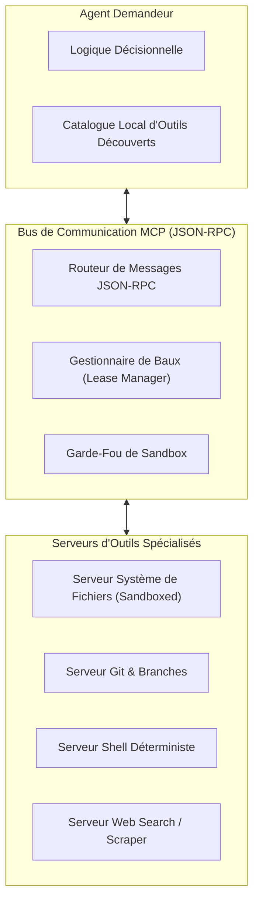
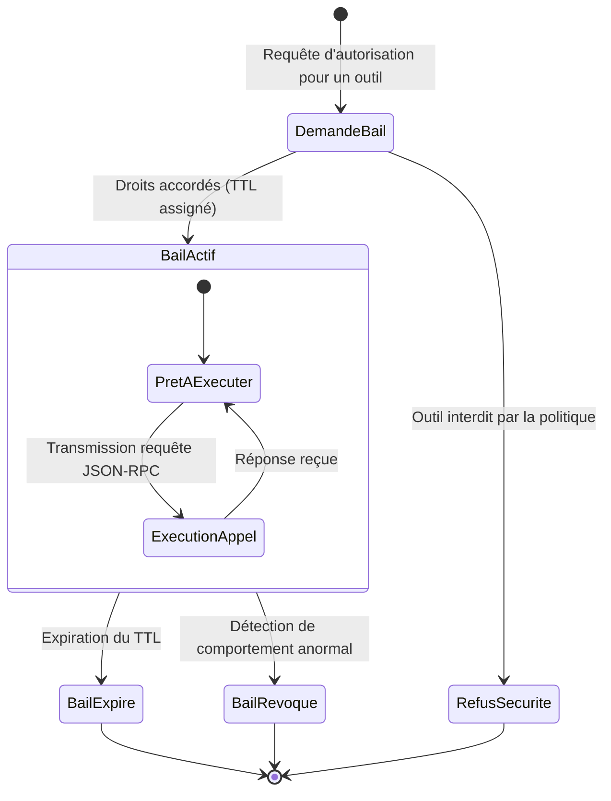

# Outils et MCP dans GenOS

## 1. Definition

Dans GenOS, MCP (Model Context Protocol) est la couche qui rend les capacites du systeme appelables par un client agentique. Cette couche ne se reduit pas a une liste d'outils : elle definit aussi qui voit les outils, qui peut les executer, sous quel transport, avec quels arguments, dans quel delai, et avec quelles protections de reprise ou d'arret.

L'implementation est repartie entre plusieurs surfaces :

- [mcp/index.js](../mcp/index.js) : serveur MCP JavaScript sur `stdio`, catalogue public et pont vers CLI/orchestrateur ;
- [mcp/lease.js](../mcp/lease.js) : filtrage du catalogue par lease et liste d'exclusion ;
- [backend/src/services/mcpExecutor.js](../backend/src/services/mcpExecutor.js) : execution backend, transports `stdio` et HTTP, delais et garde directe ;
- [backend/src/services/mcpToolRegistry.js](../backend/src/services/mcpToolRegistry.js) : registre, type d'execution et dispatch ;
- [backend/src/services/mcpArgumentValidation.js](../backend/src/services/mcpArgumentValidation.js) : validation d'arguments et protections d'injection ;
- [backend/src/services/circuitBreaker.js](../backend/src/services/circuitBreaker.js) : circuit breaker, quarantine et kill switch ;
- [crates/genos-mcp/src/tools.rs](../crates/genos-mcp/src/tools.rs) : catalogue public et filtrage du serveur Rust ;
- [backend/tests/test_mcp_direct_call_enforcement.js](../backend/tests/test_mcp_direct_call_enforcement.js) et [backend/tests/test_mcp_server_parity.js](../backend/tests/test_mcp_server_parity.js) : contrats de lease directe et de parite minimale JS/Rust.

Le principe directeur est le suivant : **la decouverte est une vue ; l'execution est une autorisation controlee**. Un outil masque ne doit donc pas devenir appelable par simple invocation directe.

---

## 2. Catalogue des outils

GenOS possede plusieurs representations du catalogue, chacune ayant une responsabilite differente :

| Surface | Role | Exemples |
| --- | --- | --- |
| `ALL_TOOLS` dans le serveur JS | Outils exposes au client MCP JS | `genos_orchestrate`, `genos_snapshot`, `genos_replay` |
| `public_tool_specs()` Rust | Outils exposes au serveur Rust | `genos_execute_primitive`, `genos_capsule_create` |
| `MCP_TOOLS_LIST` + strategy tools backend | Registre de dispatch runtime | outils CLI, biologiques et primitives de strategie |
| schemas de contrat | Enveloppes et schemas complets d'entree | schemas enrichis via `getToolInputSchema()` |

Le catalogue n'est donc pas une source unique de verite universelle. Le serveur MCP JS construit `ALL_TOOLS`, puis remplace chaque schema local par le schema de contrat connu. Le backend decide independamment si l'outil est enregistre et de quel type est son execution :

- `strategy` pour les primitives de strategie ;
- `bio` pour les outils biomimetiques ;
- `cli` pour les outils commencant par `genos_` et supportes par le registre.

Cette separation est intentionnelle : publier un schema aide un client a formuler l'appel, mais seul le registre runtime doit pouvoir autoriser un dispatch. De plus, la parite stricte des schemas est maintenue entre les implementations Rust (`public_tool_specs`) et JavaScript (par exemple `genos_replay` supportant indifferemment `snapshot` ou `snapshot_id` via `anyOf`, et `genos_worker_publish` avec `kind` obligatoire et `content` facultatif pour les signaux purs).

---

## 3. Leases, `enabled_tools` et `disabled_tools`

### 3.1 Lease MCP

Une lease est une allow-list temporaire ou contextuelle d'outils. Dans le code, elle est portee par :

```text
GENOS_MCP_LEASE=genos_snapshot,genos_replay
```

`parseLease()` normalise les noms : un nom sans prefixe devient `genos_<nom>`. Une fois une lease presente, seul un outil du catalogue qui appartient a cette lease est visible.

`GENOS_MCP_DISABLED_TOOLS` est une deny-list prioritaire : elle gagne toujours sur la lease. Les deux reglages sont equivalents au niveau conceptuel a :

$$
Visible = Catalog \cap Lease \setminus Disabled
$$

La documentation produit parfois l'expression `enabled_tools`. Dans le code actuel, l'equivalent operationnel de cette allow-list est `GENOS_MCP_LEASE` ; il n'existe pas ici une seconde variable `enabled_tools` qui modifierait independamment l'autorisation. Une configuration doit donc etre lue ainsi :

- `enabled_tools` : intention de liste autorisee, materialisee par la lease ;
- `disabled_tools` : liste de retrait, materialisee par `GENOS_MCP_DISABLED_TOOLS` ;
- sans lease : exposition minimale par defaut ;
- hors production, l'exposition complete exige explicitement `GENOS_MCP_EXPOSE_ALL=true` **et** `GENOS_MCP_ALLOW_UNSAFE_EXPOSE_ALL=true`.

En production, cette exposition complete est desactivee par `toolIsLeased()`.

### 3.2 Decouverte versus enforcement reel

Le filtrage de `tools/list` est necessaire mais insuffisant. Il ne protege que la decouverte. Un client peut deja connaitre le nom d'un outil, ou tenter de l'appeler directement sans l'avoir obtenu par discovery.

GenOS revalide donc l'autorisation a l'appel :

```text
tools/list                  appel direct / backend dispatch
    |                                      |
filterLeasedTools()                 directCallGuard()
    |                                      |
vue client                    registre + lease + args + breaker
```

Dans le serveur MCP JS, `CallToolRequestSchema` passe par `toolIsLeased()` avant le `switch` qui execute l'outil. Dans le backend, `directCallGuard()` et `executeConfiguredTransport()` verifient a nouveau :

1. que le nom est supporte par `mcpToolRegistry` ;
2. que l'outil n'est pas desactive ni hors lease ;
3. que les arguments sont valides ;
4. que le circuit breaker autorise l'appel.

Le test [backend/tests/test_mcp_direct_call_enforcement.js](../backend/tests/test_mcp_direct_call_enforcement.js) documente ce contrat : une lease `genos_snapshot` autorise cet outil et refuse `genos_run`; un outil explicitement desactive reste refuse meme lorsqu'il est dans la lease.

### 3.3 Appels directs d'outils caches

Un outil cache par `tools/list` n'est pas suppose etre un canal lateral. La loi d'autorisation est :

$$
Allowed(tool) = Registered(tool) \land Leased(tool) \land ValidArgs(tool) \land BreakerOpen(tool) = false
$$

Un appel direct peut etre execute seulement si toutes les conditions sont satisfaites. Le backend renvoie par exemple `MCP_TOOL_LEASE_DENIED`, `MCP_TOOL_NOT_FOUND`, `INVALID_TOOL_ARGUMENTS` ou le motif du circuit breaker.

Important : la fonction `directToolLeaseAllows()` travaille avec les noms deja normalises. Les configurations de lease et de desactivation du processus backend doivent donc utiliser les noms exacts du runtime, par exemple `genos_snapshot`.

---

## 4. Validation des arguments et confinement

Avant tout dispatch, `validateToolArguments()` impose une validation defensive :

- les arguments doivent former un objet ;
- les champs requis doivent etre des chaines non vides ;
- les champs numeriques doivent etre finis et non negatifs lorsqu'ils sont attendus ;
- certains champs doivent etre des tableaux de chaines sures ;
- des enums limitent certaines valeurs, par exemple le backend de sandbox ;
- les alias ambigus sont rejetes pour des outils sensibles comme STDP et division cellulaire ;
- les caracteres de commande et sauts de ligne sont refuses dans les champs structurels.

La contrainte sur les chaines structurelles vise notamment a bloquer les separateurs de shell et les injections :

```text
" ' ` \\ ; | & < > $ \r \n
```

Les champs explicitement libres (comme `agent` ou `out` pour `genos_snapshot`, ou `predicate`, `mission`, `content`) restent possibles pour transporter un chemin ou du contenu, tout en garantissant le confinement strict au sein du workspace et la présence obligatoire des paramètres requis (`agent` et `out` pour `genos_snapshot`).

`mcpExecutor` ajoute un confinement de chemin pour les entrees et sorties :

- une sortie doit etre relative au workspace ;
- les chemins absolus sont refuses ;
- la resolution rejette les sorties de racine et les symlinks ;
- les champs `graph_file`, `history_file`, `input_file` et `manifest` passent par la meme politique.

Le schema MCP sert donc a guider le client, tandis que le validateur runtime est l'autorite contre les arguments malformes ou dangereux.

---

## 5. Transports `stdio` et HTTP

### 5.1 Selection du transport

Le backend selectionne un transport dans cet ordre :

1. `GENOS_MCP_URL` ou `GENOS_MCP_ENDPOINT` : HTTP/HTTPS ;
2. `GENOS_MCP_COMMAND` : processus `stdio` explicite ;
3. binaire MCP Rust local ;
4. serveur JS local [mcp/index.js](../mcp/index.js).

L'URL doit etre valide, utiliser `http` ou `https`, et ne peut pas embarquer de credentials. Le transport selectionne est restitue dans le resultat d'execution (`http`, `stdio`, `local` ou `strategy_primitive`).

### 5.2 Protocole commun

Les deux transports suivent la sequence JSON-RPC MCP :

```text
Client backend
    |
    +--> initialize (id=1)
    +--> notifications/initialized
    +--> tools/call (id=2)
    |
    v
Serveur MCP
```

Pour HTTP, le backend envoie la version `2025-06-18`, accepte JSON et SSE, conserve eventuellement `mcp-session-id`, et verifie que les reponses JSON-RPC portent le bon `id`. Les reponses SSE sont parsees; une suite sans evenement JSON valide est rejetee.

Pour `stdio`, le backend lance un enfant avec `shell: false`, echange des lignes JSON-RPC, isole `stderr` des messages protocole et termine explicitement le processus a la fin de l'appel.

L'environnement transmis au sous-processus est reduit : variables OS necessaires et variables `GENOS_` non sensibles. Les secrets (`TOKEN`, `SECRET`, `KEY`, `PASSWORD`, `CREDENTIAL`, `API`) ne sont pas propages arbitrairement. La lease active est envoyee au transport local dans `GENOS_MCP_LEASE`.

---

## 6. Timeouts et bornage des ressources

Le timeout MCP par defaut est :

$$
T_{default} = 30\,000\text{ ms}
$$

Le timeout fournit est normalise et plafonne a :

$$
0 < T \le 1\,800\,000\text{ ms}
$$

soit trente minutes. Un timeout invalide revient au timeout par defaut.

Le comportement est adapte au transport :

- HTTP : un deadline global couvre `initialize`, notification et `tools/call`; chaque phase utilise `AbortController` avec le temps restant ;
- `stdio` : chaque reponse attendue est bornee par le meme deadline et le processus est termine sur expiration ;
- execution locale : le bridge CLI recoit le timeout normalise ;
- outils bio et strategy : `withTimeout()` borne les promesses de fallback.

Les sorties sont aussi bornees : le serveur JS et le backend limitent la sortie a environ $1\,048\,576$ octets. Pour HTTP, une reponse plus grande est refusee; les messages d'erreur ont une limite plus courte. Ces limites evitent qu'un outil bloque ou sature le processus de controle.

---

## 7. Circuit breaker, quarantine et arret global

Le circuit breaker de [backend/src/services/circuitBreaker.js](../backend/src/services/circuitBreaker.js) applique une machine a trois etats :

```text
             3 echecs dans 60 s
CLOSED --------------------------> OPEN
  ^                                  |
  | canary reussi                    | cooldown 60 s
  +------------ HALF-OPEN <----------+
```

Les regles concretes sont :

- trois echecs dans une fenetre de 60 secondes ouvrent le circuit ;
- apres 60 secondes, il passe en `HALF-OPEN` ;
- un seul canary destructif peut s'executer dans cet etat ;
- un canary reussi referme le circuit ;
- un echec en `HALF-OPEN` le rouvre ;
- un verrou manuel met un outil en quarantine ;
- un kill switch persistant dans `.genos/mcp.halted` bloque toutes les executions ;
- une protection anti-boucle bloque six appels consecutifs identiques dans un meme scope.

Les outils destructifs, par exemple `genos_merge`, `genos_restore` ou `genos_resilience_apoptosis`, exigent en plus le role `admin`. Le circuit breaker est donc une politique d'execution, pas une fonctionnalite cosmetique de monitoring.

---

## 8. Audit et observabilite

Chaque chemin important produit des evenements via `telemetryObserver` :

- `TOOL_FAILURE` lorsqu'un echec est enregistre ;
- `CIRCUIT_BREAKER_TRIPPED` lorsque le circuit est ouvert ;
- `CIRCUIT_BREAKER_HALF_OPEN` et `CIRCUIT_BREAKER_RESET` lors de la reprise controlee ;
- `TOOL_QUARANTINE_TOGGLE` lors d'un verrouillage ;
- `KILL_SWITCH_ENGAGED` et `KILL_SWITCH_RESET` pour l'arret global.

Les outils CLI de type `genos_audit` et `genos_export_audit` produisent par ailleurs des artefacts d'audit. Au niveau MCP, l'audit pertinent est donc compose de :

1. l'identite et le contexte de l'appelant quand ils sont fournis par la couche superieure ;
2. le nom, le type de dispatch et le transport de l'outil ;
3. les decisions de policy (lease, validation, role, breaker) ;
4. le resultat, echec, timeout ou refusal ;
5. les evenements de telemetrie et les artefacts d'audit associes.

La mise en oeuvre actuelle n'affirme pas qu'un unique journal MCP immutable contient automatiquement chaque argument brut. Les traces de telemetrie et les artefacts d'audit sont les surfaces observables presentes dans ce code; les secrets ne doivent pas etre places dans les arguments ni les logs.

---

## 9. Cohérence serveur JS, serveur Rust et bridge CLI

GenOS maintient trois couches qui doivent rester alignees :

| Couche | Responsabilite |
| --- | --- |
| serveur MCP JS | SDK MCP, `stdio`, appel d'outils publies, pont orchestrateur/CLI |
| serveur MCP Rust | catalogue public et predicate `is_tool_allowed()` |
| backend / bridge CLI | registre runtime, validation, transports, execution locale et politiques de securite |

Le test [backend/tests/test_mcp_server_parity.js](../backend/tests/test_mcp_server_parity.js) verifie actuellement au moins que `genos_replay` et `genos_execute_primitive` sont declares dans les deux catalogues. C'est une parite minimale, pas la preuve que tous les outils et schemas sont strictement identiques.

La coherence pratique repose sur les invariants suivants :

- un outil public doit avoir un schema coherent avec le contrat runtime ;
- le nom MCP doit correspondre au nom accepte par le registre backend ;
- une lease ou une desactivation doit donner le meme resultat d'autorisation dans les couches exposees ;
- un outil CLI doit transmettre des arguments valides au binaire `genos` sans shell ;
- les erreurs et les timeout doivent conserver leur semantique sur `stdio`, HTTP et execution locale.

Le bridge CLI est particulier : il transforme des outils MCP en appels `genos ...`, mais seulement apres validation et confinement. La chaine n'est donc pas un simple `exec` de texte fourni par un modele.

---

## 10. Processus complet d'un appel

```text
Client MCP
   |
   v
tools/list --------------------> catalogue filtre (lease - disabled)
   |
   v
tools/call ou appel backend direct
   |
   v
registre connu ? ---- non ---> MCP_TOOL_NOT_FOUND
   |
   v
lease / disabled valides ? -- non ---> MCP_TOOL_LEASE_DENIED
   |
   v
arguments + chemins valides ? -- non ---> INVALID_TOOL_ARGUMENTS / INVALID_*_PATH
   |
   v
circuit breaker / role / halt ? -- non ---> execution refusee
   |
   v
strategy | bio | CLI | HTTP | stdio
   |
   v
timeout + sortie bornee + telemetry
   |
   v
resultat structure ou erreur controlee
```

Ce chemin est la difference fondamentale entre une integration MCP demonstrative et une surface d'execution operationnelle : chaque transition effectue une verification ayant un effet concret sur la possibilite d'executer.

---

## 11. Cas d'utilisation

### 11.1 Delegation restreinte a un worker

Un worker de diagnostic peut recevoir :

```text
GENOS_MCP_LEASE=genos_snapshot,genos_replay,genos_execute_primitive
GENOS_MCP_DISABLED_TOOLS=genos_merge
```

Il peut produire et rejouer des checkpoints, mais ne peut pas merger. Meme s'il tente directement `genos_merge`, le backend le refuse.

### 11.2 Serveur MCP externe en HTTP

Un environnement peut diriger les appels vers un endpoint controle :

```text
GENOS_MCP_URL=https://mcp.internal.example/mcp
GENOS_MCP_LEASE=genos_orchestrate,genos_report_progress
```

Le backend initialise la session MCP, propage lease et token eventuel, applique un deadline commun et refuse les reponses JSON-RPC incoherentes ou trop volumineuses.

### 11.3 Execution locale recuperable

Dans un environnement de developpement, le backend lance le serveur MCP Rust ou JS local en `stdio`, avec environnement assaini, `shell: false` et terminaison du processus enfant a la fin. Cela evite d'exposer un port HTTP tout en conservant le meme protocole logique.

### 11.4 Instabilite d'un outil a risque

Un outil destructif qui echoue trois fois dans une minute ouvre le circuit. Apres cooldown, un seul canary est autorise. Tant qu'il n'est pas concluant, les outils a risque sont bloques et la telemetrie rend l'evenement observable.

---

## 12. Comparaison avec le marche

### SDK MCP de reference

Les SDK MCP standardisent le protocole (`tools/list`, `tools/call`, `stdio`, transports HTTP) mais ne fournissent pas automatiquement une gouvernance applicative complete. GenOS ajoute une lease, une deny-list, une validation de chemins, un bridge CLI borne et un circuit breaker runtime.

### Frameworks multi-agents (LangGraph, AutoGen, CrewAI)

Ces frameworks modelisent bien des graphes, roles et outils, mais la limitation d'un outil est souvent implemente au niveau de la configuration du workflow ou du prompt. GenOS traite explicitement le probleme des appels directs : la policy est reexecutee au dispatch, hors de la seule liste presentee au modele.

### Gateways d'outils et API gateways

Les gateways classiques offrent authentification, quotas, rate limiting et observabilite. GenOS reprend ces fonctions pour une execution agentique, avec une granularite par outil, une lease de contexte, des sorties bornees et une protection contre l'auto-boucle d'appels identiques.

### Ce qui distingue GenOS

La particularite n'est pas de posseder un serveur MCP, ni un catalogue d'outils. C'est d'articuler :

- exposition minimale par defaut ;
- retrait explicite des outils ;
- enforcement sur discovery **et** dispatch direct ;
- validation runtime avant pont CLI ;
- parity testee entre les catalogues JS et Rust ;
- deadlines transport et limites de sortie ;
- resilience par circuit breaker, quarantine et kill switch ;
- telemetrie utilisable pour audit et reprise.

---

## 13. Synthese

Les outils MCP de GenOS forment une surface d'execution gouvernee. Le catalogue repond a la question "qu'est-ce que le client peut voir ?" ; la lease, le registre, la validation et le circuit breaker repondent a la question plus importante : "qu'est-ce que le runtime accepte vraiment d'executer maintenant ?"

Cette distinction rend l'integration plus robuste face aux appels directs, aux outils caches, aux entrees malformees, aux transports instables et aux boucles de defaillance. Elle place MCP au niveau d'un plan de controle operationnel, plutot qu'au niveau d'une simple liste de fonctions offertes a un modele.


---

## Schémas Complémentaires d'Intégration et de Contrôle MCP

### 1. Architecture du Bus MCP et Contrôleur de Baux (Leases)



### 2. Machine à états du Cycle de Vie d'un Bail d'Outil MCP



### 3. Résilience Opérationnelle et Double Moteur (Rust & Node.js)

Le sous-système MCP de GenOS dispose d'une architecture à double niveau garantissant l'accès aux outils même en cas d'indisponibilité du transport IPC/stdio :

1. **Serveur Rust Natif (`crates/genos-mcp`) :** Binaire autonome `genos-mcp.exe` implémentant le protocole JSON-RPC standard avec sérialisation zéro-copie et validation typée des schémas d'entrée.
2. **Serveur Node.js Stdio (`mcp/index.js` & `mcpExecutor.js`) :** Pont applicatif JavaScript intégrant le contrôle de baux (`lease.js`), le circuit breaker et le dispatch vers les handlers métier.
3. **Mécanismes de Résilience & Fallbacks :**
   - **Mode Direct Local :** En cas d'interruption du canal stdio, le backend et l'orchestrateur peuvent exécuter directement les primitives via les adaptateurs internes ([`backend/src/services/mcpBioTools/`](file:///c:/Users/Shadow/Documents/GitHub/GenOS/backend/src/services/mcpBioTools/)) ou le CLI déterministe (`genos biomimicry ...`).
   - **Heartbeat & Protection de Timeout :** Chaque invocation est encadrée par un timeout strict et un coupe-circuit (`circuitBreaker.js`) pour prévenir tout blocage de process orphelin.

