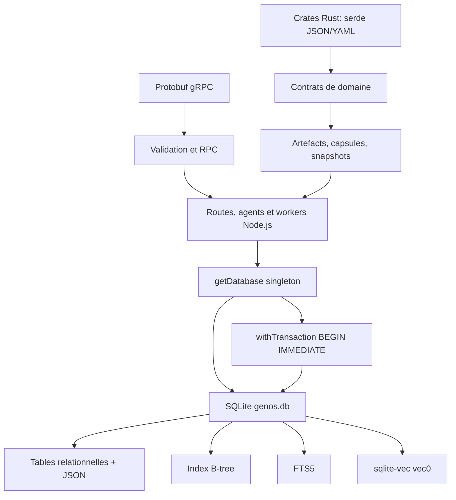
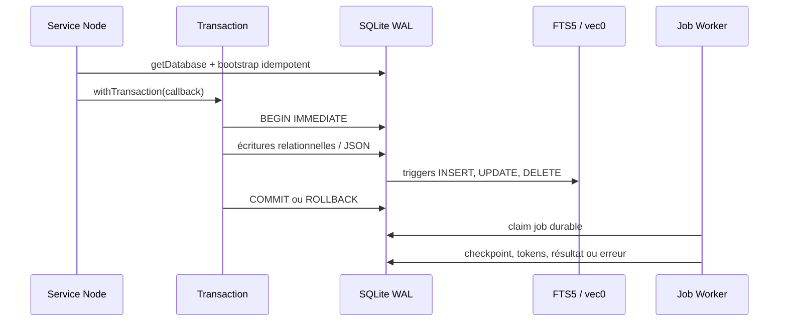
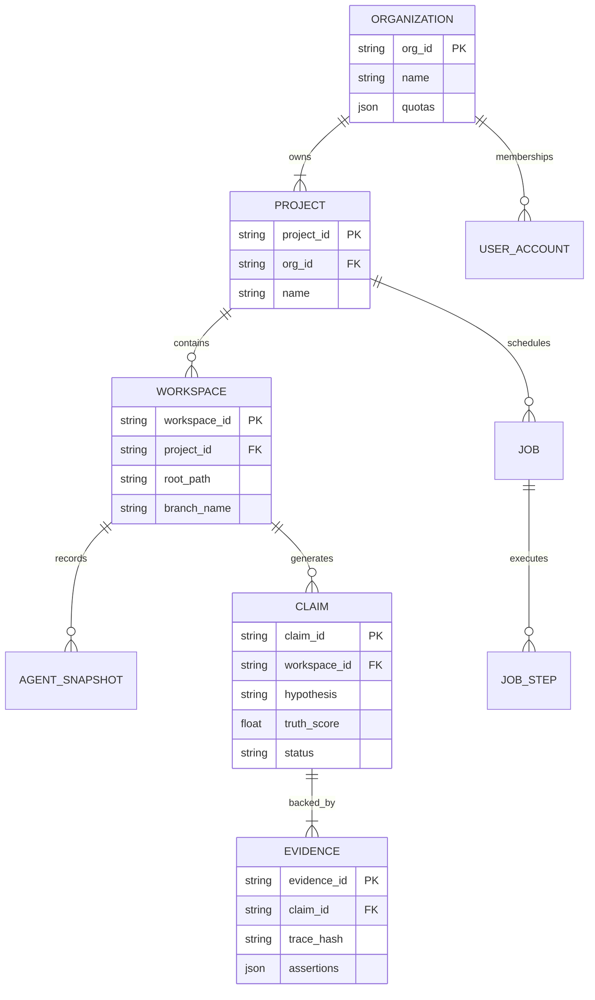
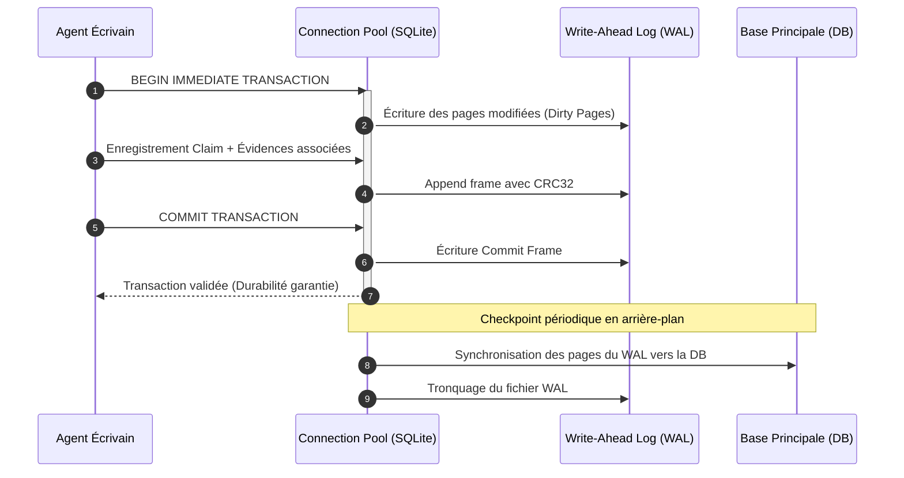

# Persistance et données dans GenOS

## 1. Définition

La persistance GenOS est une couche SQLite centrée sur l'état durable des agents, workspaces, décisions, jobs, traces, mémoire et gouvernance multi-tenant. Elle ne se résume pas à une base relationnelle : elle combine des tables normalisées, des documents JSON, des index B-tree, la recherche lexicale FTS5, la recherche vectorielle `sqlite-vec`, des migrations incrémentales et des mécanismes de reprise de jobs.

Le backend Node.js est le propriétaire opérationnel de la base SQLite. Les crates Rust utilisent principalement des structures `serde` et des artefacts JSON/YAML versionnés ; les contrats RPC sont décrits par protobuf. La cohérence entre ces trois représentations est donc une question de contrats, de migrations, de validation et de tests, et non celle d'un schéma Rust unique partageant directement le fichier SQLite.

Les sources principales sont :

- [backend/src/db/index.js](../backend/src/db/index.js) : ouverture singleton et transactions ;
- [backend/src/db/schema.js](../backend/src/db/schema.js) : bootstrap SQLite, FTS5 et `sqlite-vec` ;
- [backend/src/db/schema-tables-core.js](../backend/src/db/schema-tables-core.js) : tables métier centrales ;
- [backend/src/db/schema-tables-extensions.js](../backend/src/db/schema-tables-extensions.js) : extensions, jobs, tenancy et index ;
- [backend/src/db/schema-migrations.js](../backend/src/db/schema-migrations.js) : mises à niveau idempotentes et compatibilité legacy ;
- [backend/src/services/jobWorker.js](../backend/src/services/jobWorker.js) : persistance et reprise de jobs ;
- [backend/src/services/vectorMemoryService.js](../backend/src/services/vectorMemoryService.js) : recherche hybride ;
- [backend/proto/schema.proto](../backend/proto/schema.proto) : validation de schémas via gRPC ;
- [spec/genome.schema.json](../spec/genome.schema.json) : contrat JSON de génome ;
- [backend/tests/test_fts_vec_integrity.js](../backend/tests/test_fts_vec_integrity.js) : intégrité FTS5 et vectorielle.

---

## 2. Architecture



Au démarrage, `getDatabase()` ouvre un unique handle par processus Node, charge `sqlite-vec` si disponible, puis exécute dans cet ordre :

1. `initializeSchema(db)` ;
2. migrations legacy et versionnées ;
3. création ou mise à jour des tables et index ;
4. synchronisation des index FTS et vectoriels ;
5. seed initial (`seedDatabase`).

Le singleton et la promesse `dbInitialization` empêchent deux bootstraps simultanés dans le même processus. Cette garantie ne remplace pas une coordination inter-processus : SQLite et WAL restent responsables des conflits entre processus distincts.

---

## 3. Schéma SQLite

### 3.1 Familles de données

Le schéma est distribué entre `schema-tables-core.js` et `schema-tables-extensions.js`. Les familles principales sont :

| Domaine | Exemples de tables |
| --- | --- |
| Identité et agents | `agents`, `agent_runtime_state`, `agent_state_snapshots` |
| Tenancy et workspace | `organizations`, `projects`, `environments`, `workspaces`, memberships |
| Travail durable | `workflow_runs`, `evaluation_jobs`, `model_jobs`, `model_job_tokens` |
| Mémoire et connaissance | `memory_synapses`, `episodic_memories`, `genome_decisions`, `rag_chunks` |
| Trajectoires et observabilité | `trajectories`, `trace_spans`, `telemetry_events`, `audit_logs` |
| Gouvernance | `provider_configs`, `agent_model_routing_policies`, `platform_approvals` |
| Biologie opérationnelle | `cryptobiosis_snapshots`, plasmids, décisions génomiques et synapses |

Les colonnes JSON telles que `metadata_json`, `state_json`, `payload_json`, `config_json` et `result_json` servent à conserver des données extensibles sans multiplier les migrations pour chaque attribut périphérique. Pour la biologie opérationnelle (`cryptobiosis_snapshots`), GenOS évolue vers un format binaire vitrifié (`SporeVitrifiedPayload` / BLOB) protégé au tréhalose, substituant aux dumps JSON volumineux une anhydrobiose compacte avec conditions de germination biophysique. Les clés et les filtres de scope restent relationnels lorsque l'isolation, les jointures ou les performances l'exigent.

### 3.2 Tenancy

Les ressources multi-tenant importantes stockent `organization_id` et `project_id`. Les migrations ajoutent progressivement ces colonnes aux tables historiques, puis les contrôleurs résolvent le tenant avant lecture ou écriture. Les contraintes de `workspaces` vérifient notamment que :

$$
organization\_id = \varnothing \iff project\_id = \varnothing
$$

et qu'un projet appartient à l'organisation annoncée.

Cette distinction est essentielle : le schéma peut stocker des lignes globales historiques, tandis que les chemins d'API tenant-aware doivent appliquer le scope dans leurs requêtes.

---

## 4. Contraintes, clés étrangères et intégrité

`initializeSchema()` active `PRAGMA foreign_keys = ON` pour chaque connexion ouverte par le backend. Cette option fait respecter les relations déclarées, par exemple :

- `workflow_versions.workflow_id -> workflows.id` avec suppression en cascade ;
- `cryptobiosis_snapshots.agent_id -> agents.id` avec suppression en cascade ;
- `cryptobiosis_snapshots.workspace_id -> workspaces.id` avec `ON DELETE SET NULL` ;
- organisations, projets et memberships avec relations d'appartenance.

Les contraintes utilisées incluent :

- `PRIMARY KEY` pour les identités durables ;
- `UNIQUE`, par exemple sur `(workflow_id, version)` ou les memberships ;
- `CHECK`, par exemple sur les statuts de cryptobiose et les types d'objets Git ;
- triggers de validation de l'appartenance organisation/projet ;
- index uniques partiels, par exemple lorsque `event_id IS NOT NULL`.

Une contrainte SQLite protège seulement les écritures qui passent par une connexion avec `foreign_keys=ON`. Tout outil externe ouvrant le fichier doit donc activer cette pragma lui aussi ; ce n'est pas une propriété enregistrée une fois pour toutes dans le fichier.

---

## 5. Migrations idempotentes et compatibilité legacy

### 5.1 Principe

Le système utilise trois techniques complémentaires :

1. `CREATE TABLE IF NOT EXISTS` et `CREATE INDEX IF NOT EXISTS` ;
2. inspection de `PRAGMA table_info(table)` avant un `ALTER TABLE ADD COLUMN` ;
3. migrations de transformation lorsqu'un contrat ne peut pas être étendu de manière sûre.

Une migration est idempotente si la réappliquer préserve le résultat :

$$
M(M(S)) = M(S)
$$

C'est la propriété requise par un service qui redémarre, par un déploiement répété et par une récupération après échec partiel.

### 5.2 Migrations versionnées

`applyVersionedMigrations()` recense des changements nommés tels que :

- `003-tenant-scopes` ;
- `004-evaluation-job-retries` ;
- `010-temporal-synapses` ;
- `014-episodic-memories` ;
- `016-workflow-version-snapshots` ;
- `017-reversible-episodic-retention` ;
- `018-ide-client-identity`.

Le code complète également les anciennes tables en examinant réellement leurs colonnes. Ainsi, la migration ne suppose pas qu'une base installée possède déjà la dernière forme de `agents`, `workspaces`, `model_jobs`, `evaluation_jobs`, `memory_synapses` ou `cryptobiosis_snapshots`.

### 5.3 Exemple de migration non additive

Une ancienne table `cryptobiosis_snapshots` dont le contrat n'a pas la clé `snapshot_id` est renommée en table legacy. Une nouvelle table est créée, les lignes compatibles sont projetées avec une valeur `legacy:<id>`, puis la table legacy est supprimée après copie. C'est une migration de reconstruction contrôlée, nécessaire lorsque l'ancien schéma ne peut pas exprimer la nouvelle contrainte primaire.

Le test [backend/tests/test_legacy_migration_ambiguity.js](../backend/tests/test_legacy_migration_ambiguity.js) vérifie que l'attribution d'un scope legacy n'utilise pas arbitrairement la première organisation : elle ne rétro-remplit un workspace que si une organisation est non ambiguë.

### 5.4 Compatibilité des anciennes bases

La compatibilité recherchée est une compatibilité de lecture et de montée de version, pas une promesse qu'une version ancienne de GenOS saura lire une base écrite par une version nouvelle. Avant une mise à niveau majeure :

1. sauvegarder `genos.db` et les fichiers WAL associés ;
2. démarrer la nouvelle version sur une copie ;
3. vérifier les migrations, les counts et les indexes ;
4. ne basculer la production qu'après contrôle de santé.

---

## 6. Transactions et concurrence

### 6.1 Transactions applicatives

`withTransaction(db, callback)` sérialise les transactions demandées par le même objet de connexion, puis exécute :

```sql
BEGIN IMMEDIATE;
-- callback
COMMIT;
```

En cas d'exception :

```sql
ROLLBACK;
```

`BEGIN IMMEDIATE` prend tôt le verrou d'écriture : l'opération échoue ou attend avant que le callback ne réalise une série de mutations dépendantes. Le sérialiseur `transactionTails` évite que deux callbacks concurrents dans le même processus ne s'entrelacent sur ce handle.

Une transaction respecte l'atomicité :

$$
S_{after} =
\begin{cases}
T(S_{before}) & \text{si toutes les écritures réussissent} \\
S_{before} & \text{sinon}
\end{cases}
$$

Les services d'organisation, mémoire, registre ou workflow emploient cette primitive pour faire évoluer plusieurs lignes comme une seule décision.

### 6.2 WAL et paramètres SQLite

Le bootstrap active :

```sql
PRAGMA journal_mode = WAL;
PRAGMA busy_timeout = 5000;
PRAGMA foreign_keys = ON;
PRAGMA mmap_size = ...;
PRAGMA temp_store = MEMORY;
PRAGMA synchronous = ...;
```

WAL (write-ahead logging) permet à des lecteurs de continuer pendant qu'un écrivain ajoute des pages au journal. Il ne permet pas plusieurs écrivains simultanés : SQLite conserve un seul writer à la fois. La capacité pratique est donc :

$$
N_{readers} \gg 1, \quad N_{writers} = 1
$$

`busy_timeout=5000` donne cinq secondes à SQLite pour attendre un verrou concurrent. `withTransaction` réduit la compétition intra-processus; les processus ou instances multiples doivent conserver des transactions courtes, traiter `SQLITE_BUSY` et dimensionner leur architecture autour de ce writer unique.

Le paramètre `synchronous` est configuré par `GENOS_SQLITE_SYNCHRONOUS`, via `runtimeConfig`. Il exprime un compromis explicite entre débit et durabilité au crash. Une configuration de production doit choisir ce niveau selon le risque accepté et la stratégie de sauvegarde.

---

## 7. Index

Les index B-tree servent les parcours fréquents : identifiants de tenant, temps de création, états de job, relations agent/workspace, synapses et versions de workflow. Les index uniques et partiels empêchent également des duplications sémantiquement invalides.

La règle est simple : indexer les prédicats et jointures dominants, pas chaque colonne. Un index accélère typiquement la recherche d'un ensemble de taille $N$ de :

$$
O(N) \quad \text{vers environ} \quad O(\log N + k)
$$

mais ajoute du coût aux `INSERT`, `UPDATE` et `DELETE`. Dans GenOS, les index sont donc créés explicitement dans `CREATE_INDEXES_SQL` et dans les migrations, au voisinage de la structure qui les nécessite.

Les jobs s'appuient notamment sur des états et dates durables (`status`, `claimed_at`, `next_attempt_at`) qui permettent au worker de réclamer, reprendre ou abandonner proprement une exécution.

---

## 8. FTS5 et sqlite-vec

### 8.1 FTS5

FTS5 indexe le texte des trajectoires et décisions de génome dans :

- `trajectories_fts` ;
- `genome_decisions_fts`.

Des triggers `AFTER INSERT`, `AFTER UPDATE` et `AFTER DELETE` maintiennent ces tables virtuelles depuis les tables source. Au bootstrap, GenOS exécute également une reconstruction FTS5 :

```sql
INSERT INTO trajectories_fts(trajectories_fts) VALUES ('rebuild');
```

Ce rebuild évite un index lexical obsolète après des mises à jour qui ne changeraient pas le cardinal de la table.

### 8.2 sqlite-vec

Le module Node charge l'extension `sqlite-vec` si elle est disponible. La création des tables virtuelles `vec0` est protégée par `try/catch` : le backend reste fonctionnel si l'extension manque, mais l'accélération vectorielle native n'est alors pas disponible.

Les index vectoriels concernés sont :

- `trajectories_vec` ;
- `genome_decisions_vec` ;
- `rag_chunks_vec`.

Chaque vecteur est une représentation `float[768]`. Un `Float32Array` de 768 éléments pèse :

$$
768 \times 4 = 3072\ \text{octets}
$$

Les triggers n'indexent donc un `embedding_blob` que si `length(...) = 3072`. À chaque insertion, suppression ou mise à jour, ils synchronisent le `rowid` de l'index vec0 avec celui de la table source. Le bootstrap supprime puis reconstruit aussi les entrées vectorielles pour empêcher toute dérive entre index et source.

### 8.3 Recherche hybride

La recherche mémoire combine signal lexical FTS5 et proximité vectorielle. Un schéma de fusion courant est le Reciprocal Rank Fusion :

$$
RRF(d) = \sum_{r \in R} \frac{1}{k + rank_r(d)}
$$

Le test [backend/tests/test_fts_vec_integrity.js](../backend/tests/test_fts_vec_integrity.js) vérifie :

- la dimension 768 et la normalisation L2 du fallback vectoriel ;
- la création et suppression correcte d'une entrée vec0 ;
- la recherche FTS5 sur du texte français accentué ;
- les modes FTS-only, vector-only et hybride.

---

## 9. Nettoyage des données orphelines

Le nettoyage est réparti selon le type de donnée :

- les relations avec `ON DELETE CASCADE` éliminent les enfants dont le parent est supprimé ;
- `ON DELETE SET NULL` conserve une trace lorsque le parent workspace disparaît mais que l'historique reste utile ;
- les triggers FTS5/vec0 enlèvent leurs entrées à la suppression des données source ;
- les cycles de sommeil et services de mémoire purgent les synapses, mémoires et décisions faibles/orphelines selon leurs politiques de rétention ;
- les jobs persistant leurs checkpoints rendent les reprises possibles sans créer une seconde sortie logique.

Pour les mémoires épisodiques, la migration `017-reversible-episodic-retention` porte un état de purge et une date de purge. Il s'agit d'un tombstone réversible, pas d'une suppression irrévocable immédiate.

Le nettoyage doit distinguer l'orphelin technique (référence impossible) de la donnée archivée intentionnellement. La suppression directe d'une ligne JSON sans considérer ses triggers, ses clés étrangères et son scope tenant peut casser l'observabilité ou laisser un index de recherche incohérent.

---

## 10. Processus de persistance



Exemple : un `model_job` est créé en `queued`. Le worker le réclame, écrit périodiquement `claimed_at`, persiste les tokens dans `model_job_tokens`, sauvegarde les sorties déjà achevées dans `result_json`, puis le marque `completed`, `failed` ou `cancelled`. En cas d'erreur temporaire, il revient à `queued` avec `next_attempt_at` et un backoff.

Cette persistance garantit une reprise opérationnelle, mais pas une transaction distribuée avec le provider de modèle : un appel réseau peut réussir alors que le processus tombe avant la persistance finale. Les checkpoints et identifiants de job sont le mécanisme de réduction de ce risque.

---

## 11. Cohérence Node, Rust et protobuf

### 11.1 Trois contrats complémentaires

| Couche | Source de vérité | Rôle |
| --- | --- | --- |
| SQLite Node | tables, migrations et contraintes | état runtime durable |
| Rust | structs `serde` et `serde_json` / YAML | logique de domaine, CLI et artefacts |
| Protobuf | fichiers `.proto` | contrats gRPC inter-processus |
| JSON Schema | `spec/*.schema.json` | validation des manifestes versionnés |

Par exemple, [backend/proto/schema.proto](../backend/proto/schema.proto) fournit un service de validation de schéma via `schema_name` et `data_json`; [spec/genome.schema.json](../spec/genome.schema.json) impose `apiVersion`, `kind`, `metadata`, `identity`, `cognition`, `memory`, `models` et `tools` pour un génome. Les structures Rust correspondantes utilisent `Serialize` et `Deserialize` pour conserver un contrat de données lisible et versionnable.

### 11.2 Règles de compatibilité

Pour préserver la compatibilité :

1. ajouter les champs JSON/protobuf plutôt que les renommer ;
2. conserver des valeurs par défaut côté Rust avec `serde(default)` lorsque possible ;
3. ne jamais réutiliser un numéro de champ protobuf pour une autre sémantique ;
4. ajouter les colonnes SQLite avec des valeurs par défaut ou en nullable avant de les rendre obligatoires ;
5. migrer les données anciennes avant d'ajouter une contrainte non compatible ;
6. tester un artefact produit par une couche et consommé par une autre.

La cohérence est donc :

$$
valid_{SQLite} \land valid_{JSON\ Schema} \land compatible_{serde} \land compatible_{protobuf}
$$

Elle n'est pas automatique. Un champ présent dans un `payload_json` peut échapper aux contraintes SQL, et un nouveau champ Rust peut ne pas être exposé dans protobuf. Les changements transverses exigent une revue conjointe des quatre contrats.

---

## 12. Analogie biologique

La persistance GenOS peut être lue comme une mémoire biologique, avec une limite nette : ce sont des mécanismes logiciels contrôlés.

- les tables relationnelles sont une mémoire structurale : identités, relations et contraintes ;
- les documents JSON sont une mémoire contextuelle, plus flexible ;
- FTS5 est une récupération associative par signal lexical ;
- `sqlite-vec` est une proximité distribuée dans un espace de représentation ;
- les index sont des voies rapides de rappel ;
- les transactions sont une consolidation atomique : un épisode est retenu entièrement ou pas du tout ;
- les tombstones et purges correspondent à une plasticité contrôlée, pas à un oubli aléatoire ;
- WAL sépare les lecteurs et l'écrivain, comme une régulation d'accès à une mémoire partagée.

L'analogie ne signifie pas que SQLite simule un cerveau. Elle explique le rôle de chaque niveau : stabiliser, retrouver, réviser et nettoyer la connaissance sans perdre les règles d'intégrité.

---

## 13. Cas d'utilisation

### 13.1 Reprise fiable de jobs

Un workflow, une évaluation ou une génération longue tombe pendant une exécution. Les colonnes de statut, `claimed_at`, tentatives, deadline et checkpoint permettent au worker de distinguer une exécution achevée, à reprendre ou définitivement échouée.

### 13.2 Mémoire RAG hybride

Un agent cherche une décision passée. FTS5 trouve les termes et les formes lexicales pertinentes; vec0 trouve les voisins sémantiques; la fusion de rangs réduit le risque de manquer un résultat utile à cause d'une formulation différente.

### 13.3 Isolation organisation/projet

Deux projets peuvent avoir un même nom de workspace ou des agents similaires. Les IDs de scope et les contraintes de projet réduisent le risque qu'une migration, une requête ou une politique mélange accidentellement leurs données.

### 13.4 Évolution contrôlée du produit

Une base d'une version ancienne reçoit de nouvelles colonnes de synapse, de cryptobiose ou de job sans nécessiter une réinitialisation. Les migrations inspectent l'état courant et font une évolution additive ou une reconstruction ciblée.

---

## 14. Comparaison avec le marché

| Sujet | GenOS | ORM SQL classique | Base vectorielle dédiée | Plateforme cloud managée |
| --- | --- | --- | --- | --- |
| Runtime principal | SQLite embarqué et portable | Souvent PostgreSQL/MySQL | Milvus, Pinecone, Qdrant, etc. | Service distant |
| Migrations | SQL idempotent + inspection de colonnes | Outil ORM avec historique | Souvent séparées du schéma métier | Géré par le fournisseur |
| Recherche | B-tree + FTS5 + vec0 dans le même fichier | Texte parfois via extension | Vecteur spécialisé | Dépend du service |
| Transactions | ACID local, un writer | ACID multi-utilisateur mature | Variable selon produit | ACID et réplication selon offre |
| Concurrence | WAL, lecteurs nombreux, un writer | Plusieurs writers selon serveur | Dédiée au workload vectoriel | Gérée à distance |
| Portabilité | fichier SQLite, très simple à déployer | serveur et migrations requis | infra supplémentaire | dépendance réseau et coût |
| Contrats multi-runtime | JSON Schema, serde et protobuf explicites | souvent ORM centré sur un langage | SDK et schémas propres | APIs propriétaires |

Le choix SQLite est particulièrement adapté à un runtime local, une installation mono-hôte, un edge agent ou un environnement où la portabilité compte. À très forte contention d'écriture, en multi-région ou avec des volumes vectoriels massifs, PostgreSQL ou une base vectorielle dédiée restent généralement plus adaptés. GenOS peut alors conserver ses contrats de données, mais doit remplacer ou isoler les hypothèses spécifiques à WAL, `rowid`, FTS5 et `vec0`.

---

## 15. Limites et recommandations

- Ne pas considérer WAL comme une réplication ou un moyen d'avoir plusieurs writers concurrents.
- Garder les transactions courtes, surtout autour d'appels réseau ou GPU.
- Déclarer et tester toute évolution qui touche à la fois SQLite, JSON Schema, Rust et protobuf.
- Traiter l'absence de `sqlite-vec` comme une capacité dégradée et surveiller les logs de bootstrap.
- Sauvegarder le fichier de base de façon cohérente avec son WAL, idéalement au moyen de la sauvegarde SQLite plutôt qu'une copie arbitraire pendant écriture.
- Avant d'ajouter une contrainte `NOT NULL`, migrer ou vérifier les données existantes.
- Employer les suppressions en cascade pour les dépendances réellement jetables et des tombstones pour l'historique qui doit être récupérable.

En résumé, GenOS utilise la base comme une mémoire durable et gouvernée : contraintes pour la cohérence, transactions pour l'atomicité, WAL pour la disponibilité de lecture, index FTS/vectoriels pour le rappel, et migrations idempotentes pour faire évoluer le système sans perdre son historique.


---

## Schémas Complémentaires de Données et de Transactions

### 1. Modèle Entité-Association Relationnel (SQLite Schema)



### 2. Séquence de Transaction Atomique avec Journal WAL


