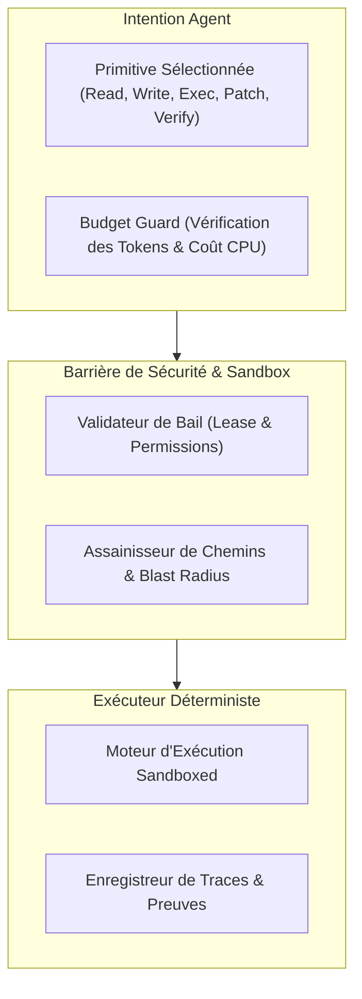
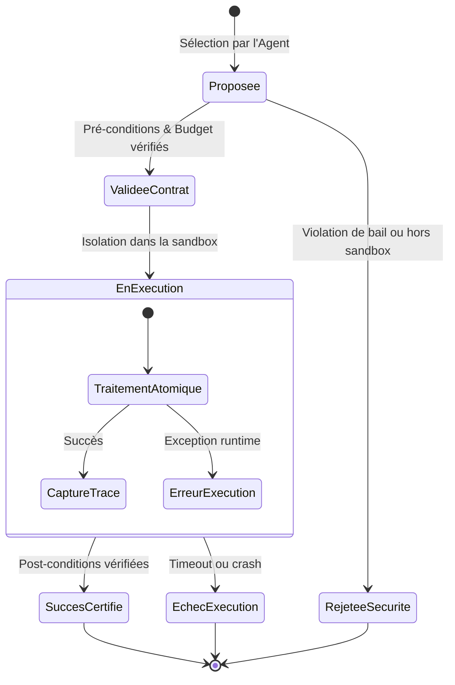

# Primitives exécutables dans GenOS

## 1. Objet et périmètre

Cette documentation décrit les primitives exécutables qui constituent le moteur opérationnel de GenOS. Elle ne décrit pas une abstraction théorique de “tool calling” ou une boîte à outils générique : elle reflète le comportement effectif du dépôt, c’est-à-dire la manière dont un agent, une stratégie, ou un orchestrateur déclenche des actions structurées et vérifiables.

Le système repose sur cinq éléments concrets :

- un registre de stratégies centralisé dans [backend/src/strategies/strategyRegistry.js](../backend/src/strategies/strategyRegistry.js) ;
- un contrat de stratégie vérifiable dans [backend/src/services/strategyContractService.js](../backend/src/services/strategyContractService.js) ;
- un adaptateur unique de dispatch dans [backend/src/services/strategyExecutionAdapter.js](../backend/src/services/strategyExecutionAdapter.js) ;
- un moteur d’exécution avec budgets, garde-fous et phases dans [backend/src/services/strategyExecutionService.js](../backend/src/services/strategyExecutionService.js) ;
- des handlers dédiés par lot dans [backend/src/services/primitiveHandlers](../backend/src/services/primitiveHandlers).

Le point clé est que GenOS ne “commande” pas un modèle par un appel libre au hasard. Il exécute des primitives nommées, enregistrées, associées à des stratégies, contraintes par des budgets et validées par des preuves d’exécution.

---

## 2. Définition fonctionnelle

Une primitive exécutable est une unité atomique de comportement autonome, associée à une stratégie et à un contexte d’exécution.

Dans le dépôt, elle se caractérise par :

- un nom symbolique, par exemple `snapshot`, `fork`, `compile_memory`, `mutate`, `causal_replay` ;
- une implémentation JavaScript dans un handler de lot ;
- une correspondance dans un registre de stratégie ;
- une exécution sous une phase de pipeline (`memory_retrieval`, `snapshot`, `isolated_forks`, etc.) ;
- une sortie structurée avec `success`, `error`, `payload`, `status`, `evidence`, ou des résultats de calcul.

Le dispatch est explicite :

```js
const HANDLERS = {
  snapshot: fundamentals.snapshot,
  fork: fundamentals.fork,
  compile_memory: memory.compileMemory,
  mutate: evolution.mutate,
  breed: evolution.breed,
  causal_replay: temporal.causalReplay,
  uncertainty_gate: governance.uncertaintyGate,
  select_winner: evolution.select
};
```

La liste complète est dans [backend/src/services/strategyExecutionAdapter.js](../backend/src/services/strategyExecutionAdapter.js).

L’intérêt d’un tel modèle est qu’une stratégie ne dépend pas d’un script monolithique. Elle agit grâce à une composition de primitives et d’étapes, chaque étape étant vérifiable et réutilisable.

---

## 3. Forme mathématique du modèle

Le système peut se représenter comme un pipeline de décisions sous contraintes.

### 3.1 Contrat de stratégie

Un contrat est construit par [backend/src/services/strategyContractService.js](../backend/src/services/strategyContractService.js). Il contient :

- `mission` ;
- `problem_profile` ;
- `selected_strategy` ;
- `strategy_portfolio` ;
- `execution_pipeline` ;
- `promotion` ;
- `observability`.

Le pipeline par défaut est :

```js
['memory_retrieval', 'snapshot', 'isolated_forks', 'instrumented_run',
 'adaptive_evaluation', 'diff_and_replay', 'audit', 'conditional_promotion']
```

### 3.2 Budget et garde-fous

Le service [backend/src/services/strategyExecutionService.js](../backend/src/services/strategyExecutionService.js) normalise un budget de ressources :

- `tokens`
- `costUsd`
- `latencyMs`
- `events`

et applique une règle de garde-fou :

$$
\text{guardrailExceeded}(m, b) = \exists k \in \{tokens, costUsd, latencyMs, events\} : m_k > b_k
$$

avec :

- $m$ = métriques réelles observées ;
- $b$ = budget autorisé.

Si cette condition est vraie, l’exécution est arrêtée ou rejetée.

### 3.3 Sélection de primitive par étape

Le mapping des étapes vers les primitives est défini dans le service d’exécution :

```js
const STAGE_PRIMITIVE_MAP = {
  memory_retrieval: ['search_memory', 'compile_memory', 'search_failures'],
  snapshot: ['snapshot'],
  isolated_forks: ['fork', 'mcts_select'],
  instrumented_run: ['vfs_dry_run', 'run'],
  adaptive_evaluation: ['evaluate', 'verify'],
  diff_and_replay: ['safe_revert'],
  audit: ['provenance', 'dependency_matrix'],
  conditional_promotion: ['select_winner', 'stdp_update', 'cherry_pick_golden_path']
};
```

Donc, si une étape est de type `memory_retrieval`, le système n’exécute qu’une primitive compatible sélectionnée dans la stratégie en cours. La règle est de rester dans le contrat, sans exécuter des primitives non stipulées.

### 3.4 Règle de promotion

Le contrat impose également des conditions de promotion :

- replay requis si risque élevé ;
- vérification indépendante obligatoire ;
- approbation humaine possible selon le risque.

L’idée est :

$$
\text{promote}(e, c) = \text{validEvidence}(e) \land \neg\text{guardrailViolation}(c) \land \text{policySatisfied}(c)
$$

Une stratégie est donc promue seulement si elle passe la preuve, la conformité, et la garde-fou de sécurité.

---

## 4. Biologie du modèle

GenOS reprend la métaphore biologique pour rendre les primitives plus lisibles, mais sans perdre la rigueur d’un moteur d’exécution.

### 4.1 Primitives comme “fonctions cellulaires”

Chaque primitive est une opération qui agit sur un état, une mémoire, un espace de travail ou une relation causale :

- `snapshot` = capture d’état ;
- `fork` = division / ramification ;
- `mutate` = perturbation contrôlée ;
- `breed` = recombinaison ;
- `search_memory` = récupération d’expérience ;
- `causal_replay` = relecture d’un chemin de cause à effet ;
- `entropy_check` = mesure de dispersion / incertitude ;
- `quarantine` = confinement d’un risque.

Le dépôt n’utilise pas la biologie comme simple décor. Il en exploite le vocabulaire fonctionnel : hiérarchie, branchement, sélection, mutation, mémoire, immunité et provenance.

### 4.2 Réplication, spécialisation et sélection

Les lots de primitives correspondent à des fonctions biologiques :

- Lot 1 : fondamentaux de survie et de reproduction (`snapshot`, `fork`, `verify`, `safe_revert`) ;
- Lot 2 : mémoire et apprentissage (`compile_memory`, `search_memory`, `stdp_update`) ;
- Lot 3 : évolution et sélection (`mutate`, `breed`, `select`, `pareto_select`) ;
- Lot 4 : sécurité et résilience (`apoptosis`, `quarantine`, `diagnose`) ;
- Lot 5 : intelligence collective (`quorum`, `trail_selection`, `weighted_quorum`) ;
- Lot 6 : causalité et temporalité (`causal_replay`, `mutated_universes`, `dependency_matrix`) ;
- Lot 7 : recherches avancées, planification et optimisation.

Cette répartition est cohérente avec les familles de stratégie dans [backend/src/strategies/families/coreStrategies.js](../backend/src/strategies/families/coreStrategies.js).

---

## 5. Architecture réelle du dépôt

### 5.1 Le registre de primitive

Le point d’entrée principal est [backend/src/services/strategyExecutionAdapter.js](../backend/src/services/strategyExecutionAdapter.js). Il charge tous les handlers par lot :

- fondamentaux ;
- mémoire ;
- évolution ;
- sécurité ;
- collectif ;
- temporel ;
- recherche ;
- computer use ;
- gouvernance ;
- optimisation ;
- planification ;
- “remaining” advanced primitives.

Chaque nom de primitive est associé à une fonction, et ce mapping est utilisé par la pipeline d’exécution.

### 5.2 Le moteur de stratégie

Le cœur est [backend/src/services/strategyExecutionService.js](../backend/src/services/strategyExecutionService.js). Il s’occupe de :

- compiler le plan d’exécution ;
- normaliser le budget ;
- suivre les étapes ;
- enregistrer les événements ;
- vérifier les conditions de garde-fou ;
- déclencher les primitives attachées à chaque phase ;
- décider si l’exécution peut être promue.

### 5.3 Le contrat et la validation

Le contrat est une couche de gouvernance. Le service [backend/src/services/strategyContractService.js](../backend/src/services/strategyContractService.js) vérifie :

- que la stratégie primaire est connue ;
- que le portfolio est valide ;
- que les primitives du portfolio sont implémentées ;
- que le registre de stratégie n’a pas changé entre la sélection et l’exécution ;
- que les branches et les budgets respectent les invariants.

Autrement dit, la primitive n’est pas seulement “appelable” : elle est “contractuelle”.

---

## 6. Lots de primitives réellement présents

### 6.1 Lot 1 — Fondamentales

Implémentation : [backend/src/services/primitiveHandlers/fundamentals.js](../backend/src/services/primitiveHandlers/fundamentals.js)

Primitives principales :

- `snapshot()` : capture d’un workspace et de son état.
- `fork()` : création d’un worker branché avec un espace isolé.
- `recursive_fork()` : branchement hiérarchique avec garde-fou Hayflick.
- `slm_route()` : routage vers un modèle local ou distant selon la config.
- `bisect_agent()` : recherche de cause par bissection d’anomalies.
- `entropyCheck()` : calcul d’entropie sur historique d’actions.
- `verify()` et `evaluate()` : validation de résultats et preuve de qualité.
- `safe_revert()` : restauration sécurisée dans les états / worktrees.
- `run()` / `vfs_dry_run()` : exécution dans un contexte isolé et autorisé.

### 6.2 Lot 2 — Mémoire

Implémentation : [backend/src/services/primitiveHandlers/memory.js](../backend/src/services/primitiveHandlers/memory.js)

Primitives principales :

- `recordExperience()` : enregistrement d’un épisode dans l’historique de mémoire.
- `compileMemory()` : indexation des faits, décisions et échecs.
- `searchMemory()` : recherche vectorielle et validation épistémique.
- `cherryPickGoldenPath()` : synthèse du chemin de réussite depuis l’historique.
- `stdpUpdate()` : mise à jour de synapses via équivalent STDP, avec tenant-scoping et trajectoire causale.

### 6.3 Lot 3 — Évolution

Implémentation : [backend/src/services/primitiveHandlers/evolution.js](../backend/src/services/primitiveHandlers/evolution.js)

Primitives principales :

- `mutate()` : création d’un mutant guidé par des mutations de gènes.
- `breed()` : rebirth/combinaison de deux parents via crossover et génétique native.
- `select()` : sélection du meilleur candidat sur base d’évidence et de score.
- `paretoSelect()` : sélection multi-objectifs (coût, qualité, temps, risque).
- `speciation()` : séparation par niche / type de rôle.

### 6.4 Lot 4 — Sécurité et résilience

Implémentation : [backend/src/services/primitiveHandlers/safety.js](../backend/src/services/primitiveHandlers/safety.js)

Primitives principales :

- `circuitBreakerOpen()` / `circuitBreakerHalfOpen()` : coupure de flux si le système devient instable ;
- `apoptosis()` : arrêt contrôlé d’un agent ou d’un sous-système ;
- `quarantine()` : isolement d’une branche ou d’un état défavorable ;
- `diagnose()` et `hypothesisEvidence()` : évaluation des causes et des preuves ;
- `permissionCheck()` : validation des permissions et des limites de déplacement.

### 6.5 Lot 5 — Collectif / swarm

Implémentation : [backend/src/services/primitiveHandlers/collective.js](../backend/src/services/primitiveHandlers/collective.js)

Primitives principales :

- `quorum` et `weightedQuorum` ;
- dépôt de trace / stigmergie ;
- sélection de parcours par signal collectif ;
- scores de confiance et réglage de cohésion.

### 6.6 Lot 6 — Temporel et causal

Implémentation : [backend/src/services/primitiveHandlers/temporal.js](../backend/src/services/primitiveHandlers/temporal.js)

Primitives principales :

- `causalReplay()` ;
- `mutatedUniverses()` ;
- `causalRebase()` ;
- `causalMerge()` ;
- `dependencyMatrix()`.

Ce lot est le plus proche de la notion de “simulation causale” : le système peut reconstituer des trajectoires alternatives, injecter une intervention et recalculer l’impact.

### 6.7 Lot 7 — Recherche, planification et optimisation

Ces primitives sont réparties dans les handlers spécialisés, par exemple :

- [backend/src/services/primitiveHandlers/search.js](../backend/src/services/primitiveHandlers/search.js) ;
- [backend/src/services/primitiveHandlers/strategyPlanning.js](../backend/src/services/primitiveHandlers/strategyPlanning.js) ;
- [backend/src/services/primitiveHandlers/strategyOptimization.js](../backend/src/services/primitiveHandlers/strategyOptimization.js) ;
- [backend/src/services/primitiveHandlers/strategySwarm.js](../backend/src/services/primitiveHandlers/strategySwarm.js) ;
- [backend/src/services/primitiveHandlers/strategyGovernance.js](../backend/src/services/primitiveHandlers/strategyGovernance.js).

---

## 7. Processus d’exécution réel

### 7.1 sélection

Le système choisit une stratégie depuis [backend/src/strategies/strategySelector.js](../backend/src/strategies/strategySelector.js) et le registre de stratégie.

### 7.2 construction du contrat

Le contrat est créé par [backend/src/services/strategyContractService.js](../backend/src/services/strategyContractService.js) :

1. sélection du portefeuille de stratégies ;
2. calcul du score ;
3. création d’un pipeline ;
4. définition des conditions de promotion et de garde-fou.

### 7.3 exécution de phase

Pour chaque étape du pipeline :

1. le moteur recherche les primitives compatibles ;
2. le dispatcher appelle le handler correct ;
3. le résultat est converti en objet d’exécution ;
4. le système met à jour la métrique de budget ;
5. il vérifie s’il faut arrêter, réviser ou promouvoir.

### 7.4 boucle de rétroaction

La boucle de feedback est explicitement dans [backend/src/services/strategyExecutionAdapter.js](../backend/src/services/strategyExecutionAdapter.js), qui gère les retours du modèle, la mise en cohérence du plan, les preuves d’exécution et la décision de continuer ou non.

---

## 8. Exemple concret

### Exemple 1 — `snapshot` + `fork` + `verify`

Un agent reçoit une mission de correction de bug critique.

1. `snapshot` capture l’état du workspace et les points de contrôle ;
2. `fork` duplique un worker isolé par espace de travail ;
3. `run` ou `vfs_dry_run` exécute dans un environnement contrôlé ;
4. `evaluate` / `verify` compare les résultats à des invariants et aux preuves ;
5. `safe_revert` ou `quarantine` annule les changements si le résultat est non fiable.

### Exemple 2 — `compile_memory` + `search_memory` + `stdp_update`

Un système apprend d’un chemin de résolution :

- `compile_memory` indexe faits, décisions et erreurs ;
- `search_memory` retrouve les expériences similaires ;
- `stdp_update` renforce ou affaiblit la force de corrélation entre cause et effet ;
- `cherry_pick_golden_path` synthétise le chemin de succès comme référence pour les futures exécutions.

### Exemple 3 — `mutate` + `breed` + `pareto_select`

Pour une évolution de stratégie :

- `mutate` perturbe les gènes du comportement ;
- `breed` combine les meilleures configurations ;
- `pareto_select` choisit le candidat qui optimise plusieurs objectifs à la fois ;
- `speciation` sépare des niches si la divergence devient trop forte.

---

## 9. Schéma de données et d’interfaces

Le dépôt applique une logique “structured output” qui favorise l’inspection et la preuve.

### 9.1 Entrées typiques d’une primitive

Les primives prennent souvent un objet contexte :

```js
{
  agentId: 'agent_42',
  orchestratorId: 'orchestrator_01',
  workspaceId: 'ws_123',
  task: 'fix regression',
  evidence: [...],
  organizationId: 'org_x',
  projectId: 'proj_y',
  threshold: 0.8,
  mutationRate: 0.05
}
```

### 9.2 Sorties typiques

Les résultats utilisent un schéma léger mais robuste :

```js
{
  success: true,
  resultCount: 5,
  warning: null,
  decisionId: 'dec-gp-...',
  evidence: [...],
  metrics: {...}
}
```

ou en cas d’échec :

```js
{
  success: false,
  error: 'workspaceId required for snapshot.',
  code: 'MISSING_INPUT'
}
```

### 9.3 Représentation de pipeline

Le pipeline d’exécution n’est pas seulement textuel : il est matérialisé dans des tables SQLite comme `strategy_execution_runs` et `strategy_execution_steps` dans le service d’exécution. Cela donne une traçabilité de phase, de coûts et d’évidence.

---

## 10. Comparaison avec le marché

| Produit / approche | Point fort | Limite | Comment GenOS se positionne |
| --- | --- | --- | --- |
| LangGraph | orchestration de nœuds et workflow | souvent davantage orienté “graph” que “contrat de preuve” | GenOS ajoute des garanties de budget, de promotion et de primitives vérifiables |
| Semantic Kernel | plugins + orchestration | plus orienté agent IA générique que runtime de stratégie | GenOS a un système de registry, contract et phase gating plus strict |
| AutoGen | multi-agent conversations | plus faible sur invariants de sécurité et lineage | GenOS ajoute hiérarchie, workers, fork, replay et audit de causalité |
| Temporal / workflow orchestration | très bon sur exécution de workflow | moins d’analogie biologiques ou de mémoire adaptive | GenOS met l’accent sur mémoire, sélection, évolution et branchement causal |
| Airflow / orchestration data | très bon sur workflows de production | pas de stratégie adaptive et d’auto-optimisation | GenOS intègre apprentissage, mutation et promotion supervisée |

Le point différenciant n’est pas uniquement “des outils” ; c’est l’association entre primitives exécutables, contrat de stratégie, garde-fou de budget et preuve d’état.

---

## 11. Ce que GenOS fait bien et ce qu’il ne fait pas

### Points forts

- un système de primitives explicitement nommées et dispatchées ;
- une exécution par étape avec budget et observabilité ;
- une séparation claire entre stratégie, exécution, validation et promotion ;
- un modèle de mémoire, évolution et causalité très cohérent avec les cas de travail autonome ;
- un besoin minimal de logique monolithique dans les contrôleurs.

### Limites / garde-fous

- certaines primitives sont plus “métaphoriques” que purement lisibles sans documentation ;
- le modèle dépend fortement du registre et du contrat ;
- si un handler est absent ou non mappé, la stratégie peut devenir partielle plutôt que complète ;
- la preuve n’est pas “absolue” ; elle est une combinaison d’évidence, de budget, de replay, de validation et de garde-fou de sécurité.

---

## 12. Conclusion

Les primitives exécutables de GenOS sont le véritable moteur de la plateforme. Elles ne sont pas seulement des fonctions utiles : ce sont des briques d’autonomie, de reproduction, de mémoire, de causalité et de validation.

Au niveau architecture :

- les stratégies décrivent le but ;
- les contrats imposent les invariants ;
- les primitives exécutent les actions ;
- les étapes de pipeline mesurent et limitent le risque ;
- la promotion sépare l’exécution productive de la simple tentative.

En ce sens, GenOS est moins un simple “framework d’agents” qu’un système d’exécution autonome à plusieurs couches, où chaque primitive est une opération de preuve, de mémoire ou d’évolution dans un environnement contrôlé.

Les références de code les plus importantes pour la vérification du modèle sont :

- [backend/src/services/strategyExecutionAdapter.js](../backend/src/services/strategyExecutionAdapter.js)
- [backend/src/services/strategyExecutionService.js](../backend/src/services/strategyExecutionService.js)
- [backend/src/services/strategyContractService.js](../backend/src/services/strategyContractService.js)
- [backend/src/strategies/strategyRegistry.js](../backend/src/strategies/strategyRegistry.js)
- [backend/src/strategies/families/coreStrategies.js](../backend/src/strategies/families/coreStrategies.js)
- [backend/src/services/primitiveHandlers/fundamentals.js](../backend/src/services/primitiveHandlers/fundamentals.js)
- [backend/src/services/primitiveHandlers/memory.js](../backend/src/services/primitiveHandlers/memory.js)
- [backend/src/services/primitiveHandlers/evolution.js](../backend/src/services/primitiveHandlers/evolution.js)
- [backend/src/services/primitiveHandlers/temporal.js](../backend/src/services/primitiveHandlers/temporal.js)
- [backend/src/services/primitiveHandlers/strategyGovernance.js](../backend/src/services/primitiveHandlers/strategyGovernance.js)


---

## Schémas d'Architecture et de Contrats de Primitives

### 1. Architecture du Pipeline d'Exécution de Primitives



### 2. Machine à états du Cycle de Vie d'une Primitive



### 3. La Chaîne de Raccordement Architecturelle Complète (Pipeline d'Exécution)

Ce schéma synthétise le cheminement réel d'une requête d'outil ou d'une primitive depuis les clients/agents jusqu'aux moteurs d'exécution spécialisés à travers le catalogue, la validation de contrat, le circuit breaker et le hub biomimétique :

```mermaid
flowchart TD
    subgraph Clients["1. Invocateurs (Agents / Orchestrateur / CLI / UI)"]
        Agent["Agent LLM (Appel d'Outil MCP)"]
        CLI["CLI / Script d'Évolution"]
        REST["API REST / JSON-RPC (/api/mcp/execute)"]
    end

    subgraph Registry["2. Dispatcher Central (backend/src/services/mcpToolRegistry.js)"]
        Detector["isRegisteredTool() & detectExecutionKind() -> 'bio' / 'strategy' / 'cli'"]
        Circuit["Circuit Breaker (Garde-fou Fail-Safe)"]
        ArgVal["Validation des Arguments & Contrats"]
    end

    subgraph Seed["3. Catalogue & Base de Données (backend/src/db/seedTools.js)"]
        MCPList["MCP_TOOLS_LIST (Enregistré dans SQLite mcp_tools)"]
    end

    subgraph Hub["4. Hubs d'Exécution Spécialisés"]
        BioHub["Hub Biomimétique (backend/src/services/mcpBioTools.js)"]
        StratHub["Hub Stratégique (backend/src/services/mcpStrategyTools.js)"]
        CliHub["Hub CLI / Native (backend/src/services/mcpExecutor.js)"]
    end

    subgraph Handlers["5. Moteurs & Registres Spécialisés (backend/src/services/mcpBioTools/handlers/)"]
        H1["thalamicBridge.js (Zero-copy sensory relay)"]
        H2["cryptophasia.js (Opcode compression & chaperone)"]
        H3["mirrorTwinFork.js (Counterfactual polar fork)"]
        H4["somaticResonance.js (Stress & entropy telemetry)"]
        H5["chimericMerge.js (Mosaic lineage merge)"]
        H6["polyovulationSpawn.js (Dizygotic multi-zygote fleet)"]
        H7["monozygoticSplit.js (Isogenic MCTS cloning)"]
        H8["hybridMultiples.js (Macro/micro cluster matrix)"]
        H9["conjoinedTwinBind.js (Visceral token coupling)"]
        H10["parasiticGraft.js (Arrested twin limb harvest)"]
        H11["fetusInFetu.js (Rescue pod & instant hatching)"]
        H12["sesquizygoticSplit.js (Dispermic 75% identity split)"]
        H13["heteropaternalSuperfecundation.js (Multi-vendor LLMs)"]
        H14["superfetationPipeline.js (Asynchronous co-gestation)"]
        H15["tissueChimerism.js (Multi-DNA compartmentalization)"]
        H16["obligatePolyembryony.js (Deterministic 4x/8x cleavage)"]
        H17["marmosetGermlineChimerism.js (Fraternal proxy spawn)"]
        H18["freemartinInhibition.js (Replication lock & compute boost)"]
        H19["embryonicDiapause.js (3-Tier zero-latency pipeline)"]
        H20["pointMutation.js (Silent, missense, nonsense STOP)"]
        H21["frameshiftMutation.js (Indel shift & compensatory pad)"]
        H22["chromosomalDeletion.js (Structural pipeline pruning)"]
        H23["chromosomalDuplication.js (Tandem copy & neofunctionalization)"]
        H24["chromosomalInversion.js (Retrograde backward reasoning)"]
        H25["chromosomalTranslocation.js (Cross-agent capability grafting)"]
        H26["aneuploidy.js (Trisomy 2/3 consensus & monosomy)"]
        H27["polyploidy.js (Multi-layer 6n wheat strategy)"]
        H28["transposonJump.js (Cut-and-paste & retrotransposition)"]
        H29["dynamicTripletExpansion.js (Microsatellite anticipation)"]
        H30["mitochondrialDnaMutation.js (Matrilineal energy metabolism)"]
        H31["epigeneticMethylation.js (Reversible environmental memory)"]
    end

    Clients --> Detector
    Seed -.-> Detector
    Detector --> ArgVal --> Circuit --> BioHub & StratHub & CliHub
    BioHub --> Handlers
```




