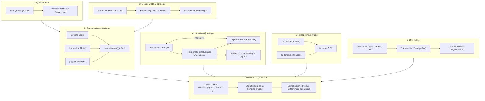

# Quantum VFS : Système de Gestion de Fichiers Quantique pour Agents GenOS

Le **Quantum VFS** de GenOS est une infrastructure logicielle de nouvelle génération qui transpose les 7 principes cardinaux de la mécanique quantique à la manipulation de fichiers, de code source et d'arbres syntaxiques pour les essaims d'agents autonomes.

---

## Architecture Globale des 7 Piliers



---

## Synthèse Détaillée des 7 Piliers

### [1. La Quantification (Les Quanta)](./quantum_vfs/01_QUANTIFICATION.md)
- **Concept** : L'énergie s'échange par paquets indivisibles ($E = h\nu$).
- **Application GenOS** : Le code source n'est plus muté par octets ou lignes arbitraires mais par paquets syntaxiques indivisibles (**quanta AST** : fonctions complètes, blocs typés). Aucune mutation ne viole la barrière de Planck syntaxique.
- **Module** : [`backend/src/services/quantumVfs/quantumAst.js`](file:///c:/Users/Shadow/Documents/GitHub/GenOS/backend/src/services/quantumVfs/quantumAst.js)

### [2. La Dualité Onde-Corpuscule](./quantum_vfs/02_DUALITE_ONDE_CORPUSCULE.md)
- **Concept** : La lumière et la matière manifestent à la fois des propriétés de corpuscule et d'onde ($\lambda = h/p$).
- **Application GenOS** : Un fichier existe simultanément comme fichier texte ASCII (corpuscule) et comme fonction d'onde sémantique vectorielle 768-D. Deux modifications concurrentes entrent en interférence constructive ou destructive.
- **Module** : [`backend/src/services/quantumVfs/waveParticleFile.js`](file:///c:/Users/Shadow/Documents/GitHub/GenOS/backend/src/services/quantumVfs/waveParticleFile.js)

### [3. La Superposition Quantique](./quantum_vfs/03_SUPERPOSITION_QUANTIQUE.md)
- **Concept** : Un état quantique est une combinaison linéaire de tous les états possibles ($|\psi\rangle = \sum \alpha_i |S_i\rangle$).
- **Application GenOS** : Un fichier peut coexister dans plusieurs implémentations concurrentes (Copy-on-Write quantique). Des évaluateurs spéculatifs testent en parallèle toutes les branches avant effondrement vers la meilleure solution.
- **Module** : [`backend/src/services/quantumVfs/superpositionEngine.js`](file:///c:/Users/Shadow/Documents/GitHub/GenOS/backend/src/services/quantumVfs/superpositionEngine.js)

### [4. L'Intrication Quantique](./quantum_vfs/04_INTRICATION_QUANTIQUE.md)
- **Concept** : Deux particules intriquées forment un système inséparable quelle que soit la distance (action fantôme d'Einstein, paradoxe EPR).
- **Application GenOS** : Les contrats, implémentations et tests associés sont intriqués. Modifier la signature dans un fichier répercute instantanément l'invariant sur ses pairs sans passer par les écritures disque.
- **Module** : [`backend/src/services/quantumVfs/entanglementEngine.js`](file:///c:/Users/Shadow/Documents/GitHub/GenOS/backend/src/services/quantumVfs/entanglementEngine.js)

### [5. Le Principe d'Incertitude d'Heisenberg](./quantum_vfs/05_PRINCIPE_INCERTITUDE_HEISENBERG.md)
- **Concept** : On ne peut mesurer avec une précision absolue à la fois la position et l'impulsion ($\Delta x \cdot \Delta p \ge \hbar/2$).
- **Application GenOS** : Régulation adaptative du pipeline agentique. Si l'impulsion de génération est maximale ($\Delta p \to \infty$), le micro-audit est allégé. Lorsqu'une certification de sécurité est requise, l'agent est ralenti pour une précision maximale.
- **Module** : [`backend/src/services/quantumVfs/heisenbergGuard.js`](file:///c:/Users/Shadow/Documents/GitHub/GenOS/backend/src/services/quantumVfs/heisenbergGuard.js)

### [6. L'Effet Tunnel](./quantum_vfs/06_EFFET_TUNNEL.md)
- **Concept** : Une particule quantique possède une probabilité non nulle de traverser une barrière de potentiel supérieure à son énergie ($T \propto \exp(-2\kappa a)$).
- **Application GenOS** : Prévention des deadlocks lors d'écritures concurrentes. Si un fichier est verrouillé par un mutex, l'agent traverse la barrière et projette une couche d'ombre asymptotique réconciliée dès libération.
- **Module** : [`backend/src/services/quantumVfs/tunnelingWriter.js`](file:///c:/Users/Shadow/Documents/GitHub/GenOS/backend/src/services/quantumVfs/tunnelingWriter.js)

### [7. La Décohérence Quantique & Cristallisation](./quantum_vfs/07_DECOHERENCE_QUANTIQUE.md)
- **Concept** : L'interaction microscopique continue avec l'environnement détruit les superpositions et ne laisse subsister que des états classiques déterminés.
- **Application GenOS** : Tant que les agents travaillent en espace virtuel cohérent, aucune I/O disque inutile n'est effectuée. Dès qu'un observateur macroscopique intervient (tests, compilateur, opérateur), le système s'effondre et cristallise sur le disque physique.
- **Module** : [`backend/src/services/quantumVfs/decoherenceEngine.js`](file:///c:/Users/Shadow/Documents/GitHub/GenOS/backend/src/services/quantumVfs/decoherenceEngine.js)

---

## Point d'Entrée Unifié

```javascript
const {
  QuantumDecoherenceEngine,
  ObservableTrigger,
  RepresentationMode,
  EntanglementMode
} = require('./src/services/quantumVfs');

const engine = new QuantumDecoherenceEngine({ workspaceRoot: './workspace' });

// 1. Stage avec superpositions concurrentes
const { superposition } = engine.stageQuantumFile('src/user.ts', 'initialCode', {
  hypotheses: [
    { label: 'fast_path', content: 'fastCode', weight: 3.0 },
    { label: 'robust_path', content: 'robustCode', weight: 1.0 }
  ]
});

// 2. Décohérence et écriture classique
await engine.triggerDecoherence(ObservableTrigger.UNIT_TEST_EXECUTION, { writeToDisk: true });
```
