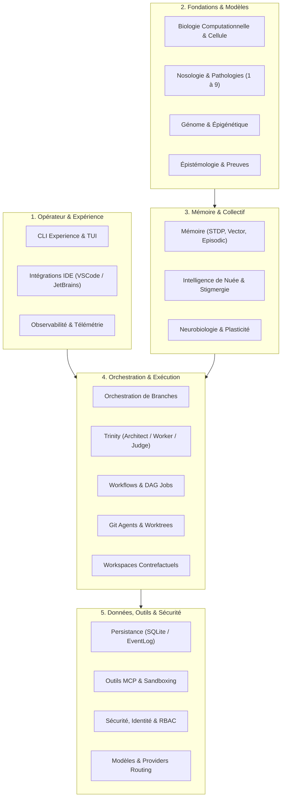
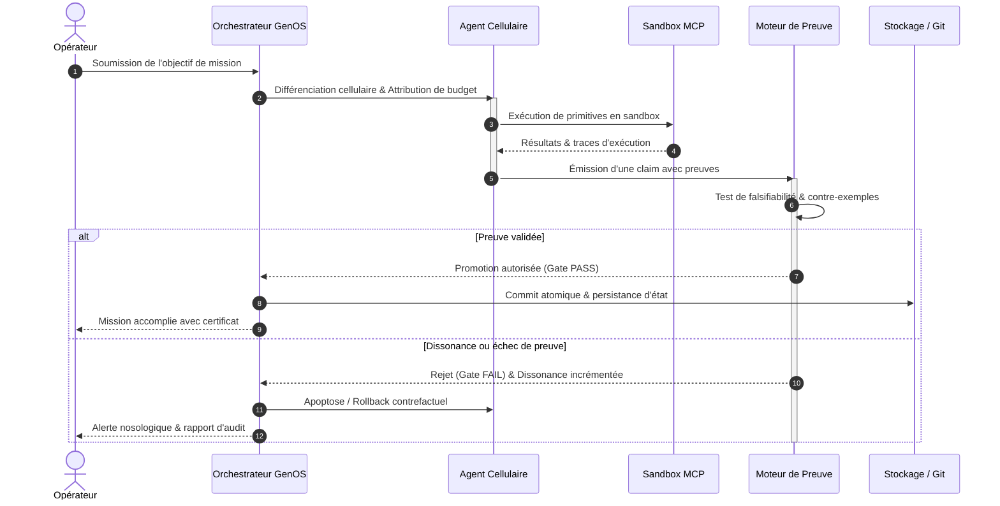
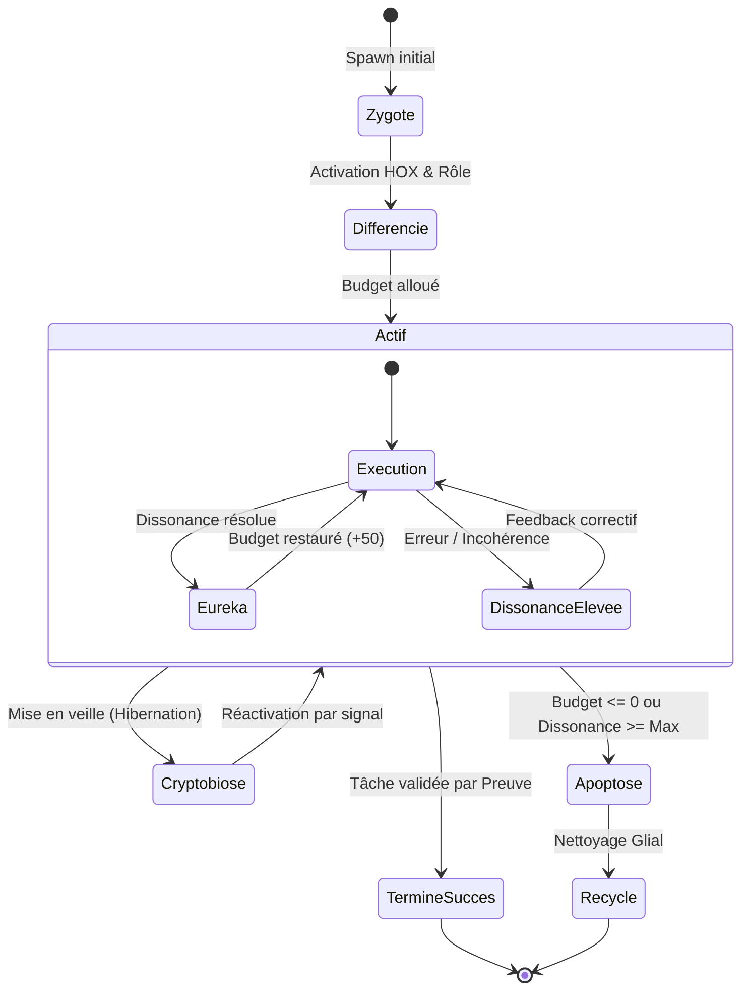

# Documentation GenOS

Ce dossier centralise la documentation technique, fonctionnelle et de gouvernance de GenOS.
L'objectif est d'offrir une lecture homogène du système, du concept jusqu'à l'exploitation,
sans jamais présenter une métaphore biologique comme une fonctionnalité prouvée.

> Règle de fond : les termes biologiques servent à organiser des invariants, pas à masquer
> une absence de preuve. Un transport réussi n'est pas une décision valide.

---

## Comment lire cette documentation

La documentation est organisée selon quatre usages (inspirés de Diátaxis). Choisissez
votre porte d'entrée, puis suivez la famille correspondante.

| Usage | Vous voulez… | Où commencer |
| --- | --- | --- |
| **Tutoriel** | apprendre le système pas à pas | [Parcours « comprendre en une heure »](#pour-comprendre-le-système-en-une-heure) |
| **Concept / explication** | comprendre *pourquoi* et *comment* | [Familles 1 à 3](#1-concepts-et-fondations) |
| **Référence** | consulter un contrat, un schéma, un catalogue | [Famille 5](#5-référence-technique) |
| **Guide / exploitation** | exécuter une tâche (opérer, déployer, réparer) | [Familles 6 à 8](#6-exploitation-et-opérations) |

Les conventions de rédaction, de nommage et de liens sont décrites dans
[CONVENTIONS.md](CONVENTIONS.md). Les décisions d'architecture sont indexées dans
[adr/README.md](adr/README.md).

---

## Modèle de rédaction des fiches de concepts

Les fiches de **concepts** (familles 1 à 3) suivent un canevas commun, avec des variantes
selon le domaine :

1. Définition du domaine
2. Modèle mathématique ou logique
3. Analogies biologiques et limites réelles
4. Cas d'usage et objectifs métier
5. Exemples concrets
6. Schéma ou diagramme
7. Architecture technique
8. Processus d'exécution ou de validation
9. Comparaison avec le marché
10. Limites, garde-fous, non-objectifs

Ce canevas n'est **pas** imposé aux documents de référence, d'exploitation ou d'ADR, qui
suivent leur propre structure. Chaque fiche doit distinguer explicitement ce qui est
implémenté, ce qui est partiel et ce qui relève du cadre conceptuel.

---

## Cartographie par familles

### 1. Concepts et fondations

Socle conceptuel, runtime, biologie computationnelle et épistémologie.

- [BIOLOGIE_COMPUTATIONNELLE.md](BIOLOGIE_COMPUTATIONNELLE.md) — biomimétique GenOS, embryogenèse, HOX, budgets et limites réelles.
- [GENOME_EPIGENETIQUE.md](GENOME_EPIGENETIQUE.md) — génome, épigénétique, chromatine, mutation et contraintes de stabilité.
- [RUNTIME_AGENTIQUE.md](RUNTIME_AGENTIQUE.md) — runtime agentique, frontières, états, garde-fous et contrôle en boucle.
- [EPISTEMOLOGIE_EVIDENCE.md](EPISTEMOLOGIE_EVIDENCE.md) — preuves, état de croyance, audit, séparation entre succès technique et vérification réelle.
- [INSTINCT.md](INSTINCT.md) — comportements innés pré-câblés, stimulus signe, Patrons d'Action Fixes, modulation hormonale.
- [AGENT_DNA_RUNTIME.md](AGENT_DNA_RUNTIME.md) — format héréditaire binaire `AgentDNA`, phénotype exprimé, opérations, signature Ed25519.
- [NEUROBIOLOGIE_PLASTICITE.md](NEUROBIOLOGIE_PLASTICITE.md) — plasticité synaptique, dendrites, réduction de la dissonance, budgets cognitifs.
- [MEMOIRE_APPRENTISSAGE.md](MEMOIRE_APPRENTISSAGE.md) — mémoire épisodique/sémantique, vector search, STDP, calibration.
- [SWARM_INTELLIGENCE.md](SWARM_INTELLIGENCE.md) — phéromones, consensus, quorum, stigmergie, optimisation distribuée.
- [FOSSILISATION.md](FOSSILISATION.md) — archive stratigraphique terminale et irréversible des lignées éteintes.

### 2. Biomimétisme spécialisé

Spécialisations biologiques non humaines et perception.

- [BIOMIMETIC_WEB_FORAGING.md](BIOMIMETIC_WEB_FORAGING.md) — foraging de Charnov, fovéation rétinienne, navigation active (épreuves web GAIA).
- [BIOMIMETISME_CELLULAIRE_SPECIALISE.md](BIOMIMETISME_CELLULAIRE_SPECIALISE.md) — spécialisations balistiques, électriques, osmotiques et acaryotes.
- [BIOMIMICRY_ANIMAL_SENSES.md](BIOMIMICRY_ANIMAL_SENSES.md) — les 5 super-sens animaux (olfaction, électroréception, magnétoréception…).

### 3. Nosologie computationnelle

Modélisation des pathologies du runtime. Vue d'ensemble et 9 familles.

- [NOSOLOGIE_COMPUTATIONNELLE_COMPLETE.md](NOSOLOGIE_COMPUTATIONNELLE_COMPLETE.md) — synthèse exhaustive des 9 familles, pharmacopée unifiée, feuille de route.
- [PATHOLOGIE_ET_MEDECINE_COMPUTATIONNELLE.md](PATHOLOGIE_ET_MEDECINE_COMPUTATIONNELLE.md) — nosologie, statut clinique, maladies nosocomiales et iatrogènes, thérapies.
- [NOSOLOGIE_1_AUTO_IMMUNES.md](NOSOLOGIE_1_AUTO_IMMUNES.md) — Lupus, polyarthrite rhumatoïde, sclérose en plaques, diabète de type 1.
- [NOSOLOGIE_2_DEGENERATIVES.md](NOSOLOGIE_2_DEGENERATIVES.md) — Alzheimer, Parkinson, arthrose.
- [NOSOLOGIE_3_INFECTIEUSES.md](NOSOLOGIE_3_INFECTIEUSES.md) — grippe, tuberculose, paludisme, VIH.
- [NOSOLOGIE_4_GENETIQUES.md](NOSOLOGIE_4_GENETIQUES.md) — mucoviscidose, drépanocytose, myopathie de Duchenne.
- [NOSOLOGIE_5_CANCERS.md](NOSOLOGIE_5_CANCERS.md) — leucémie, cancer du poumon, mélanome.
- [NOSOLOGIE_6_METABOLIQUES.md](NOSOLOGIE_6_METABOLIQUES.md) — diabète de type 2, hypothyroïdie, goutte.
- [NOSOLOGIE_7_CARDIOVASCULAIRES.md](NOSOLOGIE_7_CARDIOVASCULAIRES.md) — hypertension, infarctus du myocarde, AVC.
- [NOSOLOGIE_8_PSYCHIATRIQUES.md](NOSOLOGIE_8_PSYCHIATRIQUES.md) — dépression, schizophrénie, troubles bipolaires.
- [NOSOLOGIE_9_ENVIRONNEMENTALES.md](NOSOLOGIE_9_ENVIRONNEMENTALES.md) — asbestose, saturnisme.

### 4. Orchestration et topologies

Le cœur exécutif : branches, primitives, workspaces, et les 8 modes d'orchestration.

**Orchestration et exécution**

- [ORCHESTRATION.md](ORCHESTRATION.md) — orchestration de branches, preuve avant validation, survivants et fan-out contrôlé.
- [TOPOLOGIES_CAPACITES.md](TOPOLOGIES_CAPACITES.md) — contrat de capacités (8 modes + 19 organisations), câblage runtime, leases effectifs.
- [PRIMITIVES_EXECUTABLES.md](PRIMITIVES_EXECUTABLES.md) — primitives formelles, contrats, budgets, promotion, sécurité des actions.
- [WORKFLOWS_JOBS.md](WORKFLOWS_JOBS.md) — workflows, jobs, graphes d'états, transitions, validation.
- [WORKSPACES_ETAT_CONTRE_FACTUEL.md](WORKSPACES_ETAT_CONTRE_FACTUEL.md) — workspaces, snapshots, bisection, restore, blast radius.
- [GIT_AGENTS.md](GIT_AGENTS.md) — transposition de Git aux états d'agents, worktrees, comparaison avec Git.
- [REPRODUCTION_REPLICATION.md](REPRODUCTION_REPLICATION.md) — mitose, budding, méiose, crossover, clonage et limites d'échelle.

**Modes de composition (topologies)**

- [TRINITY.md](TRINITY.md) — orchestration comparée en trois mondes.
- [A_TEAM.md](A_TEAM.md) — orchestration multidisciplinaire d'agents autonomes.
- [BIOME.md](BIOME.md) — orchestration par environnement et populations spécialisées.
- [BIOCENOSE.md](BIOCENOSE.md) — orchestration communautaire par coopération, compétition et validation.
- [HOLOBIONTE.md](HOLOBIONTE.md) — orchestration intégrée hôte-symbionte avec sécurité et mémoire.
- [SYNCYTIUM.md](SYNCYTIUM.md) — orchestration par état partagé et synchronisation continue.
- [RHIZOME.md](RHIZOME.md) — orchestration décentralisée par ramification de capacités.
- [METAPOPULATION.md](METAPOPULATION.md) — orchestration par populations semi-indépendantes.

### 5. Référence technique

Contrats et surfaces exposées : API, outils, données, providers.

- [API_CONTRATS.md](API_CONTRATS.md) — contrats REST, gRPC, MCP, CLI, compatibilité et erreurs standardisées.
- [OUTILS_MCP.md](OUTILS_MCP.md) — outils MCP, leases, gating, permissions, surface exposée et limites.
- [PERSISTANCE_DONNEES.md](PERSISTANCE_DONNEES.md) — données, SQLite, tables, intégrité transactionnelle et design de stockage.
- [MODELES_PROVIDERS.md](MODELES_PROVIDERS.md) — providers de modèles, routing, coûts, local/remote.
- [INTEGRATIONS_IDE.md](INTEGRATIONS_IDE.md) — intégration IDE, protocoles, contrat `genos.ide/v1`.

### 6. Exploitation et opérations

Déployer, opérer, observer et reprendre.

- [DEPLOIEMENT_EXPLOITATION.md](DEPLOIEMENT_EXPLOITATION.md) — modèles de déploiement, Docker, Windows, exploitation du runtime.
- [CLI_EXPERIENCE_OPERATEUR.md](CLI_EXPERIENCE_OPERATEUR.md) — CLI, TUI et parcours opérateur.
- [OBSERVABILITE.md](OBSERVABILITE.md) — traces, diagnostics, logs, métriques, auditabilité.
- [RESILIENCE_REPRISE.md](RESILIENCE_REPRISE.md) — reprise sur crash, redémarrage, cohérence et reconstitution d'état.
- [OPERATIONS_RECOVERY.md](OPERATIONS_RECOVERY.md) — runbook d'exploitation, diagnostics, procédures de reprise (EN).

### 7. Sécurité et gouvernance

Contrôle d'accès, conformité, isolation et multi-tenant.

- [SECURITE.md](SECURITE.md) — authentification, réseau, secrets, CORS, protection des endpoints, audit.
- [IDENTITY_AUTHORITY.md](IDENTITY_AUTHORITY.md) — identités, autorité, scopes tenants, permissions, rôles.
- [COMPLIANCE_GOUVERNANCE.md](COMPLIANCE_GOUVERNANCE.md) — gouvernance, contraintes de conformité, supervision.
- [SANDBOX_EXECUTION_CODE.md](SANDBOX_EXECUTION_CODE.md) — sandbox, exécution de code, isolation et limites.
- [gestion-projet-multi-tenant.md](gestion-projet-multi-tenant.md) — gestion de projet, modèle multi-tenant et objets de domaine.

### 8. Qualité, preuves et positionnement

Validation, benchmarks et comparaison avec le marché.

- [EVALUATION_QUALITE.md](EVALUATION_QUALITE.md) — évaluation, qualité, tests générés et exécutés.
- [TESTS_VALIDATION_DEPOT.md](TESTS_VALIDATION_DEPOT.md) — validation du dépôt, architecture de test et suites.
- [LOCOMO_BENCHMARK_RESULTS.md](LOCOMO_BENCHMARK_RESULTS.md) — résultats officiels LoCoMo (Connectome natif).
- [SWE_BENCHMARK_RESULTS.md](SWE_BENCHMARK_RESULTS.md) — résultats officiels SWE-bench Lite (host Linux via WSL).
- [PANORAMA_CONCURRENTIEL.md](PANORAMA_CONCURRENTIEL.md) — comparaison transversale avec les solutions du marché.
- [ECONOMIE_ET_SCALABILITE_MULTI_AGENTS.md](ECONOMIE_ET_SCALABILITE_MULTI_AGENTS.md) — analyse économique, bavardage quadratique, benchmarks qualitatifs.

### 9. Décisions d'architecture (ADR)

Décisions structurantes, indexées dans [adr/README.md](adr/README.md).

- [adr/0001-agent-dna-binary-format.md](adr/0001-agent-dna-binary-format.md) — format héréditaire binaire `AgentDNA` (spécification : [../spec/AGENT_DNA_SPEC.md](../spec/AGENT_DNA_SPEC.md)).
- [adr/0002-agentdna-innovation-loop.md](adr/0002-agentdna-innovation-loop.md) — boucle d'innovation et promotion sous gate de preuve.
- [adr/0003-fossilization-stratigraphic-archive.md](adr/0003-fossilization-stratigraphic-archive.md) — fossilisation stratigraphique.
- [adr/0004-instinct-innate-circuits.md](adr/0004-instinct-innate-circuits.md) — instinct, circuits innés et hérédité verrouillée.

---

## Parcours de lecture recommandés

### Pour comprendre le système en une heure

1. [BIOLOGIE_COMPUTATIONNELLE.md](BIOLOGIE_COMPUTATIONNELLE.md)
2. [ORCHESTRATION.md](ORCHESTRATION.md)
3. [TOPOLOGIES_CAPACITES.md](TOPOLOGIES_CAPACITES.md)
4. [WORKSPACES_ETAT_CONTRE_FACTUEL.md](WORKSPACES_ETAT_CONTRE_FACTUEL.md)
5. [EPISTEMOLOGIE_EVIDENCE.md](EPISTEMOLOGIE_EVIDENCE.md)
6. [SECURITE.md](SECURITE.md)

### Pour opérer le runtime

1. [DEPLOIEMENT_EXPLOITATION.md](DEPLOIEMENT_EXPLOITATION.md)
2. [CLI_EXPERIENCE_OPERATEUR.md](CLI_EXPERIENCE_OPERATEUR.md)
3. [OBSERVABILITE.md](OBSERVABILITE.md)
4. [OPERATIONS_RECOVERY.md](OPERATIONS_RECOVERY.md)
5. [RESILIENCE_REPRISE.md](RESILIENCE_REPRISE.md)

### Pour développer ou intégrer

1. [API_CONTRATS.md](API_CONTRATS.md)
2. [OUTILS_MCP.md](OUTILS_MCP.md)
3. [INTEGRATIONS_IDE.md](INTEGRATIONS_IDE.md)
4. [GIT_AGENTS.md](GIT_AGENTS.md)
5. [MODELES_PROVIDERS.md](MODELES_PROVIDERS.md)
6. [PERSISTANCE_DONNEES.md](PERSISTANCE_DONNEES.md)

### Pour évaluer la sûreté et la preuve

1. [EPISTEMOLOGIE_EVIDENCE.md](EPISTEMOLOGIE_EVIDENCE.md)
2. [SECURITE.md](SECURITE.md)
3. [SANDBOX_EXECUTION_CODE.md](SANDBOX_EXECUTION_CODE.md)
4. [COMPLIANCE_GOUVERNANCE.md](COMPLIANCE_GOUVERNANCE.md)
5. [EVALUATION_QUALITE.md](EVALUATION_QUALITE.md)

---

## Schémas directeurs

### Architecture globale des domaines GenOS

### Cycle de vie et boucle de gouvernance de mission

### Matrice des états d'un agent dans l'écosystème

---

## Positionnement de la documentation

La documentation GenOS cherche à faire la différence entre :

- ce qui est un cadre conceptuel de modélisation ;
- ce qui est réellement implémenté dans le dépôt ;
- ce qui est seulement une approximation ou métaphore biologique ;
- ce qui relève d'un opérateur, d'un intégrateur, ou d'un évaluateur de sécurité.

La stabilité des noms de fichiers est importante : les chemins `docs/*.md` sont utilisés
comme identifiants de provenance par les agents (`source_doc` dans les génomes et les
binaires `.dna`). Voir [CONVENTIONS.md](CONVENTIONS.md) avant tout renommage ou déplacement.

---

## Fichiers clés du dépôt

- [../README.md](../README.md) — vue d'ensemble du projet et point d'entrée principal.
- [../Cargo.toml](../Cargo.toml) — configuration du workspace Rust.
- [../backend/README.md](../backend/README.md) — backend Node.js et API de contrôle.
- [../strategies.md](../strategies.md) — catalogue des stratégies et de leurs familles.
- [../arch_snapshot.json](../arch_snapshot.json) et [../arch_agent.json](../arch_agent.json) — snapshots architecturaux.

---

## À retenir

La documentation du dépôt est pensée comme un système cohérent :

- architecture technique ;
- preuve et vérité ;
- mémoire et évolution ;
- sécurité et autorité ;
- opérabilité et reprise ;
- intégration avec les outils et l'IDE.

Tout l'édifice est conçu pour éviter le faux « succès », où un transport ou un état
technique positif masquerait une absence d'évidence réelle.
