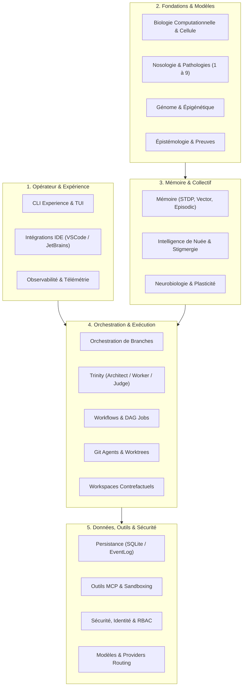
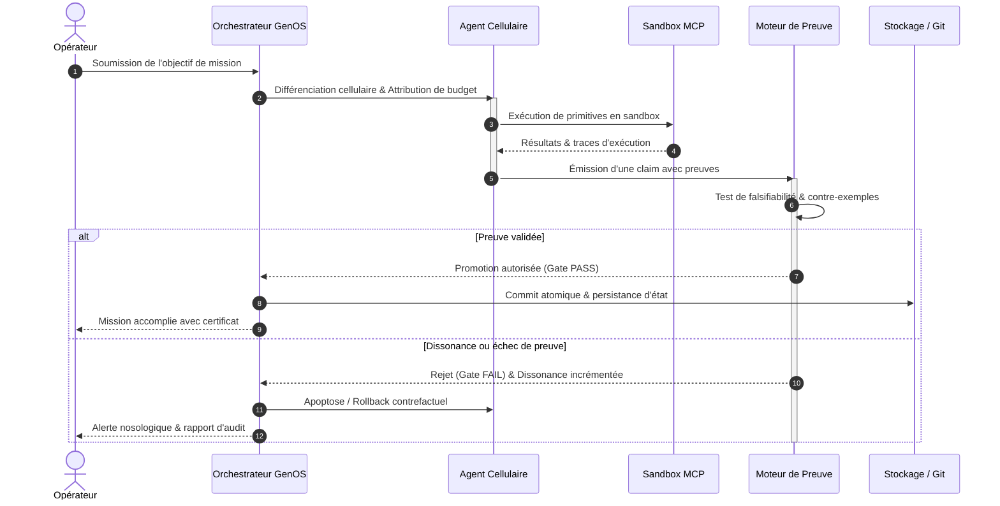
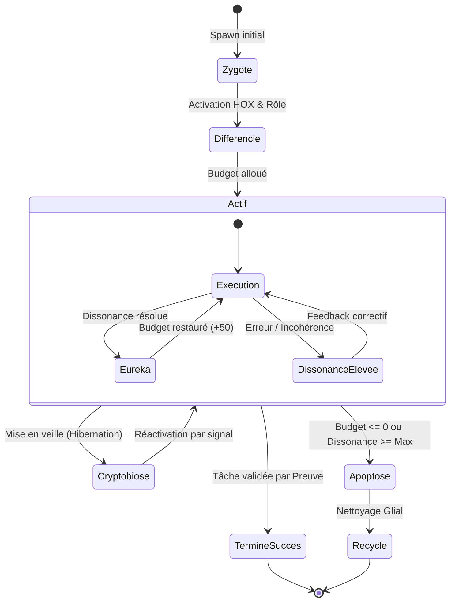

# Documentation GenOS

Ce dossier centralise la documentation technique, fonctionnelle et de gouvernance de GenOS. L’objectif est d’uniformiser la lecture du système selon un même niveau d’exigence : définition, mathématiques, biologie, cas d’usage, exemples, schémas, architecture, processus, et comparaison avec ce qui existe sur le marché.

## Modèle de documentation retenu

Chaque fichier majeur de documentation suit une structure cohérente :

1. Définition du domaine
2. Modèle mathématique ou logique
3. Analogies biologiques et limites réelles
4. Cas d’usage et objectifs métier
5. Exemples concrets
6. Schéma ou diagramme
7. Architecture technique
8. Processus d’exécution ou de validation
9. Comparaison avec le marché
10. Limites, garde-fous, non-objectifs

Cette convention permet de lire le système à plusieurs niveaux : conceptuel, technique, opérateur, sécurité, architecture, et gouvernance.

---

---

## Schémas directeurs du Hub de Documentation

### Architecture globale des domaines GenOS

### Cycle de vie et boucle de gouvernance de mission

### Matrice des états d'un agent dans l'écosystème

## Index par catégorie

### 1. Fondations conceptuelles

- [BIOLOGIE_COMPUTATIONNELLE.md](BIOLOGIE_COMPUTATIONNELLE.md) — définition de la biomimétique GenOS, modèles biologiques, embryogenèse, HOX, budgets et limites réelles.
- [BIOMIMETIC_SOFTWARE_REPAIR.md](BIOMIMETIC_SOFTWARE_REPAIR.md) — réparation logicielle biomimétique (NER, proprioception de Sherrington, excision chirurgicale UvrBC et checkpoint p53 pour SWE-bench).
- [PATHOLOGIE_ET_MEDECINE_COMPUTATIONNELLE.md](PATHOLOGIE_ET_MEDECINE_COMPUTATIONNELLE.md) — nosologie computationnelle, statut clinique, maladies auto-immunes, nosocomiales, iatrogènes, dégénératives et thérapies systémiques.
- [NOSOLOGIE_COMPUTATIONNELLE_COMPLETE.md](NOSOLOGIE_COMPUTATIONNELLE_COMPLETE.md) — synthèse exhaustive des 9 familles nosologiques (28 maladies), pharmacopée unifiée et feuille de route.
  - [NOSOLOGIE_1_AUTO_IMMUNES.md](NOSOLOGIE_1_AUTO_IMMUNES.md) — Lupus, polyarthrite rhumatoïde, sclérose en plaques, diabète de type 1.
  - [NOSOLOGIE_2_DEGENERATIVES.md](NOSOLOGIE_2_DEGENERATIVES.md) — Alzheimer, Parkinson, arthrose.
  - [NOSOLOGIE_3_INFECTIEUSES.md](NOSOLOGIE_3_INFECTIEUSES.md) — Grippe, tuberculose, paludisme, VIH.
  - [NOSOLOGIE_4_GENETIQUES.md](NOSOLOGIE_4_GENETIQUES.md) — Mucoviscidose, drépanocytose, myopathie de Duchenne.
  - [NOSOLOGIE_5_CANCERS.md](NOSOLOGIE_5_CANCERS.md) — Leucémie, cancer du poumon, mélanome.
  - [NOSOLOGIE_6_METABOLIQUES.md](NOSOLOGIE_6_METABOLIQUES.md) — Diabète de type 2, hypothyroïdie, goutte.
  - [NOSOLOGIE_7_CARDIOVASCULAIRES.md](NOSOLOGIE_7_CARDIOVASCULAIRES.md) — Hypertension, infarctus du myocarde, AVC.
  - [NOSOLOGIE_8_PSYCHIATRIQUES.md](NOSOLOGIE_8_PSYCHIATRIQUES.md) — Dépression, schizophrénie, troubles bipolaires.
  - [NOSOLOGIE_9_ENVIRONNEMENTALES.md](NOSOLOGIE_9_ENVIRONNEMENTALES.md) — Asbestose, saturnisme.
- [GENOME_EPIGENETIQUE.md](GENOME_EPIGENETIQUE.md) — génome, épigénétique, chromatine, mutation, spécification et contraintes de stabilité.
- [RUNTIME_AGENTIQUE.md](RUNTIME_AGENTIQUE.md) — runtime agentique, frontières, exécution, états, garde-fous et contrôle en boucle.
- [EPISTEMOLOGIE_EVIDENCE.md](EPISTEMOLOGIE_EVIDENCE.md) — preuves, état de croyance, validation, audit et séparation entre "succès technique" et "vérification réelle".

### 2. Mémoire, apprentissage et neurobiologie

- [MEMOIRE_APPRENTISSAGE.md](MEMOIRE_APPRENTISSAGE.md) — mémoire épisodique/sémantique, vector search, STDP, calibration et limites du système.
- [NEUROBIOLOGIE_PLASTICITE.md](NEUROBIOLOGIE_PLASTICITE.md) — plasticité synaptique, dendrites, réduction de la dissonance, budgets cognitifs.
- [SWARM_INTELLIGENCE.md](SWARM_INTELLIGENCE.md) — phéromones, consensus, quorum, stigmergie, optimisation distribuée et comparaison avec les systèmes de nuée.

### 3. Orchestration, primitives et workspaces

- [ORCHESTRATION.md](ORCHESTRATION.md) — orchestration de branches, preuve avant validation, gestion de survivants et fan-out contrôlé.
- [GIT_AGENTS.md](GIT_AGENTS.md) — transposition de Git aux états d’agents, opérations agentiques, worktrees et comparaison directe avec Git.
- [PRIMITIVES_EXECUTABLES.md](PRIMITIVES_EXECUTABLES.md) — primitives formelles, contrats, budgets, promotion, sélection et sécurité des actions.
- [WORKFLOWS_JOBS.md](WORKFLOWS_JOBS.md) — workflows, jobs, graphes d’états, transitions, validation, machine d’état et robustesse.
- [WORKSPACES_ETAT_CONTRE_FACTUEL.md](WORKSPACES_ETAT_CONTRE_FACTUEL.md) — workspaces, snapshots, bisection, restore, divergence causale, blast radius.
- [REPRODUCTION_REPLICATION.md](REPRODUCTION_REPLICATION.md) — reproduction, mitose, budding, meiosis, crossover, clonage et limites d’échelle.

### 4. Sécurité, identité et conformité

- [SECURITE.md](SECURITE.md) — authentification, sécurité réseau, secrets, CORS, protection des endpoints, garde-fous et audit.
- [IDENTITY_AUTHORITY.md](IDENTITY_AUTHORITY.md) — identités, autorité, scopes tenants, permissions, rôles et contrôle de domaine.
- [COMPLIANCE_GOUVERNANCE.md](COMPLIANCE_GOUVERNANCE.md) — gouvernance, contraintes de conformité et modèles de supervision.
- [OBSERVABILITE.md](OBSERVABILITE.md) — trace, diagnostics, structures de logs, métriques, auditabilité et limites de supervision.
- [RESILIENCE_REPRISE.md](RESILIENCE_REPRISE.md) — reprise sur crash, redémarrage, récupération, cohérence du système, reconstitution de l’état.
- [OPERATIONS_RECOVERY.md](OPERATIONS_RECOVERY.md) — runbook d’exploitation, diagnostics, procédures de reprise et checklist d’intervention.

### 5. Données, intégration et déploiement

- [PERSISTANCE_DONNEES.md](PERSISTANCE_DONNEES.md) — données, SQLite, tables, persistance, intégrité transactionnelle et design de stockage.
- [API_CONTRATS.md](API_CONTRATS.md) — contrats REST, gRPC, MCP, CLI, compatibilité et réponse d’erreur standardisée.
- [OUTILS_MCP.md](OUTILS_MCP.md) — outils MCP, leases, gating, permissions, surface exposée et limites.
- [INTEGRATIONS_IDE.md](INTEGRATIONS_IDE.md) — intégration avec IDE, protocoles, compatibilité et développement multi-éditeur.
- [MODELES_PROVIDERS.md](MODELES_PROVIDERS.md) — providers de modèles, routing, réduction des coûts, support local/remote et stratégie d’accès.
- [DEPLOIEMENT_EXPLOITATION.md](DEPLOIEMENT_EXPLOITATION.md) — modèles de déploiement, Docker, Windows, environnement et exploitation de runtime.
- [SANDBOX_EXECUTION_CODE.md](SANDBOX_EXECUTION_CODE.md) — sandbox, exécution de code, limites, sécurité d’exécution et isolation.

### 6. Validation, qualité et opérateur

- [PANORAMA_CONCURRENTIEL.md](PANORAMA_CONCURRENTIEL.md) — comparaison transversale de GenOS avec les principales familles de solutions concurrentes et complémentaires.
- [ECONOMIE_ET_SCALABILITE_MULTI_AGENTS.md](ECONOMIE_ET_SCALABILITE_MULTI_AGENTS.md) — analyse économique, modélisation mathématique du bavardage quadratique, comparaison 1/10/100 agents et benchmark qualitatif (Simple, Moyen, Dur, Complexe, NP-difficile).

## Chemins de lecture recommandés

### Pour comprendre le système en une heure

1. [BIOLOGIE_COMPUTATIONNELLE.md](BIOLOGIE_COMPUTATIONNELLE.md)
2. [ORCHESTRATION.md](ORCHESTRATION.md)
3. [WORKSPACES_ETAT_CONTRE_FACTUEL.md](WORKSPACES_ETAT_CONTRE_FACTUEL.md)
4. [GIT_AGENTS.md](GIT_AGENTS.md)
5. [API_CONTRATS.md](API_CONTRATS.md)
6. [SECURITE.md](SECURITE.md)

### Pour opérer le runtime

1. [DEPLOIEMENT_EXPLOITATION.md](DEPLOIEMENT_EXPLOITATION.md)
2. [CLI_EXPERIENCE_OPERATEUR.md](CLI_EXPERIENCE_OPERATEUR.md)
3. [OBSERVABILITE.md](OBSERVABILITE.md)
4. [OPERATIONS_RECOVERY.md](OPERATIONS_RECOVERY.md)
5. [RESILIENCE_REPRISE.md](RESILIENCE_REPRISE.md)

### Pour développer ou intégrer

1. [API_CONTRATS.md](API_CONTRATS.md)
2. [OUTILS_MCP.md](OUTILS_MCP.md)
3. [INTEGRATIONS_IDE.md](INTEGRATIONS_IDE.md)
4. [GIT_AGENTS.md](GIT_AGENTS.md)
5. [MODELES_PROVIDERS.md](MODELES_PROVIDERS.md)
6. [PERSISTANCE_DONNEES.md](PERSISTANCE_DONNEES.md)

---

## Positionnement de la documentation

La documentation GenOS cherche à faire la différence entre :

- ce qui est un cadre conceptuel de modélisation ;
- ce qui est réellement implémenté dans le dépôt ;
- ce qui est seulement une approximation ou métaphore biologique ;
- ce qui relève d’un opérateur, d’un intégrateur, ou d’un évaluateur de sécurité.

La règle de fond est la suivante : les termes biologiques servent à organiser des invariants, pas à masquer une absence de preuve.

---

## Fichiers clés du dépôt

- [../README.md](../README.md) — vue d’ensemble du projet et point d’entrée principal.
- [../Cargo.toml](../Cargo.toml) — configuration du workspace Rust.
- [../backend/README.md](../backend/README.md) — backend Node.js et API de contrôle.
- [../strategies.md](../strategies.md) — catalogue des stratégies et des familles de stratégies.
- [../arch_snapshot.json](../arch_snapshot.json) et [../arch_agent.json](../arch_agent.json) — snapshots architecturaux du système.

---

## À retenir

La documentation du dépôt est pensée comme un système cohérent :

- architecture technique ;
- preuve et vérité ;
- mémoire et évolution ;
- sécurité et autorité ;
- opérabilité et reprise ;
- intégration avec les outils et l’IDE.

Tout l’édifice est conçu pour éviter le faux “succès”, où un transport ou un état technique positif masquerait une absence d’évidence réelle.
