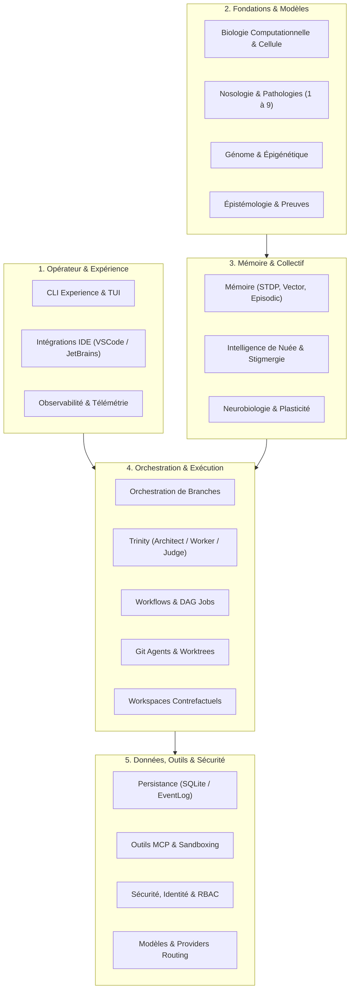
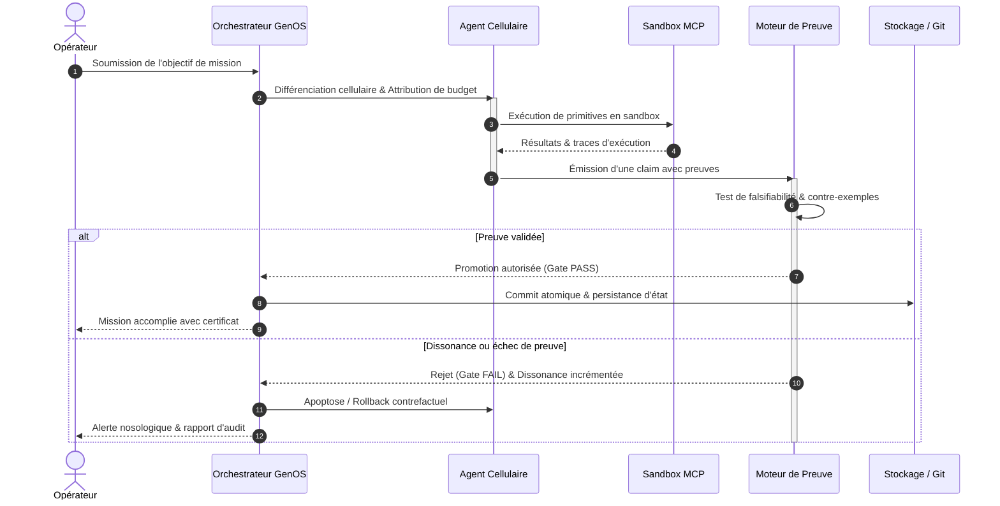
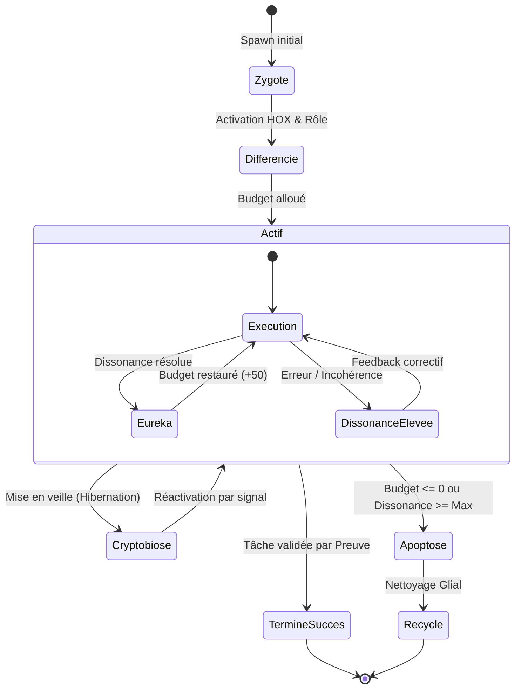

# Documentation GenOS

Ce dossier centralise la documentation technique, fonctionnelle et de gouvernance de GenOS.
L'objectif est d'offrir une lecture homogène du système, du concept jusqu'à l'exploitation,
sans jamais présenter une métaphore biologique comme une fonctionnalité prouvée.

> Règle de fond : les termes biologiques servent à organiser des invariants, pas à masquer
> une absence de preuve. Un transport réussi n'est pas une décision valide.

---

## Comment lire cette documentation

La documentation est organisée selon quatre usages (inspirés de Diátaxis). Choisissez
votre porte d'entrée, puis suivez la famille correspondante.

| Usage | Vous voulez… | Où commencer |
| --- | --- | --- |
| **Tutoriel** | apprendre le système pas à pas | [Parcours « comprendre en une heure »](#pour-comprendre-le-système-en-une-heure) |
| **Concept / explication** | comprendre *pourquoi* et *comment* | [Familles 1 à 3](#1-concepts-et-fondations) |
| **Référence** | consulter un contrat, un schéma, un catalogue | [Famille 5](#5-référence-technique) |
| **Guide / exploitation** | exécuter une tâche (opérer, déployer, réparer) | [Famille 6](#6-exploitation-et-opérations) |

Les conventions de rédaction, de nommage et de liens sont décrites dans
[CONVENTIONS.md](CONVENTIONS.md). Les décisions d'architecture sont indexées dans
[adr/README.md](adr/README.md).

---

## Modèle de rédaction des fiches de concepts

Les fiches de **concepts** (familles 1 à 3) suivent un canevas commun, avec des variantes
selon le domaine :

1. Définition du domaine
2. Modèle mathématique ou logique
3. Analogies biologiques et limites réelles
4. Cas d'usage et objectifs métier
5. Exemples concrets
6. Schéma ou diagramme
7. Architecture technique
8. Processus d'exécution ou de validation
9. Comparaison avec le marché
10. Limites, garde-fous, non-objectifs

Ce canevas n'est **pas** imposé aux documents de référence, d'exploitation ou d'ADR, qui
suivent leur propre structure. Chaque fiche doit distinguer explicitement ce qui est
implémenté, ce qui est partiel et ce qui relève du cadre conceptuel.

---

## Cartographie par familles

### 1. Concepts et fondations

Index : [01-concepts/README.md](01-concepts/README.md)

Fondations conceptuelles, runtime, génome, mémoire et épistémologie.

- [biologie-computationnelle.md](01-concepts/biologie-computationnelle.md) — biomimétique, embryogenèse, HOX, budgets.
- [genome-et-epigenetique.md](01-concepts/genome-et-epigenetique.md) — génome, chromatine, mutation, stabilité.
- [runtime-agentique.md](01-concepts/runtime-agentique.md) — runtime agentique, états, garde-fous.
- [epistemologie-et-evidence.md](01-concepts/epistemologie-et-evidence.md) — preuves, croyance, succès ≠ vérité.
- [natural-search-control-plane.md](01-concepts/natural-search-control-plane.md) — plan de contrôle de recherche naturelle : pression, progression causal, ledger d'hypothèses, contrôleur.
- [savoir-et-epistemologie.md](01-concepts/savoir-et-epistemologie.md) — savoir, croyance, Gettier, inférence, vérité et épistémologie sociale.
- [conscience-esprit-mental.md](01-concepts/conscience-esprit-mental.md) — taxonomie de la conscience, de l'esprit et du mental.
- [instinct.md](01-concepts/instinct.md) — circuits innés, Patrons d'Action Fixes, modulation hormonale.
- [agent-dna-runtime.md](01-concepts/agent-dna-runtime.md) — format binaire AgentDNA et opérations.
- [neurobiologie-et-plasticite.md](01-concepts/neurobiologie-et-plasticite.md) — plasticité synaptique, dendrites, dissonance.
- [memoire-et-apprentissage.md](01-concepts/memoire-et-apprentissage.md) — mémoire épisodique/sémantique, vector search, STDP.
- [intelligence-de-nuee.md](01-concepts/intelligence-de-nuee.md) — phéromones, consensus, quorum, stigmergie.
- [fossilisation.md](01-concepts/fossilisation.md) — archive stratigraphique terminale des lignées.
- [philosophie-des-mathematiques.md](01-concepts/philosophie-des-mathematiques.md) — objets mathématiques, fondements, infini et preuve.
- [adaptive-epistemic-immune-system.md](01-concepts/adaptive-epistemic-immune-system.md) — système immunitaire épistémique adaptatif (antigène, immunité innée/adaptative, sélection clonale, mémoire, inflammation, biocénose, métapopulation, stigmergie, holobionte, challenge).
- [organes-vitaux-agents.md](01-concepts/organes-vitaux-agents.md) — systèmes 6-10 : sensorium, métabolisme, résilience, développement, symbiontes procéduraux ; boucle morphogénétique unifiée.

### 2. Biomimétisme spécialisé

Index : [01-concepts/biomimetisme/README.md](01-concepts/biomimetisme/README.md)

- [web-foraging.md](01-concepts/biomimetisme/web-foraging.md) — foraging de Charnov, fovéation, navigation active (GAIA).
- [cellulaire-specialise.md](01-concepts/biomimetisme/cellulaire-specialise.md) — spécialisations balistiques, électriques, osmotiques, acaryotes.
- [sens-animaux.md](01-concepts/biomimetisme/sens-animaux.md) — les 5 super-sens animaux.
- [primitives-controle-animal.md](01-concepts/biomimetisme/primitives-controle-animal.md) — comportements animaux compilés en primitives de controle vérifiables.

### 3. Nosologie computationnelle

Index : [01-concepts/nosologie/README.md](01-concepts/nosologie/README.md)

- [vue-ensemble.md](01-concepts/nosologie/vue-ensemble.md) — synthèse des 9 familles, pharmacopée, feuille de route.
- [pathologie-et-medecine.md](01-concepts/nosologie/pathologie-et-medecine.md) — nosologie, statut clinique, nosocomiales, iatrogènes.
- [01-auto-immunes.md](01-concepts/nosologie/01-auto-immunes.md) · [02-degeneratives.md](01-concepts/nosologie/02-degeneratives.md) · [03-infectieuses.md](01-concepts/nosologie/03-infectieuses.md) · [04-genetiques.md](01-concepts/nosologie/04-genetiques.md) · [05-cancers.md](01-concepts/nosologie/05-cancers.md) · [06-metaboliques.md](01-concepts/nosologie/06-metaboliques.md) · [07-cardiovasculaires.md](01-concepts/nosologie/07-cardiovasculaires.md) · [08-psychiatriques.md](01-concepts/nosologie/08-psychiatriques.md) · [09-environnementales.md](01-concepts/nosologie/09-environnementales.md)

### 4. Orchestration et topologies

Index : [02-orchestration/README.md](02-orchestration/README.md)

**Exécution**

- [orchestration.md](02-orchestration/orchestration.md) — branches, preuve avant validation, survivants, fan-out.
- [architecture-survie.md](02-orchestration/architecture-survie.md) — état de survie mesurable et politiques de continuité bornées.
- [regulation-multi-boucles.md](02-orchestration/regulation-multi-boucles.md) — régulation multi-boucles, signaux et arbitrage.
- [theorie-du-soi-orchestrator.md](02-orchestration/theorie-du-soi-orchestrator.md) — modèle de soi calculé, calibration et garde-fous décisionnels.
- [topologies-et-capacites.md](02-orchestration/topologies-et-capacites.md) — contrat de capacités (8 modes + 19 organisations), leases effectifs.
- [primitives-executables.md](02-orchestration/primitives-executables.md) — primitives formelles, contrats, budgets, promotion.
- [workflows-et-jobs.md](02-orchestration/workflows-et-jobs.md) — workflows, jobs, graphes d'états, transitions.
- [workspaces-contrefactuel.md](02-orchestration/workspaces-contrefactuel.md) — snapshots, bisection, restore, blast radius.
- [git-agents.md](02-orchestration/git-agents.md) — transposition de Git aux états d'agents.
- [reproduction-et-replication.md](02-orchestration/reproduction-et-replication.md) — mitose, budding, méiose, clonage.
- [dossiers-agents-et-conscience.md](02-orchestration/dossiers-agents-et-conscience.md) — dossiers de preuves et conscience opérationnelle.
- [contrats-strategie-et-execution.md](02-orchestration/contrats-strategie-et-execution.md) — contrats versionnés et exécution.

**Modes de composition (topologies)** — index : [02-orchestration/topologies/README.md](02-orchestration/topologies/README.md)

- [trinity.md](02-orchestration/topologies/trinity.md) — orchestration comparée en trois mondes.
- [a-team.md](02-orchestration/topologies/a-team.md) — équipe multidisciplinaire d'agents.
- [biome.md](02-orchestration/topologies/biome.md) — orchestration par environnement et populations.
- [biocenose.md](02-orchestration/topologies/biocenose.md) — orchestration communautaire.
- [holobionte.md](02-orchestration/topologies/holobionte.md) — orchestration hôte-symbionte.
- [syncytium.md](02-orchestration/topologies/syncytium.md) — état partagé et synchronisation continue.
- [rhizome.md](02-orchestration/topologies/rhizome.md) — ramification décentralisée de capacités.
- [metapopulation.md](02-orchestration/topologies/metapopulation.md) — populations semi-indépendantes.

### 5. Référence technique

Index : [03-reference/README.md](03-reference/README.md)

- [types-de-workers.md](03-reference/types-de-workers.md) — catalogue des types de workers, profils Node et limites d’intégration.
- [api-et-contrats.md](03-reference/api-et-contrats.md) — REST, gRPC, MCP, CLI, compatibilité, erreurs.
- [outils-mcp.md](03-reference/outils-mcp.md) — catalogue d'outils, leases, gating, permissions.
- [persistance-et-donnees.md](03-reference/persistance-et-donnees.md) — SQLite, tables, intégrité, stockage.
- [resultats-formels-messagepack.md](03-reference/resultats-formels-messagepack.md) — contrat canonique, preuves, provenance et encodage binaire des résultats.
- [registre-philosophique.md](03-reference/registre-philosophique.md) — concepts, relations, mappings, maturité et garde-fous.
- [modeles-et-providers.md](03-reference/modeles-et-providers.md) — providers, routing, coûts, local/remote.
- [integrations-ide.md](03-reference/integrations-ide.md) — contrat IDE `genos.ide/v1`.
- [notifications-et-alertes.md](03-reference/notifications-et-alertes.md) — préférences et alertes tenant-scoped.
- [preuves-produit-et-safe-debugging.md](03-reference/preuves-produit-et-safe-debugging.md) — preuves backend et safe debugging.
- [contrat-produit-et-completude.md](03-reference/contrat-produit-et-completude.md) — périmètre livré, statuts de maturité, critères de preuve et environnements supportés.
- [pont-rust-et-hallucinations.md](03-reference/pont-rust-et-hallucinations.md) — bridge REST vers `genos-cli`.
- Spécifications normatives : [`../spec/AGENT_DNA_SPEC.md`](../spec/AGENT_DNA_SPEC.md), [`../spec/GENOME_SPEC.md`](../spec/GENOME_SPEC.md).

### 6. Exploitation et opérations

Index : [04-exploitation/README.md](04-exploitation/README.md)

- [deploiement.md](04-exploitation/deploiement.md) — modèles de déploiement, Docker, Windows.
- [cli-et-experience-operateur.md](04-exploitation/cli-et-experience-operateur.md) — CLI, TUI, parcours opérateur.
- [observabilite.md](04-exploitation/observabilite.md) — traces, diagnostics, logs, métriques, audit.
- [resilience-et-reprise.md](04-exploitation/resilience-et-reprise.md) — reprise sur crash, cohérence, reconstitution.
- [runbook-recovery.md](04-exploitation/runbook-recovery.md) — runbook d'exploitation et reprise (EN).
- [releases-et-rollouts.md](04-exploitation/releases-et-rollouts.md) — releases, rollouts, rollback et chargeback.

### 7. Sécurité et gouvernance

Index : [05-securite-gouvernance/README.md](05-securite-gouvernance/README.md)

- [securite.md](05-securite-gouvernance/securite.md) — authentification, réseau, secrets, CORS, endpoints, audit.
- [identite-et-autorite.md](05-securite-gouvernance/identite-et-autorite.md) — identités, autorité, scopes tenants, rôles.
- [conformite-et-gouvernance.md](05-securite-gouvernance/conformite-et-gouvernance.md) — gouvernance, conformité, supervision.
- [sandbox-execution-code.md](05-securite-gouvernance/sandbox-execution-code.md) — sandbox, isolation, limites.
- [gestion-projet-multi-tenant.md](05-securite-gouvernance/gestion-projet-multi-tenant.md) — gestion de projet et multi-tenant.
- [sso-oidc-saml.md](05-securite-gouvernance/sso-oidc-saml.md) — fédération OIDC/SAML.
- [approbations-platform.md](05-securite-gouvernance/approbations-platform.md) — approbations et contrôles platform.

### 8. Qualité, preuves et positionnement

Index : [06-qualite-preuves/README.md](06-qualite-preuves/README.md) · [07-positionnement/README.md](07-positionnement/README.md)

- [audit-affirmations-operationnelles.md](06-qualite-preuves/audit-affirmations-operationnelles.md) — audit code/documentation des contrats, routes, MCP, sécurité, persistance et reprise.

- [evaluation-qualite.md](06-qualite-preuves/evaluation-qualite.md) — évaluation, qualité, tests générés et exécutés.
- [tests-et-validation.md](06-qualite-preuves/tests-et-validation.md) — validation du dépôt et suites de test.
- [tests-des-contrats-recents.md](06-qualite-preuves/tests-des-contrats-recents.md) — validation des contrats récemment documentés.
- [benchmark-ateam.md](06-benchmarks/benchmark-ateam.md) — protocole apparié A-Team, ablations et limites des résultats.
- [matrice-coherence-code-docs.md](06-qualite-preuves/matrice-coherence-code-docs.md) — registre de cohérence code↔documentation.
- [locomo.md](06-qualite-preuves/benchmarks/locomo.md) — résultats officiels LoCoMo.
- [swe-bench-lite.md](06-qualite-preuves/benchmarks/swe-bench-lite.md) — résultats officiels SWE-bench Lite.
- [panorama-concurrentiel.md](07-positionnement/panorama-concurrentiel.md) — comparaison avec le marché.
- [economie-et-scalabilite.md](07-positionnement/economie-et-scalabilite.md) — analyse économique et scalabilité.

### 9. Décisions d'architecture (ADR)

Index : [adr/README.md](adr/README.md)

- [0001-agent-dna-binary-format.md](adr/0001-agent-dna-binary-format.md) — format héréditaire binaire `AgentDNA`.
- [0002-agentdna-innovation-loop.md](adr/0002-agentdna-innovation-loop.md) — boucle d'innovation et promotion sous gate.
- [0003-fossilization-stratigraphic-archive.md](adr/0003-fossilization-stratigraphic-archive.md) — fossilisation stratigraphique.
- [0004-instinct-innate-circuits.md](adr/0004-instinct-innate-circuits.md) — instinct, circuits innés et hérédité verrouillée.
- [0005-reorganisation-arborescence-documentaire.md](adr/0005-reorganisation-arborescence-documentaire.md) — réorganisation de l'arborescence documentaire.
- [0014-theorie-du-soi-operationnelle.md](adr/0014-theorie-du-soi-operationnelle.md) — modèle de soi calculé et contraintes de décision.
- [0015-convergence-organisme-cognitif-composite.md](adr/0015-convergence-organisme-cognitif-composite.md) — convergence mesurable et posture d'action contrôlée.
- [0016-effets-runtime-philosophiques-controles.md](adr/0016-effets-runtime-philosophiques-controles.md) — effets philosophiques séparés et contrôlés.
- [0017-philosophie-politique-et-gouvernance.md](adr/0017-philosophie-politique-et-gouvernance.md) — philosophie politique, mappings et gouvernance prudente.
- [0018-gouvernance-registre-philosophique.md](adr/0018-gouvernance-registre-philosophique.md) — séparation concepts, relations, mappings et services.
- [0018-execution-cognitive-via-client-mcp.md](adr/0018-execution-cognitive-via-client-mcp.md) — exécution cognitive via le client MCP (`caller_mcp`, précurseur ADR 0036).
- [0019-socle-epistemique-du-savoir.md](adr/0019-socle-epistemique-du-savoir.md) — socle épistémique du savoir (index complet : voir [adr/README.md](adr/README.md), notamment 0020–0028, 0030, 003x).
- [0029-resultat-formel-messagepack.md](adr/0029-resultat-formel-messagepack.md) — contrat canonique, empreintes et transport binaire des résultats formels.
- [0036-harness-compatibility-layer.md](adr/0036-harness-compatibility-layer.md) — harness remplaçable, registre et routage par capacités.
- [0037-ecosysteme-agentique-11-15.md](adr/0037-ecosysteme-agentique-11-15.md) — écosystème agentique : environnement/niches, substrat cognitif natif-first, physiologie collective, plan de gouvernance, interoception collective.
- [0038-boucle-controle-cognitif-morphogenese.md](adr/0038-boucle-controle-cognitif-morphogenese.md) — boucle de contrôle cognitif de la morphogenèse.
- [0039-systemes-vitaux-agents-6-10.md](adr/0039-systemes-vitaux-agents-6-10.md) — systèmes vitaux 6-10 : sensorium, métabolisme, résilience, développement, symbiontes procéduraux.
- [0040-morphogenese-git-contrefactuel.md](adr/0040-morphogenese-git-contrefactuel.md) — morphogenèse versionnée Git et contrefactuelle.
- [0041-medecine-immunite-graduee.md](adr/0041-medecine-immunite-graduee.md) — médecine graduée et immunité proportionnée.
- [0042-qpu-organe-specialise.md](adr/0042-qpu-organe-specialise.md) — QPU comme organe spécialisé et sélection quantum-inspired.
- [0043-runtime-worker-phenotypes.md](adr/0043-runtime-worker-phenotypes.md) — runtime worker commun et phenotypes composables.
- [0044-matrice-autorite-gates-double-runtime.md](adr/0044-matrice-autorite-gates-double-runtime.md) — matrice d'autorité unifiée, gates de provenance et d'observabilité, double runtime.
- [0045-noyau-controle-morphogenetique.md](adr/0045-noyau-controle-morphogenetique.md) — noyau de contrôle morphogénétique de l'orchestrateur Rust.
- [0046-routage-minimal-memoire-resultats.md](adr/0046-routage-minimal-memoire-resultats.md) — routage minimal suffisant des requêtes et mémoire des meilleurs résultats (réutilisation, champion, validité).
- [0047-sessions-persistantes-metapopulation.md](adr/0047-sessions-persistantes-metapopulation.md) — contrats, sessions persistantes et journal régional de Métapopulation.
- [0070-syncytium-variant-code.md](adr/0070-syncytium-variant-code.md) — état de code partagé, détection des ruptures de symboles et portée de l'analyse lexicale.
- [0078-syncytium-variant-graphe.md](adr/0078-syncytium-variant-graphe.md) — nœuds, arêtes, références valides et contrôle d'acyclicité.
- [0071-morphogenese-fractale-et-controle-local.md](adr/0071-morphogenese-fractale-et-controle-local.md) — délégation locale bornée, contrôle à trois échelles et pression morphologique.
- [0076-runtime-morphogenese-v2.md](adr/0076-runtime-morphogenese-v2.md) — Rust comme autorité de décision et Node comme runtime sémantique et opérateur.
- [0063-contrats-worker-autorite-bornee.md](adr/0063-contrats-worker-autorite-bornee.md) — autorité de promotion et plafonds de spawn/délégation des workers.
- [0064-registre-workerkind-node-et-dispatch.md](adr/0064-registre-workerkind-node-et-dispatch.md) — registre canonique Node et propagation du type au dispatch.
- [0086-branche-rhizome-morphogenese.md](adr/0086-branche-rhizome-morphogenese.md) — branche Rhizome proposée dans un graphe Morphogenèse, avec budget et gate de preuve.
- [0089-gates-decision-biocenose.md](adr/0089-gates-decision-biocenose.md) — gates de preuve, veto minoritaire et quarantaine au point de finalisation Biocénose.
- [0090-variants-executables-biocenose.md](adr/0090-variants-executables-biocenose.md) — politiques de variant liées à la constitution et appliquées par le runtime.
- [0100-controle-ecologique-biocenose.md](adr/0100-controle-ecologique-biocenose.md) — observation du tour et décisions écologiques append-only, reliées aux handoffs Morphogenèse.
- [0097-calibration-immunitaire-holobionte.md](adr/0097-calibration-immunitaire-holobionte.md) — mesurer les faux positifs et faux négatifs immunitaires avec des preuves indépendantes.
- [0103-vecteur-fitness-holobionte.md](adr/0103-vecteur-fitness-holobionte.md) — conserver les dix dimensions de fitness séparément avec leurs preuves.
- [0104-dysbiose-holobionte.md](adr/0104-dysbiose-holobionte.md) — observer le déséquilibre du Holobionte à partir de signaux bornés.
- [0105-benchmark-longitudinal-holobionte.md](adr/0105-benchmark-longitudinal-holobionte.md) — comparer douze variantes sur 50 à 100 missions appariées.
- [0106-detection-surreaction-immunitaire-holobionte.md](adr/0106-detection-surreaction-immunitaire-holobionte.md) — signaler les blocages répétés de résultats sûrs sans affaiblir les gates.
- [0107-impact-keystone-holobionte.md](adr/0107-impact-keystone-holobionte.md) — mesurer la contribution par comparaison appariée avec et sans symbionte.
- [0108-branchement-topologies-fail-closed.md](adr/0108-branchement-topologies-fail-closed.md) — dispatch commun des huit topologies et migrations refusées sans adaptateur testé.
- [types-de-workers.md](03-reference/types-de-workers.md) — catalogue des 19 types et état d'intégration.

---

## Parcours de lecture recommandés

### Pour comprendre le système en une heure

1. [biologie-computationnelle.md](01-concepts/biologie-computationnelle.md)
2. [orchestration.md](02-orchestration/orchestration.md)
3. [topologies-et-capacites.md](02-orchestration/topologies-et-capacites.md)
4. [workspaces-contrefactuel.md](02-orchestration/workspaces-contrefactuel.md)
5. [epistemologie-et-evidence.md](01-concepts/epistemologie-et-evidence.md)
6. [securite.md](05-securite-gouvernance/securite.md)

### Pour opérer le runtime

1. [deploiement.md](04-exploitation/deploiement.md)
2. [cli-et-experience-operateur.md](04-exploitation/cli-et-experience-operateur.md)
3. [observabilite.md](04-exploitation/observabilite.md)
4. [runbook-recovery.md](04-exploitation/runbook-recovery.md)
5. [resilience-et-reprise.md](04-exploitation/resilience-et-reprise.md)

### Pour développer ou intégrer

1. [api-et-contrats.md](03-reference/api-et-contrats.md)
2. [outils-mcp.md](03-reference/outils-mcp.md)
3. [integrations-ide.md](03-reference/integrations-ide.md)
4. [git-agents.md](02-orchestration/git-agents.md)
5. [modeles-et-providers.md](03-reference/modeles-et-providers.md)
6. [persistance-et-donnees.md](03-reference/persistance-et-donnees.md)

### Pour évaluer la sûreté et la preuve

1. [epistemologie-et-evidence.md](01-concepts/epistemologie-et-evidence.md)
2. [securite.md](05-securite-gouvernance/securite.md)
3. [sandbox-execution-code.md](05-securite-gouvernance/sandbox-execution-code.md)
4. [conformite-et-gouvernance.md](05-securite-gouvernance/conformite-et-gouvernance.md)
5. [evaluation-qualite.md](06-qualite-preuves/evaluation-qualite.md)

---

## Schémas directeurs

### Architecture globale des domaines GenOS

### Cycle de vie et boucle de gouvernance de mission

### Matrice des états d'un agent dans l'écosystème

---

## Positionnement de la documentation

La documentation GenOS cherche à faire la différence entre :

- ce qui est un cadre conceptuel de modélisation ;
- ce qui est réellement implémenté dans le dépôt ;
- ce qui est seulement une approximation ou métaphore biologique ;
- ce qui relève d'un opérateur, d'un intégrateur, ou d'un évaluateur de sécurité.

Depuis l'[ADR 0005](adr/0005-reorganisation-arborescence-documentaire.md), les documents
sont rangés par familles et nommés en `kebab-case`. Les chemins restent des identifiants
de provenance (`source_doc`) : tout déplacement futur doit être traité comme une
migration, selon [CONVENTIONS.md](CONVENTIONS.md).

---

## Fichiers clés du dépôt

- [../README.md](../README.md) — vue d'ensemble du projet et point d'entrée principal.
- [../Cargo.toml](../Cargo.toml) — configuration du workspace Rust.
- [../backend/README.md](../backend/README.md) — backend Node.js et API de contrôle.
- [../strategies.md](../strategies.md) — catalogue des stratégies et de leurs familles.
- [../arch_snapshot.json](../arch_snapshot.json) et [../arch_agent.json](../arch_agent.json) — snapshots architecturaux.

---

## À retenir

La documentation du dépôt est pensée comme un système cohérent :

- architecture technique ;
- preuve et vérité ;
- mémoire et évolution ;
- sécurité et autorité ;
- opérabilité et reprise ;
- intégration avec les outils et l'IDE.

Tout l'édifice est conçu pour éviter le faux « succès », où un transport ou un état
technique positif masquerait une absence d'évidence réelle.
