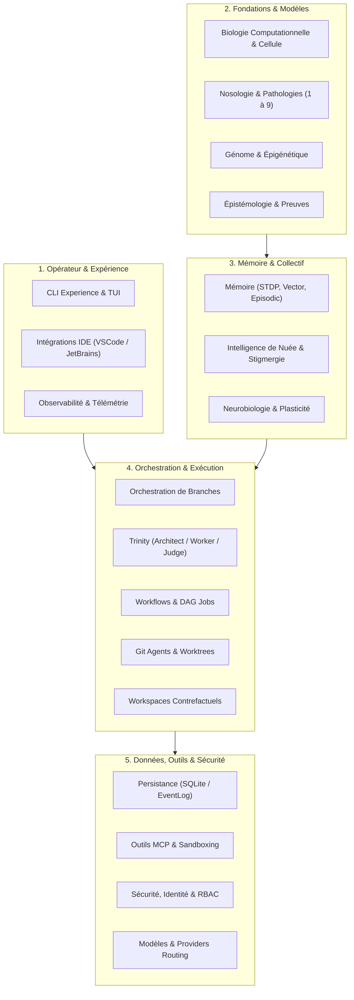
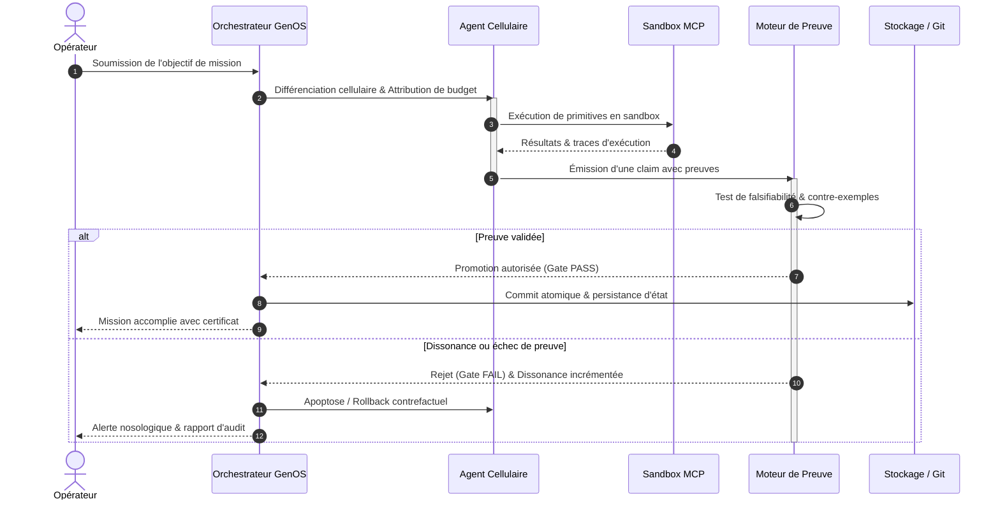
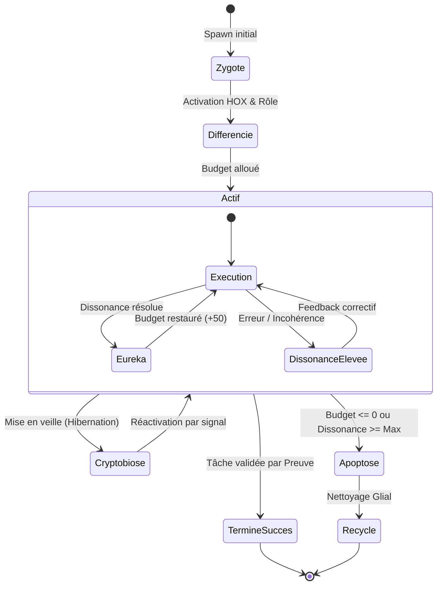

# Documentation GenOS

Ce dossier centralise la documentation technique, fonctionnelle et de gouvernance de GenOS.
L'objectif est d'offrir une lecture homogène du système, du concept jusqu'à l'exploitation,
sans jamais présenter une métaphore biologique comme une fonctionnalité prouvée.

> Règle de fond : les termes biologiques servent à organiser des invariants, pas à masquer
> une absence de preuve. Un transport réussi n'est pas une décision valide.

---

## Comment lire cette documentation

La documentation est organisée selon quatre usages (inspirés de Diátaxis). Choisissez
votre porte d'entrée, puis suivez la famille correspondante.

| Usage | Vous voulez… | Où commencer |
| --- | --- | --- |
| **Tutoriel** | apprendre le système pas à pas | [Parcours « comprendre en une heure »](#pour-comprendre-le-système-en-une-heure) |
| **Concept / explication** | comprendre *pourquoi* et *comment* | [Familles 1 à 3](#1-concepts-et-fondations) |
| **Référence** | consulter un contrat, un schéma, un catalogue | [Famille 5](#5-référence-technique) |
| **Guide / exploitation** | exécuter une tâche (opérer, déployer, réparer) | [Famille 6](#6-exploitation-et-opérations) |

Les conventions de rédaction, de nommage et de liens sont décrites dans
[CONVENTIONS.md](CONVENTIONS.md). Les décisions d'architecture sont indexées dans
[adr/README.md](adr/README.md).

---

## Modèle de rédaction des fiches de concepts

Les fiches de **concepts** (familles 1 à 3) suivent un canevas commun, avec des variantes
selon le domaine :

1. Définition du domaine
2. Modèle mathématique ou logique
3. Analogies biologiques et limites réelles
4. Cas d'usage et objectifs métier
5. Exemples concrets
6. Schéma ou diagramme
7. Architecture technique
8. Processus d'exécution ou de validation
9. Comparaison avec le marché
10. Limites, garde-fous, non-objectifs

Ce canevas n'est **pas** imposé aux documents de référence, d'exploitation ou d'ADR, qui
suivent leur propre structure. Chaque fiche doit distinguer explicitement ce qui est
implémenté, ce qui est partiel et ce qui relève du cadre conceptuel.

---

## Cartographie par familles

### 1. Concepts et fondations

Index : [01-concepts/README.md](01-concepts/README.md)

Fondations conceptuelles, runtime, génome, mémoire et épistémologie.

- [biologie-computationnelle.md](01-concepts/biologie-computationnelle.md) — biomimétique, embryogenèse, HOX, budgets.
- [genome-et-epigenetique.md](01-concepts/genome-et-epigenetique.md) — génome, chromatine, mutation, stabilité.
- [runtime-agentique.md](01-concepts/runtime-agentique.md) — runtime agentique, états, garde-fous.
- [physique-computationnelle.md](01-concepts/physique-computationnelle.md) — acquisition bornée, coûts physiques des plans et profils appris persistants dans le runtime Rust.
- [ontogenese.md](01-concepts/ontogenese.md) — orchestrateur résident de projet, missions bornées et vérifiées.
- [gvx.md](01-concepts/gvx.md) — développement vérifié : transformations, preuves, interoception, plasticité et transmission.
- [epistemologie-et-evidence.md](01-concepts/epistemologie-et-evidence.md) — preuves, croyance, succès ≠ vérité.
- [natural-search-control-plane.md](01-concepts/natural-search-control-plane.md) — contrôle de pression et de progrès causal, ledger d'hypothèses, reprise atomique SQLite des phases 6–12 et transmission culturelle sous preuve.
- [savoir-et-epistemologie.md](01-concepts/savoir-et-epistemologie.md) — savoir, croyance, Gettier, inférence, vérité et épistémologie sociale.
- [conscience-esprit-mental.md](01-concepts/conscience-esprit-mental.md) — taxonomie de la conscience, de l'esprit et du mental.
- [indicateurs-fonctionnels.md](01-concepts/indicateurs-fonctionnels.md) — suivi des indicateurs fonctionnels : implémentation, statut, limites.
- [plan-validation-indicateurs.md](06-qualite-preuves/plan-validation-indicateurs.md) — audit des indicateurs et programme de couverture fonctionnelle et de validation causale.
- [suivi-validation-indicateurs.md](06-qualite-preuves/suivi-validation-indicateurs.md) — suivi d'exécution et résultats des contrôles.
- [matrice-preuves-indicateurs.md](06-qualite-preuves/matrice-preuves-indicateurs.md) — matrice finale des preuves, limites et commandes de reproduction.
- [instinct.md](01-concepts/instinct.md) — circuits innés, Patrons d'Action Fixes, modulation hormonale.
- [agent-dna-runtime.md](01-concepts/agent-dna-runtime.md) — format binaire AgentDNA et opérations.
- [neurobiologie-et-plasticite.md](01-concepts/neurobiologie-et-plasticite.md) — plasticité synaptique, dendrites, dissonance.
- [memoire-et-apprentissage.md](01-concepts/memoire-et-apprentissage.md) — mémoire épisodique/sémantique, vector search, STDP.
- [intelligence-de-nuee.md](01-concepts/intelligence-de-nuee.md) — phéromones, consensus, quorum, stigmergie.
- [fossilisation.md](01-concepts/fossilisation.md) — archive stratigraphique terminale des lignées.
- [philosophie-des-mathematiques.md](01-concepts/philosophie-des-mathematiques.md) — objets mathématiques, fondements, infini et preuve.
- [adaptive-epistemic-immune-system.md](01-concepts/adaptive-epistemic-immune-system.md) — système immunitaire épistémique adaptatif : mémoire et autorité persistantes, quorum exécutable, niches dynamiques, workers provider isolés et qualification de `approveRun()`.
- [organes-vitaux-agents.md](01-concepts/organes-vitaux-agents.md) — systèmes 6-10 : sensorium, métabolisme, résilience, développement, symbiontes procéduraux ; boucle morphogénétique unifiée.

### 2. Biomimétisme spécialisé

Index : [01-concepts/biomimetisme/README.md](01-concepts/biomimetisme/README.md)

- [web-foraging.md](01-concepts/biomimetisme/web-foraging.md) — foraging de Charnov, fovéation, navigation active (GAIA).
- [axolotl.md](01-concepts/biomimetisme/axolotl.md) — régénération partielle et cognitive sous preuves, métamorphose et coûts du runtime natif.
- [cellulaire-specialise.md](01-concepts/biomimetisme/cellulaire-specialise.md) — spécialisations balistiques, électriques, osmotiques, acaryotes.
- [sens-animaux.md](01-concepts/biomimetisme/sens-animaux.md) — les 5 super-sens animaux.
- [primitives-controle-animal.md](01-concepts/biomimetisme/primitives-controle-animal.md) — comportements animaux compilés en primitives de controle vérifiables.

### 3. Nosologie computationnelle

Index : [01-concepts/nosologie/README.md](01-concepts/nosologie/README.md)

- [catalogue-runtime.md](01-concepts/nosologie/catalogue-runtime.md) — 28 conditions, 9 familles, 48 opérateurs et contrats de preuve.
- [ADR 0326](adr/0326-catalogue-nosologique-et-preuve-application.md) — catalogue nosologique et preuve d’application.
- [vue-ensemble.md](01-concepts/nosologie/vue-ensemble.md) — synthèse des 9 familles, pharmacopée, feuille de route.
- [pathologie-et-medecine.md](01-concepts/nosologie/pathologie-et-medecine.md) — nosologie, statut clinique, nosocomiales, iatrogènes.
- [01-auto-immunes.md](01-concepts/nosologie/01-auto-immunes.md) · [02-degeneratives.md](01-concepts/nosologie/02-degeneratives.md) · [03-infectieuses.md](01-concepts/nosologie/03-infectieuses.md) · [04-genetiques.md](01-concepts/nosologie/04-genetiques.md) · [05-cancers.md](01-concepts/nosologie/05-cancers.md) · [06-metaboliques.md](01-concepts/nosologie/06-metaboliques.md) · [07-cardiovasculaires.md](01-concepts/nosologie/07-cardiovasculaires.md) · [08-psychiatriques.md](01-concepts/nosologie/08-psychiatriques.md) · [09-environnementales.md](01-concepts/nosologie/09-environnementales.md)

### 4. Orchestration et topologies

Index : [02-orchestration/README.md](02-orchestration/README.md)

**Exécution**

- [AGOW](02-orchestration/agow.md) — workspace cognitif actif, candidats, compétition, frames récurrents, broadcasts et requêtes attentionnelles.
- [Système prédictif multi-échelles](02-orchestration/systeme-predictif-multi-echelles.md) — états T0–T6, plasticité graduée et erreurs persistantes.
- [Lacunes d'apprentissage GVX](02-orchestration/lacunes-apprentissage-gvx.md) — détection multi-signal et buts bornés soumis à autorité.
- [Nursery expérimentale GVX](02-orchestration/nursery-experimentale-gvx.md) — exécution de bras isolés avec artefacts vérifiés indépendamment.
- [Monitoring longitudinal GVX](02-orchestration/monitoring-longitudinal-gvx.md) — suivi multi-contextes, arrêt sur régression et éligibilité de maturité.
- [Plan de puissance benchmark GVX](02-orchestration/plan-puissance-benchmark-gvx.md) — réplication dérivée de l'effet minimal et de la variance attendue.
- [Adaptateurs GVX runtime](02-orchestration/adaptateurs-gvx-runtime.md) — cycle standard AGOW, bridge outcome et adaptateurs personnalisés.
- [Profil d’exécution GVX](02-orchestration/profil-execution-gvx.md) — profils opérateur épinglés, évaluateur fixe, application, suivi et reprise.
- [environnement-hote.md](03-reference/environnement-hote.md) — mesures de la machine, choix du disque et régulation des ressources.
- [orchestration.md](02-orchestration/orchestration.md) — branches, preuve avant validation, survivants, fan-out.
- [shev.md](02-orchestration/shev.md) — responsabilité, capteurs signés, boucle surveillée, récupération et transfert vérifié.
- [exploitation-shev.md](03-reference/exploitation-shev.md) — commandes opérateur, signatures, fournisseurs et diagnostic de SHEV.
- [g-cir.md](02-orchestration/g-cir.md) — interface cognitive résiduelle, registre d'obligations, visibilité, validation et limites.
- [architecture-survie.md](02-orchestration/architecture-survie.md) — état de survie mesurable et politiques de continuité bornées.
- [regulation-multi-boucles.md](02-orchestration/regulation-multi-boucles.md) — régulation multi-boucles, signaux et arbitrage.
- [theorie-du-soi-orchestrator.md](02-orchestration/theorie-du-soi-orchestrator.md) — modèle de soi calculé, calibration et garde-fous décisionnels.
- [ontogenese-boucle.md](02-orchestration/ontogenese-boucle.md) — boucle Observer → réévaluer : sélection, autorisation, réveils, notifications.
- [topologies-et-capacites.md](02-orchestration/topologies-et-capacites.md) — contrat de capacités (8 modes + 19 organisations), leases effectifs.
- [primitives-executables.md](02-orchestration/primitives-executables.md) — primitives formelles, contrats, budgets, promotion.
- [workflows-et-jobs.md](02-orchestration/workflows-et-jobs.md) — workflows, jobs, graphes d'états, transitions.
- [workspaces-contrefactuel.md](02-orchestration/workspaces-contrefactuel.md) — snapshots, bisection, restore, blast radius.
- [git-agents.md](02-orchestration/git-agents.md) — transposition de Git aux états d'agents.
- [reproduction-et-replication.md](02-orchestration/reproduction-et-replication.md) — mitose, budding, méiose, clonage.
- [dossiers-agents-et-conscience.md](02-orchestration/dossiers-agents-et-conscience.md) — dossiers de preuves et conscience opérationnelle.
- [contrats-strategie-et-execution.md](02-orchestration/contrats-strategie-et-execution.md) — contrats versionnés et exécution.
- [meristeme-epistemique.md](02-orchestration/meristeme-epistemique.md) — expériences discriminantes et couverture vérifiée.
- [spirale-de-deblocage.md](02-orchestration/spirale-de-deblocage.md) — déblocage par différence d'intervention, d'échelle ou de preuve.
- [chronotaxie-aperiodique.md](02-orchestration/chronotaxie-aperiodique.md) — observation déphasée et couverture des phases.
- [cambium-contre-exemples.md](02-orchestration/cambium-contre-exemples.md) — témoins et contre-exemples des procédures.
- [infini-sous-contrat.md](02-orchestration/infini-sous-contrat.md) — conservation du risque statistique dans une lignée.
- [relations-inter-agents.md](02-orchestration/relations-inter-agents.md) — relations typées entre agents (29 types, 6 classes, persistance, fiches et schémas par type).
- [physiologie-relationnelle.md](02-orchestration/physiologie-relationnelle.md) — noyau déterministe de contraintes relationnelles et raccord ciblé au routage de communication.
- [communication.md](02-orchestration/communication.md) — écologie communicationnelle : 7 types, schémas par type, grounding, coûts, shadow et apprentissage.

**Modes de composition (topologies)** — index : [02-orchestration/topologies/README.md](02-orchestration/topologies/README.md)

- [trinity.md](02-orchestration/topologies/trinity.md) — orchestration comparée, baseline à trois mondes et variants expérimentaux à fan-out contrôlé.
- [a-team.md](02-orchestration/topologies/a-team.md) — équipe multidisciplinaire d'agents.
- [runtime-a-team.md](03-reference/runtime-a-team.md) — clôture canonique, preuves, accusés et reprise A-Team ; conformité globale partielle.
- [biome.md](02-orchestration/topologies/biome.md) — orchestration par environnement et populations.
- [biocenose.md](02-orchestration/topologies/biocenose.md) — orchestration communautaire.
- [holobionte.md](02-orchestration/topologies/holobionte.md) — orchestration hôte-symbionte.
- [syncytium.md](02-orchestration/topologies/syncytium.md) — état partagé, 13 variants et limites de preuve des missions.
- [protocole-missions-syncytium.md](02-orchestration/topologies/protocole-missions-syncytium.md) — budget, matrice des 53 cas et preuves attendues.
- [rhizome.md](02-orchestration/topologies/rhizome.md) — missions par capacités, croissance vérifiée, budgets et routage borné.
- [metapopulation.md](02-orchestration/topologies/metapopulation.md) — populations semi-indépendantes, migrations vérifiées et reprise régionale.
- [garage-fabric.md](02-orchestration/topologies/garage-fabric.md) — garage adaptatif des workers, leases et admission multi-stratégies.

### 5. Référence technique

Index : [03-reference/README.md](03-reference/README.md)

- [types-de-workers.md](03-reference/types-de-workers.md) — catalogue des types de workers, profils Node et limites d’intégration.
- [types-de-daemons.md](03-reference/types-de-daemons.md) — catalogue des daemons : archétype, organelles, 10 phénotypes et schémas par type.
- [api-et-contrats.md](03-reference/api-et-contrats.md) — REST, gRPC, MCP, CLI, compatibilité, erreurs.
- [contrat-mission-comparative.md](03-reference/contrat-mission-comparative.md) — schéma versionné des missions multi-populations et frontières entre runtime, topologie et banc d’essai.
- [outils-mcp.md](03-reference/outils-mcp.md) — catalogue d'outils, leases, gating, permissions.
- [axolotl-regeneration.md](03-reference/axolotl-regeneration.md) — contrat des primitives, persistance, états, budgets et limites d’admission.
- [persistance-et-donnees.md](03-reference/persistance-et-donnees.md) — SQLite, tables, intégrité, stockage.
- [resultats-formels-messagepack.md](03-reference/resultats-formels-messagepack.md) — contrat canonique, preuves, provenance et encodage binaire des résultats.
- [registre-philosophique.md](03-reference/registre-philosophique.md) — concepts, relations, mappings, maturité et garde-fous.
- [contrats-philosophiques-ontogenese.md](03-reference/contrats-philosophiques-ontogenese.md) — raccord des 375 contrats philosophiques au plan de mission et au runtime harness Ontogenèse.
- [runtime-holobionte.md](03-reference/runtime-holobionte.md) — missions contractuelles, preuves indépendantes, quotas et clôture Holobionte.
- [modeles-et-providers.md](03-reference/modeles-et-providers.md) — providers, routing, coûts, local/remote.
- [integrations-ide.md](03-reference/integrations-ide.md) — contrat IDE `genos.ide/v1`.
- [notifications-et-alertes.md](03-reference/notifications-et-alertes.md) — préférences et alertes tenant-scoped.
- [preuves-produit-et-safe-debugging.md](03-reference/preuves-produit-et-safe-debugging.md) — preuves backend et safe debugging.
- [contrat-produit-et-completude.md](03-reference/contrat-produit-et-completude.md) — périmètre livré, statuts de maturité, critères de preuve et environnements supportés.
- [pont-rust-et-hallucinations.md](03-reference/pont-rust-et-hallucinations.md) — bridge REST vers `genos-cli`.
- [runtime-metapopulation.md](03-reference/runtime-metapopulation.md) — API, adaptateurs, persistance, reprise et validation des dix suites dédiées.
- [plugins-topologies-morphogenese.md](03-reference/plugins-topologies-morphogenese.md) — câblage des 8 topologies au runtime morphologique.
- [runtime-rhizome.md](03-reference/runtime-rhizome.md) — contrat runtime, providers, preuves, limites et CLI Rhizome.
- [ontogenese-contrats.md](03-reference/ontogenese-contrats.md) — contrats stables V1 de l'Ontogenèse : tables, config, états, claims, sélecteur, intégrateur, CLI.
- Spécifications normatives : [`../spec/AGENT_DNA_SPEC.md`](../spec/AGENT_DNA_SPEC.md), [`../spec/GENOME_SPEC.md`](../spec/GENOME_SPEC.md).

### 6. Exploitation et opérations

Index : [04-exploitation/README.md](04-exploitation/README.md)

- [deploiement.md](04-exploitation/deploiement.md) — modèles de déploiement, Docker, Windows.
- [cli-et-experience-operateur.md](04-exploitation/cli-et-experience-operateur.md) — CLI, TUI, parcours opérateur.
- [ontogenese.md](04-exploitation/ontogenese.md) — ontogenèse : exploitation locale, mémoire, reprise, diagnostic, rollback.
- [observabilite.md](04-exploitation/observabilite.md) — traces, diagnostics, logs, métriques, audit.
- [resilience-et-reprise.md](04-exploitation/resilience-et-reprise.md) — reprise sur crash, cohérence, reconstitution.
- [runbook-recovery.md](04-exploitation/runbook-recovery.md) — runbook d'exploitation et reprise (EN).
- [releases-et-rollouts.md](04-exploitation/releases-et-rollouts.md) — releases, rollouts, rollback et chargeback.

### 7. Sécurité et gouvernance

Index : [05-securite-gouvernance/README.md](05-securite-gouvernance/README.md)

- [securite.md](05-securite-gouvernance/securite.md) — authentification, réseau, secrets, CORS, endpoints, audit.
- [identite-et-autorite.md](05-securite-gouvernance/identite-et-autorite.md) — identités, autorité, scopes tenants, rôles.
- [conformite-et-gouvernance.md](05-securite-gouvernance/conformite-et-gouvernance.md) — gouvernance, conformité, supervision.
- [sandbox-execution-code.md](05-securite-gouvernance/sandbox-execution-code.md) — sandbox, isolation, limites.
- [service-verificateur-gvx.md](05-securite-gouvernance/service-verificateur-gvx.md) — service séparé, reçus Ed25519 et capteurs GVX alimentés.
- [gestion-projet-multi-tenant.md](05-securite-gouvernance/gestion-projet-multi-tenant.md) — gestion de projet et multi-tenant.
- [sso-oidc-saml.md](05-securite-gouvernance/sso-oidc-saml.md) — fédération OIDC/SAML.
- [approbations-platform.md](05-securite-gouvernance/approbations-platform.md) — approbations et contrôles platform.

### 8. Qualité, preuves et positionnement

Index : [06-qualite-preuves/README.md](06-qualite-preuves/README.md) · [07-positionnement/README.md](07-positionnement/README.md)

- [audit-affirmations-operationnelles.md](06-qualite-preuves/audit-affirmations-operationnelles.md) — audit code/documentation des contrats, routes, MCP, sécurité, persistance et reprise.
- [plan-implementation-gvx.md](06-qualite-preuves/plan-implementation-gvx.md) — avancement des lots GVX et état des preuves attendues.
- [validation-cycle-standard-gvx.md](06-qualite-preuves/validation-cycle-standard-gvx.md) — tests exécutés au commit `ac3423cb` et limites de leur portée.

- [evaluation-qualite.md](06-qualite-preuves/evaluation-qualite.md) — évaluation, qualité, tests générés et exécutés.

- [validation-nosologie.md](06-qualite-preuves/validation-nosologie.md) — résultats ciblés du 2026-10-06 et limites des vérifications globales.
- [tests-et-validation.md](06-qualite-preuves/tests-et-validation.md) — validation du dépôt et suites de test.
- [tests-des-contrats-recents.md](06-qualite-preuves/tests-des-contrats-recents.md) — validation des contrats récemment documentés.
- [benchmark-ateam.md](06-benchmarks/benchmark-ateam.md) — protocole apparié A-Team, ablations et limites des résultats.
- [benchmark-longitudinal-holobionte.md](06-benchmarks/benchmark-longitudinal-holobionte.md) — protocole apparié Holobionte à douze bras, sans campagne réelle exécutée.
- [protocole-execution-holobionte.md](06-benchmarks/protocole-execution-holobionte.md) — budgets, temps, topologies, workers, nosologie, échanges, graphe relationnel et télémétrie.
- [matrice-coherence-code-docs.md](06-qualite-preuves/matrice-coherence-code-docs.md) — registre de cohérence code↔documentation.
- [morphogenese-gates-2026-09-26.md](06-qualite-preuves/morphogenese-gates-2026-09-26.md) — gates d'exécution morphogenèse, protocole et limites.
- [locomo.md](06-qualite-preuves/benchmarks/locomo.md) — résultats officiels LoCoMo.
- [swe-bench-lite.md](06-qualite-preuves/benchmarks/swe-bench-lite.md) — résultats officiels SWE-bench Lite.
- [panorama-concurrentiel.md](07-positionnement/panorama-concurrentiel.md) — comparaison avec le marché.
- [economie-et-scalabilite.md](07-positionnement/economie-et-scalabilite.md) — analyse économique et scalabilité.

### 9. Décisions d'architecture (ADR)

- [0331-syncytium-rejeu-causal-et-preuve-de-completion.md](adr/0331-syncytium-rejeu-causal-et-preuve-de-completion.md) — causalité, mutations atomiques, réplication isolée et preuve de complétion Syncytium.

Index : [adr/README.md](adr/README.md)

- [0332-rhizome-execution-verifiee-et-telemetrie-reelle.md](adr/0332-rhizome-execution-verifiee-et-telemetrie-reelle.md) — complétion Rhizome, sorties signées, croissance atomique et télémétrie réelle.

- [0330-holobionte-missions-contractuelles-verifiees.md](adr/0330-holobionte-missions-contractuelles-verifiees.md) — mission commune, preuve indépendante, quotas et persistance atomique Holobionte.

Décision NCE : [ADR 0294 — contrats de preuve des chemins runtime](adr/0294-fermeture-runtime-nce.md).

Décision Natural Search : [ADR 0323 — reprise atomique](adr/0323-reprise-atomique-natural-search.md).

- [0001-agent-dna-binary-format.md](adr/0001-agent-dna-binary-format.md) — format héréditaire binaire `AgentDNA`.
- [0002-agentdna-innovation-loop.md](adr/0002-agentdna-innovation-loop.md) — boucle d'innovation et promotion sous gate.
- [0003-fossilization-stratigraphic-archive.md](adr/0003-fossilization-stratigraphic-archive.md) — fossilisation stratigraphique.
- [0004-instinct-innate-circuits.md](adr/0004-instinct-innate-circuits.md) — instinct, circuits innés et hérédité verrouillée.
- [0005-reorganisation-arborescence-documentaire.md](adr/0005-reorganisation-arborescence-documentaire.md) — réorganisation de l'arborescence documentaire.
- [0014-theorie-du-soi-operationnelle.md](adr/0014-theorie-du-soi-operationnelle.md) — modèle de soi calculé et contraintes de décision.
- [0015-convergence-organisme-cognitif-composite.md](adr/0015-convergence-organisme-cognitif-composite.md) — convergence mesurable et posture d'action contrôlée.
- [0016-effets-runtime-philosophiques-controles.md](adr/0016-effets-runtime-philosophiques-controles.md) — effets philosophiques séparés et contrôlés.
- [0017-philosophie-politique-et-gouvernance.md](adr/0017-philosophie-politique-et-gouvernance.md) — philosophie politique, mappings et gouvernance prudente.
- [0018-gouvernance-registre-philosophique.md](adr/0018-gouvernance-registre-philosophique.md) — séparation concepts, relations, mappings et services.
- [0018-execution-cognitive-via-client-mcp.md](adr/0018-execution-cognitive-via-client-mcp.md) — exécution cognitive via le client MCP (`caller_mcp`, précurseur ADR 0036).
- [0019-socle-epistemique-du-savoir.md](adr/0019-socle-epistemique-du-savoir.md) — socle épistémique du savoir (index complet : voir [adr/README.md](adr/README.md), notamment 0020–0028, 0030, 003x).
- [0029-resultat-formel-messagepack.md](adr/0029-resultat-formel-messagepack.md) — contrat canonique, empreintes et transport binaire des résultats formels.
- [0036-harness-compatibility-layer.md](adr/0036-harness-compatibility-layer.md) — harness remplaçable, registre et routage par capacités.
- [0103-routage-fiable-du-thalamus.md](adr/0103-routage-fiable-du-thalamus.md) — messages conversationnels préservés, routage fournisseur explicite et cache privé opt-in.
- [0177-routage-cognitif-plasticite-et-selections-relationnelles.md](adr/0177-routage-cognitif-plasticite-et-selections-relationnelles.md) — routage des signaux cognitifs, poids de plasticité persistés et sélecteurs relationnels runtime.
- [0178-recus-biologiques-et-autorite-homeostatique.md](adr/0178-recus-biologiques-et-autorite-homeostatique.md) — reçus d'exécution biologique et transitions homéostatiques durables, versionnés et vérifiables.
- [0180-workspace-global-chemin-mission.md](adr/0180-workspace-global-chemin-mission.md) — consommation du workspace global pendant la planification.
- [0181-copie-efference-outils-mcp.md](adr/0181-copie-efference-outils-mcp.md) — correlation des effets d outils MCP avec les predictions d efference.
- [0182-planification-allostatique-mesuree.md](adr/0182-planification-allostatique-mesuree.md) — consommation des mesures interoceptives dans le plan de mission.
- [0204-recu-biologique-durable-rust-backend.md](adr/0204-recu-biologique-durable-rust-backend.md) — contrat d'ingestion idempotent des reçus Rust et limites de corrélation des identités.
- [0205-parcours-aeis-et-causalite-procedurale.md](adr/0205-parcours-aeis-et-causalite-procedurale.md) — branchement runtime AEIS et persistance des parcours causaux bornés.
- [0296-rejeu-causal-sous-bail.md](adr/0296-rejeu-causal-sous-bail.md) — checkpoints et résultats causaux sous bail, avec journal chaîné.
- [0299-capacites-transversales-morphogenese.md](adr/0299-capacites-transversales-morphogenese.md) — cinq capacités opt-in de recherche, observation, mémoire et risque statistique.
- [0206-decision-evidence-binding.md](adr/0206-decision-evidence-binding.md) — liaison transactionnelle des décisions à leurs références de preuve et à leur reçu de provenance.
- [0270-control-plane-de-verification-gvx.md](adr/0270-control-plane-de-verification-gvx.md) — control plane séparé, signatures Ed25519 et preuves métier GVX.
- [0272-execution-cycle-developpemental-gvx.md](adr/0272-execution-cycle-developpemental-gvx.md) — dispatch du cycle AGOW → GVX par adaptateurs épinglés.
- [0328-cycle-standard-gvx-verifie-et-reprenable.md](adr/0328-cycle-standard-gvx-verifie-et-reprenable.md) — cycle standard AGOW, crédit après suivi, application atomique et reprise.
- [0277-workflows-persistants-holobionte.md](adr/0277-workflows-persistants-holobionte.md) — orchestration bornée, reçus par étape et état partiel explicite des workflows Holobionte.
- [0278-simulation-ecologique-bornee.md](adr/0278-simulation-ecologique-bornee.md) — simulation fitness/dysbiose séquentielle avec preuve par cycle et borne de vingt cycles.
- [0279-calibration-immunitaire-decisionnelle.md](adr/0279-calibration-immunitaire-decisionnelle.md) — calibration qui bloque les décisions en sur-réaction et mémoire de lot persistée dans les reçus.
- [0280-simulations-temporelles-regeneration-sync.md](adr/0280-simulations-temporelles-regeneration-sync.md) — trajectoires de dommage et lots de synchronisation séquentiels, bornés et audités.
- [0281-selection-remplacement-partenaire.md](adr/0281-selection-remplacement-partenaire.md) — sélection sans effet, suivie d'une autorisation de remplacement à portes indépendantes.
- [0282-lifecycle-admission-procedurale.md](adr/0282-lifecycle-admission-procedurale.md) — workflow procédural relié aux services de contrat, d'essai et d'admission existants.
- [0283-validation-schema-outils.md](adr/0283-validation-schema-outils.md) — profil JSON Schema récursif, refus fermé des mots-clés inconnus et contrôle des sorties après exécution.
- [0284-routage-missions-variants.md](adr/0284-routage-missions-variants.md) — priorités d'intention explicites et traçabilité des règles de sélection concordantes.
- [0294-executeurs-deterministes-workers.md](adr/0294-executeurs-deterministes-workers.md) — exécution réelle, bornée et vérifiée des méthodes procédurales et des preuves Lean élémentaires.
- [0300-affectation-niches-et-contrats-hotes.md](adr/0300-affectation-niches-et-contrats-hotes.md) — niche persistée des spécialistes et autorité Host explicite des symbiotes.
- [0301-falsification-deterministe-red-worker.md](adr/0301-falsification-deterministe-red-worker.md) — contre-exemple déterministe et verdict borné du red worker.
- [0302-benchmark-rival-autogen-local.md](adr/0302-benchmark-rival-autogen-local.md) — mesure LPT AutoGen local avec validation indépendante de l'affectation.
- [0303-mesure-bornee-experimental-worker.md](adr/0303-mesure-bornee-experimental-worker.md) — expérience LPT exécutée avec mesure et reçu.
- [0304-synthese-structuree-des-desaccords.md](adr/0304-synthese-structuree-des-desaccords.md) — conservation des positions contradictoires et de leurs sources.
- [0305-fenetre-observation-resident-daemon.md](adr/0305-fenetre-observation-resident-daemon.md) — détection de dépassements dans une fenêtre bornée et référencée.
- [0306-reconstruction-causes-declarees-forensic-worker.md](adr/0306-reconstruction-causes-declarees-forensic-worker.md) — reconstruction prudente des liens d'incident déclarés et référencés.
- [0307-observation-litterale-scout-cell.md](adr/0307-observation-litterale-scout-cell.md) — détection littérale dans un corpus fourni, avec références et limites explicites.
- [0308-transfert-subset-sum-teaching-worker.md](adr/0308-transfert-subset-sum-teaching-worker.md) — transmission d'une procédure exécutée et vérification d'un témoin d'apprentissage.
- [0309-evaluation-isolee-variants-a-team.md](adr/0309-evaluation-isolee-variants-a-team.md) — évaluation optionnelle des contrats A-Team, distincte de l’exécution des sous-runs.
- [0329-cloture-verifiable-runs-a-team.md](adr/0329-cloture-verifiable-runs-a-team.md) — clôture des runs A-Team sur preuve, reprise et états du graphe.
- [0310-audits-web-shev-independants.md](adr/0310-audits-web-shev-independants.md) — audits Lighthouse, axe-core et Playwright reliés aux observations et effets SHEV.
- [0311-autorisation-cedar-agents.md](adr/0311-autorisation-cedar-agents.md) — politique Cedar pour les missions et le contrôle des agents, sans permission implicite par relation.
- [0037-ecosysteme-agentique-11-15.md](adr/0037-ecosysteme-agentique-11-15.md) — écosystème agentique : environnement/niches, substrat cognitif natif-first, physiologie collective, plan de gouvernance, interoception collective.
- [0038-boucle-controle-cognitif-morphogenese.md](adr/0038-boucle-controle-cognitif-morphogenese.md) — boucle de contrôle cognitif de la morphogenèse.
- [0039-systemes-vitaux-agents-6-10.md](adr/0039-systemes-vitaux-agents-6-10.md) — systèmes vitaux 6-10 : sensorium, métabolisme, résilience, développement, symbiontes procéduraux.
- [0040-morphogenese-git-contrefactuel.md](adr/0040-morphogenese-git-contrefactuel.md) — morphogenèse versionnée Git et contrefactuelle.
- [0041-medecine-immunite-graduee.md](adr/0041-medecine-immunite-graduee.md) — médecine graduée et immunité proportionnée.
- [0042-qpu-organe-specialise.md](adr/0042-qpu-organe-specialise.md) — QPU comme organe spécialisé et sélection quantum-inspired.
- [0043-runtime-worker-phenotypes.md](adr/0043-runtime-worker-phenotypes.md) — runtime worker commun et phenotypes composables.
- [0044-matrice-autorite-gates-double-runtime.md](adr/0044-matrice-autorite-gates-double-runtime.md) — matrice d'autorité unifiée, gates de provenance et d'observabilité, double runtime.
- [0045-noyau-controle-morphogenetique.md](adr/0045-noyau-controle-morphogenetique.md) — noyau de contrôle morphogénétique de l'orchestrateur Rust.
- [0183-mesures-workspace-physique-computationnelle.md](adr/0183-mesures-workspace-physique-computationnelle.md) — décision initiale sur les mesures et profils par mission.
- [0327-mesures-et-calibration-physique.md](adr/0327-mesures-et-calibration-physique.md) — contrat livré : mesures sourcées, coûts observés et chargement automatique des profils.
- [0046-routage-minimal-memoire-resultats.md](adr/0046-routage-minimal-memoire-resultats.md) — routage minimal suffisant des requêtes et mémoire des meilleurs résultats (réutilisation, champion, validité).
- [0047-sessions-persistantes-metapopulation.md](adr/0047-sessions-persistantes-metapopulation.md) — contrats, sessions persistantes et journal régional de Métapopulation.
- [0330-effets-durables-metapopulation.md](adr/0330-effets-durables-metapopulation.md) — effets durables, preuves locales et reprise vérifiée des cycles régionaux.
- [0293-persistance-des-variants-metapopulation.md](adr/0293-persistance-des-variants-metapopulation.md) — états régionaux, mémoire des dèmes et cultures durables vérifiés par variant.
- [0294-candidats-morphogenetiques-du-catalogue.md](adr/0294-candidats-morphogenetiques-du-catalogue.md) — génération de candidats parmi les 95 variants canoniques avec compatibilité topologie/variant.
- [0295-transitions-morphologiques-avec-jugement-et-verification.md](adr/0295-transitions-morphologiques-avec-jugement-et-verification.md) — refus des transitions sans jugement ni vérification explicites.
- [0296-erreurs-explicites-de-cleavage.md](adr/0296-erreurs-explicites-de-cleavage.md) — propagation des échecs de mitose par l'API Rust.
- [0296-capacites-transversales-morphogenese.md](adr/0296-capacites-transversales-morphogenese.md) — première tranche des cinq capacités transversales de morphogenèse.
- [0297-campagnes-biocenose-avec-sorties-verifiables.md](adr/0297-campagnes-biocenose-avec-sorties-verifiables.md) — rapports de campagnes réelles sans verdicts fabriqués.
- [0297-g-cir-generation-hypotheses-trinity.md](adr/0297-g-cir-generation-hypotheses-trinity.md) — contrat G-CIR et reçus pour les hypothèses candidates Trinity.
- [0323-frontieres-preuve-execution-omega.md](adr/0323-frontieres-preuve-execution-omega.md) — autorisations MMU, liaison candidat/preuve/émission, isolation des fixtures et limites de complétude Omega.
- [0298-physiologie-relationnelle-executable.md](adr/0298-physiologie-relationnelle-executable.md) — restrictions relationnelles déterministes et filtrage de filiation dans le routage.
- [0294-contrat-de-preuve-aeis.md](adr/0294-contrat-de-preuve-aeis.md) — lie l'énoncé AEIS au prédicat exécuté et à deux réplicas réellement séparés.
- [0295-memoire-immunitaire-portee-et-oracle.md](adr/0295-memoire-immunitaire-portee-et-oracle.md) — persiste l'apprentissage AEIS sous portée tenant après résolution d'un oracle scellé.
- [0296-revue-multi-fournisseur-aeis.md](adr/0296-revue-multi-fournisseur-aeis.md) — exige deux revues structurées distinctes quand le contrat active la vérification croisée.
- [0297-budget-et-retroaction-aeis.md](adr/0297-budget-et-retroaction-aeis.md) — borne les vérifications et relie le feedback AEIS à la ré-arbitration de promotion.
- [0298-cycle-de-vie-des-recus-aeis.md](adr/0298-cycle-de-vie-des-recus-aeis.md) — versionne les signatures et borne la rétention des assemblées AEIS.
- [0327-aeis-preuves-et-autorite-persistante.md](adr/0327-aeis-preuves-et-autorite-persistante.md) — preuves exécutées, mémoire négative rappelable, dissonance persistée et révocation runtime.
- [0299-liaison-des-assemblages-aeis-au-run.md](adr/0299-liaison-des-assemblages-aeis-au-run.md) — lie les assemblées signées au run et à la portée de mémoire.
- [0299-capsule-prompt-utf8-direct.md](adr/0299-capsule-prompt-utf8-direct.md) — transport UTF-8 direct des prompts et lecture des anciennes capsules DNA.
- [0300-checkpoint-communication-fin-mission.md](adr/0300-checkpoint-communication-fin-mission.md) — évaluation de la communication après une fin de mission autorisée.
- [0301-msgpack-sans-repli-json-illisible.md](adr/0301-msgpack-sans-repli-json-illisible.md) — refus des écritures MsgPack invalides et lecture des anciens BLOB JSON.
- [0302-autorite-actions-recepteurs.md](adr/0302-autorite-actions-recepteurs.md) — autorité de projet vérifiée avant les actions des récepteurs du Signal Plane.
- [0299-admission-relationnelle-transactionnelle.md](adr/0299-admission-relationnelle-transactionnelle.md) — admission SQLite ciblée des signaux RPE et idempotence durable.
- [0299-registre-obligations-g-cir.md](adr/0299-registre-obligations-g-cir.md) — registre versionné et graphe de dépendances des adaptateurs G-CIR.
- [0294-cloture-de-continuite-de-mission.md](adr/0294-cloture-de-continuite-de-mission.md) — appartenance durable, transitions sûres, reprise après crash et réparation bornée des missions.
- [0300-scellement-spores-biome.md](adr/0300-scellement-spores-biome.md) — chiffrement des spores Biome et autorisation explicite au dégel.
- [0294-persistance-des-registres-biomimetiques.md](adr/0294-persistance-des-registres-biomimetiques.md) — réhydratation et persistance des registres de handlers.
- [0295-registre-des-recepteurs-du-signal-plane.md](adr/0295-registre-des-recepteurs-du-signal-plane.md) — récepteurs déterministes durables par projet.
- [0296-file-cognitive-du-signal-plane.md](adr/0296-file-cognitive-du-signal-plane.md) — tâches cognitives durables et reprises sous bail.
- [0297-reprise-des-wake-handlers.md](adr/0297-reprise-des-wake-handlers.md) — réarmement des workers inactifs au démarrage.
- [0298-boite-de-reception-signaux.md](adr/0298-boite-de-reception-signaux.md) — lecture et ACK des signaux sous contrôle de périmètre.
- [0299-resultats-actions-signaux.md](adr/0299-resultats-actions-signaux.md) — résultat des actions fondé sur leurs effets réels.
- [0301-expiration-des-buffers-de-signaux.md](adr/0301-expiration-des-buffers-de-signaux.md) — expiration des buffers supprimés et anti-rejeu.
- [0086-branche-rhizome-morphogenese.md](adr/0086-branche-rhizome-morphogenese.md) — branche Rhizome acceptée dans un graphe Morphogenèse, avec budget et gate de preuve.
- [0087-branche-trinity-morphogenese.md](adr/0087-branche-trinity-morphogenese.md) — branche Trinity proposée dans un graphe Morphogenèse, avec trois chambres scellées et budget dédié.
- [0070-syncytium-variant-code.md](adr/0070-syncytium-variant-code.md) — état de code partagé, détection des ruptures de symboles et portée de l'analyse lexicale.
- [0170-specialisation-workers-variants-syncytium.md](adr/0170-specialisation-workers-variants-syncytium.md) — rôles spécialisés selon le variant Syncytium, affectés par capacités.
- [0078-syncytium-variant-graphe.md](adr/0078-syncytium-variant-graphe.md) — nœuds, arêtes, références valides et contrôle d'acyclicité.
- [0071-morphogenese-fractale-et-controle-local.md](adr/0071-morphogenese-fractale-et-controle-local.md) — délégation locale bornée, contrôle à trois échelles et pression morphologique.
- [0076-runtime-morphogenese-v2.md](adr/0076-runtime-morphogenese-v2.md) — Rust comme autorité de décision et Node comme runtime sémantique et opérateur.
- [0063-contrats-worker-autorite-bornee.md](adr/0063-contrats-worker-autorite-bornee.md) — autorité de promotion et plafonds de spawn/délégation des workers.
- [0064-registre-workerkind-node-et-dispatch.md](adr/0064-registre-workerkind-node-et-dispatch.md) — registre canonique Node et propagation du type au dispatch.
- [0089-gates-decision-biocenose.md](adr/0089-gates-decision-biocenose.md) — gates de preuve, veto minoritaire et quarantaine au point de finalisation Biocénose.
- [0090-variants-executables-biocenose.md](adr/0090-variants-executables-biocenose.md) — politiques de variant liées à la constitution et appliquées par le runtime.
- [0132-runtime-des-variants-biome.md](adr/0132-runtime-des-variants-biome.md) — contrôleurs comportementaux des onze variants Biome.
- [0133-graphe-morphologique-executable-et-plugins-topologies.md](adr/0133-graphe-morphologique-executable-et-plugins-topologies.md) — graphe exécutable, opérateurs réels et plugins des 8 topologies.
- [0100-controle-ecologique-biocenose.md](adr/0100-controle-ecologique-biocenose.md) — observation du tour et décisions écologiques append-only, reliées aux handoffs Morphogenèse.
- [0128-mecanismes-argumentatifs-et-polycentriques-biocenose.md](adr/0128-mecanismes-argumentatifs-et-polycentriques-biocenose.md) — évaluation explicite des arguments, clusters polycentriques et statistiques Delphi.
- [0130-runtime-comportemental-des-variants-rhizome.md](adr/0130-runtime-comportemental-des-variants-rhizome.md) — comportements vérifiables, persistance, confidentialité et preuve des variants Rhizome.
- [0108-branchement-topologies-fail-closed.md](adr/0108-branchement-topologies-fail-closed.md) — dispatch commun des huit topologies et migrations refusées sans adaptateur testé.
- [0116-execution-fiable-communication.md](adr/0116-execution-fiable-communication.md) — mode shadow sans effet, audience vérifiée et publication refusée si la persistance échoue.
- [0117-enveloppe-canonique-communication.md](adr/0117-enveloppe-canonique-communication.md) — métadonnées versionnées partagées entre signaux et messages d'organisation.
- [0119-actions-metier-et-detection-de-collapse.md](adr/0119-actions-metier-et-detection-de-collapse.md) — exclusion des événements internes et critères probants d'arrêt du Sentinel.
- [0097-calibration-immunitaire-holobionte.md](adr/0097-calibration-immunitaire-holobionte.md) — mesurer les faux positifs et faux négatifs immunitaires avec des preuves indépendantes.
- [0113-benchmark-avec-sans-genos.md](adr/0113-benchmark-avec-sans-genos.md) — benchmark apparié avec / sans GenOS, campagne v1 sur runner A-Team.
- [types-de-workers.md](03-reference/types-de-workers.md) — catalogue des 19 types et état d'intégration.

---

## Parcours de lecture recommandés

### Pour comprendre le système en une heure

1. [biologie-computationnelle.md](01-concepts/biologie-computationnelle.md)
2. [orchestration.md](02-orchestration/orchestration.md)
3. [topologies-et-capacites.md](02-orchestration/topologies-et-capacites.md)
4. [workspaces-contrefactuel.md](02-orchestration/workspaces-contrefactuel.md)
5. [epistemologie-et-evidence.md](01-concepts/epistemologie-et-evidence.md)
6. [securite.md](05-securite-gouvernance/securite.md)

### Pour opérer le runtime

1. [deploiement.md](04-exploitation/deploiement.md)
2. [cli-et-experience-operateur.md](04-exploitation/cli-et-experience-operateur.md)
3. [observabilite.md](04-exploitation/observabilite.md)
4. [runbook-recovery.md](04-exploitation/runbook-recovery.md)
5. [resilience-et-reprise.md](04-exploitation/resilience-et-reprise.md)

### Pour développer ou intégrer

1. [api-et-contrats.md](03-reference/api-et-contrats.md)
2. [outils-mcp.md](03-reference/outils-mcp.md)
3. [integrations-ide.md](03-reference/integrations-ide.md)
4. [git-agents.md](02-orchestration/git-agents.md)
5. [modeles-et-providers.md](03-reference/modeles-et-providers.md)
6. [persistance-et-donnees.md](03-reference/persistance-et-donnees.md)

### Pour évaluer la sûreté et la preuve

1. [epistemologie-et-evidence.md](01-concepts/epistemologie-et-evidence.md)
2. [securite.md](05-securite-gouvernance/securite.md)
3. [sandbox-execution-code.md](05-securite-gouvernance/sandbox-execution-code.md)
4. [conformite-et-gouvernance.md](05-securite-gouvernance/conformite-et-gouvernance.md)
5. [evaluation-qualite.md](06-qualite-preuves/evaluation-qualite.md)

---

## Schémas directeurs

### Architecture globale des domaines GenOS

```mermaid
flowchart TB
    subgraph UI_Operateur["1. Opérateur & Expérience"]
        CLI["CLI Experience & TUI"]
        IDE["Intégrations IDE (VSCode / JetBrains)"]
        OBS["Observabilité & Télémétrie"]
    end

    subgraph Core_Concepts["2. Fondations & Modèles"]
        BIO["Biologie Computationnelle & Cellule"]
        NOSO["Nosologie & Pathologies (1 à 9)"]
        GEN["Génome & Épigénétique"]
        EPIST["Épistémologie & Preuves"]
    end

    subgraph Collective_Intel["3. Mémoire & Collectif"]
        MEM["Mémoire (STDP, Vector, Episodic)"]
        SWARM["Intelligence de Nuée & Stigmergie"]
        NEURO["Neurobiologie & Plasticité"]
    end

    subgraph Orchestration_Layer["4. Orchestration & Exécution"]
        ORCH["Orchestration de Branches"]
        TRINITY["Trinity (Architect / Worker / Judge)"]
        WORKFLOWS["Workflows & DAG Jobs"]
        GIT["Git Agents & Worktrees"]
        WORKSPACE["Workspaces Contrefactuels"]
    end

    subgraph Infrastructure_Sec["5. Données, Outils & Sécurité"]
        STORE["Persistance (SQLite / EventLog)"]
        MCP["Outils MCP & Sandboxing"]
        AUTH["Sécurité, Identité & RBAC"]
        PROVIDERS["Modèles & Providers Routing"]
    end

    UI_Operateur --> Orchestration_Layer
    Core_Concepts --> Collective_Intel
    Collective_Intel --> Orchestration_Layer
    Orchestration_Layer --> Infrastructure_Sec
```

### Cycle de vie et boucle de gouvernance de mission

```mermaid
sequenceDiagram
    autonumber
    actor OP as Opérateur
    participant ORCH as Orchestrateur GenOS
    participant AGT as Agent Cellulaire
    participant MCP as Sandbox MCP
    participant EPIST as Moteur de Preuve
    participant STORE as Stockage / Git

    OP->>ORCH: Soumission de l'objectif de mission
    ORCH->>AGT: Différenciation cellulaire & Attribution de budget
    activate AGT
    AGT->>MCP: Exécution de primitives en sandbox
    MCP-->>AGT: Résultats & traces d'exécution
    AGT->>EPIST: Émission d'une claim avec preuves
    deactivate AGT

    activate EPIST
    EPIST->>EPIST: Test de falsifiabilité & contre-exemples
    alt Preuve validée
        EPIST-->>ORCH: Promotion autorisée (Gate PASS)
        ORCH->>STORE: Commit atomique & persistance d'état
        ORCH-->>OP: Mission accomplie avec certificat
    else Dissonance ou échec de preuve
        EPIST-->>ORCH: Rejet (Gate FAIL) & Dissonance incrémentée
        ORCH->>AGT: Apoptose / Rollback contrefactuel
        ORCH-->>OP: Alerte nosologique & rapport d'audit
    end
    deactivate EPIST
```

### Matrice des états d'un agent dans l'écosystème

```mermaid
stateDiagram-v2
    [*] --> Zygote : Spawn initial
    Zygote --> Differencie : Activation HOX & Rôle
    Differencie --> Actif : Budget alloué

    state Actif {
        [*] --> Execution
        Execution --> Eureka : Dissonance résolue
        Eureka --> Execution : Budget restauré (+50)
        Execution --> DissonanceElevee : Erreur / Incohérence
        DissonanceElevee --> Execution : Feedback correctif
    }

    Actif --> Cryptobiose : Mise en veille (Hibernation)
    Cryptobiose --> Actif : Réactivation par signal

    Actif --> Apoptose : Budget <= 0 ou Dissonance >= Max
    Actif --> TermineSucces : Tâche validée par Preuve

    Apoptose --> Recycle : Nettoyage Glial
    TermineSucces --> [*]
    Recycle --> [*]
```

---

## Positionnement de la documentation

La documentation GenOS cherche à faire la différence entre :

- ce qui est un cadre conceptuel de modélisation ;
- ce qui est réellement implémenté dans le dépôt ;
- ce qui est seulement une approximation ou métaphore biologique ;
- ce qui relève d'un opérateur, d'un intégrateur, ou d'un évaluateur de sécurité.

Depuis l'[ADR 0005](adr/0005-reorganisation-arborescence-documentaire.md), les documents
sont rangés par familles et nommés en `kebab-case`. Les chemins restent des identifiants
de provenance (`source_doc`) : tout déplacement futur doit être traité comme une
migration, selon [CONVENTIONS.md](CONVENTIONS.md).

---

## Fichiers clés du dépôt

- [../README.md](../README.md) — vue d'ensemble du projet et point d'entrée principal.
- [../Cargo.toml](../Cargo.toml) — configuration du workspace Rust.
- [../backend/README.md](../backend/README.md) — backend Node.js et API de contrôle.
- [../strategies.md](../strategies.md) — catalogue des stratégies et de leurs familles.
- [../arch_snapshot.json](../arch_snapshot.json) et [../arch_agent.json](../arch_agent.json) — snapshots architecturaux.

---

## À retenir

La documentation du dépôt est pensée comme un système cohérent :

- architecture technique ;
- preuve et vérité ;
- mémoire et évolution ;
- sécurité et autorité ;
- opérabilité et reprise ;
- intégration avec les outils et l'IDE.

Tout l'édifice est conçu pour éviter le faux « succès », où un transport ou un état
technique positif masquerait une absence d'évidence réelle.

- [runtime-agow.md](03-reference/runtime-agow.md) — contrats exécutables et exploitation AGOW.

- [campagne-agow-cloture.md](06-qualite-preuves/campagne-agow-cloture.md) — protocole, résultats et limites du banc local AGOW.

- Biologie computationnelle : [validation](06-qualite-preuves/validation-biologie-computationnelle.md) et [ADR 0324](adr/0324-biologie-execution-et-autorite-durable.md).
