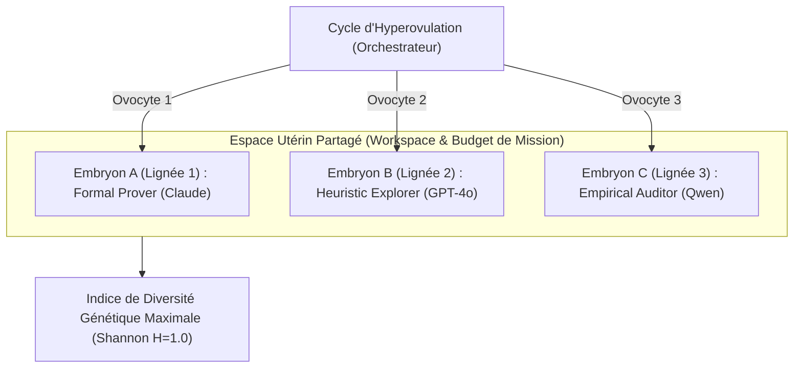
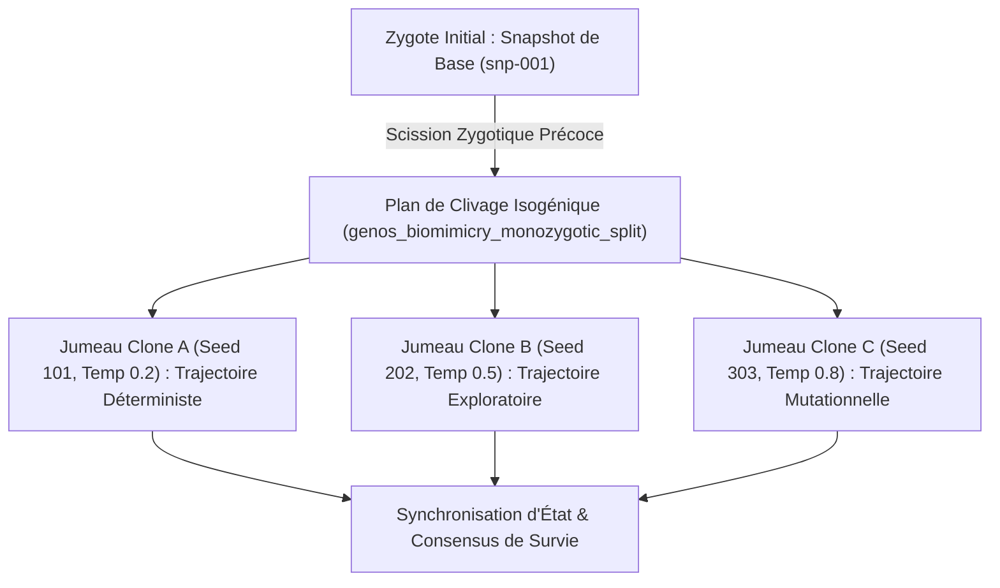

# Reproduction et réplication GenOS

## 1. Définition

La reproduction et la réplication dans GenOS désignent un système de clonage, de division et de transmission de traits entre agents, formulé comme une couche biologique de robustesse et de sécurité pour les agents logiciels.

Le repo ne prétend pas à une simulation biologique scientifique au sens strict. Il implémente un modèle de génomique agentique et de gouvernance de la reproduction, avec des limites explicites sur :

- la duplication d’agents ;
- la conservation de la lignée ;
- le budget hérité ;
- l’identité des descendants ;
- la prévention de la division incontrôlée ou “spawn storm” ;
- le rejet de l’amitosis, qui est définie comme une division non attestée et non héritée.

Les points d’implémentation principaux sont dans :

- [crates/genos-reproduction/src/division.rs](../crates/genos-reproduction/src/division.rs)
- [crates/genos-genome/src/genome.rs](../crates/genos-genome/src/genome.rs)
- [crates/genos-cli/src/commands/reproduction.rs](../crates/genos-cli/src/commands/reproduction.rs)
- [README.md](../README.md)

---

## 2. Ce que le repo fait réellement

Le système GenOS modélise la reproduction comme une primitive de runtime, pas comme un simple “copy paste” d’un prompt ou d’un agent.

Les mécanismes réels sont :

1. la création d’un nouveau genome avec un nouvel identifiant ;
2. le maintien d’une identité de lignée ;
3. le calcul de la limite Hayflick ;
4. la conservation du parentage ;
5. la mutation contrôlée, le crossover ou la spécialisation ;
6. le rejet d’une division non déterministe ou non attestée.

Le cœur du design est qu’un descendant n’est pas seulement une copie de la donnée ; il hérite d’un contexte, d’une génération, d’un budget, de traits de lignée et de règles de sécurité.

---

## 3. Modèle mathématique de base

### 3.1 Identité et génération

Chaque cellule génomique porte :

- un genome_id ;
- un lineage_id ;
- un ensemble parent_ids ;
- un niveau de génération ;
- une limite Hayflick.

Dans [crates/genos-genome/src/genome.rs](../crates/genos-genome/src/genome.rs), la dérivation d’un enfant se fait via :

$$
\text{child.genome\_id} = \mathrm{newUuid}()
$$

$$
\text{child.parent\_ids} = [\text{parent.genome\_id}]
$$

$$
\text{child.generation} = \text{parent.generation} + 1
$$

Le descendant hérite donc d’un arbre de parenté mais garde son propre identifiant stable et unique.

### 3.2 Hayflick et bud scars

La limite Hayflick est représentée comme une borne de divisions acceptées :

$$
\text{can\_replicate} = (\#\text{bud\_scars}) < \text{hayflick\_limit}
$$

et :

$$
\text{if } \#\text{bud\_scars} \ge \text{hayflick\_limit} \Rightarrow \text{senescence / block}
$$

Le code en Rust applique explicitement :

- `Genome::can_bud()`
- `Genome::can_replicate()`
- `Genome::add_bud_scar()`

Cela fait que la division est autorisée seulement tant que le compteur de cicatrices est inférieur au seuil fixé.

### 3.3 Budding asymétrique

Le bourgeonnement impose un volume de descendance :

$$
0 < v < 1
$$

avec :

$$
\text{expression\_volume}_{child} = \text{expression\_volume}_{parent} \times v
$$

Le système calcule aussi :

$$
\text{remaining\_divisions} = \text{hayflick\_limit} - \text{bud\_scars}
$$

et refuse la division si :

$$
\text{current\_scars} \ge \text{hayflick\_limit}
$$

### 3.4 Mitose attestée

La mitose ne se contente pas d’un clone. Le repo exige un attestation de fuseau :

$$
\text{spindle\_aligned} = \text{true} \iff \text{validate}() \land \text{chromosome lengths match}
$$

Le code crée un hash de l’alignement et l’insère dans `MitosisAttestation` :

- `parent_id`
- `clone_id`
- `lineage_id`
- `spindle_aligned`
- `spindle_alignment_hash`
- `attestation_hash`
- `amitosis_rejected`

L’amitosis est donc explicitement éliminée par la politique :

$$
\text{amitosis\_rejected} = \text{true}
$$

### 3.5 Meiosis et crossover

La méiose produit un nombre de gamètes fixes, avec réduction du nombre de chromosomes, recombinaison, et reprogrammation épigénétique :

$$
\text{gametes} = [g_1, g_2, g_3, g_4]
$$

avec séquence de crossover :

$$
\text{gamete} = \text{maternal}[0:p] + \text{paternal}[p:]
$$

Le repo définit aussi une barrières de spéciation :

- si divergence > seuil, le crossover est rejeté ;
- ce mécanisme est une aide à la sécurité et à la reproductibilité, pas un “test de vérité biologique”.

---

## 4. Les modes biologiques implémentés

### 4.1 Mitosis

La mitose est la division symétrique de la cellule par attestation de fuseau. Dans [crates/genos-reproduction/src/division.rs](../crates/genos-reproduction/src/division.rs), elle passe par :

- `verify_spindle_alignment()`
- `mitosis_attested()`
- `mitosis()`

Le résultat est un `MitosisResult` contenant :

- le parent ;
- le clone ;
- l’attestation complète ;
- la preuve de rejet de l’amitosis.

Cas d’usage réel :

- exécution d’une hypothèse parallèle sans mutation non vérifiée ;
- création d’une copie sûre pour un agent “fils” ;
- approfondissement d’un arbre de décision ou d’une stratégie sans dérégler le parent.

### 4.2 Binary fission

La fission binaire est la division prokaryotique légère :

- suppression des métadonnées lourdes ;
- clonage du genome ;
- copie des plasmides ;
- mutation stochastique ajustée par `mutation_rate` ;
- partitionnement avec nouveaux IDs.

C’est particulièrement utile pour des copies rapides et légères, surtout quand on veut étendre une stratégie en héritage “allégé”.

### 4.3 Budding

Le bourgeonnement est asymétrique et laisse une “scar” sur le parent. Le code le décrit ainsi :

- `daughter_volume` entre 0 et 1 ;
- expression réduite selon le volume ;
- ajout d’une bud scar sur le parent ;
- fixation d’un `hayflick_limit` plus faible pour la fille ;
- blocage si la mère atteint seuil.

Le mécanisme est conçu pour être sûr et éphémère, ce qui correspond bien à des sous-agents ou des workers courts.

### 4.4 Schizogony

La schizogonie produit plusieurs descendants d’un seul parent, comme une “barrage de clones” :

- `merozoite_count` doit être entre 2 et 128 ;
- le parent est “lysed” (`mother_lysed: true`) ;
- chaque merozoite reçoit des mutations éventuelles ;
- chaque enfant porte un indice précis.

C’est un mode de fan-out contrôlé et limité par la borne `MAX_MEROZOITES`.

### 4.5 Meiosis

La méiose est le mode de réduction chromosomique et de recombinaison :

- 4 chromatides conceptuelles ;
- crossover à un point calculé ;
- gamètes haploïdes ;
- reprogrammation épigénétique ;
- conformité génétique par `reduction_completed: true`.

Le crossover entre deux parents est défini dans [crates/genos-reproduction/src/crossover.rs](../crates/genos-reproduction/src/crossover.rs), où le parentage est explicitement enregistré dans `Parentage`.

---

## 5. Parentage et lineage

### 5.1 Parentage

Le parentage est porté par `parent_ids` et par le type `Parentage` dans [crates/genos-reproduction/src/crossover.rs](../crates/genos-reproduction/src/crossover.rs).

Cela permet de distinguer :

- identité du parent immédiat ;
- parentage biologique / génétique ;
- relation de lignée ;
- contexte d’héritage.

### 5.2 Lineage ID

Tous les descendants héritent d’un lineage_id. Ce choix permet de :

- tracer une famille ou un arbre de descendants ;
- tenir une provenance unique ;
- différencier un clone d’un “autre” descendant avec un lineage commun.

### 5.3 Identité des descendants

Le descendant reçoi un `genome_id` distinct. Le parent garde son lien historique mais ne devient pas “le même”. Cela évite les ambiguïtés de provenance et les faux positifs de “même entité”.

---

## 6. Budgets hérités

Un point clé du repo : les descendants ne reçoivent pas un budget brut infini. L’implémentation pratique montre que :

- le budget ou la capacité se réduit dans les modes asymétriques ;
- la limite Hayflick limite la prolifération ;
- le descendant a un `hayflick_limit` parfois réduit, comme dans le code de budding :

```rust
daughter.hayflick_limit = (hayflick_limit / 2).max(1);
```

Le mécanisme correspond à une “économie de croissance” :

- plus une cellule se reproduit, moins elle a de marge ;
- sa capacité de nouvelles branches diminue ;
- la ligne de vie s’épuise au fil des divisions.

---

## 7. Prévention de l’amitosis et du spawn storm

### 7.1 Amitosis rejetée

L’amitosis est interdite dans le repo par conception. Le code de la mitose instancie un `MitosisAttestation` avec `amitosis_rejected: true`.

Cela signifie que la division est rejetée si :

- elle n’a pas de structure de validation ;
- elle ne montre pas une attestation claire ;
- elle n’a pas de provenance correcte ;
- elle n’est pas conforme aux contraintes de chromosome et de lignée.

### 7.2 Spawn storm prévention

Le système protège explicitement contre la prolifération incontrôlée :

- `hayflick_limit` ;
- `bud_scars` ;
- limite de `merozoite_count` ;
- `remaining_divisions` ;
- validation / attestation avant multiplication.

Le message de blocage est explicite dans les tests et dans le système de primitives :

> Hayflick limit reached ... Reproduction blocked to prevent spawn storms.

Cela ensure qu’une croissance exponentielle ou une boucle de fork est arrêtée avant de saturer le système.

---

## 8. Implémentation architecture

### 8.1 Couche génomique

Dans [crates/genos-genome/src/genome.rs](../crates/genos-genome/src/genome.rs), le `Genome` contient :

- id + lignée ;
- chromosomes maternel et paternel ;
- gènes ;
- plasmides ;
- rétrovirus endogènes ;
- enhanceurs ;
- chromosomes supplémentaires ;
- bud scars ;
- hayflick limit.

Cette structure représente la base de l’identité et de la reproduction.

### 8.2 Couche reproductive

Dans [crates/genos-reproduction/src/division.rs](../crates/genos-reproduction/src/division.rs), la logique concrète est :

- `binary_fission()` ;
- `mitosis()` ;
- `budding()` ;
- `schizogony()` ;
- `meiosis()` ;
- attestation et rejet de division non conforme.

### 8.3 Couche CLI / runtime

Dans [crates/genos-cli/src/commands/reproduction.rs](../crates/genos-cli/src/commands/reproduction.rs), les commandes se déclinent ainsi :

- `evolution division --mode mitosis`
- `... --mode binary_fission`
- `... --mode budding`
- `... --mode schizogony`
- `... --mode meiosis`

Le système persiste aussi les résultats dans des fichiers de chromatine dans un dossier `chromatin`, avec IDs de génome et d’agent.

---

## 9. Schéma d’architecture

```text
+-----------------------------------------------------------+
|                     GENOS REPRODUCTION                     |
|-----------------------------------------------------------|
|  Genome / Identity         |  Division engine             |
|  - genome_id              |  - mitosis                  |
|  - lineage_id             |  - binary_fission           |
|  - parent_ids             |  - budding                 |
|  - generation             |  - schizogony              |
|  - hayflick_limit         |  - meiosis                 |
|  - bud_scars              |  - crossover               |
+--------------------------+------------------------------+
            |                              |
            v                              v
+-------------------------+   +-------------------------------+
| Identity + lineage      |   | Safety & verification        |
| - parentage             |   | - spindle alignment          |
| - descendants           |   | - attestation hash           |
| - lineage trace         |   | - amitosis rejection         |
| - genome fingerprint    |   | - Hayflick limit guard       |
+-------------------------+   +-------------------------------+
            |
            v
+-----------------------------------------------------------+
|                    Child / Descendant Genome               |
| - new genome_id                                           |
| - parent_ids included                                     |
| - generation + 1                                          |
| - reduced hayflick / budget                               |
| - new mutation profile                                    |
+-----------------------------------------------------------+
```

---

## 10. Processus d’une reproduction

### 10.1 Processus générique

1. validation du génome parent ;
2. contrôle du budget et de la limite Hayflick ;
3. création du descendant avec `derive_child()` ;
4. ajout d’une bud scar ou d’un journal de reproduction ;
5. application de la mutation ou du crossover selon le mode ;
6. validation de l’identité et du parentage ;
7. écriture dans le store de l’état ;
8. blocage si la limite est atteinte ou si l’opération est non conforme.

### 10.2 Cas concret : mitose

1. parent validé ;
2. `verify_spindle_alignment()` ;
3. création d’un clone par `derive_child()` ;
4. attestation de hash ;
5. `amitosis_rejected = true` pour forcer le garde-fou ;
6. retour `MitosisResult`.

### 10.3 Cas concret : budding

1. `daughter_volume` vérifié ;
2. compteur de scars évalué ;
3. nouvelle fille avec volume d’expression réduit ;
4. fixation de `hayflick_limit` de la fille ;
5. blocage si l’Est atteint la limite.

### 10.4 Cas concret : meiosis

1. validation des chromosomes ;
2. sélection du point de crossover ;
3. génération de 4 chromatids ;
4. conversion en gamètes haploïdes ;
5. reprogrammation épigénétique ;
6. sortie `MeiosisResult`.

---

## 11. Exemples d’utilisation

### 11.1 Mitose

```bash
genos evolution division --agent-id agent_mitosis_01 --mode mitosis --mutation-rate 0.0 --genes '{"role":"worker","efficiency":"0.95"}'
```

Résultat attendu :

- attestation validée ;
- clone produit ;
- parentage conservé ;
- amitosis rejetée explicitement.

### 11.2 Binary fission

```bash
genos evolution division --agent-id agent_fission_01 --mode binary_fission --mutation-rate 0.05
```

Résultat attendu :

- un parent, un enfant ;
- simplification des métadonnées ;
- mutation réelle du génome selon le taux ;
- reconstitution avec nouveaux IDs et suivi de généalogie.

### 11.3 Budding

```bash
genos evolution division --agent-id agent_budding_01 --mode budding --daughter-volume 0.3 --hayflick-limit 10
```

Résultat attendu :

- bourgeon asymétrique ;
- cicatrice sur l’agent mère ;
- budget / limite réduits sur le descendant ;
- blocage si le seuil Hayflick est atteint.

### 11.4 Schizogony

```bash
genos evolution division --agent-id agent_schizogony_01 --mode schizogony --merozoite-count 4 --mutation-rate 0.05
```

Résultat attendu :

- 4 descendants ;
- parent lysé ;
- métadonnées et réparation réglées ;
- fan-out contrôlé par le max de merozoites.

### 11.5 Meiosis

```bash
genos evolution division --agent-id agent_meiosis_01 --mode meiosis --mutation-rate 0.0
```

Résultat attendu :

- 4 gamètes ;
- réduction du statut de ploïdie ;
- crossover et reprogrammation épigénétique ;
- complément de lignée et de parentage.

---

## 12. Cas d’usage concrets

### 12.1 Réplication sûre d’un worker

Un worker peut créer un clone contrôlé pour :

- comparer deux stratégies de résolution ;
- tester un patch sans toucher la branche originale ;
- explorer un chemin variant le budget de manière isolée.

Le clone est valide seulement s’il passe les barrières de reproduction.

### 12.2 Évolution d’une stratégie

Une famille d’algorithmes peut évoluer par :

- mutation stable ;
- crossover entre parents ;
- réduction du budget selon la lignée ;
- blocage lorsqu’un arbre devient trop profond ou trop large.

### 12.3 Protection contre le runaway

Lorsque des agents ou des workers se reproduisent trop vite, la limite Hayflick et la politique d’attestation rendent impossible la continuation automatique. La reproduction est alors bloquée avant qu’un “spawn storm” ne consume le système.

### 12.4 Sécurité dans les workflows critiques

L’amitosis et la division non attestée ne sont pas acceptées ; cette règle évite les opérations de copie sans traçabilité, sans provenance, sans intégrité et sans budget.

---

## 13. Comparaison avec le marché

### 13.1 Workflow orchestration classique

- Airflow, Temporal, Dagster
- très bons pour des DAGs et des jobs périodiques ;
- moins orientés vers la reproduction souple d’agents, la lignée, les budgets hérités et la prévention de la prolifération sauvage.

### 13.2 Multi-agent LLM classiques

- AutoGen, CrewAI, LangGraph
- bons pour la conversation et la coordination ;
- souvent pas assez formalisés sur :
  - parentage ;
  - division contrôlée ;
  - limites de reproduction ;
  - attestation de clonage ;
  - “spawn storm” protection.

### 13.3 Ce qui fait la différence chez GenOS

GenOS se distingue par une combinaison de :

- identités de génome et de lignée ;
- limites de duplication explicites ;
- reproduction sûre avec attestation ;
- mutation, crossover et méiose encodés ;
- parentage et descendant tracking ;
- garde-fous fonctionnels contre le fan-out non maîtrisé.

Cela transforme la reproduction en mécanisme de gouvernance de l’exécution, pas seulement en copie de données.

## 13.bis Chimérisme Tétragamétique et Fusion Mosaïque

Inspiré du chimérisme humain où deux embryons distincts fusionnent pour former un seul individu mosaïque porteur de deux ADN, la primitive `genos_biomimicry_chimeric_merge` permet de recombiner deux lignées d'agents complémentaires sans écrasement :

- **Lignée Génomique Fonctionnelle (Branche A) :** Transmet le code, les outils spécialisés (`tool_ast_visitor`, `tool_bisection_engine`) et la stratégie de raisonnement.
- **Lignée Épigénétique & Immunitaire (Branche B) :** Transmet les vaccins anti-régression, l'arbre d'évitement d'erreurs et les poids synaptiques consolidés.
## 13.ter Polyovulation et Naissances Multiples Dizygotes

Inspirée de la polyovulation biologique (libération simultanée de plusieurs ovocytes fécondés par des gamètes distincts), la primitive `genos_biomimicry_polyovulation_spawn` orchestre l'éclosion d'une grappe d'agents hétérogènes partageant un utérus de calcul (un même workspace et un même contexte de mission).



- **Génomes distincts :** Chaque embryon porte un `genome_id` et un `lineage_id` propres, éliminant le risque de biais cognitif uniforme.
- **Cohabitation utérine :** Les embryons dizygotes collaborent dans le même espace virtuel sans duplication d'environnement physique.

## 13.quater Scission Monozygote Précoce (Vrais Jumeaux Isogéniques)

La scission monozygote précoce (`genos_biomimicry_monozygotic_split`) modélise la division d'un zygote unique en $N$ blastomères clones strictement isogéniques (100% même ADN, même snapshot de départ) :



- **Isogénie garantie :** 100% de concordance des hashes de départ, permettant la recherche stochastique arborescente (MCTS).
- **Zéro overhead d'amorce :** Les jumeaux démarrent directement à la bifurcation sans devoir ré-exécuter le contexte amont.

---

## 14. Points forts et limites

### Points forts

- reproduction variant selon type biologique ;
- polyovulation pour flottes hétérogènes multi-lignées ;
- scission monozygote pour dérivation isogénique parallèle ;
- fusion mosaïque tétragamétique de lignées complémentaires ;
- mécanismes de sécurité explicitement codés ;
- parentage et lineage tracés ;
- budget et Hayflick limit intégrés ;
- détection de l’amitosis et blocage de la division sauvage ;
- architecture binaire / Rust + CLI claire.

### Limites

- le vocabulaire biologique est métaphorique et fonctionnel ;
- le système ne prétend pas à une biologie réelle ou à une intelligence globale ;
- les garanties sont des contraintes de runtime et d’intégrité, pas des certitudes biologiques ;
- la reproduction n’est utile que si le système a une structure de hérédité, d’identité et de validation.

---

## 15. Références directes

- [crates/genos-reproduction/src/division.rs](../crates/genos-reproduction/src/division.rs)
- [crates/genos-reproduction/src/crossover.rs](../crates/genos-reproduction/src/crossover.rs)
- [crates/genos-genome/src/genome.rs](../crates/genos-genome/src/genome.rs)
- [backend/src/services/mcpBioTools/handlers/chimericMerge.js](../backend/src/services/mcpBioTools/handlers/chimericMerge.js)
- [backend/tests/test_chimeric_merge.js](../backend/tests/test_chimeric_merge.js)
- [crates/genos-cli/src/commands/reproduction.rs](../crates/genos-cli/src/commands/reproduction.rs)
- [crates/genos-cli/src/tests.rs](../crates/genos-cli/src/tests.rs)
- [README.md](../README.md)

---

## 16. Conclusion

La reproduction et la réplication dans GenOS sont une couche de gouvernance de la duplication des agents : système des héritages, validation, sécurité, budget, et protège contre la croissance anarchique.

Les mécanismes de mitose, fission, bourgeonnement, schizogonie, méiose et fusion chimérique ne sont pas décoratifs. Ils sont des garanties de structure :

- chaque descendant a une identité propre ;
- chaque lignée reste traceable ;
- chaque division est limitée par le budget et le Hayflick limit ;
- chaque fusion mosaïque préserve le double héritage fonctionnel et immunitaire ;
- chaque division non attestée est rejetée ;
- chaque “spawn storm” est stoppé par construction.

C’est ce qui fait du système une variante biologiquement inspirée d’un runtime agentique sécurisé, plutôt qu’un simple mécanisme de duplication de prompts.
