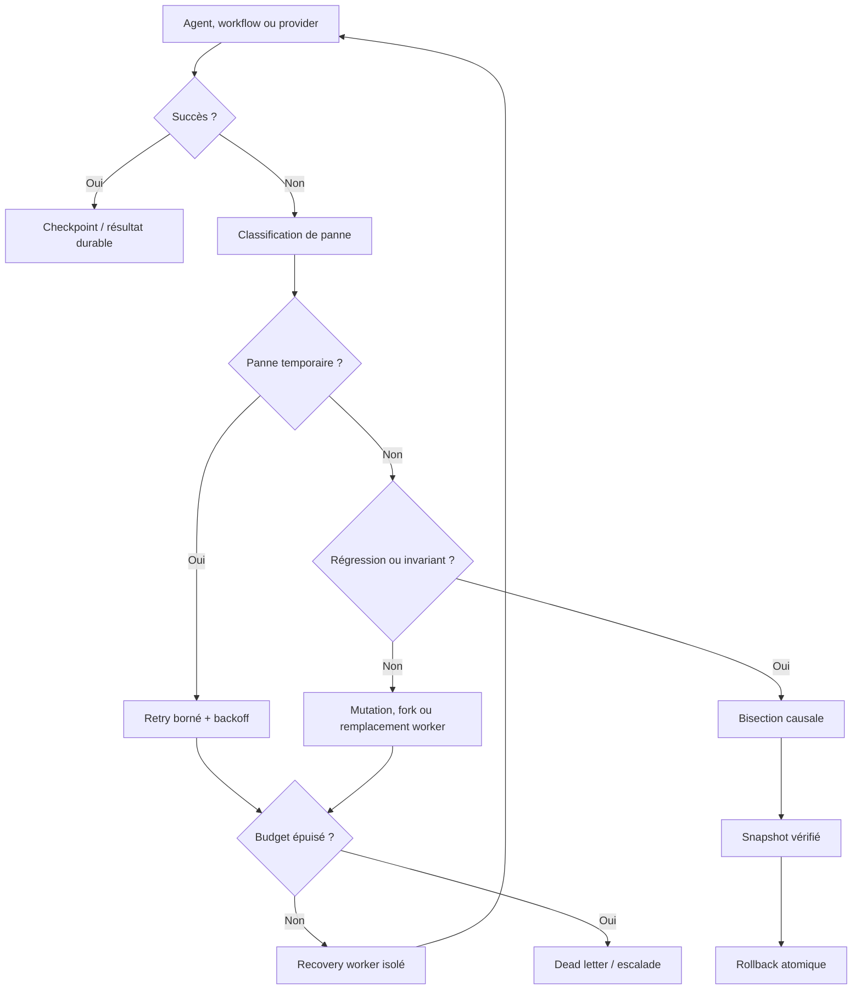
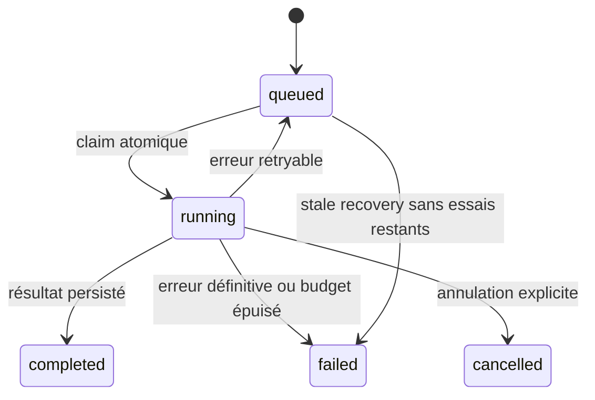
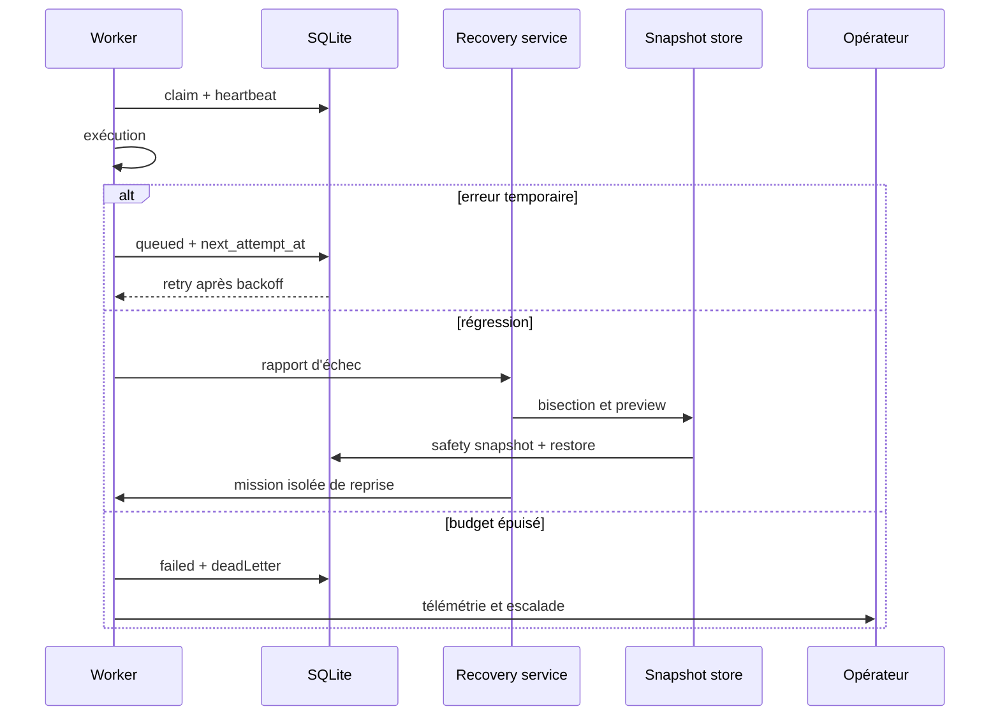
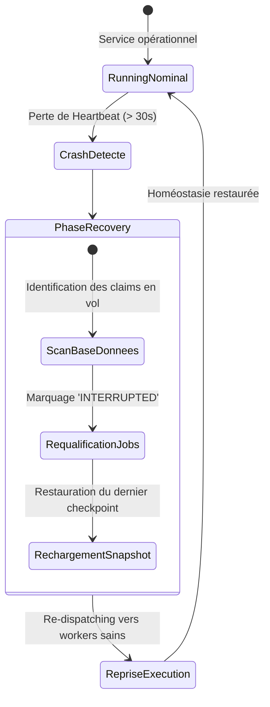
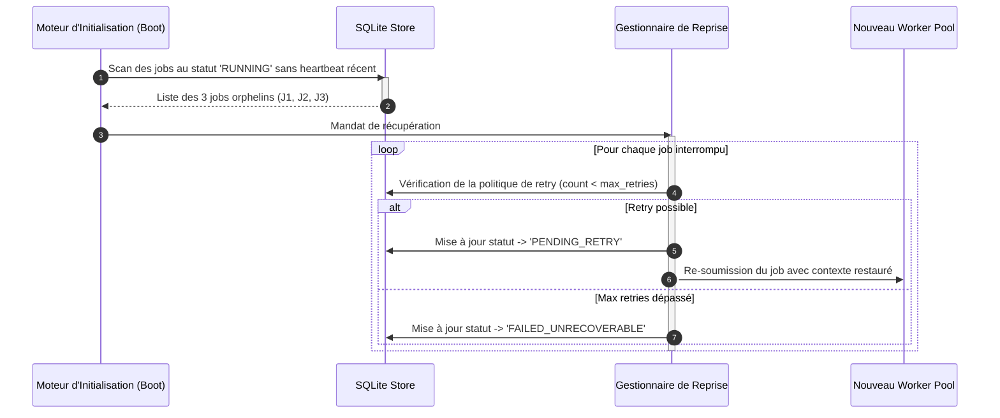
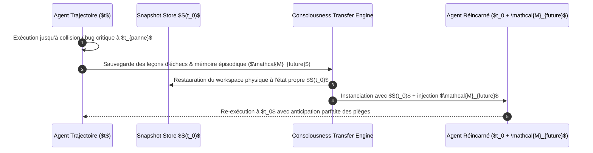

# Résilience et reprise dans GenOS

## 1. Définition

La résilience dans GenOS est l'ensemble des mécanismes qui empêchent une panne de devenir une perte silencieuse de travail ou une répétition sans fin. Elle couvre plusieurs échelles : transaction SQLite, job durable, worker agentique, snapshot de workspace, bisection causale et redémarrage du backend.

Le système ne prétend pas rendre une exécution de modèle, une modification de filesystem ou un appel réseau arbitraire parfaitement reproductible. Il rend en revanche visibles et traitables les états de reprise : travail interrompu, tentative consommée, checkpoint, échec terminal, snapshot valide, rollback réalisé ou escalade opérateur.

Les composants de référence sont :

- [backend/src/services/jobWorker.js](../backend/src/services/jobWorker.js) : claim, heartbeat, reprise et retry des jobs ;
- [backend/src/services/workerFailureRecoveryService.js](../backend/src/services/workerFailureRecoveryService.js) : classification de panne et décision de reprise ;
- [backend/src/services/agentRecoveryService.js](../backend/src/services/agentRecoveryService.js) : dispatch des recovery workers ;
- [backend/src/services/bisectionService.js](../backend/src/services/bisectionService.js) : bisection et rollback de snapshot ;
- [backend/src/services/workspaceSnapshotStore.js](../backend/src/services/workspaceSnapshotStore.js) : snapshots filesystem durables, intégrité et restauration ;
- [backend/src/db/index.js](../backend/src/db/index.js) : transactions SQLite atomiques ;
- [backend/src/services/sleepCycle.js](../backend/src/services/sleepCycle.js) et [backend/src/services/agentConscienceService.js](../backend/src/services/agentConscienceService.js) : apoptose et nettoyage contrôlé ;
- [docs/OPERATIONS_RECOVERY.md](OPERATIONS_RECOVERY.md) : runbook opérateur et limites de support.

---

## 2. Architecture de reprise



La résilience est donc une boucle de contrôle à états explicites. La règle centrale est : ne pas masquer un échec par un succès synthétique. Une reprise doit conserver son historique, sa cause, son compteur d'essais et, lorsque nécessaire, sa preuve de snapshot ou son état d'escalade.

---

## 3. Crash recovery et redémarrage backend

### 3.1 Claims interrompus

Au démarrage du worker de jobs, `recoverInterruptedJobs()` repère les lignes `running` dont `claimed_at` est absent ou plus ancien que `GENOS_STALE_JOB_MINUTES` (15 minutes par défaut). Cela couvre le cas où un processus backend tombe après avoir réclamé un job mais avant son état terminal.

Pour `workflow_runs`, `evaluation_jobs` et `model_jobs`, le système :

1. incrémente `attempts` ;
2. remet le job à `queued` si le budget permet une reprise ;
3. sinon le marque `failed` ;
4. libère `claimed_at` et `next_attempt_at` ;
5. conserve ou ajoute une explication dans `error_json`.

La règle de récupération est :

$$
status_{recovered} =
\begin{cases}
queued & \text{si } attempts + 1 < maxAttempts \\
failed & \text{sinon}
\end{cases}
$$

Cette reprise est durable car les informations de claim et de tentative sont SQLite, non uniquement en mémoire.

### 3.2 Heartbeat

Pendant l'exécution, le worker met périodiquement à jour `claimed_at`. Un job légitime mais long n'est donc pas interprété comme abandonné. Le heartbeat est borné par la politique de job et ne remplace pas une deadline globale : un job qui dépasse son timeout doit échouer ou être repris selon son type.

### 3.3 Limite importante

Le backend réinitialise ses structures mémoire lors d'un redémarrage, mais les jobs et snapshots sont persistés. Les éléments purement en mémoire, tels qu'une file de travail déjà planifiée mais jamais écrite, ne survivent pas. Les actions à risque doivent donc écrire un checkpoint avant de dépendre d'un effet externe ou d'un passage de processus.

---

## 4. Reprise des jobs et retry policies

### 4.1 États des jobs

Les tables `model_jobs`, `evaluation_jobs` et `workflow_runs` portent des états du type :



Les champs structurants sont :

- `status` ;
- `attempts` et `max_attempts` ;
- `claimed_at` ;
- `next_attempt_at` ;
- `timeout_ms` ;
- `result_json` et `error_json` ;
- les tokens et checkpoints de sortie pour les model jobs.

Le claim est conditionnel : une mise à jour ne gagne que si l'état précédent est `queued`. Cette compare-and-set empêche deux workers de s'approprier normalement la même ligne.

### 4.2 Erreurs retryables

La fonction `isRetryableJobError()` traite comme temporaires les erreurs qui signalent notamment :

- timeout ou connexion interrompue ;
- rate limiting et HTTP 429 ;
- DNS temporaire ;
- reset socket ;
- indisponibilité provider ;
- erreurs HTTP 5xx.

Une annulation (`MODEL_JOB_CANCELLED`, `EVALUATION_JOB_CANCELLED` ou `WORKFLOW_CANCELLED`) n'est pas un retry : elle devient `cancelled`, afin que l'opérateur puisse distinguer un choix de contrôle d'une panne.

### 4.3 Backoff avec jitter

Pour un échec temporaire, le worker programme :

$$
d_n = \min(30000, 250 \cdot 2^{n-1}) + J_n
$$

avec $J_n$ un jitter uniforme inférieur à environ la moitié du délai de base. Cette formule évite qu'une flotte de jobs réessaie simultanément un provider qui vient de tomber.

Le délai est borné à 30 secondes, et le nombre maximal d'essais est borné entre 1 et 10 pour les jobs. Les recovery workers agentiques ont un budget distinct de trois tentatives par défaut.

### 4.4 Dead-letter state

Il n'existe pas nécessairement une table séparée nommée `dead_letters`. Un dead letter est représenté par :

- `status = failed` ;
- `error_json.deadLetter = true` ;
- `retryable = true` mais budget d'essais épuisé ;
- événement `JOB_DEAD_LETTERED`.

Ce choix conserve le job, son erreur et son historique au même endroit. Il impose aux outils d'exploitation de filtrer les échecs terminaux plutôt que de regarder une queue parallèle.

---

## 5. Recovery workers et apoptose

### 5.1 Classification et décisions

Un échec de worker devient un rapport `genos.worker-failure/v1` : mission, catégorie, preuves, incertitudes, tentatives et contexte de bisection. `workerFailureRecoveryService` choisit ensuite une action :

| Catégorie | Décision habituelle |
| --- | --- |
| capability ou policy mismatch | `replace_worker` |
| sortie mutée ou JSON malformé | `mutate_worker` |
| test, régression, invariant | `bisect_and_rollback` |
| hypothèse falsifiée | `fork_worker` |
| première panne non classée | `mutate_worker` sur même identité |
| budget épuisé | `escalate_unresolved` |
| preuve de non-réponse valide | `conclude_no_answer` |

Le processus refuse une stratégie de recovery qui répète déjà la même action pour la même catégorie : il émet `WORKER_RECOVERY_CYCLE_DETECTED` et escalade. Cette règle coupe la boucle dans laquelle une correction qui échoue est relancée sans changement.

### 5.2 Recovery workers isolés

`agentRecoveryService` peut créer une nouvelle identité de worker, lui réserver une place dans le garage, créer un workspace isolé, joindre l'historique de recovery et démarrer la nouvelle mission. Selon l'action, l'organisation collective devient par exemple `isolated_recovery`, `competitive_arena` ou `specialist_expert_committee`.

Le recovery worker reçoit un prompt contenant :

- l'échec antérieur ;
- le numéro de tentative ;
- les preuves déjà obtenues ;
- un diagnostic de bisection quand il existe ;
- l'instruction de ne pas répéter la même mutation.

### 5.3 Apoptose

L'apoptose est un arrêt contrôlé d'une branche cognitive ou d'une mémoire devenue trop coûteuse, incohérente ou dangereuse. Dans GenOS, elle se traduit selon le composant par :

- passage d'agent à un état terminal ou bloqué ;
- épuisement du budget cognitif ou dépassement de dissonance ;
- suppression contrôlée de synapses, décisions et trajectoires faibles ;
- remplacement ou fork d'une identité plutôt que continuité aveugle.

Biologiquement, l'apoptose élimine une cellule sans déclencher une destruction anarchique du tissu. Dans GenOS, la métaphore est fonctionnelle : une branche est arrêtée avec traçabilité, pendant que le système conserve le rapport de panne et lance seulement une reprise bornée.

---

## 6. Rollback atomique et bisection causale

### 6.1 Atomicité de base

Les services qui modifient plusieurs lignes utilisent `withTransaction()` :

```sql
BEGIN IMMEDIATE;
-- écritures dépendantes
COMMIT;
```

Toute exception provoque `ROLLBACK`. Ainsi :

$$
S_{after} =
\begin{cases}
T(S_{before}) & \text{si toutes les opérations réussissent} \\
S_{before} & \text{en cas d'échec}
\end{cases}
$$

Cette atomicité concerne SQLite. Elle ne peut pas rendre atomique un appel HTTP, une écriture déjà effectuée par un provider ou un effet de bord dans un service externe.

### 6.2 Bisection

Lorsqu'un test ou invariant casse après une suite de snapshots monotone, `bisectAnomalyAsync()` cherche le premier état défaillant avec une complexité :

$$
O(\log N)
$$

Chaque snapshot candidat est évalué plusieurs fois pour vérifier la stabilité du prédicat. La bisection refuse :

- une suite vide ;
- l'absence de baseline saine ;
- une santé non monotone ;
- un prédicat non booléen ou instable.

Elle retourne un `culpritReport`, mais le code marque explicitement `causalGuarantee: false` : le résultat est un indicateur de régression basé sur le prédicat fourni, pas une preuve métaphysique de causalité.

### 6.3 Rollback workspace

`remediateRollback()` prévisualise puis appelle la restauration de snapshot durable. La restauration crée une safety snapshot avant de réécrire le workspace. Le résultat conserve :

- le snapshot restauré ;
- la safety snapshot ;
- les checksums vérifiés ;
- les fichiers affectés ;
- le pas identifié par bisection.

Le rollback de fichier est donc une restauration atomique au niveau du protocole de workspace, appuyée par une transaction pour le registre SQLite. Après un rollback, le test d'invariant doit être relancé : une restauration vérifiée n'est pas une preuve que le défaut métier a disparu.

---

## 7. Snapshots, corruption et filesystem

### 7.1 Capture durable

Un snapshot de workspace est composé de :

1. une ligne SQLite `workspace_snapshots` servant d'index ;
2. un manifest JSON ;
3. une copie de fichiers adressée par le hash SHA-256 du manifest.

Les fichiers identiques partagent un même répertoire de payload. La capture :

- exclut `.git`, dépendances, build outputs, base SQLite et secrets ;
- refuse les symlinks ;
- borne le nombre et la taille des fichiers ;
- calcule les hashes et les modes ;
- copie dans un staging directory ;
- vérifie chaque copie ;
- renomme le staging vers la destination finale ;
- écrit l'index SQLite dans une transaction `BEGIN IMMEDIATE`.

Le hash du manifest est :

$$
H = SHA256(JSON(files))
$$

### 7.2 Détection de corruption

Avant materialisation, `readManifest()` vérifie :

- le format et la version du manifest ;
- l'égalité entre `snapshot_hash` SQLite et `manifest.hash` ;
- le recalcul du hash du manifest ;
- l'unicité et la sûreté des chemins ;
- format SHA-256 des hashes de fichier ;
- limites de taille.

Pendant la restauration, chaque fichier est relu et contrôlé :

$$
SHA256(bytes_{payload}) = hash_{manifest}
$$

Enfin, le hash de l'arbre materialisé doit redevenir celui du manifest. Une corruption ou un path traversal bloque la restauration; elle ne doit jamais produire une restauration partielle silencieuse.

### 7.3 Nettoyage d'artefacts

`pruneSnapshotArtifacts()` retire les staging directories abandonnés et les payloads de hash sans ligne référente après une fenêtre d'âge. C'est un garbage collector prudent : il ne supprime pas un payload référencé dans `workspace_snapshots`.

---

## 8. Processus de reprise complet



### Exemple

Un worker modifie un parser et les tests échouent :

1. l'échec est classé `test_failure` ;
2. le recovery décide `bisect_and_rollback` ;
3. la bisection recherche le premier snapshot non sain ;
4. le snapshot est prévisualisé puis restauré avec checksum ;
5. un recovery worker isolé reçoit le pas fautif et une approche différente ;
6. s'il échoue à nouveau selon la même stratégie, la boucle est détectée ;
7. après le budget, le système conserve l'état terminal et escalade.

---

## 9. Perte de base de données ou de filesystem

### 9.1 Perte SQLite

La base contient l'index de snapshots, les jobs, leurs checksums, leurs tentatives, l'état des agents et la télémétrie. Si elle est perdue sans sauvegarde, GenOS ne peut pas reconstruire de manière fiable :

- quel job était possédé ;
- quel payload de snapshot était encore référencé ;
- quel tenant possédait la donnée ;
- quel recovery avait épuisé son budget.

La présence de payloads filesystem ne suffit pas à recréer cette gouvernance. Il faut restaurer une sauvegarde SQLite cohérente avec ses sidecars WAL, puis réconcilier les artefacts de snapshot.

### 9.2 Perte filesystem

Si SQLite existe mais que le manifest ou les payloads de snapshot ont disparu, l'index reste visible mais `readManifest()` ou `materialize()` échoue. Il ne faut pas déclarer le rollback réussi. Une restauration depuis backup du snapshot root ou une remise en état Git est nécessaire selon le cas.

### 9.3 Perte conjointe

La perte conjointe de DB et filesystem est hors du périmètre de recovery local. Les protections efficaces sont opérationnelles : sauvegardes testées, stockage distinct, rétention hors hôte, procédure de restauration et journal d'incident. Le runbook [docs/OPERATIONS_RECOVERY.md](OPERATIONS_RECOVERY.md) recommande de copier `genos.db` avec ses fichiers WAL/SHM ou d'utiliser l'API de backup SQLite, sans supprimer sélectivement les sidecars.

---

## 10. Comparaison avec le marché

| Sujet | GenOS | Queue managée classique | Orchestrateur de workflows | Plateforme de sauvegarde |
| --- | --- | --- | --- | --- |
| Jobs | SQLite, checkpoints et retry locaux | durable et très scalable | états, retries et activités | hors périmètre |
| Backoff | exponentiel avec jitter, borné | standard, souvent configurable | standard, souvent avancé | hors périmètre |
| Dead letter | état terminal + événement et JSON d'erreur | queue DLQ dédiée | état failed / retries | hors périmètre |
| Recovery agentique | mutation, fork, remplacement et evidence | rarement présent | principalement retry technique | hors périmètre |
| Rollback | snapshots workspace SHA-256 + bisection | rarement présent | compensations métier possibles | restauration de fichiers |
| Concurrence | SQLite WAL, un writer | service distribué | service distribué | snapshots/replication |
| Périmètre | mono-hôte ou déploiement contrôlé | cloud multi-zone | durable et distribué | stockage séparé |

Par rapport à une queue managée, GenOS apporte une reprise plus proche du raisonnement agentique et du workspace. En contrepartie, SQLite n'est pas une queue distribuée multi-région. Par rapport à Temporal ou Durable Functions, il offre moins de garanties d'orchestration distribuée mais relie le retry à la bisection, aux snapshots et à la gouvernance de l'agent.

---

## 11. Analogie biologique et limites

La biologie fournit ici des modèles de comportement :

- **synchronicité somatique** : propagation d'ondes d'entropie cognitive (`genos_biomimicry_somatic_resonance`) déclenchant un gel préventif coordonné avant dérive collective ;
- **greffe parasitaire & absorption d'organes** : assimilation de membres et outils d'un jumeau défaillant (`genos_biomimicry_parasitic_graft`) par l'autosite pour éviter la perte de capacités sans overhead ;
- **fetus in fetu & rescue pod** : pod d'état dormant en mémoire (`genos_biomimicry_fetus_in_fetu`) assurant la réinitialisation du contexte à partir d'un checkpoint sain en cas de corruption de la session de l'agent ;
- **diapause embryonnaire séquentielle** : maintien d'embryons pré-chauffés en pause à 0 token (`genos_biomimicry_embryonic_diapause_pipeline`) prêts au réveil instantané dès qu'un slot de traitement se libère ;
- **homéostasie** : heartbeats, deadlines et limites empêchent une activité hors contrôle ;
- **cicatrisation** : une récupération tente une réparation localisée avant remplacement ;
- **apoptose** : une branche insuffisamment saine est arrêtée proprement ;
- **mémoire immunitaire** : rapports, telemetry, snapshots et tests empêchent de réessayer sans apprendre ;
- **diversification** : fork et worker de remplacement testent une hypothèse distincte.

Ces mécanismes sont des politiques logicielles explicites. Ils ne garantissent ni l'exactitude d'une réponse de modèle, ni la récupération magique d'un disque ou d'une base sans sauvegarde.

---

## 12. Recommandations d'exploitation

- Configurer `GENOS_STALE_JOB_MINUTES` selon la durée maximale normale des jobs.
- Définir des `max_attempts` réalistes et distinguer les erreurs déterministes des erreurs temporaires.
- Activer la résonance somatique sur les flottes multi-agents à haut risque de boucle cognitive.
- Préserver `error_json`, telemetry et snapshots avant une intervention manuelle.
- Vérifier le manifest et relancer le test d'invariant après chaque restore.
- Sauvegarder régulièrement la base et les artefacts de snapshots dans des emplacements séparés.
- Traiter `JOB_DEAD_LETTERED`, `WORKER_RECOVERY_EXHAUSTED` et échecs de checksum comme des événements exigeant revue humaine.
- Ne pas considérer un replay reconstruit ou un rollback de workspace comme un rollback de trafic de production.

En résumé, GenOS construit une résilience graduée : réparer quand l'échec est temporaire, propager le stress cognitif par résonance somatique, isoler et restaurer quand une régression est détectée, terminer proprement lorsqu'une branche n'est plus justifiée, puis escalader quand la continuité ne peut plus être démontrée.


---

## Schémas Complémentaires de Reprise sur Crash et Haute Disponibilité

### 1. Machine à états du Cycle de Crash et de Reprise Automatique



### 2. Séquence de Récupération des Claims Interrompus lors d'un Redémarrage



### 3. Élagage de Résilience par Délétion Chromosomique (`genos_biomimicry_chromosomal_deletion`)

Lorsqu'un agent fait face à des contraintes de mémoire extrêmes ou accumule des dépendances parasites post-crash, l'élagage chromosomique purge les modules superflus tout en maintenant inviolables les invariants de viabilité (`LOCUS_KERNEL_INTEGRITY`, `LOCUS_AUTH_INVARIANTS`, `LOCUS_ROUTING`).

### 4. Détection d'Anticipation et Garde-Fou de Répétitions Récursives (`genos_biomimicry_dynamic_triplet_expansion`)

Les dérives transgénérationnelles par glissement microsatellite (répétitions de sous-prompts ou boucles de raisonnement) sont bornées par le seuil d'anticipation ($\ge 40$ répétitions) pour déclencher un arrêt sécurisé avant saturation des files d'inférence.

### 5. Assimilation Germinale et Résilience Rétrovirale Endogène (`genos_biomimicry_viral_endogenization`)

Face à une agression de code étranger répétée (injections, rétrovirus d'extension exogène), GenOS neutralise la toxicité en neutralisant les promoteurs malveillants tout en assimilant les gènes adaptatifs dans la lignée germinale (`germline`). Le sous-système devient un rétrovirus endogène (ERV) transmis constitutionnellement et sans surcoût d'infection à toute la descendance d'agents.

### 6. Rajeunissement et Réversion Ontogénique (*Turritopsis dohrnii*) (`genos_biomimicry_turritopsis_transdifferentiation`)

Lorsqu'un agent spécialisé approche d'une panne fatale par épuisement de son budget de tokens ou dépassement de son horloge de vie, il déclenche une transdifférenciation vers un état juvénile (`JUVENILE_POLYP`). Son contexte d'exécution pollué est purgé tout en conservant son identité et ses locus invariants pour un redémarrage instantané à zéro surcharge.

### 7. Transfert de Conscience et Replay Temporel (*Edge of Tomorrow*) (`genos_temporal_consciousness_transfer`)

Inspiré des logiques de boucle temporelle, ce mécanisme restaure le système de fichiers physique et les dépendances du workspace au snapshot $S(t_0)$, tout en injectant dans l'agent réinstancié l'intégralité des mémoires épisodiques, des causes d'échecs et des poids synaptiques acquis jusqu'à $t_{\text{futur}}$. L'agent recommence dans un environnement vierge tout en conservant la pleine conscience de ses erreurs antérieures.



### 8. Auto-Cohérence de Novikov et Rebase Causal (`genos_temporal_novikov_causal_rebase`)

Le principe d'auto-cohérence d'Igor Novikov stipule que toute intervention rétrograde sur une ligne temporelle close ne peut créer de paradoxe ($P(\text{paradoxe}) = 0$). Dans GenOS :
* **Interdiction des Paradoxes du Grand-Père :** Une intervention qui détruit une dépendance racine inviolable ou crée une boucle auto-destructrice est formellement rejetée.
* **Propagation Ordonnée des Deltas :** Lors d'un patch rétrospectif sur une étape $S_i$, le moteur recalcule de manière déterministe les états dépendants downstream sans divergence d'invariants.

```mermaid
flowchart TD
    subgraph Intervention["1. Intervention Causal Rebase ($t_k < t_{now}$)"]
        Patch["Patch Rétrospectif d'un Événement Passé"]
    end

    subgraph NovikovGate["2. Filtre d'Auto-Cohérence de Novikov"]
        CheckRoot{"Altération de Racine Inviolable ?"}
        CheckSelfNeg{"Boucle Auto-Négative ?"}
        Reject["Rejet Immédiat (Status: rebase_rejected_paradox)"]
        CheckRoot -->|Oui| Reject
        CheckSelfNeg -->|Oui| Reject
        CheckRoot -->|Non| CheckSelfNeg
    end

    subgraph TimelinePropagation["3. Propagation Déterministe ($P(paradox) = 0$)"]
        DeltaProp["Propagation des Deltas d'États Downstream"]
        Seal["Scellement de la Nouvelle Trajectoire Réconciliée"]
        DeltaProp --> Seal
    end

    Patch --> CheckRoot
    CheckSelfNeg -->|Non (Auto-Cohérent)| DeltaProp
```


