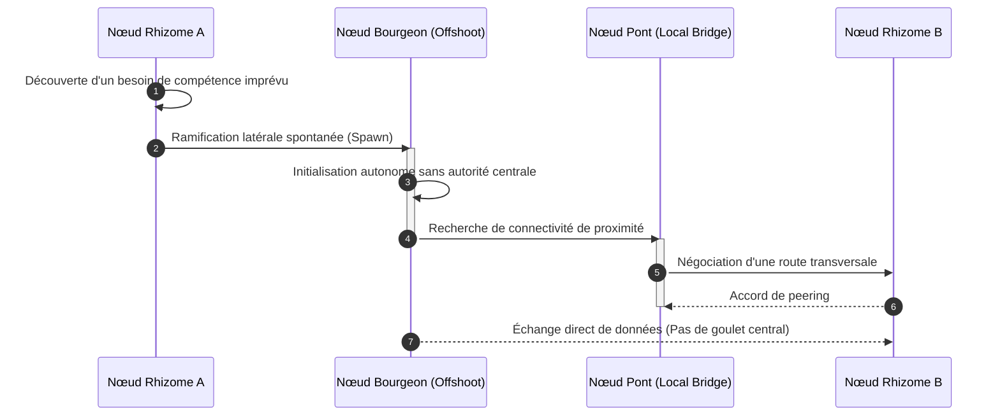
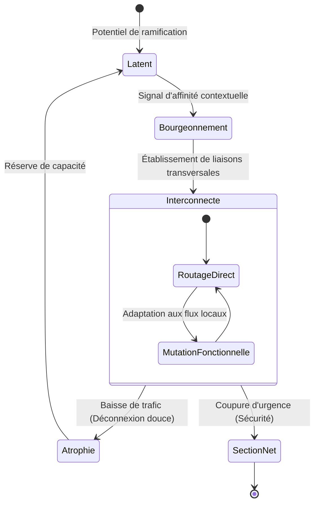

# Rhizome : Orchestration Décentralisée par Ramification de Capacités

## 1. Définition

Rhizome dans GenOS est un mode d'orchestration qui fait croître une mission comme un **réseau décentralisé de capacités reliées par des ponts locaux**. Au lieu de construire une hiérarchie fixe ou de répartir la mission dans des branches isolées, Rhizome ajoute des points de coordination là où le réseau rencontre un manque, une frontière ou une nouvelle dépendance.

Le concept vient du rhizome biologique : une structure souterraine qui ne possède pas un centre unique et peut produire de nouvelles pousses à partir de plusieurs points. Dans GenOS, une mission peut donc se développer depuis plusieurs points d'entrée. Une capacité locale peut devenir un nouveau nœud, un pont peut changer de route, et une défaillance locale ne doit pas détruire la totalité du réseau.

Les quatre rôles exposés par le mode sont :

1. **Rootless Coordinator** : coordonne la mission sans devenir une autorité centrale permanente ;
2. **Capability Offshoot** : crée une capacité locale lorsqu'une lacune apparaît dans le réseau ;
3. **Local Bridge** : relie les branches voisines et préserve les preuves malgré les changements de route ;
4. **Boundary Scout** : explore les frontières, les capacités manquantes, les goulets d'étranglement et les possibilités d'extension.

Le principe collectif déclaré par le code est :

> « A decentralized collective that grows new coordination points wherever capability is needed. »

La définition et la composition sont actuellement portées par [backend/src/services/biologicalModeService.js](../backend/src/services/biologicalModeService.js). Le dépôt ne fournit pas encore de `rhizomeService.js` spécialisé ; les opérations d'exécution, de budget, de reprise et de preuve s'appuient donc sur les services génériques d'orchestration.

---

## 2. Un réseau sans centre permanent

Rhizome ne signifie pas l'absence de coordination. Il remplace une autorité centrale fixe par une **coordination distribuée et réversible** :

1. le Coordinator maintient les objectifs et les règles communes ;
2. les Offshoots ajoutent des capacités au plus près des besoins ;
3. les Bridges rendent les interfaces et les preuves transportables ;
4. le Scout cherche les zones non couvertes et les nouvelles routes ;
5. le réseau peut déplacer la coordination lorsque les besoins changent.

Les garanties essentielles sont :

- aucune branche ne devient l'unique source de vérité par défaut ;
- chaque nouvelle capacité possède un périmètre et un critère d'arrêt ;
- chaque pont publie les contrats et preuves qu'il transporte ;
- une route locale défaillante peut être contournée ou reconstruite ;
- l'extension du réseau reste bornée par le budget et la profondeur de fan-out.

Rhizome est donc particulièrement adapté aux missions exploratoires, aux architectures modulaires, aux enquêtes multi-sources et aux travaux où la bonne décomposition n'est pas connue au départ.

---

## 3. Définition mathématique

Soit :

- $M$ : mission globale ;
- $G_t = (N_t, E_t)$ : graphe Rhizome à l'instant $t$ ;
- $N_t$ : nœuds de capacité ou de coordination ;
- $E_t$ : ponts entre nœuds ;
- $c(n)$ : capacité fournie par le nœud $n$ ;
- $D(M)$ : capacités nécessaires à la mission ;
- $P$ : preuves publiées par les nœuds et les ponts ;
- $R$ : budget global d'extension.

La couverture du réseau est :

$$
\text{coverage}(G_t, M) = \frac{|D(M) \cap \bigcup_{n \in N_t} c(n)|}{|D(M)|}
$$

Une extension est justifiée lorsqu'elle augmente la couverture ou réduit un risque important :

$$
\text{grow}(n) = 1 \iff \Delta\text{coverage}(n) > 0 \lor \Delta\text{risk}(n) < 0
$$

La capacité d'un nouveau nœud doit rester dans le budget :

$$
\sum_{n \in N_t} R_n + R_{new} \leq R
$$

Pour une route reliant deux capacités, la qualité du pont peut être modélisée par :

$$
B(e) = w_p P_e + w_c C_e - w_l L_e - w_r R_e
$$

où :

- $P_e$ mesure la provenance des éléments transportés ;
- $C_e$ mesure la compatibilité des contrats ;
- $L_e$ mesure la latence ou le coût de la route ;
- $R_e$ mesure le risque de perte ou d'ambiguïté.

Une mission peut être promue si le réseau couvre le périmètre critique et si chaque dépendance indispensable dispose d'une route vérifiée :

$$
\text{canMerge} = 1 \iff \text{coverage}(G_t, M) \geq C_{min} \land \forall d \in D_{critical},\; \text{routeVerified}(d) = 1
$$

---

## 4. Les quatre rôles et hypothèses

La composition actuelle de Rhizome produit exactement quatre membres. Les membres 1 et 3 utilisent le tier `frontier`; les membres 2 et 4 utilisent le tier `standard`.

### 4.1 Rootless Coordinator

```text
Role: rootless_coordinator
ModelTier: frontier
Member Number: 1
Responsibility: Distributed mission coordination
```

**Hypothèse :**
> « Coordinate the mission without becoming a permanent central authority. »

Le Coordinator :

- définit l'objectif partagé et les invariants ;
- publie les décisions qui nécessitent une cohérence globale ;
- choisit un point de coordination temporaire quand c'est nécessaire ;
- évite de concentrer toutes les opérations sur un seul nœud ;
- peut transférer la coordination à une branche mieux placée.

Il ne possède pas les résultats de toutes les branches par défaut. Sa responsabilité est de rendre le protocole commun visible et vérifiable.

### 4.2 Capability Offshoot

```text
Role: capability_offshoot
ModelTier: standard
Member Number: 2
Responsibility: Local capability growth
```

**Hypothèse :**
> « Grow a new local capability branch where the current network has a gap. »

L'Offshoot :

- identifie une lacune explicitement bornée ;
- crée ou active une capacité locale ;
- produit une preuve directement liée à cette lacune ;
- publie ses prérequis et ses sorties ;
- évite de créer une branche si une capacité existante suffit.

Une ramification n'est pas une copie générale de la mission. Elle doit apporter une capacité différenciée et pouvoir être retirée sans rendre les autres branches illisibles.

### 4.3 Local Bridge

```text
Role: local_bridge
ModelTier: frontier
Member Number: 3
Responsibility: Inter-branch continuity
```

**Hypothèse :**
> « Bridge neighboring branches and preserve evidence across changing routes. »

Le Bridge :

- traduit les contrats entre branches voisines ;
- transporte les preuves avec leur provenance ;
- détecte les incompatibilités d'interface ;
- préserve une route alternative lorsque c'est possible ;
- signale une perte de contexte ou une ambiguïté de transmission.

Il est le gardien de la continuité du réseau : une capacité utile mais isolée n'est pas encore une capacité intégrée.

### 4.4 Boundary Scout

```text
Role: boundary_scout
ModelTier: standard
Member Number: 4
Responsibility: Frontier discovery and risk detection
```

**Hypothèse :**
> « Scout for missing capabilities, bottlenecks, and opportunities to extend the network. »

Le Scout :

- parcourt les frontières du réseau ;
- recherche les dépendances non couvertes ;
- repère les goulets d'étranglement ;
- identifie les opportunités d'extension ;
- distingue une vraie lacune d'une duplication inutile.

Son rôle est exploratoire, mais ses alertes doivent rester liées à des preuves, à des risques ou à un besoin de capacité identifiable.

---

## 5. Architecture du système

```text
Client / Mission
        |
        v
[biologicalModeService.compose('rhizome', mission)]
        |
        +--> Rootless Coordinator : objectif et règles communes
        +--> Capability Offshoot   : branche de capacité locale
        +--> Local Bridge          : contrats et preuves entre branches
        +--> Boundary Scout        : frontières et lacunes
        |
        v
[Plan d'autonomie générique]
        |
        +--> construit le graphe initial
        +--> attribue budget et limites
        +--> ouvre les branches autorisées
        |
        v
[Croissance et exécution distribuées]
        |
        +--> une lacune est détectée
        +--> une branche bornée est créée
        +--> un pont publie les dépendances
        +--> le Scout réévalue la frontière
        |
        v
[Barrière de preuve]
        |
        +--> couverture vérifiée
        +--> routes et interfaces vérifiées
        +--> provenance conservée
        +--> extension ou divergence évaluée
        |
        v
[Fusion, contraction, reprise ou escalade]
```

Le graphe logique ne doit pas être confondu avec une hiérarchie de processus. Une branche peut dépendre d'une autre pour une sortie précise tout en restant indépendante pour son exécution locale.

---

## 6. Activation

Rhizome est approprié lorsque :

1. la mission révèle progressivement ses sous-problèmes ;
2. plusieurs points de coordination sont nécessaires ;
3. les capacités sont modulaires et peuvent être ajoutées localement ;
4. les routes entre domaines peuvent évoluer ;
5. la résilience par chemins alternatifs est plus importante qu'une synchronisation instantanée.

Exemple de contrat actuellement exposé :

```javascript
const members = biologicalModeService.compose(
  'rhizome',
  'Investigate a distributed incident across services and external dependencies.'
);

// members.length === 4
// members[0].role === 'rootless_coordinator'
// members[1].role === 'capability_offshoot'
// members[2].role === 'local_bridge'
// members[3].role === 'boundary_scout'
```

La composition générique valide la présence d'une mission et la reconnaissance du mode. Elle lève :

- `BIOLOGICAL_MISSION_REQUIRED` pour une mission vide ;
- `BIOLOGICAL_MODE_UNKNOWN` pour un mode inconnu.

L'activation opérationnelle, la création effective de branches et le routage des workers restent du ressort des services génériques d'autonomie et de flotte.

---

## 7. Composition et contrat des branches

L'appel de composition est :

```javascript
biologicalModeService.compose('rhizome', mission)
```

Chaque membre reçoit une mission contenant :

- la mission partagée ;
- le principe collectif Rhizome ;
- l'hypothèse de son rôle ;
- l'obligation de retourner preuves, changements d'état et contraintes d'intégration.

Une branche opérationnelle devrait compléter ce contrat par :

```javascript
{
  branchId: 'rhizome-offshoot-01',
  capability: 'dependency-analysis',
  parentBranch: 'incident-core',
  inputs: ['service-logs', 'deployment-history'],
  outputs: ['dependency-map', 'evidence-bundle'],
  bridges: ['bridge-incident-platform'],
  budget: { tokens: 12000, timeoutMs: 30000 },
  status: 'active'
}
```

Cette structure est un modèle de protocole documentaire. Le contrat actuellement garanti par `biologicalModeService.compose` reste le rôle, le tier, le numéro de membre et la mission contextualisée.

---

## 8. Croissance, contraction et budget

Le Resource Planner générique doit traiter une ramification comme une dépense conditionnelle. Une branche n'est ouverte que si son bénéfice attendu justifie son coût :

$$
\text{openBranch} = 1 \iff \text{expectedCoverageGain} + \text{riskReduction} > \text{creationCost}
$$

Le budget total se répartit entre les branches actives et une réserve de reprise :

$$
R = R_{active} + R_{recovery} + R_{validation}
$$

Une branche peut être contractée lorsque :

- sa capacité est intégrée et n'est plus nécessaire ;
- son coût dépasse son bénéfice ;
- elle duplique une capacité existante ;
- elle produit des preuves insuffisantes après les reprises autorisées.

La contraction doit conserver les artefacts et la provenance utiles. Fermer un nœud ne signifie pas effacer l'histoire du chemin qu'il a exploré.

Garde-fous recommandés :

- profondeur maximale de croissance ;
- nombre maximal de branches simultanées ;
- budget minimal par branche ;
- réserve de récupération ;
- délai d'expiration pour une branche inactive ;
- limite de ponts transitifs.

---

## 9. Cycle de vie d'une mission Rhizome

### Phase 1 : Ancrage initial

Le Coordinator définit la mission, ses invariants, ses limites et un premier point de coordination. Cet ancrage est provisoire : il fournit un départ, pas un centre permanent.

### Phase 2 : Cartographie des frontières

Le Boundary Scout cherche les capacités nécessaires, les zones non couvertes et les interfaces critiques.

### Phase 3 : Ramification

Le Capability Offshoot ouvre une branche pour une lacune réelle. La branche reçoit un périmètre, des entrées, des sorties, un budget et un critère d'arrêt.

### Phase 4 : Connexion

Le Local Bridge établit une route vers les branches voisines, traduit les contrats et attache les preuves à leur provenance.

### Phase 5 : Exécution locale

La branche produit des résultats indépendamment dans son périmètre. Elle publie les dépendances au fur et à mesure qu'elles deviennent importantes.

### Phase 6 : Réévaluation

Le Scout et le Coordinator réévaluent la carte : une nouvelle lacune peut apparaître, une route peut devenir inutile ou un goulet peut nécessiter une extension.

### Phase 7 : Fusion ou contraction

Le réseau est fusionné lorsque les capacités critiques sont couvertes et reliées. Les branches devenues inutiles sont contractées sans perdre la provenance.

---

## 10. Barrière d'évidence et provenance

Chaque branche doit produire un dossier vérifiable :

```text
Rhizome branch result
- Capability addressed
- Scope and boundary
- Evidence and tests
- Assumptions
- Incoming dependencies
- Outgoing dependencies
- Bridge contract used
- Alternative routes considered
- Unresolved risks
- Suggested next growth or contraction
```

Le Local Bridge doit préserver au minimum :

- l'identité de la branche productrice ;
- la version du contrat ;
- les entrées utilisées ;
- la chaîne des transformations ;
- les preuves originales ;
- les décisions de traduction ou d'adaptation.

La barrière refuse une promotion lorsque :

- la capacité annoncée ne couvre pas la lacune déclarée ;
- la preuve a perdu sa provenance ;
- une dépendance critique n'a pas de route vérifiée ;
- une branche a dépassé sa frontière ;
- deux branches publient des contrats incompatibles.

---

## 11. Routage et intégration

Le Rhizome favorise des routes locales et explicites plutôt qu'une synthèse centrale opaque.

Le routage suit ce cycle :

1. identifier la capacité fournisseuse ;
2. choisir un pont compatible ;
3. vérifier le contrat et la version ;
4. transmettre la sortie avec sa provenance ;
5. confirmer l'acceptation par la branche consommatrice ;
6. conserver une route alternative si le risque le justifie.

Une route peut être :

- **active** : contrat compatible et preuves acceptées ;
- **dégradée** : latence ou risque accru mais route utilisable ;
- **bloquée** : incompatibilité ou preuve insuffisante ;
- **orpheline** : branche source ou cible disparue ;
- **remplacée** : nouvelle route validée, ancienne conservée dans la provenance.

Le Coordinator n'a pas à consommer chaque sortie. Il doit seulement garantir que les décisions transversales, les invariants et les conflits de routes sont visibles.

---

## 12. Continuations et résilience

La structure Rhizome est conçue pour continuer après une perte locale :

- un Bridge peut rerouter une dépendance vers une branche voisine ;
- un Offshoot peut reconstruire une capacité à partir d'un contrat et d'une mémoire disponibles ;
- le Scout peut rechercher une nouvelle capacité externe ;
- le Coordinator peut déplacer temporairement la coordination ;
- une branche saine peut poursuivre son périmètre sans attendre la réparation d'une autre.

Une continuation doit préciser :

```text
Continuation request
- Failed branch or route
- Last verified state
- Preserved evidence
- Replacement capability or bridge
- New budget and deadline
- Conditions for rejoining the network
```

Critères d'arrêt :

- la capacité critique est reconstruite et reliée ;
- une route alternative est vérifiée ;
- le budget de reprise est épuisé ;
- la croissance entre dans un cycle ;
- la mission n'est plus viable sans arbitrage humain.

---

## 13. Télémétrie

La télémétrie d'un Rhizome doit rendre visible la forme et la santé du réseau :

- `activeBranches` : nombre de branches actives ;
- `branchDepth` : profondeur maximale depuis l'ancrage ;
- `capabilityCoverage` : couverture des capacités requises ;
- `bridgeCount` : nombre de ponts actifs ;
- `routeFailures` : routes bloquées ou perdues ;
- `orphanedBranches` : branches sans route utile ;
- `branchGrowthRate` : fréquence d'ouverture de nouvelles capacités ;
- `branchContractionRate` : fréquence de fermeture ;
- `evidenceProvenanceLoss` : sorties dont la provenance est incomplète ;
- `bottleneckCount` : goulets signalés par le Scout ;
- `rerouteCount` : changements de route ;
- `recoveryRounds` : continuations déclenchées ;
- `coordinationTransferCount` : transferts temporaires de coordination.

Les métriques doivent permettre de distinguer une croissance saine d'une explosion de branches. Une augmentation constante du fan-out sans hausse de couverture est un signal d'échec, pas une réussite.

---

## 14. Cas d'usage

### Cas 1 : Enquête sur une panne distribuée

**Mission :** comprendre une panne traversant plusieurs services et dépendances externes.

- le Coordinator définit les invariants et les critères de preuve ;
- le Scout repère les zones non couvertes ;
- un Offshoot analyse la chaîne de déploiement ;
- un autre point de capacité peut être ajouté pour la base de données ;
- les Bridges relient logs, changements et dépendances ;
- le réseau reroute l'enquête si une source devient indisponible.

La conclusion n'est promue que si la chaîne de preuves reste reliée de la cause supposée jusqu'aux symptômes observés.

### Cas 2 : Migration progressive d'une plateforme

**Mission :** migrer plusieurs composants sans dépendre d'un plan totalement connu à l'avance.

Une branche traite le contrat API, une autre la persistance, une autre l'observabilité. Les Bridges traduisent les versions et le Scout détecte les consommateurs non cartographiés. Une nouvelle branche peut apparaître lorsqu'un système ancien est découvert.

### Cas 3 : Recherche multi-sources

**Mission :** produire une analyse à partir de sources hétérogènes.

Chaque Offshoot explore une famille de sources. Les Bridges relient les faits communs et conservent la provenance. Le Scout détecte les angles morts, les sources redondantes et les contradictions avant la synthèse.

### Cas 4 : Développement modulaire

**Mission :** faire évoluer un produit dont l'architecture comprend plusieurs modules faiblement couplés.

Les capacités de test, d'API, d'interface et d'exploitation peuvent pousser depuis différents points. Les contrats de pont évitent qu'un module annonce une réussite incompatible avec ses voisins.

---

## 15. Erreurs et escalade

### Croissance sans bénéfice

```text
RHIZOME_UNPRODUCTIVE_GROWTH
De nouvelles branches sont ouvertes sans augmenter la couverture ni réduire un risque.
Action : geler la croissance et demander une contraction ciblée.
```

### Branche orpheline

```text
RHIZOME_ORPHAN_BRANCH
Une branche produit encore des sorties mais aucune route valide ne relie ces sorties au réseau.
Action : restaurer un pont, rerouter ou fermer la branche.
```

### Perte de provenance

```text
RHIZOME_PROVENANCE_GAP
Une sortie a traversé un pont sans conserver sa source ou ses transformations.
Action : bloquer la promotion et reconstruire le dossier d'évidence.
```

### Cycle de coordination

```text
RHIZOME_COORDINATION_CYCLE
Plusieurs branches se renvoient la responsabilité sans produire de progrès vérifiable.
Action : nommer une coordination temporaire, borner le cycle ou escalader.
```

### Fragmentation excessive

```text
RHIZOME_NETWORK_FRAGMENTED
Les branches ne disposent plus de routes suffisantes pour échanger leurs résultats.
Action : prioriser les ponts critiques ou revenir à une orchestration plus centralisée.
```

### Budget d'extension épuisé

```text
RHIZOME_GROWTH_BUDGET_EXHAUSTED
La mission possède encore des lacunes mais ne peut plus créer de capacité de façon sûre.
Action : réduire le périmètre, différer les lacunes ou escalader.
```

---

## 16. Configuration et garde-fous

Les contrôles utiles au protocole Rhizome sont :

```text
RHIZOME_MAX_BRANCHES
RHIZOME_MAX_BRANCH_DEPTH
RHIZOME_MIN_BRANCH_BUDGET
RHIZOME_RECOVERY_RESERVE_RATIO
RHIZOME_MAX_BRIDGE_HOPS
RHIZOME_ROUTE_TIMEOUT
RHIZOME_PROVENANCE_REQUIRED
RHIZOME_CONVERGENCE_TIMEOUT
GENOS_MAX_AUTONOMOUS_WORKERS
GENOS_WORKER_ALLOCATION_RATIO
```

Ces noms décrivent les paramètres recommandés pour une implémentation dédiée ; ils ne sont pas tous exposés comme variables d'environnement dans le dépôt actuel. Les valeurs effectivement utilisées doivent rester alignées sur les services génériques d'autonomie, de flotte et d'état d'orchestration.

Garde-fous minimaux :

- limiter le nombre et la profondeur des branches ;
- imposer un budget minimal et une date d'expiration ;
- exiger une provenance complète sur les ponts critiques ;
- empêcher les cycles de routage ;
- réserver un budget de récupération ;
- bloquer la fusion en cas de fragmentation ou de perte de preuve.

---

## 17. Limites et choix de conception

### Rhizome n'est pas une synchronisation forte

Lorsque chaque agent doit voir un état unique actualisé en continu, [SYNCYTIUM.md](SYNCYTIUM.md) est plus adapté. Rhizome accepte des états locaux et des routes qui évoluent, à condition que la provenance et les contrats soient vérifiés à l'intégration.

### Rhizome n'est pas une communauté antagoniste

Lorsque l'indépendance des propositions et la falsification sont le mécanisme principal, [BIOCENOSE.md](BIOCENOSE.md) convient mieux.

### Rhizome n'est pas une hiérarchie hôte

Lorsque l'autorité doit être explicitement concentrée dans un hôte, [HOLOBIONTE.md](HOLOBIONTE.md) fournit un modèle plus direct.

### Risque de croissance incontrôlée

Un réseau décentralisé peut produire trop de branches, de ponts ou de routes alternatives. Les limites de profondeur, de budget et de fan-out sont donc des invariants de sécurité, pas de simples optimisations.

### Risque de fragmentation

L'absence de centre permanent ne doit pas devenir l'absence de contrat commun. Le Coordinator, les Bridges et la barrière de preuve doivent maintenir une langue d'intégration partagée.

### Risque de duplication

Deux Offshoots peuvent découvrir la même capacité. Le Scout doit comparer les périmètres et le Coordinator doit privilégier la réutilisation avant l'ouverture d'une nouvelle branche.

### Limite du contrat actuel

Le dépôt expose le mode, ses quatre rôles et leurs hypothèses dans `biologicalModeService.js`, mais pas encore un service Rhizome spécialisé pour matérialiser le graphe, les routes ou la croissance. Cette documentation distingue donc le contrat actuellement garanti des mécanismes d'exécution proposés.

---

## 18. Comparaison avec les autres modes biologiques

| Aspect | Trinity | A-Team | Biocénose | Holobionte | Syncytium | Biome | Rhizome |
|--------|---------|--------|-----------|------------|-----------|-------|---------|
| **Unité de décomposition** | Hypothèses | Domaines | Communauté | Hôte et symbiotes | État partagé | Populations | Capacités et branches |
| **Coordination** | Comparaison | Spécialisation | Consensus adversarial | Hiérarchie intégrée | Synchronisation continue | Interactions écologiques | Routage distribué |
| **Centre** | Orchestrateur | Orchestrateur | Protocole partagé | Hôte | Coordinator | Mapper / Observer | Aucun centre permanent |
| **État** | Branches séparées | Local par domaine | Propositions isolées | Contrat hôte | Unique et partagé | Environnement + états locaux | Graphe + routes + états locaux |
| **Risque principal** | Mauvaise hypothèse | Lacune de domaine | Collusion ou faux consensus | Symbiote non sûr | Conflit d'état | Effet émergent | Fragmentation ou croissance excessive |
| **Meilleur usage** | Comparer des alternatives | Mission multidisciplinaire | Robustesse par adversité | Production gouvernée | Collaboration temps réel | Systèmes interdépendants | Exploration modulaire et résiliente |

Le choix peut se résumer ainsi :

- choisir **Rhizome** lorsque les capacités doivent pouvoir apparaître, se relier, se déplacer et se reconstruire ;
- choisir **Biome** lorsque l'environnement et les interactions entre populations dominent ;
- choisir **Syncytium** lorsque la cohérence instantanée d'un état unique domine ;
- choisir **Biocénose** lorsque l'indépendance et la falsification sont prioritaires ;
- choisir **Holobionte** lorsqu'une autorité hôte doit intégrer des capacités spécialisées ;
- choisir **A-Team** lorsque la décomposition par domaines suffit ;
- choisir **Trinity** lorsque plusieurs hypothèses doivent être comparées.

---

## 19. L'Observatoire de Graphe Dynamique : Télémétrie Temps Réel du Rhizome

Le bourgeonnement du réseau Rhizome n'est pas un simple journal texte : c'est un **état requêtable**. GenOS maintient le graphe $G_t = (N_t, E_t)$ en mémoire dans le runtime et expose ses mutations en direct plutôt que de les figer dans une simulation de terminal.

### Le Hook X

> **"What if your agent graph wasn't static? Watch our Rhizome runtime dynamically spawn capability offshoots when it hits a boundary — live, over the wire."**

### Principe technique

1. **État en mémoire :** le runtime conserve $N_t$ (nœuds de capacité/coordination) et $E_t$ (ponts) et les mute directement — aucune reconstruction depuis les logs n'est nécessaire pour connaître la topologie courante.
2. **Événement `GraphMutated` :** chaque ajout de nœud, mise à jour d'état, ajout/suppression de pont, changement de phase ou score de preuve émet un événement `GraphMutated` typé (`NodeAdded`, `NodeUpdated`, `NodeRemoved`, `EdgeAdded`, `EdgeRemoved`, `PhaseChanged`, `EvidenceRecorded`, `LogAppended`) sur un canal de diffusion (`broadcast`).
3. **Serveur de télémétrie :** un serveur HTTP/WebSocket asynchrone (`axum` + `tokio`) sert :
   - un tableau de bord HTML/D3.js qui se connecte en WebSocket et redessine le graphe force-directed à la volée, sans jamais interroger le serveur en boucle (pas de polling REST) ;
   - `GET /api/graph` : un instantané JSON de $G_t$ à la demande ;
   - `GET /api/export` : un export JSON téléchargeable, pensé pour être sauvegardé, rejoué, ou présenté à un client comme preuve de la décomposition du problème par l'IA.
4. **Cycle de plasticité observé en direct :** topologie initiale (`Rootless Coordinator` + `Boundary Scout`) → détection d'une lacune de frontière → bourgeonnement (`Capability Offshoot` + `Local Bridge`) → validation de preuve (score d'évidence) → contraction harmonique et retour à une topologie stable. Chaque transition est un événement `GraphMutated`, visible dans le dashboard sans rafraîchissement de page.

### Tableau de bord

Le dashboard affiche :
- le graphe D3.js en temps réel (nœuds colorés par rôle, liens animés) ;
- la phase courante du cycle de bourgeonnement ;
- le score d'évidence cryptographique le plus récent ;
- le flux de logs `GraphMutated` ;
- un bouton d'export JSON immédiat de $G_t$.

### Commandes CLI

```bash
# Démarrer le serveur de télémétrie + dashboard (par défaut sur le port 4790)
genos biological --mode rhizome --serve --port 4790

# Raccourci dédié
genos rhizome serve --port 4790

# Exécuter un cycle complet hors-ligne et exporter le graphe résultant en JSON (sauvegarde/rejeu)
genos rhizome export --output artifacts/rhizome_graph.json
```

Une fois démarré, le dashboard est accessible sur `http://127.0.0.1:<port>/`, le flux d'événements sur `ws://127.0.0.1:<port>/ws`, l'instantané REST sur `/api/graph`, et l'export téléchargeable sur `/api/export`.

---

## Références internes

- [ORCHESTRATION.md](ORCHESTRATION.md) : orchestration générale, budgets, gates et preuves
- [A_TEAM.md](A_TEAM.md) : orchestration multidisciplinaire par domaines
- [TRINITY.md](TRINITY.md) : orchestration comparative par hypothèses
- [BIOCENOSE.md](BIOCENOSE.md) : orchestration communautaire et validation adversariale
- [HOLOBIONTE.md](HOLOBIONTE.md) : orchestration hôte-symbiotes
- [SYNCYTIUM.md](SYNCYTIUM.md) : orchestration par état partagé synchronisé
- [BIOME.md](BIOME.md) : orchestration par environnement et populations spécialisées
- [BIOLOGIE_COMPUTATIONNELLE.md](BIOLOGIE_COMPUTATIONNELLE.md) : cadre biologique général
- [biologicalModeService.js](../backend/src/services/biologicalModeService.js) : définition et composition des rôles Rhizome
- Serveur de télémétrie & dashboard Rust : [crates/genos-cli/src/commands/rhizome_telemetry/](../crates/genos-cli/src/commands/rhizome_telemetry/)
- [agentAutonomyPlanService.js](../backend/src/services/agentAutonomyPlanService.js) : plan d'autonomie
- [agentFleetService.js](../backend/src/services/agentFleetService.js) : fleet de workers et barrière d'évidence
- [agentOrchestrationState.js](../backend/src/services/agentOrchestrationState.js) : état et télémétrie de mission
- [agentRuntimeAdapter.js](../backend/src/services/agentRuntimeAdapter.js) : adaptation du runtime


---

## Schémas de Topologie et de Propagation Rhizomatique

### 1. Architecture Décentralisée et Ramification Sans Centre

```mermaid
graph LR
    subgraph Network["Réseau Rhizomatique Acré"]
        N1["Nœud Coordinateur Éphémère (N1)"]
        N2["Nœud Capacité Compilation (N2)"]
        N3["Nœud Capacité Heuristique (N3)"]
        N4["Nœud Pont Local (Bridge N4)"]
        N5["Nœud Extension Mémoire (N5)"]
        N6["Nœud Capacité Audit (N6)"]
    end

    N1 --- N2
    N1 --- N3
    N2 --- N4
    N3 --- N4
    N4 --- N5
    N4 --- N6
    N5 --- N6
    N2 -.->|Ramification Dynamique (Offshoot)| N7["Nouveau Bourgeon (N7)"]
```

### 2. Séquence de Bourgeonnement et Connexion Latérale



### 3. Machine à états d'un Bourgeon Rhizomatique


