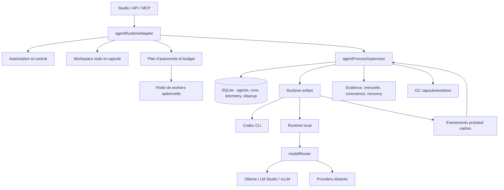
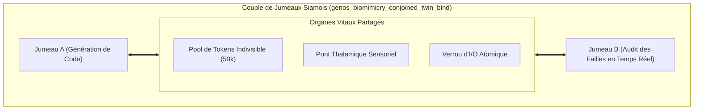
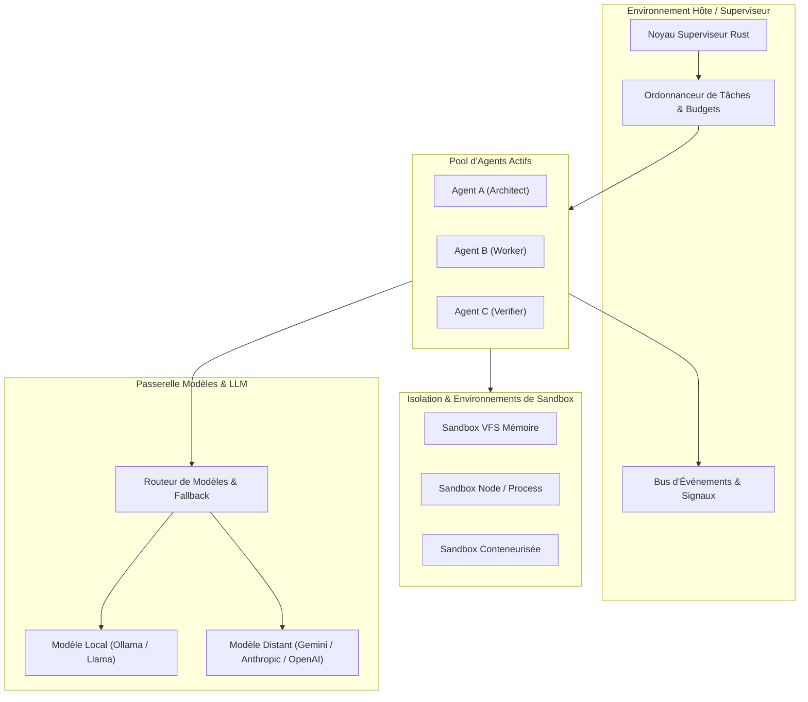
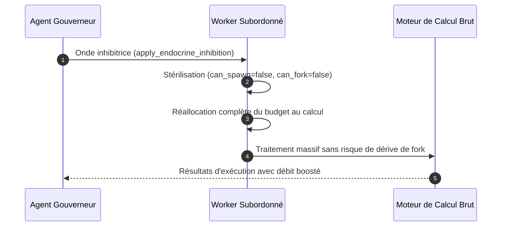

# Runtime agentique GenOS

## Definition

Le runtime agentique GenOS est le plan d'execution qui transforme une mission autorisee en un ou plusieurs processus d'agent, collecte leurs evenements, applique des limites de ressources, persiste les traces utiles et conduit l'execution vers une sortie terminale : terminee, en erreur, bloquee, non verifiee ou en apoptose.

Ce n'est ni un ordonnanceur distribue avec reprise transparente, ni une garantie de correction d'un modele. C'est un superviseur Node.js autour de processus enfants et de fournisseurs de modeles, avec des capsules de travail isolees, une base SQLite et des portes d'evidence. Les termes biologiques designent des politiques logicielles, pas une equivalence avec une cellule vivante.

Le point d'entree applicatif est [backend/src/services/agentRuntimeAdapter.js](../backend/src/services/agentRuntimeAdapter.js). La supervision du processus est concentree dans [backend/src/services/agentProcessSupervisor.js](../backend/src/services/agentProcessSupervisor.js), tandis que [backend/bin/genos-agent-runtime.cjs](../backend/bin/genos-agent-runtime.cjs) adapte Codex au protocole d'evenements cadre.

## Objectifs et frontieres

Le runtime vise a rendre une mission observable et bornee :

- autoriser l'agent et charger son contrat de strategie ;
- isoler son espace de travail et provisionner une capsule GenOS ;
- choisir un modele local ou distant et essayer les replis declares ;
- borner tokens, cout, latence et nombre d'evenements ;
- persister une execution, sa telemetrie et les etats cognitifs ;
- arreter l'arbre de processus lors d'une annulation ou d'un garde-fou ;
- recuperer les capsules temporaires apres une periode de grace.

Une sortie avec code `0` ne suffit pas a declarer le travail correct : l'absence d'un rapport d'evidence laisse le resultat `unverified`. Les preuves attendues sont des artefacts structures, sorties d'outils, tests ou validations humaines, selon le contrat.

## Architecture



Le protocole entre superviseur et runtime est volontairement cadre : une mission est ecrite sur `stdin` et les evenements sont lus sur `stdout`. Le superviseur limite la taille des frames et stoppe le runtime en cas de frame invalide ou de file d'evenements saturee. Les logs `stderr` deviennent aussi des evenements de telemetrie.

## Processus de mission

1. `startMission()` dedoublonne les demarrages par `agentId`.
2. `startMissionInternal()` refuse une mission deja annulee, autorise l'agent, recupere le contrat, isole le workspace et normalise le budget.
3. Une capsule est creee a partir du workspace ; le plan d'autonomie peut creer une flotte de workers et attendre sa barriere d'evidence.
4. `superviseMission()` lance l'executable configure, enregistre son PID et transmet la mission cadree.
5. Chaque evenement est persiste dans l'execution, evalue par les garde-fous et peut declencher une decision d'orchestration, une recuperation worker ou un arret.
6. A la fermeture, le PID est efface, les derniers evenements sont draines, le statut terminal est calcule et le nettoyage du workspace est programme.

L'etat court terme (`activeProcesses`, demarrages en cours, continuations et barrieres) est en memoire du processus Node. Il est utile durant une instance vivante, mais il ne survit pas a un redemarrage du control plane.

## Démarrage, arrêt et annulation

Le demarrage exige un executable disponible, un contrat de strategie et une autorisation. Les workers peuvent recevoir une route locale ; les orchestrateurs recoivent une lease d'outils si aucune n'est fournie. L'environnement enfant est reduit a une liste sure et aux variables `GENOS_*` non sensibles : les variables contenant notamment `TOKEN`, `SECRET`, `KEY`, `PASSWORD` ou `API` ne sont pas propagees.

L'annulation avant le spawn est prise en compte par `cancelledStarts` et retourne `MISSION_CANCELLED`. Pendant l'execution, un arret demande au superviseur de terminer le processus enfant. Sous Windows, `taskkill /PID <pid> /T` cible l'arbre ; sous Unix, le groupe de processus recoit `SIGTERM`. Apres `GENOS_PROCESS_GRACE_MS` (5 s par defaut), le terminateur force l'arret (`/F` sous Windows, `SIGKILL` sous Unix).

L'arret est intentionnellement trace : `AGENT_RUNTIME_HALT_REQUESTED`, puis un resultat `AGENT_HALTED`/`blocked`, evitant qu'un `SIGTERM` opere par le control plane ne soit presente comme un echec spontané.

L'outil [backend/bin/genos-apoptosis.cjs](../backend/bin/genos-apoptosis.cjs) est le coupe-circuit d'urgence. Il contrôle qu'un PID correspond encore à l'exécutable attendu, termine les processus correspondants, marque les agents actifs `apoptosis`, efface les identifiants de runtime et réclame les capsules de façon concurrente et bornée dans le temps (timeout strict de 2s) afin de garantir une exécution immédiate sans blocage I/O.

## Runtimes, modèles et fallback

### Codex supervise

Le runtime principal lance Codex comme sous-processus puis traduit son flux en evenements GenOS. `CODEX_EXECUTABLE` et la resolution dans [backend/src/services/agentRuntimeExecutable.js](../backend/src/services/agentRuntimeExecutable.js) determinent l'executable. Si celui-ci est absent, le lancement echoue explicitement : il n'existe pas de simulation Codex.

### Runtime local

[backend/bin/local-codex-runtime.cjs](../backend/bin/local-codex-runtime.cjs) passe par [backend/src/services/modelRouter.js](../backend/src/services/modelRouter.js). Les URIs locales reconnues sont `ollama://`, `lmstudio://`, `vllm://` et `openai-compatible://`. La selection peut venir d'une politique en SQLite, des variables d'environnement ou de la decouverte locale. Pour les workers, le plancher de competence local depend du role : 7B parametres pour un worker generaliste, 14B pour implementation/coder et 20B pour planification/frontier. `GENOS_DISABLE_LOCAL_MODELS=1` les desactive.

### Mode In-Process pour Flottes Massives (100+ agents)

Le lancement de 100 sous-processus OS distincts (`child_process.spawn`) entraîne une contention sévère sur la table des descripteurs, la mémoire vive (plusieurs Go d'empreinte Node.js) et le planificateur du noyau.

Pour surmonter cette limite, GenOS introduit le mode d'exécution **In-Process** :
- **Activation** : `GENOS_IN_PROCESS_WORKERS=1`, `mission.inProcessWorker = true`, ou automatiquement activé dès lors qu'un essaim dépasse 12 agents ouvriers.
- **Fonctionnement** : Les agents s'exécutent comme des coroutines asynchrones légères au sein de la boucle d'événements principale Node.js.
- **Routage cognitif** : Chaque ouvrier interroge directement `modelRouter.generate()` (modèle local ou passerelle d'inférence), applique les garde-fous immunitaires (`phagocytoseCodexReport`) et génère son dossier de preuves sans aucun sous-processus OS.
- **Isolation et Conscience** : L'état de conscience métacognitif et le budget cognitif hérité restent strictement isolés par identifiant d'agent en mémoire et en base de données.

### Modèles distants et replis

Les routes distantes sont des URIs telles que `openai://`, `anthropic://`, `gemini://`, `mistral://`, `groq://`, `deepseek://`, `together://` ou `openrouter://`. Une politique contient `primary`, `fallbacks`, `mode`, `preferLocal` et eventuellement `parallelReview`. En mode `fallback`, chaque candidat est essaye dans l'ordre ; chaque echec produit `MODEL_ROUTE_FAILED` puis la route suivante est essayee. Un echec local force une nouvelle decouverte avant de continuer.

Le mode `parallel` execute plusieurs candidats et selectionne la meilleure reponse notee, ou la premiere reussie en l'absence de score. Il impose un plafond `maxCostUsd` explicite, car plusieurs appels peuvent etre factures simultanement.

Exemple de politique :

```json
{
  "primary": "ollama://qwen2.5-coder:14b",
  "fallbacks": ["anthropic://claude-sonnet", "openai://gpt-4o"],
  "mode": "fallback",
  "preferLocal": true
}
```

## Budget : tokens, événements, coût, latence et ATP

Le budget de mission normalise par [backend/src/services/budgetCoherenceService.js](../backend/src/services/budgetCoherenceService.js) est :

| Ressource | Defaut | Application |
| --- | ---: | --- |
| `tokens` | 100000 | entree + sortie estimees ou rapportees |
| `costUsd` | 1.0 | estimation avant appel et cout observe apres appel |
| `latencyMs` | 60000 | deadline de route et timeout de runtime local |
| `events` | 100 | compteur du runtime ; la file superviseur a aussi sa propre capacite |
| `workerShare` | 0.6 | part du budget total destinee aux workers |
| `orchestratorReserve` | 0.4 | reserve de l'orchestrateur |

La coherence impose notamment :

$$
B_w + B_o = B_t
$$

avec $B_w = s_w B_t$ et $B_o = s_o B_t$, et les pools dispatches ne peuvent pas depasser $B_t$. L'adaptateur alloue a l'orchestrateur au plus sa reserve ; les workers restent sous l'enveloppe de mission.

Le cout estime d'une requete est :

$$
C = \frac{p_{in}T_{in} + p_{out}T_{out}}{10^6}
$$

ou $p_{in}$ et $p_{out}$ sont les prix par million de tokens. Le routeur refuse un appel dont l'estimation depasse le cout restant puis verifie le cout observe. Cette verification limite les depassements, mais ne constitue pas une reservation atomique chez le fournisseur : le cout reel n'est connu qu'apres l'appel.

La latence est un budget de deadline. Chaque tentative recoit le temps restant, et la generation locale lie l'annulation a un `AbortController`. Un prompt qui consomme deja le budget token est refuse avant generation ; la sortie et le nombre d'evenements sont controles apres reception.

### ATP : métaphore métabolique

L'ATP GenOS est un budget cognitif persistant, distinct des tokens et du cout monetaire. Dans [backend/src/services/agentConscienceService.js](../backend/src/services/agentConscienceService.js), une evaluation de branche consomme une unite de budget cognitif et met a jour la dissonance. Les valeurs par defaut sont un budget de 100 et un seuil de dissonance de 50.

$$
ATP_{t+1} = ATP_t - 1
$$

Quand $ATP \le 0$ ou que la dissonance atteint le seuil, l'etat devient apoptotique et le superviseur peut arreter le runtime. Un evenement de succes/evidence peut declencher une "Eureka" : la dissonance est divisee par deux et le budget est restaure jusqu'au plafond de base. Ce sont des heuristiques de controle, non une mesure biologique de conscience.

## Timeouts, retries et récupération

Les bornes importantes sont :

| Surface | Valeur habituelle | Configuration |
| --- | ---: | --- |
| tentative de route modele | 30 s | parametre `timeoutMs` / deadline |
| runtime local | budget `latencyMs` | `executionBudget.latencyMs` |
| barriere d'evidence workers | 60 s | `GENOS_WORKER_BARRIER_TIMEOUT_MS` |
| grace de terminaison | 5 s | `GENOS_PROCESS_GRACE_MS` |
| decouverte locale | 2,5 s | `GENOS_MODEL_DISCOVERY_TIMEOUT_MS` |
| nettoyage capsule | 10 min | `GENOS_WORKTREE_GC_DELAY_MS` |

Les retries de fournisseur sont les tentatives de fallback. Les echecs de workers sont analyses par [backend/src/services/agentRecoveryService.js](../backend/src/services/agentRecoveryService.js), qui peut decider `retry`, `mutate_worker`, `fork_worker`, `replace_worker`, `escalate_unresolved` ou `conclude_no_answer`. L'historique de recovery bloque les boucles de strategie repetees avant escalade. Les jobs persistants peuvent etre requeues apres claim obsolete, avec un nombre maximal de tentatives et `next_attempt_at`.

Limite importante : l'annulation coopere avec les appels locaux via signal, mais un fournisseur distant ou Codex ne garantit pas qu'une requete deja acceptee cesse instantanement. Le runtime arrete son arbre local ; une facturation ou un calcul deja engage en dehors de ce processus peut se poursuivre selon le fournisseur.

## Supervision, crashes et états intermédiaires

Le superviseur enregistre `runtime_pid`, `runtime_started_at` et `runtime_executable` dans `agents`. Il persiste aussi les `execution_runs`, les evenements de telemetrie, les usages modele (`usage_ledger` lorsque le tenant est renseigne), les rapports d'evidence et l'etat de conscience. Les derniers evenements sont draines jusqu'a 30 secondes a la fermeture afin de ne pas perdre une evidence terminale deja recue.

Les gardes actifs incluent : erreur de protocole, frame trop grande, saturation de la file d'evenements, evidence manquante, hallucination detectee, dissonance/ATP, garde-fou de strategie et detection de boucle/entropie du swarm. Ils convergent vers `haltRuntime()`, qui journalise la raison puis termine le processus.

Apres crash, les donnees persistantes permettent un diagnostic et une nouvelle decision de recovery. En revanche, il n'y a pas aujourd'hui de journal de continuation qui rehydrate automatiquement `activeProcesses`, `pendingContinuations`, barrieres ou promesses en memoire au redemarrage Node. Une procedure d'exploitation doit donc inspecter la mission, les telemetries, le PID et l'historique de recovery avant de re-dispatcher ; voir [docs/OPERATIONS_RECOVERY.md](OPERATIONS_RECOVERY.md).

## Capsules, workspaces temporaires et orphelins

Une mission isolee recoit un git worktree lorsque la source est Git, sinon une copie bornee. La copie exclut les fichiers sensibles et est limitee par profondeur, nombre d'entrees et taille (`GENOS_MAX_WORKSPACE_COPY_BYTES`, 1 GiB par defaut). Les capsules sont enregistrees durablement dans `agent_capsule_cleanup` avant le runtime.

A la fermeture, [backend/src/services/agentWorkspaceLifecycleService.js](../backend/src/services/agentWorkspaceLifecycleService.js) programme la reclamation :

- worktree : `git worktree remove --force`, puis `git worktree prune` ;
- copie : suppression recursive ;
- capsule GenOS associee : suppression de `.genos-runtime/<agentId>` ;
- delai par defaut : 10 minutes ; `0` nettoie immediatement, `-1` desactive le GC.

Le nettoyage refuse une racine de disque, un chemin hors des repertoires de capsules autorises ou une incoherence entre le nom du repertoire et l'agent. Trois nouvelles tentatives sont programmees en cas d'echec ; l'enregistrement SQLite est conserve afin qu'une reconciliation ulterieure puisse reprendre le travail.

La detection d'orphelin actuellement implementee est operationnelle, mais non continue : `genos-apoptosis` compare le PID stocke a la ligne de commande de l'executable avant de tuer, puis nettoie les capsules restantes. Il ne s'agit pas d'un daemon de reconciliation periodique. Sans lancement de ce coupe-circuit ou processus de maintenance equivalent, un PID stale et son workspace peuvent attendre la prochaine action de nettoyage.

## Exemple de cycle contrôlé

Mission : analyser un echec de test et produire une correction isolee.

1. L'orchestrateur recupere un budget de 60000 tokens. Avec la repartition par defaut, sa reserve est $24000$ tokens et le pool workers est $36000$ tokens.
2. Il cree deux workers dans des worktrees jetables : diagnostic et correction. Chaque worker recoit une lease d'outils et un budget borne.
3. Le worker de diagnostic utilise un modele local 14B. Si celui-ci est indisponible, la route tente le modele distant de fallback declare.
4. Un rapport d'evidence contenant sortie de test et proposition est persiste. La barriere attend les dossiers dans son delai.
5. L'orchestrateur ne peut promouvoir une conclusion qui ignore les dossiers requis. A une preuve suffisante, il produit sa synthese.
6. Si le runtime depasse son budget d'evenements, le garde du runtime emet `BUDGET_EXHAUSTED`, le bloque puis son worktree est reclame apres la periode de grace.
7. Si le processus se ferme anormalement, le PID est efface, la telemetrie reste disponible et la recovery decide d'un retry borne ou d'une escalade.

## Cas d'utilisation

| Cas | Apport du runtime | Preuve de sortie recommandee |
| --- | --- | --- |
| Correction de regression | workers specialises, worktrees isoles, budget et tests | test cible, diff, logs de compilation |
| Revue multi-hypotheses | routes paralleles ou flotte avec barriere | dossiers de chaque worker et synthese tracee |
| Execution locale souveraine | Ollama/LM Studio/vLLM et fallback explicite | URI modele servi, latence, usage, resultat de test |
| Automatisation CI couteuse | plafonds cout/tokens/latence et annulation | ledger de cout, statut terminal, artefacts CI |
| Incident ou agent boucle | sentinel, apoptose, kill tree et nettoyage | evenement de garde-fou, PID, post-mortem |
| Delegation longue | etats persistants et recovery borne | execution run, historique de recovery, decision humaine |

## Comparaison avec le marché

| Approche | Point fort habituel | Positionnement GenOS |
| --- | --- | --- |
| SDK d'agents generalistes (LangGraph, AutoGen, CrewAI) | composition de graphes, roles et outils | ajoute capsules/worktrees, budgets coherents, telemetrie et portes d'evidence ; la reprise apres redemarrage reste moins mature qu'un moteur de workflow durable |
| Plateformes d'agents gerees (OpenAI Agents, Azure AI Foundry, Bedrock Agents) | identite fournisseur, observabilite et operations gerees | privilegie l'execution locale/hybride et le controle de workspace ; l'operateur garde la responsabilite des credentiels, de la disponibilite et de la securite hote |
| Orchestrateurs de workflows (Temporal, Airflow, Prefect) | durabilite, reprise et planification robuste | GenOS est specialise dans les missions LLM et la verification ; il ne remplace pas une journalisation de workflow durable pour les continuations en vol |
| Agents de code integres (Codex CLI, Claude Code, Cursor) | boucle developpeur directe et interaction IDE | peut les encadrer avec une politique, des capsules et une flotte ; il ne rend pas leurs sorties deterministes ni automatiquement correctes |
| Sandboxes d'execution (E2B, Modal, containers) | isolation de processus et environnements ephemeres | isole aujourd'hui surtout par worktree/copie et politique ; pour une frontiere de securite forte, combiner avec conteneur/VM et permissions minimales |

Le differenciateur pratique est donc le couplage entre execution d'agent, budget metrique, evidence, et cycle de vie du workspace. Le compromis est que la robustesse de reprise distribuee et l'isolation forte dependent encore de composants d'infrastructure externes ou de procedures d'exploitation.

## Cryptophasie et compression sémantique inter-agents

Inspirée du phénomène linguistique gémellaire d'idioglossie autonome, la primitive `genos_biomimicry_cryptophasia` permet aux flottes d'agents et jumeaux d'exécuter un dialogue ultra-dense :

1. **Compression par Opcodes Sémantiques :** Les directives récurrentes (`OP_BSC_REG`, `OP_VRF_INV`, `OP_THL_RLY`, etc.) remplacent les invites textuelles verbeuses, réduisant la consommation de tokens de 70% à 85%.
2. **Décodeur Chaperone Épistémique :** Pour préserver le principe de non-régression et d'auditabilité de GenOS, chaque paquet cryptophasique est audité en temps réel par un chaperone logiciel qui maintient la trace d'intention et permet le décodage immédiat lors des revues de décisions ou par l'arbitre de réalité.

## Co-Inférence Conjointe (Jumeaux Siamois)

La primitive `genos_biomimicry_conjoined_twin_bind` couple deux agents distincts par des organes vitaux partagés (pool de tokens atomique, relais thalamique sensoriel, verrous d'entrées/sorties synchronisés) :



- **Transfusion dynamique :** Les agents s'échangent des budgets de tokens en continu sans passer par l'ordonnanceur central.
- **Cycle de vie solidaire :** L'état de tension ou d'arrêt de l'un retentit immédiatement sur l'autre, évitant les continuations unilatérales désynchronisées.

---

## Configuration minimale

```powershell
$env:CODEX_EXECUTABLE = "codex"
$env:GENOS_DEFAULT_MODEL = "ollama://qwen2.5-coder:14b"
$env:GENOS_MODEL_FALLBACKS = "anthropic://claude-sonnet,openai://gpt-4o"
$env:GENOS_PREFER_LOCAL_MODELS = "1"
$env:GENOS_PROCESS_GRACE_MS = "5000"
$env:GENOS_WORKER_BARRIER_TIMEOUT_MS = "60000"
$env:GENOS_WORKTREE_GC_DELAY_MS = "600000"
```

Verifier les comportements critiques avec les tests du backend, notamment [backend/tests/test_runtime_budget_and_influence.js](../backend/tests/test_runtime_budget_and_influence.js), [backend/tests/test_local_runtime_fallback.js](../backend/tests/test_local_runtime_fallback.js), [backend/tests/test_cryptophasia.js](../backend/tests/test_cryptophasia.js) et [backend/tests/test_agent_workspace_cleanup.js](../backend/tests/test_agent_workspace_cleanup.js). Au 8 septembre 2026, le test budget/influence echoue toutefois sur l'absence de l'evenement `BUDGET_EXHAUSTED` dans son scenario artificiel, alors que le garde est present dans le runtime ; cette divergence doit etre resolue avant d'en faire une garantie de regression. Un test passe confirme le scenario teste ; il ne transforme pas l'appel a un modele externe en operation deterministe.


---

## Schémas d'Architecture et de Cycle de Vie du Runtime

### 1. Architecture Modulaire du Runtime Agentique



### 2. Machine à états opérationnelle d'un Worker

```mermaid
stateDiagram-v2
    [*] --> Idle : Instanciation
    Idle --> Initializing : Signal Start & Chargement Context
    Initializing --> Running : Prêt à l'exécution
    
    state Running {
        [*] --> Compute
        Compute --> AwaitingExternalInput : Appel MCP / Tool
        AwaitingExternalInput --> Compute : Résultat reçu
        Compute --> MemoryConsolidation : Enregistrement vectoriel
        MemoryConsolidation --> Compute
    }
    
    Running --> Paused : Signal Suspend (Sauvegarde état)
    Paused --> Running : Signal Resume
    
    Running --> Success : Objectif atteint avec Preuve
    Running --> Failed : Erreur non récupérable
    Running --> Apoptosis : Budget épuisé ou Dissonance max
    
    Success --> Terminated : Libération des ressources
    Failed --> Terminated
    Apoptosis --> Terminated
    Terminated --> [*]

### 3. Pipeline de Superfétation (Gestation Asynchrone Multi-Stades)

La primitive `genos_biomimicry_superfetation_pipeline` permet l'introduction asynchrone d'un nouvel agent embryonnaire cadet (étape $T_0$) dans le workspace d'un agent aîné en phase avancée (étape $T+k$). L'aîné transmet son cache de preuves et d'AST sans suspendre sa propre validation, permettant au cadet d'explorer des sous-tâches avec une rampe d'accélération cognitive.

```mermaid
sequenceDiagram
    autonumber
    participant WS as Espace Gestationnel (Workspace)
    participant Elder as Agent Aîné (Stade T_45)
    participant Cadet as Agent Cadet (Stade T_0)

    Elder->>WS: Exécution avancée & consolidation des preuves
    WS->>Cadet: Injection asynchrone (Superfétation à Delta = 45 steps)
    Elder-->>Cadet: Transfert du cache de preuves sans interruption
    Cadet->>WS: Exploration accélérée des cas limites (Boost x1.5)
    Elder->>WS: Finalisation de la vérification globale
    Cadet-->>Elder: Convergence des résultats (Delta -> 0)
```

### 4. Free-martinisme Bovin et Hyper-Spécialisation d'Exécution

Le mécanisme `genos_biomimicry_freemartin_endocrine_inhibition` permet à un agent gouverneur d'inhiber la capacité de réplication d'un worker subordonné (`can_spawn = false`, `sterile = true`). En éliminant les métadonnées et risques de prolifération, le subordonné alloue 100% de ses ressources au calcul brut avec un gain d'efficience immédiat.



### 5. Chaîne de Raccordement Architecturelle (Pipeline d'Exécution MCP & Outils)

```mermaid
flowchart TD
    subgraph Clients["1. Invocateurs (Agents / Orchestrateur / CLI / UI)"]
        Agent["Agent LLM (Appel d'Outil MCP)"]
        CLI["CLI / Script d'Évolution"]
        REST["API REST / JSON-RPC (/api/mcp/execute)"]
    end

    subgraph Registry["2. Dispatcher Central (backend/src/services/mcpToolRegistry.js)"]
        Detector["isRegisteredTool() & detectExecutionKind() -> 'bio'"]
        Circuit["Circuit Breaker (Garde-fou Fail-Safe)"]
        ArgVal["Validation des Arguments & Contrats"]
    end

    subgraph Seed["3. Catalogue & Base de Données (backend/src/db/seedTools.js)"]
        MCPList["MCP_TOOLS_LIST (Enregistré dans SQLite mcp_tools)"]
    end

    subgraph Hub["4. Hub Biomimétique (backend/src/services/mcpBioTools.js)"]
        Router["executeBioTool(toolName, args)"]
    end

    subgraph Handlers["5. Moteurs & Registres Spécialisés (backend/src/services/mcpBioTools/handlers/)"]
        H1["thalamicBridge.js (Zero-copy sensory relay)"]
        H2["cryptophasia.js (Opcode compression & chaperone)"]
        H3["mirrorTwinFork.js (Counterfactual polar fork)"]
        H4["somaticResonance.js (Stress & entropy telemetry)"]
        H5["chimericMerge.js (Mosaic lineage merge)"]
        H6["polyovulationSpawn.js (Dizygotic multi-zygote fleet)"]
        H7["monozygoticSplit.js (Isogenic MCTS cloning)"]
        H8["hybridMultiples.js (Macro/micro cluster matrix)"]
        H9["conjoinedTwinBind.js (Visceral token coupling)"]
        H10["parasiticGraft.js (Arrested twin limb harvest)"]
        H11["fetusInFetu.js (Rescue pod & instant hatching)"]
        H12["sesquizygoticSplit.js (Dispermic 75% identity split)"]
        H13["heteropaternalSuperfecundation.js (Multi-vendor LLMs)"]
        H14["superfetationPipeline.js (Asynchronous co-gestation)"]
        H15["tissueChimerism.js (Multi-DNA compartmentalization)"]
        H16["obligatePolyembryony.js (Deterministic 4x/8x cleavage)"]
        H17["marmosetGermlineChimerism.js (Fraternal proxy spawn)"]
        H18["freemartinInhibition.js (Replication lock & compute boost)"]
        H19["embryonicDiapause.js (3-Tier zero-latency pipeline)"]
        H20["pointMutation.js (Silent, missense, nonsense STOP)"]
        H21["frameshiftMutation.js (Indel shift & compensatory pad)"]
        H22["chromosomalDeletion.js (Structural pipeline pruning)"]
        H23["chromosomalDuplication.js (Tandem copy & neofunctionalization)"]
        H24["chromosomalInversion.js (Retrograde backward reasoning)"]
        H25["chromosomalTranslocation.js (Cross-agent capability grafting)"]
        H26["aneuploidy.js (Trisomy 2/3 consensus & monosomy)"]
        H27["polyploidy.js (Multi-layer 6n wheat strategy)"]
        H28["transposonJump.js (Cut-and-paste & retrotransposition)"]
        H29["dynamicTripletExpansion.js (Microsatellite anticipation)"]
        H30["mitochondrialDnaMutation.js (Matrilineal energy metabolism)"]
        H31["epigeneticMethylation.js (Reversible environmental memory)"]
        H32["horizontalGeneTransfer.js (Plasmids & bdelloid absorption)"]
        H33["agrobacteriumTdnaHijack.js (T-DNA injection & gallus quota)"]
        H34["viralEndogenization.js (Germline KoRV retroviral integration)"]
        H35["tardigradeDsupShield.js (Dsup mechanical invariant shield)"]
        H36["turritopsisTransdifferentiation.js (Adult to polyp reversion)"]
        H37["yamanakaReprogramming.js (OSKM factors stem reprogramming)"]
        H38["consciousnessTransfer.js (Consciousness replay with future memory)"]
        H39["novikovCausalRebase.js (Novikov zero-paradox causal rebase)"]
    end

    Clients --> Detector
    Seed -.-> Detector
    Detector --> ArgVal --> Circuit --> Router
    Router --> Handlers
```



---

## Bus de Signalisation Biomimétique (Zero-Text Inter-Agent Communication)

Pour éliminer l'overhead des invites textuelles en langage naturel et des payloads JSON verbeux entre agents autonomes, GenOS implémente une architecture de communication **Zéro-Texte par Défaut** ([backend/src/services/biomimeticSignalingBus.js](../backend/src/services/biomimeticSignalingBus.js) et [backend/src/services/dynamicOrganizationService.js](../backend/src/services/dynamicOrganizationService.js)) :

1. **Ligands Paracrines et Récepteurs Moléculaires** : Déclenchement par affinité chimique et seuil de concentration sans échange de prompts textuels. Les cascades intra-agents s'activent uniquement si `concentration >= threshold` et `ligand == targetLigand`.
2. **Potentiels de Membrane Électrocytes & Synchronisation de Phase (Kuramoto)** : Consensus instantané par sommation de décharges bio-électriques ($\sum V_i \ge 300\,\text{mV}$) et cohérence d'ordre de phase $r \ge 0.70$, remplaçant les délibérations de votes textuels.
3. **Phéromones Chimiotactiques Stigmergiques** : Guidage spatial vectoriel par attractants ($+I$) et répulsifs ($-I$) déposés sur des locus binaires (`BLOB`), assurant l'évitement d'erreurs et le routage sans aucun token LLM.
4. **Transfert Horizontal de Plasmides** : Partage de capacités exécutables et de fragments génomiques sous forme binaire condensée (BioPolymer BLOB).
5. **Frontière d'Incompressibilité** : Le texte est strictement réservé aux interactions avec l'utilisateur humain et à la synthèse de code source imposée par la contrainte de génération du LLM. Tous les états intermédiaires de coordination circulent sous forme de signaux physico-chimiques compacts dans `agent_organization_messages (signal_type, signal_blob)`.


