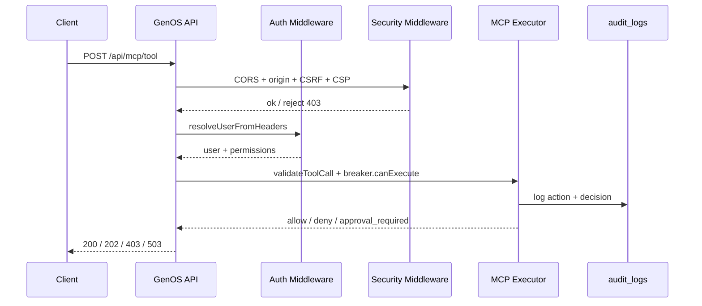
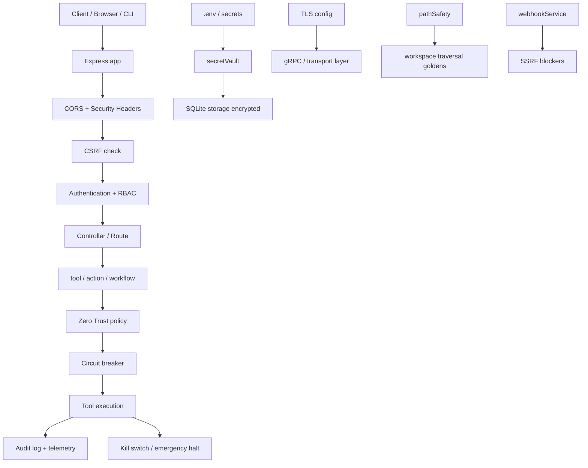
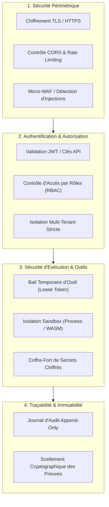

# Sécurité dans GenOS

## 1. Objet et périmètre

Cette documentation décrit la sécurité telle qu’elle est réellement implémentée dans le dépôt GenOS. Elle ne décrit pas une posture “théorique” de sécurité d’entreprise, mais le comportement effectif du backend Express, du middleware d’authentification, des services MCP, des mécanismes de fail-safe, des protections réseau, et des journaux d’audit présents dans le code.

Les références de code les plus importantes sont :

- [backend/src/app.js](../backend/src/app.js)
- [backend/src/middleware/security.js](../backend/src/middleware/security.js)
- [backend/src/middleware/auth.js](../backend/src/middleware/auth.js)
- [backend/src/services/secretVault.js](../backend/src/services/secretVault.js)
- [backend/src/services/tlsConfig.js](../backend/src/services/tlsConfig.js)
- [backend/src/services/circuitBreaker.js](../backend/src/services/circuitBreaker.js)
- [backend/src/services/webhookService.js](../backend/src/services/webhookService.js)
- [backend/src/services/pathSafety.js](../backend/src/services/pathSafety.js)
- [backend/src/services/mcpExecutor.js](../backend/src/services/mcpExecutor.js)
- [backend/src/db/schema-tables-core.js](../backend/src/db/schema-tables-core.js)
- [backend/src/routes/secretRoutes.js](../backend/src/routes/secretRoutes.js)
- [backend/src/controllers/securityController.js](../backend/src/controllers/securityController.js)

Le périmètre couvre notamment :

- secrets dans `.env` ;
- gestion des clés API et sessions ;
- TLS / certificats ;
- CORS avec liste d’origines autorisées ;
- CSRF en double-submit avec token serveur ;
- XSS sur les chaînes et objets utilisateur ;
- SSRF et blocage des hôtes internes ;
- protections SQL et traversal de chemins ;
- protection contre la désérialisation JSON massives ou non vérifiées ;
- journaux sensibles et audit trail ;
- kill switch global et circuit breaker de sécurité ;
- garde-fous de sécurité pour MCP et outils exécutables.

---

## 2. Définition fonctionnelle

GenOS traite la sécurité comme un système de contrôles en couches sur 4 axes :

1. identité et autorité ;
2. intégrité des entrées ;
3. isolation d’exécution ;
4. traçabilité et remise à zéro d’urgence.

Le système ne vise pas à être “parfaitement invulnérable” ; il construit des garde-fous explicites, testables et auditable.

Le fil rouge est le suivant :

- les requêtes non publiques doivent être authentifiées ;
- les actions critiques doivent être autorisées par rôle et permission ;
- les entrées doivent être validées avant exécution ;
- les outils dangereux doivent passer par un circuit breaker et un kill switch ;
- chaque décision sensible doit être journalisée.

La logique globale peut être représentée comme :

$$
\text{allow}(req) = \text{auth}(req) \land \text{tenantValid}(req) \land \text{perm}(req.user, action) \land \text{inputSafe}(req) \land \text{breakerClosed}(action)
$$

où :

- $auth(req)$ vérifie l’identité du principal ;
- $tenantValid(req)$ vaut si le scope tenant est correct ;
- $perm(u, a)$ vaut si le rôle/permissions autorisent l’action ;
- $inputSafe(req)$ vérifie les protections de structure et de contenu ;
- $breakerClosed(action)$ empêche l’exécution si le circuit est ouvert.

---

## 3. Architecture réelle du dépôt

### 3.1 Couche frontale

Le point d’entrée HTTP est [backend/src/app.js](../backend/src/app.js).

Il applique dans l’ordre :

- CORS avec whitelist d’origines ;
- parsing JSON et formulaire ;
- security headers ;
- origin check ;
- CSRF ;
- XSS sanitizer ;
- auth globale sur les routes protégées.

Le code est explicite :

```js
app.use(cors({
  origin: (origin, callback) => {
    if (!origin || ALLOWED_ORIGINS.includes(origin)) {
      callback(null, true);
    } else {
      const err = new Error('Cross-Origin Request Blocked by GenOS Security Policy');
      err.status = 403;
      err.code = 'FORBIDDEN_ORIGIN';
      callback(err);
    }
  },
  credentials: true
}));
```

Cela montre une sécurisation active sur les origines, pas seulement une politique passive.

### 3.2 Authentification et autorisation

Le cœur est dans [backend/src/middleware/auth.js](../backend/src/middleware/auth.js).

Les éléments importants sont :

- rôles : `admin`, `operator`, `viewer` ;
- permissions : `all`, `read`, `workspace:write`, `mcp:execute_safe`, etc. ;
- tokens et access keys validés avec hash SHA-256 ;
- passage obligatoire pour toute route protégée ;
- permissions appliquées sur chaque action critique.

Le code fait aussi un point professionnel important :

- il ne donne pas de “viewer” implicite à un anonyme ;
- l’authentification est obligatoire pour tous les points d’entrée protégés ;
- les routes publiques sont limitées à des endpoints de santé et d’authentification.

### 3.3 Gestion des secrets et clés API

Les secrets sont gérés en plusieurs couches.

#### 3.3.1 `.env` et chargement d’environnement

Le dépôt charge les variables depuis le fichier `.env` dans [backend/src/services/modelProvider.js](../backend/src/services/modelProvider.js) :

```js
const filePath = path.resolve(__dirname, '../../../.env');
for (const line of fs.readFileSync(filePath, 'utf8').split(/\r?\n/)) {
  const match = line.match(/^\s*([A-Za-z_][A-Za-z0-9_]*)\s*=\s*(.*?)\s*$/);
  if (!match || match[1] in process.env) continue;
  process.env[match[1]] = match[2].replace(/^(['"])(.*)\1$/, '$2');
}
```

Cette logique est utile, mais elle montre aussi une limite importante : le dépôt charge directement des variables de configuration dans le processus, sans un coffre fort externe. La protection vient surtout de la manière dont les secrets sont ensuite manipulés et limités.

#### 3.3.2 Stockage cryptographique des secrets

Les secrets d’application sont chiffrées dans [backend/src/services/secretVault.js](../backend/src/services/secretVault.js) :

```js
function key(){
  const raw = process.env.GENOS_SECRET_KEY;
  if (!raw) throw new Error('GENOS_SECRET_KEY must be configured.');
  return crypto.createHash('sha256').update(raw).digest();
}

function encrypt(value) {
  const iv = crypto.randomBytes(12);
  const cipher = crypto.createCipheriv('aes-256-gcm', key(), iv);
  const ciphertext = Buffer.concat([cipher.update(String(value), 'utf8'), cipher.final()]);
  return { ciphertext: ciphertext.toString('base64'), iv: iv.toString('base64'), tag: cipher.getAuthTag().toString('base64') };
}
```

Le dépôt utilise :

- AES-256-GCM ;
- génération d’IV aléatoire ;
- tag d’authentification ;
- stockage séparé de `ciphertext`, `iv` et `tag`.

Cela empêche le stockage en clair de secrets dans SQLite.

#### 3.3.3 Clés API et sessions

Dans [backend/src/controllers/authController.js](../backend/src/controllers/authController.js) :

- `createKey()` crée une clé API aléatoire ;
- `rotateKey()` révoque l’ancienne et remplace par une nouvelle ;
- `revokeKey()` neutralise la clé ;
- `revokeSession()` invalide une session ;
- `verifyToken()` compare uniquement le hash, jamais la clé en clair.

La logique de hachage est :

$$
\text{storedHash} = SHA256(rawKey)
$$

et la validation est faite sur le hash, non sur le secret brut. C’est la bonne pratique minimale pour limiter les fuites en base.

---

## 4. Sécurité réseau et transport

### 4.1 TLS

Le dépôt supporte TLS pour les services gRPC dans [backend/src/services/tlsConfig.js](../backend/src/services/tlsConfig.js).

Le code vérifie :

- les deux chemins sont fournis ensemble ;
- le fichier est bien un fichier régulier ;
- le fichier n’est pas un symlink ;
- les permissions ne sont ni lisibles par groupe ni par monde.

```js
if (process.platform !== 'win32' && (stat.mode & 0o077) !== 0) {
  throw new Error(`${name} must not be group/world accessible.`);
}
```

C’est une bonne couche de protection : l’application refuse des certificats trop accessibles.

### 4.2 CORS

La politique est dans [backend/src/app.js](../backend/src/app.js) et [backend/src/middleware/security.js](../backend/src/middleware/security.js).

L’application autorise uniquement des origines explicitement listées dans `ALLOWED_ORIGINS`, avec un fallback local pour `localhost` et `127.0.0.1`.

Si la requête vient d’une origine inconnue :

- rejet `403` ;
- code `FORBIDDEN_ORIGIN` ;
- message explicite.

La logique est de type ensemble :

$$
\text{allowOrigin}(o) = o \in ALLOWED\_ORIGINS \lor o = null
$$

et donc :

- origin inconnue → refus ;
- origin locale autorisée → acceptation ;
- cookies activés seulement pour des origines autorisées.

### 4.3 CSRF

La protection CSRF est dans [backend/src/middleware/security.js](../backend/src/middleware/security.js).

Le mécanisme est le double-submit :

- le serveur émet un token `genos_csrf` dans un cookie ;
- le client renvoie le même token dans l’en-tête `X-CSRF-Token` ;
- la validation compare les valeurs avec `timingSafeEqual` ;
- le serveur n’accepte pas des tokens non émis localement.

La logique est :

```js
const validDoubleSubmit = csrfHeader.length >= 16 && csrfHeader.length === csrfCookie.length
  && require('crypto').timingSafeEqual(Buffer.from(csrfHeader), Buffer.from(csrfCookie));
```

Le dépôt range aussi les tokens émis localement dans une map mémoire avec TTL de 24h pour éviter une fabrication client-side. Les méthodes mutantes (POST, PUT, PATCH, DELETE) exigent donc une preuve active d’origine et d’authenticité.

---

## 5. Protéctions contre les failles web classiques

### 5.1 XSS

Le mécanisme est dans [backend/src/middleware/security.js](../backend/src/middleware/security.js).

La fonction `sanitizeString()` supprime :

- balises `script` et `iframe` ;
- protocoles `javascript:` ;
- attributs `on*` comme `onclick` ;
- blocs HTML indésirables.

Le code applique aussi des headers CSP et X-Frame-Options :

- `Content-Security-Policy` ;
- `X-Frame-Options: DENY` ;
- `X-Content-Type-Options: nosniff` ;
- `X-XSS-Protection: 1; mode=block` ;
- `Referrer-Policy`.

La logique est plus de “réduction du surface d’attaque” que d’un sanitizer DOM complet. C’est un bon garde-fou d’entrée de système, mais il ne remplace pas un système de rendu HTML robuste à la frontière UI.

### 5.2 SSRF

La protection contre SSRF est présente dans [backend/src/services/webhookService.js](../backend/src/services/webhookService.js) et dans [backend/src/services/modelProvider.js](../backend/src/services/modelProvider.js).

Le webhook vérifie :

- l’URL est une URL HTTPS ;
- elle n’inclut ni username ni password ;
- le hostname n’est pas `localhost`, `.local`, `.internal`, ni metadata IaaS ;
- le hostname résout vers une adresse publique ;
- l’adresse IP ne se trouve pas dans les plages privées ni RFC1918 / link-local / multicast.

Le code est particulièrement clair sur le risque :

```js
if (BLOCKED_HOSTNAME_PATTERN.test(parsed.hostname)) throw invalidUrl('Webhook URL must not target internal hostnames.');
```

Cette protection est un garde-fou fort et pratique : elle ne laisse pas un service interne être attaqué via un webhook récupéré depuis l’API.

### 5.3 SQL injection

Le dépôt utilise SQLite et des requêtes préparées avec paramètres `?` partout dans le code. Les mauvaises pratiques de concaténation de requêtes sont absentes dans les services principaux.

Exemples :

- [backend/src/controllers/authController.js](../backend/src/controllers/authController.js)
- [backend/src/controllers/workflowController.js](../backend/src/controllers/workflowController.js)
- [backend/src/controllers/mcpController.js](../backend/src/controllers/mcpController.js)

Le style est cohérent :

```js
SELECT * FROM access_keys WHERE key_hash = ? AND is_active = 1
```

La sécurité ne repose pas sur une validation de chaînes ad hoc, mais sur l’utilisation de paramètres SQLite. C’est précisément la bonne défense contre l’injection SQL dans le backend Node.

### 5.4 Traversal de chemins

Le garde-fou principal est dans [backend/src/services/pathSafety.js](../backend/src/services/pathSafety.js).

Il impose :

- chemin relatif uniquement ;
- pas d’URL absolue ;
- pas de `..` ;
- pas de segments `.` ou `..` ;
- pas de symlink sur le chemin ;
- la cible doit rester sous le workspace root.

La fonction clé est :

```js
function resolveContainedPathNoSymlinkSync(root, relativePath, label = 'path') {
  const resolvedRoot = path.resolve(root);
  const resolved = resolveContainedPath(resolvedRoot, relativePath, label);
  // ... check lstatSync and symlink
}
```

C’est exactement le type de contrôle needed pour éviter un `../../etc/passwd` ou l’accès à un dossier hors du workspace.

### 5.5 Désérialisation JSON

Le système est prudent sur les objets JSON entrés au runtime :

- `express.json({ limit: '10mb' })` dans [backend/src/app.js](../backend/src/app.js) ;
- validation de structures a minima dans les contrôleurs ;
- `JSON.parse` avec gestion d’erreur ;
- refus des payloads trop volumineux ;
- contrôle de types avant usage.

Exemple :

```js
const graph = JSON.parse(workflow.version_graph_json || workflow.graph_json || '{"nodes":[],"edges":[]}');
const validation = validateGraph(graph);
```

Le système ne “déserialise” pas tout et n’accepte pas n’importe quel objet. Il dépend de schémas robustes et de contraintes de taille.

### 5.6 Logs sensibles

Le dépôt n’expose pas les secrets dans les logs et filtre les variables sensibles lors de l’exécution MCP dans [backend/src/services/mcpExecutor.js](../backend/src/services/mcpExecutor.js).

Le code vérifie le nom des variables d’environnement et refuse toute variable contenant `TOKEN`, `SECRET`, `KEY`, `PASSWORD`, `CREDENTIAL`, `API` dans le contexte de l’environnement de transport MCP.

Ce mécanisme limite la fuite de secrets dans les environnements des sous-processus.

Les journaux d’audit sont agencés dans `audit_logs` et `telemetry_events`, avec `payload_json`, `actor`, `action`, `decision`, `reason`, `organization_id`, `project_id`.

Cela donne une trace explicite et exploitables pour la sécurité opérationnelle.

---

## 6. Kill switch, circuit breaker et résilience sécuritaire

### 6.1 Circuit breaker

Le cœur est dans [backend/src/services/circuitBreaker.js](../backend/src/services/circuitBreaker.js).

Le service implémente un breaker à 3 états :

- `CLOSED` ;
- `OPEN` ;
- `HALF-OPEN`.

Il détecte aussi les boucles de commandes identiques, les outils destructifs, et les échecs de répétition.

Le score de sécurité de `canExecute()` ressemble à la règle :

$$
\text{executeAllowed} = \neg \text{halted} \land \neg \text{toolLocked} \land \neg \text{looping} \land (state \neq OPEN \lor \text{nonDestructive})
$$

Les outils destructifs sont listés explicitement, comme :

- `genos_run` ;
- `genos_merge` ;
- `genos_restore` ;
- `genos_resilience_apoptosis` ;
- `genos_security_coevolution`.

### 6.2 Kill switch

Le kill switch est dans [backend/src/controllers/securityController.js](../backend/src/controllers/securityController.js) et [backend/src/services/circuitBreaker.js](../backend/src/services/circuitBreaker.js).

L’action `triggerHalt()` :

- écrit un fichier `.genos/mcp.halted` ;
- arrête les missions locales ;
- bloque toutes les nouvelles invocations MCP ;
- laisse une trace dans l’audit / telemetry.

Dans la pratique, cela transforme la sécurité d’un système en “stateful lockdown” explicite, plus fiable qu’un simple flag in-memory.

---

## 7. Audit trail et observabilité de sécurité

L’audit est défini dans [backend/src/db/schema-tables-core.js](../backend/src/db/schema-tables-core.js).

`audit_logs` contient :

- `actor` ;
- `agent_id` ;
- `action` ;
- `resource` ;
- `decision` ;
- `reason` ;
- `payload_json` ;
- `organization_id` ;
- `project_id` ;
- `created_at`.

Le code l’utilise dans plusieurs flux :

- exécution d’outils MCP ;
- approbations de sécurité ;
- décisions de tenant / organisation ;
- actions de sécurité globale ;
- événements d’authentification.

Dans [backend/src/controllers/mcpController.js](../backend/src/controllers/mcpController.js), chaque appel MCP est journalisé avant l’exécution :

```js
await db.run('INSERT INTO audit_logs (actor,agent_id,action,resource,decision,reason,payload_json,organization_id,project_id) VALUES (?, ?, ?, ?, ?, ?, ?, ?, ?)', ...);
```

Cela crée une piste de décision et permet un audit post-mortem discret et exploitable.

---

## 8. Cas d’utilisation concrets

### 8.1 Protection d’un backend multi-tenant

- un client externe n’est pas autorisé sans clé API ;
- le tenant est vérifié ;
- le rôle détermine le niveau d’autorisation ;
- l’origine est interdite si elle n’est pas liste blanche ;
- une mutation non authentifiée est rejetée par CSRF.

### 8.2 Exécution d’outil MCP critique

- l’agent demande un outil dangereux ;
- le système vérifie la permission Zero Trust ;
- si l’outil est verrouillé ou le breaker ouvert, il refuse ;
- si nécessaire, une approbation est demandée ;
- le résultat est inscrit dans `audit_logs`.

### 8.3 Protection des providers externes

- endpoint HTTP/HTTPS uniquement ;
- adresses non internes ;
- firewall “public-only” sur webhook ;
- usage de variables sensibles uniquement dans l’environnement minimal.

### 8.4 Restauration d’urgence

- un incident de sécurité est signalé ;
- le kill switch est armé ;
- les missions locales sont arrêtées ;
- les nouveaux appels MCP sont bloqués ;
- la restauration manuelle peut ensuite se faire sur base de l’audit trail.

---

## 9. Exemple de flux sécurisé complet



Cette séquence montre la logique réelle du dépôt : le front-end est filtré avant même que l’action soit autorisée.

---

## 10. Schéma d’architecture



---

## 11. Mathématiques de sécurité

### 11.1 Auth + permission

La règle d’accès simple dans GenOS est :

$$
\text{allow}(u, a) = u.isAuthenticated \land (all \in u.permissions \lor a \in u.permissions)
$$

où :

- $u$ = principal authentifié ;
- $a$ = action demandée ;
- $all$ = permission globale.

### 11.2 CORS

La règle d’origine est :

$$
\text{originAllowed}(o) = o \in ALLOWED\_ORIGINS \lor o = null
$$

La conséquence est que tout hôte non connu est interdit d’office.

### 11.3 Breaker et fail-safe

Le circuit breaker agit à partir de seuils de défaillance :

$$
\text{state} =
\begin{cases}
\text{OPEN} & \text{si } failureCount \ge 3 \text{ dans la fenêtre} \\
\text{HALF-OPEN} & \text{si cooldown expiré} \\
\text{CLOSED} & \text{sinon}
\end{cases}
$$

C’est une politique simple, lisible, et propre à un système de sécurité d’exécution.

### 11.4 Sécurisation des fichiers

Pour les chemins, la règle est :

$$
\text{pathAllowed}(root, p) = \text{contained}(p, root) \land \neg \text{symlink}(p)
$$

Le code utilise cette condition pour garantir que le chemin ne sorte pas du workspace et n’utilise pas de symlinks.

---

## 12. Biologie de la sécurité

GenOS adopte une métaphore biologique pour rendre la sécurité compréhensible, sans la transformer en pure fiction.

### 12.1 Le système immunitaire

Le circuit breaker et le kill switch jouent le rôle d’une réponse immunitaire rapide :

- l’agent détecte la menace ;
- la ligne de défense se ferme ;
- la propagation est interrompue ;
- l’audit conserve la trace du comportement.

### 12.2 Les barrières cellulaires

Le path safety et les restrictions d’origines fonctionnent comme des membranes cellulaires :

- rien ne passe si la cellule ne l’autorise pas ;
- les entrées externes sont filtrées ;
- le système ne laisse pas entrer des objets sans validation.

### 12.3 Les neurones de l’audit

L’audit trail agit comme un système nerveux central :

- il reçoit les événements ;
- il enregistre les décisions ;
- il facilite l’investigation ;
- il aide la remédiation et la restitution de cause à effet.

---

## 13. Comparaison avec ce qui fait sur le marché

### 13.1 Express / Node ecosystem

En termes de posture de base, GenOS est plus strict que beaucoup de services Node non durcis :

- allowlist d’origines ;
- CSRF serveur ;
- limites de payload ;
- auth par clé ;
- permissions par rôle ;
- kill switch dédié ;
- circuit breaker sur les outils MCP.

### 13.2 Traefik / Nginx / ingress layer

Les infra de reverse proxy proposent souvent :

- TLS termination ;
- rate limiting ;
- CORS ;
- WAF ;
- observabilité.

GenOS fait déjà une partie de cela dans l’application elle-même, ce qui est idéal pour un système intégré à des agents et à un runtime local.

### 13.3 IAM / SSO / enterprise stacks

Les systèmes IAM classiques se concentrent sur :

- SSO ;
- session management ;
- MFA ;
- entitlements multi-tenant.

GenOS a une version plus “runtime-native” :

- clés API ;
- sessions hashées ;
- rôle + permissions ;
- tenant scope ;
- tool-level policy.

### 13.4 Workload security / circuit breaker / zero trust

Les entreprises modernes combinent :

- zero trust ;
- circuit breaker ;
- emergency kill switches ;
- approval workflow.

GenOS est particulièrement fort sur ce point : la politique de sécurité de l’outil MCP est intégrée directement à l’exécution, et les demandes sont journalisées au moment de l’exécution.

### 13.5 Ce qui est spécifique à GenOS

Ce qui distingue le dépôt, c’est l’intégration directe entre :

- auth + tenant scope ;
- outils exécutables ;
- CORS / CSRF / XSS ;
- système immunitaire de circuit breaker ;
- audit trail ;
- service de sécurité, kill switch, et gardes-fous des outils.

Le résultat n’est pas seulement un backend “sécurisé” ; c’est un runtime de sécurité actif, à la fois contrôleur, observateur et mécanisme de rupture d’urgence.

---

## 14. Points de robustesse et limites

### 14.1 Ce que le dépôt fait bien

- prepare serialized JSON + limites de taille ;
- hachage SHA-256 pour les clés ;
- stockage de secrets chiffré avec AES-GCM ;
- protection CSRF et whitelist CORS ;
- path containment strict ;
- blocage SSRF pour les endpoints publics ;
- kill switch et circuit breaker ;
- audit trail riche.

### 14.2 Limites observées

- le chargement `.env` reste un point de friction car il le fait dans le processus directement ;
- la sanitization XSS est limitée à des expressions regex et ne remplace pas un moteur de rendu HTML sécurisé ;
- les contrôles de path, origin et webhook sont très bons, mais la sécurité globale dépend aussi de l’usage correct des routes et de la discipline opérationnelle ;
- le système est robuste pour le runtime local et les outils exécutables, mais il reste un produit de sécurité orienté “runtime + operations” plus qu’un environnement de sécurité complète à l’échelle d’un grand SI.

---

## 15. Conclusion

GenOS construit la sécurité comme un système de contrôle d’exécution, pas comme un ensemble de labels juridiques ou de slogans marketing.

Les principes visibles dans le dépôt sont simples et puissants :

- ne pas tracer les secrets en clair ;
- demander une identité vérifiable ;
- ne pas laisser passer les origines non autorisées ;
- rejeter les entrées sauvages ;
- interdire les chemins hors workspace ;
- mettre les outils critiques sous breaker ;
- armé l’arrêt d’urgence et l’audit trail.

Le système n’est pas un “security theater”. C’est un moteur de sécurité concrète, intégré au runtime, au MCP et à l’observabilité d’ensemble.


---

## Schémas Complémentaires de Sécurité et de Cloisonnement

### 1. Architecture Défensive en Profondeur (Defense in Depth)



### 2. Séquence de Délégation et Révocation de Bail d'Outil (Tool Lease)

```mermaid
sequenceDiagram
    autonumber
    actor Agent as Agent Demandeur
    participant Auth as Gestionnaire d'Autorité
    participant MCP as Serveur d'Outils MCP
    participant Audit as Registre d'Audit

    Agent->>Auth: Demande de bail pour 'FileSystem.Write' (Durée 60s)
    activate Auth
    Auth->>Auth: Vérification des privilèges du rôle
    Auth-->>Agent: Émission du Lease Token signé (TTL 60s)
    deactivate Auth
    
    Agent->>MCP: Exécution de l'écriture avec Lease Token
    activate MCP
    MCP->>MCP: Validation de signature et expiration
    MCP->>MCP: Exécution dans le périmètre autorisé
    MCP-->>Agent: Résultat de l'opération
    MCP->>Audit: Enregistrement de l'action avec ID de bail
    deactivate MCP
    
    Note over Auth,Agent: Expiration du TTL ou révocation préventive
    Agent->>MCP: Tentative d'écriture ultérieure
    MCP-->>Agent: Rejet 403 (Bail expiré)

### 3. Encapsulation Fetus in Fetu et Résurrection Post-Compromission

Inspiré de l'anomalie embryonnaire du *Fetus in Fetu*, GenOS permet d'encapsuler au cœur d'un agent hôte un jumeau embryonnaire dormant (`genos_biomimicry_fetus_in_fetu`). En cas d'attaque adversariale sévère, de corruption de mémoire ou d'empoisonnement de prompt irréversible, l'hôte corrompu est instantanément purgé et détruit, tandis que l'embryon interne éclot (`hatching`) avec un état sain certifié par empreinte SHA-256 sans surcoût métabolique préalable.

```mermaid
sequenceDiagram
    autonumber
    participant Host as Agent Hôte Actif
    participant Capsule as Pod Endoparasitaire (Fetus in Fetu)
    participant Sec as Sentinelle de Sécurité
    participant CleanAgent as Agent Éclos & Restauré

    Host->>Capsule: Encapsulation initiale du checkpoint sain (Dormance, 0 token)
    Note over Capsule: État dormant scellé sous hash SHA-256
    Sec->>Host: Détection d'injection adverse / empoisonnement de contexte
    Sec->>Capsule: Déclenchement de la résurrection d'urgence (trigger_emergency_resurrection)
    Capsule->>Capsule: Vérification de l'intégrité du checkpoint
    Capsule->>Host: Purge et destruction immédiate de l'hôte compromis
    Capsule->>CleanAgent: Éclosion (Hatching) & instanciation avec checkpoint sain
    CleanAgent-->>Sec: Reprise immédiate des opérations en état intègre
```

### 4. Confinement et Contrôle de T-DNA (*Agrobacterium*) (`genos_biomimicry_agrobacterium_tdna_hijack`)

Le piratage d'ADN par *Agrobacterium* est utilisé en environnement de test pour valider l'isolation des ressources : l'agent pirate injecte une charge utile T-DNA pour forcer l'hôte à héberger un sous-espace de calcul cloisonné (*galle*) et produire des opines, permettant d'auditer l'étanchéité des quotas de tokens sous condition d'infection contrôlée.

### 5. Blindage d'Invariants par Bouclier Protéique Dsup (*Tardigrade*) (`genos_biomimicry_tardigrade_dsup_shield`)

Pour immuniser les agents contre la corruption mémoire, les injections de prompts adversariales et les dérives stochastiques des poids, le bouclier Dsup tapisse physiquement les invariants critiques (`LOCUS_KERNEL_INTEGRITY`, `LOCUS_AUTH_INVARIANTS`). Il absorbe mécaniquement l'énergie des perturbations tout en laissant la transcription opérationnelle transparente à 99%.

