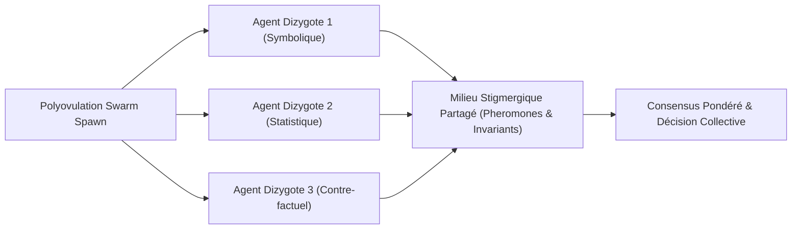

# Intelligence de nuée (Swarm Intelligence) GenOS

## 1. Définition

L’intelligence de nuée dans GenOS désigne la coordination émergente d’un ensemble d’agents ou de workers autour de traces, de votes, de rôles et de métriques de cohérence. Le repository ne traite pas la “swarm intelligence” comme une abstraction vague ; il l’implémente comme un système de coordination explicite avec :

- dépôt de traces de signal (phéromones / repulsions) ;
- sélection de chemins selon intensité et évaporation ;
- consensus de groupe via votes et quorum pondéré ;
- réorganisation dynamique des relations au sein d’une orchestration ;
- détection de collapses cognitifs, boucles périodiques et deadlocks de communication ;
- télémétrie de topologie et d’entropie.

Les points d’implémentation sont clairement rattachés au code :

- [crates/genos-signal/src/stigmergy.rs](../crates/genos-signal/src/stigmergy.rs) : modèle Rust pour phéromones, répulsions et évaporation ;
- [backend/src/services/primitiveHandlers/collective.js](../backend/src/services/primitiveHandlers/collective.js) : dépôt de trace, sélection de sentier, évaporation, quorum et quorum pondéré ;
- [backend/src/services/primitiveHandlers/collectiveConsensus.js](../backend/src/services/primitiveHandlers/collectiveConsensus.js) : Brier score, votes, pondération du consensus ;
- [backend/src/services/dynamicOrganizationService.js](../backend/src/services/dynamicOrganizationService.js) : organisations dynamiques, routing, message channels, transitions de structure ;
- [backend/src/services/swarmMetricsService.js](../backend/src/services/swarmMetricsService.js) : entropie de Shannon, détection de cycles, topologie du swarm.

Le point clé est que le système ne repose pas sur un “esprit de groupe” purement implicite ; il s’appuie sur des invariants techniques explicites : traces, seuils, voie de routage, pondération de confiance, et détection d’auto-répétition.

---

## 2. Ce que le repo fait réellement

GenOS implémente une version de swarm intelligence orientée “coordination multi-agent robuste”. Les mécanismes concrets sont :

1. dépôt de phéromones ou de traces sur un chemin donné ;
2. évaporation progressive de ces traces selon une durée de demi-vie ;
3. sélection du chemin le plus fort ou le plus probable ;
4. détection du collapse de diversité comportementale via entropie ;
5. collecte de votes de décision ;
6. validation d’un quorum simple ou pondéré ;
7. changement de structure organisationnelle selon le besoin (hub-and-spoke, quorum, adversarial triangle, stigmergy, etc.) ;
8. surveillance des cycles et des boucles de discussion sans production de valeur.

Autrement dit, GenOS utilise la swarming comme un mécanisme de routage, d’évacuation de risque et de résolution collective, pas comme un simple effet de bord “d’agentique générative”.

---

## 3. Modèle mathématique de base

### 3.1 Phéromones et évaporation

Le code Rust de [crates/genos-signal/src/stigmergy.rs](../crates/genos-signal/src/stigmergy.rs) représente une phéromone par :

- un identifiant de marqueur ;
- une intensité ;
- un taux de décroissance ;
- un indicateur de répulsion ;
- un cap de saturation.

La mise à jour de la phéromone suit deux formes :

- version continue :

$$
I(t + \Delta t) = I(t) \cdot e^{-\lambda \Delta t}
$$

- version discrète :

$$
I_{t+1} = I_t \cdot (1 - \lambda)
$$

où :

- $I_t$ est l’intensité actuelle ;
- $\lambda$ est le taux de décroissance ;
- $\Delta t$ est le temps écoulé.

Le dépôt est plafonné par une intensité maximale $I_{max}$ et la valeur est bornée dans :

$$
-I_{max} \le I_t \le I_{max}
$$

Les traces négatives sont traitées comme des phéromones répulsives, ce qui permet de marquer les impasses, les chemins dangereux ou les erreurs de décision.

### 3.2 Sélection de traces

La fonction `trailSelection` du fichier [backend/src/services/primitiveHandlers/collective.js](../backend/src/services/primitiveHandlers/collective.js) simule un mécanisme d’optimisation de colonies :

- somme des intensités de traces par chemin ;
- vieillissement par formule de demi-vie :

$$
\text{weight}(p, t) = \text{strength}(p) \cdot \left(\frac{1}{2}\right)^{\frac{age}{T_{1/2}}}
$$

- choix du chemin selon plusieurs modes :
  - greedy
  - epsilon-greedy
  - softmax
  - probabilistic / roulette

En mode softmax, le score est transformé en probabilité :

$$
P_i = \frac{e^{(s_i - s_{max}) / T}}{\sum_j e^{(s_j - s_{max}) / T}}
$$

où :

- $s_i$ est la force du chemin ;
- $T$ est la température ;
- $P_i$ est la probabilité de sélection.

Dans le repo, les chemins négatifs ou répulsifs sont explicitement filtrés si l’option `excludeRepellent` est activée ; cela correspond à une politique claire : éviter le chemin qui a été marqué comme mauvais.

### 3.3 Entropie cognitive et détection de collapse

Le service [backend/src/services/swarmMetricsService.js](../backend/src/services/swarmMetricsService.js) calcule l’entropie de Shannon sur la séquence d’actions observées :

$$
H(X) = -\sum_i p_i \log_2 p_i
$$

Il calcule aussi une entropie conditionnelle sur les transitions :

$$
H(Y \mid X) = -\sum_x p(x) \sum_y p(y\mid x) \log_2 p(y\mid x)
$$

Cette mesure sert à distinguer :

- exploration saine ;
- répétition dominée ;
- cycle périodique sans innovation ;
- confusion d’exploration excessive.

Le code impose des seuils explicites :

- répétition dominante si le ratio de dominance est élevé ;
- collapse si l’entropie normalisée est trop faible ;
- deadlock si le cycle périodique est détecté à répétition ;
- spike confusion si l’entropie est trop élevée.

Autrement dit, la nuée n’est pas “juste intelligente” parce qu’elle agit beaucoup ; elle est contrôlée parce qu’elle doit conserver une diversité fonctionnelle suffisante.

### 3.4 Consensus, quorum et fiabilité des votes

La logique de consensus est dans [backend/src/services/primitiveHandlers/collectiveConsensus.js](../backend/src/services/primitiveHandlers/collectiveConsensus.js).

Le Brier score est calculé pour un prédicteur binaire comme :

$$
BS = (p - o)^2
$$

et en multi-classe :

$$
BS = \frac{1}{N}\sum_{k=1}^{N}(p_k - o_k)^2
$$

Le repo transforme ensuite un Brier score en poids de confiance selon :

$$
w = \begin{cases}
0 & \text{si } b \ge 1 \\
\max(0, 0.1(1-b)) & \text{si } 0.5 \le b < 1 \\
(1-b)^2 & \text{si } b < 0.5
\end{cases}
$$

Le quorum standard suit ensuite :

$$
\text{approvalRate} = \frac{\text{votes}_{top}}{\text{votes}_{expressed}}
$$

et une décision est validée quand :

$$
\text{participants} \ge q_{min} \quad \land \quad \text{approvalRate} \ge \theta
$$

Le quorum pondéré fait la même chose en remplaçant les votes simples par des votes pondérés par fiabilité.

---

## 4. Analogies biologiques utiles

Les métaphores biologiques du repo sont cohérentes et utiles, mais leur sens est fonctionnel :

- phéromone = trace de signal dans un environnement partagé ;
- répulsion = marqueur de danger ou de chemin invalide ;
- quorum = seuil de participation collective ;
- mycelium / mesh = réseau de capacités et de dépendances ;
- polyéthisme dynamique = réaffectation de rôles selon la charge ;
- stigmergie = coordination indirecte via l’environnement ;
- école de poissons / flocking = ajustement de voisinage et de mouvement ;
- slime mould = adaptation d’un réseau de routes selon la valeur observée ;
- immunité = rejet de sorties mal fondées ou non prouvées.

La différence importante est que GenOS n’utilise pas la biologie pour “cacher” de la complexité ; il l’utilise plutôt pour expliciter des invariants de robustesse : l’environnement partage les traces, les agents se régulent, les voies faibles sont évapées, et le groupe ne décide pas sans seuil ni fact-check.

---

## 5. Architecture du système

```text
Agents / workers
     |
     v
+------------------------------------+
| DynamicOrganizationService         |
| - organization profiles             |
| - topology / roles / routing        |
| - routeMessage / publish / inbox    |
+------------------------------------+
     |
     +--------------+-----------------+
                    v
        +-----------------------+
        | Collective primitives  |
        | - pheromoneDeposit    |
        | - trailSelection      |
        | - evaporation         |
        | - quorum              |
        | - weightedQuorum      |
        | - brierScores         |
        +-----------------------+
                    |
                    v
        +-----------------------+
        | StigmergyField /      |
        | pheromone traces      |
        | evaporation + decay   |
        +-----------------------+
                    |
                    v
        +-----------------------+
        | Swarm telemetry       |
        | - entropy             |
        | - deadlock           |
        | - periodic cycle     |
        | - topology graph     |
        +-----------------------+
                    |
                    v
                 Database / messages / state
```

Les composants ne sont pas juste “en chaîne”. Ils partagent un état de structure dans [backend/src/services/dynamicOrganizationService.js](../backend/src/services/dynamicOrganizationService.js), où chaque organisation modifie :

- la topologie ;
- le mode d’échange ;
- la visibilité ;
- la stratégie de routage ;
- le canal de transmission (orchestrateur, stigmergic trail, capability mesh, etc.).

Les organisations supportées incluent des formes typiques :

- `hub_and_spoke`
- `weighted_quorum`
- `adversarial_triangle`
- `dynamic_neighbors`
- `shared_environment`
- `capability_mesh`
- `alpha_beta_delta`
- `role_gradient`
- `isolated_competitors`

Le système choisit donc une structure de coordination en fonction de la situation : collaborative, compétitive, hiérarchique, ou émergente.

---

## 6. Processus de fonctionnement

### 6.1 Dépôt de trace

Un agent ou worker publie une trace via `pheromoneDeposit` :

- l’ID orchestrateur est requis ;
- l’ID agent est requis ;
- le chemin est identifié ;
- la force est bornée à $[-1000, 1000]$ ;
- les traces négatives deviennent des marqueurs répulsifs.

Ensuite, le message est publié dans la structure organisationnelle courante.

### 6.2 Sélection de sentier

`trailSelection` lit les traces de type `trace` dans les messages de l’organisation. Il :

- calcule les forces effectives après vieillissement ;
- trie les trajectoires par intensité ;
- peut exclure les chemins répulsifs ;
- choisit selon un mode (greedy, epsilon-greedy, softmax, probabilistic).

Le résultat est un chemin candidat avec probabilités associées à chaque voie.

### 6.3 Évaporation

`evaporation` applique une décroissance de traces selon le temps :

- age du message ;
- paramètre de demi-vie ;
- seuil de prune ;
- suppression des traces trop faibles.

Cela évite l’accumulation de mémoire pathologique et maintient un environnement de décision à jour.

### 6.4 Vote et consensus

Les votes sont collectés sur la question active via `quorum` ou `weightedQuorum` :

- analyse des votes exprimés ;
- exclusion des abstentions ;
- calcul de la meilleure option ;
- validation du seuil de participation ;
- décision finale ou rejet.

Le système peut aussi fusionner les votes provenant de la table `swarm_votes`, ce qui rend la primitive compatible avec d’autres flux de décision.

### 6.5 Détection de boucle / deadlock / collapse

Le service d’entropie examine les séquences d’actions :

- entropie par action ;
- entropie de transition ;
- répétition dominante ;
- cycle périodique ;
- stagnation ou deadlock.

Le but est de sortir de situations où la nuée “tourne en rond” sans générer de décision ou de progrès réel.

---

## 7. Cas d’usage du repo

### 7.1 Recherche par piste collective

Un ensemble d’agents explore plusieurs chemins de solution. Chacun dépose des traces sur les chemins qu’il juge utiles. Les meilleurs chemins gagnent la sélection, et les chemins répulsifs sont évités.

C’est une modélisation simple mais robuste de l’optimisation de colonies : les agents ne se synchronisent pas par un message central et unique, ils coordonnent leur effort via l’environnement.

### 7.2 Consensus de décision multi-agents

Dans une session d’évaluation, plusieurs agents émettent une proposition ou un vote. Le système valide :

- s’il y a assez de participants ;
- si les votes sont assez clairs ;
- si la meilleure option dépasse le seuil de confiance.

Le mode pondéré est particulièrement utile lorsqu’un agent est plus fiable qu’un autre : il reçoit un poids plus fort via le Brier score ou via une valeur de calibration.

### 7.3 Reconfiguration dynamique de l’organisation

Selon le contexte, la structure d’équipe n’est pas fixe. Le repo permet de passer d’une hiérarchie à un quorum, un réseau de compétences, ou un mode adversarial. Cela correspond à un comportement de nuée qui s’auto-réorganise pour maximiser le flux et minimiser les risques.

### 7.4 Détection d’échec par boucle cognitive

Lorsque les actions perdent leur diversité, les traces deviennent répétitives, ou les messages se bouclent sans avancée, le service de métrique signale une situation de deadlock. Le système n’attend pas l’écroulement complet ; il identifie la boucle et force une correction.

---

## 8. Exemple concret

Voici un scénario d’utilisation inspiré de la logique du repo :

1. Trois agents explorent une stratégie de réparation.
2. Le premier dépose une trace positive sur le chemin A.
3. Le second dépose une trace négative sur le chemin B car il est bloqué.
4. Le système calcule les forces par chemin et choisit A avec une probabilité plus forte.
5. Un vote est lancé sur la meilleure stratégie.
6. Le quorum pondéré est calculé : deux agents fiables, un agent moins fiable.
7. Si l’approbation dépasse le seuil, la décision est acceptée.
8. Si l’entropie tombe à zéro ou si un cycle répétitif apparaît, un deadlock est signalé.

Pseudo-implémentation de logique :

```js
const { pheromoneDeposit, trailSelection, quorum, weightedQuorum } = require('./backend/src/services/primitiveHandlers/collective');

await pheromoneDeposit({
  orchestratorId: 'org-1',
  agentId: 'agent-a',
  path: 'path/repair-variant-a',
  strength: 0.8
});

const result = await trailSelection({
  orchestratorId: 'org-1',
  mode: 'softmax',
  temperature: 0.7,
  excludeRepellent: true
});

const decision = await weightedQuorum({
  orchestratorId: 'org-1',
  issue: 'repair_strategy',
  threshold: 0.6,
  minVotes: 2,
  calibrationScores: { 'agent-a': 0.9, 'agent-b': 0.8, 'agent-c': 0.6 }
});
```

L’intérêt n’est pas seulement “l’agent a une opinion”, mais que le système transforme cette opinion en signal, en chemin, en seuil, puis en décision gouvernée.

---

## 8.bis Essaims Dizygotes et Polyovulation

La primitive `genos_biomimicry_polyovulation_spawn` permet d'initialiser une nuée d'agents aux génomes hétérogènes (modèles et fonctions d'objectif diverses) coexistant dans le même milieu environnemental :



## 8.ter Nuées en Grappes Hybrides

La primitive `genos_biomimicry_hybrid_multiples` structure les essaims à grande échelle sous forme de matrices multi-niveaux :
- Diversité inter-groupes assurée par la polyovulation de familles distinctes ;
- Cohérence et parallélisme intra-groupe assurés par le clivage isogénique de chaque famille.

---

## 9. Comparaison avec ce qui existe sur le marché

### 9.1 Par rapport aux frameworks multi-agents classiques

- LangGraph : très orienté graphe de workflow, plus centralisé ; GenOS est plus “organique”, avec structures d’organisation, traces et métriques de deadlock.
- AutoGen / CrewAI : mettent souvent l’accent sur les agents et les tâches ; GenOS ajoute des mécanismes de règles de sécurité, budget, entropie, quorum et organisation dynamique.
- Semantic Kernel / agent buses : plus orientés sur l’orchestration de compétences ; GenOS intègre les dimensions de signal collectif et de surveillance d’état du groupe.

### 9.2 Par rapport aux algorithmes de swarm

- Ant Colony Optimization (ACO) : proche du mécanisme de phéromones et de sélection de chemin, mais GenOS va plus loin en intégrant la gestion d’organisation, l’évaluation de confiance, la logique de consensus et le contrôle opérationnel des états.
- Boids / flocking : comparable sur les voisinages et les mouvements globaux, mais GenOS est moins “motion-only” et plus “decision-layer plus telemetry-layer”.
- Decentralized governance / DAO voting : proche sur la notion de quorum et de vote pondéré, mais GenOS ajoute l’aspect signal environnemental (traces), deadlock detection, et réorganisation structurale.

### 9.3 Ce qui rend GenOS particulier

L’originalité du repo n’est pas l’idée d’une nuée en soi. C’est la combinaison de :

- phéromones et traces environnementales ;
- polyovulation pour essaims multi-génomiques hétérogènes ;
- organisation dynamique ;
- vote pondéré et seuils explicites ;
- gouvernance de la collaboration ;
- entropie et boucle de deadlock ;
- conscience de budget et de sécurité.

En pratique, GenOS essaie d’être à la fois une plateforme d’exécution multi-agent et une plate-forme de contrôle de la vie collective du groupe. La coordination n’est pas seulement “les agents se parlent”, elle est “l’environnement les guide, l’organisation les structure, et la télémétrie les corrige”.

---

## 10. Synthèse

La swarm intelligence dans GenOS est un système de coordination collective robuste, où :

- les traces structurent les choix ;
- les votes régulent les décisions ;
- la dynamique organisationnelle adapte la forme de la collaboration ;
- l’entropie protège la nuée contre le collapse et la répétition ;
- la télémétrie permet d’identifier les cycles morts et de reprendre le contrôle.

Ce n’est pas une simple “simulation d’abeilles”. C’est un mécanisme opérationnel de gouvernance multi-agent, conçu pour fonctionner dans un système qui combine exécutif, sécurité, observabilité et déploiement d’agents.

Le point de force de GenOS est qu’il est plus que “des agents qui communiquent” : il est un système où la structure elle-même, la trace, la confiance, et la qualité d’information deviennent des variables de coordination.
