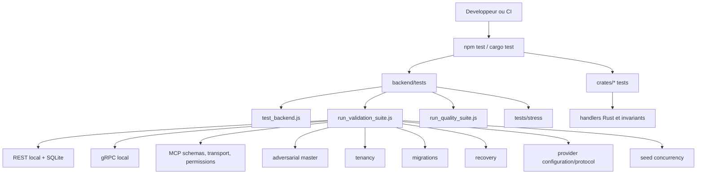
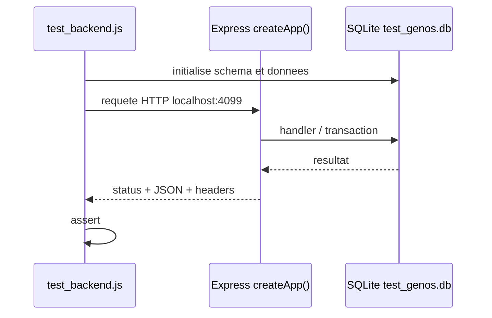

# Tests et validation du dépôt

## 1. Objet

Cette documentation décrit comment le dépôt GenOS vérifie son comportement aujourd'hui. Elle sépare les mécanismes réellement présents des catégories parfois attendues dans une plateforme d'agents : tests unitaires, tests d'intégration HTTP/gRPC, MCP, sécurité adversariale, charge, isolation tenant, concurrence, migrations, compatibilité CLI, providers et reprise après échec.

Les principales sources sont :

- [package.json](../package.json) et [backend/package.json](../backend/package.json)
- [backend/tests/run_validation_suite.js](../backend/tests/run_validation_suite.js)
- [backend/tests/run_quality_suite.js](../backend/tests/run_quality_suite.js)
- [backend/tests/test_backend.js](../backend/tests/test_backend.js)
- [backend/tests/test_grpc_services.js](../backend/tests/test_grpc_services.js)
- [backend/tests/stress/test_stress.js](../backend/tests/stress/test_stress.js)
- [crates/genos-cli/src/tests.rs](../crates/genos-cli/src/tests.rs)

Le dépôt ne repose pas sur Jest, Mocha, Vitest ou un framework de property testing centralisé. Les tests Node sont des scripts exécutables avec `node`, `assert`, des serveurs locaux, SQLite et des doubles ciblés. Les tests Rust sont les tests unitaires de crates exécutés par Cargo.

---

## 2. Définition : valider un runtime d'agents

Dans GenOS, la validation répond à plusieurs questions distinctes :

1. le calcul ou le handler produit-il la réponse contractuelle ?
2. l'API applique-t-elle authentification, tenant et schémas attendus ?
3. le processus se comporte-t-il correctement sous défaillance, concurrence ou entrée hostile ?
4. l'opération annoncée a-t-elle réellement été appliquée, plutôt que seulement simulée ?

Un succès de test est une observation reproductible dans le périmètre exercé. Ce n'est pas une preuve que les modèles externes, l'OS, le réseau ou les outils distants auront le même comportement en production.

La qualité globale est mieux représentée comme un vecteur :

$$
V = (U, I_{REST}, I_{gRPC}, M, S, T, C, R, P)
$$

où :

- $U$ : unité de logique ;
- $I_{REST}$ et $I_{gRPC}$ : intégration de transport ;
- $M$ : contrats MCP ;
- $S$ : sécurité et entrées adversariales ;
- $T$ : isolation multi-tenant ;
- $C$ : concurrence ;
- $R$ : reprise ;
- $P$ : provider et frontières réseau.

Le statut de la commande de test est une composante nécessaire mais insuffisante :

$$
\text{confiance} \neq \mathbb{1}[\text{exit code}=0]
$$

Il faut aussi examiner l'environnement, les doublures, les artefacts utilisés et le type de propriété vérifiée.

---

## 3. Architecture de validation



### 3.1 Commandes d'entrée

| Commande | Rôle |
|---|---|
| `npm test` | délègue à `npm --prefix backend test`, donc `backend/tests/test_backend.js` |
| `npm run test:quality` | lance les tests de qualité/evaluation Node |
| `npm --prefix backend run test:validation` | exécute tous les profils de validation Node |
| `npm --prefix backend run test:security` | exécute le master adversarial sécurité |
| `npm --prefix backend run test:mcp` | exécute le sous-ensemble MCP |
| `npm --prefix backend run test:tenancy` | exécute l'isolation tenant |
| `npm --prefix backend run test:migration` | exécute les migrations ciblées |
| `npm --prefix backend run test:recovery` | exécute les scénarios de reprise |
| `npm --prefix backend run test:providers` | valide les configurations/protocoles providers |
| `npm --prefix backend run test:concurrency` | valide le seed concurrent SQLite |
| `npm --prefix backend run test:grpc` | lance l'intégration gRPC locale |
| `cargo test --workspace` | exécute les tests unitaires Rust disponibles dans les crates |

`run_validation_suite.js` lance chaque fichier enfant par `spawnSync`, s'arrête au premier échec et retourne `0` uniquement si toutes les suites du profil passent. Il injecte `GENOS_ADMIN_PASSWORD=test-only` lorsque la variable est absente, afin d'éviter que la suite ne dépende d'un secret opérateur.

---

## 4. Tests unitaires Rust

Les tests Rust se trouvent dans les crates. Par exemple, [crates/genos-cli/src/tests.rs](../crates/genos-cli/src/tests.rs) exerce directement les handlers sans passer par un shell :

- création, validation et snapshot d'agent ;
- comparaison de snapshots ;
- détection d'hallucination ;
- replay avec chaîne de hash ;
- primitives biomimétiques.

Le test de replay est particulièrement utile : il crée un snapshot, écrit une étape, vérifie que le replay réussit, modifie ensuite `delta_entropy` et exige l'échec de la vérification. La propriété testée est l'intégrité de la chaîne, non la réexécution d'un LLM ou d'un outil externe.

```rust
let tampered = raw.replace("\"delta_entropy\": 0.1", "\"delta_entropy\": 9.9");
std::fs::write(&snap_file, tampered).unwrap();
assert!(tampered_result.is_err());
```

Ce style est unitaire ou de composant local : fichiers temporaires, handlers Rust réels, pas de provider cloud ni de backend déployé.

---

## 5. Tests unitaires Node et qualité

Les tests Node sont des scripts `node` utilisant principalement `assert` ou `node:assert/strict`. Ils couvrent les services, contrôleurs, schémas, politiques, adapters et contrats.

La suite `test:quality` regroupe notamment :

- gradation et worker d'évaluation ;
- intégrité/checkpoint de campagne ;
- score, complétude et provenance ;
- reproductibilité ;
- normalisation de résultat ;
- sémantique des métriques ;
- preuve de « no answer ».

Ce regroupement ne mesure pas une qualité subjective du modèle. Il vérifie que les résultats et preuves stockés par les composants d'évaluation respectent les contrats attendus.

---

## 6. Tests d'intégration REST

Le test [backend/tests/test_backend.js](../backend/tests/test_backend.js) est une intégration REST locale représentative :

1. il crée une base SQLite de test ;
2. démarre `createApp()` derrière un serveur HTTP local sur le port `4099` ;
3. effectue de vraies requêtes HTTP avec `http.request` ;
4. injecte un bearer token de test et les headers de tenant lorsque requis ;
5. vérifie les statuts HTTP, headers, payloads et les écritures SQLite.

Il couvre notamment WAL/transactions, RBAC, headers de sécurité, arena, schémas MCP, VFS dry-run, snapshots/résilience, mémoire, génome et APIs de workflow selon les sections du script.



Il s'agit d'une vraie intégration du processus Express et de SQLite, mais pas d'un déploiement Docker, reverse proxy, TLS public ou navigateur réel.

---

## 7. Tests d'intégration gRPC

[backend/tests/test_grpc_services.js](../backend/tests/test_grpc_services.js) :

- charge les descripteurs protobuf ;
- crée un `grpc.Server` local ;
- enregistre tous les services ;
- écoute sur `127.0.0.1:50059` ;
- crée de vrais clients gRPC ;
- ajoute le metadata `x-genos-grpc-key` ;
- appelle des RPCs et compare les résultats à l'état SQLite lorsque nécessaire.

La suite couvre Core, Arena, Memory, Swarm, Resilience, RustBridge, Telemetry, Workspace et les services chargés dans le fichier complet. Elle teste donc le chargement proto, l'enregistrement, l'authentification gRPC et les conversions de données, pas une interopérabilité réseau inter-machine.

Les tests dédiés complètent ce socle pour l'auth, le bind sécurisé, le mapping des erreurs, l'isolation de ressources, d'expériences, d'incidents et de workflows.

---

## 8. Tests MCP

Le profil `test:mcp` rassemble :

- catalogue et registre d'outils ;
- schémas d'entrée ;
- permissions et scope ;
- transport HTTP MCP ;
- transport explicitement configuré ;
- parité serveur/contrat.

La couverture MCP est répartie dans de nombreux fichiers spécialisés : enveloppe, nomenclature, arguments, chemins d'entrée, timeout, lease, appels directs, dispatch/circuit breaker, bridge Codex et stratégies MCP.

Les tests [backend/tests/stress/test_mcp_stress.js](../backend/tests/stress/test_mcp_stress.js) vérifient aussi le VFS dry-run avec des entrées d'injection, les noms de type prototype, et le calcul de blast radius.

Exemple : une commande dangereuse contenant une chaîne d'injection est fournie au **simulateur** VFS ; le test confirme qu'elle est marquée destructive et capturée dans les effets simulés. Il ne lance pas cette commande sur le système hôte.

---

## 9. Tests adversariaux et sécurité

Le profil `test:security` lance [backend/tests/test_security_adversarial_master_runner.js](../backend/tests/test_security_adversarial_master_runner.js), lui-même complété par les tests adversariaux ciblés.

La couverture contient notamment :

- accès non authentifié rejeté ;
- frontières RBAC (`viewer`, `operator`, `admin`) ;
- CORS et CSRF ;
- sanitization XSS ;
- isolation MCP et circuit breaker ;
- tests de payloads hostiles, SQLi, SSRF, traversal et policy de providers selon les fichiers ciblés ;
- refus des actions destructives ou hors autorité.

Le harnais de stress historique [backend/tests/stress/test_stress.js](../backend/tests/stress/test_stress.js) démarre également Express et SQLite localement, puis vérifie des refus concrets HTTP `401`, `403` et les transitions du circuit breaker.

La démarche est comparable au système immunitaire :

- antigène : entrée inattendue, privilège insuffisant, URL hostile ou outil dangereux ;
- reconnaissance : middleware, validateurs et policy ;
- réponse : refus, quarantaine, audit ou ouverture du breaker ;
- mémoire : test de régression qui empêche le retour du défaut.

La métaphore est une organisation de défense logicielle, pas une équivalence biologique.

---

## 10. Stress, chaos et concurrence

### 10.1 Tests de stress présents

Le dossier `backend/tests/stress` contient des harnais dédiés à :

- arena ;
- MCP/VFS/blast radius ;
- mémoire et workspace ;
- résilience de swarm ;
- stress backend général.

Ils exercent surtout des entrées limites, des enchaînements de sécurité, des calculs de risque, des volumes logiques et des invariants de services. Ce sont des stress tests ciblés, non un benchmark de capacité avec SLO mesurés, trafic distribué ou collecte de percentiles de production.

### 10.2 Chaos engineering

Le dépôt ne contient pas de suite dédiée nommée `chaos`, ni d'injection systématique de pannes de réseau, disque, processus, DNS, clock skew ou partition inter-services.

Il existe des composants de résilience et quelques scénarios simulant erreurs, timeouts ou échecs de workers. Ceux-ci ne doivent pas être présentés comme une campagne de chaos complète.

### 10.3 Concurrence

Le profil `test:concurrency` couvre [backend/tests/test_seed_concurrency.js](../backend/tests/test_seed_concurrency.js).

Le test ouvre deux connexions SQLite vers le même fichier et exécute `seedDatabase` en parallèle. Il exige qu'un workspace concurrent ne crée qu'une unique alerte bootstrap déterministe.

$$
\left|\{a \mid a.workspace = w \land a.type = bootstrap\}\right| = 1
$$

Il vérifie donc une propriété précise d'idempotence concurrente. Il ne couvre pas exhaustivement l'ensemble des courses possibles des workers, sockets, transactions ou files de jobs.

---

## 11. Multi-tenant

Le profil `test:tenancy` exécute :

- `test_tenancy.js` ;
- `test_tenant_membership_scope.js` ;
- `test_trace_tenant_scope.js`.

Le test principal crée une base temporaire, un principal, une organisation, deux projets, des memberships et des workspaces portant le même nom dans des projets différents. Il démontre qu'un tenant valide est résolu et qu'un projet pour lequel le principal n'est pas membre est refusé.

La propriété attendue est :

$$
\text{access}(p, o, j) = \text{member}(p,o) \land \text{member}(p,j) \land j.organization = o
$$

Ce modèle teste l'isolement d'identité et de scope applicatif dans SQLite. Il ne remplace pas un test de séparation physique de bases, de clés de chiffrement par tenant ou de déploiements indépendants.

---

## 12. Migrations

Le profil `test:migration` rassemble :

- migration MsgPack ;
- ambiguïté de migration legacy ;
- migration de préférences de notification.

[backend/tests/test_msgpack_migration.js](../backend/tests/test_msgpack_migration.js) crée une base en mémoire avec des colonnes JSON historiques, lance `migrateToMsgPack`, décode le résultat avec `msgpackr`, puis lance une seconde fois la migration et exige qu'elle n'applique aucun changement.

L'invariant est l'idempotence :

$$
M(M(D)) = M(D)
$$

avec conservation de la valeur utile :

$$
decode(M(D)) = D
$$

Cette approche est solide pour le transformateur et son absence de double-écriture. Elle ne simule pas, à elle seule, une migration de base de production très volumineuse ni une coupure pendant transaction.

---

## 13. Compatibilité CLI

La validation CLI couvre plusieurs frontières :

- les tests unitaires Rust de `genos-cli` ;
- [backend/tests/test_command_service_contract.js](../backend/tests/test_command_service_contract.js), qui vérifie le bridge gRPC de commandes ;
- [backend/tests/test_genos_cli_environment.js](../backend/tests/test_genos_cli_environment.js), qui vérifie le filtrage de l'environnement transmis au binaire ;
- les tests d'arguments et de sous-commandes sous `crates/genos-api/tests` et les crates concernées.

Le contrat gRPC est explicitement vérifié : `snapshot create --out "file with spaces.json"` est transmis sous forme de tableau d'arguments, tandis que `node -e evil` est rejeté avec `exit_code: 2` et le statut `invalid_command`.

Il s'agit d'une compatibilité de contrat et d'invocation. Les wrappers Windows `g.ps1` et `g.cmd` sont présents, mais le profil de validation ne constitue pas une matrice automatisée exhaustive sur toutes les versions de PowerShell, `cmd.exe` et Windows.

---

## 14. Providers modèles : réel, mocké, configuration

Le profil `test:providers` contient :

- `test_supported_model_providers.js` ;
- `test_ollama_native_protocol.js` ;
- `test_openai_compatible_configuration.js`.

Les propriétés réellement testées sont :

- l'allowlist des providers pris en charge ;
- l'obligation d'un endpoint explicite pour `openai-compatible` ;
- la forme d'une requête Ollama ;
- le parsing d'un stream NDJSON Ollama, les tokens et l'assemblage du texte.

Dans le test Ollama, `global.fetch` est remplacé par un double qui retourne des chunks NDJSON contrôlés. Aucun appel n'est envoyé à un Ollama, OpenAI, Anthropic, Gemini ou autre provider réel.

| Type de test | Présent | Limite |
|---|---|---|
| registre de providers | oui | ne garantit ni credentials ni disponibilité distante |
| configuration d'endpoint | oui | ne contacte pas le provider |
| protocole NDJSON Ollama | oui, avec `fetch` mocké | pas de serveur Ollama réel |
| appel provider cloud réel | pas dans le profil standard | credentials, coût, réseau et quotas volontairement hors CI |

Pour une validation live, un environnement séparé doit fournir des clés non productives, un budget, une allowlist de modèles et des assertions qui évitent de qualifier une réponse LLM de vérité métier.

---

## 15. Crash et reprise

Le profil `test:recovery` regroupe :

- recovery de worker ;
- bisection causale automatique ;
- reconnexions de boucle d'exécution.

[backend/tests/test_worker_failure_recovery.js](../backend/tests/test_worker_failure_recovery.js) vérifie les décisions `mutate_worker`, `fork_worker`, `replace_worker`, `escalate_unresolved` et le traitement strict d'un `no_answer` sans preuve.

[backend/tests/test_automatic_bisection_recovery.js](../backend/tests/test_automatic_bisection_recovery.js) construit une timeline de snapshots contenant une régression, demande son isolement et vérifie que le nombre d'itérations reste borné par une recherche dichotomique :

$$
k \leq \lceil \log_2(n) \rceil + 1
$$

Le même scénario injecte ensuite snapshots, agents et échec dans SQLite, observe une mission de récupération interceptée, et vérifie l'événement de télémétrie.

Ces tests exercent vraiment la décision de reprise, la persistence locale et la composition des prompts. Ils ne font pas tomber volontairement une machine, ne redémarrent pas un cluster et ne prouvent pas la récupération après coupure d'alimentation ou corruption de disque.

---

## 16. Exemple de stratégie de validation

Pour modifier une route tenant-aware qui exécute un outil MCP :

```powershell
$env:GENOS_ADMIN_PASSWORD = 'test-only'
npm --prefix backend run test:tenancy
npm --prefix backend run test:mcp
npm --prefix backend run test:security
```

Pour un changement du binaire natif :

```powershell
cargo test -p genos-cli
node backend/tests/test_command_service_contract.js
node backend/tests/test_genos_cli_environment.js
```

Pour une migration SQLite :

```powershell
npm --prefix backend run test:migration
```

La sélection doit suivre la surface modifiée. Le profil `all` est utile avant intégration large, mais une suite ciblée est le contrôle le plus rapide pour falsifier une hypothèse locale.

---

## 17. Comparaison avec le marché

| Dimension | GenOS | Pratique commune mature |
|---|---|---|
| unités Node | scripts `assert` exécutables directement | Jest/Vitest/Mocha avec rapports et mocks centralisés |
| unités Rust | `cargo test` par crate | identique, souvent complété par proptest/fuzzing |
| REST | serveur Express réel et SQLite locale | Testcontainers, DB éphémère, tests d'API contractuelle |
| gRPC | serveur/client local avec protos réels | idem, plus tests de compatibilité inter-version et TLS distant |
| MCP | contrats, schemas, transport, lease et permissions | domaine encore récent ; approche similaire aux tests de plugins/outils |
| adversarial | suites dédiées aux routes et policy | SAST/DAST, fuzzing, scans dépendances, pentests automatisés |
| stress | harnais logiques ciblés | k6/Locust/Gatling avec charge distribuée et SLO |
| chaos | pas de suite dédiée | LitmusChaos, Chaos Mesh, pannes réseau/disque/processus contrôlées |
| providers LLM | mocks de configuration et protocole | sandbox live, enregistrements de réponses, budgets et évaluations canari |
| recovery | décisions, SQLite et bisection testées | plus chaos restart, backup restore et DR drills |

La force actuelle de GenOS est la proximité entre ses contrats de sécurité/runtime et leurs scripts de validation ciblés. Les principaux écarts avec une plateforme de validation mature sont une couverture de chaos non systématique, l'absence de suite provider live standardisée, l'absence de test de charge avec SLO, et une automatisation Windows CLI non exhaustive.

---

## Conclusion

La validation GenOS est un portefeuille de tests concrets : Rust local, Node par services, Express et gRPC réellement démarrés en local, SQLite temporaire, contrats MCP, protections adversariales, tenant, migration, concurrence et recovery.

La lecture opérationnelle correcte est la suivante :

- les intégrations REST/gRPC et la persistence SQLite sont effectivement exercées ;
- MCP est fortement testé au niveau contrats, policy et transports configurés ;
- stress et recovery existent mais restent ciblés ;
- chaos engineering dédié et providers modèles live ne font pas partie de la suite standard ;
- une suite verte atteste les propriétés précisées par ses assertions, pas une garantie générale de comportement autonome en production.