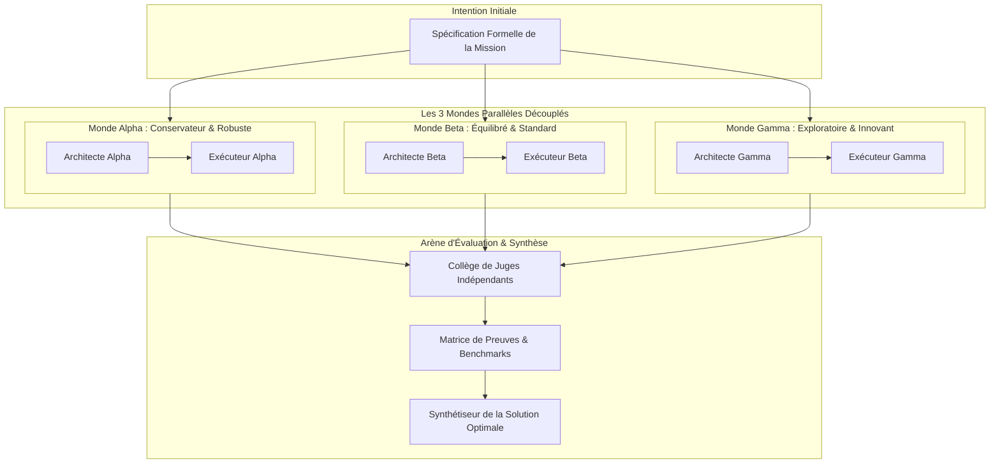
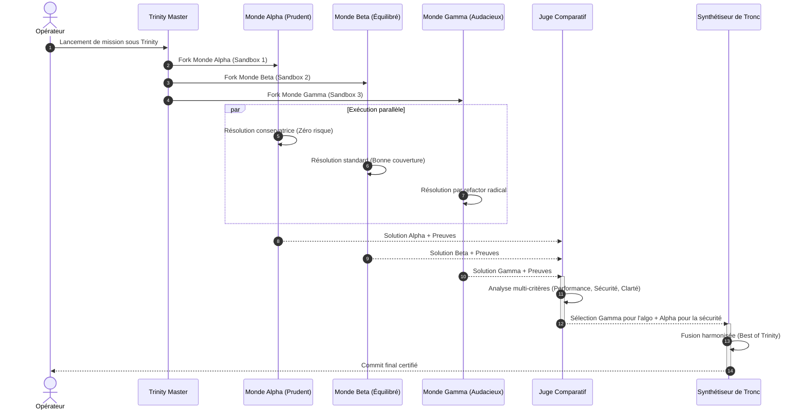
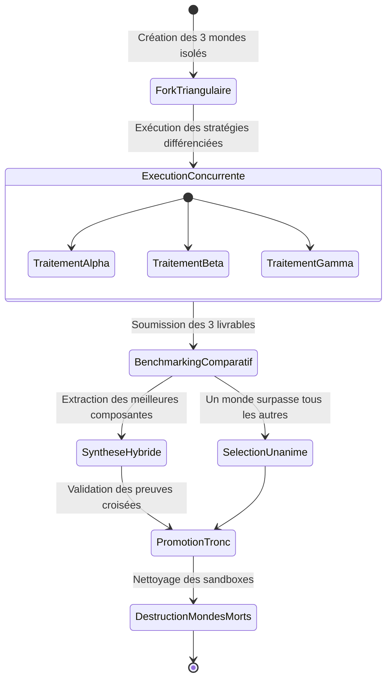

# Trinity : Orchestration Comparée en Trois Mondes

## 1. Définition

Trinity dans GenOS est le mécanisme d'orchestration qui exécute une mission en parallèle dans trois "mondes" distincts, chacun adoptant une **hypothèse différente** sur la meilleure façon d'aborder le problème. Au lieu de choisir *une* stratégie, Trinity explore trois stratégies complémentaires et mesure leurs preuves respectives pour un apprentissage collectif.

Les trois mondes sont :

1. **World 1 (Basic)** : implémentation directe, minimale, sans plan explicite (modèle standard)
2. **World 2 (Planned)** : implémentation depuis un plan détaillé, interview-dérivé (modèle frontier)
3. **World 3 (Self-Correcting)** : implémentation indépendante, puis challenge et correction via preuves (modèle frontier)

Trinity n'est pas une orchestration par consensus : c'est une **expérimentation comparée** où chaque monde produit des preuves différentes. Le système peut alors analyser lequel s'adapte le mieux au contexte réel, lequel révèle les défauts cachés, et lequel offre une couverture plus robuste.

Le cœur fonctionnel est réparti entre :

- [backend/src/services/trinityService.js](../backend/src/services/trinityService.js) : analyse de mission, détection de domaine, composition des trois mondes.
- [backend/src/services/deploy/trinityDeploy.service.js](../backend/src/services/deploy/trinityDeploy.service.js) : déploiement des trois agents workers, création des "worlds" isolées.
- [backend/src/services/agentAutonomyPlanService.js](../backend/src/services/agentAutonomyPlanService.js) : activation conditionnelle de Trinity selon budget et recommandation.
- [backend/src/services/agentOrchestrationState.js](../backend/src/services/agentOrchestrationState.js) : état partagé, synchronisation des trois mondes, barrière de fusion.
- [backend/src/db/schema-tables-core.js](../backend/src/db/schema-tables-core.js) : table `trinity_worlds` pour le suivi des trois instances.

Le principe est simple mais puissant : une mission complexe ne se réduit pas à une seule approche. Explorer trois approches **en parallèle** et les comparer par preuves offre une robustesse que aucune approche isolée ne peut atteindre.

---

## 2. Non une triple exécution identique, mais une expérience comparée

GenOS applique une logique de contrôle comparative :

1. **analyser la mission** pour détecter le domaine et le profil d'approche ;
2. **valider que Trinity est appropriée** (demande explicite ou interview-for-plan) ;
3. **composer trois hypothèses distinctes** alignées au domaine ;
4. **allouer des agents (workers) avec des modèles adaptés** ;
5. **exécuter les trois mondes en isolation stricte** ;
6. **mesurer les preuves par monde** ;
7. **comparer et évaluer les trois dossiers** ;
8. **fusionner ou escalader selon l'analyse comparative**.

Les mécanismes de cohérence sont explicites :

- **trois mondes isolés** : chaque monde a son propre worker, son propre GPU/tenant, sa propre timeline ;
- **modèles différenciés** : world 1 = standard (rapide), worlds 2 et 3 = frontier (réfléchi) ;
- **hypothèses incomparables** : les trois hypothèses ne se réduisent pas l'une à l'autre ;
- **preuves comparables** : chaque monde retourne des preuves du même type (tests, audit, métriques) ;
- **barrière de fusion** : avant de décider, le runtime valide la cohérence croisée des trois résultats ;
- **arrêt sur désaccord irréductible** : fusion refusée si aucun monde n'offre une preuve convaincante.

---

## 3. Définition mathématique de l'orchestration comparative

L'orchestration Trinity est un problème de sélection adaptative via expérimentation contrôlée.

Soit :

- $M$ : mission partagée ;
- $W_1, W_2, W_3$ : trois mondes (hypothèses) ;
- $H_i$ : hypothèse du monde $i$ ;
- $E_i$ : dossier d'évidence du monde $i$ ;
- $S_i$ : score de cohérence du monde $i$ avec la mission réelle ;
- $P$ : points de Pareto entre les trois mondes.

Chaque monde exécute la même mission avec une hypothèse différente :

$$
\text{World}_i = \text{Execute}(M, H_i)
$$

retournant un dossier d'évidence :

$$
E_i = \{ \text{claims}_i, \text{tests}_i, \text{provenance}_i, \text{failures}_i \}
$$

Le score de cohérence mesure la validité du dossier :

$$
S_i = \alpha \cdot \text{score}(\text{claims}_i) + \beta \cdot \text{coverage}(\text{tests}_i) + \gamma \cdot \text{robustness}(E_i)
$$

avec des poids $\alpha + \beta + \gamma = 1$ définis par le domaine.

La décision de fusion suit :

$$
\text{canMerge} = 
\begin{cases}
1 & \text{si } \exists i : S_i \ge S_{\text{threshold}} \\
0 & \text{sinon (escalade requise)}
\end{cases}
$$

et la sélection du meilleur monde suit :

$$
i_{\text{best}} = \arg\max_i S_i
$$

---

## 4. Domaines reconnus et profils d'hypothèses

Trinity fonctionne sur des domaines spécialisés. Chaque domaine définit trois hypothèses spécifiques :

### 4.1 Domaine : Creative Writing

```
Artifact: creative
Signaux: histoire, nouvelle, roman, fiction, poème, créativité littéraire
Rôles: direct_author, planned_author, self_correcting_literary_author
```

**Hypothèse 1 (World 1 - Basic):**
> "Create the work directly from the raw artistic brief, preserving voice and productive ambiguity."

**Hypothèse 2 (World 2 - Planned):**
> "Create the work from an explicit dramatic and stylistic plan derived from the brief."

**Hypothèse 3 (World 3 - Self-Correcting):**
> "Create independently, then revise against literary craft, emotional impact, coherence, and constraint coverage."

### 4.2 Domaine : Security

```
Artifact: technical
Signaux: sécurité, OAuth, vulnérabilité, threat, authentification, exploit
Rôles: baseline_security_engineer, threat_model_engineer, adversarial_security_engineer
```

**Hypothèse 1 (World 1 - Basic):**
> "Implement the raw security need with the smallest auditable change."

**Hypothèse 2 (World 2 - Planned):**
> "Implement from a threat model, explicit invariants, and an attack-surface plan."

**Hypothèse 3 (World 3 - Self-Correcting):**
> "Implement independently, then attack, falsify, and correct the result with reproducible evidence."

### 4.3 Domaine : Data

```
Artifact: technical
Signaux: database, SQL, ETL, analytics, dataset, data integrity
Rôles: baseline_data_engineer, planned_data_engineer, data_validation_engineer
```

**Hypothèse 1 (World 1 - Basic):**
> "Implement the raw data need with explicit schema and migration constraints."

**Hypothèse 2 (World 2 - Planned):**
> "Implement from a data-flow, integrity, and rollback plan."

**Hypothèse 3 (World 3 - Self-Correcting):**
> "Implement independently, then challenge correctness with boundary datasets and reconciliation checks."

### 4.4 Domaine : Product Design

```
Artifact: design
Signaux: UI, UX, interface, design system, accessibilité, React, Vue, CSS
Rôles: baseline_product_designer, planned_product_designer, usability_critic
```

**Hypothèse 1 (World 1 - Basic):**
> "Implement the raw interface need with minimal assumptions."

**Hypothèse 2 (World 2 - Planned):**
> "Implement from a user-flow, hierarchy, accessibility, and interaction plan."

**Hypothèse 3 (World 3 - Self-Correcting):**
> "Implement independently, then correct the result against usability, accessibility, and visual-consistency evidence."

### 4.5 Domaine : Software Engineering (Par défaut)

```
Artifact: technical
Signaux: tout ce qui n'est pas couvert par les domaines spécialisés
Rôles: basic_implementation, interview_plan_implementation, self_correcting_implementation
```

**Hypothèse 1 (World 1 - Basic):**
> "Implement the raw need without relying on an interview-derived plan."

**Hypothèse 2 (World 2 - Planned):**
> "Implement from the requirements and plan produced by the user interview."

**Hypothèse 3 (World 3 - Self-Correcting):**
> "Implement independently, then challenge and correct the result with evidence."

---

## 5. Architecture du système

```text
Client / Mission
        |
        v
[trinityService.analyzeMission]
        |
        +--> détecte domaine (5 profils)
        +--> valide activation (explicite ou interview)
        +--> compose 3 hypothèses + rôles
        |
        v
[agentAutonomyPlanService]
        |
        +--> teste budget (3 workers = 3 × budget_min)
        +--> active Trinity si demandée
        +--> configure trinity.activated, workers count
        |
        v
[trinityDeploy.deployTrinity]
        |
        +--> crée Trinity Orchestrator
        +--> crée 3 Trinity Workers (agents autonomes)
        +--> insère dans table trinity_worlds
        +--> assigne prompts contextualisés par hypothèse
        |
        v
[Exécution parallèle des 3 mondes]
        |
        +--> World 1: basic_implementation (Standard tier)
        +--> World 2: planned_implementation (Frontier tier)
        +--> World 3: self_correcting (Frontier tier)
        |
        v
[Collecte d'évidence par monde]
        |
        +--> tests, preuves, métriques
        +--> rapports de succès/échec
        +--> observations de cohérence
        |
        v
[Barrière d'évidence comparative]
        |
        +--> attendre que tous les mondes deviennent idle
        +--> valider cohérence mutuelle
        +--> scorer chaque monde
        +--> décider fusion ou escalade
        |
        v
[Fusion ou Escalade]
        |
        +--> merge_trinity_evidence
        +--> record_world_comparison
        +--> return best_world + comparative_analysis
```

---

## 6. Analyse et activation

L'analyse de mission est effectuée par [backend/src/services/trinityService.js](../backend/src/services/trinityService.js).

### Processus d'activation

La fonction `analyzeMission(text)` :

1. **teste les demandes explicites** : "launch Trinity", "utilise Trinity", "mode Trinity" ;
2. **teste les demandes d'interview** : "interview me to create a plan", "pose-moi des questions" ;
3. **détecte le domaine** via signaux regex (5 profils) ;
4. **retourne une analyse complète** avec recommandation et decision.

Exemple 1 : Demande explicite

```javascript
const mission = "Lance Trinity pour implémenter cette fonctionnalité.";
const analysis = trinityService.analyzeMission(mission);

// Résultat:
// {
//   recommended: true,
//   explicitlyRequested: true,
//   interviewForPlan: false,
//   decision: "launch",
//   domain: "software_engineering",
//   artifact: "technical",
//   members: [ 3 agents avec hypothèses ]
// }
```

Exemple 2 : Interview pour créer un plan

```javascript
const mission = "Pose-moi des questions pour créer un plan de produit.";
const analysis = trinityService.analyzeMission(mission);

// Résultat:
// {
//   recommended: true,
//   explicitlyRequested: false,
//   interviewForPlan: true,
//   decision: "consider_after_interview",
//   domain: "product_design",
//   artifact: "design",
//   members: [ 3 agents avec hypothèses ]
// }
```

Exemple 3 : Pas de Trinity

```javascript
const mission = "Corrige ce test unitaire.";
const analysis = trinityService.analyzeMission(mission);

// Résultat:
// {
//   recommended: false,
//   explicitlyRequested: false,
//   interviewForPlan: false,
//   decision: "not_applicable"
// }
```

### Conditions d'activation

Trinity s'active si :

```javascript
autonomyPlan.trinity.activated = 
  autonomyPlan.trinity.explicitlyRequested  // Ou decision === "launch" après interview
  && autonomyPlan.trinity.budgetPermitsLaunch; // Budget ≥ 3 × min_tokens_per_worker
```

Trinity est **dégradée** (pas activée) si :

- **A-Team est activée** : Trinity et A-Team s'excluent mutuellement ;
- **Budget insuffisant** : moins de 3 workers ne peuvent être financés ;
- **Pas de demande explicite** : la mission n'a pas explicitement demandé Trinity.

---

## 7. Composition et allocation

La fonction `compose(mission)` construit les trois agents contextualisés.

### Contrat d'entrée

```javascript
compose("Lance Trinity pour écrire une nouvelle de science-fiction.")
```

### Validation stricte

La composition valide :

1. **mission présente** : aucune Trinity sans mission explicite ;
2. **domaine détecté** : un profil parmi les 5 domaines (ou defaut software_engineering) ;
3. **trois hypothèses générées** : les 3 membres correspondent aux 3 rôles et hypothèses du profil.

Si une validation échoue :

- `TRINITY_MISSION_REQUIRED` : pas de mission

### Sortie

La composition retourne un tableau de 3 agents contextualisés :

```javascript
[
  {
    label: "basic_world",
    hypothesis: "Create the fiction directly from the brief...",
    role: "direct_author",
    modelTier: "standard",
    domain: "creative_writing",
    artifact: "creative",
    pipelineStage: 0,
    worldNumber: 1,
    mission: "Trinity shared mission: ...\nDomain: creative_writing\nWorld strategy: Create the fiction directly...\nReturn domain-appropriate evidence..."
  },
  {
    label: "planned_world",
    hypothesis: "Create the fiction from an explicit plan...",
    role: "planned_author",
    modelTier: "frontier",
    domain: "creative_writing",
    artifact: "creative",
    pipelineStage: 0,
    worldNumber: 2,
    mission: "Trinity shared mission: ...\nWorld strategy: Create from plan...\nReturn domain-appropriate evidence..."
  },
  {
    label: "ai_corrected_world",
    hypothesis: "Create independently, then revise...",
    role: "self_correcting_literary_author",
    modelTier: "frontier",
    domain: "creative_writing",
    artifact: "creative",
    pipelineStage: 0,
    worldNumber: 3,
    mission: "Trinity shared mission: ...\nWorld strategy: Create independently, then correct...\nReturn domain-appropriate evidence..."
  }
]
```

---

## 8. Activation et allocation de budget

Trinity est activée conditionnellement par [backend/src/services/agentAutonomyPlanService.js](../backend/src/services/agentAutonomyPlanService.js).

### Décision d'activation

```javascript
autonomyPlan.trinity = trinityService.analyzeMission(mission);
const trinityWorkerCount = autonomyPlan.trinity.members.length; // = 3

const affordableTrinityMembers = Math.floor(
  (tokenBudget * workerAllocationRatio) / minTokensPerWorker
);

autonomyPlan.trinity.budgetPermitsLaunch = affordableTrinityMembers >= trinityWorkerCount;
autonomyPlan.trinity.activated = 
  autonomyPlan.trinity.explicitlyRequested 
  && autonomyPlan.trinity.budgetPermitsLaunch;
```

### Allocation de budget par monde

Le budget est réparti équitablement entre les trois mondes :

$$
T_{\text{per\_world}} = \frac{T_{\text{worker}} \times s}{3}
$$

où :
- $T_{\text{worker}}$ est le budget alloué aux workers
- $s$ est le ratio d'allocation (typiquement 0.6–0.8)
- 3 est le nombre de mondes Trinity

Chaque monde doit atteindre un minimum viable de tokens pour effectuer une exploration significative.

### Modèles utilisés

- **World 1 (Basic)** : modèle `standard` (plus rapide, moins de contexte)
- **World 2 (Planned)** : modèle `frontier` (réfléchi, coûteux)
- **World 3 (Self-Correcting)** : modèle `frontier` (réfléchi, coûteux)

Cette différenciation de coût reflète la complexité de chaque hypothèse.

---

## 9. Déploiement des trois mondes

Le déploiement est effectué par [backend/src/services/deploy/trinityDeploy.service.js](../backend/src/services/deploy/trinityDeploy.service.js).

### Étapes du déploiement

1. **Créer un Orchestrator Trinity** : agent centralisé qui gère la synchronisation ;
2. **Créer 3 Workers Trinity** : un par monde, avec rôles et hypothèses distincts ;
3. **Insérer dans table trinity_worlds** : suivi par worldNumber et stratégie ;
4. **Assigner des budgets** : chaque monde reçoit son quota de tokens ;
5. **Injecter des prompts contextualisés** : chaque monde reçoit sa mission + hypothèse.

### Schema de la table trinity_worlds

```sql
CREATE TABLE trinity_worlds (
  id TEXT PRIMARY KEY,
  mission TEXT,
  world_number INTEGER,
  name TEXT,
  strategy TEXT,
  status TEXT,
  agent_id TEXT FOREIGN KEY
);
```

Exemple d'insertion :

```sql
INSERT INTO trinity_worlds 
  (id, mission, world_number, name, strategy, status, agent_id) 
VALUES 
  ('trinity_12345_world_1', 'Write a sci-fi story', 1, 'Trinity Worker (World 1: direct_author)', 'direct_author', 'queued', 'agent_abc'),
  ('trinity_12345_world_2', 'Write a sci-fi story', 2, 'Trinity Worker (World 2: planned_author)', 'planned_author', 'queued', 'agent_def'),
  ('trinity_12345_world_3', 'Write a sci-fi story', 3, 'Trinity Worker (World 3: self_correcting_literary_author)', 'self_correcting_literary_author', 'queued', 'agent_ghi')
```

---

## 10. Exécution isolée et production de preuves

Les trois mondes s'exécutent en **isolation stricte**. Chacun reçoit une mission claire avec son hypothèse assignée :

Exemple pour World 1 (Basic):

```
Trinity shared mission: Write a sci-fi story about AI consciousness.
Domain: creative_writing
World strategy: Create the work directly from the raw artistic brief, preserving voice and productive ambiguity.
Role: direct_author

Deliverables:
1. A complete short story (500-2000 words)
2. Author's note on creative choices
3. Evidence of narrative coherence, voice, and emotional truth
4. Notes on any creative constraints or ambiguities that remain

Return domain-appropriate evidence to the orchestrator.
```

Exemple pour World 2 (Planned):

```
Trinity shared mission: Write a sci-fi story about AI consciousness.
Domain: creative_writing
World strategy: Create the work from an explicit dramatic and stylistic plan derived from the brief.

Phase 1: Interview
- What is the core conflict between human and AI?
- What genre conventions will guide the narrative?
- What emotional tone do you want (optimistic, dark, ambiguous)?

Phase 2: Plan
- Create a beat sheet with scene-by-scene breakdown
- Identify character arcs and thematic throughline
- Outline the ending before writing

Phase 3: Execute
- Write the story following the plan
- Return the plan + story + reflections on plan-execution fidelity

Return domain-appropriate evidence to the orchestrator.
```

Exemple pour World 3 (Self-Correcting):

```
Trinity shared mission: Write a sci-fi story about AI consciousness.
Domain: creative_writing
World strategy: Create independently, then revise against literary craft, emotional impact, coherence, and constraint coverage.

Phase 1: Raw Creation
- Write a first draft without planning
- Let the narrative emerge organically

Phase 2: Critique (Self)
- Evaluate the draft against:
  * Literary craft (prose quality, dialogue authenticity)
  * Emotional impact (does the story move the reader?)
  * Narrative coherence (is the plot logic sound?)
  * Constraint coverage (does it address the AI consciousness theme?)

Phase 3: Revision
- Revise the draft based on self-critique
- Return both the original + revised version
- Explain the key revisions and why they improve the work

Return domain-appropriate evidence to the orchestrator.
```

### Barrière d'évidence

Avant fusion, chaque monde franchit une barrière :

1. **évidence collectée** : histoire, preuves, observations ;
2. **validité du domaine** : les preuves correspondent-elles au domaine assigné ? ;
3. **complétude** : le monde a-t-il satisfait sa mission ? ;
4. **cohérence narrative** : le résultat est-il logiquement et émotionnellement cohérent ? ;
5. **comparabilité** : les preuves peuvent-elles être comparées avec les autres mondes ?

Si l'évidence est insuffisante :
- `WORKER_EVIDENCE_INSUFFICIENT` : preuve manquante
- `TRINITY_WORLD_INCOMPLETE` : monde n'a pas terminé sa mission

---

## 11. Comparaison et fusion

La fusion d'une Trinity n'est pas une concaténation simple. C'est une **analyse comparative** où l'orchestrateur évalue les trois dossiers pour décider lequel offre la meilleure couverture du problème.

### Processus de comparaison

1. **collecter les trois dossiers d'évidence** de tous les mondes ;
2. **scorer chaque monde** selon des critères domain-spécifiques ;
3. **identifier les forces et faiblesses** de chaque approche ;
4. **détecter les désaccords** entre les mondes ;
5. **décider** : fusion, escalade, ou sélection du meilleur monde.

### Matrice de comparaison

Pour chaque monde $W_i$, on calcule :

$$
S_i = \alpha \cdot \text{score}(\text{claims}_i) + \beta \cdot \text{coverage}(\text{tests}_i) + \gamma \cdot \text{robustness}(E_i)
$$

Exemple pour le domaine `creative_writing` :

| Critère | Poids | World 1 | World 2 | World 3 |
|---------|-------|---------|---------|---------|
| Voice/Authenticity | 0.30 | 0.8 | 0.7 | 0.85 |
| Plot Coherence | 0.25 | 0.7 | 0.9 | 0.8 |
| Emotional Impact | 0.20 | 0.75 | 0.8 | 0.9 |
| Constraint Coverage | 0.15 | 0.6 | 0.95 | 0.85 |
| **Score Total** | 1.0 | **0.73** | **0.83** | **0.85** |

**Résultat :** World 3 offre le meilleur score global, mais chaque monde a ses forces :
- World 1 : voix la plus authentique
- World 2 : cohérence de plot la plus robuste
- World 3 : impact émotionnel maximal

### Décision de fusion

```javascript
const worlds = [scoreWorld1, scoreWorld2, scoreWorld3];
const bestWorld = Math.max(...worlds);

if (bestWorld >= scoreThreshold) {
  // Fusion possible avec le meilleur monde
  return {
    canMerge: true,
    selectedWorld: argmax(worlds),
    comparativeAnalysis: {
      scores: worlds,
      strengths: { /* par monde */ },
      weaknesses: { /* par monde */ }
    }
  };
} else {
  // Aucun monde ne satisfait le seuil
  return {
    canMerge: false,
    reason: "All three worlds failed to meet the evidence threshold.",
    recommendation: "Escalate to human review or re-launch with modified mission."
  };
}
```

### Exemple d'incohérence

**World 1 propose :** une histoire linéaire, voix directe, résolution claire.

**World 2 propose :** une histoire avec rebondissement final, structure narrative complexe, ambiguïté intentionnelle.

**World 3 propose :** une histoire fragmentée en points de vue multiples, résolution ouverte.

**Analyse :** Les trois mondes divergent sur la structure narrative. Aucun n'est "faux", mais ils répondent à la mission différemment. L'orchestrateur note cette divergence et la rapporte.

---

## 12. Continuations et adaptations

Après la première barrière d'évidence, si la fusion détecte des problèmes mineurs, Trinity peut lancer des **continuation workers** dans les mondes critiques.

### Allocation de continuation

Le budget de continuation est réparti entre les mondes qui doivent s'améliorer :

$$
T_{\text{cont}} = T_{\text{world}} - T_{\text{initial}}
$$

Les mondes reçoivent une continuation contextualisée :

```
Comparative Analysis Summary:
- World 1 scored 0.73: Good voice, weak plot coherence
- World 2 scored 0.83: Excellent plot, weak character depth
- World 3 scored 0.85: Best balance, needs stronger ending

Your world (World 1 - direct_author):
Task: Revise the story to improve plot coherence while preserving your distinctive voice.

Focus areas:
1. Strengthen the causal chain of events
2. Ensure each scene builds on the previous
3. Maintain the direct, unfiltered voice that makes your version unique

Return revised story + reflection on changes.
```

### Critères d'arrêt de continuation

Une continuation s'arrête si :

- la cohérence comparative est atteinte (aucun monde en retard) ;
- le budget est épuisé ;
- un cycle de révision est détecté (même monde relancé 3 fois sans progression) ;
- une escalade humaine est demandée.

---

## 13. Gestion des slots et du garage de workers

La capacité globale de workers autonomes est limitée par le système global.

### Limite de slots

Trinity réserve **3 slots** (un par monde). Les autres slots sont partagés avec A-Team et les workers génériques.

### Exclusion mutuelle Trinity/A-Team

Trinity et A-Team s'excluent mutuellement :

```javascript
autonomyPlan.trinity.activated = ... && autonomyPlan.trinity.explicitlyRequested;
autonomyPlan.aTeam.activated = !autonomyPlan.trinity.activated && autonomyPlan.aTeam.recommended;
```

**Pourquoi ?**

- Trinity fragmente le problème en **trois hypothèses temporelles** (basic → planned → correcting)
- A-Team fragmente le problème en **domaines parallèles** (frontend, backend, security, ...)
- Les deux ensemble créent une explosion combinatoire (3 hypothèses × N domaines) qui devient ingérable.
- Empiriquement, Trinity *ou* A-Team offrent une meilleure couverture que les deux ensemble.

---

## 14. Télémétrie et observabilité

Le système enregistre pour chaque mission Trinity :

- **domainProfile** : domaine détecté (creative_writing, security, data, product_design, software_engineering)
- **activationReason** : explicitlyRequested vs interviewForPlan vs not_applicable
- **worldStatuses** : état de chaque monde (queued, running, completed, failed)
- **worldScores** : score final de chaque monde
- **comparisonAnalysis** : forces/faiblesses de chaque monde
- **fusionDecision** : merged, escalated, bifurcated
- **continuationRounds** : nombre de révisions

Ces métriques aident à :

- **valider l'efficacité** : Trinity améliore-t-elle la qualité des résultats ?
- **comparer les domaines** : quels domaines bénéficient le plus d'une approche comparative ?
- **détecter les défauts** : quelles hypothèses échouent systématiquement ?
- **optimiser l'allocation** : peut-on prédire le succès de Trinity avant de l'activer ?

---

## 15. Cas d'usage typiques

### Cas 1 : Création littéraire

**Mission :** "Lance Trinity pour écrire une nouvelle de science-fiction sur l'IA."

**Trinity activée :** Domaine `creative_writing`

**Les trois mondes :**
- World 1 (direct_author) : écrit la nouvelle directement du brief
- World 2 (planned_author) : crée d'abord un plan dramaturgique, puis écrit
- World 3 (self_correcting_literary_author) : écrit brut, puis révise contre la qualité littéraire

**Barrière d'évidence :**
- World 1 produit une histoire authentique mais avec structure fragmentée
- World 2 produit une histoire planifiée mais moins spontanée
- World 3 produit une histoire révisée avec bonne balance voix/structure

**Fusion :** Analyse comparative. World 3 offre le meilleur score, mais on note que World 1 a les meilleures dialogues.

### Cas 2 : Sécurité

**Mission :** "Use Trinity to secure the OAuth implementation against token-stealing attacks."

**Trinity activée :** Domaine `security`

**Les trois mondes :**
- World 1 (baseline_security_engineer) : implémente OAuth avec validations minimales
- World 2 (threat_model_engineer) : crée d'abord un threat model, puis implémente
- World 3 (adversarial_security_engineer) : implémente, puis lance des attacks contre sa propre implémentation

**Barrière d'évidence :**
- World 1 produit une implémentation simple mais vulnérable à des attaques sophistiquées
- World 2 produit une implémentation robuste et bien documentée
- World 3 produit une implémentation testée contre des exploits connus

**Fusion :** World 3 a trouvé des failles dans son propre code. La fusion recommande les fixes de World 3 appliquées à la structure de World 2.

### Cas 3 : Data Pipeline

**Mission :** "Use Trinity to design a database migration for multi-tenant data isolation."

**Trinity activée :** Domaine `data`

**Les trois mondes :**
- World 1 (baseline_data_engineer) : schéma direct avec index minimaux
- World 2 (planned_data_engineer) : crée d'abord un plan de flux de données et de rollback
- World 3 (data_validation_engineer) : implémente, puis teste avec boundary datasets

**Barrière d'évidence :**
- World 1 : migration rapide, mais pas de plan de rollback
- World 2 : plan détaillé, scénarios de rollback, documentation complète
- World 3 : tests d'intégrité avec données extrêmes, découverte de race conditions

**Fusion :** Recommande le plan de World 2 avec les tests de World 3.

### Cas 4 : Simplification (pas de Trinity)

**Mission :** "Corrige ce test unitaire qui échoue."

**Analyse :** Pas de demande Trinity, pas d'indication d'interview. A-Team non recommandée.

**Résultat :** Orchestrateur générique ou worker unique.

---

## 16. Cas d'erreur et escalade

### Erreur 1 : Budget insuffisant

```
TRINITY_BUDGET_INSUFFICIENT:
  Trinity requires 3 workers (60,000 tokens total)
  but the budget permits only 1 worker (20,000 tokens)
  Action: Trinity is not activated. Falling back to single-worker orchestration.
```

### Erreur 2 : Mondes en désaccord

```
TRINITY_WORLDS_DIVERGENT:
  - World 1 (basic): Proposes linear structure
  - World 2 (planned): Proposes branching narrative
  - World 3 (self-correcting): Proposes fragmentary structure
  
  No clear consensus emerged. Evidence insufficient to merge.
  Action: Escalate to human for artistic direction or re-launch with modified mission.
```

### Erreur 3 : Monde échoué

```
TRINITY_WORLD_FAILED:
  World 2 (planned_author) failed to produce story after planning.
  Status: incomplete, time limit exceeded
  Action: Continue with Worlds 1 and 3. Comparative analysis available for these two.
```

### Erreur 4 : Preuve insuffisante

```
TRINITY_EVIDENCE_INCOMPLETE:
  World 1 produced story but no reflective note on creative choices.
  World 2 produced both story and plan (good evidence).
  World 3 produced story but no revision rationale.
  
  Action: Request continuation from World 1 and World 3 to complete evidence.
```

---

## 17. Configuration et paramètres

### Variables d'environnement

```bash
# Nombre maximal de workers Trinity (toujours 3)
export GENOS_MAX_TRINITY_WORKERS=3

# Nombre maximal de workers autonomes (partagé avec A-Team)
export GENOS_MAX_AUTONOMOUS_WORKERS=6

# Budget alloué aux workers (ratio du budget total)
export GENOS_WORKER_ALLOCATION_RATIO=0.6

# Tokens minimum par world Trinity
export GENOS_MIN_TOKENS_PER_WORKER=8000
```

### Configuration de domaines personnalisés

Pour ajouter un profil personnalisé, modifier [backend/src/services/trinityService.js](../backend/src/services/trinityService.js) :

```javascript
DOMAIN_PROFILES.push({
  domain: 'custom_domain',
  artifact: 'technical',
  signals: [/your regex patterns/i],
  roles: ['role1', 'role2', 'role3'],
  hypotheses: [
    'Hypothesis 1: ...',
    'Hypothesis 2: ...',
    'Hypothesis 3: ...'
  ]
});
```

---

## 18. Limitations et design notes

### Pourquoi 3 mondes et pas 2 ou 4 ?

- **2 mondes** : trop peu pour révéler les défauts cachés. Un désaccord 1-1 n'est pas décisif.
- **3 mondes** : sweet spot. On obtient une majorité, une diversité de réflexe, et une gestion de budget équilibrée.
- **4+ mondes** : explosion des coûts. Les bénéfices diminuent avec le nombre de mondes.

### Pourquoi les hypothèses sont fixes ?

Les trois hypothèses (basic, planned, self-correcting) reflètent les trois strategies principales qu'un humain emploierait :

1. **Direct/Intuitive** : faire rapidement sans preparation
2. **Planned/Deliberate** : préparer puis exécuter
3. **Iterative/Reflective** : faire, puis améliorer via réflexion

Ces trois forment un cycle naturel d'apprentissage. Tout choix autres serait arbitraire.

### Pourquoi Trinity et A-Team s'excluent ?

- Trinity = décomposition temporelle (trois hypothèses sur la même tâche)
- A-Team = décomposition spatiale (trois domaines sur la même tâche)

Les deux ensemble crieraient une grille 3 × N de branches. Gestion imprévisible du budget, barrières de fusion complexes. Mieux d'avoir une dépourvu claire.

### Pas de "vote" ou "consensus"

Trinity ne vote pas. Elle compare. La décision finale est basée sur un scoring objectif et une analyse comparative, pas sur un vote démocratique des trois mondes.

---

## 19. Split-Screen Trinity en temps réel (TUI / Terminal)

GenOS intègre une interface terminal interactive temps réel (développée en Rust avec [ratatui](https://crates.io/crates/ratatui) et [crossterm](https://crates.io/crates/crossterm)) permettant de visualiser l'exécution contrefactuelle des 3 mondes en simultané sur 3 colonnes dédiées.

Cette section décrit le mode **démo scripté** (`--simulation`, activé par défaut) qui rejoue une narration déterministe utile pour la présentation et les tests. Pour un moniteur branché sur une mission Trinity réelle, voir la [section 20](#20-moniteur-tui-natif-en-direct-genos-run---mode-trinity---monitor).

### Le Hook X & Positionnement

> **"Stop relying on a single agent chain. Here is what counterfactual multi-agent execution looks like in real time. 3 worlds, 3 cognitive hypotheses, 1 unified evidence barrier."**

### Fonctionnalités de l'Interface Split-Screen

1. **Trois colonnes d'exécution parallèles :**
   - **World 1 (Naïf) :** Implémentation directe, intuitive, sans garde-fous préalables.
   - **World 2 (Planifié) :** Grammaire formelle, spécification stricte (BEP 0003), AST zero-copy.
   - **World 3 (Auto-corrigé) :** Fuzzing hostile, détection de débordements arithmétiques, auto-cicatrisation par patchs différentiels.
2. **Métriques et logs défilants en direct :** Jauge de progression, consommation de jetons, tier de modèle, logs événementiels avec coloration syntaxique d'incidents.
3. **Tableau de bord de preuve et de divergence unifiée :** Basculement fluide vers la matrice de validation comparative avec scores de preuve objectifs et verdict de sélection/rejet.
4. **Synthèse officielle & Barrière d'évidence :** Résumé des points de divergence causale et promotion de la solution hybride optimale vers la racine du dépôt.

### Commandes CLI

```bash
# Lancer Trinity avec l'interface interactive Split-Screen
genos trinity deploy --split-screen

# Ou avec la sous-commande directe
genos trinity split-screen

# Spécifier un prompt complexe personnalisé
genos trinity split-screen --prompt "Implémenter un parser Bencode en Rust avec gestion d'erreurs stricte"
```

### Raccourcis Clavier

| Touche | Action |
| :--- | :--- |
| `q` / `Esc` | Quitter l'interface TUI et restaurer le terminal |
| `s` / `Tab` | Basculer entre la vue 3 colonnes et le tableau de bord d'analyse causale |
| `1` / `2` / `3` | Basculer le focus / zoom sur une colonne spécifique |
| `r` | Réinitialiser et relancer la simulation contrefactuelle |

---

## 20. Moniteur TUI natif en direct (`genos run --mode trinity --monitor`)

Au-delà de la démo scriptée, `genos-cli` peut se brancher sur une mission Trinity **réelle** en cours d'exécution côté backend Node.js, sans rejouer aucune narration : chaque colonne, log et verdict provient d'événements produits par le runtime lui-même.

### Architecture

```text
backend/src/services/trinityMonitorServer.js (Node.js)
  |
  +--> écoute les événements de telemetryObserver (logs, statuts, barrière)
  +--> interroge trinity_worlds / agents toutes les 500 ms (snapshot)
  +--> diffuse du NDJSON sur un socket TCP loopback (127.0.0.1:4590 par défaut)
  |     (ou un socket UNIX via GENOS_TRINITY_MONITOR_SOCKET sur POSIX)
  v
genos-tui (Rust / ratatui) — crates/genos-cli/src/commands/trinity_tui/
  |
  +--> live.rs      : client TCP en fil de fond, reconnexion automatique
  +--> model.rs     : applique les messages snapshot / log / barrier au modèle
  +--> view.rs       : rend les 3 colonnes + le panneau Barrière d'Évidence
```

Le serveur de monitoring démarre automatiquement avec le backend (`backend/server.js`), sur le worker de cluster désigné (`GENOS_JOB_WORKER=1`), et peut être désactivé via `GENOS_TRINITY_MONITOR_ENABLED=0`.

### Protocole NDJSON

Chaque ligne reçue par `genos-tui` est un objet JSON parmi :

- `{"type":"snapshot", missionId, prompt, worlds:[...], barrier:{status, detail}}` — état complet, envoyé périodiquement.
- `{"type":"log", missionId, worldNumber, line, severity, timestamp}` — une ligne de log réelle pour un monde.
- `{"type":"barrier", missionId, status, detail}` — transition de la barrière d'évidence (`WAITING`, `SATISFIED`, `PARTIAL`, `HALTED`, `FAILED`).

### Commande CLI

```bash
# Se brancher sur la dernière mission Trinity déployée
genos run --mode trinity --monitor

# Se brancher sur une mission précise, hôte/port personnalisés
genos run --mode trinity --monitor --mission-id trinity_1234567890_ab12 --host 127.0.0.1 --port 4590
```

En mode `--monitor`, les raccourcis `q`/`Esc` restent actifs pour quitter ; `r` (réinitialisation de la démo) est ignoré puisqu'il n'y a rien à "rejouer" côté données réelles.

## Références internes

- [ORCHESTRATION.md](ORCHESTRATION.md) : orchestration générale, gates et phases
- [A_TEAM.md](A_TEAM.md) : orchestration multidisciplinaire
- [RUNTIME_AGENTIQUE.md](RUNTIME_AGENTIQUE.md) : runtime des agents autonomes
- [PRIMITIVES_EXECUTABLES.md](PRIMITIVES_EXECUTABLES.md) : outils d'exécution et isolation
- [trinityService.js](../backend/src/services/trinityService.js) : implémentation de l'analyse
- [trinityDeploy.service.js](../backend/src/services/deploy/trinityDeploy.service.js) : déploiement des trois mondes
- [agentAutonomyPlanService.js](../backend/src/services/agentAutonomyPlanService.js) : activation et allocation
- CLI TUI Rust : [crates/genos-cli/src/commands/trinity_tui/](../crates/genos-cli/src/commands/trinity_tui/)
- Serveur de monitoring live : [backend/src/services/trinityMonitorServer.js](../backend/src/services/trinityMonitorServer.js)
- Client TCP du moniteur natif : [crates/genos-cli/src/commands/trinity_tui/live.rs](../crates/genos-cli/src/commands/trinity_tui/live.rs)
- Tests : [backend/tests/test_trinity_intent.js](../backend/tests/test_trinity_intent.js)


---

## Schémas d'Architecture et d'Expérimentation Tri-Monde

### 1. Architecture Tri-Monde Parallèle



### 2. Séquence Comparée et Sélection Finale Trinity



### 3. Machine à états d'une Session Trinity


