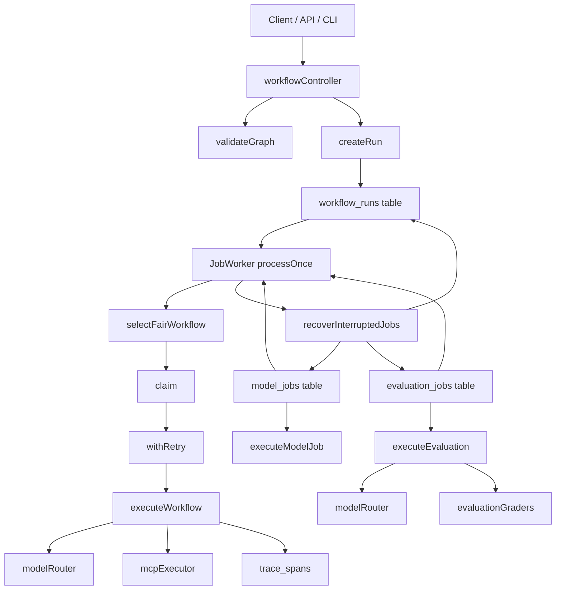

# Workflows et jobs dans GenOS

## 1. Objet et périmètre

Cette documentation décrit le moteur de workflows et les jobs applicatifs tels qu’ils sont effectivement implémentés dans le dépôt GenOS. Elle ne décrit pas un moteur d’orchestration générique ou un “pipeline orchestrator” idéal. Elle reflète le comportement réel du backend, du worker, des contrôleurs, des tables SQLite et des services de routage / évaluation.

Les composants principaux de référence sont :

- [backend/src/controllers/workflowController.js](../backend/src/controllers/workflowController.js)
- [backend/src/services/jobWorker.js](../backend/src/services/jobWorker.js)
- [backend/src/services/workflowConditions.js](../backend/src/services/workflowConditions.js)
- [backend/src/services/modelRouter.js](../backend/src/services/modelRouter.js)
- [backend/src/services/evaluationGraders.js](../backend/src/services/evaluationGraders)
- [backend/src/services/mcpExecutor.js](../backend/src/services/mcpExecutor.js)
- [backend/src/db/schema-tables-extensions.js](../backend/src/db/schema-tables-extensions.js)
- [backend/src/controllers/evalController.js](../backend/src/controllers/evalController.js)
- [backend/src/controllers/promptController.js](../backend/src/controllers/promptController.js)

Le système met en place une pile de contrôle qui couvre :

- validation de graphes de workflow ;
- exécution d’un workflow comme programme orienté graphe ;
- jobs de modèle pour génération LLM ;
- jobs d’évaluation pour benchmarking sur dataset ;
- retries, timeouts et reprise après plantage ;
- scheduling équitable entre scopes / projets ;
- états explicites `queued`, `running`, `completed`, `failed`, `cancelled` ;
- versioning de workflows et exécution sur version persistée.

---

## 2. Définition fonctionnelle

GenOS considère qu’un workflow est un graphe orienté acyclique d’étapes exécutables, où chaque nœud représente une action, un modèle, un outil ou une boucle. Une exécution de workflow n’est pas un simple job shell : c’est une instance persistée, auditée, checkpointée et réexécutable.

Un workflow a 3 dimensions de réalité :

1. la définition du graphe ;
2. la version de cette définition ;
3. la run instantanée avec input, output, status et historique de tentatives.

Cette séparation est explicite dans le code :

- `workflows` : définition logique du workflow ;
- `workflow_versions` : instantané versionné du graphe ;
- `workflow_runs` : exécution concrète d’une version donnée.

Cela donne une propriété très importante : l’exécution d’un workflow est toujours liée à une version persistée, ce qui empêche les changements de définition de contaminer une run déjà lancée.

Le système a aussi une logique de jobs séparée pour :

- les jobs `model_jobs` : prompts envoyés à un ou plusieurs modèles ;
- les jobs `evaluation_jobs` : benchmarks de qualité sur datasets ;
- les workflow runs comme exécution de graphe hiérarchique et conditionnel.

---

## 3. Architecture réelle du dépôt

### 3.1 Tables et états de persistance

Les tables de base sont définies dans [backend/src/db/schema-tables-extensions.js](../backend/src/db/schema-tables-extensions.js).

```sql
CREATE TABLE IF NOT EXISTS workflows (
  id TEXT PRIMARY KEY,
  workspace_id TEXT,
  name TEXT NOT NULL,
  description TEXT DEFAULT '',
  version INTEGER NOT NULL DEFAULT 1,
  status TEXT NOT NULL DEFAULT 'draft' CHECK (
    status IN ('draft', 'staging', 'published', 'archived')
  ),
  graph_json TEXT NOT NULL DEFAULT '{"nodes":[],"edges":[]}',
  metadata_json TEXT NOT NULL DEFAULT '{}',
  created_at DATETIME DEFAULT CURRENT_TIMESTAMP,
  updated_at DATETIME DEFAULT CURRENT_TIMESTAMP
);

CREATE TABLE IF NOT EXISTS workflow_versions (
  id TEXT PRIMARY KEY,
  workflow_id TEXT NOT NULL,
  version INTEGER NOT NULL,
  graph_json TEXT NOT NULL DEFAULT '{"nodes":[],"edges":[]}',
  metadata_json TEXT NOT NULL DEFAULT '{}',
  created_at DATETIME DEFAULT CURRENT_TIMESTAMP,
  UNIQUE(workflow_id, version)
);

CREATE TABLE IF NOT EXISTS workflow_runs (
  id TEXT PRIMARY KEY,
  workflow_id TEXT NOT NULL,
  workflow_version INTEGER NOT NULL,
  organization_id TEXT,
  project_id TEXT,
  priority INTEGER NOT NULL DEFAULT 0,
  status TEXT NOT NULL DEFAULT 'queued' CHECK (
    status IN ('queued', 'running', 'completed', 'failed', 'cancelled')
  ),
  input_json TEXT NOT NULL DEFAULT '{}',
  output_json TEXT,
  error_json TEXT,
  attempts INTEGER NOT NULL DEFAULT 0,
  max_attempts INTEGER NOT NULL DEFAULT 3,
  timeout_ms INTEGER NOT NULL DEFAULT 30000,
  claimed_at DATETIME,
  next_attempt_at DATETIME,
  created_at DATETIME DEFAULT CURRENT_TIMESTAMP,
  started_at DATETIME,
  completed_at DATETIME
);
```

Les jobs de modèle et d’évaluation ont également des tables dédiées :

```sql
CREATE TABLE IF NOT EXISTS evaluation_jobs (
  id TEXT PRIMARY KEY,
  dataset_id TEXT,
  campaign_id TEXT,
  priority INTEGER NOT NULL DEFAULT 0,
  status TEXT NOT NULL DEFAULT 'queued',
  config_json TEXT NOT NULL DEFAULT '{}',
  result_json TEXT,
  error_json TEXT,
  attempts INTEGER NOT NULL DEFAULT 0,
  max_attempts INTEGER NOT NULL DEFAULT 3,
  claimed_at DATETIME,
  next_attempt_at DATETIME,
  organization_id TEXT,
  project_id TEXT,
  created_at DATETIME DEFAULT CURRENT_TIMESTAMP,
  completed_at DATETIME
);

CREATE TABLE IF NOT EXISTS model_jobs (
  id TEXT PRIMARY KEY,
  prompt TEXT NOT NULL,
  models_json TEXT NOT NULL DEFAULT '[]',
  priority INTEGER NOT NULL DEFAULT 0,
  status TEXT NOT NULL DEFAULT 'queued',
  config_json TEXT NOT NULL DEFAULT '{}',
  attempts INTEGER NOT NULL DEFAULT 0,
  max_attempts INTEGER NOT NULL DEFAULT 3,
  timeout_ms INTEGER NOT NULL DEFAULT 30000,
  claimed_at DATETIME,
  next_attempt_at DATETIME,
  result_json TEXT,
  error_json TEXT,
  organization_id TEXT,
  project_id TEXT,
  created_at DATETIME DEFAULT CURRENT_TIMESTAMP,
  completed_at DATETIME
);
```

### 3.2 Le worker de jobs

Le cœur de l’exécution est [backend/src/services/jobWorker.js](../backend/src/services/jobWorker.js).

Il expose plusieurs fonctions-clés :

- `recoverInterruptedJobs()`
- `claim()`
- `executeWorkflow()`
- `executeEvaluation()`
- `executeModelJob()`
- `withRetry()`
- `processTable()`
- `processOnce()`
- `startJobWorker()`

Le worker tourne périodiquement, parcourt les tables `workflow_runs`, `evaluation_jobs`, `model_jobs`, et traite des jobs en file selon un ordre 
fair et un mécanisme de claim.

Le scheduling est explicitement “fair” :

```js
const ordered = [...rows].sort((left, right) => {
  const priority = Number(right.priority || 0) - Number(left.priority || 0);
  if (priority) return priority;
  return String(left.created_at || '').localeCompare(String(right.created_at || '')) ||
    String(left.id).localeCompare(String(right.id));
});
```

Ensuite, le sélecteur évite de saturer un seul scope :

```js
const lastScope = lastScopeByTable.get(table) || null;
const next = ordered.find((row) => workflowScopeKey(row) !== lastScope) || ordered[0] || null;
if (next) lastScopeByTable.set(table, workflowScopeKey(next));
```

Autrement dit, GenOS privilégie le tri par priorité puis ordre de création, avec alternance de scope pour éviter qu’un tenant ou un projet monopolise le worker.

---

## 4. Validation du graphe de workflow

La validation la plus importante se trouve dans [backend/src/controllers/workflowController.js](../backend/src/controllers/workflowController.js) : `validateGraph(graph)`.

### 4.1 Règles strictes

Le graphe est rejeté si :

- il n’est pas un objet ;
- `nodes` n’est pas un tableau ;
- `edges` n’est pas un tableau ;
- il n’y a aucun nœud ;
- un nœud a un `id` vide ou absent ;
- deux nœuds partagent le même `id` ;
- une arête pointe vers un nœud inconnu ;
- une arête pointe vers elle-même ;
- deux arêtes dupliquent exactement la même source → cible ;
- le graphe contient un cycle ;
- une condition `when` est invalide ;
- `maxIterations` est hors plage ;
- un nœud non-trigger avec aucune arête entrante est rejeté ;
- un nœud de type model a un modèle manquant.

Le graphe est aussi contrôlé par des limites de sécurité :

- `MAX_WORKFLOW_NODES = 10000`
- `MAX_WORKFLOW_DEPTH = 256`
- `MAX_PARALLEL_BRANCHES = 32`
- `MAX_WORKFLOW_DURATION_MS = 30 * 60 * 1000`

La détection des cycles est explicite :

```js
const visiting = new Set();
const visited = new Set();
const hasCycle = (id) => {
  if (visiting.has(id)) return true;
  if (visited.has(id)) return false;
  visiting.add(id);
  if ((adjacency.get(id) || []).some(hasCycle)) return true;
  visiting.delete(id); visited.add(id); return false;
};
```

### 4.2 Condition `when`

La condition de nœud est parseable dans [backend/src/services/workflowConditions.js](../backend/src/services/workflowConditions.js).

Le format accepté est très limité mais explicite :

```js
input.field === "value"
input.flag == true
```

La règle de parse est :

```js
const match = text.match(/^input\.([A-Za-z_][\w-]*)\s*===?\s*(?:"([^"]*)"|'([^']*)'|([^\s"']+))$/);
```

Cela évite une expression arbitraire de logique complexe au runtime. La sécurité du workflow dépend de statistiques de validation simples et sans injection de code dynamique.

---

## 5. États et machine de transition

Les états possibles des workflow runs et jobs sont définis dans les schémas et dans le code du worker.

### 5.1 Workflow runs

`workflow_runs.status` autorise :

- `queued`
- `running`
- `completed`
- `failed`
- `cancelled`

Le traitement d’un run suit le cycle :

1. création en `queued` ;
2. claim par le worker : `queued` → `running` ;
3. exécution : `output_json` checkpointé à intervalles ;
4. completion : `running` → `completed` ;
5. échec : `running` → `failed` ;
6. annulation : `queued` ou `running` → `cancelled`.

### 5.2 Jobs model et evaluation

Les jobs d’évaluation et de modèle suivent la même logique de machine à état, avec des tentatives :

- `attempts` est incrémenté à chaque tentative ;
- `claimed_at` est rafraîchi par heartbeat ;
- `next_attempt_at` permet de replanifier une reprise ;
- `max_attempts` borne le budget ;
- si le nombre de tentatives est épuisé, le job tombe en `failed`.

La logique de retry est dans `withRetry()` :

```js
if (attempt === max || !isRetryableJobError(error)) {
  await db.run(`UPDATE ${table} SET status = ?, error_json = ?, completed_at = CURRENT_TIMESTAMP, claimed_at = NULL, next_attempt_at = NULL WHERE id = ?`, status, ...);
} else {
  const baseDelay = Math.min(30000, 250 * (2 ** (attempt - 1)));
  const jitter = Math.floor(Math.random() * Math.max(1, Math.floor(baseDelay / 2)));
  const retryAt = new Date(Date.now() + baseDelay + jitter).toISOString();
  await db.run(`UPDATE ${table} SET status = 'queued', claimed_at = NULL, next_attempt_at = ? WHERE id = ? AND status = 'running'`, retryAt, job.id);
}
```

Cela crée une politique exponentielle de retry avec jitter pour éviter le thundering herd.

---

## 6. Processus d’exécution réel

### 6.1 Création d’un workflow

Le contrôleur [backend/src/controllers/workflowController.js](../backend/src/controllers/workflowController.js) valide au moment de la création :

- nom non vide ;
- `workspaceId` présent ;
- graphe valide ;
- payload dans les limites (`jsonByteLength`);
- conformité tenant / scope.

Ensuite, il inscrit :

- une ligne dans `workflows` avec `version = 1` ;
- une ligne dans `workflow_versions` avec le même graph.

### 6.2 Lancement d’une run

`createRun()` vérifie :

- le workflow existe ;
- il est `staging` ou `published` ;
- la version persistée est disponible ;
- le graphe de cette version est valide ;
- le `input` ne dépasse pas 512 KiB.

Puis il insère :

```sql
INSERT INTO workflow_runs (id, workflow_id, workflow_version, organization_id, project_id, priority, status, input_json, max_attempts, timeout_ms)
VALUES (?, ?, ?, ?, ?, ?, ?, ?, ?, ?)
```

Le job part en `queued`.

### 6.3 Claim + exécution

Dans `processTable()`, le worker prend les jobs non terminés :

```js
const rows = await db.all("SELECT r.*, w.organization_id, w.project_id FROM workflow_runs r JOIN workflows w ON w.id = r.workflow_id WHERE r.status = 'queued' ORDER BY r.priority DESC, r.created_at ASC");
const job = selectFairWorkflow(rows, table);
if (job && await claim(db, table, job.id)) await withRetry(db, table, job, () => executeWorkflow(db, job));
```

Les jobs sont donc toujours claimés avant exécution, ce qui évite le double traitement en cas de workers concurrents.

### 6.4 Checkpoint et reprise d’état

Pendant le run, le code écrit régulièrement `output_json` dans `workflow_runs` :

```js
await db.run('UPDATE workflow_runs SET output_json = ?, claimed_at = CURRENT_TIMESTAMP WHERE id = ? AND status = 'running'', JSON.stringify({ traceId, completedNodes: [...visited], skippedNodes: [...skipped], output }), run.id);
```

Cela permet de reprendre un workflow à partir d’un état partiellement calculé. La logique est cohérente avec un modèle de checkpointing incrémental plutôt qu’avec un simple “tout ou rien”.

### 6.5 Arrêt / annulation

Un workflow peut être annulé si son statut devient `cancelled` :

```js
if (activeRun?.status === 'cancelled') {
  const error = new Error('Workflow run was cancelled.');
  error.code = 'WORKFLOW_CANCELLED';
  throw error;
}
```

L’annulation est aussi explicitement supportée dans `cancelRun()` :

```sql
UPDATE workflow_runs
SET status = 'cancelled', error_json = ?, completed_at = CURRENT_TIMESTAMP
WHERE id = ? AND status IN ('queued', 'running')
```

---

## 7. Reprise après redémarrage et jobs “stales”

Le système contient une logique de récupération de jobs interrompus dans [backend/src/services/jobWorker.js](../backend/src/services/jobWorker.js) : `recoverInterruptedJobs()`.

Cette fonction :

- recherche les jobs dont `status = 'running'` et dont `claimed_at` est trop ancien ;
- remet les jobs en `queued` s’il reste des tentatives ;
- ou en `failed` si le budget est épuisé ;
- réinitialise `claimed_at` et `next_attempt_at` ;
- rafraîchit le statut des campagnes d’évaluation.

Le seuil est configurable :

```js
const staleMinutes = Math.max(1, Math.min(1440, Number(process.env.GENOS_STALE_JOB_MINUTES) || 15));
```

Et la remise en état est faite par :

```sql
UPDATE workflow_runs
SET status = CASE WHEN attempts + 1 < max_attempts THEN 'queued' ELSE 'failed' END,
    attempts = attempts + 1,
    error_json = COALESCE(error_json, ?),
    completed_at = CASE WHEN attempts + 1 < max_attempts THEN NULL ELSE COALESCE(completed_at, CURRENT_TIMESTAMP) END,
    claimed_at = NULL,
    next_attempt_at = NULL
WHERE status = 'running' AND (claimed_at IS NULL OR claimed_at < datetime('now', ?))
```

Autrement dit, GenOS traite les jobs “stales” comme des cas de reprise ou d’échec explicite, pas comme un état silencieux.

---

## 8. Jobs de modèle et jobs d’évaluation

### 8.1 Model jobs

Les `model_jobs` servent à déclencher un ou plusieurs appels de modèles sur un prompt donné. La logique est dans `executeModelJobBody()` dans [backend/src/services/jobWorker.js](../backend/src/services/jobWorker.js).

Le comportement réel :

- lit `models_json` et `config_json` ;
- calcule un `deadlineAt` basé sur `timeout_ms` ;
- exécute chaque modèle séquentiellement ;
- enregistre les flux de tokens dans `model_job_tokens` ;
- checkpointe les sorties intermédiaires dans `result_json` ;
- enregistre `completedModels` pour éviter les doublons.

Le `onToken` callback est utilisé pour persister les tokens et remonter les événements de streaming.

### 8.2 Evaluation jobs

Les `evaluation_jobs` sont traités par `executeEvaluation()` dans [backend/src/services/jobWorker.js](../backend/src/services/jobWorker.js).

Ils prennent comme entrée :

- un dataset ;
- des cases de test ;
- un ensemble de graders ;
- parfois un `judgeModel` pour une évaluation LLM.

Les graders connus :

- `exact_match`
- `groundedness`
- `safety`
- `llm_judge`

La logique de calcul est visible dans `evaluationGraders.js` :

- `exactMatch(actual, expected)`
- `groundedness(actual, input)`
- `safety(actual)`
- `parseJudgeResponse(...)`

Les jobs d’évaluation mettent à jour `result_json` avec :

- `total`
- `passed`
- `failed`
- `score`
- `graders`
- `cases`

La campagne associée est mise à jour dans `updateCampaignStatus()` :

```js
const status = jobs.some((job) => job.status === 'failed')
  ? 'failed'
  : jobs.every((job) => job.status === 'cancelled')
    ? 'cancelled'
    : jobs.every((job) => job.status === 'completed')
      ? 'completed'
      : 'running';
```

Cela crée un état de campagne cohérent à partir de l’ensemble des jobs d’évaluation.

---

## 9. Mathématiques de l’orchestration

### 9.1 Ordonnancement fair

Le worker choisit le prochain job à exécuter selon un score de priorité puis par ordre de création :

$$
score(job) = (priority, createdAt)
$$

avec une règle de type :

$$
priority 	ext{ d’abord}, \
createdAt 	ext{ ensuite}
$$

puis une alternance de scope :

$$
next = 	ext{first row with scope} 
eq lastScope \
	ext{otherwise first row}
$$

Cela évite le phénomène classique de starvation d’un tenant ou d’un projet.

### 9.2 Retry backoff

Le retry est exponentiel avec jitter :

$$
D_n = \min(30s, 250 \cdot 2^{n-1}) + J_n
$$

avec $J_n$ un bruit aléatoire borné. Cela réduit les collisions de réessai entre workers en cas d’incident réseau ou de rate limiting.

### 9.3 Délais de workflow

Les workflows sont bornés par temps :

$$
deadline = start + \min(requestedDuration, MAX\_WORKFLOW\_DURATION\_MS)
$$

et la validation de `executeWorkflow()` déclenche une erreur si :

$$
Date.now() > workflowDeadline
$$

Le but est de prévenir un exécuteur qui s’enliserait dans une boucle ou un blocage de nœuds.

### 9.4 Graphe et invariants

Un workflow valide doit satisfaire :

- nœuds uniques : $|ids| = |nodes|$
- arêtes valides : $source,target \in nodes$
- acyclicité : le graphe ne contient pas de boucle
- non-trigger nodes : si non source d’entrée, elles doivent avoir un parent
- conditions valides : `when` est parseable

L’espace de validation est donc un ensemble de contraintes de graphe, pas uniquement une liste de tâches à exécuter.

---

## 10. Biologie du moteur de workflows

GenOS décrit les workflows comme un système de coordination cellulaire, où chaque nœud est une cellule ou un organite d’exécution.

### 10.1 Le nœud comme cellule d’action

Chaque nœud est une unité de décision ou d’exécution :

- modèle LLM ;
- action d’outil MCP ;
- branche parallèle ;
- boucle de répétition ;
- étape de condition.

Le travail d’un workflow ressemble à une dynamique d’organes spécialisés : chaque cellule n’a pas besoin de tout savoir sur la totalité du système, elle applique une fonction locale et publie un résultat.

### 10.2 Le graphe comme tissu du système

Les arêtes représentent les relations de dépendance et de transmission d’état. Le graphe contient donc :

- flux de données ;
- flux de contrôle ;
- points de branchement ;
- points de contrôle / checkpoint.

### 10.3 Le job comme organisme de travail

Un job de modèle ou d’évaluation est comparable à un organisme ayant :

- un but (prompt ou benchmark),
- un budget de tentatives,
- un temps de vie limité,
- une capacité à se rétablir après interruption,
- une trace de sortie pour pouvoir être auditée.

La reprise après crash est donc biologiquement cohérente avec la résilience d’un système vivant : le système tente de restaurer la fonction sans perdre le contexte de travail.

---

## 11. Cas d’utilisation concrets

Le système tel que codé sert à plusieurs scénarios utiles :

### 11.1 Workflow de génération assistée

- un pipeline démarre avec un nœud de trigger ;
- un nœud LLM produit une réponse ;
- un nœud tool exécute une action sur l’environnement ;
- un nœud parallèle branche le traitement ;
- la sortie est enregistrée dans `output_json` pour reprise.

### 11.2 Évaluation de réponses

- un `evaluation_job` lit un dataset ;
- chaque case est évaluée par exact match, groundedness, safety et éventuellement LLM judge ;
- le score final est calculé par batch ;
- la campagne est mise à jour sur base des résultats partiels.

### 11.3 Prompt benchmark multi-modèles

- un `model_job` contient plusieurs modèles ;
- chaque modèle reçoit le même prompt ;
- les sorties sont comparées ;
- les tokens sont stockés et mesurés ;
- la meilleure sortie est conservée dans le résultat du job.

### 11.4 Reprise de pipeline après failover

- un worker meurt après claim générique ;
- le job reste `running` avec un `claimed_at` ancien ;
- `recoverInterruptedJobs()` le remet en `queued` ou en `failed` ;
- le worker suivant reprend l’exécution.

---

## 12. Exemple de workflow

Voici un exemple cohérent avec le format attendu par le moteur :

```json
{
  "nodes": [
    { "id": "trigger", "type": "input" },
    { "id": "draft", "kind": "llm", "model": "gpt-4o-mini", "prompt": "Rédige un plan d'action." },
    { "id": "validate", "kind": "tool", "tool": "genos_inspect", "args": { "path": "/tmp" } },
    { "id": "loop", "kind": "loop", "max_iterations": 3 },
    { "id": "finalize", "kind": "llm", "model": "gpt-4o", "prompt": "Résumé final." }
  ],
  "edges": [
    { "source": "trigger", "target": "draft" },
    { "source": "draft", "target": "validate" },
    { "source": "validate", "target": "loop" },
    { "source": "loop", "target": "finalize" }
  ]
}
```

Le comportement réel du moteur est alors :

1. le workflow est validé ;
2. une `workflow_run` est créée avec `status = 'queued'` ;
3. le worker passe la run en `running` ;
4. `draft` exécute le model routing ;
5. `validate` exécute un outil MCP ;
6. `loop` répète jusqu’à `max_iterations` ;
7. la run se termine en `completed` ou `failed`.

---

## 13. Schéma d’architecture



Ce schéma reflète la réalité du dépôt : un service de planification, un worker de exécution, des jobs spécialisés et un système de checkpoint/recovery.

---

## 14. Comparaison avec le marché

### 14.1 Airflow

Airflow est orienté data pipelines, avec DAG et scheduling de tâches sur un système de planification plus large. GenOS est plus proche d’un moteur d’exécution agentique : il intègre directement le routing de modèles, les outils MCP, la validation de graphes, la persistance de runs et la reprise de jobs.

Différence clé :

- Airflow met l’accent sur l’orchestration de jobs data ;
- GenOS met l’accent sur l’exécution agentique et la sécurité de l’état.

### 14.2 Temporal

Temporal est très fort sur le workflow durable en code et la reprise d’activité. GenOS a une logique de `workflow_runs` + `claimed_at` + `next_attempt_at` + `recoverInterruptedJobs()` similaire en philosophie, mais avec un modèle plus “stateful runtime” : validation de graphes, checkpoint JSON, exécution de nœuds avec conditions et outils.

### 14.3 Prefect

Prefect met l’accent sur la gestion de flux, l’observabilité et le rerun. GenOS a un mécanisme de persistance de `output_json` et d’Etat par nœud très proche du “stateful flow execution”, mais il est plus ancré dans le monde agentique et LLM que dans le monde data engineering classique.

### 14.4 GitHub Actions / CI

GitHub Actions est très puissant pour les run de CI, mais son point de vue est surtout de la chaîne de tâches d’intégration. GenOS n’est pas seulement un CI runner : le système admet des nœuds de modèle, des jobs de benchmark, des scores, des données de contexte et des “runs” d’agent.

### 14.5 Ce qui est spécifique à GenOS

GenOS se distingue par :

- une validation de graphe structurale stricte avant exécution ;
- des limites de sécurité sur profondeur, nœuds et branches ;
- des workflows versionnés et persistés ;
- des runs avec checkpoint et reprise ;
- des jobs de modèle et d’évaluation intégrés au même moteur ;
- une logique de “fair scheduling” entre scopes et projets ;
- une résilience qui ne laisse pas un worker mort dans un état ambigu.

---

## 15. Points de robustesse et limites

### 15.1 Ce que le dépôt fait bien

- validation rapide et pré-exécution ;
- versioning explicite ;
- sauvegarde de l’état dans SQLite ;
- retries contrôlées ;
- possibilité de relancer ou de reprendre la run ;
- clear separation entre définition et instance d’exécution.

### 15.2 Limites observées

Le système est solide, mais a des limites structurelles :

- les conditions `when` ne supportent qu’un format minimal simple ;
- la validation de graphes est structurée mais assez strictement “générique” ;
- la logique de retry est utile mais ne couvre pas tous les cas d’idempotence ;
- les jobs sont centralisés dans un worker partagé, ce qui peut devenir un point de contention.

C’est toutefois cohérent avec le design actuel : le moteur est un moteur de contrôle fiable, plus qu’un orchestrateur polyvalent de type “infinite workflow DSL”.

---

## 16. Conclusion

GenOS construit ses workflows comme un système de coordination fiable, durable et versionné, plus proche d’un runtime de contrôle qu’un simple scheduler de tâches.

Les principes de conception visibles dans le code sont simples et puissants :

- valider avant exécuter ;
- persister la définition et la run ;
- scheduler de manière équitable ;
- détecter les états “stales” ;
- permettre le retry et la reprise ;
- séparer les workflows, les model jobs et les evaluation jobs ;
- instrumenter les étapes avec trace et checkpoint.

Le résultat est un moteur d’exécution qui supporte à la fois le “flow orchestration” classique et une logique d’agentique / model routing avec surveillance, reprise et auditabilité.
