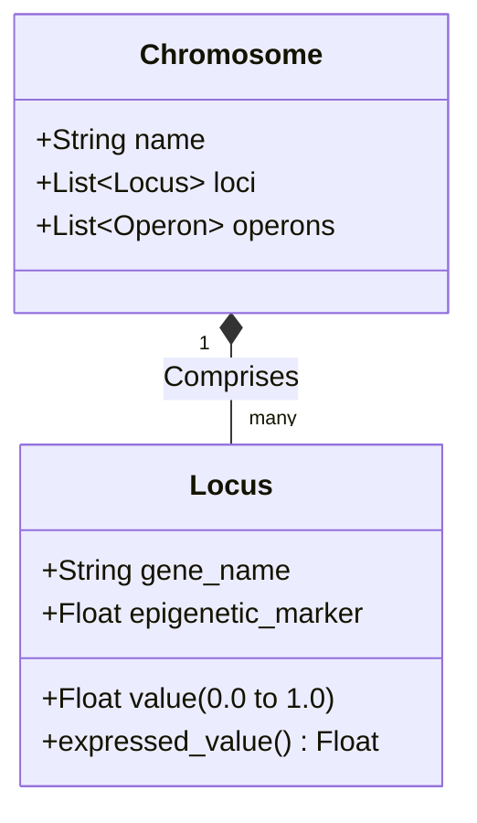

# 1. Fundamental Genetics

This document elucidates the core principles of fundamental genetics embedded within the GenOS architecture, illustrating their utility and demonstrating how they confer a decisive advantage over classical Artificial Intelligence approaches. For a deeper understanding of how these traits are altered over time, refer to [Mutation](02_mutation.md).

---

## 1.1 Genome / Genotype / Phenotype

### Architectural Significance
Within the GenOS framework, an agent is far more than a mere conversational prompt or a static Python script. Every agent possesses an inherited foundation—its **genome or genotype**—which meticulously defines its intrinsic identity, cognitive drives (e.g., curiosity, caution, syntax strictness), and behavioral policies governing memory access and tool utilization. The **phenotype** represents the expression of this underlying genome when confronted with a specific environment, task, or context.

This architecture enforces a **strict decoupling of an agent's runtime state from its fundamental identity**. Consequently, an agent can be seamlessly snapshotted, forked, or replayed with absolute determinism. This ensures total reproducibility and traceability, guaranteeing that no behavioral drift or modification occurs without a formally recorded genetic mutation.

### Conceptual Schema
```mermaid
flowchart TD
    G[Genotype / Genome\n(Cognitive Drives, Policies, Digital DNA)] -->|Expression| P[Phenotype\n(Observed Agent Behavior)]
    E[Environment\n(Task, Context, System Constraints)] -->|Influence| P
    P -->|Results / Actions Executed| R[Performance / Survivability]
    
    subgraph GenOS Core
    G
    P
    end
```

### Strategic Use Cases
- **Temporal Debugging and Auditability**: In the event a critical agent makes an erroneous decision, operators can replay the exact genetic capsule (identical genome operating within an identical environment) to conduct a precise root-cause analysis.
- **Learning Containment and Control**: Prevents agents from drifting silently due to catastrophic forgetting or context window corruption. Any adaptation must be formally synthesized into the genome via controlled mutagenesis (see [Evolution & Selection](04_evolution_selection.md)).

### Comparative Advantage
- **Conventional AI Agents**: State and identity are inherently entangled within a monolithic conversational context (prompt plus chat history). As the context window expands, the agent invariably loses its core identity and instructions. There is no traceable "source code" for personality or cognitive bounds.
- **GenOS Architecture**: Treats each agent as a distinct organism governed by immutable runtime DNA, providing enterprise-grade guarantees of security and auditability in compliance with architectural standards (e.g., ADR-0008).

### Empirical Comparison: Complex Task Execution (e.g., Critical Component Refactoring)
| Agent Topology | Execution Behavior | Expected Outcome |
|---|---|---|
| **Simple Agent (Raw LLM)** | Attempts monolithic execution based on a single upfront prompt. | Frequently hallucinates constraints, ultimately generating non-functional code. |
| **Expert Agent (Engineered Prompt)** | Adheres to detailed step-by-step instructions. | May succeed initially, but lacks temporal consistency. Repeating the task later yields varied results. |
| **GenOS Worker** | Loads a specialized genome (e.g., "Cautious Code Reviewer"). Its phenotype strictly expresses low risk tolerance. | Refuses unverified modifications. Behavior is 100% reproducible upon reloading the genomic capsule. |
| **GenOS Orchestrator** | Evaluates the genetic signatures of available workers and dispatches the genome best suited for the task constraints. | Task execution becomes highly predictable, industrialized, and scalable. |

---

## 1.2 Gene / Locus / Chromosome

### Architectural Significance
The digital DNA of GenOS is hierarchically structured. A **Chromosome** aggregates logical functional units, composed of individual **Loci** (singular: locus). Each locus harbors a specific gene defined by a nomenclature, a continuous floating-point value (ranging from 0.0 to 1.0), and an epigenetic marker.

This granular structure enables the **precise quantification** of an agent's cognitive traits. Rather than relying on subjective and volatile textual prompts like "Be highly creative," GenOS mathematically calibrates a locus: `exploration_drive = 0.85`.

### Conceptual Schema


### Strategic Use Cases
- **Continuous Fine-Tuning**: Allows for mathematical adjustments to an agent's behavior (e.g., decrementing `risk_tolerance` by 0.1) instead of polluting the system prompt with ambiguous natural language qualifiers.
- **Controlled Diversity (Swarm Mechanics)**: Facilitates the generation of agent swarms featuring minute variances across specific loci, guaranteeing exhaustive exploration of the solution space for highly complex problems.

### Comparative Advantage
- **Conventional AI Agents**: Personality and capabilities are entirely text-dependent. Modifying an agent requires unpredictable prompt engineering.
- **GenOS Architecture**: Employs a vector-based, quantitative (haploid) modeling of cognitive traits. This unlocks the ability to perform complex mathematical operations on agent identities, such as calculating genetic distances or averaging traits.

### Empirical Comparison: Balancing Creativity vs. Rigor
| Agent Topology | Configuration Method | Underlying Mechanics |
|---|---|---|
| **Simple Agent** | Prompt instruction: "Be creative." | The LLM frequently hallucinates or deviates from the primary objective. |
| **Expert Agent** | Global API parameter adjustment (e.g., `temperature`). | Affects all generated tokens uniformly, drastically reducing overall logical coherence and rigor. |
| **GenOS Worker** | Locus `exploration_drive = 0.8` ; Locus `syntax_strictness = 0.9`. | The agent aggressively seeks novel solutions while maintaining immaculate code structure, as internal drives dynamically modulate underlying prompts and tool policies. |
| **GenOS Orchestrator** | Computes genetic distances across available Loci. | Actively avoids assigning genetically identical agents to intractable problems, preferring to introduce a genetically distant agent to provide a "fresh perspective." |

---

## 1.3 Gene Expression and Epigenetics

### Architectural Significance
In biological systems, merely possessing a gene is insufficient; it must be expressed. In GenOS, **Gene Expression** (the concrete value utilized during inference and action selection) is the dynamic resultant of the baseline genetic value modulated by real-time environmental factors and experiential stress (epigenetic markers).

This mechanism grants the agent **organic plasticity, enabling adaptation without permanently altering its underlying source code**.

### Conceptual Schema
```mermaid
flowchart LR
    V[Baseline Gene Value\n(e.g., 0.50)] --> Calc(Expression Calculation Engine)
    M[Epigenetic Marker\n(Recent Stress, Error Rates)] --> Calc
    Calc --> E[Expressed Value\n(e.g., 0.75)]
    E --> Action[Resulting Agent Behavior]
```

### Strategic Use Cases
- **Stress-Induced Adaptation**: If an agent experiences repeated algorithmic failures, an epigenetic marker dynamically shifts the expression of its "caution" gene, instantly making the agent highly conservative without requiring a permanent mutation.
- **Digital Immunity and Infection Susceptibility**: Gene expression continuously calculates an agent's vulnerability to "viral" prompt injections. If the expressed value of the critical analysis gene drops, the agent becomes temporarily more susceptible to manipulation.

### Comparative Advantage
- **Conventional AI Agents**: The agent is entirely static. When faced with repetitive failure, a classical script typically enters an infinite loop or crashes outright.
- **GenOS Architecture**: The agent possesses intrinsic neuroplasticity. Its gene expression fluctuates in real-time (via `Locus::expressed_value()`), enabling organic, resilient responses to unforeseen runtime difficulties.

### Empirical Comparison: Encountering a Deprecated API (404 Errors)
| Agent Topology | Initial Failure | Repeated Failure (Attempt 3) | Final Resolution |
|---|---|---|---|
| **Simple Agent** | Attempts API call. | Blindly repeats identical request. | Unhandled Exception / System Timeout. |
| **Expert Agent** | Attempts API call. | External watchdog script counts failures and terminates execution. | Hard crash requiring manual human intervention. |
| **GenOS Worker** | Attempts API call (Perseverance gene expressed at 0.80). | Rising stress alters epigenetic markers. Perseverance expression plummets to 0.20, Exploration spikes to 0.90. | Agent autonomously abandons the deprecated API and shifts strategy to search for alternative libraries or web documentation. |
| **GenOS Orchestrator** | Monitors real-time epigenetic shifts in the Worker. | Deduces task gridlock from expression telemetry. | Isolates the current Worker and deploys a specialized agent with a peak "Infrastructure Investigation" locus to resolve the dependency. |
