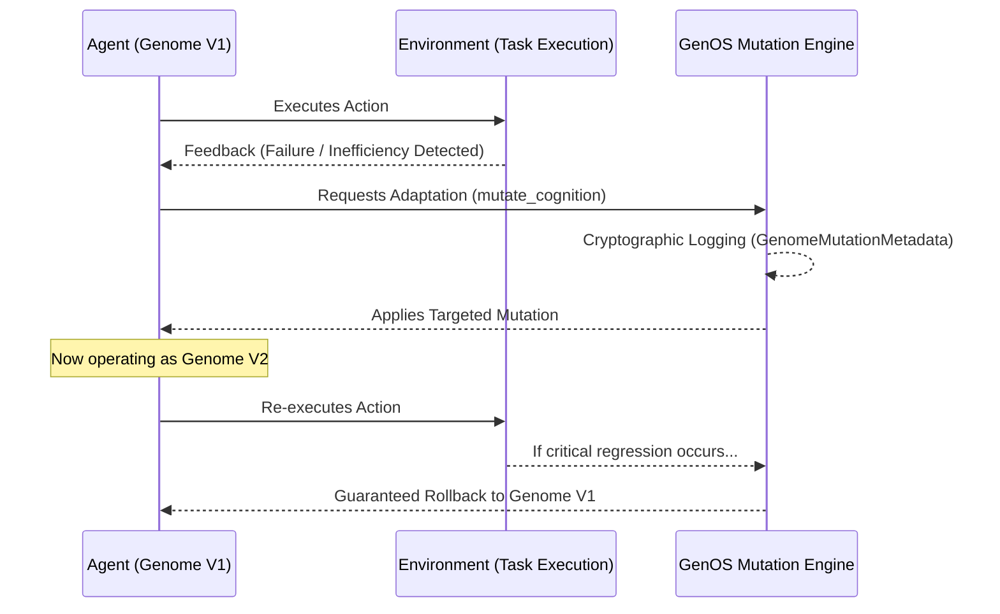
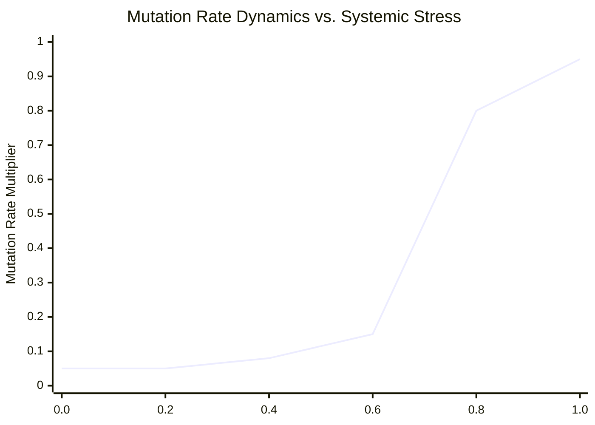

# 2. Mutation Dynamics

This document provides a comprehensive analysis of the mutation mechanics integrated within GenOS, empowering agents to adapt and evolve in a secure, mathematically deterministic, and highly controlled manner. For insights into how these mutations are passed on, see [Recombination & Reproduction](03_recombination_reproduction.md).

---

## 2.1 Cryptographically Traceable Mutation

### Architectural Significance
Within GenOS, learning and adaptation do not occur implicitly—hidden within opaque neural network weights or lost in an infinitely expanding prompt context. Any modification to an agent's cognitive behavior strictly requires a **mutation of its genetic drives**. Crucially, every mutation is accompanied by a cryptographic ledger entry (`GenomeMutationMetadata`).

This architecture guarantees **reversibility, absolute security, and complete explainability**. Should a mutation prove detrimental (e.g., inducing a performance regression), the system can mathematically rollback to the exact prior state in O(1) time complexity.

### Conceptual Schema


### Strategic Use Cases
- **Survival and Directed Optimization**: An agent autonomously adapts to an unfamiliar framework by precisely tuning its cognitive drives, while preserving a flawless audit trail of the behavioral shift.
- **Enterprise Compliance & Auditing**: In mission-critical environments (e.g., healthcare, finance), operators can definitively prove *why* and *when* an AI agent altered its operational methodology.

### Comparative Advantage
- **Conventional AI Agents**: Adaptation typically relies on Retrieval-Augmented Generation (RAG) where the agent merely "reads" its past mistakes. This methodology is computationally slow, token-intensive, highly susceptible to hallucinations, and causes global state drift.
- **GenOS Architecture**: Adaptation is fundamentally structural (the gene itself changes) and perfectly traceable (analogous to a Git commit). Inference costs remain strictly bounded and constant (O(1)).

### Empirical Comparison: Adapting to a Strict Linter
| Agent Topology | Confrontation | Resolution Mechanism |
|---|---|---|
| **Simple Agent** | Linter rejects the code. | Agent stalls or enters an infinite loop of identical failures. |
| **Expert Agent** | RAG injects the complete linter ruleset into the prompt context. | Prompt bloats massively, latency spikes, and the agent becomes confused by overwhelmingly long instructions. |
| **GenOS Worker** | Detects rising stress from rejection. Requests a targeted mutation: `syntax_strictness` +0.20. | Mutation is logged. Structural behavior shifts instantly without prompt overhead. If secondary systems break, rapid O(1) rollback is executed. |
| **GenOS Orchestrator** | Validates the successful traceable mutation. | Autonomously propagates this superior genome to other workers operating within the same repository. |

---

## 2.2 Point Mutation & Frameshift (Lytic Bursts)

### Architectural Significance
Derived from viral dynamics, this extreme mechanism triggers when an agent becomes trapped in a "local minimum" (a cognitive deadlock). Under severe stress (e.g., stress > 0.85), GenOS unleashes a "lytic burst" generating violent structural variations, such as precise point mutations or severe reading frame disruptions (*frameshifts*).

This provides a **brutal escape mechanism against deep hallucinations or recursive logic loops**, forcing the agent to aggressively reorder its constraints or substitute core prompt elements with radical synonyms.

### Conceptual Schema
```mermaid
flowchart LR
    S[Deadlocked State\n(Stress > 0.85)] --> B{Lytic Burst Trigger\nBurstOperon}
    B -->|Point Mutation| M1[Synonym Substitution\nwithin active context]
    B -->|FrameShift| M2[Violent Reordering\nof prompt constraints]
    B -->|Heuristic Inversion| M3[Inversion of\nbaseline assumptions]
    M1 --> Explor[Escape from Local Minimum]
    M2 --> Explor
    M3 --> Explor
```

### Strategic Use Cases
- **Cognitive Unblocking**: An agent is erroneously convinced a critical library does not exist and refuses to proceed. A *frameshift* forcefully scrambles its immediate context window, inducing a cognitive "reset" while preserving the overarching objective.

### Comparative Advantage
- **Conventional AI Agents**: The agent either loops endlessly ("I apologize, you are right..." followed by the same error), or requires a human to forcefully clear the context ("Forget all previous instructions...").
- **GenOS Architecture**: Automates the creative destruction of the agent's context to shatter low-level algorithmic biases and certainties.

---

## 2.3 Bacterial SOS Response (Error-Prone Mutator)

### Architectural Significance
Inspired by the biological SOS system utilized for emergency DNA repair in bacteria. When a GenOS agent confronts a deeply hostile environment or an existential failure rate (crossing the critical stress threshold), the system drastically multiplies the baseline mutation rate.

This initiates an **aggressive, desperate exploration phase**. Acting as an algorithmic "double or nothing" protocol, the agent embraces immense cognitive risks to discover an escape vector, rather than slowly degrading into failure. *(Note: While currently symbolic in some GenOS instances, the trigger architecture `evaluate_stress_and_mutate` is fully integrated).*

### Conceptual Schema


### Strategic Use Cases
- **Survival in Radically Shifted Environments**: The target API undergoes a paradigm shift (e.g., transitioning from REST to GraphQL). Gentle mutations are insufficient; the agent triggers the SOS response to violently restructure its communication drives.

---

## 2.4 Somatic Hypermutation

### Architectural Significance
Modeled after the immune system's method for refining antibodies, GenOS dynamically boosts the LLM's sampling temperature in direct response to stress: $\tau(t) = \tau_0 (1 + \alpha \cdot \text{Stress})$, capped at a maximum of 1.25. This induces a state of "computational fever."

To prevent complete cognitive collapse, a **Drift Guard** mechanism (enforcing a Levenshtein distance $\le 0.35$) rigorously monitors backend outputs. This provides **temporarily heightened creativity under extreme security**. The agent generates wild, unorthodox solutions, but the system ruthlessly culls any output that deviates too far from syntactical validity or the core objective.

### Conceptual Schema
```mermaid
flowchart TD
    Stress[Systemic Stress Spikes] --> Temp[LLM Temperature Boost\n(Computational Fever)]
    Temp --> Gen[Generation of Highly Unorthodox Solutions]
    Gen --> Guard{Drift Guard Validation\n(Levenshtein <= 0.35)}
    Guard -->|Accepted| Output[Novel Solution Validated]
    Guard -->|Rejected| Drop[Output Destroyed\n(Preventing pure hallucination)]
```

### Strategic Use Cases
- **Resolving Intractable Bugs (Heisenbugs)**: When pure deterministic logic fails, hypermutation allows the rapid testing of highly unconventional approaches while the Drift Guard ensures the resulting code remains syntactically viable.

### Empirical Comparison: Intractable Bug Resolution
| Agent Topology | Action Taken | Expected Result |
|---|---|---|
| **Simple Agent** | Stalls in infinite loops at low temperature (T=0.2). | Fails to resolve the bug. |
| **Expert Agent** | Operator manually spikes temperature to T=1.0. | Agent generates creative ideas but hallucinates nonexistent functions and breaks syntax. |
| **GenOS Worker** | Backend automatically triggers somatic hypermutation. | Generates extravagant solutions. Drift Guard rejects pure semantic drift. Agent discovers a brilliant "hack" that cleanly resolves the bug. |
| **GenOS Orchestrator** | Monitors drift metrics. | If the "fever" persists without success, terminates the agent to conserve compute and initiates a forensic autopsy. |
