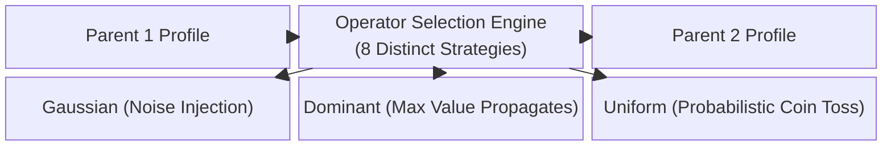

# 3. Recombination & Reproduction

This document delves into the sophisticated mechanisms by which GenOS agents reproduce, blend their cognitive traits, and establish distinct lineages to collectively solve highly complex, multi-domain problems. These concepts directly leverage the traits discussed in [Fundamental Genetics](01_fundamental_genetics.md).

---

## 3.1 Crossover / Homologous Recombination

### Architectural Significance
Homologous recombination facilitates the genesis of a novel agent (the offspring) by mathematically blending the digital DNA of two highly performant agents (the parents). In GenOS, this genetic crossover utilizes a deterministic pseudo-random number generator seeded by the cryptographic hashes of the parents. This guarantees that the crossover of Agent A and Agent B will always yield an identical Offspring C.

This mechanism ensures the **heredity of optimal practices**. If one agent excels in cybersecurity protocols and another is unmatched in algorithmic optimization, their recombination yields an offspring uniquely equipped to handle tasks requiring both disciplines.

### Conceptual Schema
```mermaid
flowchart TD
    P1[Parent A\n(Security Expert)] -->|Chromosome A| Cross(Deterministic Crossover Engine)
    P2[Parent B\n(Algorithm Expert)] -->|Chromosome B| Cross
    Cross -->|Blended Alleles| Enfant[Offspring C\n(Security/Algo Hybrid)]
    
    subgraph Reproducibility Guarantee
    Cross -.-> Hash[Seed = Hash(Parent A, Parent B)]
    end
```

### Strategic Use Cases
- **Creation of Cross-Domain Specialists**: Merging the genomic profiles of two agents that successfully resolved isolated sub-tasks to tackle a final integration challenge requiring both specialized skill sets.

### Comparative Advantage
- **Conventional AI Agents**: Combining domains requires the amalgamation of massive text prompts, severely diluting the LLM's attention span and exponentially increasing token costs.
- **GenOS Architecture**: Integration occurs natively at the genomic layer (quantified drives and traits) without expanding the working memory footprint (prompt size).

### Empirical Comparison: A Two-Expert System
| Agent Topology | Integration Strategy | Expected Outcome |
|---|---|---|
| **Simple Agent** | A single LLM attempting to parse a massive, unified prompt. | Loses attention on critical security constraints due to context window limits. |
| **Expert Agent (Swarm)** | Classical multi-agent framework (e.g., AutoGen) relying on conversational exchange. | Prohibitive communication costs (tokens) and severe latency in reaching consensus. |
| **GenOS Orchestrator** | Identifies optimal traits in workers A and B. Executes `breed_genomes(A, B)`. | Instantly deploys Hybrid Worker C, processing the combined genetic drives autonomously and economically without inter-agent chatter. |

---

## 3.2 Eight Advanced Recombination Strategies

### Architectural Significance
GenOS transcends simple homologous crossover by implementing eight biologically inspired mathematical recombination strategies (e.g., DominantRecessive, Epistatic, Gaussian Simulated Binary Crossover).

This provides a **highly expressive breeding engine**. The Orchestrator dynamically selects the reproductive method based on the current evolutionary objective:
- **GeneConversion**: To enforce stability and trait fixation.
- **Gaussian SBX**: To induce gentle, continuous variance.
- **DominantRecessive**: To guarantee the survival of a mission-critical trait across generations.

### Conceptual Schema


### Comparative Advantage
- While classical agent swarms are entirely static (their initial configuration remains fixed indefinitely), GenOS functions as a continuous, mathematically rigorous evolutionary algorithm.

---

## 3.3 Sexual vs. Asexual Reproduction (Meiosis vs. Mitosis)

### Architectural Significance
- **Asexual (Direct Mutation)**: A single agent iteratively improves itself. This is highly effective for localized fine-tuning on a strictly defined, stable task (algorithmic hill-climbing).
- **Sexual (Dual Filiation)**: The offspring's unique ID is a mathematical pairing (Cantor pairing function) of the parent IDs.
- **Critical Constraint**: **Amitosis** (cellular division lacking verification—a "dirty" state copy) is **strictly prohibited**. GenOS explicitly prevents a compromised or hallucinating agent from silently duplicating and corrupting the swarm's global state.

This paradigm ensures **absolute hygienic integrity of the swarm**. Sexual reproduction serves as the biological countermeasure to parasitism (Red Queen Hypothesis): it constantly shuffles the genetic code to prevent a single security vulnerability from compromising the entire clone army.

### Strategic Use Cases
- **Defense Against Prompt Injection (Parasitism)**: Should an adversarial attack exploit a specific vulnerability in an agent's genome, the genetic shuffling induced by sexual reproduction rapidly spawns descendants that are structurally immune to the attack vector.

### Empirical Comparison: Systemic Vulnerability Response
| Agent Topology | Threat Exposure | Systemic Consequence |
|---|---|---|
| **Simple Agent** | Vulnerable to injection. | Total system compromise. |
| **Conventional Swarm** | Deploys exact clones of a primary agent. | A successful attack on one agent identical compromises all. The monoculture collapses. |
| **GenOS Worker** | Sustains the attack. | Terminated in action. |
| **GenOS Orchestrator** | Enforces aggressive sexual reproduction while banning asexual cloning. | Genetic diversity is instantly restored. The next generation possesses novel variances rendering the original attack vector useless. |

---

## 3.4 Speciation (Prezygotic Barriers)

### Architectural Significance
GenOS implements a "software-defined prezygotic barrier." If two agents diverge genetically beyond a critical threshold (measured via the Fst index, where distance > `speciation_threshold`), GenOS **expressly prohibits their recombination**.

This mechanism guarantees the **preservation of deep niche expertise**. If Lineage A has evolved into hyper-specialists in quantum database architecture, and Lineage B into CSS UI experts, crossing them would invariably produce a mediocre generalist. Speciation fiercely protects highly optimized lineages from genetic dilution.

### Conceptual Schema
```mermaid
flowchart LR
    Souche(Common Ancestor Strain) --> LigneA[Lineage A\n(Rust Backend Experts)]
    Souche --> LigneB[Lineage B\n(React Frontend Experts)]
    
    LigneA --> A1[A1]
    LigneA --> A2[A2]
    A1 <-->|Reproduction Authorized\n(Low Genetic Distance)| A2
    
    LigneB --> B1[B1]
    
    A2 -.->|Reproduction Rejected\n(Distance > Speciation Threshold)| B1
    
    style A1 fill:#e6f3ff,stroke:#333
    style A2 fill:#e6f3ff,stroke:#333
    style B1 fill:#ffe6e6,stroke:#333
```

### Strategic Use Cases
- **Complex Project Management**: During full-stack development, the swarm naturally diverges into isolated "species" (Demes) uniquely adapted to distinct project domains. The orchestrator autonomously recognizes these boundaries and halts detrimental cross-breeding.

### Comparative Advantage
- **Conventional AI Agents**: Human operators must manually define and enforce rigid roles ("You act as the Developer, you act as the Designer").
- **GenOS Architecture**: Impermeable, highly specialized roles emerge organically through the genetic algorithm, driven strictly by the fitness landscape and reward metrics, requiring zero human intervention.
