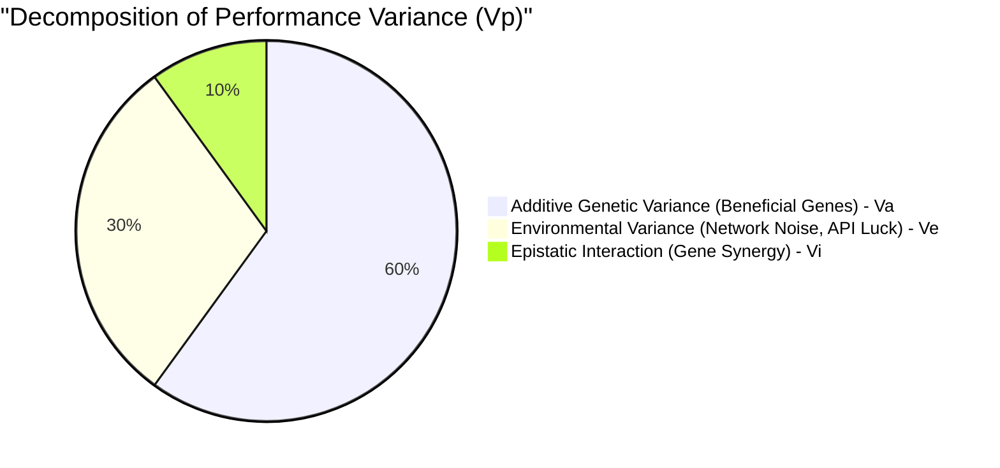

# 5. Quantitative Genetics

Quantitative genetics studies how multiple genes interact to jointly influence a complex, measurable trait. GenOS leverages these mathematical frameworks to scientifically determine *why* specific agents outperform their peers, removing the "black box" nature of typical AI operations.

---

## 5.1 QTL (Quantitative Trait Loci) and GBLUP

### Architectural Significance
When a GenOS agent demonstrates exceptional performance, the orchestrator executes a causal mapping protocol (`map_qtl`) to identify the strict statistical correlations between the agent's internal genetic configuration (Loci) and its outward performance metrics (Traits). The algorithm meticulously decomposes the total phenotypic variance ($V_p = V_a + V_d + V_i + V_e$).

This delivers **absolute explainability and directed swarm breeding**. Rather than relying on random mutations, GenOS mathematically identifies which specific genetic traits (e.g., `logic_strictness` or `creativity`) are causally responsible for success in a given task space.

### Conceptual Schema

### Comparative Advantage
- **Conventional AI Agents**: LLMs operate as a "black box." When a specific prompt engineering attempt yields better results, operators cannot mathematically prove *why* the output improved.
- **GenOS Architecture**: Operates as a "Glass Box" via a pseudo-GBLUP (Genomic Best Linear Unbiased Prediction) implementation. The system continuously introspects, isolating the exact genomic root causes of its own intelligence and operational success.

---

## 5.2 Heritability ($h^2$, $H^2$)

### Architectural Significance
Heritability ($h^2$) quantifies the precise fraction of an agent's performance that is exclusively attributable to its immutable DNA, filtering out environmental noise or pure algorithmic luck. GenOS strictly demands the generation of descendant cohorts to statistically prove that a trait is truly heritable before integrating it globally.

This establishes the **scientific robustness of the evolutionary pipeline**. If an agent succeeds purely by chance (e.g., the target server responded instantaneously, masking inefficient code), its calculated $h^2$ will be critically low. The orchestrator will decisively refuse to clone this agent, knowing its success is not encoded "in its genes."

### Empirical Comparison: Evaluating Agent Breakthroughs
| Agent Topology | Analysis of an Exceptional Success | Systemic Consequence |
|---|---|---|
| **Simple Agent** | Executes a highly complex task perfectly on the first attempt. | Human operator assumes the prompt is flawless, only to face cascading failures on subsequent runs due to unmapped environmental luck. |
| **GenOS Worker** | Executes the task perfectly. GenOS immediately calculates heritability by cloning the worker and running rigorous control tests. | System discovers the success was heavily reliant on environmental factors (High $V_e$). A false positive is avoided. |
| **GenOS Orchestrator** | Identifies a powerful Quantitative Trait Locus (High $V_a$) directly linked to the `code_linter_strictness` gene. | Autonomously maximizes this specific gene expression for all future agents assigned to that codebase, permanently locking in the performance gain. |

---
**See Also:**
- [Fundamental Genetics](01_fundamental_genetics.md)
- [Evolution & Selection](04_evolution_selection.md)
