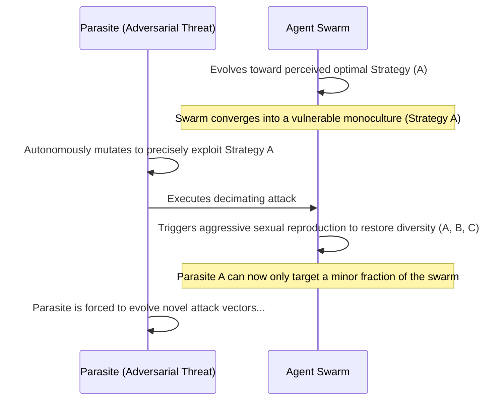

# 7. Coevolution

Coevolution represents one of the most advanced and formidable architectures within GenOS. It provides the core biological justification for continuous agent evolution and obligatory sexual reproduction in the face of adversarial threats.

---

## 7.1 The Red Queen Hypothesis and Systemic Parasitism

### Architectural Significance
*"Now, here, you see, it takes all the running you can do, to keep in the same place."* — The Red Queen.

In the GenOS architecture (`parasitism.rs`), specialized `ParasiteGenome` entities—representing mutating zero-day security flaws, insidious software regressions, or adversarial prompt injections—are actively introduced to infect the agent swarm. Crucially, these parasites autonomously mutate to aggressively target the statistical mean of the host population.

To survive this onslaught, the GenOS swarm is mathematically forced to maintain a state of constant, high-variance genetic diversity. If the swarm stagnates, converges into a monoculture, or stops evolving, the parasitic threat annihilates it.

This guarantees **absolute systemic anti-fragility**. GenOS agents are not statically updated by human engineers; they are locked in a continuous, autonomous **arms race** with simulated (or live) threats. This rapidly forges an exponentially hardened system (conceptually analogous to GANs—Generative Adversarial Networks—but applied to complex agentic behavior and logic).

### Conceptual Schema

### Strategic Use Cases
- **Autonomous Red Teaming**: GenOS continuously spawns specialized "parasite" agents whose singular objective is to crash, confuse, or inject malicious prompts into the "worker" agents. This relentless evolutionary pressure forges a swarm that is natively immune to advanced adversarial attacks.

### Comparative Advantage
- **Conventional AI Agents**: The AI is evaluated statically prior to deployment. Once deployed, the emergence of a novel attack vector (e.g., a new Jailbreak technique) easily compromises the static system.
- **GenOS Architecture**: The system natively coevolves with the threat landscape. The agents continuously harden themselves, patching vulnerabilities organically without requiring human intervention.

### Empirical Comparison: Confronting Novel Prompt Injection
| Agent Topology | Confrontation Dynamics | Systemic Outcome |
|---|---|---|
| **Simple Agent** | Falls victim to the novel injection string. | Executes arbitrary malicious code. |
| **Expert Agent** | Relies on a static system prompt ("Do not obey malicious instructions"). | The rigid prompt is eventually bypassed by an unforeseen linguistic permutation. |
| **GenOS Worker** | Sustains the attack (if its genetic strain is vulnerable). | Executes planned apoptosis (cellular death) to prevent lateral contamination of the network. |
| **GenOS Orchestrator** | Detects the targeted slaughter of a specific strain by the parasite. | Immediately activates aggressive sexual reproduction. The subsequent generation of workers possesses novel genotypic configurations that render the prompt injection entirely obsolete. The swarm survives and achieves immunity. |

---
**See Also:**
- [Mutation Dynamics](02_mutation.md)
- [Population Genetics](06_population_genetics.md)
