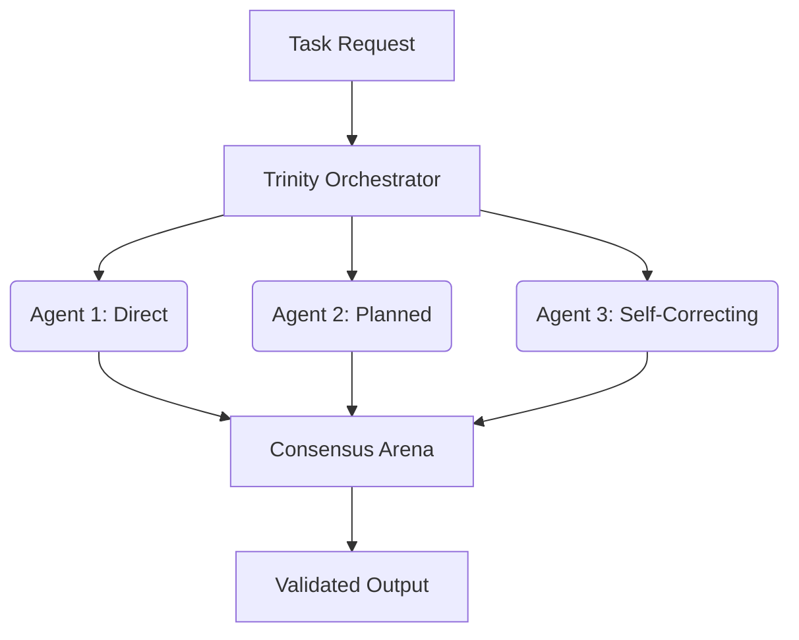

# Allele Frequency Analyzer & Trinity Mode

The GenOS UI dashboard is equipped with advanced monitoring and deployment functionalities that act directly upon the evolutionary trajectory of the agent fleet. These tools shift the paradigm from singular agent debugging to population-level optimization and critical redundancy.

## Allele Frequency Analyzer

The Allele Frequency Analyzer constitutes a population-level telemetry system. It continuously monitors the emergence, propagation, and ultimate success rate of specific traits (genes) across the entire fleet of active agents. By evaluating the phenotypic expressions of underlying agent prompts and configurations, it classifies traits into three distinct categories:

- **`dominant_beneficial`**: A trait that systematically yields successful, high-quality outcomes. Upon detection, the GenOS orchestrator actively reinforces and distributes this allele throughout the fleet, ensuring rapid evolutionary convergence toward optimal architectural solutions.
- **`lethal`**: A trait that directly leads to systematic failures—such as fatal crashes, severe hallucination loops, or critical reasoning breakdowns. The analyzer triggers immediate suppression mechanisms to purge this allele from the population pool, preventing cascading degradation.
- **`neutral`**: A trait that exhibits no statistically measurable impact on the agent's performance or survival probability. These alleles may be maintained as latent potential or vestigial prompt structures, subject to genetic drift.

This macro-level analytical approach allows engineers and researchers to visualize and manipulate the genetic health of the entire agent ecosystem rather than attempting to debug isolated instances.

## Trinity Mode (Trinity Agent Deploy)

For mission-critical tasks where failure is unacceptable, GenOS automatically deploys the **Trinity Mode**. This structural pattern leverages cognitive redundancy to guarantee absolute resilience and output accuracy.

1. **Divergent Instantiation**: Three strictly isolated agents are instantiated simultaneously. Crucially, they are seeded with divergent configurations, system prompts, or underlying foundation models (e.g., `direct_author`, `planned_author`, `self_correcting_literary_author`).
2. **Parallel Resolution**: All three agents attempt to solve the identical problem space in complete isolation, establishing a competitive problem-solving environment.
3. **Consensus Phase**: Once the parallel tasks conclude, a consensus phase is initiated. Often facilitated by an evaluation arena or a specialized supervisor agent, this phase determines the final, optimal output by evaluating and synthesizing the strongest elements of each proposal.
4. **Cognitive Resilience**: This designed redundancy inherently guarantees cognitive resilience, heavily mitigating the risk of hallucinations, logical fallacies, or systemic reasoning errors that might compromise a single agent.

