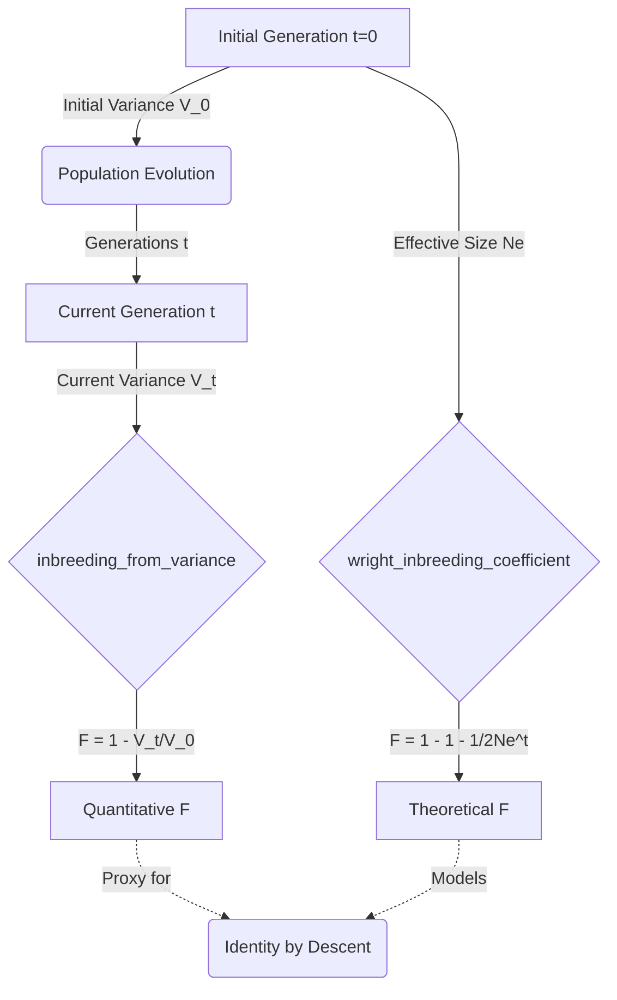

# Wright Inbreeding Coefficient

## Overview

In evolutionary biology and population genetics, the **Wright Inbreeding Coefficient ($F$)** measures the probability that two alleles at a given locus are identical by descent (IBD). In a finite population of effective size $N_e$, inbreeding naturally accumulates over generations due to genetic drift, as individuals eventually share common ancestors. As $F \to 1$, the population reproduces exclusively among relatives, leading to homozygosity and a reduction in overall genetic diversity.

In the **GenOS** quantitative infinitesimal model, we adapt this discrete-allele concept to continuous trait values (`f32`). Instead of measuring lost heterozygosity, we measure the **relative loss of genetic variance ($V_a$)**.

## Evolutionary Logic

In a randomly mating population of effective size $N_e$, the expected genetic variance decays predictably at each generation due to drift:

$$ V_t = V_{t-1} \times \left(1 - \frac{1}{2N_e}\right) $$

The Wright Inbreeding Coefficient $F_t$ after $t$ generations (assuming $F_0 = 0$) can be derived exactly as:

$$ F_t = 1 - \left(1 - \frac{1}{2N_e}\right)^t $$

Alternatively, empirical inbreeding can be deduced directly from the quantitative trait variance observed in the population compared to its founding generation:

$$ F = 1 - \frac{V_t}{V_0} $$

## Implementation in GenOS

The logic is strictly implemented in `crates/genos-eval/src/population.rs`.

### 1. Theoretical Calculation
The `wright_inbreeding_coefficient` function calculates the expected $F$ based strictly on population size and elapsed generations.

```rust
pub fn wright_inbreeding_coefficient(effective_size: f64, generations: u32) -> f64 {
    if effective_size <= 0.0 {
        return 1.0;
    }
    let per_generation = 1.0 - 1.0 / (2.0 * effective_size);
    1.0 - per_generation.powi(generations as i32)
}
```

### 2. Empirical Quantitative Calculation
The `inbreeding_from_variance` function calculates $F$ based on the continuous genetic variance proxy. This operates by comparing the initial variance (`variance_initial`) to the current variance (`variance_current`).

```rust
pub fn inbreeding_from_variance(variance_initial: f64, variance_current: f64) -> f64 {
    if variance_initial <= 0.0 {
        return 1.0;
    }
    (1.0 - variance_current / variance_initial).clamp(0.0, 1.0)
}
```

## Architecture & Flow



## Cross-References

- [Population Genetics Overview](06_population_genetics.md)
- [Founder Effect](10_founder_effect.md)
- Code Reference: `crates/genos-eval/src/population.rs`
