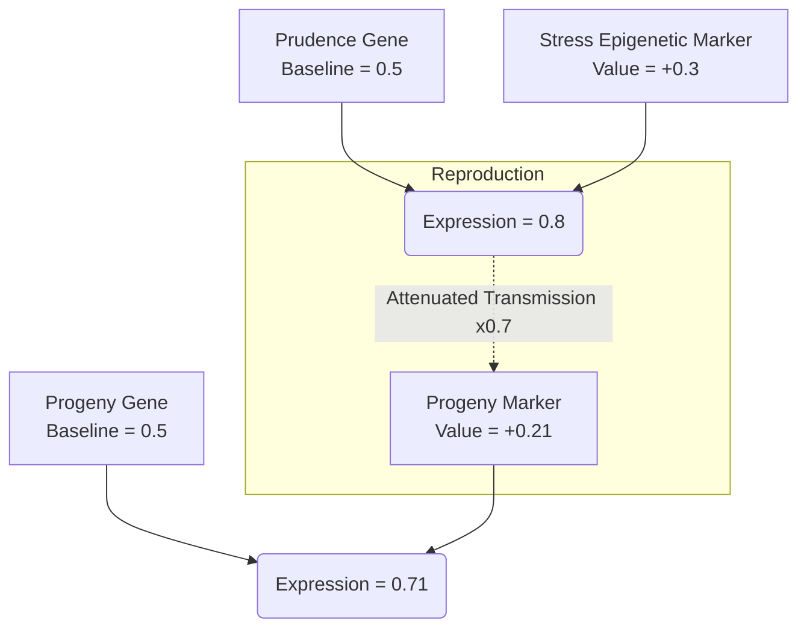

# 1. Epigenetics

This document details the epigenetic layer of GenOS. If the genome is the "hardware" (hard-coded instructions), epigenetics functions as the "software": it modulates how genes are expressed based on experience and contextual factors, without altering the underlying source code.

For details on how this regulates specific behavioral clusters, refer to [Gene Regulation](./02_gene_regulation.md).

---

## 1.1 Epigenetic Markers

### Agent Capabilities
Each genomic locus possesses an `epigenetic_marker` that acts to modulate the baseline expression of a given gene. The major advantage here is **hereditary dissipation**: when an agent reproduces, this marker is transmitted but attenuated (e.g., multiplied by a decay factor like 0.7).
This mechanism provides **short-term transgenerational memory**. If one generation of agents experiences an unstable environment (e.g., high stress or rate-limiting), their progeny will be spawned in a state of "high alert" (modified expression profile). If they subsequently develop in a stable, healthy environment, this trait will systematically fade across subsequent generations.

### Conceptual Schema

### Use Case
- **Rapid Swarm Adaptation**: A swarm attempts to consume a rate-limited API. The pioneer agents fail, develop an epigenetic marker corresponding to "execution slowness" or "caution", and their successors inherit this cautious pacing before even interacting with the API.

---

## 1.2 Chromatin, Methylation, and Histones (Architecture)

### Agent Capabilities
Within GenOS, textual DNA (instructions) can be dynamically "opened" (Euchromatin) or "condensed" (Heterochromatin) utilizing a `ChromatinVector`.
Euchromatin is actively injected into the LLM's active prompt. Conversely, Heterochromatin is masked from the prompt, yielding massive token savings (reducing prefill overhead by 60% to 80%), yet remains accessible in O(1) memory should the agent suddenly require it.
This introduces **absolute economic efficiency**. The agent conceptually possesses an encyclopedia of skills but only incurs token costs for the specific "page" it is currently reading.

For specific implementation details regarding context isolation, see [Epigenetic Pointers](./04_epigenetic_pointers.md), and for truth validation, see [DNA Methylation](./05_methylation_truth.md).

### Competitive Differentiation
- **Traditional Competitors**: Forced to choose between a gargantuan prompt (exorbitantly expensive, slow, suffers from attention dilution) or standard RAG (risky, non-deterministic semantic search).
- **GenOS**: The agent autonomously "condenses" dormant instructions and dynamically "decondenses" them on the fly based on environmental triggers.

---

## 1.3 Lamarckian Evolution and Acquired Inheritance

### Agent Capabilities
In contrast to pure Darwinian biology, GenOS explicitly permits Lamarckian inheritance (the transmission of characteristics acquired during the agent's lifespan). Through Direct Preference Optimization (DPO) mutations on validated trajectories, the agent dynamically rewrites its own genome prior to replication.
This yields **immediate capitalization of experience**. If an agent discovers a profound algorithmic exploit, it inscribes this insight directly into its DNA and propagates it to its progeny, drastically accelerating the convergence rate of the swarm.

### Comparative Example: Algorithmic Maze Navigation
| Agent Type | Action / Learning Mechanism | Next Generation Outcome |
|---|---|---|
| **Simple Agent** | Standard LLM; finds exit after 10 errors. | Restarts from zero on the next execution. |
| **Expert Agent** | Saves solution to a vector database. | Requires an explicit search query to recall; risks hallucinating the retrieval. |
| **GenOS Worker** | Utilizes Lamarckism to modify its `exploration_drive` based on encountered dead ends. | A cloned progeny will avoid identical errors, as its DNA has assimilated the experience. |
| **GenOS Orchestrator** | Extracts the Worker's trajectory and applies a `LamarckianMutation`. | Transforms a serendipitous discovery into a stable genetic trait for the entire future swarm. |

---

## 1.4 Waddington's Epigenetic Landscape

### Agent Capabilities
This embodies the concept of "canalization". An agent is spawned "pluripotent" (a generalist). As it progresses through a task, it "rolls down a valley" in Waddington's landscape, permanently locking certain genes and metamorphosing into a hyper-specialist (committed state). While it loses broad flexibility, it gains unprecedented operational efficiency for the specific task at hand.
