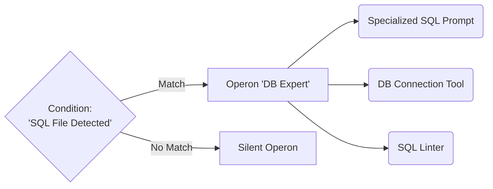

# 2. Gene Regulation

This document delineates how genes interact systematically and trigger conditionally within the GenOS architecture.

For details on how traits are dynamically shared between agents, refer to [Horizontal Transfer](./03_horizontal_transfer.md).

---

## 2.1 Operons and Promoters

### Agent Capabilities
In molecular biology, an operon is a cluster of genes regulated synchronously. In GenOS, an `Operon` serves as a **block-transferable unit of competency** (a discrete bundle containing a sub-prompt, an MCP tool, and a validator).
The "promoter" defines the precise activation condition for this block.
This introduces **extreme modularity**. Rather than deploying a monolithic agent, the GenOS agent functions as a dynamic assembly of operons that it can selectively activate or repress.

### Conceptual Schema

### Use Case
- **Hot-loading Competencies**: A generalist agent navigates a codebase. Upon opening a Dockerfile, its "Docker" promoter activates, deploying the entire operon (Docker tools and associated context) into its working memory. Upon exiting the file, the operon is repressed, immediately freeing token space.

### Competitive Differentiation
- **Traditional Competitors**: Require all tools (Tool Use / Function Calling) to be provided upfront, saturating the context window and exponentially increasing the probability of tool misuse.
- **GenOS**: Granular arsenal management. Tools are physically coupled to their operational context and activate exclusively upon satisfying their promoter conditions.

---

## 2.2 Gene Regulatory Networks (GRN)

### Agent Capabilities
Genes do not operate in isolation; they constitute a highly interconnected Gene Regulatory Network (GRN). A `RegulatorGene` is specialized exclusively to modulate the expression of other genes under predefined conditions.
Example: The logic "If `consecutive_failures` > 3, then modulate the exploration drive by +0.5" constitutes a *cis* (local) regulatory mechanism.
This provides **algorithmic homeostasis**. The agent dynamically self-regulates without necessitating an external Python supervisory script.

### Comparative Example: Handling Ambiguous Tasks
| Agent Type | Behavior | Consequence |
|---|---|---|
| **Simple Agent** | Hallucinates a random response. | Yields a false positive; error goes undetected. |
| **Expert Agent** | Highly-engineered prompt: "If you do not know, ask." | Susceptible to infinite loops of redundant clarification requests. |
| **GenOS Worker** | Its GRN detects high entropy (uncertainty). The 'Doubt' RegulatorGene represses the 'Action' gene and activates the 'Investigation' gene. | The agent autonomously shifts from a 'Coder' modality to a 'Researcher' modality until uncertainty metrics normalize. |
| **GenOS Orchestrator** | Designs GRN topologies to ensure workers avoid infinite deadlocks (preventing runaway feed-forward loops or chaotic repressilators). | Swarms maintain stability and resist divergence. |
